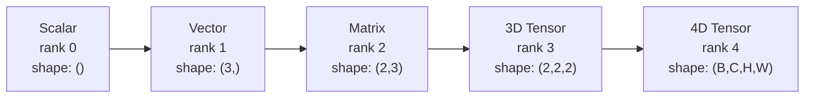
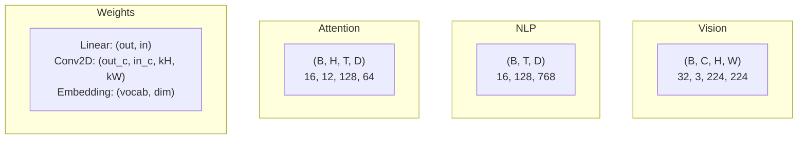
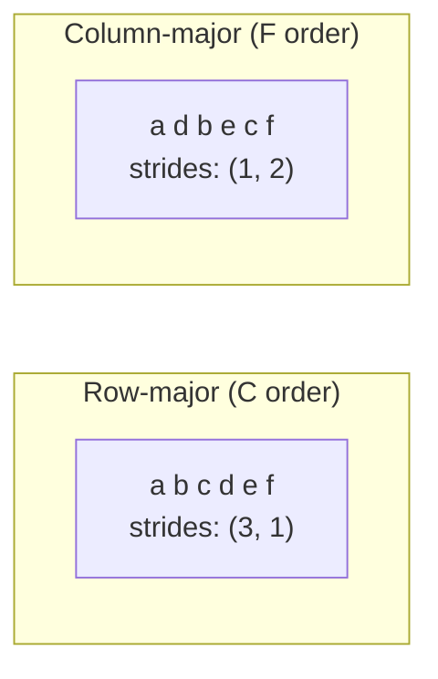
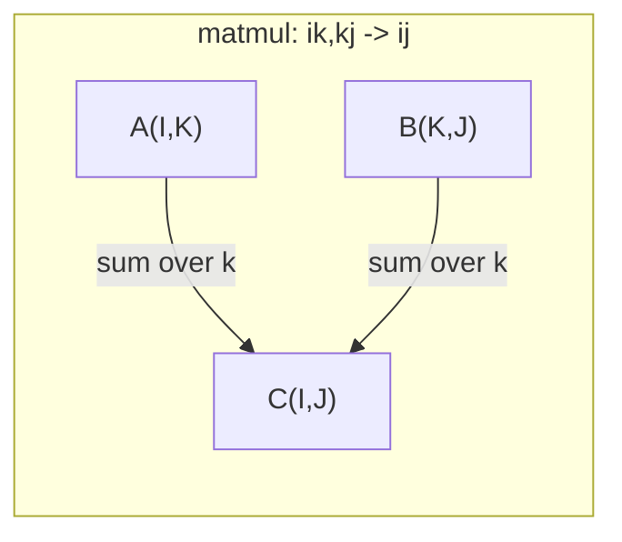

# Các hoạt động căng thẳng

> Các tensor là ngôn ngữ chung giữa dữ liệu và học tập sâu. Mỗi hình ảnh, mỗi câu, mọi gradient chảy qua chúng.

**Type:** Build
**Language:**Python
**Prerequisites:** Phase 1, Lessons 01 (Linear Algebra Intuition), 02 (Vectors, Matrices & Operations)
**Time:** ~90 minutes

## Mục tiêu học tập

- Thực hiện một lớp tensor với hình dạng, bước, tái hình, chuyển giao và các hoạt động thông minh về yếu tố từ đầu
- Sử dụng các quy tắc phát sóng để vận hành trên các tensor có hình dạng khác nhau mà không sao chép dữ liệu
- Viết biểu thức tổng số cho các sản phẩm chấm, nhân tử liệu, các sản phẩm bên ngoài và các hoạt động đợt
- Theo dõi các hình dạng tensor chính xác thông qua mỗi bước của sự chú ý đa đầu

## Vấn đề

Bạn xây dựng một biến đổi, đường đi trước trông sạch sẽ, bạn chạy nó và nhận được:`RuntimeError: mat1 and mat2 shapes cannot be multiplied (32x768 and 512x768)`Bạn nhìn vào hình dạng, bạn thử một chuyển thể.`Expected 4D input (got 3D input)`Anh thêm một cái không ép, cái gì đó khác bị vỡ.

Các lỗi hình dạng là lỗi phổ biến nhất trong mã học sâu. Chúng không khó khăn về mặt khái niệm - mỗi hoạt động có một hợp đồng hình dạng - nhưng chúng nhân nhanh. Một bộ biến đổi có hàng chục hình dạng, chuyển thể và phát sóng được nối với nhau. Một trục sai và các lỗi rơi vào vảy. Tệ hơn, một số sai lầm hình dạng không ném ra sai lầm. Họ lặng lẽ sản xuất rác bằng cách phát sóng theo chiều không đúng hoặc tổng hợp trên trục sai.

Các matrix xử lý các mối quan hệ đôi giữa hai bộ vật. Dữ liệu thực không phù hợp với hai chiều. Một loạt 32 hình ảnh RGB ở 224x224 là một tensor 4D:`(32, 3, 224, 224)`- Tự quan tâm với 12 đầu cũng là 4D:`(batch, heads, seq_len, head_dim)`Bạn cần một cấu trúc dữ liệu tổng quát đến bất kỳ số lượng kích thước nào, với các hoạt động kết hợp sạch trên tất cả chúng.

## Khái niệm

### Tensor là gì

Một tensor là một mảng số đa chiều với một loại dữ liệu đồng nhất.**rank**(hoặc **order**(trước đó, mỗi chiều kích là một**axis**- **shape**là một tuple liệt kê kích thước dọc theo mỗi trục.



Tổng số các yếu tố = sản phẩm của tất cả các kích thước.`(2, 3, 4)`giữ `2 * 3 * 4 = 24`Các yếu tố.

### Các hình dạng căng thẳng trong học tập sâu

Các loại dữ liệu khác nhau được lập bản đồ cho các hình dạng tensor cụ thể theo quy ước.



PyTorch sử dụng NCHW (channels-first). TensorFlow mặc định cho NHWC (channels-last).

### Cách bố cục bộ nhớ hoạt động

Một mảng 2D trong bộ nhớ là một chuỗi 1D của các byte. **Strides**cho bạn biết có bao nhiêu yếu tố để bỏ qua để di chuyển một bước dọc theo mỗi trục.



Transpose không di chuyển dữ liệu. Nó thay đổi các bước, tạo ra tensor **non-contiguous**-- các yếu tố của một dãy không còn lân cận trong bộ nhớ.

### Quy tắc phát thanh

Truyền thông cho phép bạn vận hành trên các tensor hình dạng khác nhau mà không sao chép dữ liệu. Các hình dạng sắp xếp từ bên phải. Hai chiều kích tương thích khi chúng bằng hoặc một là 1.

```
Tensor A:     (8, 1, 6, 1)
Tensor B:        (7, 1, 5)
Padded B:     (1, 7, 1, 5)
Result:       (8, 7, 6, 5)
```

### Einsum: hoạt động tensor phổ quát

Einstein tổng kết gắn nhãn mỗi trục bằng một chữ cái. trục trong đầu vào nhưng không đầu ra được tổng hợp. Trục trong cả hai được giữ.



Các mô hình chính: `i,i->`(sản phẩm điểm), `i,j->ij`(tài sản xuất), `ii->`(đánh dấu), `ij->ji`(đưa ra),`bij,bjk->bik`(các bộ phận),`bhtd,bhsd->bhts`(Công điểm chú ý).

```figure
tensor-broadcast
```

## Hãy xây dựng nó

Mã sống trong `code/tensors.py`Mỗi bước đều đề cập đến việc thực hiện ở đó.

### Bước 1: Tăng suất lưu trữ và bước

Một tensor lưu trữ một danh sách số bằng phẳng cộng với metadata hình dạng.

```python
class Tensor:
    def __init__(self, data, shape=None):
        if isinstance(data, (list, tuple)):
            self._data, self._shape = self._flatten_nested(data)
        elif isinstance(data, np.ndarray):
            self._data = data.flatten().tolist()
            self._shape = tuple(data.shape)
        else:
            self._data = [data]
            self._shape = ()

        if shape is not None:
            total = reduce(lambda a, b: a * b, shape, 1)
            if total != len(self._data):
                raise ValueError(
                    f"Cannot reshape {len(self._data)} elements into shape {shape}"
                )
            self._shape = tuple(shape)

        self._strides = self._compute_strides(self._shape)

    @staticmethod
    def _compute_strides(shape):
        if len(shape) == 0:
            return ()
        strides = [1] * len(shape)
        for i in range(len(shape) - 2, -1, -1):
            strides[i] = strides[i + 1] * shape[i + 1]
        return tuple(strides)
```

Để hình dạng `(3, 4)`, bước tiến là`(4, 1)`-- bỏ qua 4 yếu tố để tiến lên một hàng, bỏ qua 1 yếu tố để tiến lên một cột.

### Bước 2: Tạo lại, nén, nén

Tạo lại hình dạng mà không thay đổi thứ tự của các yếu tố.`-1`cho một chiều để suy luận kích thước của nó.

```python
t = Tensor(list(range(12)), shape=(2, 6))
r = t.reshape((3, 4))
r = t.reshape((-1, 3))
```

Squeeze loại bỏ trục kích thước 1. Uncpress inserts one. Uncpressing là quan trọng cho phát sóng - một vector bias`(D,)`thêm vào một lô `(B, T, D)`cần không bị ép buộc`(1, 1, D)`- Tôi không biết.

```python
t = Tensor(list(range(6)), shape=(1, 3, 1, 2))
s = t.squeeze()
v = Tensor([1, 2, 3])
u = v.unsqueeze(0)
```

### Bước 3: Chuyển và chuyển đổi

Transpose swaps hai trục, Permute sắp xếp lại tất cả trục, đây là cách bạn chuyển đổi giữa NCHW và NHWC.

```python
mat = Tensor(list(range(6)), shape=(2, 3))
tr = mat.transpose(0, 1)

t4d = Tensor(list(range(24)), shape=(1, 2, 3, 4))
perm = t4d.permute((0, 2, 3, 1))
```

Sau khi chuyển hoặc chuyển đổi, tensor không liên kết trong bộ nhớ.`view`thất bại trên các tensor không liên kết -- sử dụng `reshape`hoặc gọi`.contiguous()`Đầu tiên.

### Bước 4: Các hoạt động và giảm tính theo các yếu tố

Các hoạt động thông minh về các yếu tố (lập thêm, nhân, trừ) áp dụng độc lập cho mỗi yếu tố và giữ lại hình dạng.

```python
a = Tensor([[1, 2], [3, 4]])
b = Tensor([[10, 20], [30, 40]])
c = a + b
d = a * 2
s = a.sum(axis=0)
```

Trung bình toàn cầu tập hợp trong một CNN: `(B, C, H, W).mean(axis=[2, 3])`sản xuất `(B, C)`. Tỷ lệ liên tục trung bình tập hợp trong NLP: `(B, T, D).mean(axis=1)`sản xuất `(B, D)`- Tôi không biết.

### Bước 5: Truyền thông với NumPy

- `demo_broadcasting_numpy()`chức năng trong `tensors.py`cho thấy các mô hình cốt lõi.

```python
activations = np.random.randn(4, 3)
bias = np.array([0.1, 0.2, 0.3])
result = activations + bias

images = np.random.randn(2, 3, 4, 4)
scale = np.array([0.5, 1.0, 1.5]).reshape(1, 3, 1, 1)
result = images * scale

a = np.array([1, 2, 3]).reshape(-1, 1)
b = np.array([10, 20, 30, 40]).reshape(1, -1)
outer = a * b
```

Khoảng cách qua phát sóng: tái định dạng `(M, 2)`đến`(M, 1, 2)`và `(N, 2)`đến`(1, N, 2)`, trừ, vuông, cộng dọc theo trục cuối cùng, lấy gốc vuông. Kết quả: `(M, N)`- Tôi không biết.

### Bước 6: Các hoạt động của Einsum

- `demo_einsum()`và `demo_einsum_gallery()`các hàm đi qua mọi mô hình chung.

```python
a = np.array([1.0, 2.0, 3.0])
b = np.array([4.0, 5.0, 6.0])
dot = np.einsum("i,i->", a, b)

A = np.array([[1, 2], [3, 4], [5, 6]], dtype=float)
B = np.array([[7, 8, 9], [10, 11, 12]], dtype=float)
matmul = np.einsum("ik,kj->ij", A, B)

batch_A = np.random.randn(4, 3, 5)
batch_B = np.random.randn(4, 5, 2)
batch_mm = np.einsum("bij,bjk->bik", batch_A, batch_B)
```

Chi phí tính toán của một sự suy giảm là sản phẩm của tất cả các kích thước chỉ số (được giữ và cộng lại).`bij,bjk->bik`với B=32, I=128, J=64, K=128: `32 * 128 * 64 * 128 = 33,554,432`số cộng nhiều.

### Bước 7: Cơ chế chú ý qua einsum

- `demo_attention_einsum()`chức năng thực hiện nhiều đầu chú ý cuối đến cuối.

```python
B, H, T, D = 2, 4, 8, 16
E = H * D

X = np.random.randn(B, T, E)
W_q = np.random.randn(E, E) * 0.02

Q = np.einsum("bte,ek->btk", X, W_q)
Q = Q.reshape(B, T, H, D).transpose(0, 2, 1, 3)

scores = np.einsum("bhtd,bhsd->bhts", Q, K) / np.sqrt(D)
weights = softmax(scores, axis=-1)
attn_output = np.einsum("bhts,bhsd->bhtd", weights, V)

concat = attn_output.transpose(0, 2, 1, 3).reshape(B, T, E)
output = np.einsum("bte,ek->btk", concat, W_o)
```

Mỗi bước là một hoạt động tensor: chiếu (matmul qua einsum), phân chia đầu (reform + transpose), điểm chú ý (batch matmul qua einsum), tổng trọng lượng (batch matmul qua einsum), đầu hợp (transpose + reshape), chiếu đầu ra (matmul qua einsum).

## Sử dụng nó

### Scratch vs NumPy

| Operation | Scratch (Tensor class) | NumPy |
|---|---|---|
| Create | `Tensor([[1,2],[3,4]])` | `np.array([[1,2],[3,4]])` |
| Reshape | `t.reshape((3,4))` | `a.reshape(3,4)` |
| Transpose | `t.transpose(0,1)` | `a.T` or `a.transpose(0,1)` |
| Squeeze | `t.squeeze(0)` | `np.squeeze(a, 0)` |
| Sum | `t.sum(axis=0)` | `a.sum(axis=0)` |
| Einsum | N/A | `np.einsum("ij,jk->ik", a, b)` |

### Scratch vs PyTorch

```python
import torch

t = torch.tensor([[1, 2, 3], [4, 5, 6]], dtype=torch.float32)
t.shape
t.stride()
t.is_contiguous()

t.reshape(3, 2)
t.unsqueeze(0)
t.transpose(0, 1)
t.transpose(0, 1).contiguous()

torch.einsum("ik,kj->ij", A, B)
```

PyTorch thêm autograd, hỗ trợ GPU và các hạt nhân BLAS tối ưu hóa.

### Mỗi lớp mạng thần kinh như một hoạt động tensor

| Operation | Tensor Form | Einsum |
|---|---|---|
| Linear layer | `Y = X @ W.T + b` | `"bd,od->bo"` + bias |
| Attention QKV | `Q = X @ W_q` | `"btd,dh->bth"` |
| Attention scores | `Q @ K.T / sqrt(d)` | `"bhtd,bhsd->bhts"` |
| Attention output | `softmax(scores) @ V` | `"bhts,bhsd->bhtd"` |
| Batch norm | `(X - mu) / sigma * gamma` | element-wise + broadcast |
| Softmax | `exp(x) / sum(exp(x))` | element-wise + reduction |

## Chuyển nó

Bài học này tạo ra hai lời nhắc lặp lại:

1. **`outputs/prompt-tensor-shapes.md`**-- Một lời nhắc hệ thống để gỡ lỗi sự không phù hợp hình dạng tensor. Bao gồm các bảng quyết định cho mỗi hoạt động chung (matmul, broadcast, cat, linear, Conv2d, BatchNorm, softmax) và một bảng tìm kiếm sửa chữa.

2. **`outputs/prompt-tensor-debugger.md`**-- Một lời nhắc sửa lỗi từng bước bạn dán vào bất kỳ trợ lý AI nào khi một lỗi hình dạng đang chặn bạn. Đưa nó thông điệp lỗi và hình dạng tensor của bạn, lấy lại chính xác sửa chữa.

## Các bài tập

1. **Easy -- Reshape round-trip.**Hãy lấy một tensor hình dạng `(2, 3, 4)`- Đổi lại nó để `(6, 4)`, sau đó là `(24,)`, rồi quay lại `(2, 3, 4)`. Định trình các yếu tố xác minh được duy trì tại mỗi bước bằng cách in dữ liệu phẳng.

2. **Medium -- Implement broadcasting.**Tăng `Tensor`lớp với một `broadcast_to(shape)`phương pháp mở rộng kích thước 1 để phù hợp với một hình mục tiêu.`_elementwise_op`để phát sóng tự động trước khi hoạt động.`(3, 1)`và `(1, 4)`sản xuất `(3, 4)`- Tôi không biết.

3. **Hard -- Build einsum from scratch.**Thực hiện một cơ bản `einsum(subscripts, *tensors)`hàm xử lý ít nhất: sản phẩm điểm (`i,i->`), số tử số (`ij,jk->ik`), sản phẩm bên ngoài (`i,j->ij`), và chuyển giao (`ij->ji`). Phân tích chuỗi chữ viết dưới, xác định các chỉ số bị ký kết, và vòng lặp trên tất cả các kết hợp chỉ số. So sánh kết quả của bạn với `np.einsum`- Tôi không biết.

4. **Hard -- Attention shape tracker.**Viết một hàm có tính`batch_size`- `seq_len`- `embed_dim`, và`num_heads`như đầu vào và in ấn hình dạng chính xác tại mỗi bước của nhiều đầu chú ý: đầu vào, Q / K / V dự đoán, đầu chia, điểm chú ý, trọng lượng mềmmax, tổng cân, đầu hợp, đầu ra.`demo_attention_einsum()`đầu ra.

## Các điều khoản chính

| Term | What people say | What it actually means |
|---|---|---|
| Tensor | "A matrix but more dimensions" | A multi-dimensional array with uniform type and defined shape, strides, and operations |
| Rank | "The number of dimensions" | The number of axes. A matrix has rank 2, not rank equal to its matrix rank |
| Shape | "The size of the tensor" | A tuple listing the size along each axis. `(2, 3)` means 2 rows, 3 columns |
| Stride | "How memory is laid out" | The number of elements to skip to advance one position along each axis |
| Broadcasting | "It just works when shapes differ" | A strict set of rules: align from right, dimensions must be equal or one must be 1 |
| Contiguous | "The tensor is normal" | Elements stored sequentially in memory with no gaps or reordering from the logical layout |
| Einsum | "A fancy way to write matmul" | A general notation that expresses any tensor contraction, outer product, trace, or transpose in one line |
| View | "Same as reshape" | A tensor sharing the same memory buffer but with different shape/stride metadata. Fails on non-contiguous data |
| Contraction | "Summing over an index" | The general operation where a shared index between tensors is multiplied and summed, producing a lower-rank result |
| NCHW / NHWC | "PyTorch vs TensorFlow format" | Memory layout conventions for image tensors. NCHW puts channels before spatial dims, NHWC puts them after |

## Đọc thêm

- [NumPy Broadcasting](https://numpy.org/doc/stable/user/basics.broadcasting.html)-- Các quy tắc kinh thánh với các ví dụ trực quan
- [PyTorch Tensor Views](https://pytorch.org/docs/stable/tensor_view.html)- Khi xem hoạt động và khi họ sao chép
- [einops](https://github.com/arogozhnikov/einops)-- Một thư viện làm cho việc tái định hình tensor dễ đọc và an toàn
- [The Illustrated Transformer](https://jalammar.github.io/illustrated-transformer/)- Hình ảnh hình dạng tensor chảy qua sự chú ý
- [Einstein Summation in NumPy](https://numpy.org/doc/stable/reference/generated/numpy.einsum.html)-- Tài liệu tổng hợp đầy đủ với ví dụ
