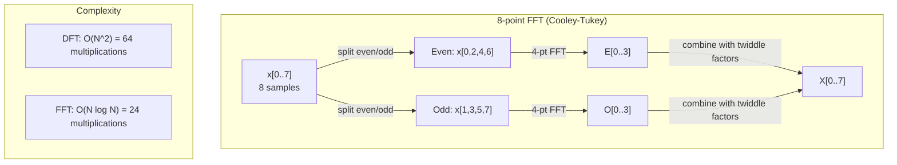
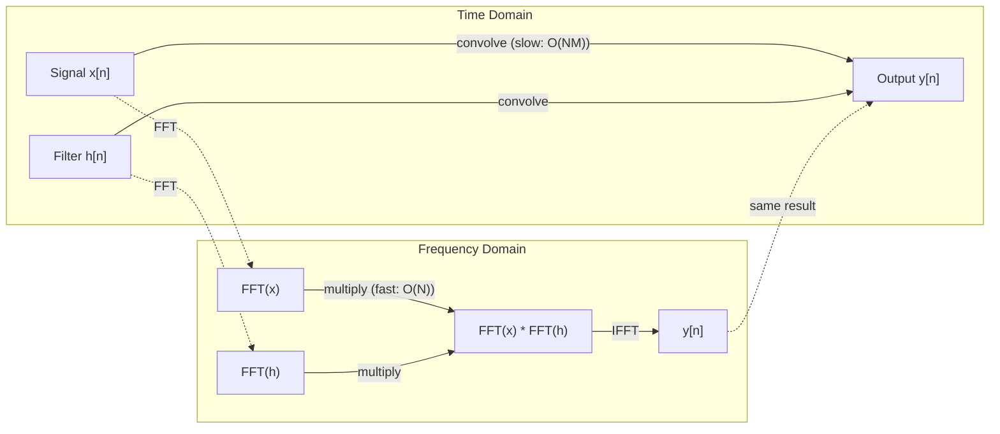

# Phong cách Fourier

> Mỗi tín hiệu là tổng số sóng âm đạo.

**Type:** Build
**Language:**Python
**Prerequisites:** Phase 1, Lessons 01-04, 19 (complex numbers)
**Time:** ~90 minutes

## Mục tiêu học tập

- Thực hiện DFT từ đầu và xác minh nó so với O(N log N) Cooley-Tukey FFT
- Giải thích các tỷ lệ tần số: lấy âm lượng, pha và quang phổ điện từ tín hiệu
- Sử dụng định lý convolution để thực hiện convolution thông qua nhân FFT
- Kết nối phân hủy tần số Fourier với các mã hóa vị trí biến đổi và các lớp convolution CNN

## Vấn đề

Một bản ghi âm là một chuỗi các phép đo áp suất theo thời gian. Giá cổ phiếu là một chuỗi các giá trị trong nhiều ngày. Một hình ảnh là một lưới cường độ pixel trên không gian. Tất cả những dữ liệu này là dữ liệu trong lĩnh vực thời gian (hoặc lĩnh vực không gian). Bạn thấy các giá trị thay đổi trên một số chỉ số.

Nhưng nhiều mô hình không thể nhìn thấy trong phạm vi thời gian. tín hiệu âm thanh này là một âm thanh tinh khiết hay một hợp âm? Giá cổ phiếu này có chu kỳ hàng tuần?

Chuyển đổi Fourier chuyển đổi dữ liệu từ miền thời gian sang miền tần số. Nó lấy một tín hiệu và phân hủy nó thành sóng âm của tần số khác nhau. Mỗi sóng âm có một cường độ (nhiều mạnh nó là) và một giai đoạn (nơi nó bắt đầu). Chuyển đổi Fourier cho bạn biết cả hai.

Điều này quan trọng đối với ML bởi vì tư duy về phạm vi tần số xuất hiện khắp nơi. Các mạng thần kinh hoóc tụng thực hiện hoóc tụng, đó là nhân trong lĩnh vực tần số. Các mã hóa vị trí biến đổi sử dụng phân hủy tần số để đại diện cho vị trí. Các mô hình âm thanh (tự nhận dạng giọng nói, phát âm) hoạt động trên quang phổ - đại diện tần số của âm thanh. Các mô hình chuỗi thời gian tìm kiếm các mô hình định kỳ. Hiểu được biến đổi Fourier cho bạn từ vựng để làm việc với tất cả những điều này.

## Khái niệm

### Định nghĩa DFT

Với các mẫu N x[0], x[1], ..., x[N-1], biến đổi Fourier riêng biệt tạo ra các hệ số tần số N X[0], X[1], ..., X[N-1]:

```
X[k] = sum_{n=0}^{N-1} x[n] * e^(-2*pi*i*k*n/N)

for k = 0, 1, ..., N-1
```

Mỗi X[k] là một số phức tạp. Độ lớn của nó. X[k] cũng cho bạn biết độ dải tần số k.

Những thông tin quan trọng:`e^(-2*pi*i*k*n/N)`là một phasor quay ở tần số k. DFT tính toán mối tương quan giữa tín hiệu và mỗi tần số N cùng không gian. Nếu tín hiệu chứa năng lượng ở tần số k, mối tương quan lớn. Nếu không, nó gần bằng không.

### Điều gì mỗi hệ số có nghĩa là

**X[0]: the DC component.**Đây là tổng của tất cả các mẫu -- tương xứng với trung bình. Nó đại diện cho sự thay thế liên tục (tần số không) của tín hiệu.

```
X[0] = sum_{n=0}^{N-1} x[n] * e^0 = sum of all samples
```

**X[k] for 1 <= k <= N/2: positive frequencies.**X[k] đại diện cho các chu kỳ tần số k cho mỗi mẫu N. Tần số cao hơn k có nghĩa là tần số cao hơn (sự dao động nhanh hơn).

**X[N/2]: the Nyquist frequency.**Tần số cao nhất bạn có thể đại diện với các mẫu N. Trên đây, bạn có được biệt danh - tần số cao che giấu như thấp.

**X[k] for N/2 < k < N: negative frequencies.**Đối với các tín hiệu có giá trị thực, X[N-k] = conj(X[k]). Tần số âm là hình ảnh gương của các tín hiệu tích cực.

### DFT ngược

DFT ngược tái tạo tín hiệu ban đầu từ các hệ số tần số của nó:

```
x[n] = (1/N) * sum_{k=0}^{N-1} X[k] * e^(2*pi*i*k*n/N)

for n = 0, 1, ..., N-1
```

Sự khác biệt duy nhất từ DFT phía trước: dấu hiệu trong nhân tố là tích cực (không âm), và có một yếu tố bình thường hóa 1/N.

DFT ngược là tái tạo hoàn hảo. Không có thông tin bị mất. Bạn có thể đi từ miền thời gian đến miền tần số và trở lại mà không có bất kỳ lỗi nào. DFT là một sự thay đổi cơ sở - nó tái thể hiện cùng một thông tin trong một hệ thống phối hợp khác.

### FFT: làm cho nó nhanh chóng

DFT như được định nghĩa ở trên là O(N^2): cho mỗi số nhân đầu ra N, bạn tổng cộng trên các mẫu đầu vào N. Đối với N = 1 triệu, đó là 10^12 hoạt động.

Phương pháp chuyển đổi Fourier nhanh (FFT) tính toán kết quả tương tự trong O N log N. Đối với N = 1 triệu, đó là khoảng 20 triệu hoạt động thay vì một nghìn tỷ.

Quá trình Cooley-Tukey (FFT phổ biến nhất) hoạt động bằng cách chia và chinh phục:

1. Chia tín hiệu thành các mẫu được lập chỉ số bằng và không cùng.
2. Xét DFT của mỗi nửa theo cách tái tạo.
3. Kết hợp hai DFT nửa kích thước bằng cách sử dụng "twivel factors" e^(-2*pi*i*k/N).

```
X[k] = E[k] + e^(-2*pi*i*k/N) * O[k]          for k = 0, ..., N/2 - 1
X[k + N/2] = E[k] - e^(-2*pi*i*k/N) * O[k]    for k = 0, ..., N/2 - 1

where E = DFT of even-indexed samples
      O = DFT of odd-indexed samples
```

Sự đối xứng có nghĩa là mỗi cấp độ của sự tái tạo O(N) làm việc, và có các mức log2(N).



FFT yêu cầu chiều dài tín hiệu phải là một sức mạnh 2. Trong thực tế, tín hiệu được đánh giá bằng không đến sức mạnh tiếp theo của 2.

### Phân tích quang phổ

- **power spectrum**là X [k]^2 -- kích thước vuông của mỗi tần số. Nó cho thấy có bao nhiêu năng lượng ở mỗi tần số.

- **phase spectrum**là góc ((X[k]) -- sự bù đắp pha của mỗi tần số. Đối với hầu hết các nhiệm vụ phân tích, bạn quan tâm đến phổ năng lượng và bỏ qua pha.

```
Power at frequency k:  P[k] = |X[k]|^2 = X[k].real^2 + X[k].imag^2
Phase at frequency k:  phi[k] = atan2(X[k].imag, X[k].real)
```

### Phân giải tần số

Độ phân giải tần số của DFT phụ thuộc vào số lượng mẫu N và tỷ lệ lấy mẫu fs.

```
Frequency of bin k:      f_k = k * fs / N
Frequency resolution:    delta_f = fs / N
Maximum frequency:       f_max = fs / 2  (Nyquist)
```

Để giải quyết hai tần số gần nhau, bạn cần nhiều mẫu hơn. Để chụp tần số cao, bạn cần một tỷ lệ lấy mẫu cao hơn.

### Tiến lý convolution

Đây là một trong những kết quả quan trọng nhất trong xử lý tín hiệu và trực tiếp liên quan đến CNN.

**Convolution in the time domain equals pointwise multiplication in the frequency domain.**

```
x * h = IFFT(FFT(x) . FFT(h))

where * is convolution and . is element-wise multiplication
```

Tại sao điều này quan trọng:

- Sự xoắn trực tiếp của hai tín hiệu chiều dài N và M thực hiện các hoạt động O(N*M).
- Sự xoắn dựa trên FFT lấy O(N log N): biến đổi cả hai, nhân, biến đổi trở lại.
- Đối với các hạt nhân lớn, FFT convolution nhanh hơn đáng kể.
- Đây chính xác là những gì xảy ra trong các lớp convolutional với các lĩnh vực thụ thể lớn.

Lưu ý: DFT tính toán vòng tròn (sín đúc quanh). Đối với vòng tròn tuyến tính (không bao quanh), bằng cách không đúc cả hai tín hiệu dài N + M - 1 trước khi tính toán.



### Đường cửa sổ

DFT giả định tín hiệu là định kỳ - nó xử lý các mẫu N như một giai đoạn của một tín hiệu lặp lại vô hạn. Nếu tín hiệu không bắt đầu và kết thúc ở cùng một giá trị, điều này tạo ra sự gián đoạn ở biên giới, xuất hiện như hàm lượng tần số cao giả mạo. Điều này được gọi là rò rỉ quang phổ.

Windowing làm giảm rò rỉ bằng cách giảm tín hiệu xuống 0 ở cả hai đầu trước khi tính toán DFT.

Chiếc cửa sổ chung:

| Window | Shape | Main lobe width | Side lobe level | Use case |
|--------|-------|----------------|-----------------|----------|
| Rectangular | Flat (no window) | Narrowest | Highest (-13 dB) | When signal is exactly periodic in N samples |
| Hann | Raised cosine | Moderate | Low (-31 dB) | General purpose spectral analysis |
| Hamming | Modified cosine | Moderate | Lower (-42 dB) | Audio processing, speech analysis |
| Blackman | Triple cosine | Wide | Very low (-58 dB) | When side lobe suppression is critical |

```
Hann window:    w[n] = 0.5 * (1 - cos(2*pi*n / (N-1)))
Hamming window: w[n] = 0.54 - 0.46 * cos(2*pi*n / (N-1))
```

Sử dụng cửa sổ bằng cách nhân nó theo các yếu tố với tín hiệu trước DFT: `X = DFT(x * w)`- Tôi không biết.

### Các tính chất DFT

| Property | Time Domain | Frequency Domain |
|----------|-------------|-----------------|
| Linearity | a*x + b*y | a*X + b*Y |
| Time shift | x[n - k] | X[f] * e^(-2*pi*i*f*k/N) |
| Frequency shift | x[n] * e^(2*pi*i*f0*n/N) | X[f - f0] |
| Convolution | x * h | X * H (pointwise) |
| Multiplication | x * h (pointwise) | X * H (circular convolution, scaled by 1/N) |
| Parseval's theorem | sum \|x[n]\|^2 | (1/N) * sum \|X[k]\|^2 |
| Conjugate symmetry (real input) | x[n] real | X[k] = conj(X[N-k]) |

Lý thuyết của Parseval nói rằng tổng năng lượng là giống nhau trong cả hai lĩnh vực năng lượng được bảo tồn thông qua sự chuyển đổi.

### Kết nối với mã hóa vị trí

Transformer gốc sử dụng mã hóa vị trí chân lưng:

```
PE(pos, 2i)   = sin(pos / 10000^(2i/d_model))
PE(pos, 2i+1) = cos(pos / 10000^(2i/d_model))
```

Mỗi cặp kích thước (2i, 2i + 1) dao động ở tần số khác nhau. Tần số được phân cách theo hình học từ cao (thường độ 0,1) đến thấp (thường độ cuối cùng). Điều này cho mỗi vị trí một mô hình độc đáo trên tất cả các băng tần số - tương tự như cách các hệ số Fourier xác định một tín hiệu một cách độc đáo.

Các tính chất chính mà nó cung cấp:

- **Uniqueness:**Không có hai vị trí có mã hóa giống nhau.
- **Bounded values:**tội lỗi và cos luôn ở trong [-1, 1].
- **Relative position:**Việc mã hóa vị trí p + k có thể được thể hiện như một hàm tuyến tính của việc mã hóa ở vị trí p. Mô hình có thể học cách chú ý đến các vị trí tương đối.

### Kết nối với CNN

Một lớp convolution áp dụng một bộ lọc được học (kernel) vào đầu vào bằng cách trượt nó qua tín hiệu hoặc hình ảnh.

Theo định lý convolution, điều này tương đương với:
1. FFT đầu vào
2. FFT hạt nhân
3. Tăng nhiều trong phạm vi tần số
4. IFFT kết quả

Các thực hiện CNN tiêu chuẩn sử dụng sự xoắn tắt trực tiếp (nhanh hơn cho các lõi 3x3 nhỏ). Nhưng đối với các lõi lớn hoặc sự xoắn tắt toàn cầu, các cách tiếp cận dựa trên FFT nhanh hơn đáng kể. Một số kiến trúc (như FNet) thay thế sự chú ý hoàn toàn bằng FFT, đạt được độ chính xác cạnh tranh với O(N log N) thay vì phức tạp O(N^2).

### Phân quang và biến đổi Fourier thời gian ngắn

Một FFT đơn lẻ cho bạn nội dung tần số của toàn bộ tín hiệu, nhưng không cho bạn biết khi nào tần số đó xảy ra.

Phương pháp chuyển đổi Fourier thời gian ngắn (STFT) giải quyết vấn đề này bằng cách tính toán FFT trên các cửa sổ chồng chéo của tín hiệu. Kết quả là một quang phổ: một đại diện 2D với thời gian trên một trục và tần số trên một. Độ cường độ tại mỗi điểm cho thấy năng lượng tại tần số đó tại thời điểm đó.

```
STFT procedure:
1. Choose a window size (e.g., 1024 samples)
2. Choose a hop size (e.g., 256 samples -- 75% overlap)
3. For each window position:
   a. Extract the windowed segment
   b. Apply a Hann/Hamming window
   c. Compute FFT
   d. Store the magnitude spectrum as one column of the spectrogram
```

Spectrogram là đại diện đầu vào tiêu chuẩn cho các mô hình âm thanh ML. Mô hình nhận dạng giọng nói (Whisper, DeepSpeech) hoạt động trên các spectrogram mel - các spectrogram với tần số được lập bản đồ theo thang mel, phù hợp hơn với nhận thức giọng nói của con người.

### Tác giả

Nếu một tín hiệu chứa tần số trên fs/2 (tần số Nyquist), lấy mẫu ở tần số fs sẽ tạo ra các bản sao tên gọi. Một tín hiệu 90 Hz được lấy mẫu ở 100 Hz trông giống với tín hiệu 10 Hz. Không có cách nào để phân biệt chúng với các mẫu đơn độc.

```
Example:
  True signal: 90 Hz sine wave
  Sampling rate: 100 Hz
  Apparent frequency: 100 - 90 = 10 Hz

  The samples from the 90 Hz signal at 100 Hz sampling rate
  are identical to the samples from a 10 Hz signal.
  No amount of math can recover the original 90 Hz.
```

Đây là lý do tại sao các bộ chuyển đổi analog sang kỹ thuật số bao gồm các bộ lọc chống liêm mà loại bỏ tần số trên Nyquist trước khi lấy mẫu. Trong ML, liêm xuất hiện khi lấy mẫu xuống các bản đồ tính năng mà không cần lọc thấp thích hợp - một số kiến trúc giải quyết điều này bằng các lớp hợp nhất chống liêm.

### Việc làm bằng không không làm tăng độ phân giải

Một quan niệm sai lầm phổ biến: việc làm nét bằng không trước khi FFT cải thiện độ phân giải tần số. Nó không làm thế. Nét bằng không liên kết giữa các thùng tần số hiện có, cho bạn một quang phổ trông mượt mà hơn. Nhưng nó không thể tiết lộ chi tiết tần số không có trong các mẫu ban đầu.

Độ phân giải tần số thực sự chỉ phụ thuộc vào thời gian quan sát T = N / fs. Để giải quyết hai tần số tách biệt bởi delta_f, bạn cần ít nhất T = 1 / delta_f giây dữ liệu. Không có số lượng paddling không thay đổi giới hạn cơ bản này.

```figure
fourier-synthesis
```

## Hãy xây dựng nó

### Bước 1: DFT từ đầu

O(N^2) DFT theo dõi trực tiếp từ định nghĩa.

```python
import math

class Complex:
    ...

def dft(x):
    N = len(x)
    result = []
    for k in range(N):
        total = Complex(0, 0)
        for n in range(N):
            angle = -2 * math.pi * k * n / N
            w = Complex(math.cos(angle), math.sin(angle))
            xn = x[n] if isinstance(x[n], Complex) else Complex(x[n])
            total = total + xn * w
        result.append(total)
    return result
```

### Bước 2: DFT ngược

Cùng cấu trúc, nhân tích tích cực, chia bằng N.

```python
def idft(X):
    N = len(X)
    result = []
    for n in range(N):
        total = Complex(0, 0)
        for k in range(N):
            angle = 2 * math.pi * k * n / N
            w = Complex(math.cos(angle), math.sin(angle))
            total = total + X[k] * w
        result.append(Complex(total.real / N, total.imag / N))
    return result
```

### Bước 3: FFT (Cooley-Tukey)

FFT thu hồi đòi hỏi sức mạnh của 2 chiều dài. chia thành ngang và lẻ, thu hồi, kết hợp với các yếu tố trộn.

```python
def fft(x):
    N = len(x)
    if N <= 1:
        return [x[0] if isinstance(x[0], Complex) else Complex(x[0])]
    if N % 2 != 0:
        return dft(x)

    even = fft([x[i] for i in range(0, N, 2)])
    odd = fft([x[i] for i in range(1, N, 2)])

    result = [Complex(0)] * N
    for k in range(N // 2):
        angle = -2 * math.pi * k / N
        twiddle = Complex(math.cos(angle), math.sin(angle))
        t = twiddle * odd[k]
        result[k] = even[k] + t
        result[k + N // 2] = even[k] - t
    return result
```

### Bước 4: Các trợ lý phân tích quang phổ

```python
def power_spectrum(X):
    return [xk.real ** 2 + xk.imag ** 2 for xk in X]

def convolve_fft(x, h):
    N = len(x) + len(h) - 1
    padded_N = 1
    while padded_N < N:
        padded_N *= 2

    x_padded = x + [0.0] * (padded_N - len(x))
    h_padded = h + [0.0] * (padded_N - len(h))

    X = fft(x_padded)
    H = fft(h_padded)

    Y = [xk * hk for xk, hk in zip(X, H)]

    y = idft(Y)
    return [y[n].real for n in range(N)]
```

## Sử dụng nó

Đối với công việc thực, sử dụng Numpy's FFT được hỗ trợ bởi các thư viện C tối ưu hóa cao.

```python
import numpy as np

signal = np.sin(2 * np.pi * 5 * np.arange(256) / 256)
spectrum = np.fft.fft(signal)
freqs = np.fft.fftfreq(256, d=1/256)

power = np.abs(spectrum) ** 2

positive_freqs = freqs[:len(freqs)//2]
positive_power = power[:len(power)//2]
```

Đối với việc phân tích quang phổ cửa sổ và tiên tiến hơn:

```python
from scipy.signal import windows, stft

window = windows.hann(256)
windowed = signal * window
spectrum = np.fft.fft(windowed)
```

Đối với sự xoắn:

```python
from scipy.signal import fftconvolve

result = fftconvolve(signal, kernel, mode='full')
```

Đối với các quang phổ:

```python
from scipy.signal import stft

frequencies, times, Zxx = stft(signal, fs=sample_rate, nperseg=256)
spectrogram = np.abs(Zxx) ** 2
```

Các mô hình của các quang phổ có hình dạng (n_frequencies, n_time_frames). Mỗi cột là quang phổ năng lượng tại một cửa sổ thời gian. Đây là những gì các mô hình âm thanh ML tiêu thụ như là đầu vào.

## Chuyển nó

Đi chạy`code/fourier.py`để tạo ra `outputs/prompt-spectral-analyzer.md`- Tôi không biết.

## Các bài tập

1. **Pure tone identification.**Tạo một tín hiệu với một sóng âm đạo duy nhất ở tần số không rõ (trên 1 đến 50 Hz), lấy mẫu ở 128 Hz trong 1 giây. Sử dụng DFT của bạn để xác định tần số. Kiểm tra sự phù hợp của câu trả lời. Bây giờ thêm tiếng ồn Gaussian với độ lệch chuẩn 0,5 và lặp lại.

2. **FFT vs DFT verification.**Tạo ra một tín hiệu ngẫu nhiên dài 64. Xét cả DFT (O(N^2) và FFT. Kiểm tra xem tất cả các hệ số phù hợp với trong 1e-10. Thời gian cả hai hoạt động trên tín hiệu dài 256, 512, 1024, và 2048.

3. **Convolution theorem proof by example.**Tạo tín hiệu x = [1, 2, 3, 4, 0, 0, 0, 0] và lọc h = [1, 1, 1, 0, 0, 0, 0, 0]. Xét kết cấu vòng tròn trực tiếp (đường tròn). Sau đó tính bằng FFT (giải đổi, nhân, đảo ngược chuyển đổi).

4. **Windowing effects.**Tạo một tín hiệu là tổng hợp hai sóng âm đạo ở 10 Hz và 12 Hz (rất gần). lấy mẫu ở 128 Hz trong 1 giây. Xét quang phổ điện mà không có cửa sổ, cửa sổ Hann và cửa sổ Hamming.

5. **Positional encoding analysis.**Tạo các mã hóa vị trí hình âm cho d_model = 128 và max_pos = 512. Đối với mỗi cặp vị trí (p1, p2), tính toán sản phẩm điểm của mã hóa của họ.

## Các điều khoản chính

| Term | What it means |
|------|---------------|
| DFT (Discrete Fourier Transform) | Converts N time-domain samples into N frequency-domain coefficients. Each coefficient is the correlation with a complex sinusoid at that frequency |
| FFT (Fast Fourier Transform) | An O(N log N) algorithm to compute the DFT. The Cooley-Tukey algorithm splits even/odd indices recursively |
| Inverse DFT | Reconstructs the time-domain signal from frequency coefficients. Same formula as DFT with flipped exponent sign and 1/N scaling |
| Frequency bin | Each index k in the DFT output represents frequency k*fs/N Hz. The "bin" is the discrete frequency slot |
| DC component | X[0], the zero-frequency coefficient. Proportional to the signal mean |
| Nyquist frequency | fs/2, the maximum frequency representable at sampling rate fs. Frequencies above this alias |
| Power spectrum | \|X[k]\|^2, the squared magnitude of each frequency coefficient. Shows energy distribution across frequencies |
| Phase spectrum | angle(X[k]), the phase offset of each frequency component. Often ignored in analysis |
| Spectral leakage | Spurious frequency content caused by treating a non-periodic signal as periodic. Reduced by windowing |
| Window function | A tapering function (Hann, Hamming, Blackman) applied before DFT to reduce spectral leakage |
| Twiddle factor | The complex exponential e^(-2*pi*i*k/N) used to combine sub-DFTs in the FFT butterfly computation |
| Convolution theorem | Convolution in time domain equals pointwise multiplication in frequency domain. Fundamental to signal processing and CNNs |
| Circular convolution | Convolution where the signal wraps around. This is what the DFT naturally computes |
| Linear convolution | Standard convolution without wraparound. Achieved by zero-padding before DFT |
| Parseval's theorem | Total energy is preserved through the Fourier transform. sum \|x[n]\|^2 = (1/N) sum \|X[k]\|^2 |
| Aliasing | When frequencies above Nyquist appear as lower frequencies due to insufficient sampling rate |

## Đọc thêm

- [Cooley & Tukey: An Algorithm for the Machine Calculation of Complex Fourier Series (1965)](https://www.ams.org/journals/mcom/1965-19-090/S0025-5718-1965-0178586-1/)- giấy FFT ban đầu đã thay đổi máy tính
- [3Blue1Brown: But what is the Fourier Transform?](https://www.youtube.com/watch?v=spUNpyF58BY)- giới thiệu trực quan tốt nhất về biến Fourier
- [Lee-Thorp et al.: FNet: Mixing Tokens with Fourier Transforms (2021)](https://arxiv.org/abs/2105.03824)- thay thế sự chú ý tự mình bằng FFT trong các máy biến
- [Smith: The Scientist and Engineer's Guide to Digital Signal Processing](http://www.dspguide.com/)- sách giáo khoa trực tuyến miễn phí bao gồm FFT, cửa sổ và phân tích quang phổ sâu sắc
- [Vaswani et al.: Attention Is All You Need (2017)](https://arxiv.org/abs/1706.03762)- Mã hóa vị trí chân lưng có nguồn gốc từ phân hủy tần số Fourier
- [Radford et al.: Whisper (2022)](https://arxiv.org/abs/2212.04356)- nhận dạng giọng nói sử dụng các quang phổ mel như là đại diện đầu vào
