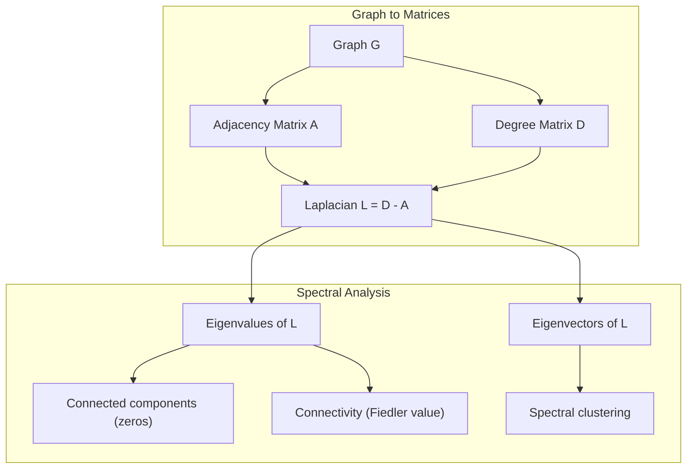
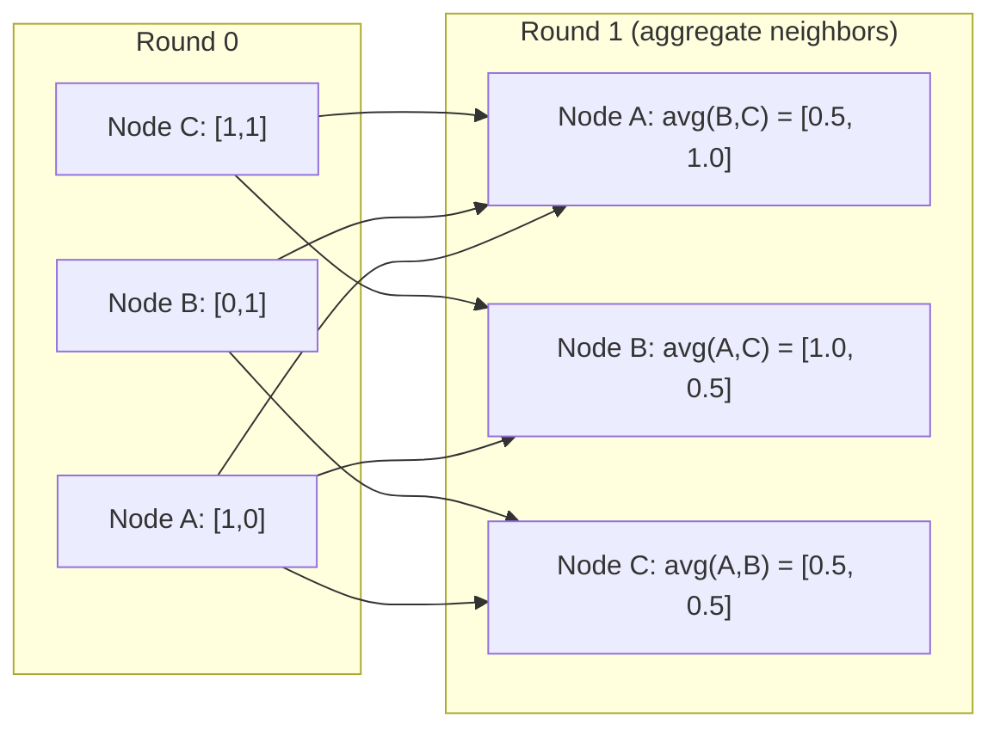

# Lý thuyết đồ họa cho học máy

> Hình đồ là cấu trúc dữ liệu của mối quan hệ. Nếu dữ liệu của bạn có kết nối, bạn cần lý thuyết đồ đồ.

**Type:** Build
**Language:**Python
**Prerequisites:** Phase 1, Lessons 01-03 (linear algebra, matrices)
**Time:** ~90 minutes

## Mục tiêu học tập

- Xây dựng một lớp đồ thị với các đại diện matrix / danh sách lân cận và thực hiện các đường xuyên BFS và DFS
- Xét đồ Laplacian và sử dụng giá trị riêng của nó để phát hiện các thành phần và nút cluster kết nối
- Thực hiện một vòng thông điệp kiểu GNN qua như là một phép nhân tử xấp xỉ bình thường
- Sử dụng cluster quang phổ để phân vùng biểu đồ bằng cách sử dụng vector Fiedler

## Vấn đề

Các mạng xã hội, phân tử, cơ sở kiến thức, mạng trích dẫn, bản đồ đường - tất cả đều là đồ thị. ML truyền thống xử lý dữ liệu như bảng phẳng. Mỗi hàng là độc lập. Mỗi tính năng là một cột. Nhưng khi cấu trúc của các kết nối quan trọng, bảng thất bại.

Hãy xem xét một mạng xã hội. Bạn muốn dự đoán một người dùng sẽ mua sản phẩm nào. Lịch sử mua hàng của họ quan trọng. Nhưng lịch sử mua hàng của bạn bè của họ quan trọng hơn. Các kết nối mang theo tín hiệu.

Hoặc hãy xem xét một phân tử. Bạn muốn dự đoán liệu nó có liên kết với một protein hay không. Các nguyên tử quan trọng, nhưng điều thực sự quan trọng là cách các nguyên tử liên kết với nhau.

Các mạng thần kinh đồ họa (GNN) là lĩnh vực phát triển nhanh nhất trong học tập sâu. Chúng thúc đẩy khám phá thuốc, khuyến nghị xã hội, phát hiện gian lận và lý luận đồ họa kiến thức.

Bạn cần bốn thứ:
1. Một cách để đại diện cho biểu đồ như các matrix (để bạn có thể nhân chúng)
2. Các thuật toán xuyên qua để khám phá cấu trúc đồ thị
3. Laplacian -- một số các ma trận quan trọng nhất trong lý thuyết đồ thị quang phổ
4. Thông điệp truyền -- hoạt động làm cho GNN hoạt động

## Khái niệm

### Hình đồ: nút và cạnh

Một biểu đồ G = (V, E) bao gồm các đỉnh (thắt nút) V và cạnh E. Mỗi cạnh kết nối hai nút.

**Directed vs undirected.**Trong biểu đồ không hướng, cạnh (u, v) có nghĩa là u kết nối với v Và v kết nối với u. Trong biểu đồ hướng (digraph), cạnh (u, v) có nghĩa là u chỉ đến v, nhưng không nhất thiết là ngược lại.

**Weighted vs unweighted.**Trong biểu đồ không cân nặng, cạnh có hoặc không có. Trong biểu đồ cân nặng, mỗi cạnh có trọng lượng số - khoảng cách, chi phí, sức mạnh.

| Graph type | Example |
|-----------|---------|
| Undirected, unweighted | Facebook friendship network |
| Directed, unweighted | Twitter follow network |
| Undirected, weighted | Road map (distances) |
| Directed, weighted | Web page links (PageRank scores) |

### Matrix gần nhau

Các matrix lân cận A là đại diện cốt lõi. Đối với một biểu đồ với n nút:

```
A[i][j] = 1    if there is an edge from node i to node j
A[i][j] = 0    otherwise
```

Đối với đồ thị không định hướng, A là đối xứng: A[i][j] = A[j][i]. Đối với đồ thị trọng lượng, A[i][j] = trọng lượng cạnh (i, j).

**Example -- a triangle:**

```
Nodes: 0, 1, 2
Edges: (0,1), (1,2), (0,2)

A = [[0, 1, 1],
     [1, 0, 1],
     [1, 1, 0]]
```

Các matrix lân cận là đầu vào cho mỗi GNN. Các hoạt động của matrix trên A tương ứng với các hoạt động trên biểu đồ.

### Bằng cấp

Độ độ của một nút là số lượng các cạnh kết nối với nó. Đối với biểu đồ hướng, bạn có độ độ (đến vào cạnh) và độ độ ngoài (đến ra cạnh).

Các số liệu của độ D là đường viền:

```
D[i][i] = degree of node i
D[i][j] = 0    for i != j
```

Ví dụ về tam giác: D = diag(2, 2, 2) bởi vì mỗi nút kết nối với hai nút khác.

Các mức độ cho bạn biết về tầm quan trọng của nút. cấp độ cao = nút nút. Phân bố cấp của một mạng cho thấy cấu trúc của nó. Các mạng xã hội tuân theo các luật năng lượng (một số ít nút, nhiều nút lá).

### BFS và DFS

Hai thuật toán chuyển giao đồ thị cơ bản.

**Breadth-First Search (BFS):**Tìm kiếm tất cả hàng xóm trước, sau đó là hàng xóm của hàng xóm.

```
BFS from node 0:
  Visit 0
  Queue: [1, 2]        (neighbors of 0)
  Visit 1
  Queue: [2, 3]        (add neighbors of 1)
  Visit 2
  Queue: [3]           (neighbors of 2 already visited)
  Visit 3
  Queue: []            (done)
```

BFS tìm thấy các con đường ngắn nhất trong đồ thị không cân nặng. Khoảng cách từ đầu đến bất kỳ nút nào bằng với mức BFS mà nút đó được phát hiện lần đầu tiên. Đây là lý do tại sao BFS được sử dụng cho khoảng cách đếm hop trong các mạng xã hội.

**Depth-First Search (DFS):**Đi sâu càng sâu càng tốt trước khi quay lại. sử dụng một đống (LIFO) hoặc tái tạo.

```
DFS from node 0:
  Visit 0
  Stack: [1, 2]        (neighbors of 0)
  Visit 2               (pop from stack)
  Stack: [1, 3]         (add neighbors of 2)
  Visit 3               (pop from stack)
  Stack: [1]
  Visit 1               (pop from stack)
  Stack: []             (done)
```

DFS hữu ích cho:
- Tìm các thành phần kết nối (để chạy DFS từ các nút chưa được truy cập)
- Khám phá chu kỳ (về phía sau trong cây DFS)
- Đánh phân topological (định dạng hoàn thành DFS ngược)

| Algorithm | Data structure | Finds | Use case |
|-----------|---------------|-------|----------|
| BFS | Queue | Shortest paths | Social network distance, knowledge graph traversal |
| DFS | Stack | Components, cycles | Connectivity, topological sort |

### Chữ đồ họa Laplacian

L = D - A. Các trận đấu quan trọng nhất trong lý thuyết đồ thị quang phổ.

Đối với tam giác:

```
D = [[2, 0, 0],    A = [[0, 1, 1],    L = [[2, -1, -1],
     [0, 2, 0],         [1, 0, 1],         [-1, 2, -1],
     [0, 0, 2]]         [1, 1, 0]]         [-1, -1,  2]]
```

Bạch laplacian có những đặc tính đáng chú ý:

1. **L is positive semi-definite.**Tất cả các giá trị riêng là >= 0.

2. **The number of zero eigenvalues equals the number of connected components.**Một biểu đồ kết nối có chính xác một giá trị riêng không. Một biểu đồ với 3 thành phần không kết nối có ba giá trị riêng không.

3. **The smallest non-zero eigenvalue (Fiedler value) measures connectivity.**Một giá trị Fiedler lớn có nghĩa là biểu đồ được kết nối tốt. một giá trị Fiedler nhỏ có nghĩa là biểu đồ có điểm yếu - một nút thắt chai.

4. **The eigenvector of the Fiedler value (Fiedler vector) reveals the best split.**Các nút có giá trị tích cực đi vào một nhóm, các nút có giá trị âm đi vào nhóm khác.



### Các đặc tính quang phổ

Các giá trị riêng của các matrix lân cận và Laplacian tiết lộ các tính chất cấu trúc mà không cần bất kỳ quá trình nào.

**Spectral clustering**làm như thế này:
1. Xét Laplacian L
2. Tìm các đối tượng tự nhỏ nhất của L (lỡ bỏ đầu tiên, là tất cả-one cho biểu đồ kết nối)
3. Sử dụng các vector tự như là các tọa độ mới cho mỗi nút
4. Đưa k-means trên các tọa độ đó

Tại sao điều này hoạt động? Các vector tự của L mã hóa các hàm "mơn mịn nhất" trên biểu đồ. Các nút kết nối tốt có được các giá trị vector tự tương tự. Các nút tách bằng nút bốc lấy các giá trị khác nhau. Các vector tự tự tự tự tự tách các cụm.

**Random walk connection.**Laplacian bình thường liên quan đến các bước ngẫu nhiên trên biểu đồ. Phân bố tĩnh của một bước ngẫu nhiên tương xứng với độ nút. Thời gian trộn (tốc độ bước ngẫu nhiên hội tụ) phụ thuộc vào khoảng cách quang phổ.

### Thông điệp qua

Các hoạt động cốt lõi của Graph Neural Networks. Mỗi nút thu thập thông điệp từ hàng xóm của nó, tổng hợp chúng và cập nhật trạng thái của riêng nó.

```
h_v^(k+1) = UPDATE(h_v^(k), AGGREGATE({h_u^(k) : u in neighbors(v)}))
```

Trong dạng đơn giản nhất, AGGREGATE = trung bình, và UPDATE = chuyển đổi tuyến tính + kích hoạt:

```
h_v^(k+1) = sigma(W * mean({h_u^(k) : u in neighbors(v)}))
```

Đây là sự nhân đếm của các khối tử liệu. Nếu H là các khối tử liệu của tất cả các tính năng nút và A là các khối tử liệu lân cận:

```
H^(k+1) = sigma(A_norm * H^(k) * W)
```

nơi A_norm là matrix lân cận bình thường (mỗi hàng tổng cộng lên 1).

Một vòng thông điệp truyền cho phép mỗi nút "xem" hàng xóm trực tiếp của nó. Hai vòng cho phép nó thấy hàng xóm của hàng xóm.



### Các khái niệm và ứng dụng ML

| Concept | ML Application |
|---------|---------------|
| Adjacency matrix | GNN input representation |
| Graph Laplacian | Spectral clustering, community detection |
| BFS/DFS | Knowledge graph traversal, path finding |
| Degree distribution | Node importance, feature engineering |
| Message passing | GNN layers (GCN, GAT, GraphSAGE) |
| Eigenvalues of L | Community detection, graph partitioning |
| Spectral clustering | Unsupervised node grouping |
| PageRank | Node importance, web search |

```figure
graph-degree-distribution
```

## Hãy xây dựng nó

### Bước 1: lớp biểu đồ từ đầu

```python
class Graph:
    def __init__(self, n_nodes, directed=False):
        self.n = n_nodes
        self.directed = directed
        self.adj = {i: {} for i in range(n_nodes)}

    def add_edge(self, u, v, weight=1.0):
        self.adj[u][v] = weight
        if not self.directed:
            self.adj[v][u] = weight

    def neighbors(self, node):
        return list(self.adj[node].keys())

    def degree(self, node):
        return len(self.adj[node])

    def adjacency_matrix(self):
        import numpy as np
        A = np.zeros((self.n, self.n))
        for u in range(self.n):
            for v, w in self.adj[u].items():
                A[u][v] = w
        return A

    def degree_matrix(self):
        import numpy as np
        D = np.zeros((self.n, self.n))
        for i in range(self.n):
            D[i][i] = self.degree(i)
        return D

    def laplacian(self):
        return self.degree_matrix() - self.adjacency_matrix()
```

Danh sách lân cận (`self.adj`Các matrix chuyển đổi lân cận sử dụng numpy vì tất cả các hoạt động quang phổ đều cần nó.

### Bước 2: BFS và DFS

```python
from collections import deque

def bfs(graph, start):
    visited = set()
    order = []
    distances = {}
    queue = deque([(start, 0)])
    visited.add(start)
    while queue:
        node, dist = queue.popleft()
        order.append(node)
        distances[node] = dist
        for neighbor in graph.neighbors(node):
            if neighbor not in visited:
                visited.add(neighbor)
                queue.append((neighbor, dist + 1))
    return order, distances


def dfs(graph, start):
    visited = set()
    order = []
    stack = [start]
    while stack:
        node = stack.pop()
        if node in visited:
            continue
        visited.add(node)
        order.append(node)
        for neighbor in reversed(graph.neighbors(node)):
            if neighbor not in visited:
                stack.append(neighbor)
    return order
```

BFS sử dụng một deque (trung hai cuối) cho O(1) pop left. DFS sử dụng một danh sách như một đống. Cả hai truy cập mỗi nút chính xác một lần - O(V + E) thời gian.

### Bước 3: Các thành phần kết nối và giá trị riêng Laplacian

```python
def connected_components(graph):
    visited = set()
    components = []
    for node in range(graph.n):
        if node not in visited:
            order, _ = bfs(graph, node)
            visited.update(order)
            components.append(order)
    return components


def laplacian_eigenvalues(graph):
    import numpy as np
    L = graph.laplacian()
    eigenvalues = np.linalg.eigvalsh(L)
    return eigenvalues
```

`eigvalsh`là đối với các số liệu đối xứng -- Laplacian luôn đối xứng với các biểu đồ không hướng. Nó trả lại các giá trị riêng theo thứ tự tăng lên.

### Bước 4: Nhóm phổ

```python
def spectral_clustering(graph, k=2):
    import numpy as np
    L = graph.laplacian()
    eigenvalues, eigenvectors = np.linalg.eigh(L)
    features = eigenvectors[:, 1:k+1]

    labels = np.zeros(graph.n, dtype=int)
    for i in range(graph.n):
        if features[i, 0] >= 0:
            labels[i] = 0
        else:
            labels[i] = 1
    return labels
```

Đối với k=2, dấu hiệu của vector Fiedler chia đồ thị thành hai cluster. Đối với k>2, bạn sẽ chạy k- trung bình trên các vector tự trị k đầu tiên (không bao gồm các vector tự trị tất cả).

### Bước 5: Gửi thông điệp

```python
def message_passing(graph, features, weight_matrix):
    import numpy as np
    A = graph.adjacency_matrix()
    row_sums = A.sum(axis=1, keepdims=True)
    row_sums[row_sums == 0] = 1
    A_norm = A / row_sums
    aggregated = A_norm @ features
    output = aggregated @ weight_matrix
    return output
```

Đây là một vòng thông điệp GNN. Các tính năng mới của mỗi nút là trung bình trọng lượng của các tính năng của hàng xóm của nó, được chuyển đổi bởi các khối lượng.

## Sử dụng nó

Với networkx và numpy, các hoạt động tương tự là một dòng:

```python
import networkx as nx
import numpy as np

G = nx.karate_club_graph()

A = nx.adjacency_matrix(G).toarray()
L = nx.laplacian_matrix(G).toarray()

eigenvalues = np.linalg.eigvalsh(L.astype(float))
print(f"Smallest eigenvalues: {eigenvalues[:5]}")
print(f"Connected components: {nx.number_connected_components(G)}")

communities = nx.community.greedy_modularity_communities(G)
print(f"Communities found: {len(communities)}")

pr = nx.pagerank(G)
top_nodes = sorted(pr.items(), key=lambda x: x[1], reverse=True)[:5]
print(f"Top 5 PageRank nodes: {top_nodes}")
```

networkx xử lý đồ thị bất kỳ kích thước nào với các nền C tối ưu hóa. Sử dụng nó trong sản xuất. Sử dụng thực hiện từ đầu của bạn để hiểu nó làm gì.

### Phân tích quang phổ numpy

```python
import numpy as np

A = np.array([
    [0, 1, 1, 0, 0],
    [1, 0, 1, 0, 0],
    [1, 1, 0, 1, 0],
    [0, 0, 1, 0, 1],
    [0, 0, 0, 1, 0]
])

D = np.diag(A.sum(axis=1))
L = D - A

eigenvalues, eigenvectors = np.linalg.eigh(L)
print(f"Eigenvalues: {np.round(eigenvalues, 4)}")
print(f"Fiedler value: {eigenvalues[1]:.4f}")
print(f"Fiedler vector: {np.round(eigenvectors[:, 1], 4)}")

fiedler = eigenvectors[:, 1]
group_a = np.where(fiedler >= 0)[0]
group_b = np.where(fiedler < 0)[0]
print(f"Cluster A: {group_a}")
print(f"Cluster B: {group_b}")
```

Các vector Fiedler làm việc nặng. mục tích cực trong một cluster, âm trong một cluster khác. Không cần tối ưu hóa lặp lại - chỉ một cấu trúc riêng.

## Chuyển nó

Bài học này mang lại:
- `outputs/skill-graph-analysis.md`-- một tài liệu tham khảo kỹ năng để phân tích dữ liệu có cấu trúc đồ thị

## Kết nối

| Concept | Where it shows up |
|---------|------------------|
| Adjacency matrix | GCN, GAT, GraphSAGE input |
| Laplacian | Spectral clustering, ChebNet filters |
| BFS | Knowledge graph traversal, shortest path queries |
| Message passing | Every GNN layer, neural message passing |
| Spectral gap | Graph connectivity, mixing time of random walks |
| Degree distribution | Power-law networks, node feature engineering |
| Connected components | Preprocessing, handling disconnected graphs |
| PageRank | Node importance ranking, attention initialization |

GNN xứng đáng được đề cập đặc biệt. Hoạt động xoắn gạch trong GCN (Kipf & Welling, 2017) sử dụng các matrix lân cận với tự vòng tự thêm, A_hat = A + I:

```text
H^(l+1) = sigma(D_hat^(-1/2) * A_hat * D_hat^(-1/2) * H^(l) * W^(l))
```

nơi A_hat = A + I (đối diện cộng với tự vòng lặp) và D_hat là các bậc tử của A_hat. Các vòng tự đảm bảo mỗi nút bao gồm các tính năng riêng của nó trong quá trình tổng hợp. Đây chính xác là thông điệp thông qua với bình thường hóa đối xứng. D_hat^(-1/2) * A_hat * D_hat^(-1/2) là các matrix lân cận bình thường. Laplacian xuất hiện bởi vì sự bình thường hóa này liên quan đến L_sym = I - D^(-1/2) * A * D^(-1/2). Hiểu Laplacian có nghĩa là hiểu tại sao GCN hoạt động.

## Các bài tập

1. **Implement PageRank from scratch.**Bắt đầu với điểm số đồng nhất. Ở mỗi bước: điểm số ((v) = (1-d) /n + d * tổng ((score(u) /out_degree(u)) cho tất cả u chỉ ra v. Sử dụng d = 0,85.

2. **Find communities using spectral clustering.**Tạo biểu đồ với hai cluster tách biệt rõ ràng (ví dụ, hai cluster kết nối bởi một cạnh duy nhất).

3. **Implement Dijkstra's algorithm**Đối với các đường đi ngắn nhất trong biểu đồ trọng lượng. So sánh kết quả với BFS trên cùng biểu đồ với trọng lượng đồng nhất.

4. **Build a 2-layer message passing network.**Lấy thông điệp đi qua hai lần với các matrix trọng lượng khác nhau.

5. **Analyze a real-world graph.**Sử dụng biểu đồ Câu lạc bộ Karate (34 nút, 78 cạnh). Xét phân phối mức độ, giá trị riêng của Laplacian và nhóm quang phổ. So sánh kết quả nhóm quang phổ với phân chia thực tại mặt đất được biết đến.

## Các điều khoản chính

| Term | What people say | What it actually means |
|------|----------------|----------------------|
| Graph | "Nodes and edges" | A mathematical structure G=(V,E) encoding pairwise relationships |
| Adjacency matrix | "The connection table" | An n x n matrix where A[i][j] = 1 if nodes i and j are connected |
| Degree | "How connected a node is" | The number of edges touching a node |
| Laplacian | "D minus A" | L = D - A, the matrix whose eigenvalues reveal graph structure |
| Fiedler value | "The algebraic connectivity" | The smallest non-zero eigenvalue of L, measuring how well-connected the graph is |
| BFS | "Level-by-level search" | Traversal that visits all neighbors before going deeper, finds shortest paths |
| DFS | "Go deep first" | Traversal that follows one path to its end before backtracking |
| Message passing | "Nodes talk to neighbors" | Each node aggregates information from its neighbors, the core of GNNs |
| Spectral clustering | "Cluster by eigenvectors" | Partition a graph using eigenvectors of its Laplacian |
| Connected component | "A separate piece" | A maximal subgraph where every node can reach every other node |

## Đọc thêm

- **Kipf & Welling (2017)**-- "Hình phân loại bán giám sát với mạng lưới hình ảnh biến động". Bài báo đưa ra các GNN hiện đại.
- **Spielman (2012)**-- "Thi lý đồ thị quang phổ" bài giảng ghi chú.
- **Hamilton (2020)**-- "Thiết học đại diện đồ thị". Cuốn sách bao gồm GNN từ cơ bản đến ứng dụng.
- **Bronstein et al. (2021)**-- "Geometric Deep Learning: Grids, Groups, Graphs, Geodesics, and Gauges". Bài báo khung thống nhất.
- **Veličković et al. (2018)**-- "Graph Attention Networks". mở rộng thông điệp qua với các cơ chế chú ý.
