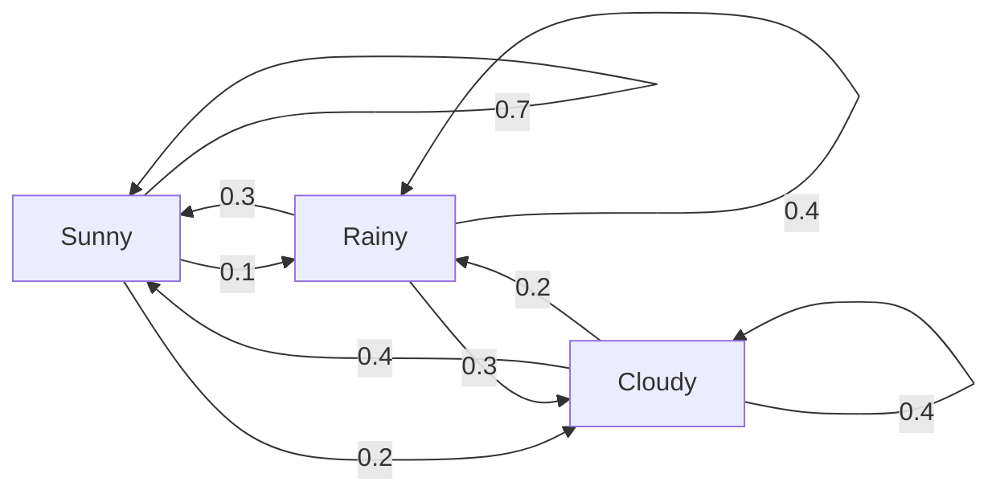
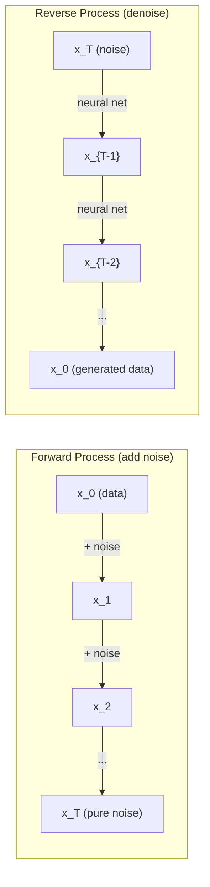

# Quá trình Stochastic

> Sự ngẫu nhiên với cấu trúc, toán học đằng sau những bước đi ngẫu nhiên, chuỗi Markov và mô hình phân tán.

**Type:** Learn
**Language:**Python
**Prerequisites:** Phase 1, Lessons 06-07 (probability, Bayes)
**Time:** ~75 minutes

## Mục tiêu học tập

- Chơi mô phỏng 1D và 2D đi bộ ngẫu nhiên và xác minh quy mô của sự di chuyển
- Xây dựng một mô phỏng chuỗi Markov và tính toán phân bố tĩnh của nó thông qua cấu trúc riêng
- Thực hiện Metropolis-Hastings MCMC và động lực Langevin để lấy mẫu từ các phân phối mục tiêu
- Kết nối quá trình phân tán về phía trước với chuyển động Brownian và giải thích cách quá trình ngược tạo ra dữ liệu

## Vấn đề

Nhiều hệ thống AI liên quan đến sự ngẫu nhiên mà phát triển theo thời gian, không phải sự ngẫu nhiên tĩnh -- sự ngẫu nhiên cấu trúc, theo dõi nơi mỗi bước phụ thuộc vào những gì đã xảy ra trước đó.

Các mô hình ngôn ngữ tạo ra các token một lần. Mỗi token phụ thuộc vào bối cảnh trước đó. mô hình đưa ra phân phối xác suất, lấy mẫu từ nó, và di chuyển về phía trước. Đó là một quá trình stochastic.

Các mô hình phân phối thêm tiếng ồn vào một hình ảnh từng bước cho đến khi nó trở thành tĩnh hoàn toàn. Sau đó chúng đảo ngược quá trình, từ chối từng bước cho đến khi một hình ảnh mới xuất hiện.

Các đại lý học tập tăng cường thực hiện các hành động trong một môi trường. Mỗi hành động dẫn đến một trạng thái mới với một số xác suất. Đại lý theo một chính sách ngẫu nhiên trong một thế giới ngẫu nhiên.

Việc lấy mẫu MCMC -- xương sống của suy luận Bayesian -- xây dựng một chuỗi Markov mà phân bố tĩnh là phía sau bạn muốn lấy mẫu từ.

Tất cả đều dựa trên bốn ý tưởng cơ bản:
1. Đi bộ ngẫu nhiên - quá trình stochastic đơn giản nhất
2. Dòng chuỗi Markov -- sự ngẫu nhiên được cấu trúc với một matrix chuyển tiếp
3. Động lực Langevin - giảm gradient với tiếng ồn
4. Metropolis-Hastings - lấy mẫu từ bất kỳ phân phối nào

## Khái niệm

### Đi bộ ngẫu nhiên

Bắt đầu từ vị trí 0. Ở mỗi bước, ném một đồng xu công bằng. Đầu: di chuyển sang bên phải (+1). đuôi: di chuyển sang trái (-1).

Sau n bước, vị trí của bạn là tổng số n giá trị ngẫu nhiên +/-1. vị trí dự kiến là 0 (lần đi không thiên vị). Nhưng khoảng cách dự kiến từ nguồn tăng lên như sqrt(n).

Điều này trái với trực giác. Đi bộ là công bằng - không có trôi dạt theo cả hai hướng. Nhưng theo thời gian, nó đi lang thang xa hơn và xa hơn từ nơi nó bắt đầu. Phản độ tiêu chuẩn sau n bước là sqrt(n).

```
Step 0:  Position = 0
Step 1:  Position = +1 or -1
Step 2:  Position = +2, 0, or -2
...
Step 100: Expected distance from origin ~ 10 (sqrt(100))
Step 10000: Expected distance from origin ~ 100 (sqrt(10000))
```

**In 2D**, bước đi di chuyển lên, xuống, trái, hoặc phải với xác suất tương đương.

**Why sqrt(n)?**Mỗi bước là +1 hoặc -1 với xác suất tương đương. Sau n bước, vị trí S_n = X_1 + X_2 + ... + X_n nơi mỗi X_i là +/-1. Sự khác biệt của mỗi bước là 1, và các bước là độc lập, vì vậy Var(S_n) = n. Chỉnh tiêu chuẩn = sqrt(n. Theo định lý giới hạn trung tâm, S_n / sqrt(n) hội tụ với phân bố bình thường tiêu chuẩn.

Quy mô này xuất hiện ở mọi nơi trong ML. SGD âm thanh scale như 1/sqrt(batch_size). Nhập kích thước scale như sqrt(d). Quảng gốc là chữ ký của các sự bổ sung ngẫu nhiên độc lập.

**Connection to Brownian motion.**Hãy đi bộ ngẫu nhiên với kích thước bước 1/sqrt(n) và n bước mỗi đơn vị thời gian. Khi n đi đến vô tận, bước đi hội tụ với chuyển động Brownian B(t) - một quá trình liên tục thời gian nơi B(t) thường được phân phối với trung bình 0 và biến số t.

Hành động Brown là nền tảng toán học của sự phân tán. Nó mô hình hóa sự rung chuyển ngẫu nhiên của các hạt trong một chất lỏng, biến động của giá cổ phiếu, và - quan trọng hơn - quá trình tiếng ồn trong các mô hình phân tán.

**Gambler's ruin.**Một người đi bộ ngẫu nhiên bắt đầu ở vị trí k, với các rào cản hấp thụ ở 0 và N. xác suất đạt đến N trước 0 là gì? Đối với một bước đi công bằng: P(reach N) = k/N. Điều này là đáng ngạc nhiên đơn giản và thanh lịch. Nó kết nối với lý thuyết của martingales - bước đi ngẫu nhiên công bằng là một martingale (tín giá trị tương lai dự kiến = giá trị hiện tại).

### Dòng dây chuyền Markov

Một chuỗi Markov là một hệ thống chuyển đổi giữa các trạng thái theo xác suất cố định.

```
P(X_{t+1} = j | X_t = i, X_{t-1} = ...) = P(X_{t+1} = j | X_t = i)
```

Đây là tính năng Markov. nó có nghĩa là bạn có thể mô tả toàn bộ động lực bằng một số liệu chuyển tiếp P:

```
P[i][j] = probability of going from state i to state j
```

Mỗi hàng của P cộng với 1 (bạn phải đi đâu đó).

**Example -- Weather:**

```
States: Sunny (0), Rainy (1), Cloudy (2)

P = [[0.7, 0.1, 0.2],    (if sunny: 70% sunny, 10% rainy, 20% cloudy)
     [0.3, 0.4, 0.3],    (if rainy: 30% sunny, 40% rainy, 30% cloudy)
     [0.4, 0.2, 0.4]]    (if cloudy: 40% sunny, 20% rainy, 40% cloudy)
```

Bắt đầu ở bất kỳ trạng thái nào. Sau nhiều chuyển đổi, phân phối các trạng thái hội tụ đến phân phối tĩnh pi, nơi pi * P = pi. Đây là vector tự bên trái của P với giá trị tự 1.

Đối với chuỗi thời tiết, phân phối tĩnh là [0,55, 0,18, 0,27] -- trong thời gian dài, nó có mặt trời 55% thời gian bất kể trạng thái khởi đầu.



**Computing the stationary distribution.**Có hai cách tiếp cận:

1. **Power method**: nhân bất kỳ phân bố ban đầu bằng P nhiều lần. Sau đủ lần lặp lại, nó hội tụ.
2. **Eigenvalue method**: tìm được phương tiện riêng bên trái của P với giá trị riêng 1. Đây là phương tiện riêng của P^T với giá trị riêng 1.

Cả hai cách tiếp cận đều đòi hỏi chuỗi đáp ứng các điều kiện hội tụ.

**Convergence conditions.**Một chuỗi Markov hội tụ với một phân phối tĩnh độc đáo nếu:
- **Irreducible**: mọi bang đều có thể tiếp cận từ mọi bang khác
- **Aperiodic**: chuỗi không có chu kỳ với thời gian cố định

Hầu hết các chuỗi mà bạn gặp trong ML đáp ứng cả hai điều kiện.

**Absorbing states.**Một trạng thái hấp thụ nếu một khi bạn nhập nó, bạn không bao giờ rời đi (P[i][i] = 1). hấp thụ chuỗi Markov mô hình hóa các quy trình với các trạng thái cuối cùng - một trò chơi kết thúc, một khách hàng trộn trộn, một chuỗi token chạm vào token cuối văn bản.

**Mixing time.**Số bước cho đến khi chuỗi "gần" với phân phối tĩnh? Về hình thức, số bước cho đến khi khoảng cách thay đổi tổng thể từ tĩnh giảm xuống dưới một số ngưỡng.

### Kết nối với các mô hình ngôn ngữ

Tạo token trong một mô hình ngôn ngữ là một quá trình Markov. Với bối cảnh hiện tại, mô hình sẽ phát ra phân phối trên token tiếp theo. Nhiệt độ kiểm soát độ sắc:

```
P(token_i) = exp(logit_i / temperature) / sum(exp(logit_j / temperature))
```

- Nhiệt độ = 1,0: phân phối tiêu chuẩn
- Nhiệt độ < 1,0: sắc hơn (đối đa xác định)
- Nhiệt độ > 1,0: phẳng hơn (thường tình cờ hơn)
- Nhiệt độ -> 0: argmax (cười tham)

Top-k lấy mẫu cắt giảm đến các token có xác suất cao nhất k. Top-p (tâm) lấy mẫu cắt giảm đến các token nhỏ nhất có xác suất tích lũy vượt quá p. Cả hai đều sửa đổi xác suất chuyển đổi Markov.

### Động thái Brown

Giới hạn thời gian liên tục của bước ngẫu nhiên.
1. B(0) = 0
2. B(t) - B(s) thường được phân phối với trung bình 0 và biến số t - s (cho t > s)
3. Các sự gia tăng trên các khoảng không chồng chéo là độc lập

Phong trào Brown liên tục nhưng không thể phân biệt được ở đâu cả - nó rung động ở mọi thang.

Trong mô phỏng riêng biệt, bạn ước tính chuyển động của Browni bằng:

```
B(t + dt) = B(t) + sqrt(dt) * z,    where z ~ N(0, 1)
```

Các sqrt(dt) quy mô là quan trọng. Nó đến từ định lý giới hạn trung tâm áp dụng cho các bước ngẫu nhiên.

### Langevin Dynamics

Sự giảm gradient tìm thấy tối thiểu của một hàm. Dinamika Langevin tìm thấy phân bố xác suất tương xứng với exp(-U(x) / T), nơi U là một hàm năng lượng và T là nhiệt độ.

```
x_{t+1} = x_t - dt * gradient(U(x_t)) + sqrt(2 * T * dt) * z_t
```

Hai lực tác động lên hạt:
1. **Gradient force**(-dt * gradient(U)): đẩy về hướng năng lượng thấp (như giảm gradient)
2. **Random force**(sqrt(2*T*dt) * z): đẩy theo hướng ngẫu nhiên (khám phá)

Ở nhiệt độ T = 0, đây là sự giảm gradient tinh khiết. Ở nhiệt độ cao, nó gần như là một bước đi ngẫu nhiên.

**Connection to diffusion models.**Quá trình tiến bộ của mô hình phân tán là:

```
x_t = sqrt(alpha_t) * x_{t-1} + sqrt(1 - alpha_t) * noise
```

Đây là một chuỗi Markov liên tục trộn dữ liệu với tiếng ồn.

Quá trình ngược -- từ tiếng ồn trở lại dữ liệu -- cũng là chuỗi Markov, nhưng xác suất chuyển đổi của nó được tìm hiểu bởi một mạng lưới thần kinh. mạng học cách dự đoán tiếng ồn được thêm vào mỗi bước, sau đó trừ nó.



### MCMC: Markov Chain Monte Carlo

Đôi khi bạn cần lấy mẫu từ phân bố p ((x) mà bạn có thể đánh giá (trong một liên tục) nhưng không thể lấy mẫu trực tiếp. Bayesian hậu là ví dụ cổ điển - bạn biết khả năng gấp đôi trước, nhưng các định hình bình thường hóa là khó xử lý.

**Metropolis-Hastings**xây dựng chuỗi Markov có phân bố tĩnh là p(x):

1. Bắt đầu ở một số vị trí x
2. Đề xuất một vị trí mới x' từ một phân phối đề xuất Q(x' ảix)
3. Tỷ lệ chấp nhận tính toán: a(x') * Q(x khiếu x') / (p(x) * Q(x khiếu x))
4. Hãy chấp nhận x' với xác suất min ((1, a). Nếu không, hãy ở x.
5. Lặp lại.

Nếu Q là đối xứng ví dụ, Q(x' (ởx) = Q(x (ởx') = N(x, sigma^2)), tỷ lệ đơn giản hóa thành a = p(x') / p(x. Bạn chỉ cần tỷ lệ xác suất - các định kỳ bình thường hóa hủy bỏ.

Mạng lưới này được đảm bảo sẽ hội tụ với p ((x) trong điều kiện nhẹ. Nhưng hội tụ có thể chậm nếu đề xuất quá nhỏ (quá trình ngẫu nhiên) hoặc quá lớn (đánh giá cao).

**Why it works.**Tỷ lệ chấp nhận đảm bảo sự cân bằng chi tiết: xác suất ở x và di chuyển đến x' bằng với xác suất ở x' và di chuyển đến x. Sự cân bằng chi tiết cho thấy p(x) là phân bố tĩnh của chuỗi.

**Practical considerations:**
- **Burn-in**: loại bỏ các mẫu N đầu tiên. chuỗi cần thời gian để đạt được phân phối tĩnh từ điểm khởi đầu của nó.
- **Thinning**: giữ mỗi mẫu k-th để giảm sự tương quan tự động.
- **Multiple chains**: chạy nhiều chuỗi từ các điểm khởi đầu khác nhau. Nếu chúng hội tụ đến cùng một phân bố, bạn có bằng chứng về hội tụ.
- **Acceptance rate**: cho các đề xuất Gaussian trong d chiều, tỷ lệ chấp nhận tối ưu là khoảng 23% (Roberts & Rosenthal, 2001).

### Quá trình Stochastic trong AI

| Process | AI Application |
|---------|---------------|
| Random walk | Exploration in RL, Node2Vec embeddings |
| Markov chain | Text generation, MCMC sampling |
| Brownian motion | Diffusion models (forward process) |
| Langevin dynamics | Score-based generative models, SGLD |
| Markov decision process | Reinforcement learning |
| Metropolis-Hastings | Bayesian inference, posterior sampling |

```figure
random-walk-diffusion
```

## Hãy xây dựng nó

### Bước 1: Máy mô phỏng đi bộ ngẫu nhiên

```python
import numpy as np

def random_walk_1d(n_steps, seed=None):
    rng = np.random.RandomState(seed)
    steps = rng.choice([-1, 1], size=n_steps)
    positions = np.concatenate([[0], np.cumsum(steps)])
    return positions


def random_walk_2d(n_steps, seed=None):
    rng = np.random.RandomState(seed)
    directions = rng.choice(4, size=n_steps)
    dx = np.zeros(n_steps)
    dy = np.zeros(n_steps)
    dx[directions == 0] = 1   # right
    dx[directions == 1] = -1  # left
    dy[directions == 2] = 1   # up
    dy[directions == 3] = -1  # down
    x = np.concatenate([[0], np.cumsum(dx)])
    y = np.concatenate([[0], np.cumsum(dy)])
    return x, y
```

1D walk lưu trữ tổng tích lũy. Mỗi bước là +1 hoặc -1. Sau n bước, vị trí là tổng. Sự khác biệt tăng tuyến tính với n, do đó lệch chuẩn tăng như sqrt(n.

### Bước 2: Dòng dây chuyền Markov

```python
class MarkovChain:
    def __init__(self, transition_matrix, state_names=None):
        self.P = np.array(transition_matrix, dtype=float)
        self.n_states = len(self.P)
        self.state_names = state_names or [str(i) for i in range(self.n_states)]

    def step(self, current_state, rng=None):
        if rng is None:
            rng = np.random.RandomState()
        probs = self.P[current_state]
        return rng.choice(self.n_states, p=probs)

    def simulate(self, start_state, n_steps, seed=None):
        rng = np.random.RandomState(seed)
        states = [start_state]
        current = start_state
        for _ in range(n_steps):
            current = self.step(current, rng)
            states.append(current)
        return states

    def stationary_distribution(self):
        eigenvalues, eigenvectors = np.linalg.eig(self.P.T)
        idx = np.argmin(np.abs(eigenvalues - 1.0))
        stationary = np.real(eigenvectors[:, idx])
        stationary = stationary / stationary.sum()
        return np.abs(stationary)
```

Phân bố tĩnh là vector tự động trái của P với giá trị tự động 1. Chúng ta tìm thấy nó bằng cách tính toán vector tự động của P^T (trả chuyển các vector tự động trái thành vector tự động phải).

### Bước 3: Động lực Langevin

```python
def langevin_dynamics(grad_U, x0, dt, temperature, n_steps, seed=None):
    rng = np.random.RandomState(seed)
    x = np.array(x0, dtype=float)
    trajectory = [x.copy()]
    for _ in range(n_steps):
        noise = rng.randn(*x.shape)
        x = x - dt * grad_U(x) + np.sqrt(2 * temperature * dt) * noise
        trajectory.append(x.copy())
    return np.array(trajectory)
```

Phong trào đẩy x về phía năng lượng thấp. tiếng ồn ngăn chặn nó bị kẹt. Ở trạng thái cân bằng, phân bố các mẫu tương xứng với exp ((-U(x) / nhiệt độ).

### Bước 4: Metropolis-Hastings

```python
def metropolis_hastings(target_log_prob, proposal_std, x0, n_samples, seed=None):
    rng = np.random.RandomState(seed)
    x = np.array(x0, dtype=float)
    samples = [x.copy()]
    accepted = 0
    for _ in range(n_samples - 1):
        x_proposed = x + rng.randn(*x.shape) * proposal_std
        log_ratio = target_log_prob(x_proposed) - target_log_prob(x)
        if np.log(rng.rand()) < log_ratio:
            x = x_proposed
            accepted += 1
        samples.append(x.copy())
    acceptance_rate = accepted / (n_samples - 1)
    return np.array(samples), acceptance_rate
```

Các thuật toán đề xuất một điểm mới, kiểm tra xem nó có xác suất cao hơn (hoặc chấp nhận với xác suất tương xứng với tỷ lệ), và lặp lại. Tỷ lệ chấp nhận nên khoảng 23-50% cho sự trộn tốt.

## Sử dụng nó

Thực tế, bạn sử dụng thư viện đã được thiết lập cho các thuật toán này. Nhưng hiểu cơ học là quan trọng để gỡ lỗi và điều chỉnh.

```python
import numpy as np

rng = np.random.RandomState(42)
walk = np.cumsum(rng.choice([-1, 1], size=10000))
print(f"Final position: {walk[-1]}")
print(f"Expected distance: {np.sqrt(10000):.1f}")
print(f"Actual distance: {abs(walk[-1])}")
```

### Numpy cho các matrices chuyển tiếp

```python
import numpy as np

P = np.array([[0.7, 0.1, 0.2],
              [0.3, 0.4, 0.3],
              [0.4, 0.2, 0.4]])

distribution = np.array([1.0, 0.0, 0.0])
for _ in range(100):
    distribution = distribution @ P

print(f"Stationary distribution: {np.round(distribution, 4)}")
```

Bội số phân bố ban đầu bằng P nhiều lần. Sau đủ lần lặp lại, nó hội tụ với phân bố tĩnh bất kể bạn bắt đầu ở đâu. Đây là phương pháp năng lượng để tìm ra vector tự chủ bên trái.

### Kết nối với các khung thực tế

- **PyTorch diffusion:**- `DDPMScheduler`Trong khuôn mặt ôm `diffusers`thực hiện các chuỗi Markov phía trước và ngược
- **NumPyro / PyMC:**Sử dụng MCMC (NUTS samplingler, cải thiện trên Metropolis-Hastings) cho suy luận Bayesian
- **Gymnasium (RL):**Chức năng bước môi trường xác định quá trình quyết định Markov

### Kiểm tra sự hội tụ chuỗi Markov

```python
import numpy as np

P = np.array([[0.9, 0.1], [0.3, 0.7]])

eigenvalues = np.linalg.eigvals(P)
spectral_gap = 1 - sorted(np.abs(eigenvalues))[-2]
print(f"Eigenvalues: {eigenvalues}")
print(f"Spectral gap: {spectral_gap:.4f}")
print(f"Approximate mixing time: {1/spectral_gap:.1f} steps")
```

Khoảng cách quang phổ cho bạn biết chuỗi quên đi trạng thái ban đầu nhanh như thế nào. Khoảng cách 0,2 nghĩa là khoảng 5 bước để trộn. Khoảng cách 0,01 nghĩa là khoảng 100 bước. Luôn kiểm tra điều này trước khi chạy mô phỏng dài - một chuỗi trộn chậm tính toán chất thải.

## Chuyển nó

Bài học này mang lại:
- `outputs/prompt-stochastic-process-advisor.md`-- một lời nhắc giúp xác định khung quy trình stochastic áp dụng cho một vấn đề nhất định

## Kết nối

| Concept | Where it shows up |
|---------|------------------|
| Random walk | Node2Vec graph embeddings, exploration in RL |
| Markov chain | Token generation in LLMs, MCMC sampling |
| Brownian motion | Forward diffusion process in DDPM, SDE-based models |
| Langevin dynamics | Score-based generative models, stochastic gradient Langevin dynamics (SGLD) |
| Stationary distribution | MCMC convergence target, PageRank |
| Metropolis-Hastings | Bayesian posterior sampling, simulated annealing |
| Temperature | LLM sampling, Boltzmann exploration in RL, simulated annealing |
| Mixing time | Convergence speed of MCMC, spectral gap analysis |
| Absorbing state | End-of-sequence token, terminal states in RL |
| Detailed balance | Correctness guarantee for MCMC samplers |

Các mô hình phân tán xứng đáng được chú ý đặc biệt. DDPM (Ho et al., 2020) xác định chuỗi Markov phía trước:

```
q(x_t | x_{t-1}) = N(x_t; sqrt(1-beta_t) * x_{t-1}, beta_t * I)
```

khi beta_t là một lịch trình tiếng ồn. Sau bước T, x_T là khoảng N(0, I).

```
p_theta(x_{t-1} | x_t) = N(x_{t-1}; mu_theta(x_t, t), sigma_t^2 * I)
```

Mỗi bước của thế hệ là một bước trong một chuỗi Markov học.

SGLD (Stochastic Gradient Langevin Dynamics) kết hợp giảm gradient mini-batch với tiếng ồn Langevin. Thay vì tính toán độ tốc đầy đủ, bạn sử dụng ước tính stochastic và thêm âm thanh chuẩn. Khi tốc độ học tập giảm, SGLD chuyển từ tối ưu hóa sang lấy mẫu -- bạn có được mẫu sau Bayesian gần như miễn phí. Đây là một trong những cách đơn giản nhất để có được ước tính không chắc chắn từ một mạng lưới thần kinh.

Ý tưởng quan trọng trong tất cả các mối liên hệ này: các quy trình stochastic không chỉ là các công cụ lý thuyết. Chúng là cơ chế tính toán bên trong các hệ thống AI hiện đại. Khi bạn điều chỉnh nhiệt độ của một LLM, bạn đang điều chỉnh một chuỗi Markov. Khi bạn đào tạo một mô hình phân tán, bạn đang học cách đảo ngược một quá trình giống như chuyển động Brownian. Khi bạn chạy suy luận Bayesian, bạn đang xây dựng một chuỗi hội tụ với phía sau.

## Các bài tập

1. **Simulate 1000 random walks of 10000 steps.**Chụp bản phân phối các vị trí cuối cùng. Kiểm tra nó là khoảng Gaussian với trung bình 0 và lệch chuẩn sqrt(10000) = 100.

2. **Build a text generator using a Markov chain.**Trình luyện trên một tập hợp nhỏ: cho mỗi từ, đếm chuyển tiếp đến từ tiếp theo. Xây dựng các trận chuyển tiếp. Tạo ra các câu mới bằng cách lấy mẫu từ chuỗi.

3. **Implement simulated annealing**sử dụng Metropolis-Hastings. Bắt đầu ở nhiệt độ cao (tận dụng hầu hết mọi thứ) và dần dần làm mát (tận dụng chỉ cải tiến). Sử dụng nó để tìm tối thiểu của một chức năng với nhiều tối thiểu địa phương.

4. **Compare Langevin dynamics at different temperatures.**Mô hình từ tiềm năng hố hai U(x) = (x^2 - 1)^2. ở nhiệt độ thấp, các mẫu tập hợp trong một hố.

5. **Implement the forward diffusion process.**Bắt đầu với một tín hiệu 1D (ví dụ, một sóng âm đạo). Thêm tiếng ồn dần dần hơn 100 bước với một lịch trình tiếng ồn tuyến tính. Hãy cho thấy tín hiệu suy giảm xuống là tiếng ồn tinh khiết. Sau đó thực hiện một biểu tượng đơn giản đảo ngược quá trình (ngay cả một sự ngây thơ mà chỉ trừ được tiếng ồn ước tính).

## Các điều khoản chính

| Term | What people say | What it actually means |
|------|----------------|----------------------|
| Random walk | "Coin-flip movement" | A process where position changes by random increments at each step |
| Markov property | "Memoryless" | The future depends only on the present state, not on the history |
| Transition matrix | "The probability table" | P[i][j] = probability of moving from state i to state j |
| Stationary distribution | "The long-run average" | The distribution pi where pi*P = pi -- the chain's equilibrium |
| Brownian motion | "Random jiggling" | The continuous-time limit of a random walk, B(t) ~ N(0, t) |
| Langevin dynamics | "Gradient descent with noise" | Update rule that combines deterministic gradient and random perturbation |
| MCMC | "Walking toward the target" | Constructing a Markov chain whose stationary distribution is the one you want |
| Metropolis-Hastings | "Propose and accept/reject" | MCMC algorithm that uses acceptance ratios to ensure convergence |
| Temperature | "The randomness knob" | Parameter controlling the tradeoff between exploration and exploitation |
| Diffusion process | "Noise in, noise out" | Forward: gradually add noise. Reverse: gradually remove it. Generates data. |

## Đọc thêm

- **Ho, Jain, Abbeel (2020)**- "Thử bác bỏ các mô hình xác suất phân tán". Bài báo DDPM đã khởi động cuộc cách mạng mô hình phân tán.
- **Song & Ermon (2019)**-- "Mô hình hóa tổng thể bằng cách ước tính các gradient của phân phối dữ liệu". Phương pháp dựa trên điểm sử dụng động lực Langevin cho việc lấy mẫu.
- **Roberts & Rosenthal (2004)**-- "Thống kê Markov và thuật toán MCMC". Lý thuyết đằng sau khi và tại sao MCMC hoạt động.
- **Norris (1997)**- "Markov Chains". - Cuốn sách giáo khoa tiêu chuẩn.
- **Welling & Teh (2011)**"Sự học Bayesian thông qua động lực Langevin Gradient Stochastic". Kết hợp SGD với động lực Langevin cho suy luận Bayesian có thể mở rộng.
