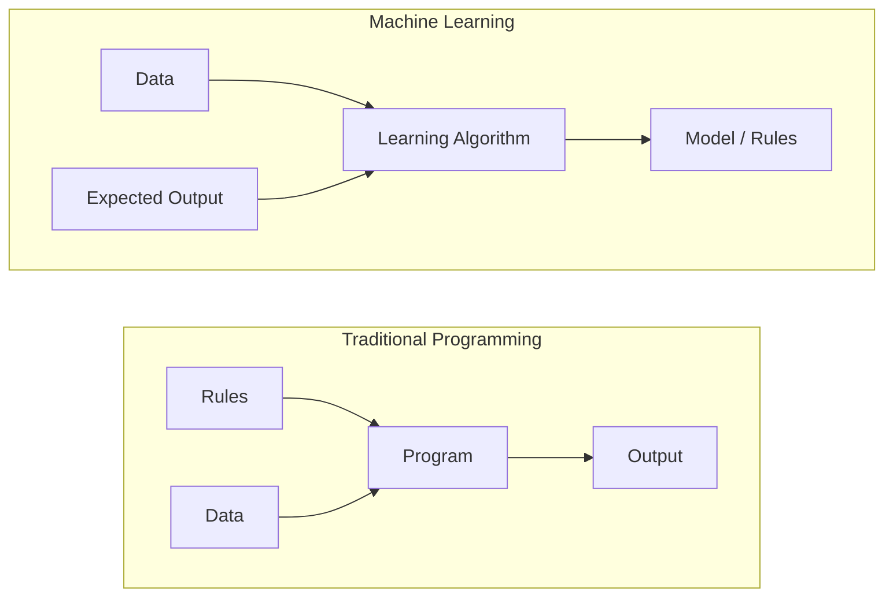
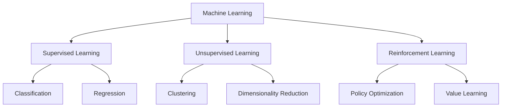
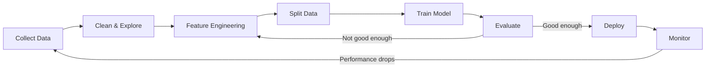
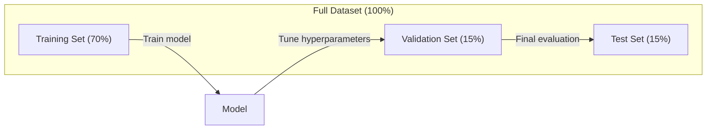
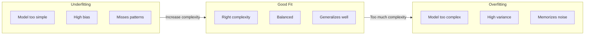
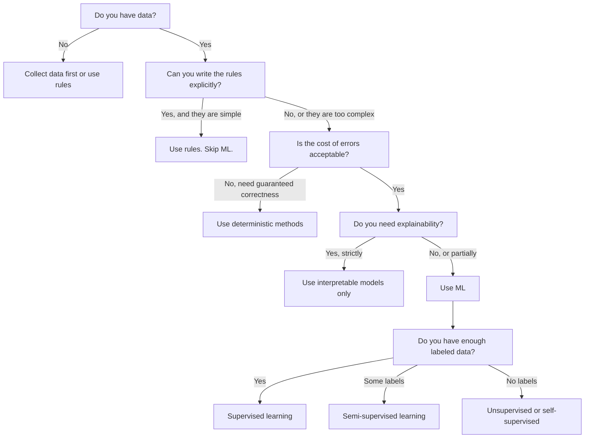

# Máy học là gì

> Học máy đang dạy máy tính tìm kiếm các mẫu trong dữ liệu thay vì viết các quy tắc bằng tay.

**Type:** Learn
**Languages:** Python
**Prerequisites:** Phase 1 (Math Foundations)
**Time:** ~45 minutes

## Mục tiêu học tập

- Giải thích sự khác biệt giữa việc học theo giám sát, không theo giám sát và tăng cường và xác định loại nào áp dụng cho một vấn đề nhất định
- Thực hiện một phân loại trung tâm gần nhất từ đầu và đánh giá nó với một đường cơ sở ngẫu nhiên
- Hóa ra sự khác biệt giữa các nhiệm vụ phân loại và trục xuất và chọn hàm mất thích hợp cho mỗi nhiệm vụ
- Đánh giá liệu một vấn đề kinh doanh nhất định có phù hợp với ML hay được giải quyết tốt hơn bằng các quy tắc xác định

## Vấn đề

Bạn muốn xây dựng một bộ lọc spam. Cách tiếp cận truyền thống: ngồi xuống và viết hàng trăm quy tắc. "Nếu email có chứa 'FREE MONEY', đánh dấu nó là spam. Nếu nó có nhiều hơn 3 dấu hô, đánh dấu nó là spam". Bạn dành nhiều tuần để viết các quy tắc. Sau đó, những người gửi thư rác thay đổi các định nghĩa của họ. Quy tắc của bạn phá vỡ. Bạn viết thêm các quy tắc. Chuyện không bao giờ kết thúc.

Máy học làm thay đổi điều này. Thay vì viết các quy tắc, bạn đưa cho máy tính hàng ngàn email có nhãn ("spam" hoặc "không spam") và để nó tự tìm ra các quy tắc. máy tính tìm thấy các mẫu mà bạn không bao giờ nghĩ đến. Khi những người spam thay đổi chiến thuật, bạn tập trung lại dữ liệu mới thay vì viết lại mã.

Sự chuyển đổi từ "quyền thống lập trình" sang "làm học từ dữ liệu" là cốt lõi của việc học máy.

## Khái niệm

### Học hỏi từ dữ liệu, chứ không phải từ quy tắc

Chương trình truyền thống và học máy giải quyết các vấn đề theo hướng ngược lại.



Chương trình truyền thống: bạn viết các quy tắc. Chương trình áp dụng chúng cho dữ liệu để tạo ra đầu ra.

Học máy: bạn cung cấp dữ liệu và kết quả dự kiến.

"Mô hình" xuất hiện từ đào tạo là các quy tắc, được mã hóa như số (nâng trọng, tham số). Nó tổng quát từ các ví dụ nó đã thấy để đưa ra dự đoán về dữ liệu nó chưa bao giờ thấy.

### Ba loại máy học



**Supervised Learning**Có cặp đầu vào và đầu ra. mô hình học cách lập bản đồ đầu vào đến đầu ra.
- "Đây là 10.000 bức ảnh có nhãn mèo hay chó. Hãy học cách phân biệt chúng".
- "Đây là những tính năng và giá nhà.

**Unsupervised Learning**Bạn chỉ có đầu vào, không có nhãn, mô hình tự tìm ra cấu trúc.
- "Đây là 10.000 lịch sử mua hàng của khách hàng. Tìm các nhóm tự nhiên".
- "Đây là 1.000 điểm dữ liệu chiều, giảm xuống 2 chiều trong khi giữ cấu trúc".

**Reinforcement Learning**Một đại lý thực hiện các hành động trong một môi trường và nhận được phần thưởng hoặc hình phạt.
- "Chơi trò chơi này. +1 để thắng, -1 để thua. Hãy tìm ra một chiến lược".
- "Hãy kiểm soát cánh tay robot này. +1 để lấy vật thể, -0,01 cho mỗi giây lãng phí".

Hầu hết những gì bạn sẽ xây dựng trong thực tế sử dụng học tập giám sát. Học tập không giám sát là phổ biến cho quá trình xử lý trước và khám phá. Học tập tăng cường năng lực AI trò chơi, robot và RLHF cho các mô hình ngôn ngữ.

### Ngoài ba người lớn

Ba loại trên là sạch sẽ, nhưng ML trong thế giới thực thường làm mờ ranh giới.

**Semi-supervised learning**sử dụng một tập hợp nhỏ dữ liệu có nhãn và một tập hợp lớn dữ liệu không nhãn. Bạn có thể có 100 hình ảnh y tế có nhãn và 100.000 hình ảnh không nhãn. Các kỹ thuật bao gồm:

- **Label propagation:**Xây dựng một biểu đồ kết nối các điểm dữ liệu tương tự. Các nhãn lan từ các nút có nhãn đến các hàng xóm không có nhãn thông qua biểu đồ.
- **Pseudo-labeling:**Trén một mô hình trên dữ liệu được dán nhãn, sử dụng nó để dự đoán nhãn cho dữ liệu không được dán nhãn, sau đó đào tạo lại mọi thứ. mô hình khởi động bộ huấn luyện của riêng nó.
- **Consistency regularization:**Mô hình nên đưa ra dự đoán tương tự cho một đầu vào và một phiên bản bị nhiễu nhẹ của đầu vào đó.

**Self-supervised learning**mô hình tạo ra nhiệm vụ dự đoán của riêng mình từ cấu trúc dữ liệu.

- **Masked language modeling (BERT):**Cất giấu 15% từ trong một câu, huấn luyện mô hình để dự đoán những từ thiếu. "Là nhãn" đến từ văn bản gốc.
- **Contrastive learning (SimCLR):**Hãy chụp hình ảnh, tạo ra hai phiên bản tăng cường. Hãy huấn luyện mô hình để nhận ra chúng xuất phát từ cùng một hình ảnh trong khi phân biệt chúng với các phiên bản tăng cường của các hình ảnh khác.
- **Next-token prediction (GPT):**Dự đoán từ tiếp theo với tất cả các từ trước đó. Mỗi tài liệu văn bản trở thành một ví dụ đào tạo.

Đây không phải là các loại riêng biệt từ ba loại lớn. Chúng là các chiến lược kết hợp các ý tưởng được giám sát và không được giám sát. Học tập tự giám sát được giám sát kỹ thuật (chương trình dự đoán một cái gì đó), nhưng các nhãn được tạo tự động, không phải bởi con người.

### Định dạng so với sự lùi

Đây là hai nhiệm vụ học tập được giám sát chính.

| Aspect | Classification | Regression |
|--------|---------------|------------|
| Output | Discrete categories | Continuous numbers |
| Example | "Is this email spam?" | "What will the house price be?" |
| Output space | {cat, dog, bird} | Any real number |
| Loss function | Cross-entropy, accuracy | Mean squared error, MAE |
| Decision | Boundaries between classes | A curve that fits the data |

Phân loại trả lời "đại loại nào?"

Một số vấn đề có thể được hình thành theo cách nào đó. Dự đoán nếu một cổ phiếu tăng hoặc giảm là phân loại. Dự đoán giá chính xác là sự lùi.

### Phương trình làm việc ML

Mỗi dự án học máy đều theo cùng một đường ống dẫn, bất kể thuật toán.



**Collect Data**Thu thập dữ liệu thô. Nhiều dữ liệu gần như luôn tốt hơn, nhưng chất lượng quan trọng hơn số lượng.

**Clean & Explore**: xử lý các giá trị thiếu, loại bỏ các bản sao, hình ảnh phân phối, phát hiện bất thường.

**Feature Engineering**: Chuyển đổi dữ liệu thô thành các tính năng mà mô hình có thể sử dụng. Chuyển đổi ngày thành ngày trong tuần. Tiêu chuẩn các cột số. Mã hóa các biến phân loại. Các tính năng tốt quan trọng hơn các thuật toán may mắn.

**Split Data**: Chia thành tập huấn, xác nhận và thử nghiệm. mô hình đào tạo dựa trên dữ liệu đào tạo, bạn điều chỉnh các siêu tham số trên dữ liệu xác nhận, và bạn báo cáo hiệu suất cuối cùng trên dữ liệu thử nghiệm.

**Train Model**: Đưa dữ liệu đào tạo vào một thuật toán.

**Evaluate**: đo hiệu suất trên dữ liệu xác thực / thử nghiệm. Nếu hiệu suất không thể chấp nhận được, hãy quay lại và thử các tính năng, thuật toán hoặc siêu tham số khác nhau.

**Deploy**: Đưa mô hình vào sản xuất nơi nó đưa ra dự đoán về dữ liệu mới.

**Monitor**: Theo dõi hiệu suất theo thời gian. Phân phối dữ liệu thay đổi (trái dữ liệu), và mô hình giảm. Khi hiệu suất giảm, tập luyện lại.

### Việc đào tạo, xác nhận và kiểm tra

Đây là khái niệm quan trọng nhất người mới bắt đầu sai lầm. Bạn phải đánh giá mô hình của bạn trên dữ liệu mà nó chưa bao giờ thấy trong quá trình đào tạo. Nếu không bạn đang đo lường ghi nhớ, không phải học tập.



| Split | Purpose | When used | Typical size |
|-------|---------|-----------|-------------|
| Training | Model learns from this data | During training | 60-80% |
| Validation | Tune hyperparameters, compare models | After each training run | 10-20% |
| Test | Final unbiased performance estimate | Once, at the very end | 10-20% |

Bộ thử nghiệm là thánh. Bạn nhìn vào nó một lần. Nếu bạn tiếp tục điều chỉnh mô hình của bạn dựa trên hiệu suất thử nghiệm, bạn đang thực hiện hiệu quả trên bộ thử nghiệm và số liệu được báo cáo của bạn là vô nghĩa.

Đối với các tập dữ liệu nhỏ, sử dụng xác thực chéo k-fold: chia dữ liệu thành k phần, đào tạo trên k-1 phần, xác nhận trên phần còn lại, xoay và kết quả trung bình.

### Overfitting vs Underfitting



**Underfitting**: Mô hình quá đơn giản để chụp các mẫu trong dữ liệu. Một đường thẳng cố gắng phù hợp với một mối quan hệ cong. Sai lầm đào tạo cao. Sai lầm thử nghiệm cao.

**Overfitting**: Mô hình quá phức tạp và ghi nhớ dữ liệu đào tạo, bao gồm cả tiếng ồn. Một đường cong chuyển động đi qua mọi điểm đào tạo nhưng không đạt được dữ liệu mới. Hầm hỏng đào tạo thấp. Hầm thử là cao.

**Good fit**: Mô hình ghi lại các mẫu thực tế mà không ghi nhớ tiếng ồn.

Các dấu hiệu quá phù hợp:
- Độ chính xác đào tạo cao hơn nhiều so với độ chính xác xác xác nhận
- Mô hình hoạt động tốt trên dữ liệu đào tạo nhưng kém trên dữ liệu mới
- Thêm thêm dữ liệu đào tạo cải thiện hiệu suất (chương trình ghi nhớ, không phải học tập)

Phong điểm để quá trang bị:
- Nhận thêm dữ liệu đào tạo
- Giảm độ phức tạp của mô hình ( ít tham số hơn, kiến trúc đơn giản hơn)
- Việc quy định (làm thêm một hình phạt cho trọng lượng lớn)
- Quay giảm (những tế bào thần kinh vô tình bị tiêu hủy trong quá trình tập luyện)
- Ngưng sớm (ngưng đào tạo khi lỗi xác thực bắt đầu tăng)

Phong điểm cho việc không phù hợp:
- Sử dụng mô hình phức tạp hơn
- Thêm thêm tính năng
- Giảm sự thường xuyên hóa
- Đào tàu lâu hơn

### Sự giao dịch giữa sự thiên vị và sự biến thể

Đây là khung toán học đằng sau quá phù hợp và thiếu phù hợp.

**Bias**: lỗi từ giả định sai trong mô hình. Một mô hình tuyến tính có thiên vị cao khi mối quan hệ thực sự không tuyến tính. thiên vị cao dẫn đến sự thiếu phù hợp.

**Variance**: lỗi từ độ nhạy đến biến động nhỏ trong dữ liệu đào tạo. Một mô hình có sự biến động cao đưa ra dự đoán rất khác nhau khi được đào tạo trên các bộ phận dữ liệu khác nhau. sự biến động cao dẫn đến quá phù hợp.

| Model complexity | Bias | Variance | Result |
|-----------------|------|----------|--------|
| Too low (linear model for curved data) | High | Low | Underfitting |
| Just right | Medium | Medium | Good generalization |
| Too high (degree-20 polynomial for 10 points) | Low | High | Overfitting |

Tổng lỗi = Bias^2 + Varian + Lồn không thể giảm

Bạn không thể giảm tiếng ồn không thể giảm (đó là sự ngẫu nhiên trong dữ liệu tự nó).

### Không có lý thuyết bữa trưa miễn phí

Không có thuật toán duy nhất hoạt động tốt nhất cho mọi vấn đề. Một thuật toán hoạt động tốt trên một lớp vấn đề sẽ hoạt động kém trên một loại khác. Đây là lý do tại sao các nhà khoa học dữ liệu thử nhiều thuật toán và so sánh kết quả.

Trong thực tế, sự lựa chọn phụ thuộc vào:
- Bạn có bao nhiêu dữ liệu
- Có bao nhiêu tính năng
- Dù mối quan hệ là tuyến tính hay không tuyến tính
- Nếu bạn cần sự giải thích
- Bạn có thể mua bao nhiêu máy tính

### Khi nào không nên sử dụng máy học

ML có sức mạnh nhưng không phải lúc nào cũng là công cụ phù hợp.

**Do not use ML when:**

- **Rules are simple and well-defined.**Lượng thuế, thuật toán phân loại, chuyển đổi đơn vị. Nếu bạn có thể viết logic trong một vài if-statement, một mô hình sẽ thêm sự phức tạp mà không có lợi ích.
- **You have no data or very little data.**ML cần những ví dụ để học hỏi. Với 10 điểm dữ liệu, bạn không thể đào tạo bất cứ điều gì có ý nghĩa.
- **The cost of being wrong is catastrophic and you need guaranteed correctness.**Xét lượng thuốc y tế, kiểm soát lò phản ứng hạt nhân, xác minh mật mã. Các mô hình ML là xác suất. Đôi khi chúng sẽ sai. Nếu "một lúc sai" là không thể chấp nhận được, sử dụng phương pháp xác định.
- **A lookup table or heuristic solves the problem.**Nếu một ngưỡng đơn giản hoặc bảng bao gồm 99% trường hợp, việc thêm ML làm tăng chi phí bảo trì mà không cải thiện đáng kể.
- **You cannot explain the decision and explainability is required.**Các ngành công nghiệp được quy định (thu vay, bảo hiểm, tư pháp hình sự) đôi khi yêu cầu mọi quyết định đều có thể giải thích đầy đủ.
- **The problem changes faster than you can retrain.**Nếu các quy tắc thay đổi hàng ngày và đào tạo lại mất một tuần, mô hình luôn là lỗi thời.

Sử dụng biểu đồ lưu lượng quyết định này:



```figure
f3-learning-boundary
```

## Hãy xây dựng nó

Mã trong `code/ml_intro.py`Nó thực hiện một phân loại trung tâm gần nhất từ đầu, thuật toán ML đơn giản nhất có thể. Nó chứng minh ý tưởng cốt lõi: học hỏi từ dữ liệu, sau đó dự đoán về dữ liệu mới.

### Bước 1: Classifier Centroid gần nhất từ đầu

Bộ phân loại trung tâm gần nhất tính toán trung tâm (tỷ lệ trung bình) của mỗi lớp trong dữ liệu đào tạo. Để dự đoán, nó gán mỗi điểm mới cho lớp có trung tâm gần nhất.

```python
class NearestCentroid:
    def fit(self, X, y):
        self.classes = np.unique(y)
        self.centroids = np.array([
            X[y == c].mean(axis=0) for c in self.classes
        ])

    def predict(self, X):
        distances = np.array([
            np.sqrt(((X - c) ** 2).sum(axis=1))
            for c in self.centroids
        ])
        return self.classes[distances.argmin(axis=0)]
```

Đó là toàn bộ thuật toán. Fit tính toán hai phương tiện. Predict tính toán khoảng cách. Không giảm gradient, không lặp lại, không có các siêu tham số.

### Bước 2: Đào tạo dữ liệu tổng hợp

Chúng ta tạo ra một bộ dữ liệu phân loại 2D với hai lớp được chồng chéo một chút.

```python
rng = np.random.RandomState(42)
X_class0 = rng.randn(100, 2) + np.array([1.0, 1.0])
X_class1 = rng.randn(100, 2) + np.array([-1.0, -1.0])
X = np.vstack([X_class0, X_class1])
y = np.array([0] * 100 + [1] * 100)
```

### Bước 3: So sánh với một điểm gốc

Mỗi mô hình ML nên được so sánh với một đường cơ sở tầm thường. Ở đây, đường cơ sở dự đoán một lớp ngẫu nhiên. Nếu mô hình ML của bạn không đánh bại đoán ngẫu nhiên, có điều gì đó sai.

```python
baseline_preds = rng.choice([0, 1], size=len(y_test))
baseline_acc = np.mean(baseline_preds == y_test)
```

Bộ phân loại trung tâm nên có độ chính xác khoảng 90% trên bộ dữ liệu sạch này.

### Tại sao điều này quan trọng

Các phân loại trung tâm gần nhất là đơn giản. Nó không có siêu tham số, không lặp lại, không giảm độ nghiêng.

1. **Learn**một đại diện từ dữ liệu đào tạo (các trung tâm)
2. **Predict**về dữ liệu mới sử dụng đại diện đó (cách xa nhất)
3. **Evaluate**so với đường cơ sở (đường đoán ngẫu nhiên)

Mỗi thuật toán ML, từ sự hồi quy hậu cần đến các biến đổi, đều theo mô hình 3 bước này.

### Bước 4: Những gì bộ phân loại trung tâm không thể làm

Các phân loại trung tâm gần nhất giả định mỗi lớp tạo thành một điểm. Nó vẽ ranh giới quyết định tuyến tính. Nó thất bại khi:

- Các lớp có nhiều cụm (ví dụ, chữ số "1" có thể được viết theo nhiều cách khác nhau)
- Biên giới quyết định không tuyến tính (ví dụ: một lớp vây quanh một lớp khác)
- Các tính năng có quy mô rất khác nhau (tránh xa được thống trị bởi tính năng quy mô lớn nhất)

Những hạn chế này thúc đẩy mọi thuật toán khác bạn sẽ học. K-cô lân cận xử lý nhiều cụm. Cây quyết định xử lý ranh giới không tuyến tính. Phân tích tính khắc phục vấn đề quy mô. Mỗi bài học xây dựng trên các hạn chế của bài trước.

## Sử dụng nó

sklearn cung cấp `NearestCentroid`và máy phát dữ liệu tổng hợp:

```python
from sklearn.neighbors import NearestCentroid
from sklearn.datasets import make_classification
from sklearn.model_selection import train_test_split

X, y = make_classification(
    n_samples=500, n_features=2, n_redundant=0,
    n_clusters_per_class=1, random_state=42
)
X_train, X_test, y_train, y_test = train_test_split(X, y, test_size=0.3)

clf = NearestCentroid()
clf.fit(X_train, y_train)
print(f"Accuracy: {clf.score(X_test, y_test):.3f}")
```

## Chuyển nó

Bài học này sẽ mang lại kết quả `outputs/prompt-ml-problem-framer.md`-- một lời nhắc nhở biến các vấn đề kinh doanh mơ hồ thành các nhiệm vụ ML cụ thể. Đưa ra một mô tả vấn đề ("chúng tôi muốn giảm sự sôi động" hoặc "được dự đoán nhu cầu cho quý tiếp theo") và nó xác định loại học tập, xác định mục tiêu dự đoán, liệt kê các tính năng ứng cử viên, chọn một số liệu thành công, thiết lập một đường cơ sở, và đánh dấu các bẫy như rò rỉ dữ liệu hoặc mất cân bằng lớp học. Sử dụng nó vào đầu bất kỳ dự án ML để tránh xây dựng sai trái.

## Các điều khoản chính

| Term | What people say | What it actually means |
|------|----------------|----------------------|
| Model | "The AI" | A mathematical function with learnable parameters that maps inputs to outputs |
| Training | "Teaching the AI" | Running an optimization algorithm to adjust model parameters so predictions match known outputs |
| Feature | "An input column" | A measurable property of the data that the model uses to make predictions |
| Label | "The answer" | The known output for a training example, used to compute the error signal |
| Hyperparameter | "A setting you tweak" | A parameter set before training that controls the learning process (learning rate, number of layers) |
| Loss function | "How wrong the model is" | A function that measures the gap between predicted and actual outputs, which training tries to minimize |
| Overfitting | "It memorized the test" | The model learned training-specific noise instead of general patterns, so it fails on new data |
| Underfitting | "It didn't learn anything" | The model is too simple to capture the real patterns in the data |
| Generalization | "It works on new data" | The model's ability to make accurate predictions on data it was not trained on |
| Cross-validation | "Testing on different chunks" | Repeatedly splitting data into train/test folds and averaging results, giving a more robust performance estimate |
| Regularization | "Keeping weights small" | Adding a penalty term to the loss function that discourages overly complex models |
| Data drift | "The world changed" | The statistical distribution of incoming data shifts over time, degrading model performance |

## Các bài tập

1. Hãy lấy bất kỳ bộ dữ liệu nào (ví dụ: Iris, Titanic). Chia nó 70/15/15 thành tàu / xác thực / thử nghiệm. Giải thích lý do tại sao bạn không nên điều chỉnh các siêu tham số trên bộ thử nghiệm.
2. Hãy liệt kê ba vấn đề thực tế. Đối với mỗi vấn đề, hãy xác định xem nó là phân loại, hồi quy hay tập hợp, và liệu nó có được giám sát hay không.
3. Một mô hình có độ chính xác 99% trên dữ liệu đào tạo nhưng 60% trên dữ liệu thử nghiệm. Chẩn đoán vấn đề và liệt kê ba điều bạn sẽ cố gắng khắc phục nó.

## Đọc thêm

- [An Introduction to Statistical Learning](https://www.statlearning.com/)- sách giáo khoa miễn phí bao gồm tất cả các phương pháp ML cổ điển với các ví dụ thực tế
- [Google's Machine Learning Crash Course](https://developers.google.com/machine-learning/crash-course)- giới thiệu trực quan ngắn gọn về các khái niệm ML
- [Scikit-learn User Guide](https://scikit-learn.org/stable/user_guide.html)- tham chiếu thực tế cho việc triển khai ML trong Python
