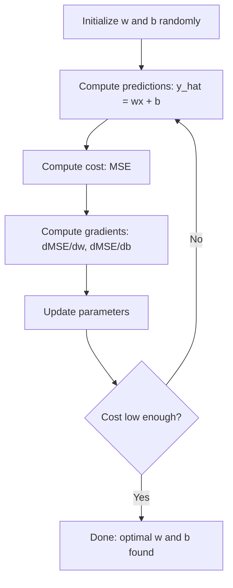

# Sự lùi lại tuyến tính

> Sự lùi lại tuyến tính vẽ đường thẳng tốt nhất qua dữ liệu của bạn. Đó là "thế giới chào" của máy học.

**Type:** Build
**Languages:** Python
**Prerequisites:** Phase 1 (Linear Algebra, Calculus, Optimization), Phase 2 Lesson 1
**Time:** ~90 minutes

## Mục tiêu học tập

- Thuộc dẫn các quy tắc cập nhật giảm gradient cho lỗi trung bình vuông và thực hiện hồi quy tuyến tính từ đầu
- So sánh sự giảm gradient và phương trình bình thường về độ phức tạp tính toán và khi nào sử dụng mỗi
- Xây dựng mô hình hồi quy tuyến tính nhiều với tiêu chuẩn hóa tính năng và giải thích các trọng lượng được học
- Giải thích cách thức quay trở lại của Ridge (L2 quy định) ngăn chặn quá phù hợp bằng cách phạt trọng lượng lớn

## Vấn đề

Bạn có dữ liệu: kích thước nhà và giá bán của chúng. Bạn muốn dự đoán giá của một ngôi nhà mới với kích thước của nó. Bạn có thể nhìn vào nó trên một cục phân tán, nhưng bạn cần một công thức. Bạn cần một đường phù hợp nhất với dữ liệu để bạn có thể cắm vào bất kỳ kích thước và có được dự đoán giá.

Lịch lý quay lại tuyến tính cho bạn đường thẳng đó. Quan trọng hơn, nó giới thiệu toàn bộ vòng đào tạo ML: xác định mô hình, xác định hàm chi phí, tối ưu hóa các tham số. Mỗi thuật toán ML theo cùng một mô hình này. Kiểm soát nó ở đây với trường hợp đơn giản nhất, và bạn sẽ nhận ra nó ở khắp mọi nơi.

Đây không chỉ là cho các vấn đề đơn giản. Sự lùi ngược tuyến tính được sử dụng trong các hệ thống sản xuất để dự đoán nhu cầu, phân tích thử nghiệm A / B, mô hình hóa tài chính và như là cơ sở cho mọi nhiệm vụ lùi ngược.

## Khái niệm

### Mô hình

Sự lùi lại tuyến tính giả định một mối quan hệ tuyến tính giữa đầu vào (x) và đầu ra (y):

```
y = wx + b
```

- `w`( trọng lượng/ độ nghiêng): y thay đổi bao nhiêu khi x tăng 1
- `b`(vi-se/cắt lưng): giá trị của y khi x = 0

Đối với nhiều đầu vào (các tính năng), điều này mở rộng đến:

```
y = w1*x1 + w2*x2 + ... + wn*xn + b
```

Hoặc trong dạng vector: `y = w^T * x + b`

Mục tiêu: tìm các giá trị của w và b làm cho y dự đoán gần như có thể với y thực tế trong tất cả các ví dụ đào tạo.

### Chức năng chi phí (Lỗi bình phương trung bình)

Bạn cần một số đơn để ghi lại những dự đoán sai lầm của bạn.

```
MSE = (1/n) * sum((y_predicted - y_actual)^2)
```

Tại sao vuông? Hai lý do. Thứ nhất, nó phạt lỗi lớn hơn các lỗi nhỏ (một lỗi 10 là 100x tồi tệ hơn một lỗi 1, không phải 10x). Thứ hai, hàm vuông là mượt mà và có thể phân biệt ở mọi nơi, điều này làm cho tối ưu hóa dễ dàng hơn.

Chức năng chi phí tạo ra bề mặt. Đối với một trọng lượng đơn w và thiên hướng b, bề mặt MSE trông giống như một bát (một hình phẳng ngọc).

### Sự giảm dần

Giảm dần tìm ra đáy bát bằng cách thực hiện các bước xuống đồi.



Các gradient cho bạn biết hai điều: hướng nào để di chuyển từng tham số, và bao nhiêu để di chuyển.

Đối với MSE với y_hat = wx + b:

```
dMSE/dw = (2/n) * sum((y_hat - y) * x)
dMSE/db = (2/n) * sum(y_hat - y)
```

Quy tắc cập nhật:

```
w = w - learning_rate * dMSE/dw
b = b - learning_rate * dMSE/db
```

Tốc độ học tập kiểm soát kích thước bước quá lớn: bạn vượt quá mức tối thiểu và đi xa. quá nhỏ: đào tạo mất mãi mãi.

### Phương trình bình thường (Solution Closed Form)

Đối với sự lùi lại tuyến tính cụ thể, có một công thức trực tiếp cho trọng lượng tối ưu mà không có bất kỳ lặp lại nào:

```
w = (X^T * X)^(-1) * X^T * y
```

Điều này đảo ngược một số liệu để giải quyết cho w trong một bước. Nó hoạt động hoàn hảo cho các tập dữ liệu nhỏ. Đối với các tập dữ liệu lớn (mọi triệu hàng hoặc hàng ngàn tính năng), giảm gradient được ưa thích vì sự đảo ngược của số liệu là O(n^3) trong số lượng các tính năng.

### Sự lùi lại hàng tuyến

Với nhiều tính năng, mô hình trở thành:

```
y = w1*x1 + w2*x2 + ... + wn*xn + b
```

Mọi thứ đều hoạt động giống nhau: MSE là hàm chi phí, độ giảm gradient cập nhật tất cả các trọng lượng cùng một lúc.

Nếu một tính năng dao động từ 0 đến 1 và một tính năng khác dao động từ 0 đến 1.000.000, giảm độ nghiêng sẽ khó khăn vì bề mặt chi phí trở nên dài.

### Phục hồi đa nôn

Nếu mối quan hệ không phải là tuyến tính thì sao? Bạn vẫn có thể sử dụng sự lùi lại tuyến tính bằng cách tạo các tính năng đa nôn:

```
y = w1*x + w2*x^2 + w3*x^3 + b
```

Đây vẫn là sự hồi quy "lín" bởi vì mô hình là tuyến tính trong trọng lượng (w1, w2, w3). Bạn chỉ sử dụng các tính năng không tuyến tính của x.

Các đa nguyên cấp cao hơn có thể phù hợp với các đường cong phức tạp hơn nhưng có nguy cơ quá phù hợp. Một đa nguyên cấp 10 sẽ đi qua mọi điểm trong một tập dữ liệu 10 điểm nhưng dự đoán kém về dữ liệu mới.

### Điểm số R-Tứ

MSE cho bạn biết bạn sai, nhưng số lượng phụ thuộc vào quy mô của y. R-quadrat (R^2) cho một thước đo độc lập quy mô:

```
R^2 = 1 - (sum of squared residuals) / (sum of squared deviations from mean)
    = 1 - SS_res / SS_tot
```

- R^2 = 1,0: dự đoán hoàn hảo
- R^2 = 0.0: mô hình không tốt hơn so với dự đoán trung bình mỗi lần
- R^2 < 0.0: mô hình tồi tệ hơn dự đoán trung bình

### Hình trước quy định (Ridge Regression)

Khi bạn có nhiều tính năng, mô hình có thể overfit bằng cách gán trọng lượng lớn.

```
Cost = MSE + lambda * sum(w_i^2)
```

Từ phạt ngăn cản trọng lượng lớn. Lambda siêu tham số kiểm soát sự đổi giá: lambda cao hơn có nghĩa là trọng lượng nhỏ hơn và quy định hơn.

```figure
linear-regression-fit
```

## Hãy xây dựng nó

### Bước 1: Tạo dữ liệu mẫu

```python
import random
import math

random.seed(42)

TRUE_W = 3.0
TRUE_B = 7.0
N_SAMPLES = 100

X = [random.uniform(0, 10) for _ in range(N_SAMPLES)]
y = [TRUE_W * x + TRUE_B + random.gauss(0, 2.0) for x in X]

print(f"Generated {N_SAMPLES} samples")
print(f"True relationship: y = {TRUE_W}x + {TRUE_B} (+ noise)")
print(f"First 5 points: {[(round(X[i], 2), round(y[i], 2)) for i in range(5)]}")
```

### Bước 2: Khản hồi tuyến tính từ đầu với sự giảm gradient

```python
class LinearRegression:
    def __init__(self, learning_rate=0.01):
        self.w = 0.0
        self.b = 0.0
        self.lr = learning_rate
        self.cost_history = []

    def predict(self, X):
        return [self.w * x + self.b for x in X]

    def compute_cost(self, X, y):
        predictions = self.predict(X)
        n = len(y)
        cost = sum((pred - actual) ** 2 for pred, actual in zip(predictions, y)) / n
        return cost

    def compute_gradients(self, X, y):
        predictions = self.predict(X)
        n = len(y)
        dw = (2 / n) * sum((pred - actual) * x for pred, actual, x in zip(predictions, y, X))
        db = (2 / n) * sum(pred - actual for pred, actual in zip(predictions, y))
        return dw, db

    def fit(self, X, y, epochs=1000, print_every=200):
        for epoch in range(epochs):
            dw, db = self.compute_gradients(X, y)
            self.w -= self.lr * dw
            self.b -= self.lr * db
            cost = self.compute_cost(X, y)
            self.cost_history.append(cost)
            if epoch % print_every == 0:
                print(f"  Epoch {epoch:4d} | Cost: {cost:.4f} | w: {self.w:.4f} | b: {self.b:.4f}")
        return self

    def r_squared(self, X, y):
        predictions = self.predict(X)
        y_mean = sum(y) / len(y)
        ss_res = sum((actual - pred) ** 2 for actual, pred in zip(y, predictions))
        ss_tot = sum((actual - y_mean) ** 2 for actual in y)
        return 1 - (ss_res / ss_tot)


print("=== Training Linear Regression (Gradient Descent) ===")
model = LinearRegression(learning_rate=0.005)
model.fit(X, y, epochs=1000, print_every=200)
print(f"\nLearned: y = {model.w:.4f}x + {model.b:.4f}")
print(f"True:    y = {TRUE_W}x + {TRUE_B}")
print(f"R-squared: {model.r_squared(X, y):.4f}")
```

### Bước 3: Phương trình bình thường (trình thức đóng)

```python
class LinearRegressionNormal:
    def __init__(self):
        self.w = 0.0
        self.b = 0.0

    def fit(self, X, y):
        n = len(X)
        x_mean = sum(X) / n
        y_mean = sum(y) / n
        numerator = sum((X[i] - x_mean) * (y[i] - y_mean) for i in range(n))
        denominator = sum((X[i] - x_mean) ** 2 for i in range(n))
        self.w = numerator / denominator
        self.b = y_mean - self.w * x_mean
        return self

    def predict(self, X):
        return [self.w * x + self.b for x in X]

    def r_squared(self, X, y):
        predictions = self.predict(X)
        y_mean = sum(y) / len(y)
        ss_res = sum((actual - pred) ** 2 for actual, pred in zip(y, predictions))
        ss_tot = sum((actual - y_mean) ** 2 for actual in y)
        return 1 - (ss_res / ss_tot)


print("\n=== Normal Equation (Closed-Form) ===")
model_normal = LinearRegressionNormal()
model_normal.fit(X, y)
print(f"Learned: y = {model_normal.w:.4f}x + {model_normal.b:.4f}")
print(f"R-squared: {model_normal.r_squared(X, y):.4f}")
```

### Bước 4: Sự lùi lại tuyến tính nhiều

```python
class MultipleLinearRegression:
    def __init__(self, n_features, learning_rate=0.01):
        self.weights = [0.0] * n_features
        self.bias = 0.0
        self.lr = learning_rate
        self.cost_history = []

    def predict_single(self, x):
        return sum(w * xi for w, xi in zip(self.weights, x)) + self.bias

    def predict(self, X):
        return [self.predict_single(x) for x in X]

    def compute_cost(self, X, y):
        predictions = self.predict(X)
        n = len(y)
        return sum((pred - actual) ** 2 for pred, actual in zip(predictions, y)) / n

    def fit(self, X, y, epochs=1000, print_every=200):
        n = len(y)
        n_features = len(X[0])
        for epoch in range(epochs):
            predictions = self.predict(X)
            errors = [pred - actual for pred, actual in zip(predictions, y)]
            for j in range(n_features):
                grad = (2 / n) * sum(errors[i] * X[i][j] for i in range(n))
                self.weights[j] -= self.lr * grad
            grad_b = (2 / n) * sum(errors)
            self.bias -= self.lr * grad_b
            cost = self.compute_cost(X, y)
            self.cost_history.append(cost)
            if epoch % print_every == 0:
                print(f"  Epoch {epoch:4d} | Cost: {cost:.4f}")
        return self

    def r_squared(self, X, y):
        predictions = self.predict(X)
        y_mean = sum(y) / len(y)
        ss_res = sum((actual - pred) ** 2 for actual, pred in zip(y, predictions))
        ss_tot = sum((actual - y_mean) ** 2 for actual in y)
        return 1 - (ss_res / ss_tot)


random.seed(42)
N = 100
X_multi = []
y_multi = []
for _ in range(N):
    size = random.uniform(500, 3000)
    bedrooms = random.randint(1, 5)
    age = random.uniform(0, 50)
    price = 50 * size + 10000 * bedrooms - 1000 * age + 50000 + random.gauss(0, 20000)
    X_multi.append([size, bedrooms, age])
    y_multi.append(price)


def standardize(X):
    n_features = len(X[0])
    means = [sum(X[i][j] for i in range(len(X))) / len(X) for j in range(n_features)]
    stds = []
    for j in range(n_features):
        variance = sum((X[i][j] - means[j]) ** 2 for i in range(len(X))) / len(X)
        stds.append(variance ** 0.5)
    X_scaled = []
    for i in range(len(X)):
        row = [(X[i][j] - means[j]) / stds[j] if stds[j] > 0 else 0 for j in range(n_features)]
        X_scaled.append(row)
    return X_scaled, means, stds


y_mean_val = sum(y_multi) / len(y_multi)
y_std_val = (sum((yi - y_mean_val) ** 2 for yi in y_multi) / len(y_multi)) ** 0.5
y_scaled = [(yi - y_mean_val) / y_std_val for yi in y_multi]

X_scaled, x_means, x_stds = standardize(X_multi)

print("\n=== Multiple Linear Regression (3 features) ===")
print("Features: house size, bedrooms, age")
multi_model = MultipleLinearRegression(n_features=3, learning_rate=0.01)
multi_model.fit(X_scaled, y_scaled, epochs=1000, print_every=200)

print(f"\nWeights (standardized): {[round(w, 4) for w in multi_model.weights]}")
print(f"Bias (standardized): {multi_model.bias:.4f}")
print(f"R-squared: {multi_model.r_squared(X_scaled, y_scaled):.4f}")
```

### Bước 5: Phục hồi đa nôn

```python
class PolynomialRegression:
    def __init__(self, degree, learning_rate=0.01):
        self.degree = degree
        self.weights = [0.0] * degree
        self.bias = 0.0
        self.lr = learning_rate

    def make_features(self, X):
        return [[x ** (d + 1) for d in range(self.degree)] for x in X]

    def predict(self, X):
        features = self.make_features(X)
        return [sum(w * f for w, f in zip(self.weights, row)) + self.bias for row in features]

    def fit(self, X, y, epochs=1000, print_every=200):
        features = self.make_features(X)
        n = len(y)
        for epoch in range(epochs):
            predictions = [sum(w * f for w, f in zip(self.weights, row)) + self.bias for row in features]
            errors = [pred - actual for pred, actual in zip(predictions, y)]
            for j in range(self.degree):
                grad = (2 / n) * sum(errors[i] * features[i][j] for i in range(n))
                self.weights[j] -= self.lr * grad
            grad_b = (2 / n) * sum(errors)
            self.bias -= self.lr * grad_b
            if epoch % print_every == 0:
                cost = sum(e ** 2 for e in errors) / n
                print(f"  Epoch {epoch:4d} | Cost: {cost:.6f}")
        return self

    def r_squared(self, X, y):
        predictions = self.predict(X)
        y_mean = sum(y) / len(y)
        ss_res = sum((actual - pred) ** 2 for actual, pred in zip(y, predictions))
        ss_tot = sum((actual - y_mean) ** 2 for actual in y)
        return 1 - (ss_res / ss_tot)


random.seed(42)
X_poly = [x / 10.0 for x in range(0, 50)]
y_poly = [0.5 * x ** 2 - 2 * x + 3 + random.gauss(0, 1.0) for x in X_poly]

x_max = max(abs(x) for x in X_poly)
X_poly_norm = [x / x_max for x in X_poly]
y_poly_mean = sum(y_poly) / len(y_poly)
y_poly_std = (sum((yi - y_poly_mean) ** 2 for yi in y_poly) / len(y_poly)) ** 0.5
y_poly_norm = [(yi - y_poly_mean) / y_poly_std for yi in y_poly]

print("\n=== Polynomial Regression (degree 2 vs degree 5) ===")
print("True relationship: y = 0.5x^2 - 2x + 3")

print("\nDegree 2:")
poly2 = PolynomialRegression(degree=2, learning_rate=0.1)
poly2.fit(X_poly_norm, y_poly_norm, epochs=2000, print_every=500)
print(f"  R-squared: {poly2.r_squared(X_poly_norm, y_poly_norm):.4f}")

print("\nDegree 5:")
poly5 = PolynomialRegression(degree=5, learning_rate=0.1)
poly5.fit(X_poly_norm, y_poly_norm, epochs=2000, print_every=500)
print(f"  R-squared: {poly5.r_squared(X_poly_norm, y_poly_norm):.4f}")

print("\nDegree 2 fits the true curve well. Degree 5 fits training data slightly better")
print("but risks overfitting on new data.")
```

### Bước 6: Khản hồi đồi (L2 quy định)

```python
class RidgeRegression:
    def __init__(self, n_features, learning_rate=0.01, alpha=1.0):
        self.weights = [0.0] * n_features
        self.bias = 0.0
        self.lr = learning_rate
        self.alpha = alpha

    def predict_single(self, x):
        return sum(w * xi for w, xi in zip(self.weights, x)) + self.bias

    def predict(self, X):
        return [self.predict_single(x) for x in X]

    def fit(self, X, y, epochs=1000, print_every=200):
        n = len(y)
        n_features = len(X[0])
        for epoch in range(epochs):
            predictions = self.predict(X)
            errors = [pred - actual for pred, actual in zip(predictions, y)]
            mse = sum(e ** 2 for e in errors) / n
            reg_term = self.alpha * sum(w ** 2 for w in self.weights)
            cost = mse + reg_term
            for j in range(n_features):
                grad = (2 / n) * sum(errors[i] * X[i][j] for i in range(n))
                grad += 2 * self.alpha * self.weights[j]
                self.weights[j] -= self.lr * grad
            grad_b = (2 / n) * sum(errors)
            self.bias -= self.lr * grad_b
            if epoch % print_every == 0:
                print(f"  Epoch {epoch:4d} | Cost: {cost:.4f} | L2 penalty: {reg_term:.4f}")
        return self


print("\n=== Ridge Regression (L2 Regularization) ===")
print("Same data as multiple regression, with alpha=0.1")
ridge = RidgeRegression(n_features=3, learning_rate=0.01, alpha=0.1)
ridge.fit(X_scaled, y_scaled, epochs=1000, print_every=200)
print(f"\nRidge weights: {[round(w, 4) for w in ridge.weights]}")
print(f"Plain weights: {[round(w, 4) for w in multi_model.weights]}")
print("Ridge weights are smaller (shrunk toward zero) due to the L2 penalty.")
```

## Sử dụng nó

Bây giờ điều tương tự với scikit-learn, đó là những gì bạn thực sự sẽ sử dụng trong sản xuất.

```python
from sklearn.linear_model import LinearRegression as SklearnLR
from sklearn.linear_model import Ridge
from sklearn.preprocessing import PolynomialFeatures, StandardScaler
from sklearn.model_selection import train_test_split
from sklearn.metrics import mean_squared_error, r2_score
import numpy as np

np.random.seed(42)
X_sk = np.random.uniform(0, 10, (100, 1))
y_sk = 3.0 * X_sk.squeeze() + 7.0 + np.random.normal(0, 2.0, 100)

X_train, X_test, y_train, y_test = train_test_split(X_sk, y_sk, test_size=0.2, random_state=42)

lr = SklearnLR()
lr.fit(X_train, y_train)
y_pred = lr.predict(X_test)

print("=== Scikit-learn Linear Regression ===")
print(f"Coefficient (w): {lr.coef_[0]:.4f}")
print(f"Intercept (b): {lr.intercept_:.4f}")
print(f"R-squared (test): {r2_score(y_test, y_pred):.4f}")
print(f"MSE (test): {mean_squared_error(y_test, y_pred):.4f}")

poly = PolynomialFeatures(degree=2, include_bias=False)
X_poly_sk = poly.fit_transform(X_train)
X_poly_test = poly.transform(X_test)

lr_poly = SklearnLR()
lr_poly.fit(X_poly_sk, y_train)
print(f"\nPolynomial degree 2 R-squared: {r2_score(y_test, lr_poly.predict(X_poly_test)):.4f}")

scaler = StandardScaler()
X_train_scaled = scaler.fit_transform(X_train)
X_test_scaled = scaler.transform(X_test)

ridge = Ridge(alpha=1.0)
ridge.fit(X_train_scaled, y_train)
print(f"Ridge R-squared: {r2_score(y_test, ridge.predict(X_test_scaled)):.4f}")
print(f"Ridge coefficient: {ridge.coef_[0]:.4f}")
```

Việc thực hiện từ đầu và scikit-learn của bạn tạo ra kết quả tương tự. Sự khác biệt: scikit-learn xử lý các trường hợp cạnh, ổn định số và tối ưu hóa hiệu suất. Sử dụng thư viện để sản xuất. Sử dụng phiên bản từ đầu để hiểu những gì đang xảy ra.

## Chuyển nó

Bài học này mang lại:
- `outputs/skill-regression.md`- kỹ năng để chọn cách tiếp cận hồi quy đúng đắn dựa trên vấn đề

## Các bài tập

1. Thực hiện giảm độ sốc hàng loạt, giảm độ sốc stochastic (SGD), và giảm độ sốc hàng loạt nhỏ. So sánh tốc độ hội tụ trên cùng một tập dữ liệu.
2. Tạo dữ liệu từ hàm khối (y = ax^3 + bx^2 + cx + d + tiếng ồn). Phù hợp nhiều chữ số của độ 1, 3 và 10. So sánh đào tạo R^2 và thử nghiệm R^2.
3. Thực hiện hồi quy Lasso (L1 regularization: penalty alpha *(((((((((((((((((((((((((((((((((((((((((((((((((((((((((((((((((((((((((((((((((((((((((((((((((((((((((((((((((((((((((((((((((((((((((((((((((((((((((((((((((((((((((((((((((((((((((((((((((((((((((((((((((((((((((((((((((((((((((((((((((((((((((((((((((((((((((((((((((((((((((((((((((((((((((((((((((((((((((((((((((((((((((((((((((((((((((((((((((((((((((((((((((((((((((((((((((((((((((((((((((((((((((((((((((((((((((((((((((((((((((((((((((((((((((((((((((((((((((((((((((((((((((((((

## Các điều khoản chính

| Term | What people say | What it actually means |
|------|----------------|----------------------|
| Linear regression | "Draw a line through data" | Find weight w and bias b that minimize the sum of squared differences between wx+b and actual y values |
| Cost function | "How bad the model is" | A function that maps model parameters to a single number measuring prediction error, which optimization minimizes |
| Mean squared error | "Average of squared errors" | (1/n) * sum of (predicted - actual)^2, penalizing large errors disproportionately |
| Gradient descent | "Walk downhill" | Iteratively adjust parameters in the direction that reduces the cost function, using partial derivatives |
| Learning rate | "Step size" | A scalar that controls how much parameters change per gradient descent step |
| Normal equation | "Solve it directly" | The closed-form solution w = (X^T X)^-1 X^T y that gives optimal weights without iteration |
| R-squared | "How good the fit is" | The fraction of variance in y explained by the model, ranging from negative infinity to 1.0 |
| Feature scaling | "Make features comparable" | Transforming features to similar ranges (e.g., zero mean, unit variance) so gradient descent converges faster |
| Regularization | "Penalize complexity" | Adding a term to the cost function that shrinks weights, preventing overfitting |
| Ridge regression | "L2 regularization" | Linear regression with a penalty of lambda * sum(w_i^2) added to MSE |
| Polynomial regression | "Fitting curves with linear math" | Linear regression on polynomial features (x, x^2, x^3, ...), still linear in the weights |
| Overfitting | "Memorizing training data" | Using a model so complex that it fits noise in training data and fails on new data |

## Đọc thêm

- [An Introduction to Statistical Learning (ISLR)](https://www.statlearning.com/)-- PDF miễn phí, chương 3 và 6 bao gồm sự lùi lại tuyến tính và quy định với các ví dụ R thực tế
- [The Elements of Statistical Learning (ESL)](https://hastie.su.domains/ElemStatLearn/)-- miễn phí PDF, là một người bạn toán học hơn với ISLR với điều trị sâu hơn của sườn núi và lasso
- [Stanford CS229 Lecture Notes on Linear Regression](https://cs229.stanford.edu/main_notes.pdf)-- Các ghi chú của Andrew Ng lấy phương trình bình thường và sự giảm gradient từ các nguyên tắc đầu tiên
- [scikit-learn LinearRegression documentation](https://scikit-learn.org/stable/modules/linear_model.html)-- tham khảo thực tế cho LinearRegression, Ridge, Lasso và ElasticNet với các ví dụ mã
