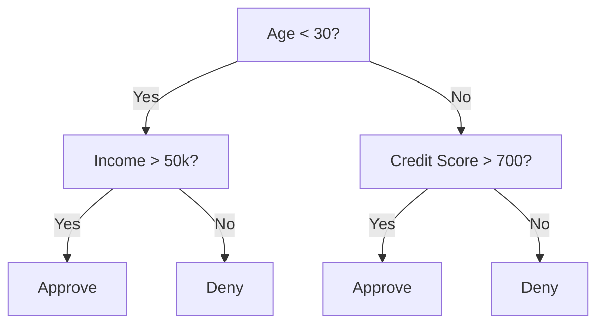
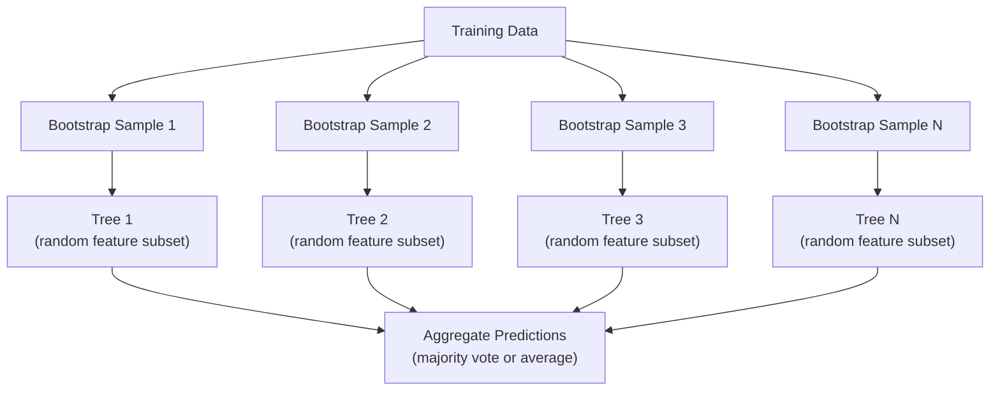

# Cây quyết định và rừng ngẫu nhiên

> Một cây quyết định chỉ là một biểu đồ lưu lượng, nhưng một khu rừng của chúng là một trong những công cụ mạnh nhất trong ML.

**Type:** Build
**Language:**Python
**Prerequisites:** Phase 1 (Lessons 09 Information Theory, 06 Probability)
**Time:** ~90 minutes

## Mục tiêu học tập

- Thực hiện tính toán sự sa thải Gini, entropy và thu nhập thông tin để tìm ra sự chia rẽ cây quyết định tối ưu
- Xây dựng một phân loại cây quyết định từ đầu với các điều khiển trước khi cắt (thực độ tối đa, mẫu ít nhất)
- Xây dựng một khu rừng ngẫu nhiên bằng cách sử dụng lấy mẫu bootstrap và tính năng ngẫu nhiên, và giải thích tại sao nó làm giảm sự khác biệt
- So sánh tầm quan trọng của tính năng MDI với tầm quan trọng của permutation và xác định khi nào MDI bị thiên vị

## Vấn đề

Bạn có dữ liệu bảng. Dòng là mẫu, cột là tính năng, và có một cột mục tiêu bạn muốn dự đoán. Bạn có thể ném một mạng lưới thần kinh vào nó. Nhưng đối với dữ liệu bảng, các mô hình dựa trên cây (cây quyết định, rừng ngẫu nhiên, cây tăng gradient) thường vượt trội hơn việc học sâu. Các cuộc thi Kaggle về dữ liệu có cấu trúc được XGBoost và LightGBM thống trị, chứ không phải các biến đổi.

Tại sao? Cây xử lý các loại tính năng hỗn hợp (tương đương số và danh mục) mà không cần xử lý trước. Cây xử lý các mối quan hệ không tuyến tính mà không cần kỹ thuật tính năng. Chúng có thể giải thích: bạn có thể nhìn vào cây và thấy chính xác lý do tại sao dự đoán đã được thực hiện. Và rừng ngẫu nhiên, có trung bình nhiều cây, rất kháng với quá phù hợp với các tập dữ liệu có kích thước vừa phải.

Bài học này xây dựng cây quyết định từ đầu bằng cách sử dụng phân chia tái tạo, sau đó xây dựng một khu rừng ngẫu nhiên ở trên. Bạn sẽ thực hiện toán học đằng sau tiêu chí phân chia (thơ nhiễm Gini, entropy, thu nhập thông tin) và hiểu tại sao một tập hợp học sinh yếu trở thành một tập hợp mạnh mẽ.

## Khái niệm

### Cái mà cây quyết định làm

Một cây quyết định chia không gian tính năng thành vùng hình chữ nhật bằng cách hỏi một chuỗi các câu hỏi có/không.



Mỗi nút nội bộ kiểm tra một tính năng đối với một ngưỡng. Mỗi nút lá tạo ra một dự đoán. Để phân loại một điểm dữ liệu mới, bạn bắt đầu từ gốc và theo các nhánh cho đến khi bạn đạt đến một lá.

Cây được xây dựng từ trên xuống bằng cách chọn, tại mỗi nút, tính năng và ngưỡng phân chia dữ liệu tốt nhất. "Tốt nhất" được xác định bằng tiêu chí chia.

### Các tiêu chí chia: đo lường tạp chất

Ở mỗi nút, chúng tôi có một tập hợp các mẫu. Chúng tôi muốn chia chúng để các nút trẻ được tạo ra là "tế sạch" nhất có thể, nghĩa là mỗi đứa trẻ chứa chủ yếu một lớp.

**Gini impurity**đo khả năng một mẫu được chọn ngẫu nhiên sẽ bị phân loại sai nếu nó được dán nhãn theo phân phối lớp ở nút đó.

```
Gini(S) = 1 - sum(p_k^2)

where p_k is the proportion of class k in set S.
```

Đối với một nút tinh khiết (tất cả một lớp), Gini = 0. Đối với một phân chia nhị phân với lớp 50/50, Gini = 0.5.

```
Example: 6 cats, 4 dogs

Gini = 1 - (0.6^2 + 0.4^2) = 1 - (0.36 + 0.16) = 0.48
```

**Entropy**đo nội dung thông tin (trầm lẫn) trong một nút.

```
Entropy(S) = -sum(p_k * log2(p_k))
```

Đối với một nút thuần, entropy = 0. Đối với một phân chia nhị phân 50/50, entropy = 1.0.

```
Example: 6 cats, 4 dogs

Entropy = -(0.6 * log2(0.6) + 0.4 * log2(0.4))
        = -(0.6 * -0.737 + 0.4 * -1.322)
        = 0.442 + 0.529
        = 0.971 bits
```

**Information gain**là sự giảm bớt của sự ô nhiễm (entropy hoặc Gini) sau khi chia.

```
IG(S, feature, threshold) = Impurity(S) - weighted_avg(Impurity(S_left), Impurity(S_right))

where the weights are the proportions of samples in each child.
```

Các thuật toán tham lam tại mỗi nút: thử mọi tính năng và mọi ngưỡng có thể. chọn cặp (tương tự, ngưỡng) để tối đa hóa thu nhập thông tin.

### Làm thế nào chia làm việc

Đối với một tập dữ liệu với n tính năng và m mẫu tại nút hiện tại:

1. Đối với mỗi tính năng j (j = 1 đến n):
   - Đặt các mẫu theo tính năng j
   - Hãy thử mỗi điểm trung giữa các giá trị khác nhau liên tiếp như một ngưỡng
   - Xét số thu nhập thông tin cho mỗi ngưỡng
2. Chọn tính năng và ngưỡng có mức thu nhập thông tin cao nhất
3. Chia dữ liệu thành bên trái (chỉ số <= ngưỡng) và bên phải (chỉ số > ngưỡng)
4. Lần lặp lại trên mỗi đứa trẻ

Cách tiếp cận tham lam này không đảm bảo cây tối ưu trên toàn cầu. Tìm cây tối ưu là NP-khó. Nhưng chia tham lam hoạt động tốt trong thực tế.

### Điều kiện dừng

Không ngừng, cây phát triển cho đến khi mỗi lá sạch (một mẫu mỗi lá).

**Pre-pruning**ngăn chặn cây trước khi nó phát triển đầy đủ:
- Độ sâu tối đa: dừng chia khi cây đạt độ sâu nhất định
- Mức mẫu tối thiểu cho mỗi lá: dừng nếu một nút có ít hơn k mẫu
- Tối thiểu thu nhập thông tin: dừng nếu chia tốt nhất cải thiện độ ô nhiễm dưới ngưỡng
- Nốt lá tối đa: giới hạn tổng số lá

**Post-pruning**và làm cây đầy đủ, rồi cắt lại nó:
- Việc cắt đứt chi phí phức tạp (được sử dụng bởi scikit-learn): thêm một hình phạt tương xứng với số lượng lá.
- Giảm lỗi cắt: loại bỏ một con cây nếu lỗi xác thực không tăng

Việc cắt trước dễ dàng hơn và nhanh hơn. Sau khi cắt, cây thường có thể tốt hơn vì nó không ngăn chặn sớm sự chia cắt có thể dẫn đến sự chia cắt hữu ích hơn nữa.

### Cây quyết định cho sự lùi lại

Đối với sự lùi lại, dự đoán lá là trung bình của các giá trị mục tiêu trong lá đó.

**Variance reduction**thay thế thu nhập thông tin:

```
VR(S, feature, threshold) = Var(S) - weighted_avg(Var(S_left), Var(S_right))
```

Chọn phân chia làm giảm sự khác biệt nhiều nhất. Cây phân chia không gian đầu vào thành các khu vực, và dự đoán một liên tục (tỷ lệ trung bình) trong mỗi khu vực.

### Rừng ngẫu nhiên: sức mạnh của các tập đoàn

Một cây quyết định duy nhất là sự khác biệt cao. Những thay đổi nhỏ trong dữ liệu có thể tạo ra cây hoàn toàn khác nhau. Rừng ngẫu nhiên khắc phục điều này bằng cách trung bình nhiều cây.



Hai nguồn ngẫu nhiên làm cho cây đa dạng:

**Bagging (bootstrap aggregating):**Mỗi cây được đào tạo trên một mẫu bootstrap, một mẫu ngẫu nhiên với thay thế từ dữ liệu đào tạo. Khoảng 63% các mẫu ban đầu xuất hiện trong mỗi bootstrap (t còn lại là các mẫu ngoài túi có thể được sử dụng để xác thực).

**Feature randomization:**Tại mỗi phân chia, chỉ một bộ phụ ngẫu nhiên của các tính năng được xem xét. Đối với phân loại, mặc định là sqrt(n_features). Đối với sự lùi lại, n_features/3. Điều này ngăn chặn tất cả các cây phân chia trên cùng một tính năng thống trị.

Điều quan trọng: trung bình nhiều cây không liên quan làm giảm sự khác biệt mà không tăng thiên vị. Mỗi cây có thể là trung bình.

### Tầm quan trọng của tính năng

Các khu rừng ngẫu nhiên tự nhiên cung cấp điểm số tầm quan trọng của tính năng.

**Mean Decrease in Impurity (MDI):**Đối với mỗi tính năng, cộng tổng sự giảm tạp hóa trên tất cả các cây và tất cả các nút nơi tính năng đó được sử dụng.

```
importance(feature_j) = sum over all nodes where feature_j is used:
    (n_samples_at_node / n_total_samples) * impurity_decrease
```

Điều này nhanh (được tính toán trong quá trình đào tạo) nhưng thiên hướng về các tính năng và tính năng có tính năng cardinality cao với nhiều điểm chia nhỏ có thể xảy ra.

**Permutation importance**là sự thay thế: trộn các giá trị của một tính năng và đo mức độ chính xác của mô hình giảm. đáng tin cậy hơn nhưng chậm hơn.

### Khi cây cối đánh mạng thần kinh

Cây và rừng thống trị các mạng thần kinh trên dữ liệu bảng tính.

| Factor | Trees | Neural networks |
|--------|-------|----------------|
| Mixed types (numeric + categorical) | Native support | Need encoding |
| Small datasets (< 10k rows) | Work well | Overfit |
| Feature interactions | Found by splitting | Need architecture design |
| Interpretability | Full transparency | Black box |
| Training time | Minutes | Hours |
| Hyperparameter sensitivity | Low | High |

Các mạng thần kinh chiến thắng khi dữ liệu có cấu trúc không gian hoặc theo trình tự (hình ảnh, văn bản, âm thanh). Đối với các bảng tính năng phẳng, cây là mặc định.

```figure
decision-tree-depth
```

## Hãy xây dựng nó

### Bước 1: Sự vô nhiễm và entropy của Gini

Xây dựng cả hai tiêu chí chia cắt từ đầu và xác minh họ đồng ý về những chia cắt nào là tốt.

```python
import math

def gini_impurity(labels):
    n = len(labels)
    if n == 0:
        return 0.0
    counts = {}
    for label in labels:
        counts[label] = counts.get(label, 0) + 1
    return 1.0 - sum((c / n) ** 2 for c in counts.values())

def entropy(labels):
    n = len(labels)
    if n == 0:
        return 0.0
    counts = {}
    for label in labels:
        counts[label] = counts.get(label, 0) + 1
    return -sum(
        (c / n) * math.log2(c / n) for c in counts.values() if c > 0
    )
```

### Bước 2: Tìm ra chia tốt nhất

Hãy thử mọi tính năng và ngưỡng, trả lại một người có thu nhập thông tin cao nhất.

```python
def information_gain(parent_labels, left_labels, right_labels, criterion="gini"):
    measure = gini_impurity if criterion == "gini" else entropy
    n = len(parent_labels)
    n_left = len(left_labels)
    n_right = len(right_labels)
    if n_left == 0 or n_right == 0:
        return 0.0
    parent_impurity = measure(parent_labels)
    child_impurity = (
        (n_left / n) * measure(left_labels) +
        (n_right / n) * measure(right_labels)
    )
    return parent_impurity - child_impurity
```

### Bước 3: Xây dựng lớp DecisionTree

Sự phân chia lặp lại, dự đoán và theo dõi tính năng quan trọng. `_build`là trái tim của cây: nó dừng lại khi một nút là tinh khiết hoặc đạt được giới hạn trước khi cắt, nếu không nó sẽ có được sự chia tốt nhất và lặp lại vào cả hai trẻ em.

```python
import random

class DecisionTree:
    def __init__(self, max_depth=None, min_samples_split=2,
                 min_samples_leaf=1, criterion="gini",
                 max_features=None):
        self.max_depth = max_depth
        self.min_samples_split = min_samples_split
        self.min_samples_leaf = min_samples_leaf
        self.criterion = criterion
        self.max_features = max_features
        self.tree = None
        self.feature_importances_ = None

    def fit(self, X, y):
        self.n_features = len(X[0])
        self.feature_importances_ = [0.0] * self.n_features
        self.n_samples = len(X)
        self.tree = self._build(X, y, depth=0)
        total = sum(self.feature_importances_)
        if total > 0:
            self.feature_importances_ = [
                fi / total for fi in self.feature_importances_
            ]

    def predict(self, X):
        return [self._predict_one(x, self.tree) for x in X]

    def _build(self, X, y, depth):
        if len(set(y)) == 1:
            return {"leaf": True, "value": y[0]}

        if self.max_depth is not None and depth >= self.max_depth:
            return self._make_leaf(y)

        if len(y) < self.min_samples_split:
            return self._make_leaf(y)

        best_feature, best_threshold, best_gain = self._best_split(X, y)

        if best_feature is None or best_gain <= 0:
            return self._make_leaf(y)

        left_X, left_y, right_X, right_y = self._split_data(
            X, y, best_feature, best_threshold
        )

        if len(left_y) < self.min_samples_leaf or len(right_y) < self.min_samples_leaf:
            return self._make_leaf(y)

        weight = len(y) / self.n_samples
        self.feature_importances_[best_feature] += weight * best_gain

        return {
            "leaf": False,
            "feature": best_feature,
            "threshold": best_threshold,
            "left": self._build(left_X, left_y, depth + 1),
            "right": self._build(right_X, right_y, depth + 1),
        }

    def _make_leaf(self, y):
        counts = {}
        for label in y:
            counts[label] = counts.get(label, 0) + 1
        return {"leaf": True, "value": max(counts, key=counts.get)}

    def _best_split(self, X, y):
        best_feature = None
        best_threshold = None
        best_gain = -1.0

        if self.max_features == "sqrt":
            k = max(1, int(math.sqrt(self.n_features)))
            feature_indices = random.sample(range(self.n_features), k)
        elif isinstance(self.max_features, int):
            if self.max_features < 1:
                raise ValueError("max_features must be at least 1 when given as an integer")
            k = min(self.max_features, self.n_features)
            feature_indices = random.sample(range(self.n_features), k)
        else:
            feature_indices = list(range(self.n_features))

        for feature_idx in feature_indices:
            values = sorted(set(X[i][feature_idx] for i in range(len(X))))
            if len(values) <= 1:
                continue

            for i in range(len(values) - 1):
                threshold = (values[i] + values[i + 1]) / 2.0
                left_y = [y[j] for j in range(len(X)) if X[j][feature_idx] <= threshold]
                right_y = [y[j] for j in range(len(X)) if X[j][feature_idx] > threshold]

                if len(left_y) < self.min_samples_leaf or len(right_y) < self.min_samples_leaf:
                    continue

                gain = information_gain(y, left_y, right_y, self.criterion)
                if gain > best_gain:
                    best_gain = gain
                    best_feature = feature_idx
                    best_threshold = threshold

        return best_feature, best_threshold, best_gain

    def _split_data(self, X, y, feature, threshold):
        left_X, left_y, right_X, right_y = [], [], [], []
        for i in range(len(X)):
            if X[i][feature] <= threshold:
                left_X.append(X[i])
                left_y.append(y[i])
            else:
                right_X.append(X[i])
                right_y.append(y[i])
        return left_X, left_y, right_X, right_y

    def _predict_one(self, x, node):
        if node["leaf"]:
            return node["value"]
        if x[node["feature"]] <= node["threshold"]:
            return self._predict_one(x, node["left"])
        return self._predict_one(x, node["right"])
```

### Bước 4: Xây dựng lớp RandomForest

Bootstrap lấy mẫu, tính năng ngẫu nhiên, và bỏ phiếu đa số.

```python
class RandomForest:
    def __init__(self, n_trees=100, max_depth=None,
                 min_samples_split=2, max_features="sqrt",
                 criterion="gini"):
        self.n_trees = n_trees
        self.max_depth = max_depth
        self.min_samples_split = min_samples_split
        self.max_features = max_features
        self.criterion = criterion
        self.trees = []

    def fit(self, X, y):
        n = len(X)
        for _ in range(self.n_trees):
            indices = [random.randint(0, n - 1) for _ in range(n)]
            X_boot = [X[i] for i in indices]
            y_boot = [y[i] for i in indices]
            tree = DecisionTree(
                max_depth=self.max_depth,
                min_samples_split=self.min_samples_split,
                max_features=self.max_features,
                criterion=self.criterion,
            )
            tree.fit(X_boot, y_boot)
            self.trees.append(tree)

    def predict(self, X):
        all_preds = [tree.predict(X) for tree in self.trees]
        predictions = []
        for i in range(len(X)):
            votes = {}
            for preds in all_preds:
                v = preds[i]
                votes[v] = votes.get(v, 0) + 1
            predictions.append(max(votes, key=votes.get))
        return predictions
```

Nhìn xem`code/trees.py`cho việc thực hiện đầy đủ với tất cả các phương pháp hỗ trợ.

## Sử dụng nó

Với scikit-learn, đào tạo một khu rừng ngẫu nhiên là ba dòng:

```python
from sklearn.ensemble import RandomForestClassifier
from sklearn.datasets import load_iris
from sklearn.model_selection import train_test_split

X, y = load_iris(return_X_y=True)
X_train, X_test, y_train, y_test = train_test_split(X, y, random_state=42)

rf = RandomForestClassifier(n_estimators=100, random_state=42)
rf.fit(X_train, y_train)
print(f"Accuracy: {rf.score(X_test, y_test):.4f}")
print(f"Feature importances: {rf.feature_importances_}")
```

Trong thực tế, cây tăng gradient (XGBoost, LightGBM, CatBoost) thường mạnh hơn rừng ngẫu nhiên vì chúng xây dựng cây theo trình tự, với mỗi cây sửa lỗi của những cây trước đó.

## Chuyển nó

Bài học này sẽ mang lại kết quả `outputs/prompt-tree-interpreter.md`- một lời nhắc giải thích phân chia cây quyết định cho các bên liên quan kinh doanh. Đưa cho nó cấu trúc của cây được đào tạo (thậm, tính năng, ngưỡng phân chia, độ chính xác) và nó dịch mô hình thành các quy tắc ngôn ngữ đơn giản, xếp hạng tính năng quan trọng, cờ quá đồi hoặc rò rỉ, và khuyến cáo các bước tiếp theo. Sử dụng nó bất cứ khi nào bạn cần giải thích mô hình dựa trên cây cho một người không đọc mã.

## Các bài tập

1. Đào tạo một cây quyết định duy nhất trên một tập dữ liệu 2D với 3 lớp. Hướng dẫn các phân chia và vẽ ranh giới quyết định hình chữ nhật. So sánh ranh giới tại max_depth=2 vs max_depth=10.

2. Thực hiện phân chia giảm biến số cho cây hồi quy. Tạo y = sin(x) + tiếng ồn cho 200 điểm và phù hợp với cây hồi quy của bạn. Chụp các dự đoán liên tục từng mảnh của cây so với đường cong thực.

3. Xây dựng một khu rừng ngẫu nhiên với 1, 5, 10, 50 và 200 cây. Cài đặt độ chính xác đào tạo và kiểm tra độ chính xác so với số lượng cây.

4. So sánh sự vô nhiễm của Gini với entropy như là các tiêu chí chia rẽ trên 5 bộ dữ liệu khác nhau. đo độ chính xác và chiều sâu cây. Trong hầu hết các trường hợp, chúng tạo ra kết quả gần giống nhau. Giải thích lý do tại sao.

5. Thực hiện tầm quan trọng của permutation. So sánh nó với tầm quan trọng của MDI trên một tập dữ liệu nơi một tính năng là tiếng ồn ngẫu nhiên nhưng có tính năng cardinality cao. MDI sẽ xếp hạng tính năng tiếng ồn cao.

## Các điều khoản chính

| Term | What people say | What it actually means |
|------|----------------|----------------------|
| Decision tree | "A flowchart for predictions" | A model that partitions feature space into rectangular regions by learning a sequence of if/else splits |
| Gini impurity | "How mixed the node is" | Probability of misclassifying a random sample at a node. 0 = pure, 0.5 = maximum impurity for binary |
| Entropy | "The disorder in a node" | Information content at a node. 0 = pure, 1.0 = maximum uncertainty for binary. From information theory |
| Information gain | "How good a split is" | Reduction in impurity after a split. The greedy criterion for choosing splits |
| Pre-pruning | "Stop the tree early" | Stopping tree growth early by setting max depth, min samples, or min gain thresholds |
| Post-pruning | "Trim the tree after" | Growing the full tree, then removing subtrees that do not improve validation performance |
| Bagging | "Train on random subsets" | Bootstrap aggregating. Train each model on a different random sample with replacement |
| Random forest | "A bunch of trees" | Ensemble of decision trees, each trained on a bootstrap sample with random feature subsets at each split |
| Feature importance (MDI) | "Which features matter" | Total impurity decrease contributed by each feature, summed across all trees and nodes |
| Permutation importance | "Shuffle and check" | Accuracy drop when a feature's values are randomly shuffled. More reliable than MDI for noisy features |
| Variance reduction | "The regression version of info gain" | The regression tree analogue of information gain. Picks the split that reduces target variance the most |
| Bootstrap sample | "Random sample with repeats" | A random sample drawn with replacement from the original dataset. Same size, but with duplicates |

## Đọc thêm

- [Breiman: Random Forests (2001)](https://link.springer.com/article/10.1023/A:1010933404324)- giấy rừng ngẫu nhiên gốc
- [Grinsztajn et al.: Why do tree-based models still outperform deep learning on tabular data? (2022)](https://arxiv.org/abs/2207.08815)- so sánh chặt chẽ giữa cây và mạng thần kinh trong các nhiệm vụ bảng
- [scikit-learn Decision Trees documentation](https://scikit-learn.org/stable/modules/tree.html)- hướng dẫn thực tế với các công cụ hình ảnh hóa
- [XGBoost: A Scalable Tree Boosting System (Chen & Guestrin, 2016)](https://arxiv.org/abs/1603.02754)- giấy tăng độ nghiêng chiếm ưu thế Kaggle
