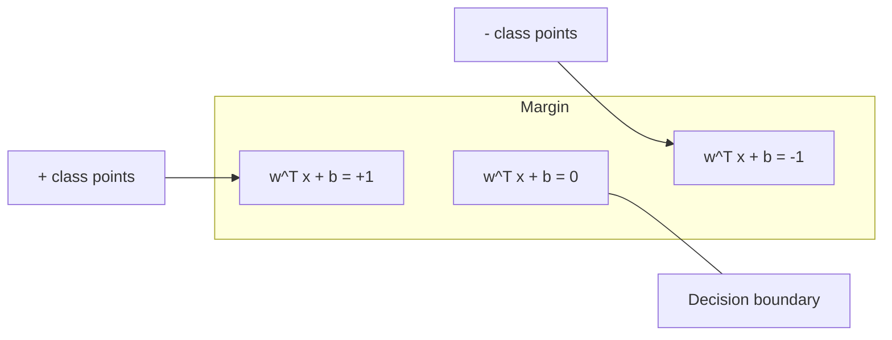
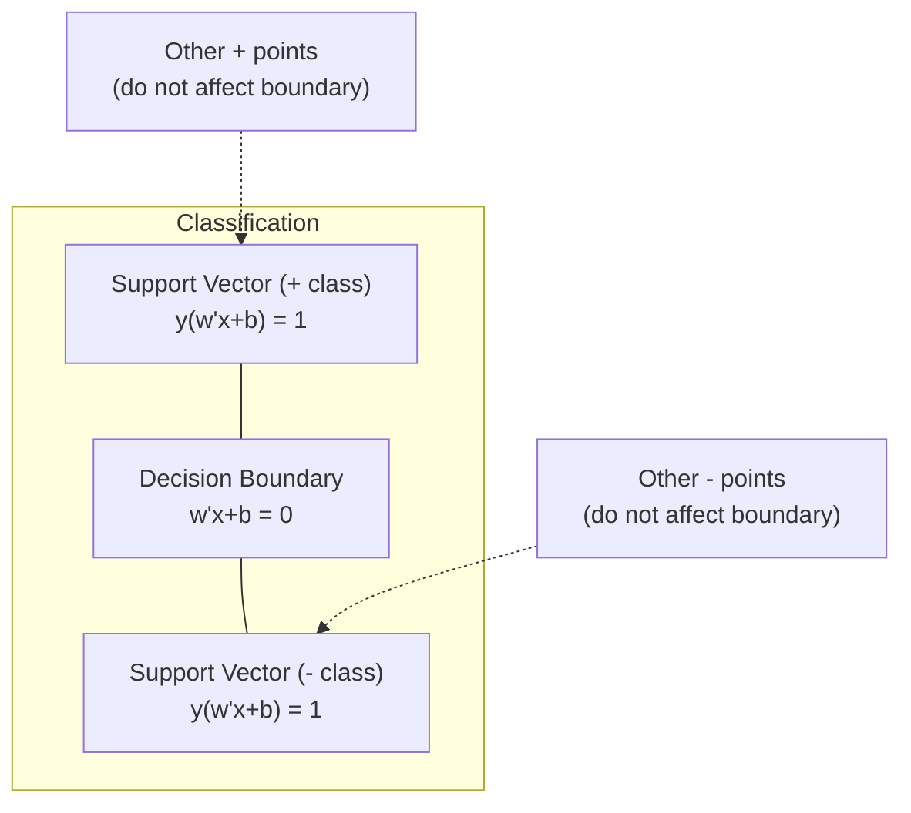
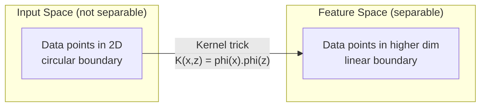

# Máy hỗ trợ vector

> Tìm đường rộng nhất giữa hai lớp.

**Type:** Build
**Language:**Python
**Prerequisites:** Phase 1 (Lessons 08 Optimization, 14 Norms and Distances, 18 Convex Optimization)
**Time:** ~90 minutes

## Mục tiêu học tập

- Thực hiện SVM tuyến tính từ đầu bằng cách sử dụng mất sợi và giảm gradient trên công thức ban đầu
- Giải thích nguyên tắc biên giới tối đa và xác định các vector hỗ trợ từ mô hình được đào tạo
- So sánh các hạt nhân tuyến tính, đa nôn và RBF và giải thích cách trò lừa hạt nhân tránh được bản đồ chiều cao rõ ràng
- Đánh giá sự cân bằng được kiểm soát bởi tham số C giữa chiều rộng biên và lỗi phân loại

## Vấn đề

Bạn có hai lớp điểm dữ liệu và cần vẽ một đường (hoặc siêu phẳng) tách chúng ra. vô số đường có thể hoạt động. Bạn nên chọn một trong những đường nào?

Một biên độ rộng hơn có nghĩa là phân loại viên tự tin hơn và tổng hợp tốt hơn dữ liệu chưa thấy.

Sự trực giác này dẫn đến Máy hỗ trợ vector, một trong những thuật toán tinh tế nhất về toán học trong ML. SVM là phương pháp phân loại thống trị trước khi học sâu và vẫn là lựa chọn tốt nhất cho các tập dữ liệu nhỏ, dữ liệu chiều cao và các vấn đề khi bạn cần một mô hình có nguyên tắc, hiểu rõ với các đảm bảo lý thuyết.

SVM kết nối trực tiếp với giai đoạn 1: tối ưu hóa là ngọc (Lớp 18), biên được đo bằng các chuẩn (Lớp 14), và thủ thuật hạt nhân khai thác các sản phẩm chấm để xử lý ranh giới không tuyến tính mà không bao giờ tính toán trong không gian chiều cao.

## Khái niệm

### Các loại phân loại biên giới tối đa

Với dữ liệu có thể tách ra tuyến tính với các nhãn y_i trong {-1, +1} và các vector tính năng x_i, chúng ta muốn một siêu phẳng w^T x + b = 0 tách các lớp.

Khoảng cách từ một điểm x_i đến siêu phẳng là:

```
distance = |w^T x_i + b| / ||w||
```

Đối với một điểm được phân loại đúng cách: y_i * (w^T x_i + b) > 0. Hạn hạch là gấp đôi khoảng cách từ siêu phẳng đến điểm gần nhất ở cả hai bên.



Vấn đề tối ưu hóa:

```
maximize    2 / ||w||     (the margin width)
subject to  y_i * (w^T x_i + b) >= 1  for all i
```

Tương đương (giảm thiểu các hoạt động của bạn là dễ dàng hơn để tối ưu hóa):

```
minimize    (1/2) ||w||^2
subject to  y_i * (w^T x_i + b) >= 1  for all i
```

Đây là một chương trình hình vuông. Nó có một giải pháp toàn cầu độc đáo. Các điểm dữ liệu nằm chính xác trên ranh giới biên giới (nơi y_i * (w^T x_i + b) = 1) là các vector hỗ trợ. Chúng là các điểm duy nhất xác định ranh giới quyết định. Di chuyển hoặc loại bỏ bất kỳ điểm không hỗ trợ vector nào, và ranh giới không thay đổi.

### Các vector hỗ trợ: số ít quan trọng



Hầu hết các điểm đào tạo không liên quan. Chỉ có các vector hỗ trợ quan trọng. Đây là lý do tại sao SVM có hiệu quả trong bộ nhớ trong thời gian dự đoán: bạn chỉ cần lưu trữ các vector hỗ trợ, không phải toàn bộ bộ bộ đào tạo.

Số lượng các vector hỗ trợ cũng đưa ra một giới hạn về lỗi tổng hợp.

### Lề mềm: xử lý tiếng ồn với tham số C

Dữ liệu thực hiếm khi có thể tách ra hoàn toàn. Một số điểm có thể nằm ở bên sai của ranh giới, hoặc bên trong biên giới.

```
minimize    (1/2) ||w||^2 + C * sum(xi_i)
subject to  y_i * (w^T x_i + b) >= 1 - xi_i
            xi_i >= 0  for all i
```

Các biến xi_i của sự lỏng lẻo đo lường mức độ điểm i vi phạm biên. C kiểm soát sự thỏa hiệp:

| C value | Behavior |
|---------|----------|
| Large C | Penalizes violations heavily. Narrow margin, fewer misclassifications. Overfits |
| Small C | Allows more violations. Wide margin, more misclassifications. Underfits |

C là cường độ điều chỉnh, ngược lại. C lớn = ít điều chỉnh. C nhỏ = nhiều điều chỉnh hơn.

### Thiệt hại hinge: chức năng mất SVM

SVM margin mềm có thể được viết lại như một tối ưu hóa không bị hạn chế:

```
minimize    (1/2) ||w||^2 + C * sum(max(0, 1 - y_i * (w^T x_i + b)))
```

Thuật ngữ max(0, 1 - y_i * f(x_i)) là lỗ đinh. Nó là không khi điểm được phân loại đúng và vượt ra khỏi biên. Nó là tuyến tính khi điểm nằm bên trong biên hoặc được phân loại sai.

```
Hinge loss for a single point:

loss
  |
  | \
  |  \
  |   \
  |    \
  |     \_______________
  |
  +-----|-----|-------->  y * f(x)
       0     1

Zero loss when y*f(x) >= 1 (correctly classified, outside margin).
Linear penalty when y*f(x) < 1.
```

So sánh với tổn thất hậu cần (khuyết phục hậu cần):

```
Hinge:     max(0, 1 - y*f(x))          Hard cutoff at margin
Logistic:  log(1 + exp(-y*f(x)))        Smooth, never exactly zero
```

Thiếu háng tạo ra các giải pháp hiếm (chỉ các vector hỗ trợ có đóng góp không bằng 0.). Thiếu háng hậu sử dụng tất cả các điểm dữ liệu. Điều này làm cho SVM hiệu quả hơn trong bộ nhớ tại thời gian dự đoán.

### Trình huấn luyện một SVM tuyến tính với độ giảm gradient

Bạn có thể đào tạo SVM tuyến tính bằng cách sử dụng giảm gradient trên lỗ đệm cộng với L2 thường xuyên hóa, mà không giải quyết QP bị hạn chế:

```
L(w, b) = (lambda/2) * ||w||^2 + (1/n) * sum(max(0, 1 - y_i * (w^T x_i + b)))

Gradient with respect to w:
  If y_i * (w^T x_i + b) >= 1:  dL/dw = lambda * w
  If y_i * (w^T x_i + b) < 1:   dL/dw = lambda * w - y_i * x_i

Gradient with respect to b:
  If y_i * (w^T x_i + b) >= 1:  dL/db = 0
  If y_i * (w^T x_i + b) < 1:   dL/db = -y_i
```

Điều này được gọi là công thức nguyên thủy. Nó chạy trong O(n * d) mỗi thời đại, nơi n là số lượng mẫu và d là số lượng các tính năng. Đối với dữ liệu lớn, hiếm, chiều cao (thân loại văn bản), điều này là nhanh.

### Sự công bố kép và thủ thuật hạt nhân

Hình thức Lagrangian của vấn đề SVM (từ bài học giai đoạn 1 điều kiện KKT 18) là:

```
maximize    sum(alpha_i) - (1/2) * sum_ij(alpha_i * alpha_j * y_i * y_j * (x_i . x_j))
subject to  0 <= alpha_i <= C
            sum(alpha_i * y_i) = 0
```

Sự đôi chỉ liên quan đến các sản phẩm chấm x_i . x_j giữa các điểm dữ liệu. Đây là thông tin quan trọng. Thay thế mỗi sản phẩm chấm bằng hàm lõi K(x_i, x_j) và SVM có thể học ranh giới phi tuyến tính mà không bao giờ tính toán việc chuyển đổi một cách rõ ràng.

```
Linear kernel:      K(x, z) = x . z
Polynomial kernel:  K(x, z) = (x . z + c)^d
RBF (Gaussian):     K(x, z) = exp(-gamma * ||x - z||^2)
```

RBF hạt nhân bản đồ dữ liệu vào một không gian không giới hạn. Điểm gần trong không gian đầu vào có giá trị hạt nhân gần 1. Điểm xa nhau có giá trị hạt nhân gần 0. Nó có thể học bất kỳ ranh giới quyết định mượt mà nào.



Tránh hạt nhân tính toán sản phẩm chấm trong không gian chiều cao mà không bao giờ đi đến đó. Đối với hạt nhân đa nôn d ở chiều D, không gian tính năng rõ ràng có chiều O(D^d). Nhưng K(x, z) được tính toán trong thời gian O(D).

### SVM cho sự lùi (SVR)

Vêctor lùi hỗ trợ gắn một ống rộng epsilon xung quanh dữ liệu. các điểm bên trong ống có lỗ không. các điểm bên ngoài ống bị phạt theo đường thẳng.

```
minimize    (1/2) ||w||^2 + C * sum(xi_i + xi_i*)
subject to  y_i - (w^T x_i + b) <= epsilon + xi_i
            (w^T x_i + b) - y_i <= epsilon + xi_i*
            xi_i, xi_i* >= 0
```

Các tham số epsilon điều khiển chiều rộng ống. ống rộng hơn = ít các vector hỗ trợ = phù hợp hơn. ống hẹp hơn = nhiều vector hỗ trợ = phù hợp hơn.

### Tại sao SVM bị mất bởi Deep Learning (và khi nào họ vẫn thắng)

SVM thống trị ML từ cuối những năm 1990 đến đầu những năm 2010. Học tập sâu vượt qua chúng vì một số lý do:

| Factor | SVMs | Deep learning |
|--------|------|---------------|
| Feature engineering | Requires it | Learns features |
| Scalability | O(n^2) to O(n^3) for kernel | O(n) per epoch with SGD |
| Image/text/audio | Needs handcrafted features | Learns from raw data |
| Large datasets (>100k) | Slow | Scales well |
| GPU acceleration | Limited benefit | Massive speedup |

SVM vẫn thắng trong những tình huống này:
- Các bộ dữ liệu nhỏ (răm đến hàng ngàn mẫu)
- Dữ liệu hiếm có chiều cao (môn văn với tính năng TF-IDF)
- Khi bạn cần đảm bảo toán học (chỉ hạn biên)
- Khi thời gian đào tạo phải là tối thiểu (SVM tuyến tính rất nhanh)
- Định dạng phân loại nhị phân với cấu trúc biên độ rõ ràng
- Khám phá bất thường (SVM lớp một)

```figure
svm-margin
```

## Hãy xây dựng nó

### Bước 1: Giảm và nghiêng của nấm

- Đếm mất đệm cho một lô và độ nghiêng của nó.

```python
def hinge_loss(X, y, w, b):
    n = len(X)
    total_loss = 0.0
    for i in range(n):
        margin = y[i] * (dot(w, X[i]) + b)
        total_loss += max(0.0, 1.0 - margin)
    return total_loss / n
```

### Bước 2: SVM tuyến tính thông qua giảm gradient

Đào tạo bằng cách giảm thiểu tổn thất vòng tròn.

```python
class LinearSVM:
    def __init__(self, lr=0.001, lambda_param=0.01, n_epochs=1000):
        self.lr = lr
        self.lambda_param = lambda_param
        self.n_epochs = n_epochs
        self.w = None
        self.b = 0.0

    def fit(self, X, y):
        n_features = len(X[0])
        self.w = [0.0] * n_features
        self.b = 0.0

        for epoch in range(self.n_epochs):
            for i in range(len(X)):
                margin = y[i] * (dot(self.w, X[i]) + self.b)
                if margin >= 1:
                    self.w = [wj - self.lr * self.lambda_param * wj
                              for wj in self.w]
                else:
                    self.w = [wj - self.lr * (self.lambda_param * wj - y[i] * X[i][j])
                              for j, wj in enumerate(self.w)]
                    self.b -= self.lr * (-y[i])

    def predict(self, X):
        return [1 if dot(self.w, x) + self.b >= 0 else -1 for x in X]
```

### Bước 3: Các chức năng Kernel

Thực hiện các hạt nhân tuyến tính, đa nôn và RBF.

```python
def linear_kernel(x, z):
    return dot(x, z)

def polynomial_kernel(x, z, degree=3, c=1.0):
    return (dot(x, z) + c) ** degree

def rbf_kernel(x, z, gamma=0.5):
    diff = [xi - zi for xi, zi in zip(x, z)]
    return math.exp(-gamma * dot(diff, diff))
```

### Bước 4: Định dạng đường biên và vector hỗ trợ

Sau khi đào tạo, xác định các điểm là vector hỗ trợ và tính toán chiều rộng biên.

```python
def find_support_vectors(X, y, w, b, tol=1e-3):
    support_vectors = []
    for i in range(len(X)):
        margin = y[i] * (dot(w, X[i]) + b)
        if abs(margin - 1.0) < tol:
            support_vectors.append(i)
    return support_vectors
```

Nhìn xem`code/svm.py`cho việc thực hiện đầy đủ với tất cả các demo.

## Sử dụng nó

Với scikit-learn:

```python
from sklearn.svm import SVC, LinearSVC, SVR
from sklearn.preprocessing import StandardScaler
from sklearn.pipeline import Pipeline

clf = Pipeline([
    ("scaler", StandardScaler()),
    ("svm", SVC(kernel="rbf", C=1.0, gamma="scale")),
])
clf.fit(X_train, y_train)
print(f"Accuracy: {clf.score(X_test, y_test):.4f}")
print(f"Support vectors: {clf['svm'].n_support_}")
```

Quan trọng: luôn luôn mở rộng các tính năng của bạn trước khi đào tạo một SVM. SVM nhạy cảm với quy mô tính năng vì biên phụ thuộc vào các tính năng không mở rộng và làm biến dạng hình học.

Đối với các bộ dữ liệu lớn, sử dụng `LinearSVC`(pháp nguyên thủy, O(n) theo thời đại) thay vì `SVC`(pháp kép, O(n^2) đến O(n^3)):

```python
from sklearn.svm import LinearSVC

clf = Pipeline([
    ("scaler", StandardScaler()),
    ("svm", LinearSVC(C=1.0, max_iter=10000)),
])
```

## Các bài tập

1. Tạo một bộ dữ liệu phân tách theo chiều tuyến tính 2D. Đào tạo LinearSVM của bạn và xác định các vector hỗ trợ. Kiểm tra rằng các vector hỗ trợ là điểm gần nhất với ranh giới quyết định.

2. C thay đổi từ 0,001 đến 1000 trên một tập dữ liệu ồn ào. Bạch ranh giới quyết định cho mỗi giá trị C. Quan sát chuyển đổi từ biên rộng (không phù hợp) đến biên hẹp (sự phù hợp quá mức).

3. Tạo một tập dữ liệu mà ranh giới lớp là tròn (không tuyến tính). Chứng minh rằng một SVM tuyến tính thất bại. Xét toán các khối lượng lõi RBF và cho thấy các lớp trở nên tách rời trong không gian tính năng do hạt nhân tạo ra.

4. So sánh mất sợi vỏ vs mất hậu cần trên cùng một tập dữ liệu. Tập một SVM tuyến tính và hồi quy hậu cần. Đếm bao nhiêu điểm đào tạo đóng góp vào ranh giới quyết định của mỗi mô hình (vêctơ hỗ trợ vs tất cả các điểm).

5. Thực hiện SVR (sự mất mát không nhạy cảm với epsilon). Đưa nó đến y = sin(x) + tiếng ồn. Châm trạm ống epsilon xung quanh các dự đoán và làm nổi bật các vector hỗ trợ (điểm bên ngoài ống).

## Các điều khoản chính

| Term | What it actually means |
|------|----------------------|
| Support vectors | The training points closest to the decision boundary. The only points that determine the hyperplane |
| Margin | The distance between the decision boundary and the nearest support vectors. SVMs maximize this |
| Hinge loss | max(0, 1 - y*f(x)). Zero when correctly classified and outside the margin. Linear penalty otherwise |
| C parameter | Trade-off between margin width and classification errors. Large C = narrow margin, small C = wide margin |
| Soft margin | SVM formulation that allows margin violations via slack variables. Handles non-separable data |
| Kernel trick | Computing dot products in a high-dimensional feature space without explicitly mapping to that space |
| Linear kernel | K(x, z) = x . z. Equivalent to standard dot product. For linearly separable data |
| RBF kernel | K(x, z) = exp(-gamma * \|\|x-z\|\|^2). Maps to infinite dimensions. Learns any smooth boundary |
| Polynomial kernel | K(x, z) = (x . z + c)^d. Maps to a feature space of polynomial combinations |
| Dual formulation | Reformulation of the SVM problem that depends only on dot products between data points. Enables kernels |
| SVR | Support Vector Regression. Fits an epsilon-tube around the data. Points inside the tube have zero loss |
| Slack variables | xi_i: measures how much a point violates the margin. Zero for correctly classified points outside margin |
| Maximum margin | The principle of choosing the hyperplane that maximizes the distance to the nearest points of each class |

## Đọc thêm

- [Vapnik: The Nature of Statistical Learning Theory (1995)](https://link.springer.com/book/10.1007/978-1-4757-3264-1)- văn bản cơ bản về SVM và học tập thống kê
- [Cortes & Vapnik: Support-vector networks (1995)](https://link.springer.com/article/10.1007/BF00994018)- giấy SVM gốc
- [Platt: Sequential Minimal Optimization (1998)](https://www.microsoft.com/en-us/research/publication/sequential-minimal-optimization-a-fast-algorithm-for-training-support-vector-machines/)- thuật toán SMO làm cho việc đào tạo SVM thực tế
- [scikit-learn SVM documentation](https://scikit-learn.org/stable/modules/svm.html)- hướng dẫn thực tế với chi tiết về việc thực hiện
- [LIBSVM: A Library for Support Vector Machines](https://www.csie.ntu.edu.tw/~cjlin/libsvm/)- thư viện C ++ đằng sau hầu hết các triển khai SVM
