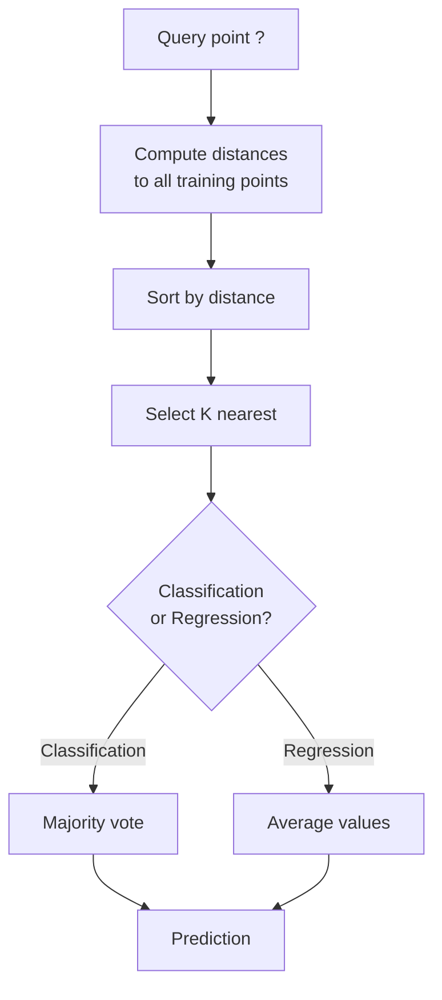
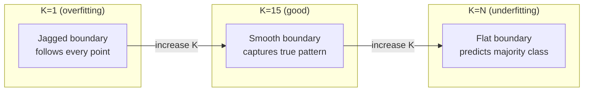
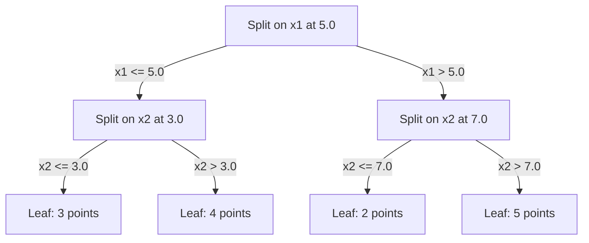

# K-Gần hàng xóm và xa cách nhất

> Hãy lưu trữ mọi thứ, dự đoán bằng cách nhìn vào hàng xóm, thuật toán đơn giản nhất mà thực sự hoạt động.

**Type:** Build
**Language:**Python
**Prerequisites:** Phase 1 (Lesson 14 Norms and Distances)
**Time:** ~90 minutes

## Mục tiêu học tập

- Thực hiện phân loại KNN và lùi lại từ đầu với K có thể cấu hình và bỏ phiếu cân bằng khoảng cách
- So sánh L1, L2, cosine và Minkowski đường đo và chọn một phù hợp cho một loại dữ liệu nhất định
- Giải thích lời nguyền của chiều và chứng minh tại sao KNN suy giảm trong không gian chiều cao
- Xây dựng cây KD để tìm kiếm hiệu quả hàng xóm gần nhất và phân tích khi nó vượt qua lực lượng thô

## Vấn đề

Bạn có một tập dữ liệu. Một điểm dữ liệu mới đến. Bạn cần phân loại nó hoặc dự đoán giá trị của nó. Thay vì học các tham số từ dữ liệu (như hồi quy tuyến tính hoặc SVM), bạn chỉ cần tìm các điểm đào tạo K gần nhất với điểm mới và để họ bỏ phiếu.

Đây là các hàng xóm gần nhất K. Không có giai đoạn đào tạo, không có các tham số để học, không có hàm mất mát để giảm thiểu. Bạn lưu trữ toàn bộ bộ bộ tập huấn và tính khoảng cách tại thời gian dự đoán.

Nó nghe có vẻ quá đơn giản để làm việc. Nhưng KNN là đáng ngạc nhiên cạnh tranh đối với nhiều vấn đề, đặc biệt là với tập dữ liệu nhỏ đến trung bình, và hiểu nó sâu sắc tiết lộ các khái niệm cơ bản: sự lựa chọn của métric khoảng cách (sự kết nối với Bước 1 Bài học 14), lời nguyền của chiều kích, và sự khác biệt giữa việc học lười biếng và thâm mê.

KNN cũng xuất hiện ở mọi nơi trong AI hiện đại, chỉ dưới tên khác nhau. Các cơ sở dữ liệu vector tìm kiếm KNN trên nhúng. Triết xuất tăng cường truy xuất (RAG) tìm thấy các khối tài liệu gần nhất K. Hệ thống khuyến nghị tìm thấy người dùng hoặc các mục tương tự. thuật toán giống nhau. Skala và cấu trúc dữ liệu khác nhau.

## Khái niệm

### Làm thế nào KNN hoạt động

Với một tập dữ liệu của các điểm được dán nhãn và một điểm truy vấn mới:

1. Xét khoảng cách từ truy vấn đến mọi điểm trong bộ dữ liệu
2. Định dạng theo khoảng cách
3. Hãy lấy các điểm gần nhất với K
4. Đối với phân loại: số phiếu đa số trong các nước láng giềng K
5. Đối với sự lùi lại: trung bình (hoặc trung bình trọng lượng) của các giá trị của các hàng xóm K



Đó là toàn bộ thuật toán, không có phù hợp, không có sự giảm gradient, không có thời đại.

### Chọn K

K là một siêu tham số đơn. Nó kiểm soát sự đổi giá sự thiên vị-hình lệch:

| K | Behavior |
|---|----------|
| K = 1 | Decision boundary follows every point. Zero training error. High variance. Overfits |
| Small K (3-5) | Sensitive to local structure. Can capture complex boundaries |
| Large K | Smoother boundaries. More robust to noise. May underfit |
| K = N | Predicts the majority class for every point. Maximum bias |

Một điểm khởi đầu phổ biến là K = sqrt(N) cho một tập dữ liệu của các điểm N. Sử dụng K lẻ cho phân loại nhị phân để tránh liên kết.



### Điểm số khoảng cách

Chức năng khoảng cách xác định "gần" nghĩa là gì.

**L2 (Euclidean)**là mặc định.

```
d(a, b) = sqrt(sum((a_i - b_i)^2))
```

Nhẫn đến quy mô tính năng. Luôn chuẩn hóa tính năng trước khi sử dụng L2 với KNN.

**L1 (Manhattan)**L2 mạnh hơn so với L2 vì nó không bình phương các khác biệt.

```
d(a, b) = sum(|a_i - b_i|)
```

**Cosine distance**đo góc giữa các vector, bỏ qua độ lớn.

```
d(a, b) = 1 - (a . b) / (||a|| * ||b||)
```

**Minkowski**tổng hợp L1 và L2 với tham số p.

```
d(a, b) = (sum(|a_i - b_i|^p))^(1/p)

p=1: Manhattan
p=2: Euclidean
p->inf: Chebyshev (max absolute difference)
```

Métric nào để sử dụng phụ thuộc vào dữ liệu:

| Data type | Best metric | Why |
|-----------|------------|-----|
| Numeric features, similar scale | L2 (Euclidean) | Default, works for spatial data |
| Numeric features, outliers | L1 (Manhattan) | Robust, does not amplify large differences |
| Text embeddings | Cosine | Magnitude is noise, direction is meaning |
| High-dimensional sparse | Cosine or L1 | L2 suffers from curse of dimensionality |
| Mixed types | Custom distance | Combine metrics per feature type |

### KNN trọng lượng

KNN tiêu chuẩn cho trọng lượng bằng cho tất cả các hàng xóm K. Nhưng một hàng xóm ở khoảng cách 0.1 nên quan trọng hơn một ở khoảng cách 5.0.

**Distance-weighted KNN**trọng lượng mỗi hàng xóm ngược theo khoảng cách:

```
weight_i = 1 / (distance_i + epsilon)

For classification: weighted vote
For regression:     weighted average = sum(w_i * y_i) / sum(w_i)
```

Epsilon ngăn chặn chia bằng không khi một điểm truy vấn phù hợp chính xác với một điểm đào tạo.

KNN cân nặng ít nhạy cảm hơn với sự lựa chọn của K vì những người hàng xóm xa đóng góp rất ít bất kể.

### Lời nguyền của chiều kích

Hiệu suất KNN giảm ở các chiều cao.

**Problem 1: distances converge.**Khi chiều kích tăng lên, tỷ lệ khoảng cách tối đa với khoảng cách tối thiểu gần 1. Tất cả các điểm trở nên "sự xa" với truy vấn.

```
In d dimensions, for random uniform points:

d=2:    max_dist / min_dist = varies widely
d=100:  max_dist / min_dist ~ 1.01
d=1000: max_dist / min_dist ~ 1.001

When all distances are nearly equal, "nearest" is meaningless.
```

**Problem 2: volume explodes.**Để chụp các khu phố K trong một phần nhỏ cố định của dữ liệu, bạn cần mở rộng bán kính tìm kiếm của bạn để bao phủ một phần lớn hơn nhiều của không gian tính năng. "Đường phố" ở kích thước cao bao gồm phần lớn không gian.

**Problem 3: corners dominate.**Trong một đơn vị siêu khối ở kích thước d, phần lớn khối lượng được tập trung gần các góc, chứ không phải trung tâm.

Kết quả thực tế: KNN hoạt động tốt cho đến khoảng 20-50 tính năng. Ngoài ra, bạn cần giảm chiều kích (PCA, UMAP, t-SNE) trước khi áp dụng KNN, hoặc bạn cần sử dụng cấu trúc tìm kiếm dựa trên cây khai thác chiều kích thấp hơn nội tại của dữ liệu.

### KD-trái: nhanh chóng tìm kiếm hàng xóm gần nhất

KNN lực thô tính khoảng cách từ truy vấn đến mỗi điểm đào tạo. đó là O(n * d) cho mỗi truy vấn. Đối với tập dữ liệu lớn, điều này quá chậm.

Một cây KD tái tạo chia không gian dọc theo trục tính năng.



Để tìm người hàng xóm gần nhất, đi qua cây đến lá chứa câu hỏi, sau đó theo dõi lại và kiểm tra các phân vùng hàng xóm chỉ nếu chúng có thể chứa các điểm gần hơn.

Thời gian truy vấn trung bình: O(log n) cho các chiều kích thấp. Nhưng cây KD giảm xuống O(n) trong các chiều kích cao (d > 20) vì việc theo dõi lại loại bỏ ngày càng ít chi nhánh.

### Cây bóng: tốt hơn cho kích thước vừa phải

Các cây bóng phân chia dữ liệu thành siêu cầu tổ hợp thay vì các hộp liên kết với trục. Mỗi nút xác định một quả bóng (trung tâm + bán kính) chứa tất cả các điểm trong cây phụ đó.

Lợi ích so với cây KD:
- Làm việc tốt hơn trong kích thước vừa phải (tối đa ~50)
- Thiết kế không liên kết với trục
- Số lượng ranh giới chặt chẽ hơn có nghĩa là nhiều nhánh được cắt trong quá trình tìm kiếm

Cả cây KD và cây bóng đều là thuật toán chính xác. Đối với tìm kiếm quy mô thực sự lớn (người triệu điểm, hàng trăm chiều), phương pháp hàng xóm gần nhất (HNSW, IVF, định lượng sản phẩm) được sử dụng thay vào đó.

### Học lười biếng vs học đam mê

KNN là một học viên lười biếng: nó không làm việc trong thời gian đào tạo và tất cả làm việc trong thời gian dự đoán. Hầu hết các thuật toán khác (sự lùi tuyến tính, SVM, mạng thần kinh) là những người học đam mê: họ thực hiện tính toán nặng trong thời gian đào tạo để xây dựng một mô hình nhỏ gọn, sau đó dự đoán là nhanh chóng.

| Aspect | Lazy (KNN) | Eager (SVM, neural net) |
|--------|------------|------------------------|
| Training time | O(1) just store data | O(n * epochs) |
| Prediction time | O(n * d) per query | O(d) or O(parameters) |
| Memory at prediction | Store entire training set | Store model parameters only |
| Adapts to new data | Add points instantly | Retrain the model |
| Decision boundary | Implicit, computed on the fly | Explicit, fixed after training |

Học lười biếng là lý tưởng khi:
- Bộ dữ liệu thay đổi thường xuyên (làm thêm/từ các điểm mà không cần đào tạo lại)
- Bạn cần dự đoán cho rất ít câu hỏi
- Anh muốn không có thời gian tập luyện
- Bộ dữ liệu đủ nhỏ để tìm kiếm bằng lực lượng tàn bạo nhanh

### KNN cho sự lùi

Thay vì bỏ phiếu đa số, KNN cho sự lùi lại trung bình các giá trị mục tiêu của các nước láng giềng K.

```
prediction = (1/K) * sum(y_i for i in K nearest neighbors)

Or with distance weighting:
prediction = sum(w_i * y_i) / sum(w_i)
where w_i = 1 / distance_i
```

KTN regression tạo ra dự đoán liên tục theo từng mảnh (hoặc mềm mại theo từng mảnh với trọng lượng). Nó không thể chi tiết vượt ra ngoài phạm vi dữ liệu đào tạo. Nếu các mục tiêu đào tạo đều nằm giữa 0 và 100, KNN sẽ không bao giờ dự đoán 200.

```figure
knn-smoothness
```

## Hãy xây dựng nó

### Bước 1: Các chức năng khoảng cách

Thực hiện khoảng cách L1, L2, cosine và Minkowski.

```python
import math

def l2_distance(a, b):
    return math.sqrt(sum((ai - bi) ** 2 for ai, bi in zip(a, b)))

def l1_distance(a, b):
    return sum(abs(ai - bi) for ai, bi in zip(a, b))

def cosine_distance(a, b):
    dot_val = sum(ai * bi for ai, bi in zip(a, b))
    norm_a = math.sqrt(sum(ai ** 2 for ai in a))
    norm_b = math.sqrt(sum(bi ** 2 for bi in b))
    if norm_a == 0 or norm_b == 0:
        return 1.0
    return 1.0 - dot_val / (norm_a * norm_b)

def minkowski_distance(a, b, p=2):
    if p == float('inf'):
        return max(abs(ai - bi) for ai, bi in zip(a, b))
    return sum(abs(ai - bi) ** p for ai, bi in zip(a, b)) ** (1 / p)
```

### Bước 2: Bộ phân loại KNN và bộ trục trệ

Xây dựng KNN đầy đủ với cấu hình K, đo khoảng cách và trọng lượng khoảng cách tùy chọn.

```python
class KNN:
    def __init__(self, k=5, distance_fn=l2_distance, weighted=False,
                 task="classification"):
        self.k = k
        self.distance_fn = distance_fn
        self.weighted = weighted
        self.task = task
        self.X_train = None
        self.y_train = None

    def fit(self, X, y):
        self.X_train = X
        self.y_train = y

    def predict(self, X):
        return [self._predict_one(x) for x in X]
```

### Bước 3: KD-tree cho tìm kiếm hiệu quả

Xây dựng một cây KD từ đầu mà tái tạo chia trên trung bình của mỗi chiều.

```python
class KDTree:
    def __init__(self, X, indices=None, depth=0):
        # Recursively partition the data
        self.axis = depth % len(X[0])
        # Split on median of the current axis
        ...

    def query(self, point, k=1):
        # Traverse to leaf, then backtrack
        ...
```

Nhìn xem`code/knn.py`cho việc thực hiện đầy đủ với tất cả các phương pháp hỗ trợ và demo.

### Bước 4: Tích thước tính năng

KNN đòi hỏi tính năng quy mô bởi vì khoảng cách nhạy cảm với độ lớn tính năng.

```python
def standardize(X):
    n = len(X)
    d = len(X[0])
    means = [sum(X[i][j] for i in range(n)) / n for j in range(d)]
    stds = [
        max(1e-10, (sum((X[i][j] - means[j]) ** 2 for i in range(n)) / n) ** 0.5)
        for j in range(d)
    ]
    return [[((X[i][j] - means[j]) / stds[j]) for j in range(d)] for i in range(n)], means, stds
```

## Sử dụng nó

Với scikit-learn:

```python
from sklearn.neighbors import KNeighborsClassifier
from sklearn.preprocessing import StandardScaler
from sklearn.pipeline import Pipeline

clf = Pipeline([
    ("scaler", StandardScaler()),
    ("knn", KNeighborsClassifier(n_neighbors=5, metric="euclidean")),
])
clf.fit(X_train, y_train)
print(f"Accuracy: {clf.score(X_test, y_test):.4f}")
```

Scikit-learn tự động sử dụng cây KD hoặc cây bóng khi bộ dữ liệu đủ lớn và kích thước đủ thấp. Đối với dữ liệu có chiều cao, nó rơi lại lực thô. Bạn có thể kiểm soát điều này bằng cách sử dụng `algorithm`tham số.

Đối với việc tìm kiếm hàng xóm gần nhất (người hàng triệu vector), sử dụng FAISS, Annoy hoặc cơ sở dữ liệu vector:

```python
import faiss

index = faiss.IndexFlatL2(dimension)
index.add(embeddings)
distances, indices = index.search(query_vectors, k=5)
```

## Các bài tập

1. Thực hiện phân loại KNN trên một tập dữ liệu 2D với 3 lớp. Chụp ranh giới quyết định cho K=1, K=5, K=15, và K=N. Quan sát quá trình chuyển đổi từ quá phù hợp sang thiếu phù hợp.

2. Tạo 1000 điểm ngẫu nhiên trong 2, 5, 10, 50, 100, và 500 chiều. Đối với mỗi chiều kích, tính toán tỷ lệ của khoảng cách đôi tối đa đến khoảng cách đôi tối thiểu.

3. So sánh khoảng cách L1, L2 và cosine cho KNN trên một vấn đề phân loại văn bản ( Sử dụng các vector TF-IDF).

4. Thực hiện một cây KD và đo thời gian truy vấn so với lực thô cho tập dữ liệu 1k, 10k, và 100k điểm trong 2D, 10D, và 50D. Ở chiều kích nào cây KD ngừng nhanh hơn lực thô?

5. Xây dựng một máy quay lại KNN trọng lượng cho y = sin(x) + tiếng ồn. So sánh nó với KNN không trọng lượng cho K = 3, 10, 30.

## Các điều khoản chính

| Term | What it actually means |
|------|----------------------|
| K-nearest neighbors | Non-parametric algorithm that predicts by finding the K closest training points to a query |
| Lazy learning | No computation at training time. All work happens at prediction time. KNN is the canonical example |
| Eager learning | Heavy computation at training time to build a compact model. Most ML algorithms are eager |
| Curse of dimensionality | In high dimensions, distances converge and neighborhoods expand to cover most of the space, making KNN ineffective |
| KD-tree | Binary tree that recursively partitions space along feature axes. O(log n) queries in low dimensions |
| Ball tree | Tree of nested hyperspheres. Works better than KD-trees in moderate dimensions (up to ~50) |
| Weighted KNN | Neighbors weighted inversely by distance. Closer neighbors have more influence on the prediction |
| Feature scaling | Normalizing features to comparable ranges. Required for distance-based methods like KNN |
| Majority vote | Classification by counting which class is most common among K neighbors |
| Brute force search | Computing distance to every training point. O(n*d) per query. Exact but slow for large n |
| Approximate nearest neighbor | Algorithms (HNSW, LSH, IVF) that find approximately nearest points much faster than exact search |
| Voronoi diagram | The partition of space where each region contains all points closer to one training point than any other. K=1 KNN produces Voronoi boundaries |

## Đọc thêm

- [Cover & Hart: Nearest Neighbor Pattern Classification (1967)](https://ieeexplore.ieee.org/document/1053964)- giấy KNN cơ bản chứng minh nó có tỷ lệ lỗi tối đa gấp đôi Bayes tối ưu
- [Friedman, Bentley, Finkel: An Algorithm for Finding Best Matches in Logarithmic Expected Time (1977)](https://dl.acm.org/doi/10.1145/355744.355745)- giấy cây KD gốc
- [Beyer et al.: When Is "Nearest Neighbor" Meaningful? (1999)](https://link.springer.com/chapter/10.1007/3-540-49257-7_15)- phân tích chính thức về lời nguyền của chiều kích đối với hàng xóm gần nhất
- [scikit-learn Nearest Neighbors documentation](https://scikit-learn.org/stable/modules/neighbors.html)- hướng dẫn thực tế với việc lựa chọn thuật toán
- [FAISS: A Library for Efficient Similarity Search](https://github.com/facebookresearch/faiss)- Thư viện Meta cho tỉ tỉ số tìm kiếm gần nhất hàng xóm
