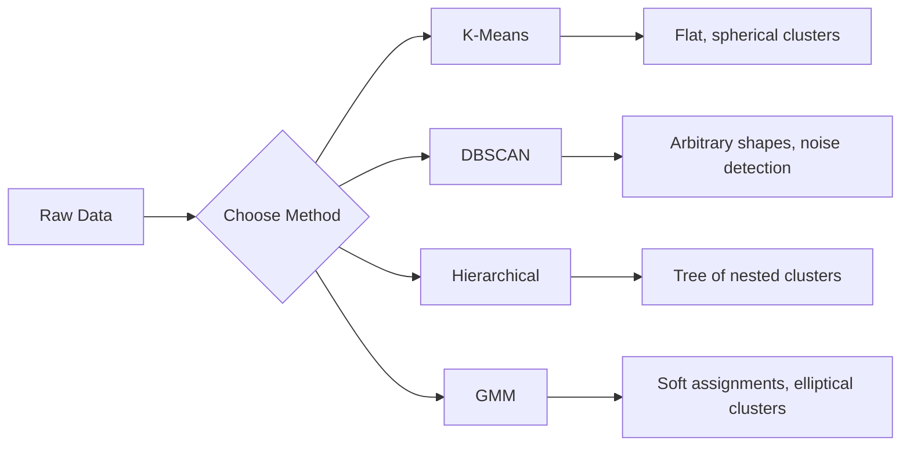

# Học hỏi không được giám sát

> Không có nhãn, không có giáo viên.

**Type:** Build
**Languages:** Python
**Prerequisites:** Phase 1 (Norms & Distances, Probability & Distributions), Phase 2 Lessons 1-6
**Time:** ~90 minutes

## Mục tiêu học tập

- Thực hiện K-Means, DBSCAN và Gaussian Mix Models từ đầu và so sánh hành vi cluster của chúng
- Đánh giá chất lượng cluster bằng cách sử dụng điểm bóng và phương pháp khuỷu tay để chọn K tối ưu
- Giải thích khi nào DBSCAN vượt qua K-Means và xác định thuật toán nào xử lý các cụm không-thành tráng và các mức ngoại lệ
- Xây dựng một đường ống phát hiện bất thường bằng cách sử dụng phương pháp nhóm để đánh dấu các điểm lệch khỏi các mẫu bình thường

## Vấn đề

Mỗi bài học ML cho đến nay đã giả định dữ liệu có nhãn: "đây là một đầu vào, đây là đầu ra chính xác". Trong thế giới thực, nhãn là đắt tiền. Một bệnh viện có hàng triệu hồ sơ bệnh nhân nhưng không ai tự đánh dấu từng bệnh nhân bằng loại bệnh. Một trang web thương mại điện tử có hàng triệu phiên người dùng nhưng không ai có các phân khúc khách hàng được dán nhãn bằng tay. Một nhóm an ninh có nhật ký mạng nhưng không ai ghi dấu bất thường nào.

Học tập không giám sát tìm thấy các mẫu mà không được cho biết phải tìm gì. Nó tập hợp các điểm dữ liệu tương tự, phát hiện ra cấu trúc ẩn và làm nổi bật các bất thường. Nếu học tập được giám sát là học từ một cuốn sách giáo khoa với khóa trả lời, học tập không giám sát đang nhìn vào dữ liệu thô cho đến khi các mẫu tiết lộ chính mình.

Điều quan trọng: nếu không có nhãn, bạn không thể đo "trực sự" hoặc "sai". Bạn cần các công cụ khác nhau để đánh giá liệu cấu trúc mà thuật toán của bạn tìm thấy có ý nghĩa hay không.

## Khái niệm

### Nhóm: Nhóm các thứ tương tự

Cluster phân bổ từng điểm dữ liệu cho một nhóm (cluster) để các điểm trong cùng nhóm giống nhau hơn các điểm trong các nhóm khác.



### K-Means: Con ngựa lao động

K-Means phân chia dữ liệu thành cụm cụm chính xác K. Mỗi cụm có một trung tâm (trung trọng của nó), và mỗi điểm thuộc về trung tâm gần nhất.

Algoritm của Lloyd:

1. Chọn các điểm ngẫu nhiên K như là các trung tâm ban đầu
2. Đưa từng điểm dữ liệu đến trung tâm gần nhất
3. Tái tính mỗi trung tâm như trung bình của các điểm được gán
4. Lặp lại các bước 2-3 cho đến khi các nhiệm vụ ngừng thay đổi

Chức năng khách quan (inerti) đo khoảng cách tổng cộng vuông từ mỗi điểm đến trung tâm được chỉ định của nó. K-Means giảm thiểu điều này, nhưng chỉ tìm thấy một mức tối thiểu địa phương.

### Chọn K

Hai phương pháp tiêu chuẩn:

**Elbow method:**Động K-Mức cho K = 1, 2, 3, ..., n. Trầm trễ tương đối với K. Tìm kiếm "cái tay" nơi việc thêm nhiều cụm dừng lại giảm trễ đáng kể.

**Silhouette score:**Đối với mỗi điểm, đo mức độ tương tự của nó với cụm riêng (a) so với cụm khác gần nhất (b). Tỷ lệ hình ảnh là (b - a) / max(a, b), dao động từ -1 (thống cụm sai) đến +1 (thống cụm tốt).

### DBSCAN: Nhóm dựa trên mật độ

K-Means giả định các cụm là hình cầu và yêu cầu bạn chọn K trước. DBSCAN không đưa ra bất kỳ giả định nào.

Hai tham số:
- **eps**: bán kính của một khu phố
- **min_samples**: số điểm tối thiểu cần thiết để tạo ra một khu vực dày đặc

Ba loại điểm:
- **Core point**: có ít nhất các điểm mẫu trong khoảng cách eps
- **Border point**: trong eps của một điểm cốt lõi nhưng không phải chính nó là một điểm cốt lõi
- **Noise point**: không có lõi hay biên giới.

DBSCAN kết nối các điểm cốt lõi nằm trong eps của nhau vào cùng một cụm. Các điểm biên giới tham gia vào cụm của một điểm cốt lõi gần đó.

Nguyên nhân: tìm thấy các cụm bất kỳ hình dạng nào, tự động xác định số lượng cụm, xác định các điểm khác biệt.

### Nhóm xếp hạng

Xây dựng một cây (dendrogram) của các cụm tổ.

Tóm lại (từ dưới lên):
1. Bắt đầu với mỗi điểm như một cụm riêng của nó
2. Thêm hai nhóm gần nhất
3. Lặp lại cho đến khi chỉ còn một cluster
4. Cắt dendrogram ở mức mong muốn để có được các cụm K

"Tương gần" giữa các cụm có thể được đo bằng cách:
- **Single linkage**: khoảng cách tối thiểu giữa hai điểm trong hai cluster
- **Complete linkage**: khoảng cách tối đa giữa hai điểm
- **Average linkage**: khoảng cách trung bình giữa tất cả các cặp
- **Ward's method**: sự sáp nhập gây ra sự gia tăng nhỏ nhất trong tổng sự khác biệt trong cluster

### Mô hình hỗn hợp Gaussian (GMM)

K-Means cho các bài tập khó khăn: mỗi điểm thuộc về chính xác một cluster. GMM cho các bài tập mềm: mỗi điểm có khả năng thuộc về mỗi cluster.

GMM giả định dữ liệu được tạo ra từ một hỗn hợp phân bố K Gaussian, mỗi phân bố có trung bình và tính biến khác nhau của riêng mình.

- **E-step**: tính toán xác suất rằng mỗi điểm thuộc về mỗi Gaussian
- **M-step**: cập nhật trung bình, tính biến và trọng lượng trộn của mỗi Gaussian để tối đa hóa khả năng của dữ liệu

GMM có thể mô hình các cụm hình hình elip (không chỉ hình cầu như K-Means) và tự nhiên xử lý các cụm chồng chéo.

### Khi nào sử dụng

| Method | Best for | Avoid when |
|--------|----------|------------|
| K-Means | Large datasets, spherical clusters, known K | Irregular shapes, outliers present |
| DBSCAN | Unknown K, arbitrary shapes, outlier detection | Varying densities, very high dimensions |
| Hierarchical | Small datasets, need dendrogram, unknown K | Large datasets (O(n^2) memory) |
| GMM | Overlapping clusters, soft assignments needed | Very large datasets, too many dimensions |

### Khám phá bất thường bằng cách tập hợp

Các nhóm tự nhiên hỗ trợ phát hiện bất thường:
- **K-Means**: các điểm xa từ bất kỳ trung tâm nào là bất thường
- **DBSCAN**: các điểm tiếng ồn là bất thường theo định nghĩa
- **GMM**: các điểm có khả năng thấp dưới tất cả các Gaussans là bất thường

```figure
kmeans-step
```

## Hãy xây dựng nó

### Bước 1: K-Công nghĩa từ đầu

```python
import math
import random


def euclidean_distance(a, b):
    return math.sqrt(sum((ai - bi) ** 2 for ai, bi in zip(a, b)))


def kmeans(data, k, max_iterations=100, seed=42):
    random.seed(seed)
    n_features = len(data[0])

    centroids = random.sample(data, k)

    for iteration in range(max_iterations):
        clusters = [[] for _ in range(k)]
        assignments = []

        for point in data:
            distances = [euclidean_distance(point, c) for c in centroids]
            nearest = distances.index(min(distances))
            clusters[nearest].append(point)
            assignments.append(nearest)

        new_centroids = []
        for cluster in clusters:
            if len(cluster) == 0:
                new_centroids.append(random.choice(data))
                continue
            centroid = [
                sum(point[j] for point in cluster) / len(cluster)
                for j in range(n_features)
            ]
            new_centroids.append(centroid)

        if all(
            euclidean_distance(old, new) < 1e-6
            for old, new in zip(centroids, new_centroids)
        ):
            print(f"  Converged at iteration {iteration + 1}")
            break

        centroids = new_centroids

    return assignments, centroids
```

### Bước 2: Phương pháp cằm và điểm bóng

```python
def compute_inertia(data, assignments, centroids):
    total = 0.0
    for point, cluster_id in zip(data, assignments):
        total += euclidean_distance(point, centroids[cluster_id]) ** 2
    return total


def silhouette_score(data, assignments):
    n = len(data)
    if n < 2:
        return 0.0

    clusters = {}
    for i, c in enumerate(assignments):
        clusters.setdefault(c, []).append(i)

    if len(clusters) < 2:
        return 0.0

    scores = []
    for i in range(n):
        own_cluster = assignments[i]
        own_members = [j for j in clusters[own_cluster] if j != i]

        if len(own_members) == 0:
            scores.append(0.0)
            continue

        a = sum(euclidean_distance(data[i], data[j]) for j in own_members) / len(own_members)

        b = float("inf")
        for cluster_id, members in clusters.items():
            if cluster_id == own_cluster:
                continue
            avg_dist = sum(euclidean_distance(data[i], data[j]) for j in members) / len(members)
            b = min(b, avg_dist)

        if max(a, b) == 0:
            scores.append(0.0)
        else:
            scores.append((b - a) / max(a, b))

    return sum(scores) / len(scores)


def find_best_k(data, max_k=10):
    print("Elbow method:")
    inertias = []
    for k in range(1, max_k + 1):
        assignments, centroids = kmeans(data, k)
        inertia = compute_inertia(data, assignments, centroids)
        inertias.append(inertia)
        print(f"  K={k}: inertia={inertia:.2f}")

    print("\nSilhouette scores:")
    for k in range(2, max_k + 1):
        assignments, centroids = kmeans(data, k)
        score = silhouette_score(data, assignments)
        print(f"  K={k}: silhouette={score:.4f}")

    return inertias
```

### Bước 3: DBSCAN từ đầu

```python
def dbscan(data, eps, min_samples):
    n = len(data)
    labels = [-1] * n
    cluster_id = 0

    def region_query(point_idx):
        neighbors = []
        for i in range(n):
            if euclidean_distance(data[point_idx], data[i]) <= eps:
                neighbors.append(i)
        return neighbors

    visited = [False] * n

    for i in range(n):
        if visited[i]:
            continue
        visited[i] = True

        neighbors = region_query(i)

        if len(neighbors) < min_samples:
            labels[i] = -1
            continue

        labels[i] = cluster_id
        seed_set = list(neighbors)
        seed_set.remove(i)

        j = 0
        while j < len(seed_set):
            q = seed_set[j]

            if not visited[q]:
                visited[q] = True
                q_neighbors = region_query(q)
                if len(q_neighbors) >= min_samples:
                    for nb in q_neighbors:
                        if nb not in seed_set:
                            seed_set.append(nb)

            if labels[q] == -1:
                labels[q] = cluster_id

            j += 1

        cluster_id += 1

    return labels
```

### Bước 4: Mô hình hỗn hợp Gaussian (EM algorithm)

```python
def gmm(data, k, max_iterations=100, seed=42):
    random.seed(seed)
    n = len(data)
    d = len(data[0])

    indices = random.sample(range(n), k)
    means = [list(data[i]) for i in indices]
    variances = [1.0] * k
    weights = [1.0 / k] * k

    def gaussian_pdf(x, mean, variance):
        d = len(x)
        coeff = 1.0 / ((2 * math.pi * variance) ** (d / 2))
        exponent = -sum((xi - mi) ** 2 for xi, mi in zip(x, mean)) / (2 * variance)
        return coeff * math.exp(max(exponent, -500))

    for iteration in range(max_iterations):
        responsibilities = []
        for i in range(n):
            probs = []
            for j in range(k):
                probs.append(weights[j] * gaussian_pdf(data[i], means[j], variances[j]))
            total = sum(probs)
            if total == 0:
                total = 1e-300
            responsibilities.append([p / total for p in probs])

        old_means = [list(m) for m in means]

        for j in range(k):
            r_sum = sum(responsibilities[i][j] for i in range(n))
            if r_sum < 1e-10:
                continue

            weights[j] = r_sum / n

            for dim in range(d):
                means[j][dim] = sum(
                    responsibilities[i][j] * data[i][dim] for i in range(n)
                ) / r_sum

            variances[j] = sum(
                responsibilities[i][j]
                * sum((data[i][dim] - means[j][dim]) ** 2 for dim in range(d))
                for i in range(n)
            ) / (r_sum * d)
            variances[j] = max(variances[j], 1e-6)

        shift = sum(
            euclidean_distance(old_means[j], means[j]) for j in range(k)
        )
        if shift < 1e-6:
            print(f"  GMM converged at iteration {iteration + 1}")
            break

    assignments = []
    for i in range(n):
        assignments.append(responsibilities[i].index(max(responsibilities[i])))

    return assignments, means, weights, responsibilities
```

### Bước 5: Tạo dữ liệu thử nghiệm và chạy tất cả

```python
def make_blobs(centers, n_per_cluster=50, spread=0.5, seed=42):
    random.seed(seed)
    data = []
    true_labels = []
    for label, (cx, cy) in enumerate(centers):
        for _ in range(n_per_cluster):
            x = cx + random.gauss(0, spread)
            y = cy + random.gauss(0, spread)
            data.append([x, y])
            true_labels.append(label)
    return data, true_labels


def make_moons(n_samples=200, noise=0.1, seed=42):
    random.seed(seed)
    data = []
    labels = []
    n_half = n_samples // 2
    for i in range(n_half):
        angle = math.pi * i / n_half
        x = math.cos(angle) + random.gauss(0, noise)
        y = math.sin(angle) + random.gauss(0, noise)
        data.append([x, y])
        labels.append(0)
    for i in range(n_half):
        angle = math.pi * i / n_half
        x = 1 - math.cos(angle) + random.gauss(0, noise)
        y = 1 - math.sin(angle) - 0.5 + random.gauss(0, noise)
        data.append([x, y])
        labels.append(1)
    return data, labels


if __name__ == "__main__":
    centers = [[2, 2], [8, 3], [5, 8]]
    data, true_labels = make_blobs(centers, n_per_cluster=50, spread=0.8)

    print("=== K-Means on 3 blobs ===")
    assignments, centroids = kmeans(data, k=3)
    print(f"  Centroids: {[[round(c, 2) for c in cent] for cent in centroids]}")
    sil = silhouette_score(data, assignments)
    print(f"  Silhouette score: {sil:.4f}")

    print("\n=== Elbow Method ===")
    find_best_k(data, max_k=6)

    print("\n=== DBSCAN on 3 blobs ===")
    db_labels = dbscan(data, eps=1.5, min_samples=5)
    n_clusters = len(set(db_labels) - {-1})
    n_noise = db_labels.count(-1)
    print(f"  Found {n_clusters} clusters, {n_noise} noise points")

    print("\n=== GMM on 3 blobs ===")
    gmm_assignments, gmm_means, gmm_weights, _ = gmm(data, k=3)
    print(f"  Means: {[[round(m, 2) for m in mean] for mean in gmm_means]}")
    print(f"  Weights: {[round(w, 3) for w in gmm_weights]}")
    gmm_sil = silhouette_score(data, gmm_assignments)
    print(f"  Silhouette score: {gmm_sil:.4f}")

    print("\n=== DBSCAN on moons (non-spherical clusters) ===")
    moon_data, moon_labels = make_moons(n_samples=200, noise=0.1)
    moon_db = dbscan(moon_data, eps=0.3, min_samples=5)
    n_moon_clusters = len(set(moon_db) - {-1})
    n_moon_noise = moon_db.count(-1)
    print(f"  Found {n_moon_clusters} clusters, {n_moon_noise} noise points")

    print("\n=== K-Means on moons (will fail to separate) ===")
    moon_km, moon_centroids = kmeans(moon_data, k=2)
    moon_sil = silhouette_score(moon_data, moon_km)
    print(f"  Silhouette score: {moon_sil:.4f}")
    print("  K-Means splits moons poorly because they are not spherical")

    print("\n=== Anomaly detection with DBSCAN ===")
    anomaly_data = list(data)
    anomaly_data.append([20.0, 20.0])
    anomaly_data.append([-5.0, -5.0])
    anomaly_data.append([15.0, 0.0])
    anomaly_labels = dbscan(anomaly_data, eps=1.5, min_samples=5)
    anomalies = [
        anomaly_data[i]
        for i in range(len(anomaly_labels))
        if anomaly_labels[i] == -1
    ]
    print(f"  Detected {len(anomalies)} anomalies")
    for a in anomalies[-3:]:
        print(f"    Point {[round(v, 2) for v in a]}")
```

## Sử dụng nó

Với scikit-learn, các thuật toán tương tự là một dòng:

```python
from sklearn.cluster import KMeans, DBSCAN, AgglomerativeClustering
from sklearn.mixture import GaussianMixture
from sklearn.metrics import silhouette_score as sklearn_silhouette

km = KMeans(n_clusters=3, random_state=42).fit(data)
db = DBSCAN(eps=1.5, min_samples=5).fit(data)
agg = AgglomerativeClustering(n_clusters=3).fit(data)
gmm_model = GaussianMixture(n_components=3, random_state=42).fit(data)
```

Các phiên bản từ đầu cho bạn thấy chính xác những gì các thư viện này tính toán. K-Means lặp lại giữa phân bổ và tính lại. DBSCAN phát triển các cụm từ hạt giống dày đặc. GMM thay thế giữa kỳ vọng và tối đa hóa. Các phiên bản thư viện thêm ổn định số, khởi đầu thông minh hơn (K-Means ++), và tăng tốc GPU, nhưng logic cốt lõi là giống nhau.

## Chuyển nó

Bài học này tạo ra các triển khai hoạt động của K-Means, DBSCAN và GMM từ đầu. Mã cluster có thể được sử dụng lại như một nền tảng cho các phương pháp không giám sát tiên tiến hơn.

## Các bài tập

1. Thực hiện khởi tạo K-Means ++: thay vì chọn các trung tâm vô tình, chọn trung tâm vô tình đầu tiên và mỗi trung tâm sau đó với xác suất tương xứng với khoảng cách vuông của nó từ trung tâm hiện có gần nhất. So sánh tốc độ hội tụ với khởi tạo vô tình.
2. Thêm các nhóm tập hợp hàng bậc vào mã. Thực hiện liên kết của Ward và tạo ra một biểu tượng dendrogram (như một danh sách hợp nhất tổ hợp).
3. Xây dựng một đường ống phát hiện bất thường đơn giản: chạy DBSCAN và GMM trên cùng một dữ liệu, các điểm dấu hiệu mà cả hai phương pháp đều đồng ý là ngoại lệ (ồn ào trong DBSCAN, xác suất thấp trong GMM). đo sự chồng chéo và thảo luận khi các phương pháp không đồng ý.

## Các điều khoản chính

| Term | What people say | What it actually means |
|------|----------------|----------------------|
| Clustering | "Grouping similar things" | Partitioning data into subsets where within-group similarity exceeds between-group similarity, measured by a specific distance metric |
| Centroid | "The center of a cluster" | The mean of all points assigned to a cluster; used by K-Means as the cluster representative |
| Inertia | "How tight the clusters are" | Sum of squared distances from each point to its assigned centroid; lower is tighter |
| Silhouette score | "How well-separated clusters are" | For each point, (b - a) / max(a, b) where a is mean intra-cluster distance and b is mean nearest-cluster distance |
| Core point | "A point in a dense region" | A point with at least min_samples neighbors within eps distance, in DBSCAN |
| EM algorithm | "Soft K-Means" | Expectation-Maximization: iteratively compute membership probabilities (E-step) and update distribution parameters (M-step) |
| Dendrogram | "A tree of clusters" | A tree diagram showing the order and distance at which clusters were merged in hierarchical clustering |
| Anomaly | "An outlier" | A data point that does not conform to the expected pattern, identified as noise by DBSCAN or low-probability by GMM |

## Đọc thêm

- [Stanford CS229 - Unsupervised Learning](https://cs229.stanford.edu/notes2022fall/main_notes.pdf)- Bài giảng của Andrew Ng về cluster và EM
- [scikit-learn Clustering Guide](https://scikit-learn.org/stable/modules/clustering.html)- so sánh thực tế của tất cả các thuật toán cluster với các ví dụ trực quan
- [DBSCAN original paper (Ester et al., 1996)](https://www.aaai.org/Papers/KDD/1996/KDD96-037.pdf)- giấy giới thiệu việc phân nhóm dựa trên mật độ
