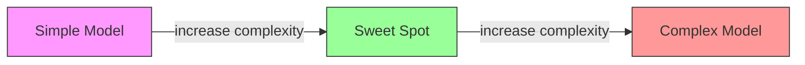
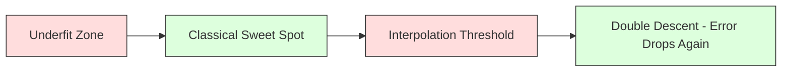
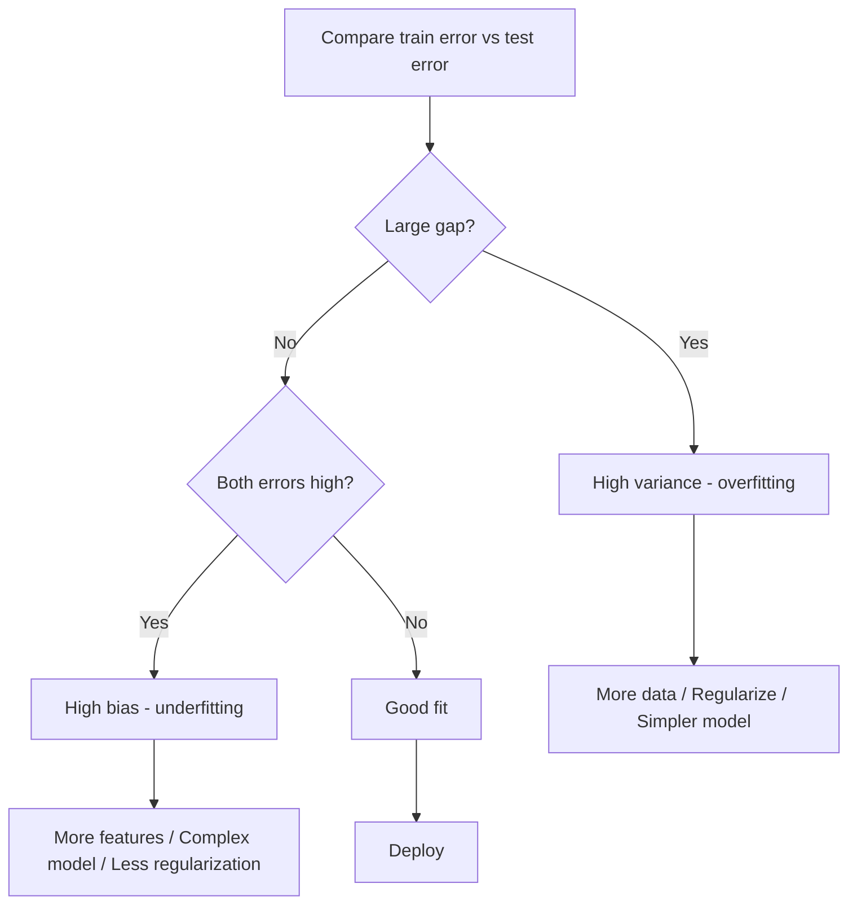
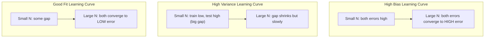
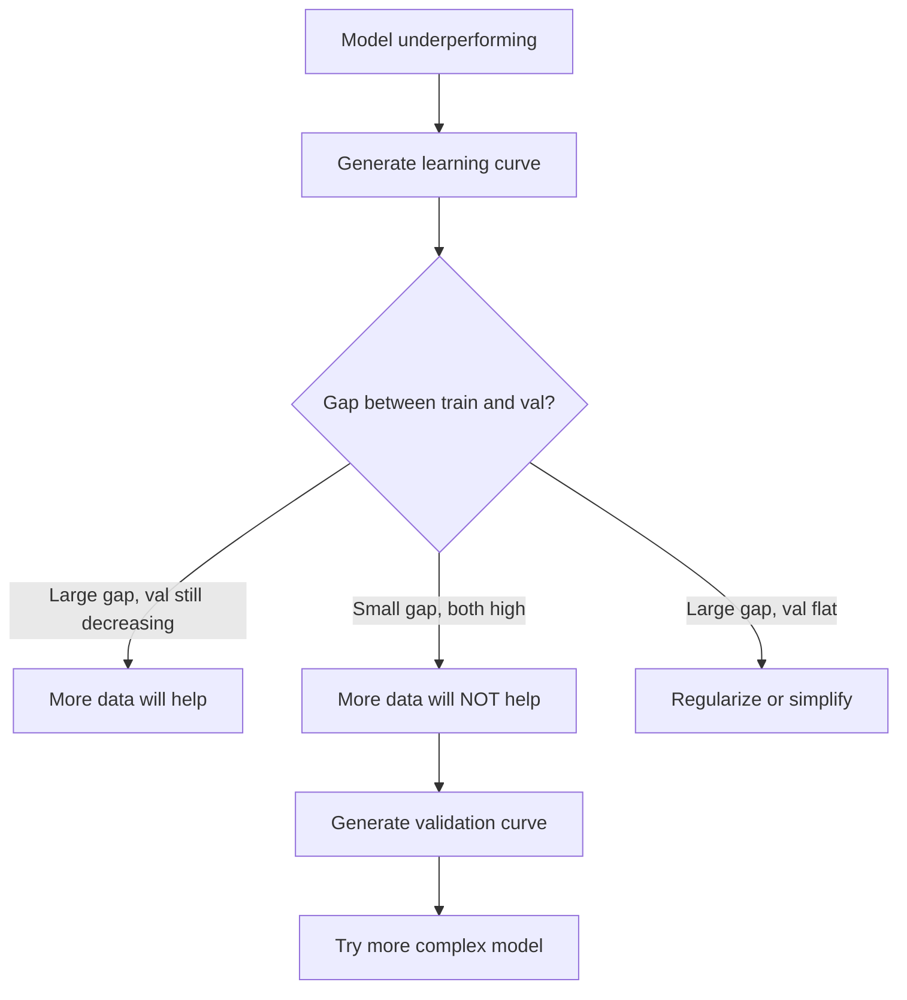

# Sự phân biệt đối xử giữa các biến thể

> Mỗi lỗi mô hình xuất phát từ một trong ba nguồn: thiên vị, biến thể, hoặc tiếng ồn. Bạn chỉ có thể kiểm soát hai nguồn đầu tiên.

**Type:** Learn
**Language:**Python
**Prerequisites:** Phase 2, Lessons 01-09 (ML basics, regression, classification, evaluation)
**Time:** ~75 minutes

## Mục tiêu học tập

- Thuộc dẫn sự phân hủy biến phân thiên vị của lỗi dự đoán dự kiến và giải thích vai trò của tiếng ồn không thể giảm
- Chẩn đoán liệu mô hình có bị thiên vị cao hay sự khác biệt cao bằng cách sử dụng các mô hình đào tạo và thử nghiệm lỗi
- Giải thích cách các kỹ thuật quy định (L1, L2, bỏ, dừng sớm) giao dịch thiên vị cho sự biến động
- Thực hiện các thí nghiệm hình dung sự giao dịch sự thiên vị-variance trên các mô hình phức tạp ngày càng tăng

## Vấn đề

Bạn đã đào tạo một mô hình có một số lỗi trong dữ liệu thử nghiệm.

Nếu mô hình của bạn quá đơn giản (sự lùi ngược tuyến tính trên một tập dữ liệu cong), nó sẽ liên tục bỏ lỡ mô hình thực sự. Đó là thiên vị. Nếu mô hình của bạn quá phức tạp (nhiều chữ số độ 20 trên 15 điểm dữ liệu), nó sẽ phù hợp hoàn hảo với dữ liệu đào tạo nhưng đưa ra dự đoán khác nhau về dữ liệu mới. Đó là sự biến đổi.

Bạn không thể giảm thiểu cả hai cùng một lúc cho một dung lượng mô hình cố định. đẩy thiên vị xuống và sự khác biệt tăng lên. đẩy thiên vị xuống và thiên vị tăng lên. Hiểu sự khác biệt này là kỹ năng chẩn đoán hữu ích nhất trong học máy. Nó cho bạn biết liệu bạn nên làm cho mô hình của bạn phức tạp hơn hay ít hơn, liệu bạn nên có thêm dữ liệu hay kỹ thuật các tính năng tốt hơn, hay có nên điều chỉnh nhiều hơn hay ít hơn.

## Khái niệm

### Bias: Trầm lẫn hệ thống

Bias đo lường mức độ dự đoán trung bình của mô hình của bạn xa với giá trị thực. Nếu bạn đào tạo cùng một mô hình trên nhiều tập huấn khác nhau được rút ra từ cùng một phân phối và trung bình các dự đoán, thiên vị là khoảng cách giữa trung bình và sự thật.

Bias cao có nghĩa là mô hình quá cứng để ghi lại mô hình thực tế. Một đường thẳng phù hợp với một hình ngụng luôn sẽ bỏ lỡ đường cong, bất kể bạn đưa ra bao nhiêu dữ liệu. Điều này là không phù hợp.

```
High bias (underfitting):
  Model always predicts roughly the same wrong thing.
  Training error: HIGH
  Test error: HIGH
  Gap between them: SMALL
```

### Sự biến thể: Nhận thức dữ liệu đào tạo

Sự biến động đo lường mức độ dự đoán của bạn thay đổi khi bạn tập luyện trên các bộ phụ dữ liệu khác nhau. Nếu những thay đổi nhỏ trong bộ tập luyện gây ra những thay đổi lớn trong mô hình, sự biến động cao.

Sự khác biệt cao có nghĩa là mô hình phù hợp với tiếng ồn trong dữ liệu đào tạo, chứ không phải là tín hiệu cơ bản. Một đa số độ -20 sẽ xuyên qua mọi điểm đào tạo nhưng dao động hoang dã giữa chúng. Điều này là quá phù hợp.

```
High variance (overfitting):
  Model fits training data perfectly but fails on new data.
  Training error: LOW
  Test error: HIGH
  Gap between them: LARGE
```

### Sự phân hủy

Đối với bất kỳ điểm x nào, sai lầm dự đoán dự kiến dưới lỗ vuông phân hủy chính xác:

```
Expected Error = Bias^2 + Variance + Irreducible Noise

where:
  Bias^2   = (E[f_hat(x)] - f(x))^2
  Variance = E[(f_hat(x) - E[f_hat(x)])^2]
  Noise    = E[(y - f(x))^2]             (sigma^2)
```

- `f(x)`là chức năng thực
- `f_hat(x)`là dự đoán của mô hình của bạn
- `E[...]`là kỳ vọng đối với các tập hợp đào tạo khác nhau
- `y`là nhãn được quan sát (công cụ thực cộng với tiếng ồn)

Thuật ngữ tiếng ồn là không thể giảm thiểu. Không mô hình nào có thể làm tốt hơn sigma^2 trên dữ liệu tiếng ồn. Công việc của bạn là tìm ra sự cân bằng đúng giữa sự thiên vị^2 và sự biến động.

### Mô hình phức tạp so với lỗi



Lập dạng U cổ điển:

| Complexity | Bias | Variance | Total Error |
|-----------|------|----------|-------------|
| Too low | HIGH | LOW | HIGH (underfitting) |
| Just right | MODERATE | MODERATE | LOWEST |
| Too high | LOW | HIGH | HIGH (overfitting) |

### Việc quy định như là kiểm soát biến thể thiên vị

Việc điều chỉnh cố tình làm tăng sự thiên vị để giảm sự khác biệt. Nó hạn chế mô hình để nó không thể đuổi theo tiếng ồn.

- **L2 (Ridge):**Giảm tất cả trọng lượng về phía không, giữ lại tất cả các tính năng nhưng giảm ảnh hưởng của chúng.
- **L1 (Lasso):**Đẩy một số trọng lượng chính xác đến không.
- **Dropout:**Thử kích hoạt các tế bào thần kinh trong quá trình tập luyện.
- **Early stopping:**Ngưng tập luyện trước khi mô hình hoàn toàn phù hợp với dữ liệu đào tạo.

Tăng cường quy định (lambda, tỷ lệ bỏ, số thời kỳ) trực tiếp kiểm soát nơi bạn ngồi trên đường cong biến thái.

### Sự xuất thân hai lần: Quan điểm hiện đại

Lý thuyết cổ điển nói: sau điểm ngọt ngào, phức tạp hơn luôn luôn đau đớn. Nhưng nghiên cứu từ năm 2019 đã chỉ ra một điều bất ngờ. Nếu bạn tiếp tục tăng công suất mô hình vượt quá ngưỡng phân cực (nơi mô hình có đủ tham số để phù hợp hoàn hảo với dữ liệu đào tạo), sai lầm thử nghiệm có thể giảm lại.



Hiện tượng "cấp độ hai" này giải thích tại sao các mạng thần kinh có tham số quá lớn (với nhiều tham số hơn nhiều so với các ví dụ đào tạo) vẫn phổ biến tốt.

Các quan sát chính về sự giảm gấp đôi:
- Nó xảy ra trong các mô hình tuyến tính, cây quyết định và mạng thần kinh
- Nhiều dữ liệu hơn thực sự có thể gây tổn thương trong khu vực phân tích (sự giảm gấp đôi theo ví dụ)
- Nhiều thời kỳ đào tạo hơn cũng có thể gây ra nó (các thời đại theo chiều hướng giảm gấp đôi)
- Việc điều chỉnh làm trơn trơn đỉnh nhưng không loại bỏ nó

Tại sao lại xảy ra chuyện này? Ở ngưỡng phân cực, mô hình có đủ khả năng để phù hợp với tất cả các điểm đào tạo. Nó được ép vào một giải pháp rất cụ thể mà liên kết qua mọi điểm, và những sự xáo trộn nhỏ trong dữ liệu gây ra những thay đổi lớn trong sự phù hợp. Đây là nơi sự khác biệt đạt đỉnh điểm. Qua ngưỡng, mô hình có nhiều giải pháp có thể phù hợp với dữ liệu hoàn hảo. Các thuật toán học tập (ví dụ, giảm gradient với sự điều chỉnh ngầm) có xu hướng chọn đơn giản nhất trong số họ. Sự thiên vị ngầm này đối với các giải pháp đơn giản là lý do tại sao các mô hình có tham số quá mức phổ biến.

| Regime | Parameters vs Samples | Behavior |
|--------|----------------------|----------|
| Underparameterized | p << n | Classical tradeoff applies |
| Interpolation threshold | p ~ n | Variance peaks, test error spikes |
| Overparameterized | p >> n | Implicit regularization kicks in, test error drops |

Để mục đích thực tế: nếu bạn đang sử dụng mạng thần kinh hoặc các tập hợp cây lớn, đừng dừng lại ở ngưỡng phân cực. Hoặc ở dưới nó (với quy định rõ ràng) hoặc vượt qua nó.

### Chẩn đoán mẫu hình của bạn



| Symptom | Diagnosis | Fix |
|---------|-----------|-----|
| High train error, high test error | Bias | More features, complex model, less regularization |
| Low train error, high test error | Variance | More data, regularization, simpler model, dropout |
| Low train error, low test error | Good fit | Ship it |
| Train error decreasing, test error increasing | Overfitting in progress | Early stopping |

### Các chiến lược hữu ích

**When bias is the problem:**
- Thêm tính năng đa số hoặc tương tác
- Sử dụng mô hình linh hoạt hơn (các bộ cây thay vì tuyến tính)
- Giảm cường độ quy định
- Đường sắt dài hơn (nếu chưa hội tụ)

**When variance is the problem:**
- Nhận thêm dữ liệu đào tạo
- Sử dụng túi (hầm rừng ngẫu nhiên)
- Tăng quy định (bản lambda cao hơn, giảm nhiều)
- Chọn tính năng (từ bỏ các tính năng ồn ào)
- Sử dụng xác thực chéo để phát hiện sớm

### Kết hợp các phương pháp và giảm sự khác biệt

Các phương pháp tập hợp là công cụ thực tế nhất để chống lại sự khác biệt.

**Bagging (Bootstrap Aggregating)**Các mô hình khác nhau được đào tạo trên các mẫu bootstrap khác nhau của dữ liệu đào tạo, sau đó trung bình dự đoán của họ. Mỗi mô hình cá nhân có sự biến động cao, nhưng trung bình có sự biến động thấp hơn nhiều. Rừng ngẫu nhiên được áp dụng cho cây quyết định.

Tại sao nó hoạt động toán học: nếu bạn trung bình N dự đoán độc lập, mỗi với sự biến động sigma^2, sự biến động của trung bình là sigma^2 / N. Các mô hình không thực sự độc lập (tất cả chúng đều thấy dữ liệu tương tự), do đó sự giảm thấp hơn 1/N, nhưng nó vẫn đáng kể.

**Boosting**làm giảm sự thiên vị bằng cách xây dựng các mô hình theo trình tự, trong đó mỗi mô hình mới tập trung vào các lỗi của tập hợp cho đến nay.

| Method | Primary Effect | Bias Change | Variance Change |
|--------|---------------|-------------|-----------------|
| Bagging | Reduces variance | No change | Decreases |
| Boosting | Reduces bias | Decreases | Can increase |
| Stacking | Reduces both | Depends on meta-learner | Depends on base models |
| Dropout | Implicit bagging | Slight increase | Decreases |

**Practical rule:**Nếu mô hình cơ bản của bạn có sự biến thái cao (cây sâu, đa nét cấp cao), sử dụng túi. Nếu mô hình cơ bản của bạn có sự thiên vị cao (những cột nông, mô hình tuyến tính đơn giản), sử dụng tăng cường.

### Lập trình học tập

Các đường cong học tập lập trình đào tạo và lỗi xác nhận theo quy mô tập thể dục. Chúng là công cụ chẩn đoán thực tế nhất bạn có. Không giống như một so sánh đào tạo / thử nghiệm đơn lẻ, đường cong học tập cho bạn thấy quỹ đạo của mô hình của bạn và cho bạn biết liệu thêm dữ liệu có giúp ích hay không.



Làm thế nào để đọc chúng:

| Scenario | Training Error | Validation Error | Gap | What It Means | What to Do |
|----------|---------------|-----------------|-----|---------------|------------|
| High bias | High | High | Small | Model cannot capture the pattern | More features, complex model, less regularization |
| High variance | Low | High | Large | Model memorizes training data | More data, regularization, simpler model |
| Good fit | Moderate | Moderate | Small | Model generalizes well | Ship it |
| High variance, improving | Low | Decreasing with more data | Shrinking | Variance problem that data can fix | Collect more data |
| High bias, flat | High | High and flat | Small and flat | More data will NOT help | Change model architecture |

Quan điểm quan trọng: nếu cả hai đường cong đều ổn định và khoảng cách nhỏ nhưng cả hai lỗi đều cao, nhiều dữ liệu hơn là vô dụng. Bạn cần một mô hình tốt hơn. Nếu khoảng cách lớn và vẫn thu nhỏ, nhiều dữ liệu hơn sẽ giúp.

### Làm thế nào để tạo ra các đường cong học tập

Có hai cách tiếp cận:

**Approach 1: Vary training set size, fixed model.**Giữ mô hình và các siêu tham số liên tục. Tập luyện trên các bộ phụ ngày càng lớn của dữ liệu đào tạo. đo lỗi đào tạo và lỗi xác thực ở mỗi kích thước. Đây là đường cong học tập tiêu chuẩn.

**Approach 2: Vary model complexity, fixed data.**Giữ dữ liệu liên tục. Xét một tham số phức tạp (đường đa nôn, chiều sâu cây, số lớp). đo lỗi đào tạo và lỗi xác nhận tại mỗi độ phức tạp. Đây là đường cong xác nhận và hiển thị sự giao dịch sự thiên vị-hình lệch trực tiếp.

Hai phương pháp này bổ sung cho nhau. phương pháp đầu tiên cho bạn biết liệu có nhiều dữ liệu hơn sẽ giúp ích hay không. phương pháp thứ hai cho bạn biết liệu một mô hình khác sẽ giúp ích hay không.



```figure
bias-variance
```

## Hãy xây dựng nó

Mã trong `code/bias_variance.py`thực hiện thí nghiệm phân hủy biến phân bias đầy đủ. Đây là cách tiếp cận, từng bước.

### Bước 1: Tạo dữ liệu tổng hợp từ một chức năng được biết

Chúng tôi sử dụng`f(x) = sin(1.5x) + 0.5x`Biết hàm chính xác cho phép chúng ta tính toán sự thiên vị và sự khác biệt chính xác.

```python
def true_function(x):
    return np.sin(1.5 * x) + 0.5 * x

def generate_data(n_samples=30, noise_std=0.5, x_range=(-3, 3), seed=None):
    rng = np.random.RandomState(seed)
    x = rng.uniform(x_range[0], x_range[1], n_samples)
    y = true_function(x) + rng.normal(0, noise_std, n_samples)
    return x, y
```

### Bước 2: Bootstrap Sampling và Polynomial Fitting

Đối với mỗi độ đa số, chúng tôi vẽ nhiều bộ huấn luyện bootstrap, phù hợp với đa số và ghi lại dự đoán trên một lưới thử nghiệm cố định. Điều này cho chúng tôi phân phối dự đoán tại mỗi điểm thử nghiệm.

```python
def fit_polynomial(x_train, y_train, degree, lam=0.0):
    X = np.column_stack([x_train ** d for d in range(degree + 1)])
    if lam > 0:
        penalty = lam * np.eye(X.shape[1])
        penalty[0, 0] = 0
        w = np.linalg.solve(X.T @ X + penalty, X.T @ y_train)
    else:
        w = np.linalg.lstsq(X, y_train, rcond=None)[0]
    return w
```

Chúng tôi phù hợp với 200 mẫu bootstrap khác nhau. Mỗi mẫu bootstrap được lấy từ cùng một phân phối cơ bản nhưng chứa các điểm khác nhau.

### Bước 3: tính toán Bias^2, biến phân

Với 200 bộ dự đoán tại mỗi điểm thử nghiệm, chúng ta có thể tính toán sự phân hủy trực tiếp từ định nghĩa:

```python
mean_pred = predictions.mean(axis=0)
bias_sq = np.mean((mean_pred - y_true) ** 2)
variance = np.mean(predictions.var(axis=0))
total_error = np.mean(np.mean((predictions - y_true) ** 2, axis=1))
```

- `mean_pred`là E[f_hat(x)] được ước tính từ các mẫu bootstrap
- `bias_sq`là khoảng cách vuông giữa dự đoán trung bình và sự thật
- `variance`là sự lây lan trung bình của dự đoán trên các mẫu bootstrap
- `total_error`nên tương đương với bias^2 + sự khác biệt + tiếng ồn

### Bước 4: Lập trình học tập

Các đường cong học tập xoay kích thước tập thể đào tạo trong khi giữ độ phức tạp của mô hình cố định.

```python
def demo_learning_curves():
    sizes = [10, 15, 20, 30, 50, 75, 100, 150, 200, 300]
    degree = 5

    for n in sizes:
        train_errors = []
        test_errors = []
        for seed in range(50):
            x_train, y_train = generate_data(n_samples=n, seed=seed * 100)
            w = fit_polynomial(x_train, y_train, degree)
            train_pred = predict_polynomial(x_train, w)
            train_mse = np.mean((train_pred - y_train) ** 2)
            test_pred = predict_polynomial(x_test, w)
            test_mse = np.mean((test_pred - y_test) ** 2)
            train_errors.append(train_mse)
            test_errors.append(test_mse)
        # Average over runs gives the learning curve point
```

Đối với mô hình biến thể cao (độ 5 với dữ liệu nhỏ), bạn thấy:
- Trận lỗi đào tạo bắt đầu thấp và tăng lên khi có nhiều dữ liệu làm cho việc ghi nhớ khó khăn hơn
- Sai lầm thử nghiệm bắt đầu cao và giảm khi mô hình nhận được nhiều tín hiệu hơn
- Khoảng cách giảm đi với nhiều dữ liệu hơn

Đối với mô hình thiên vị cao (đường 1), cả hai lỗi đều nhanh chóng hội tụ đến cùng một giá trị cao và nhiều dữ liệu không giúp ích.

### Bước 5: Lắp đặt thông tin

Mã cũng bao gồm `demo_regularization_sweep()`, xác định một đa số độ cao (đường 15) và quét cường độ điều chỉnh Ridge từ 0,001 đến 100. Điều này cho thấy sự giao dịch sự biến đổi thiên vị từ một góc độ khác nhau: thay vì biến đổi độ phức tạp của mô hình, chúng tôi thay đổi cường độ hạn chế.

```python
def demo_regularization_sweep():
    alphas = [0.001, 0.005, 0.01, 0.05, 0.1, 0.5, 1.0, 5.0, 10.0, 50.0, 100.0]
    for alpha in alphas:
        results = bias_variance_decomposition([15], lam=alpha)
        r = results[15]
        print(f"alpha={alpha:.3f}  bias={r['bias_sq']:.4f}  var={r['variance']:.4f}")
```

Ở độ thấp alpha, đa số độ-15 gần như không bị hạn chế. Sự biến đổi chiếm ưu thế bởi vì mô hình theo đuổi tiếng ồn trong mỗi mẫu bootstrap. Ở độ cao alpha, hình phạt rất mạnh đến nỗi mô hình hiệu quả trở thành một hàm gần như liên tục. Bias chiếm ưu thế.

Đây là cong U tương tự từ nhiều chữ số khác nhau, nhưng được điều khiển bởi một nút liên tục thay vì một nút riêng biệt.

## Sử dụng nó

sklearn cung cấp `learning_curve`và `validation_curve`để tự động hóa các chẩn đoán này mà không cần viết các vòng khởi động.

### Lập xác nhận: phức tạp của mô hình dọn dẹp

```python
from sklearn.model_selection import validation_curve
from sklearn.pipeline import make_pipeline
from sklearn.preprocessing import PolynomialFeatures
from sklearn.linear_model import Ridge

degrees = list(range(1, 16))
train_scores_all = []
val_scores_all = []

for d in degrees:
    pipe = make_pipeline(PolynomialFeatures(d), Ridge(alpha=0.01))
    train_scores, val_scores = validation_curve(
        pipe, X, y, param_name="polynomialfeatures__degree",
        param_range=[d], cv=5, scoring="neg_mean_squared_error"
    )
    train_scores_all.append(-train_scores.mean())
    val_scores_all.append(-val_scores.mean())
```

Điều này cho bạn đường cong giao dịch sự thiên vị-variance trực tiếp. nơi điểm xác nhận là tồi tệ nhất so với điểm tập luyện, sự khác biệt chiếm ưu thế. nơi cả hai đều xấu, sự thiên vị chiếm ưu thế.

### Khúc học: Sơn tập tập kích thước

```python
from sklearn.model_selection import learning_curve

pipe = make_pipeline(PolynomialFeatures(5), Ridge(alpha=0.01))
train_sizes, train_scores, val_scores = learning_curve(
    pipe, X, y, train_sizes=np.linspace(0.1, 1.0, 10),
    cv=5, scoring="neg_mean_squared_error"
)
train_mse = -train_scores.mean(axis=1)
val_mse = -val_scores.mean(axis=1)
```

Hình ảnh`train_mse`và `val_mse`chống lại`train_sizes`Hình dạng nói cho bạn biết tất cả về mô hình của bạn.

### Sự xác nhận chéo với việc kiểm tra quy định

```python
from sklearn.model_selection import cross_val_score

alphas = [0.001, 0.01, 0.1, 1.0, 10.0, 100.0]
for alpha in alphas:
    pipe = make_pipeline(PolynomialFeatures(10), Ridge(alpha=alpha))
    scores = cross_val_score(pipe, X, y, cv=5, scoring="neg_mean_squared_error")
    print(f"alpha={alpha:>7.3f}  MSE={-scores.mean():.4f} +/- {scores.std():.4f}")
```

Điều này sẽ xóa sức mạnh quy định cho một độ phức tạp mô hình cố định. Bạn sẽ thấy sự đổi giá của sự thiên vị-variance: alpha thấp có nghĩa là sự khác biệt cao, alpha cao có nghĩa là thiên vị cao.

### Đặt tất cả cùng nhau: Một quy trình nghiên cứu chẩn đoán đầy đủ

Thực tế, bạn chạy các chẩn đoán này theo thứ tự:

1. Đào tạo mô hình của bạn, tính toán chuyến tàu và thử nghiệm lỗi.
2. Nếu cả hai đều cao, bạn có vấn đề thiên vị.
3. Nếu tàu thấp nhưng kiểm tra cao: bạn có vấn đề biến số. tạo ra một đường cong học tập để xem liệu thêm dữ liệu có giúp ích không. Nếu không, hãy thường xuyên hóa.
4. Tạo đường cong xác nhận xoay quanh tham số phức tạp chính của bạn. Tìm điểm ngọt ngào.
5. Ở điểm ngọt ngào, tạo ra một đường cong học tập. Nếu khoảng cách vẫn lớn, bạn cần thêm dữ liệu hoặc quy định.
6. Hãy thử Ridge/Lasso với các giá trị alpha khác nhau bằng cách sử dụng `cross_val_score`Chọn alpha nơi lỗi xác nhận chéo thấp nhất.

Điều này mất 10-15 phút tính toán cho hầu hết các tập dữ liệu bảng và tiết kiệm được nhiều giờ đoán.

## Chuyển nó

Bài học này mang lại: `outputs/prompt-model-diagnostics.md`

## Các bài tập

1. Thử phân hủy bằng `noise_std=0`(không có tiếng ồn). Điều gì xảy ra với thuật ngữ lỗi không thể giảm?

2. Tăng kích thước tập thể dục từ 30 lên 300. Điều này ảnh hưởng như thế nào đến thành phần biến thể?

3. Thêm L2 điều chỉnh (khuyết phục Ridge) vào thí nghiệm. Đối với một đa số độ cao cố định (đường 15), quét lambda từ 0 đến 100.

4. Thay đổi hàm thực từ một đa nôn thành `sin(x)`Làm thế nào sự phân hủy biến thái thiên vị thay đổi?

5. Thực hiện một gói tổng hợp bootstrap đơn giản: đào tạo 10 mô hình trên các mẫu bootstrap và dự đoán trung bình.

## Các điều khoản chính

| Term | What people say | What it actually means |
|------|----------------|----------------------|
| Bias | "The model is too simple" | Systematic error from wrong assumptions. The gap between the average model prediction and truth. |
| Variance | "The model is overfitting" | Error from sensitivity to training data. How much predictions change across different training sets. |
| Irreducible error | "Noise in the data" | Error from randomness in the true data-generating process. No model can eliminate it. |
| Underfitting | "Not learning enough" | Model has high bias. It misses the real pattern even on training data. |
| Overfitting | "Memorizing the data" | Model has high variance. It fits noise in training data that does not generalize. |
| Regularization | "Constraining the model" | Adding a penalty to reduce model complexity, trading bias for lower variance. |
| Double descent | "More parameters can help" | Test error decreases again when model capacity far exceeds the interpolation threshold. |
| Model complexity | "How flexible the model is" | The capacity of a model to fit arbitrary patterns. Controlled by architecture, features, or regularization. |

## Đọc thêm

- [Hastie, Tibshirani, Friedman: Elements of Statistical Learning, Ch. 7](https://hastie.su.domains/ElemStatLearn/)- xử lý cuối cùng của sự phân hủy biến phân thiên vị
- [Belkin et al., Reconciling modern machine learning practice and the bias-variance trade-off (2019)](https://arxiv.org/abs/1812.11118)- giấy xuống đôi
- [Nakkiran et al., Deep Double Descent (2019)](https://arxiv.org/abs/1912.02292)-- Tăng gấp đôi theo thời đại và mẫu
- [Scott Fortmann-Roe: Understanding the Bias-Variance Tradeoff](http://scott.fortmann-roe.com/docs/BiasVariance.html)-- giải thích trực quan rõ ràng
