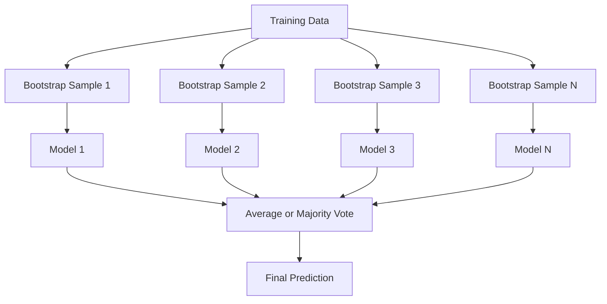
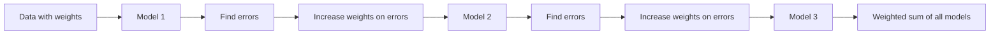
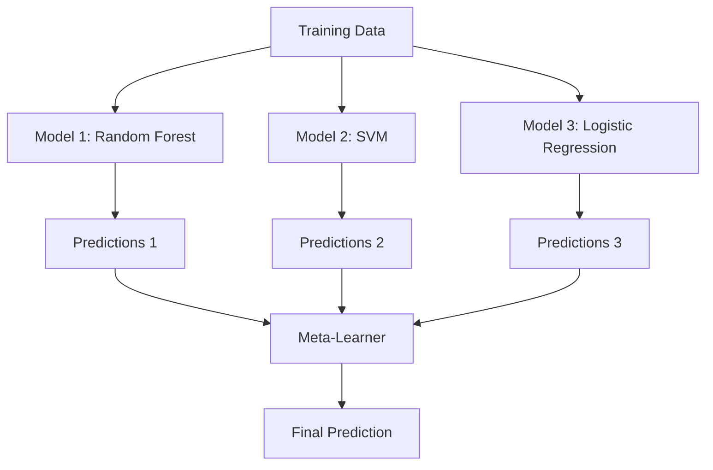

# Kết hợp các phương pháp

> Một nhóm học sinh yếu đuối, kết hợp đúng cách, trở thành học sinh mạnh mẽ. Đây không phải là một ẩn dụ. Đó là một định lý.

**Type:** Build
**Language:**Python
**Prerequisites:** Phase 2, Lesson 10 (Bias-Variance Tradeoff)
**Time:** ~120 minutes

## Mục tiêu học tập

- Thực hiện AdaBoost và gradient boosting từ đầu và giải thích làm thế nào boosting theo trình tự làm giảm sự thiên vị
- Xây dựng một tập hợp đóng gói và chứng minh cách trung bình các mô hình không liên quan làm giảm sự khác biệt mà không tăng thiên vị
- So sánh việc đóng gói, tăng cường và xếp chồng về thành phần lỗi nào mà mỗi phương pháp nhắm mục tiêu
- Đánh giá sự đa dạng của nhóm và giải thích lý do tại sao độ chính xác bỏ phiếu đa số được cải thiện với những người học yếu độc lập hơn

## Vấn đề

Một cây quyết định đơn giản là nhanh chóng để đào tạo và dễ dàng để giải thích, nhưng nó vượt quá. Một mô hình tuyến tính đơn lẻ phù hợp với các ranh giới phức tạp. Bạn có thể dành nhiều ngày để thiết kế kiến trúc mô hình hoàn hảo. hoặc bạn có thể kết hợp một loạt các mô hình không hoàn hảo và có được một cái gì đó tốt hơn bất kỳ của họ riêng lẻ.

Các phương pháp tập hợp thực hiện chính xác điều này. Chúng là kỹ thuật đáng tin cậy nhất để giành chiến thắng trong các cuộc thi Kaggle trên dữ liệu bảng, chúng cung cấp năng lượng cho hầu hết các hệ thống ML sản xuất, và chúng minh họa sự giao dịch sự biến đổi thiên vị trong hành động.

## Khái niệm

### Tại sao các nhóm nhóm làm việc

Giả sử bạn có N phân loại độc lập, mỗi loại có độ chính xác p > 0.5.

```
P(majority correct) = sum over k > N/2 of C(N,k) * p^k * (1-p)^(N-k)
```

Đối với 21 phân loại, mỗi loại có độ chính xác 60%, độ chính xác đa số là khoảng 74%. Với 101 phân loại, nó tăng lên 84%.

Điều kiện chính là **diversity**Nếu tất cả các mô hình đều mắc sai lầm tương tự, việc kết hợp chúng không giúp gì.

- Các bộ phận đào tạo khác nhau (trong đậu)
- Các bộ phận khác nhau (rừng ngẫu nhiên)
- Việc sửa lỗi theo trình tự (thúc đẩy)
- Các gia đình mô hình khác nhau (lắp xếp)

### Tải túi (Tổ hợp cột cột)

Bagging tạo ra sự đa dạng bằng cách đào tạo từng mô hình trên một mẫu bootstrap khác nhau của dữ liệu đào tạo.



Một mẫu bootstrap được vẽ với thay thế từ dữ liệu ban đầu, cùng kích thước với ban đầu. Khoảng 63,2% các mẫu độc đáo xuất hiện trong mỗi bootstrap.

Bagging làm giảm sự khác biệt mà không làm tăng sự thiên vị nhiều. Mỗi cây cá nhân vượt quá mẫu bootstrap của nó, nhưng quá phù hợp khác nhau cho mỗi cây, vì vậy trung bình hủy bỏ tiếng ồn.

**Random Forests**Các cây có thể được phân chia với một sự xoay quanh khác nhau: mỗi lần phân chia, chỉ có một bộ phụ ngẫu nhiên của các tính năng được xem xét.`sqrt(n_features)`cho việc phân loại và`n_features / 3`cho sự hồi quy.

### Tăng cường (Sự sửa lỗi theo trình tự)

Tăng cường các mô hình tàu theo trình tự. Mỗi mô hình mới tập trung vào các ví dụ mà các mô hình trước đã sai.



Tăng cường làm giảm sự thiên vị. Mỗi mô hình mới sửa chữa các lỗi hệ thống của tập hợp cho đến nay. Dự đoán cuối cùng là một tổng cân của tất cả các mô hình, nơi mô hình tốt hơn có được trọng lượng cao hơn.

Sự thỏa hiệp: tăng cường có thể quá phù hợp nếu bạn chạy quá nhiều vòng, bởi vì nó tiếp tục phù hợp với các ví dụ khó khăn hơn, một số trong đó có thể là tiếng ồn.

### AdaBoost

AdaBoost (Adaptive Boosting) là thuật toán tăng cường thực tế đầu tiên. Nó hoạt động với bất kỳ học viên cơ bản nào, thường là các con quyết định (thiên sâu -1).

Khóa toán:

```
1. Initialize sample weights: w_i = 1/N for all i

2. For t = 1 to T:
   a. Train weak learner h_t on weighted data
   b. Compute weighted error:
      err_t = sum(w_i * I(h_t(x_i) != y_i)) / sum(w_i)
   c. Compute model weight:
      alpha_t = 0.5 * ln((1 - err_t) / err_t)
   d. Update sample weights:
      w_i = w_i * exp(-alpha_t * y_i * h_t(x_i))
   e. Normalize weights to sum to 1

3. Final prediction: H(x) = sign(sum(alpha_t * h_t(x)))
```

Các mô hình có lỗi thấp hơn sẽ có alpha cao hơn. Các mẫu được phân loại sai nhận được trọng lượng cao hơn vì vậy mô hình tiếp theo tập trung vào chúng.

### Tăng dần

Tăng cường gradient tổng hợp tăng lên các hàm mất tùy ý. Thay vì cân nhắc lại các mẫu, nó phù hợp với mỗi mô hình mới với các dư thừa (tăng gradient tiêu cực của mất mát) của bộ sưu tập hiện tại.

```
1. Initialize: F_0(x) = argmin_c sum(L(y_i, c))

2. For t = 1 to T:
   a. Compute pseudo-residuals:
      r_i = -dL(y_i, F_{t-1}(x_i)) / dF_{t-1}(x_i)
   b. Fit a tree h_t to the residuals r_i
   c. Find optimal step size:
      gamma_t = argmin_gamma sum(L(y_i, F_{t-1}(x_i) + gamma * h_t(x_i)))
   d. Update:
      F_t(x) = F_{t-1}(x) + learning_rate * gamma_t * h_t(x)

3. Final prediction: F_T(x)
```

Đối với lỗ lỗi vuông, các dư giả chỉ là dư thực tế: `r_i = y_i - F_{t-1}(x_i)`Mỗi cây đều phù hợp với những sai lầm của nhóm trước đó.

Tốc độ học tập (các) kiểm soát mức độ đóng góp của mỗi cây. Tốc độ học tập nhỏ hơn đòi hỏi nhiều cây hơn nhưng tổng quát tốt hơn.

### XGBoost: Tại sao nó thống trị dữ liệu bảng

XGBoost (eXtreme Gradient Boosting) là tăng độ gradient với các tối ưu hóa kỹ thuật làm cho nó nhanh, chính xác và chống quá phù hợp:

- **Regularized objective:**Các hình phạt L1 và L2 đối với trọng lượng lá ngăn chặn các cây cá nhân quá tự tin
- **Second-order approximation:**Sử dụng cả đầu tiên và phái sinh thứ hai của lỗ, đưa ra quyết định chia sẻ tốt hơn
- **Sparsity-aware splits:**xử lý các giá trị bị mất bằng cách học hướng tốt nhất cho dữ liệu bị mất ở mỗi chia
- **Column subsampling:**Giống như rừng ngẫu nhiên, các mẫu đặc trưng tại mỗi chia để đa dạng
- **Weighted quantile sketch:**Tìm hiệu quả các điểm chia cho các tính năng liên tục trên dữ liệu phân tán
- **Cache-aware block structure:**Layout bộ nhớ tối ưu hóa cho các dòng cache CPU

Đối với dữ liệu bảng, XGBoost (và người kế nhiệm LightGBM) thường xuyên vượt qua các mạng thần kinh. Điều này sẽ không thay đổi bất cứ lúc nào sớm. Nếu dữ liệu của bạn phù hợp với một bảng có hàng và cột, hãy bắt đầu bằng tăng gradient.

### Lắp xếp (Meta-Learning)

Stacking sử dụng các dự đoán của nhiều mô hình cơ sở như là tính năng cho một người học meta.



Meta-learner học được mô hình cơ bản nào để tin vào đầu vào nào. Nếu rừng ngẫu nhiên tốt hơn ở một số khu vực và SVM ở những khu vực khác, meta-learner sẽ học cách định tuyến phù hợp.

Để tránh rò rỉ dữ liệu, dự đoán mô hình cơ sở phải được tạo bằng cách xác nhận chéo trên bộ đào tạo. Bạn không bao giờ đào tạo mô hình cơ sở và tạo các tính năng meta trên cùng một dữ liệu.

### Tiếng bỏ phiếu

Nhóm đơn giản nhất. Chỉ cần kết hợp các dự đoán trực tiếp.

- **Hard voting:**Phần lớn phiếu bầu trên nhãn lớp học.
- **Soft voting:**Tỷ lệ dự đoán trung bình, chọn lớp có tỷ lệ trung bình cao nhất thường tốt hơn vì nó sử dụng thông tin tin tin tin cậy.

```figure
f3-ensemble-average
```

## Hãy xây dựng nó

### Bước 1: quyết định (Thông viên cơ bản)

Mã trong `code/ensembles.py`bắt đầu với một cái cột quyết định: một cái cây với một phân chia.

```python
class DecisionStump:
    def __init__(self):
        self.feature_idx = None
        self.threshold = None
        self.polarity = 1
        self.alpha = None

    def fit(self, X, y, weights):
        n_samples, n_features = X.shape
        best_error = float("inf")

        for f in range(n_features):
            thresholds = np.unique(X[:, f])
            for thresh in thresholds:
                for polarity in [1, -1]:
                    pred = np.ones(n_samples)
                    pred[polarity * X[:, f] < polarity * thresh] = -1
                    error = np.sum(weights[pred != y])
                    if error < best_error:
                        best_error = error
                        self.feature_idx = f
                        self.threshold = thresh
                        self.polarity = polarity

    def predict(self, X):
        n = X.shape[0]
        pred = np.ones(n)
        idx = self.polarity * X[:, self.feature_idx] < self.polarity * self.threshold
        pred[idx] = -1
        return pred
```

### Bước 2: AdaBoost từ đầu

```python
class AdaBoostScratch:
    def __init__(self, n_estimators=50):
        self.n_estimators = n_estimators
        self.stumps = []
        self.alphas = []

    def fit(self, X, y):
        n = X.shape[0]
        weights = np.full(n, 1 / n)

        for _ in range(self.n_estimators):
            stump = DecisionStump()
            stump.fit(X, y, weights)
            pred = stump.predict(X)

            err = np.sum(weights[pred != y])
            err = np.clip(err, 1e-10, 1 - 1e-10)

            alpha = 0.5 * np.log((1 - err) / err)
            weights *= np.exp(-alpha * y * pred)
            weights /= weights.sum()

            stump.alpha = alpha
            self.stumps.append(stump)
            self.alphas.append(alpha)

    def predict(self, X):
        total = sum(a * s.predict(X) for a, s in zip(self.alphas, self.stumps))
        return np.sign(total)
```

### Bước 3: Tăng cường dần từ đầu

```python
class GradientBoostingScratch:
    def __init__(self, n_estimators=100, learning_rate=0.1, max_depth=3):
        self.n_estimators = n_estimators
        self.lr = learning_rate
        self.max_depth = max_depth
        self.trees = []
        self.initial_pred = None

    def fit(self, X, y):
        self.initial_pred = np.mean(y)
        current_pred = np.full(len(y), self.initial_pred)

        for _ in range(self.n_estimators):
            residuals = y - current_pred
            tree = SimpleRegressionTree(max_depth=self.max_depth)
            tree.fit(X, residuals)
            update = tree.predict(X)
            current_pred += self.lr * update
            self.trees.append(tree)

    def predict(self, X):
        pred = np.full(X.shape[0], self.initial_pred)
        for tree in self.trees:
            pred += self.lr * tree.predict(X)
        return pred
```

### Bước 4: So sánh với sklearn

Mã xác minh rằng các thực hiện từ đầu của chúng tôi tạo ra độ chính xác tương tự như của sklearn `AdaBoostClassifier`và `GradientBoostingClassifier`, và so sánh tất cả các phương pháp bên cạnh nhau.

## Sử dụng nó

### Khi nào nên sử dụng từng phương pháp

| Method | Reduces | Best for | Watch out for |
|--------|---------|----------|---------------|
| Bagging / Random Forest | Variance | Noisy data, many features | Does not help with bias |
| AdaBoost | Bias | Clean data, simple base learners | Sensitive to outliers and noise |
| Gradient Boosting | Bias | Tabular data, competitions | Slow to train, easy to overfit without tuning |
| XGBoost / LightGBM | Both | Production tabular ML | Many hyperparameters |
| Stacking | Both | Getting last 1-2% accuracy | Complex, risk of overfitting meta-learner |
| Voting | Variance | Quick combination of diverse models | Only helps if models are diverse |

### Các sản xuất hàng đống cho dữ liệu bảng

Đối với hầu hết các vấn đề dự đoán bảng tính, đây là thứ tự để thử:

1. **LightGBM or XGBoost**với các tham số mặc định
2. Định nghĩa n_estimators, learning_rate, max_depth, min_child_weight
3. Nếu bạn cần 0,5% cuối cùng, xây dựng một tập hợp xếp chồng với 3-5 mô hình đa dạng
4. Sử dụng xác thực chéo trong suốt

Các mạng thần kinh trên dữ liệu bảng hầu như luôn tệ hơn tăng gradient, mặc dù các nỗ lực nghiên cứu liên tục. TabNet, NODE và các kiến trúc tương tự đôi khi phù hợp nhưng hiếm khi đánh bại một XGBoost được điều chỉnh tốt.

## Chuyển nó

Bài học này sẽ mang lại kết quả `outputs/prompt-ensemble-selector.md`- một lời nhắc giúp bạn chọn đúng phương pháp tập hợp cho một tập dữ liệu nhất định. Mô tả dữ liệu của bạn (kích thước, loại tính năng, mức tiếng ồn, cân bằng lớp) và vấn đề bạn đang giải quyết.`outputs/skill-ensemble-builder.md`Với hướng dẫn lựa chọn đầy đủ.

## Các bài tập

1. Thay đổi thực hiện AdaBoost để theo dõi độ chính xác đào tạo sau mỗi vòng.

2. Thực hiện một khu rừng ngẫu nhiên từ đầu bằng cách thêm tính năng ngẫu nhiên lấy mẫu dưới cây hồi quy.`max_features=sqrt(n_features)`và dự đoán trung bình. So sánh sự giảm biến số với một cây duy nhất.

3. Trong việc thực hiện tăng cường gradient, thêm dừng sớm: theo dõi sự mất mát xác thực sau mỗi vòng và dừng khi nó không được cải thiện trong 10 vòng liên tiếp.

4. Xây dựng một tập hợp xếp chồng với ba mô hình cơ sở (k-thần hàng xóm gần nhất, cây quyết định, k-thần hàng xóm) và một người học meta-thần regression logistics. Sử dụng xác thực chéo 5 lần để tạo ra các tính năng meta. So sánh với mỗi mô hình cơ sở một mình.

5. XGBoost chạy trên cùng một bộ dữ liệu với các tham số mặc định. So sánh độ chính xác của nó với tăng độ từ đầu của bạn. Thời gian cả hai.

## Các điều khoản chính

| Term | What people say | What it actually means |
|------|----------------|----------------------|
| Bagging | "Train on random subsets" | Bootstrap aggregating: train models on bootstrap samples, average predictions to reduce variance |
| Boosting | "Focus on hard examples" | Train models sequentially, each correcting errors of the ensemble so far, to reduce bias |
| AdaBoost | "Reweight the data" | Boosting via sample weight updates; misclassified points get higher weight for the next learner |
| Gradient boosting | "Fit the residuals" | Boosting via fitting each new model to the negative gradient of the loss function |
| XGBoost | "The Kaggle weapon" | Gradient boosting with regularization, second-order optimization, and systems-level speed tricks |
| Stacking | "Models on top of models" | Use predictions of base models as input features for a meta-learner |
| Random forest | "Many randomized trees" | Bagging with decision trees, adding random feature subsampling at each split for diversity |
| Ensemble diversity | "Make different mistakes" | Models must be uncorrelated in their errors for the ensemble to improve over individuals |
| Out-of-bag error | "Free validation" | Samples not in a bootstrap draw (~36.8%) serve as a validation set without needing a holdout |

## Đọc thêm

- [Schapire & Freund: Boosting: Foundations and Algorithms](https://mitpress.mit.edu/9780262526036/)-- cuốn sách của những người sáng tạo của AdaBoost
- [Friedman: Greedy Function Approximation: A Gradient Boosting Machine (2001)](https://statweb.stanford.edu/~jhf/ftp/trebst.pdf)- giấy tăng độ gradient ban đầu
- [Chen & Guestrin: XGBoost (2016)](https://arxiv.org/abs/1603.02754)- giấy XGBoost
- [Wolpert: Stacked Generalization (1992)](https://www.sciencedirect.com/science/article/abs/pii/S0893608005800231)- giấy xếp chồng gốc
- [scikit-learn Ensemble Methods](https://scikit-learn.org/stable/modules/ensemble.html)-- tham khảo thực tế
