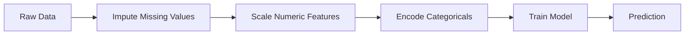
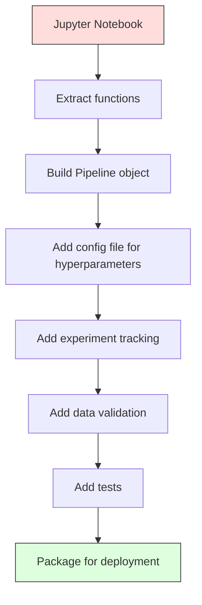

# ML đường ống dẫn

> Một mô hình không phải là một sản phẩm. Một đường ống là. đường ống là mọi thứ từ dữ liệu thô để dự đoán triển khai, và mỗi bước phải được tái tạo.

**Type:** Build
**Language:**Python
**Prerequisites:** Phase 2, Lesson 12 (Hyperparameter Tuning)
**Time:** ~120 minutes

## Mục tiêu học tập

- Xây dựng một đường ống ML từ đầu nối kết tính toán, quy mô, mã hóa và đào tạo mô hình thành một đối tượng có thể tái tạo
- Xác định các kịch bản rò rỉ dữ liệu và giải thích cách các đường ống ngăn chặn chúng bằng cách lắp đặt các bộ biến đổi chỉ trên dữ liệu đào tạo
- Xây dựng một ColumnTransformer áp dụng các tính năng số và phân loại khác nhau
- Thực hiện hệ thống tiếp theo của đường ống và chứng minh rằng cùng một đường ống được gắn kết tạo ra kết quả giống nhau trong đào tạo và sản xuất

## Vấn đề

Bạn có một sổ ghi chép tải dữ liệu, lấp đầy các giá trị thiếu với trung bình, cân tính, đào tạo mô hình, và in chính xác. Nó hoạt động. Bạn vận chuyển nó.

Một tháng sau, ai đó đào tạo lại mô hình và có kết quả khác nhau. Média được tính trên toàn bộ bộ dữ liệu bao gồm dữ liệu thử nghiệm (bổn dữ liệu). Các tham số quy mô không được lưu lại, vì vậy suy luận sử dụng số liệu thống kê khác nhau. Mã kỹ thuật tính năng được sao chép dán giữa đào tạo và phục vụ, và các bản sao khác nhau. Một cột categorical đã đạt được một giá trị mới trong sản xuất mà bộ mã hóa chưa bao giờ thấy.

Những hệ thống này không phải là giả thuyết, chúng là những lý do phổ biến nhất khiến hệ thống ML thất bại trong sản xuất.

## Khái niệm

### Đường ống là gì

Một đường ống là một chuỗi các chuyển đổi dữ liệu được sắp xếp theo sau bởi một mô hình. Mỗi bước lấy đầu ra của bước trước đó như là đầu vào. Toàn bộ đường ống được gắn một lần trên dữ liệu đào tạo. Vào thời điểm suy luận, cùng một đường ống được gắn kết biến đổi dữ liệu mới và tạo ra dự đoán.



Các đường ống đảm bảo:
- Các biến đổi chỉ được lắp đặt trên dữ liệu đào tạo (không có rò rỉ)
- Các biến đổi tương tự được áp dụng tại thời điểm suy luận
- Toàn bộ đối tượng có thể được phân phối và triển khai như một đồ tạo vật
- Việc xác thực chéo áp dụng đường ống cho mỗi lần, ngăn ngừa rò rỉ tinh tế

### Tiết lộ dữ liệu: Người giết người im lặng

Sự rò rỉ dữ liệu xảy ra khi thông tin từ bộ thử nghiệm hoặc dữ liệu trong tương lai làm ô nhiễm đào tạo.

**Leaky (wrong):**
```python
X = df.drop("target", axis=1)
y = df["target"]

scaler = StandardScaler()
X_scaled = scaler.fit_transform(X)

X_train, X_test = X_scaled[:800], X_scaled[800:]
y_train, y_test = y[:800], y[800:]
```

Máy đo đã thấy dữ liệu thử nghiệm. trung bình và lệch tiêu chuẩn bao gồm các mẫu thử nghiệm. Điều này làm tăng ước tính độ chính xác.

**Correct:**
```python
X_train, X_test = X[:800], X[800:]

scaler = StandardScaler()
X_train_scaled = scaler.fit_transform(X_train)
X_test_scaled = scaler.transform(X_test)
```

Với một đường ống, bạn không cần phải nghĩ về điều này.

### Schularn Pipeline

Sklern của `Pipeline`Các biến đổi chuỗi và một máy ước tính.`.fit()`- `.predict()`, và`.score()`Những bước này được áp dụng theo trật tự.

```python
from sklearn.pipeline import Pipeline
from sklearn.preprocessing import StandardScaler
from sklearn.linear_model import LogisticRegression

pipe = Pipeline([
    ("scaler", StandardScaler()),
    ("model", LogisticRegression()),
])

pipe.fit(X_train, y_train)
predictions = pipe.predict(X_test)
```

Khi anh gọi`pipe.fit(X_train, y_train)`- Có thể là:
1. Scaler gọi `fit_transform`trên tàu X_
2. Các cuộc gọi mẫu`fit`trên tàu X_scale

Khi anh gọi`pipe.predict(X_test)`- Có thể là:
1. Scaler gọi `transform`(không fit_transform) trên X_test
2. Các cuộc gọi mẫu`predict`trên thử nghiệm X_test quy mô

Máy đo không bao giờ nhìn thấy dữ liệu thử nghiệm trong quá trình lắp đặt.

### ColumnTransformer: Các đường ống khác nhau cho các cột khác nhau

Các tập dữ liệu thực có cột số và danh mục cần xử lý trước khác nhau. `ColumnTransformer`làm việc này.

```python
from sklearn.compose import ColumnTransformer
from sklearn.preprocessing import StandardScaler, OneHotEncoder
from sklearn.impute import SimpleImputer

numeric_pipe = Pipeline([
    ("impute", SimpleImputer(strategy="median")),
    ("scale", StandardScaler()),
])

categorical_pipe = Pipeline([
    ("impute", SimpleImputer(strategy="most_frequent")),
    ("encode", OneHotEncoder(handle_unknown="ignore")),
])

preprocessor = ColumnTransformer([
    ("num", numeric_pipe, ["age", "income", "score"]),
    ("cat", categorical_pipe, ["city", "gender", "plan"]),
])

full_pipeline = Pipeline([
    ("preprocess", preprocessor),
    ("model", GradientBoostingClassifier()),
])
```

- `handle_unknown="ignore"`Khi một danh mục mới xuất hiện (một thành phố mà mô hình chưa bao giờ thấy), nó tạo ra một vector không thay vì sụp đổ.

### Theo dõi thí nghiệm

Một đường ống làm cho việc đào tạo có thể tái tạo, nhưng bạn cũng cần theo dõi những gì đã xảy ra trong các thí nghiệm: các siêu tham số nào đã được sử dụng, phiên bản tập dữ liệu nào, những thước đo nào, mã nào đang chạy.

**MLflow**là giải pháp mã nguồn mở phổ biến nhất:

```python
import mlflow

with mlflow.start_run():
    mlflow.log_param("max_depth", 5)
    mlflow.log_param("n_estimators", 100)
    mlflow.log_param("learning_rate", 0.1)

    pipe.fit(X_train, y_train)
    accuracy = pipe.score(X_test, y_test)

    mlflow.log_metric("accuracy", accuracy)
    mlflow.sklearn.log_model(pipe, "model")
```

Mỗi lần chạy được ghi lại với các tham số, số liệu, đồ tạo vật và mô hình đầy đủ. Bạn có thể so sánh chạy, tái tạo bất kỳ thí nghiệm nào và triển khai bất kỳ phiên bản mô hình nào.

**Weights & Biases (wandb)**cung cấp chức năng tương tự với bảng điều khiển được lưu trữ:

```python
import wandb

wandb.init(project="my-pipeline")
wandb.config.update({"max_depth": 5, "n_estimators": 100})

pipe.fit(X_train, y_train)
accuracy = pipe.score(X_test, y_test)

wandb.log({"accuracy": accuracy})
```

### Phương pháp phiên bản mô hình

Sau khi thử nghiệm, bạn cần quản lý phiên bản mô hình. mô hình nào đang sản xuất? mô hình nào đang được triển khai? mô hình nào là của tuần trước?

Các mẫu đăng ký của MLflow cung cấp:
- **Version tracking:**Mỗi mô hình được lưu lại sẽ có số phiên bản
- **Stage transitions:**"Stage", "Sản xuất", "Tài lưu"
- **Approval workflow:**Các mô hình phải được thúc đẩy rõ ràng vào sản xuất
- **Rollback:**Chuyển lại phiên bản trước ngay lập tức

### DLC

Mã được phiên bản với git. Dữ liệu cũng nên được phiên bản, nhưng git không thể xử lý các tệp lớn. DVC (Data Version Control) giải quyết vấn đề này.

```
dvc init
dvc add data/training.csv
git add data/training.csv.dvc data/.gitignore
git commit -m "Track training data"
dvc push
```

DVC lưu trữ dữ liệu thực tế trong bộ nhớ từ xa (S3, GCS, Azure) và giữ một số nhỏ `.dvc`file trong git ghi lại hash. khi bạn kiểm tra một commit git,`dvc checkout`khôi phục dữ liệu chính xác đã được sử dụng.

Điều này có nghĩa là mỗi pin giao dịch git đều có mã và dữ liệu.

### Các thí nghiệm có thể tái tạo

Một thí nghiệm có thể tái tạo đòi hỏi bốn điều:

1. **Fixed random seeds:**Đặt hạt cho numpy, ngẫu nhiên, và khung (cốc cháy, sklearn)
2. **Pinned dependencies:**requirements.txt hoặc poetry.lock với các phiên bản chính xác
3. **Versioned data:**DVC hoặc tương tự
4. **Config files:**Tất cả các siêu tham số trong cấu hình, không có mã cứng

```python
import numpy as np
import random

def set_seed(seed=42):
    random.seed(seed)
    np.random.seed(seed)
    try:
        import torch
        torch.manual_seed(seed)
        torch.cuda.manual_seed_all(seed)
        torch.backends.cudnn.deterministic = True
    except ImportError:
        pass
```

### Từ sổ ghi chép đến đường ống sản xuất



Sự tiến triển điển hình:

1. **Notebook exploration:**Các thí nghiệm nhanh, hình ảnh hóa, ý tưởng tính năng
2. **Extract functions:**Chuyển chuyển quá trình xử lý trước, kỹ thuật tính năng, đánh giá thành mô-đun
3. **Build Pipeline:**Chuyển đổi chuỗi thành đường ống sơn hoặc lớp tùy chỉnh
4. **Config management:**Di chuyển tất cả các siêu tham số vào cấu hình YAML / JSON
5. **Experiment tracking:**Thêm MLflow hoặc logging wandb
6. **Data validation:**Kiểm tra các sơ đồ, phân phối và các mô hình giá trị thiếu trước khi đào tạo
7. **Tests:**Các thử nghiệm đơn vị cho các biến thể, thử nghiệm tích hợp cho toàn bộ đường ống
8. **Deployment:**Tạo dòng ống dẫn, bao trong một API (FastAPI, Flask), chứa

### Những sai lầm phổ biến về đường ống dẫn

| Mistake | Why it is bad | Fix |
|---------|-------------|-----|
| Fitting on full data before splitting | Data leakage | Use Pipeline with cross_val_score |
| Feature engineering outside pipeline | Different transforms at train vs serve | Put all transforms in the Pipeline |
| Not handling unknown categories | Production crash on new values | OneHotEncoder(handle_unknown="ignore") |
| Hardcoded column names | Breaks when schema changes | Use column name lists from config |
| No data validation | Silently wrong predictions on bad data | Add schema checks before prediction |
| Training/serving skew | Model sees different features in prod | One Pipeline object for both |

```figure
f3-pipeline-flow
```

## Hãy xây dựng nó

Mã trong `code/pipeline.py`xây dựng một đường ống ML hoàn chỉnh từ đầu:

### Bước 1: Cải biến tùy chỉnh

```python
class CustomTransformer:
    def __init__(self):
        self.means = None
        self.stds = None

    def fit(self, X):
        self.means = np.mean(X, axis=0)
        self.stds = np.std(X, axis=0)
        self.stds[self.stds == 0] = 1.0
        return self

    def transform(self, X):
        return (X - self.means) / self.stds

    def fit_transform(self, X):
        return self.fit(X).transform(X)
```

### Bước 2: Đường ống từ đầu

```python
class PipelineFromScratch:
    def __init__(self, steps):
        self.steps = steps

    def fit(self, X, y=None):
        X_current = X.copy()
        for name, step in self.steps[:-1]:
            X_current = step.fit_transform(X_current)
        name, model = self.steps[-1]
        model.fit(X_current, y)
        return self

    def predict(self, X):
        X_current = X.copy()
        for name, step in self.steps[:-1]:
            X_current = step.transform(X_current)
        name, model = self.steps[-1]
        return model.predict(X_current)
```

### Bước 3: Việc xác nhận chéo với đường ống

Mã cho thấy cách xác thực chéo với một đường ống ngăn chặn rò rỉ dữ liệu: máy đo lường quy mô được lắp đặt riêng biệt trên dữ liệu đào tạo của mỗi gấp.

### Bước 4: Đường ống sản xuất đầy đủ với sklearn

Một đường ống đầy đủ với `ColumnTransformer`, nhiều con đường xử lý trước, và một mô hình, được đào tạo với xác thực chéo thích hợp và ghi chép thí nghiệm.

## Chuyển nó

Bài học này mang lại:
- `outputs/prompt-ml-pipeline.md`-- một kỹ năng xây dựng và debugging đường ống ML
- `code/pipeline.py`-- một đường ống hoàn chỉnh từ đầu qua sklearn

## Các bài tập

1. Xây dựng một đường ống xử lý một tập dữ liệu với 3 cột số và 2 cột danh mục. Sử dụng `ColumnTransformer`để áp dụng tính toán trung bình + quy mô cho số và tính toán thường xuyên nhất + mã hóa một lần cho các loại.

2. Chuẩn bị rò rỉ dữ liệu: kết hợp bộ quy mô trên toàn bộ bộ dữ liệu trước khi chia. So sánh điểm xác thực chéo (cổn) với điểm xác thực chéo đường ống (tẩy sạch).

3. Tạo ra dòng ống dẫn của bạn với `joblib.dump`Lắp vào một kịch bản riêng biệt và chạy dự đoán.

4. Thêm một bộ biến đổi tùy chỉnh vào đường ống tạo ra các tính năng đa số (đường 2) cho hai cột số quan trọng nhất. Nó nên đi đâu trong đường ống?

5. Thiết lập theo dõi dòng chảy ML cho đường ống.`mlflow ui`) để so sánh chạy và chọn mô hình tốt nhất.

## Các điều khoản chính

| Term | What people say | What it actually means |
|------|----------------|----------------------|
| Pipeline | "Chain of transforms + model" | An ordered sequence of fitted transformers and a model, applied as one unit to prevent leakage |
| Data leakage | "Test info leaked into training" | Using information from outside the training set to build the model, inflating performance estimates |
| ColumnTransformer | "Different preprocessing per column" | Applies different pipelines to different subsets of columns, combining results |
| Experiment tracking | "Logging your runs" | Recording parameters, metrics, artifacts, and code versions for every training run |
| MLflow | "Track and deploy models" | Open-source platform for experiment tracking, model registry, and deployment |
| DVC | "Git for data" | Version control system for large data files, storing hashes in git and data in remote storage |
| Model registry | "Model version catalog" | A system that tracks model versions with stage labels (staging, production, archived) |
| Training/serving skew | "It worked in the notebook" | Differences between how data is processed during training versus inference, causing silent errors |
| Reproducibility | "Same code, same result" | The ability to get identical results from the same code, data, and configuration |

## Đọc thêm

- [scikit-learn Pipeline docs](https://scikit-learn.org/stable/modules/compose.html)-- thông tin tham chiếu chính thức về đường ống dẫn
- [MLflow documentation](https://mlflow.org/docs/latest/index.html)-- theo dõi thí nghiệm và đăng ký mô hình
- [DVC documentation](https://dvc.org/doc)-- phiên bản dữ liệu
- [Sculley et al., Hidden Technical Debt in Machine Learning Systems (2015)](https://papers.nips.cc/paper/2015/hash/86df7dcfd896fcaf2674f757a2463eba-Abstract.html)-- bài báo ban đầu về sự phức tạp của hệ thống ML
- [Google ML Best Practices: Rules of ML](https://developers.google.com/machine-learning/guides/rules-of-ml)-- tư vấn về sản xuất thực tế
