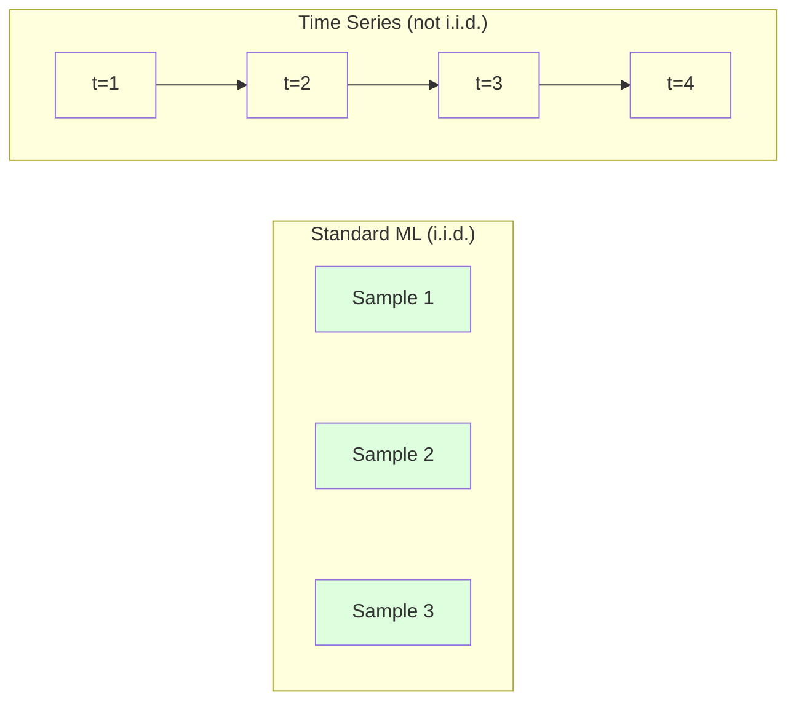
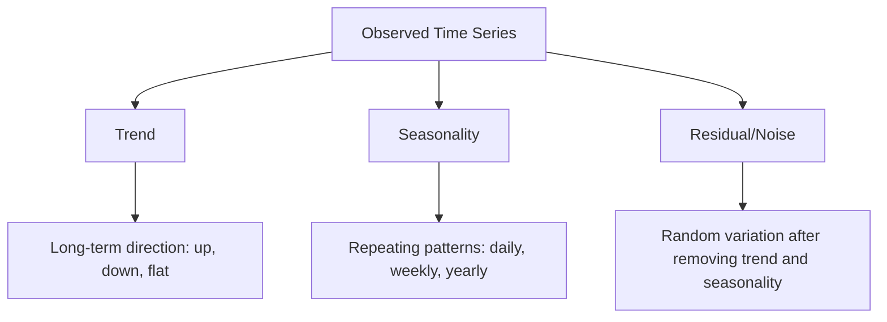
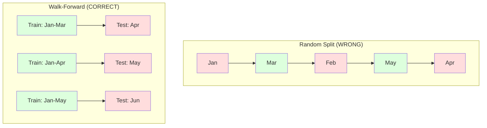

# Các nguyên tắc cơ bản của chuỗi thời gian

> Hiệu suất trong quá khứ dự đoán kết quả trong tương lai -- nếu bạn kiểm tra tính tĩnh ở trước.

**Type:** Build
**Language:**Python
**Prerequisites:** Phase 2, Lessons 01-09
**Time:** ~90 minutes

## Mục tiêu học tập

- Phân hủy một chuỗi thời gian thành xu hướng, tính theo mùa và các thành phần còn lại và kiểm tra tính tĩnh
- Thực hiện các tính năng chậm trễ và thống kê tròn để chuyển đổi một chuỗi thời gian thành một vấn đề học tập được giám sát
- Xây dựng một khuôn khổ xác nhận tiến bộ để ngăn chặn dữ liệu trong tương lai bị rò rỉ vào đào tạo
- Giải thích tại sao phân chia tàu/bản thử nghiệm ngẫu nhiên không hợp lệ cho chuỗi thời gian và chứng minh khoảng cách hiệu suất so với phân chia thời gian thích hợp

## Vấn đề

Bạn có dữ liệu theo thời gian, bán hàng hàng ngày, nhiệt độ hàng giờ, CPU mỗi phút, giá cổ phiếu hàng tuần, bạn muốn dự đoán giá trị tiếp theo, tuần tới, quý tới.

Bạn tìm ra bộ công cụ ML tiêu chuẩn của mình: phân chia rào tạo / thử nghiệm, xác nhận chéo, tính năng matrix vào, dự đoán ra. Mỗi bước đều sai.

Dòng thời gian phá vỡ các giả định mà ML tiêu chuẩn dựa trên. Các mẫu không độc lập - nhiệt độ ngày hôm nay phụ thuộc vào ngày hôm qua. Sự phân chia ngẫu nhiên rò rỉ thông tin tương lai vào quá khứ. Các tính năng trông tuyệt vời trong backtest thất bại trong sản xuất bởi vì chúng dựa trên các mô hình thay đổi theo thời gian.

Một mô hình có độ chính xác 95% với xác thực chéo ngẫu nhiên có thể có được 55% với đánh giá dựa trên thời gian thích hợp. Sự khác biệt không phải là một tính kỹ thuật. Đó là sự khác biệt giữa một mô hình hoạt động trên giấy và một mô hình hoạt động trong sản xuất.

Bài học này bao gồm các yếu tố cơ bản: điều gì làm cho dữ liệu thời gian khác biệt, cách đánh giá mô hình một cách trung thực, và cách biến một chuỗi thời gian thành các tính năng mà mô hình ML tiêu chuẩn có thể tiêu thụ.

## Khái niệm

### Điều gì làm cho chuỗi thời gian khác nhau

ML tiêu chuẩn giả định i.i.d. -- độc lập và phân phối giống nhau. Mỗi mẫu được lấy từ cùng một phân phối, độc lập với các mẫu khác. Dòng thời gian vi phạm cả hai:

- **Not independent.**Giá cổ phiếu ngày hôm nay phụ thuộc vào giá cổ phiếu ngày hôm qua.
- **Not identically distributed.**Việc phân phối thay đổi theo thời gian.

Những vi phạm này không nhỏ, chúng thay đổi cách bạn xây dựng các tính năng, cách bạn đánh giá các mô hình và các thuật toán hoạt động.



Trong ML tiêu chuẩn, các mẫu có thể thay đổi, việc trộn chúng không thay đổi gì, trong chuỗi thời gian, thứ tự là tất cả, trộn hủy tín hiệu.

### Các thành phần của chuỗi thời gian

Mỗi chuỗi thời gian là sự kết hợp của:



- **Trend**Các doanh thu tăng 10% mỗi năm nhiệt độ toàn cầu tăng
- **Seasonality**: Phác lại các mô hình trong khoảng thời gian cố định.
- **Residual**Nếu dư lượng trông giống như tiếng ồn trắng, sự phân hủy đã thu thập tín hiệu.

### Sự cố định

Một chuỗi thời gian là tĩnh nếu các tính chất thống kê của nó (tỷ lệ trung bình, biến thể, tương quan tự động) không thay đổi theo thời gian.

**Why it matters:**Một loạt không tĩnh có một con số trung bình có thể biến động. Một mô hình được đào tạo dựa trên dữ liệu từ tháng 1 đã học được một con số khác so với những gì tháng 2 sẽ cho thấy. Nó sẽ có hệ thống sai.

**How to check:**Xét trung bình xoay và lệch chuẩn xoay trên cửa sổ. Nếu chúng trôi, chuỗi không tĩnh.

**How to fix:**Thay vì mô hình hóa các giá trị thô, mô hình hóa sự thay đổi giữa các giá trị liên tiếp:

```
diff[t] = value[t] - value[t-1]
```

Nếu một vòng phân biệt không làm cho chuỗi không ổn định, hãy áp dụng nó một lần nữa ( phân biệt thứ hai).

**Example:**

Bộ phim gốc: [100, 102, 106, 112, 120]
Sự khác biệt đầu tiên: [2, 4, 6, 8] (vẫn đang xu hướng tăng)
Sự khác biệt thứ hai: [2, 2, 2] (thường xuyên -- tĩnh)

Các loạt ban đầu có xu hướng hình vuông. sự phân biệt đầu tiên biến nó thành xu hướng tuyến tính. sự phân biệt thứ hai làm cho nó bằng phẳng.

**Formal test:**Thử nghiệm Dickey-Fuller (ADF) tăng cường là thử nghiệm thống kê tiêu chuẩn cho sự tĩnh lặng. Hipotezy null là "series là không tĩnh". Một p-đáng giá dưới 0,05 có nghĩa là bạn có thể từ chối null và kết luận về tĩnh lặng.

### Tự tương quan

Autocorrelation đo lường mức độ một giá trị tại thời điểm t tương quan với giá trị tại thời điểm t-k (k bước trong quá khứ).

**ACF tells you:**
- Nếu ACF giảm xuống 0 sau khi trễ 5, giá trị hơn 5 bước trước là không liên quan.
- Nếu ACF tăng ở độ trễ 12 (kết lượng dữ liệu hàng tháng), có tính theo mùa hàng năm.
- Sử dụng các tính năng lag cho đến khi ACF trở nên vô dụng.

**PACF (Partial Autocorrelation Function)**Nếu ngày hôm nay tương quan với 3 ngày trước chỉ vì cả hai tương quan với ngày hôm qua, PACF ở lag 3 sẽ là không trong khi ACF ở lag 3 sẽ không.

### Các tính năng Lag: Chuyển đổi chuỗi thời gian thành học tập được giám sát

Các mô hình ML tiêu chuẩn cần một số tính năng X và một mục tiêu y. Dòng thời gian cho bạn một cột giá trị duy nhất.

Hãy lấy chuỗi [10, 12, 14, 13, 15] và tạo các tính năng lag-1 và lag-2:

| lag_2 | lag_1 | target |
|-------|-------|--------|
| 10    | 12    | 14     |
| 12    | 14    | 13     |
| 14    | 13    | 15     |

Bây giờ bạn có một vấn đề hồi quy tiêu chuẩn. bất kỳ mô hình ML (thái ngược tuyến tính, rừng ngẫu nhiên, tăng độ) có thể dự đoán mục tiêu từ sự chậm trễ.

Các tính năng bổ sung bạn có thể thiết kế:
- **Rolling statistics:**trung bình, std, min, tối đa trên các giá trị k cuối cùng
- **Calendar features:**Ngày của tuần, tháng, ngày lễ, cuối tuần
- **Differenced values:**Thay đổi từ bước trước
- **Expanding statistics:**trung bình tích lũy, tổng tích lũy
- **Ratio features:**giá trị hiện tại / trung bình xoay (trừ mức trung bình gần đây)
- **Interaction features:**lag_1 * ngày_of_week (chấn động của ngày trong tuần)

**How many lags?**Sử dụng hàm tương quan tự động. Nếu ACF có ý nghĩa lên đến 10 độ trễ, hãy sử dụng ít nhất 10 độ trễ. Nếu có tính theo mùa hàng tuần, hãy bao gồm độ trễ 7 (và có thể 14).

**The target alignment trap.**Khi tạo các tính năng lag, mục tiêu phải là giá trị tại thời điểm t, và tất cả các tính năng phải sử dụng giá trị tại thời điểm t-1 hoặc trước đó. Nếu bạn vô tình bao gồm giá trị tại thời điểm t như một tính năng, bạn có một dự đoán hoàn hảo - và một mô hình hoàn toàn vô dụng. Đây là lỗi phổ biến nhất trong kỹ thuật tính năng chuỗi thời gian.

### Đăng bằng tiến

Đây là khái niệm quan trọng nhất trong bài học này. Kiểm tra chéo k-fold tiêu chuẩn ngẫu nhiên gán các mẫu để đào tạo và kiểm tra. Đối với chuỗi thời gian, điều này rò rỉ thông tin trong tương lai.



Định đắc tiến:
1. Đào tạo dữ liệu đến thời gian t
2. Dự đoán tại thời gian t+1 (hoặc t+1 đến t+k cho nhiều bước)
3. Nhượt cửa sổ về phía trước
4. Lặp lại

Mỗi lớp thử nghiệm chỉ chứa dữ liệu sau tất cả dữ liệu đào tạo. Không có rò rỉ trong tương lai. Điều này cho bạn một ước tính trung thực về hiệu suất của mô hình khi được triển khai.

**Expanding window**sử dụng tất cả dữ liệu lịch sử cho đào tạo (trung kính tăng). **Sliding window**sử dụng cửa sổ đào tạo kích thước cố định (gạch cửa sổ). Sử dụng mở rộng khi bạn tin rằng dữ liệu cũ vẫn có liên quan. Sử dụng gạch khi thế giới thay đổi và dữ liệu cũ đau.

### ARIMA Intuition

ARIMA là mô hình chuỗi thời gian cổ điển. Nó có ba thành phần:

- **AR (Autoregressive):**Dự đoán từ các giá trị trước đây. AR(p) sử dụng các giá trị p cuối cùng.
- **I (Integrated):**Sự khác biệt để đạt được sự tĩnh lặng.
- **MA (Moving Average):**Dự đoán từ lỗi dự báo trước. MA(q) sử dụng các lỗi q cuối cùng.

ARIMA ((p, d, q) kết hợp cả ba. Bạn chọn p, d, q dựa trên phân tích ACF/PACF hoặc tìm kiếm tự động (auto-ARIMA).

Chúng ta sẽ không thực hiện ARIMA từ đầu - nó đòi hỏi tối ưu hóa số ngoài phạm vi của bài học này. Thấu hiểu chính là hiểu những gì mỗi thành phần làm để bạn có thể giải thích kết quả ARIMA và biết khi nào sử dụng nó.

### Khi nào nên sử dụng gì

| Approach | Best For | Handles Seasonality | Handles External Features |
|----------|---------|-------------------|------------------------|
| Lag features + ML | Tabular with many external features | With calendar features | Yes |
| ARIMA | Single univariate series, short-term | SARIMA variant | No (ARIMAX for limited) |
| Exponential smoothing | Simple trend + seasonality | Yes (Holt-Winters) | No |
| Prophet | Business forecasting, holidays | Yes (Fourier terms) | Limited |
| Neural networks (LSTM, Transformer) | Long sequences, many series | Learned | Yes |

Đối với hầu hết các vấn đề thực tế, tính năng lag + tăng độ là điểm khởi đầu mạnh nhất. Nó xử lý các tính năng bên ngoài tự nhiên, không yêu cầu tĩnh, và dễ dàng để gỡ lỗi.

### Dự đoán về các đường chân trời và chiến lược

Dự báo một bước dự đoán một bước tiến một lần. Dự báo nhiều bước dự đoán nhiều bước. Có ba chiến lược:

**Recursive (iterated):**Dự đoán một bước đi trước, sử dụng dự đoán như là đầu vào cho bước tiếp theo. đơn giản nhưng sai lầm tích lũy - mỗi dự đoán sử dụng dự đoán trước đó, vì vậy sai lầm phức tạp.

**Direct:**Tập một mô hình riêng cho mỗi chân trời. Mô hình-1 dự đoán t+1, Mô hình-5 dự đoán t+5. Không tích lũy lỗi, nhưng mỗi mô hình có ít mẫu đào tạo hơn và chúng không chia sẻ thông tin.

**Multi-output:**Trình tạo một mô hình phát ra tất cả các đường chân trời cùng một lúc. Chia sẻ thông tin qua đường chân trời nhưng yêu cầu một mô hình hỗ trợ nhiều đường lối ra (hoặc một chức năng mất tùy chỉnh).

Đối với hầu hết các vấn đề thực tế, bắt đầu với lặp lại cho các chân trời ngắn (1-5 bước) và trực tiếp cho các chân trời dài hơn.

### Những sai lầm phổ biến trong chuỗi thời gian

| Mistake | Why it happens | How to fix |
|---------|---------------|-----------|
| Random train/test split | Habit from standard ML | Use walk-forward or temporal split |
| Using future features | Feature at time t included by mistake | Audit every feature for temporal alignment |
| Overfitting to seasonality | Model memorizes calendar patterns | Hold out a full seasonal cycle in the test set |
| Ignoring scale changes | Revenue doubles but patterns stay | Model percentage change instead of absolute |
| Too many lag features | "More history is better" | Use ACF to determine relevant lags |
| Not differencing | "The model will figure it out" | Tree models handle trends; linear models need stationarity |

```figure
f3-series-decompose
```

## Hãy xây dựng nó

Mã trong `code/time_series.py`thực hiện các khối xây dựng cốt lõi từ đầu.

### Lag Feature Creator

```python
def make_lag_features(series, n_lags):
    n = len(series)
    X = np.full((n, n_lags), np.nan)
    for lag in range(1, n_lags + 1):
        X[lag:, lag - 1] = series[:-lag]
    valid = ~np.isnan(X).any(axis=1)
    return X[valid], series[valid]
```

Điều này chuyển đổi một chuỗi 1D thành một matrix tính năng nơi mỗi hàng có cuối cùng `n_lags`giá trị như các tính năng, và giá trị hiện tại như mục tiêu.

### Chứng minh chéo đi trước

```python
def walk_forward_split(n_samples, n_splits=5, min_train=50):
    assert min_train < n_samples, "min_train must be less than n_samples"
    step = max(1, (n_samples - min_train) // n_splits)
    for i in range(n_splits):
        train_end = min_train + i * step
        test_end = min(train_end + step, n_samples)
        if train_end >= n_samples:
            break
        yield slice(0, train_end), slice(train_end, test_end)
```

Mỗi phân chia đảm bảo dữ liệu đào tạo được đưa ra trước dữ liệu thử nghiệm.

### Mô hình tự động đơn giản

Một mô hình AR thuần túy chỉ là sự lùi lại tuyến tính trên các tính năng lag:

```python
class SimpleAR:
    def __init__(self, n_lags=5):
        self.n_lags = n_lags
        self.weights = None
        self.bias = None

    def fit(self, series):
        X, y = make_lag_features(series, self.n_lags)
        # Solve via normal equations
        X_b = np.column_stack([np.ones(len(X)), X])
        theta = np.linalg.lstsq(X_b, y, rcond=None)[0]
        self.bias = theta[0]
        self.weights = theta[1:]
        return self
```

Điều này về khái niệm giống hệt với sự lùi ngược tuyến tính từ Bài học 02, nhưng được áp dụng cho các phiên bản thời gian chậm cùng một biến.

### Kiểm tra sự cố định

Mã tính toán thống kê xoay để đánh giá trực quan và số lượng sự cố định:

```python
def check_stationarity(series, window=50):
    rolling_mean = np.array([
        series[max(0, i - window):i].mean()
        for i in range(1, len(series) + 1)
    ])
    rolling_std = np.array([
        series[max(0, i - window):i].std()
        for i in range(1, len(series) + 1)
    ])
    return rolling_mean, rolling_std
```

Nếu biến động trung bình tròn hoặc biến động std tròn, chuỗi không tĩnh.

Mã cũng kiểm tra tĩnh tính bằng cách so sánh nửa đầu tiên và nửa thứ hai của loạt. Nếu các phương tiện khác nhau hơn một nửa lệch chuẩn hoặc tỷ lệ biến số vượt quá 2x, loạt được đánh dấu là không tĩnh.

### Tự tương quan

```python
def autocorrelation(series, max_lag=20):
    n = len(series)
    mean = series.mean()
    var = series.var()
    acf = np.zeros(max_lag + 1)
    for k in range(max_lag + 1):
        cov = np.mean((series[:n-k] - mean) * (series[k:] - mean))
        acf[k] = cov / var if var > 0 else 0
    return acf
```

## Sử dụng nó

Với sklearn, bạn sử dụng các tính năng lag trực tiếp với bất kỳ regressor nào:

```python
from sklearn.linear_model import Ridge
from sklearn.ensemble import GradientBoostingRegressor

X, y = make_lag_features(series, n_lags=10)

for train_idx, test_idx in walk_forward_split(len(X)):
    model = Ridge(alpha=1.0)
    model.fit(X[train_idx], y[train_idx])
    predictions = model.predict(X[test_idx])
```

Đối với ARIMA, sử dụng các mô hình thống kê:

```python
from statsmodels.tsa.arima.model import ARIMA

model = ARIMA(train_series, order=(5, 1, 2))
fitted = model.fit()
forecast = fitted.forecast(steps=30)
```

Mã trong `time_series.py`chứng minh cả hai phương pháp tiếp cận và so sánh chúng bằng cách sử dụng xác thực tiến bộ.

### sklearn TimeSeriesSplit

sklearn cung cấp `TimeSeriesSplit`thực hiện xác thực tiến hành:

```python
from sklearn.model_selection import TimeSeriesSplit

tscv = TimeSeriesSplit(n_splits=5)
for train_index, test_index in tscv.split(X):
    X_train, X_test = X[train_index], X[test_index]
    y_train, y_test = y[train_index], y[test_index]
    model.fit(X_train, y_train)
    score = model.score(X_test, y_test)
```

Đây là tương đương với việc bắt đầu từ đầu của chúng ta.`walk_forward_split`nhưng tích hợp vào khung xác thực chéo của sklearn.`cross_val_score`- Có thể là:

```python
from sklearn.model_selection import cross_val_score

scores = cross_val_score(model, X, y, cv=TimeSeriesSplit(n_splits=5))
print(f"Mean score: {scores.mean():.4f} +/- {scores.std():.4f}")
```

### Các số liệu đánh giá

Dự báo chuỗi thời gian sử dụng các số liệu hồi quy, nhưng với bối cảnh nhận thức về thời gian:

- **MAE (Mean Absolute Error):**"Trong trung bình, dự đoán bị giảm 3,2 độ".
- **RMSE (Root Mean Squared Error):**Quảng gốc của lỗi trung bình vuông. Giói phạt lỗi lớn hơn MAE. Sử dụng khi lỗi lớn tồi tệ hơn nhiều lỗi nhỏ.
- **MAPE (Mean Absolute Percentage Error):**Trung bình của lỗi / giá trị thực sự của các * 100. scale-independent, hữu ích để so sánh giữa các chuỗi khác nhau. nhưng không xác định khi giá trị thực là không.
- **Naive baseline comparison:**Luôn so sánh với các đường cơ sở đơn giản. đường cơ sở ngây thơ theo mùa dự đoán giá trị từ một thời gian trước (ngày hôm qua, tuần trước). Nếu mô hình của bạn không thể đánh bại ngây thơ, có điều gì đó sai.

### Các tính năng trượt

Mã cho thấy thêm thống kê tròn (tỷ lệ trung bình, std, min, tối đa trên cửa sổ 7 và 14 ngày) để tính năng lag.

Ví dụ, nếu trung bình tròn đang tăng, nó cho thấy một xu hướng tăng lên. Nếu std tròn đang tăng, nó cho thấy sự biến động ngày càng tăng. Đây là các kiểu mẫu mà các mô hình dựa trên cây có thể học hỏi nhưng các mô hình tuyến tính không thể.

## Chuyển nó

Bài học này mang lại:
- `outputs/prompt-time-series-advisor.md`-- một lời nhắc để khung các vấn đề chuỗi thời gian
- `code/time_series.py`-- tính năng lag, xác thực đi về phía trước, mô hình AR, kiểm tra tĩnh

### Các điểm cơ bản mà bạn phải vượt qua

Trước khi xây dựng bất kỳ mô hình nào, thiết lập các đường cơ sở:

1. **Last value (persistence).**Hãy dự đoán rằng ngày mai sẽ giống như ngày hôm nay.
2. **Seasonal naive.**Hãy dự đoán rằng ngày hôm nay sẽ giống như ngày hôm qua (hoặc năm ngoái). Nếu mô hình của bạn không thể đánh bại điều này, nó không học được bất kỳ mô hình hữu ích nào ngoài tính theo mùa.
3. **Moving average.**Dự đoán trung bình của các giá trị k cuối cùng.

Nếu mô hình ML hay của bạn bị mất đến cơ sở ngây thơ theo mùa, bạn có một lỗi. Thông thường: rò rỉ trong tương lai trong các tính năng, phương pháp đánh giá sai, hoặc loạt là thực sự ngẫu nhiên và không thể dự đoán được.

### Những lời khuyên hữu ích

1. **Start with plotting.**Trước khi mô hình hóa, hãy vẽ các chuỗi nguyên liệu. Tìm kiếm xu hướng, tính theo mùa, mức độ ngoại lệ, sự gián đoạn cấu trúc (các thay đổi đột ngột trong hành vi).

2. **Difference first, model second.**Nếu dòng có xu hướng rõ ràng, hãy phân biệt trước khi tạo ra các tính năng chậm trễ. Các mô hình dựa trên cây có thể xử lý xu hướng, nhưng các mô hình tuyến tính không thể, và phân biệt không bao giờ làm tổn thương.

3. **Hold out at least one full seasonal cycle.**Nếu bạn có tính theo mùa hàng tuần, bộ thử nghiệm của bạn cần ít nhất một tuần đầy đủ. Nếu hàng tháng, ít nhất một tháng đầy đủ. Nếu không bạn không thể đánh giá liệu mô hình có nắm bắt mô hình theo mùa hay không.

4. **Monitor in production.**Các mô hình chuỗi thời gian giảm dần theo thời gian khi thế giới thay đổi. Theo dõi các lỗi dự đoán trên cơ sở tròn. Khi lỗi bắt đầu tăng lên, tập trung lại mô hình dựa trên dữ liệu gần đây.

5. **Beware of regime changes.**Một mô hình được đào tạo dựa trên dữ liệu trước đại dịch sẽ không dự đoán hành vi sau đại dịch. Bao gồm các chỉ số về những thay đổi chế độ được biết đến như là tính năng, hoặc sử dụng cửa sổ trượt để quên dữ liệu cũ.

6. **Log-transform skewed series.**Thu nhập, giá và số lượng thường bị chuyển sang bên phải. Lấy nhật ký ổn định sự khác biệt và làm cho các mẫu nhân hóa được thêm vào, mà các mô hình tuyến tính có thể xử lý. Dự báo trong không gian nhật ký, sau đó tăng lên để trở lại các đơn vị ban đầu.

## Các bài tập

1. **Stationarity experiment.**Tạo một chuỗi với một xu hướng tuyến tính. kiểm tra tĩnh tính với thống kê xoay. Sử dụng phân biệt đầu tiên. kiểm tra lại.

2. **Lag selection.**Xét ACF trên một chuỗi theo mùa (thời gian = 7). Những độ trễ nào có tương quan tự động cao nhất? Tạo các tính năng trễ chỉ sử dụng những độ trễ đó (không phải độ trễ liên tiếp).

3. **Walk-forward vs random split.**Thực hiện một sự lùi lại của Ridge trên các tính năng lag. Đánh giá bằng cách phân chia ngẫu nhiên 80/20 và bằng cách xác nhận tiến bộ.

4. **Feature engineering.**Thêm trung bình xoay (window=7), std xoay (window=7), và tính năng ngày trong tuần vào các tính năng lag. So sánh độ chính xác với và không có các tính năng bổ sung này bằng cách sử dụng xác thực đi về phía trước.

5. **Multi-step forecasting.**Thay đổi mô hình AR để dự đoán 5 bước trước thay vì 1. So sánh hai chiến lược: (a) dự đoán một bước, sử dụng dự đoán như đầu vào cho bước tiếp theo (phản hồi), và (b) đào tạo các mô hình riêng biệt cho mỗi đường chân trời (thương trực tiếp).

## Các điều khoản chính

| Term | What people say | What it actually means |
|------|----------------|----------------------|
| Stationarity | "The stats don't change over time" | A series whose mean, variance, and autocorrelation structure are constant over time |
| Differencing | "Subtract consecutive values" | Computing y[t] - y[t-1] to remove trends and achieve stationarity |
| Autocorrelation (ACF) | "How a series correlates with itself" | The correlation between a time series and a lagged copy of itself, as a function of the lag |
| Partial autocorrelation (PACF) | "Direct correlation only" | Autocorrelation at lag k after removing the effect of all shorter lags |
| Lag features | "Past values as inputs" | Using y[t-1], y[t-2], ..., y[t-k] as features to predict y[t] |
| Walk-forward validation | "Time-respecting cross-validation" | Evaluation where training data always precedes test data chronologically |
| ARIMA | "The classic time series model" | AutoRegressive Integrated Moving Average: combines past values (AR), differencing (I), and past errors (MA) |
| Seasonality | "Repeating calendar patterns" | Regular, predictable cycles in a time series tied to calendar periods (daily, weekly, yearly) |
| Trend | "The long-term direction" | A persistent increase or decrease in the series level over time |
| Expanding window | "Use all history" | Walk-forward validation where the training set grows with each fold |
| Sliding window | "Fixed-size history" | Walk-forward validation where the training set is a fixed-length window that slides forward |

## Đọc thêm

- [Hyndman and Athanasopoulos, Forecasting: Principles and Practice (3rd ed.)](https://otexts.com/fpp3/)- sách giáo khoa miễn phí tốt nhất về dự báo chuỗi thời gian
- [scikit-learn Time Series Split](https://scikit-learn.org/stable/modules/generated/sklearn.model_selection.TimeSeriesSplit.html)- Bộ phân chia đi bộ của sklearn
- [statsmodels ARIMA docs](https://www.statsmodels.org/stable/generated/statsmodels.tsa.arima.model.ARIMA.html)-- Thực hiện ARIMA với chẩn đoán
- [Makridakis et al., The M5 Competition (2022)](https://www.sciencedirect.com/science/article/pii/S0169207021001874)-- cạnh tranh dự báo quy mô lớn cho thấy các phương pháp ML so với các phương pháp thống kê
