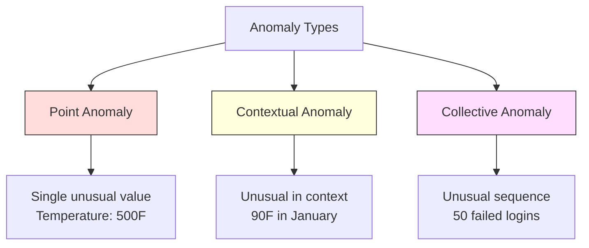
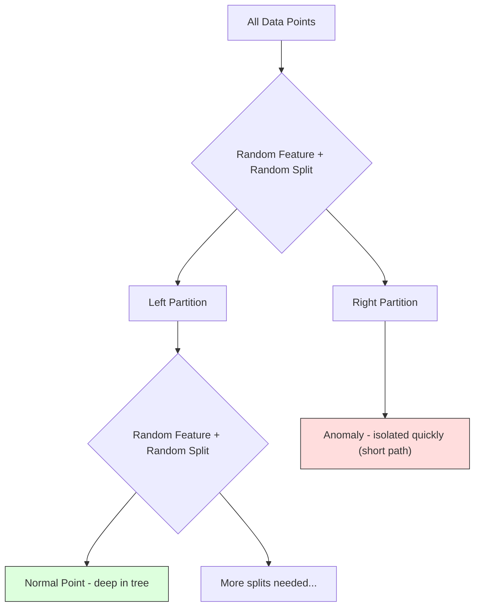
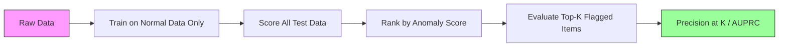

# Khám phá bất thường

> Thường thì dễ định nghĩa, bất thường là bất cứ điều gì không phù hợp.

**Type:** Build
**Language:**Python
**Prerequisites:** Phase 2, Lessons 01-09
**Time:** ~75 minutes

## Mục tiêu học tập

- Thực hiện phương pháp phát hiện bất thường rừng từ đầu
- Hóa ra sự khác biệt giữa điểm, ngữ cảnh và bất thường tập thể và chọn phương pháp phát hiện phù hợp cho mỗi
- Giải thích tại sao việc phát hiện bất thường được định hình như mô hình hóa dữ liệu bình thường thay vì phân loại bất thường
- So sánh phát hiện bất thường không được giám sát với phân loại được giám sát và đánh giá sự cân bằng giữa bảo hiểm bất thường mới và độ chính xác

## Vấn đề

Một thẻ tín dụng được sử dụng ở New York lúc 2 giờ chiều, sau đó ở Tokyo lúc 2:05 giờ chiều. Một cảm biến nhà máy đọc 150 độ khi phạm vi bình thường là 80-120.

Đây là những bất thường, tìm ra chúng là quan trọng, gian lận tốn hàng tỷ đô la, lỗi thiết bị tốn thời gian ngừng hoạt động, dữ liệu chi phí xâm nhập mạng.

Thách thức: bạn hiếm khi dán nhãn các ví dụ về bất thường. Trận gian lận chiếm 0,1% các giao dịch. Thiết bị bị hỏng xảy ra vài lần mỗi năm. Bạn không thể đào tạo một phân loại tiêu chuẩn bởi vì có hầu như không có gì trong lớp "phác thường" để học hỏi. Ngay cả khi bạn có một số nhãn, những bất thường mà bạn đã thấy không phải là những loại duy nhất bạn sẽ gặp phải. Kế hoạch gian lận ngày mai trông khác với ngày hôm nay.

Việc phát hiện bất thường làm thay đổi vấn đề. Thay vì tìm hiểu những gì bất thường, hãy tìm hiểu những gì bình thường. Bất cứ điều gì đi xa khỏi bình thường là đáng ngờ. Điều này hoạt động mà không có nhãn hiệu, thích nghi với các loại bất thường mới, và quy mô với tập dữ liệu khổng lồ.

## Khái niệm

### Các loại bất thường

Không phải tất cả các bất thường đều giống nhau:

- **Point anomalies.**Một điểm dữ liệu duy nhất bất thường bất kể bối cảnh.$50,000 from an account that normally spends $50 người.
- **Contextual anomalies.**Một điểm dữ liệu không bình thường khi xem xét bối cảnh của nó. nhiệt độ 90 độ là bình thường vào mùa hè, bất thường vào mùa đông. cùng một giá trị, bối cảnh khác nhau.
- **Collective anomalies.**Một chuỗi các điểm dữ liệu không bình thường như một nhóm, mặc dù mỗi điểm riêng lẻ có thể bình thường. Năm lỗi đăng nhập là bình thường. Năm mươi liên tiếp là một cuộc tấn công bằng lực thô.

Hầu hết các phương pháp phát hiện bất thường điểm. bất thường ngữ cảnh cần thời gian hoặc địa điểm đặc điểm. bất thường tập thể cần các phương pháp nhận thức chuỗi.



### Việc làm khung không được giám sát

Trong phân loại tiêu chuẩn, bạn có nhãn cho cả hai lớp. Trong phát hiện bất thường, bạn thường có một trong ba tình huống:

1. **Fully unsupervised.**Không có nhãn nào, bạn gắn máy dò vào tất cả dữ liệu và hy vọng bất thường là đủ hiếm để không làm hỏng mô hình "thường"
2. **Semi-supervised.**Bạn có một bộ dữ liệu sạch chỉ có dữ liệu bình thường. Bạn phù hợp với bộ sạch này và ghi điểm tất cả mọi thứ khác. Đây là thiết lập mạnh nhất khi có thể.
3. **Weakly supervised.**Bạn có một vài bất thường được dán nhãn. Sử dụng chúng để đánh giá, không phải để đào tạo. đào tạo mà không được giám sát, sau đó đo độ chính xác/tái nhớ trên bộ phụ được dán nhãn.

Nhìn sâu sắc chính: phát hiện bất thường là khác nhau về cơ bản với phân loại. Bạn đang mô hình hóa phân phối dữ liệu bình thường, không phải là ranh giới quyết định giữa hai lớp.

### Người được giám sát và người không được giám sát: Sự đổi mới

Nếu bạn có những bất thường được dán nhãn, bạn nên sử dụng chúng cho việc đào tạo (sự phân loại được giám sát) hoặc chỉ để đánh giá (phát hiện không được giám sát)?

**Supervised (treat as classification):**
- Chụp các loại bất thường chính xác mà bạn đã thấy trước đây
- Độ chính xác cao hơn đối với các loại bất thường được biết đến
- Chưa có những loại bất thường mới hoàn toàn
- Cần đào tạo lại khi các loại bất thường mới xuất hiện
- Cần đủ các ví dụ bất thường (thường là quá ít)

**Unsupervised (model normal, flag deviations):**
- Chụp bất kỳ khấu lệch nào từ bình thường, bao gồm các loại mới
- Không yêu cầu bất thường được dán nhãn
- Tỷ lệ dương tính sai cao hơn (không phải mọi thứ bất thường đều xấu)
- Tăng cường hơn cho chuyển đổi phân phối

Trong thực tế, các hệ thống tốt nhất kết hợp cả hai: phát hiện không giám sát cho sự bao phủ rộng, các mô hình giám sát cho các loại bất thường ưu tiên cao được biết đến và đánh giá của con người cho các trường hợp mơ hồ.

### Phương pháp điểm Z

Cách tiếp cận đơn giản nhất: tính toán trung bình và lệch tiêu chuẩn của mỗi tính năng. Đánh dấu bất kỳ điểm nào nhiều hơn k lệch tiêu chuẩn từ trung bình.

```text
z_score = (x - mean) / std
anomaly if |z_score| > threshold
```

Giá trị dự định là 3,0 (99,7% dữ liệu bình thường nằm trong 3 lệch tiêu chuẩn cho phân bố Gaussian).

**Strengths:**Đơn giản, nhanh chóng, có thể giải thích ("điều này là 4,5 lệch tiêu chuẩn từ bình thường").

**Weaknesses:**Giả sử dữ liệu được phân phối bình thường. Nhận thức về các mức ngoại lệ trong dữ liệu đào tạo (người ngoại lệ thay đổi trung bình và tăng cường độ STD, khiến chúng khó phát hiện hơn).

**When it works well:**Kiểm tra tính năng duy nhất khi dữ liệu có hình phông. Thời gian phản ứng máy chủ, dung nạp sản xuất, đọc cảm biến với đường cơ sở ổn định.

**When it fails:**Dữ liệu đa cụm ( hai vị trí văn phòng với nhiệt độ cơ sở khác nhau), dữ liệu bị khuyết tật (chiều lượng giao dịch trong đó $ 1000 hiếm nhưng không bất thường), dữ liệu với mức ngoại lệ trong bộ đào tạo.

### Phương pháp IQR

Năng bằng hơn điểm Z, sử dụng phạm vi giữa các quãng đường thay vì trung bình và lệch tiêu chuẩn.

```
Q1 = 25th percentile
Q3 = 75th percentile
IQR = Q3 - Q1
lower_bound = Q1 - factor * IQR
upper_bound = Q3 + factor * IQR
anomaly if x < lower_bound or x > upper_bound
```

Tỷ lệ mặc định là 1.5.

**Strengths:**Đứng vững đến ngoại lệ (những phần trăm không bị ảnh hưởng bởi các giá trị cực đoan).

**Weaknesses:**Chỉ đơn biến (hợp với mỗi tính năng độc lập). Không thể phát hiện bất thường bất thường chỉ khi các tính năng được xem xét chung (một điểm có thể bình thường trong mỗi tính năng riêng lẻ nhưng bất thường trong không gian chung).

**Practical note:**Các điểm bên ngoài các điểm bên ngoài các điểm là các điểm tiềm ẩn. Sử dụng 3.0 thay vì 1.5 làm cho máy dò bảo thủ hơn ( ít cờ, ít dương tính sai trái).

### Rừng cách ly

Điều quan trọng: những bất thường là ít và khác nhau. Trong một phân vùng ngẫu nhiên của dữ liệu, những bất thường dễ dàng hơn để cô lập - chúng cần ít phân chia ngẫu nhiên hơn để tách ra khỏi phần còn lại.



**How it works:**
1. Xây dựng nhiều cây ngẫu nhiên (một khu rừng cách ly)
2. Tại mỗi nút, chọn một tính năng ngẫu nhiên và một giá trị chia ngẫu nhiên giữa min và tối đa tính năng
3. Cứ chia nhau cho đến khi mỗi điểm được tách ra (trong lá riêng của nó)
4. Các bất thường có đường dài trung bình ngắn hơn trên tất cả các cây

**Why it works:**Các điểm bình thường sống trong các vùng dày đặc. Nhiều phân chia ngẫu nhiên cần thiết để cô lập một người khỏi hàng xóm của nó.

Điểm điểm bất thường dựa trên chiều dài đường trung bình trên tất cả các cây, bình thường hóa bằng chiều dài đường dự kiến của một cây tìm kiếm nhị phân ngẫu nhiên:

```
score(x) = 2^(-average_path_length(x) / c(n))
```

Ở đâu `c(n)`là chiều dài đường dự kiến cho n mẫu. Điểm gần 1 có nghĩa là bất thường. Điểm gần 0.5 có nghĩa là bình thường. Điểm gần 0 có nghĩa là rất bình thường (thậm trong các cụm dày đặc).

**Strengths:**Không có giả định phân phối. Làm việc trong kích thước cao. Scales tốt (đối với kích thước mẫu vì mỗi cây sử dụng một mẫu phụ).

**Weaknesses:**Đang giải với các bất thường ở các vùng dày đặc (sự đấm mốc).

**Key hyperparameters:**
- `n_estimators`Số cây. 100 thường là đủ. Nhiều cây cung cấp điểm số ổn định hơn nhưng tính toán chậm hơn.
- `max_samples`Số lượng mẫu trên mỗi cây. 256 là mặc định trong giấy ban đầu. Giá trị nhỏ hơn làm cho từng cây ít chính xác hơn nhưng tăng sự đa dạng. Phân mẫu là điều làm cho rừng cách ly nhanh hơn - mỗi cây nhìn thấy một phần nhỏ dữ liệu.
- `contamination`: Phân tích dự kiến của các bất thường. Chỉ được sử dụng để thiết lập ngưỡng. Không ảnh hưởng đến điểm số.

### Tỷ lệ giá trị ngoại lệ tại địa phương (LOF)

LOF so sánh mật độ địa phương xung quanh một điểm với mật độ xung quanh hàng xóm của nó.

**How it works:**
1. Đối với mỗi điểm, tìm k hàng xóm gần nhất của nó
2. Xét mật độ khả năng tiếp cận địa phương (bố phố dày đặc như thế nào)
3. So sánh mật độ của mỗi điểm với mật độ của hàng xóm của nó
4. Nếu một điểm có mật độ thấp hơn nhiều so với các hàng xóm của nó, nó là một ngoại lệ

**LOF score:**
- LOF gần 1.0 có nghĩa là mật độ tương tự như các hàng xóm (tình thường)
- LOF lớn hơn 1,0 nghĩa là mật độ thấp hơn so với các hàng xóm (có khả năng bất thường)
- LOF lớn hơn nhiều so với 1.0 (ví dụ, 2.0+) có nghĩa là mật độ thấp hơn đáng kể (có thể bất thường)

Phần "địa phương" là quan trọng. Hãy xem xét một tập dữ liệu có hai cluster: một cluster dày đặc 1000 điểm và một cluster hiếm 50 điểm. Một điểm ở cạnh cluster hiếm không phải là bất thường trên toàn cầu - nó có 50 hàng xóm. Nhưng nó là bất thường trên địa phương nếu hàng xóm trực tiếp của nó dày đặc hơn nó. LOF nắm bắt sắc thái này mà các phương pháp toàn cầu bỏ lỡ.

**Strengths:**Khám phá các bất thường địa phương (điểm bất thường trong khu vực của họ, ngay cả khi chúng không phải là bất thường trên toàn cầu).

**Weaknesses:**Hạt chậm trên các tập dữ liệu lớn (O(n^2) để thực hiện ngây thơ. Nhận thức về sự lựa chọn của k. Không hoạt động tốt trong các chiều kích rất cao (đại phận về chiều kích ảnh hưởng đến tính toán khoảng cách).

### So sánh

| Method | Assumptions | Speed | Handles High Dims | Detects Local Anomalies |
|--------|------------|-------|-------------------|------------------------|
| Z-score | Normal distribution | Very fast | Yes (per feature) | No |
| IQR | None (per feature) | Very fast | Yes (per feature) | No |
| Isolation Forest | None | Fast | Yes | Partially |
| LOF | Distance is meaningful | Slow | Poorly | Yes |

### Những thách thức đánh giá

Việc đánh giá các máy dò bất thường khó hơn đánh giá các bộ phân loại:

- **Extreme class imbalance.**Với sự bất thường 0,1%, dự đoán "tự nhiên" cho mọi thứ sẽ mang lại độ chính xác 99,9%.
- **AUROC is misleading.**Với sự mất cân bằng nặng, AUROC có thể trông tốt ngay cả khi mô hình bỏ lỡ hầu hết các bất thường ở ngưỡng thực tế.
- **Better metrics:**Precision@k (từ các mục được đánh dấu ở trên cùng k, bao nhiêu là bất thường thực tế), AUPRC (vùng dưới đường cong thu hồi chính xác), và thu hồi với tỷ lệ dương tính sai cố định.



### Đường ống phát hiện bất thường

Trong thực tế, việc phát hiện bất thường theo dòng công việc này:

1. **Collect baseline data.**Lý tưởng nhất, một thời gian mà bạn biết không có bất thường (hoặc rất ít).
2. **Feature engineering.**Các tính năng nguyên liệu cộng với các tính năng xuất phát (điểm thống kê xoay, tính năng thời gian, tỷ lệ).
3. **Train the detector.**Nhận được dữ liệu cơ bản, mô hình sẽ tìm hiểu "thông thường" như thế nào.
4. **Score new data.**Mỗi quan sát mới đều được đánh giá bất thường.
5. **Threshold selection.**Chọn điểm cắt giảm. Đây là một quyết định kinh doanh: ngưỡng cao hơn có nghĩa là ít báo động sai nhưng nhiều bất thường bị bỏ qua hơn.
6. **Alert and investigate.**Các điểm được đánh dấu sẽ được xem xét bởi con người hoặc phản ứng tự động.
7. **Feedback collection.**Hãy ghi lại liệu các mục được đánh dấu là bất thường đúng hay báo động sai.

Các phân phối dữ liệu thay đổi, các loại bất thường mới xuất hiện, và ngưỡng cần phải được điều chỉnh.

```figure
f3-anomaly-fence
```

## Hãy xây dựng nó

Mã trong `code/anomaly_detection.py`thực hiện điểm Z, IQR, và rừng cách ly từ đầu.

### Đám tử điểm Z

```python
def zscore_detect(X, threshold=3.0):
    mean = X.mean(axis=0)
    std = X.std(axis=0)
    std[std == 0] = 1.0
    z = np.abs((X - mean) / std)
    return z.max(axis=1) > threshold
```

Đánh dấu một điểm nếu bất kỳ tính năng nào vượt quá ngưỡng.

### Bộ phát hiện IQR

```python
def iqr_detect(X, factor=1.5):
    q1 = np.percentile(X, 25, axis=0)
    q3 = np.percentile(X, 75, axis=0)
    iqr = q3 - q1
    iqr[iqr == 0] = 1.0
    lower = q1 - factor * iqr
    upper = q3 + factor * iqr
    outside = (X < lower) | (X > upper)
    return outside.any(axis=1)
```

### Hầm rừng cách ly từ đầu

Việc thực hiện từ đầu tạo ra cây cách ly mà ngẫu nhiên phân vùng không gian tính năng:

```python
class IsolationTree:
    def __init__(self, max_depth):
        self.max_depth = max_depth

    def fit(self, X, depth=0):
        n, p = X.shape
        if depth >= self.max_depth or n <= 1:
            self.is_leaf = True
            self.size = n
            return self
        self.is_leaf = False
        self.feature = np.random.randint(p)
        x_min = X[:, self.feature].min()
        x_max = X[:, self.feature].max()
        if x_min == x_max:
            self.is_leaf = True
            self.size = n
            return self
        self.threshold = np.random.uniform(x_min, x_max)
        left_mask = X[:, self.feature] < self.threshold
        self.left = IsolationTree(self.max_depth).fit(X[left_mask], depth + 1)
        self.right = IsolationTree(self.max_depth).fit(X[~left_mask], depth + 1)
        return self
```

Dường độ đường để cô lập một điểm xác định điểm bất thường của nó.

- `IsolationForest`lớp bao nhiều cây:

```python
class IsolationForest:
    def __init__(self, n_estimators=100, max_samples=256, seed=42):
        self.n_estimators = n_estimators
        self.max_samples = max_samples

    def fit(self, X):
        sample_size = min(self.max_samples, X.shape[0])
        max_depth = int(np.ceil(np.log2(sample_size)))
        for _ in range(self.n_estimators):
            idx = rng.choice(X.shape[0], size=sample_size, replace=False)
            tree = IsolationTree(max_depth=max_depth)
            tree.fit(X[idx])
            self.trees.append(tree)

    def anomaly_score(self, X):
        avg_path = average path length across all trees
        scores = 2.0 ** (-avg_path / c(max_samples))
        return scores
```

Tỷ lệ bình thường hóa`c(n)`là chiều dài đường dự kiến của một tìm kiếm không thành công trong một cây tìm kiếm nhị phân với n yếu tố.`2 * H(n-1) - 2*(n-1)/n`nơi `H`là số hài hòa. Sự bình thường hóa này đảm bảo điểm số là tương đương giữa các bộ dữ liệu có kích thước khác nhau.

### Các kịch bản demo

Mã tạo ra nhiều kịch bản thử nghiệm:

1. **Single cluster with outliers.**Một cụm Gaussian 2D với các bất thường được tiêm từ xa trung tâm.
2. **Multimodal data.**Ba cluster với kích thước và mật độ khác nhau. điểm giữa các cluster là bất thường. điểm Z-score đấu tranh vì các phạm vi tính năng là rộng.
3. **High-dimensional data.**50 tính năng, nhưng bất thường khác nhau chỉ trong 5 trong số đó.

Mỗi bản demo so sánh tất cả các phương pháp sử dụng độ chính xác, nhớ lại, F1, và Precision@k.

## Sử dụng nó

Với sklearn (sử dụng các ứng dụng thư viện, không phải từ đầu):

```python
from sklearn.ensemble import IsolationForest
from sklearn.neighbors import LocalOutlierFactor

iso = IsolationForest(n_estimators=100, contamination=0.05, random_state=42)
iso.fit(X_train)
predictions = iso.predict(X_test)

lof = LocalOutlierFactor(n_neighbors=20, contamination=0.05, novelty=True)
lof.fit(X_train)
predictions = lof.predict(X_test)
```

Lưu ý `contamination`đặt đúng là quan trọng -- quá thấp bỏ qua các bất thường, quá cao tạo ra báo động sai.

Mã trong `anomaly_detection.py`so sánh các triển khai từ đầu với sklearn trên cùng một dữ liệu.

### Skillarn Parameter ô nhiễm

- `contamination`tham số trong sklearn xác định ngưỡng để chuyển đổi điểm bất thường liên tục thành dự đoán nhị phân.

```python
iso_5 = IsolationForest(contamination=0.05)
iso_10 = IsolationForest(contamination=0.10)
```

Cả hai đều có điểm bất thường tương tự.`iso_5`chỉ huy 5% hàng đầu trong khi `iso_10`Nếu bạn không biết tỷ lệ bất thường thực sự (thường bạn không biết), hãy đặt ô nhiễm lên "tự động" và làm việc trực tiếp với điểm số thô.

### SVM một lớp

Một bộ phát hiện bất thường không được giám sát khác đáng biết. Một lớp SVM phù hợp với một ranh giới xung quanh dữ liệu bình thường trong một không gian tính năng chiều cao (nghiên dùng thủ thuật hạt nhân).

```python
from sklearn.svm import OneClassSVM

oc_svm = OneClassSVM(kernel="rbf", gamma="auto", nu=0.05)
oc_svm.fit(X_train)
predictions = oc_svm.predict(X_test)
```

- `nu`Các thông số này được phân tích với các thông số có thể được phân tích bằng các thông số có thể được phân tích bằng các thông số có thể được phân tích bằng các thông số có thể được phân tích bằng các thông số có thể có thể có thể có thể có thể có thể có thể có thể có thể có thể có thể có thể có thể có thể có thể có thể có thể có thể có thể có thể có thể có thể có thể có thể có thể có thể có thể có thể có thể có thể có thể có thể có thể có thể có thể có thể có thể có thể có thể có thể có thể có thể có thể có thể có thể có thể có thể có thể có thể có thể có thể có thể có thể có thể có thể có thể có thể có thể có thể có thể có thể có thể có thể có thể có thể có thể có thể có thể có thể có thể có thể có thể có thể có thể có thể có thể có thể có thể có thể có thể có thể có thể có thể có thể có thể có thể có thể có thể có thể có thể có thể có thể có thể có thể có thể có thể có thể có thể có thể có thể có thể có thể có thể có thể có thể có thể có thể có thể có thể có thể có thể có thể có thể có thể có thể có thể có thể có thể có thể có thể có thể có thể có thể có thể có thể có thể có thể có thể có thể có thể có thể có thể có thể có thể có thể có thể có thể có thể có thể có thể có thể có thể có thể có thể có thể có thể có thể có thể có thể có thể có thể có thể có thể có thể có thể có thể có thể có thể có thể có thể có thể có thể có thể có thể có thể có thể có thể có thể có thể có thể có thể có thể có thể có thể có thể có thể.

### Phương pháp tự động mã hóa (Preview)

Autoencoder là mạng thần kinh học tập nén và tái cấu trúc dữ liệu. Đào tạo trên dữ liệu bình thường. Vào thời điểm thử nghiệm, các bất thường có lỗi tái cấu trúc cao bởi vì mạng đã học cách tái cấu trúc chỉ các mẫu bình thường.

Điều này được bao gồm trong giai đoạn 3 (Depth Learning), nhưng nguyên tắc là giống nhau: mô hình những gì là bình thường, đánh dấu những gì lệch.

### Tạo ra việc phát hiện bất thường

Cũng giống như các phương pháp tập hợp cải thiện phân loại (Lớp 11) , kết hợp nhiều máy dò bất thường cải thiện phát hiện. Cách tiếp cận đơn giản nhất:

1. Động cơ phát hiện nhiều (Z-score, IQR, rừng cách ly, LOF)
2. Tiêu chuẩn điểm của mỗi máy dò đến [0, 1]
3. Tỷ lệ trung bình điểm bình thường
4. Điểm cờ trên ngưỡng điểm trung bình

Điều này làm giảm các điểm dương tính sai bởi vì các phương pháp khác nhau có các chế độ thất bại khác nhau. Một điểm được đánh dấu bởi cả bốn phương pháp đều gần như chắc chắn là bất thường.

Các bộ tích hợp tinh vi hơn cân nặng mỗi bộ dò bằng độ tin cậy ước tính của nó (được đo trên một bộ xác thực với bất thường được biết đến, nếu có).

### Các cân nhắc về sản xuất

1. **Threshold drift.**Khi phân phối dữ liệu thay đổi, ngưỡng cố định trở nên lỗi thời.
2. **Alert fatigue.**Quá nhiều báo động sai và các nhà khai thác ngừng chú ý. Bắt đầu với ngưỡng cao (càng ít, báo cáo đáng tin cậy hơn) và giảm nó khi sự tin tưởng xây dựng.
3. **Ensemble approach.**Trong sản xuất, kết hợp nhiều máy dò. Chỉ đánh dấu một điểm nếu nhiều phương pháp đồng ý nó là bất thường. Điều này làm giảm đáng kể dương tính sai.
4. **Feature engineering.**Các tính năng nguyên thô hiếm khi đủ. Thêm số liệu thống kê, tỷ lệ, thời gian kể từ sự kiện cuối cùng và các tính năng cụ thể về miền.
5. **Feedback loop.**Khi các nhà khai thác điều tra các mục được đánh dấu và xác nhận hoặc từ chối chúng, đưa chúng trở lại hệ thống.

## Chuyển nó

Bài học này mang lại:
- `outputs/skill-anomaly-detector.md`-- một kỹ năng quyết định để chọn máy dò đúng
- `code/anomaly_detection.py`-- Z-score, IQR, và rừng cách ly từ đầu, với so sánh sklearn

### Chọn một ngưỡng

Điểm bất thường là liên tục, bạn cần một ngưỡng để đưa ra quyết định nhị phân. Đây là một quyết định kinh doanh, không phải là một quyết định kỹ thuật.

Hãy xem hai trường hợp:
- **Fraud detection.**Thiết lập ngưỡng thấp để bắt được nhiều gian lận hơn, chấp nhận nhiều báo động sai hơn.
- **Equipment maintenance.**Một báo động sai nghĩa là một việc tắt không cần thiết chi phí .$50,000. A missed failure means a $Đặt ngưỡng để cân bằng chi phí này.

Trong cả hai trường hợp, ngưỡng tối ưu phụ thuộc vào tỷ lệ chi phí giữa dương tính giả và âm tính giả.

### Tăng quy mô cho sản xuất

Đối với việc phát hiện bất thường trong thời gian thực trong sản xuất:

1. **Batch training, online scoring.**Trình luyện mô hình thường xuyên (ngày, tuần) dựa trên dữ liệu bình thường gần đây.
2. **Feature computation must match.**Nếu bạn đã được đào tạo với thống kê tròn trong 30 ngày, bạn cần 30 ngày lịch sử để tính toán các tính năng cho một quan sát mới.
3. **Score distribution monitoring.**Theo dõi phân phối điểm số bất thường theo thời gian. Nếu điểm trung bình trôi lên, dữ liệu đang thay đổi hoặc mô hình đã lỗi thời.
4. **Explainability.**Khi bạn đánh dấu một bất thường, hãy nói tại sao. Điểm Z: "Cấu tích X là 4,2 lệch tiêu chuẩn trên bình thường".

## Các bài tập

1. **Threshold tuning.**Đánh giá điểm Z với ngưỡng từ 1.0 đến 5.0 trong các bước 0,5.

2. **Multivariate anomalies.**Tạo dữ liệu 2D nơi mỗi tính năng riêng lẻ trông bình thường, nhưng sự kết hợp là bất thường (ví dụ, các điểm xa từ đường viền cluster chính).

3. **LOF from scratch.**Thực hiện Local Outlier Factor sử dụng k-cô lân cận. So sánh với LocalOutlierFactor của sklearn trên cùng một dữ liệu. Sử dụng k=10 và k=50 - cách lựa chọn k ảnh hưởng đến kết quả như thế nào?

4. **Streaming anomaly detection.**Thay đổi bộ phát hiện điểm Z để hoạt động trong một thiết lập phát trực tuyến: cập nhật trung bình chạy và biến số khi các điểm mới đến ( thuật toán trực tuyến của Welford). So sánh với điểm Z-chọn trên cùng một dữ liệu.

5. **Real-world evaluation.**Hãy lấy một bộ dữ liệu có bất thường được biết đến (ví dụ: gian lận thẻ tín dụng từ Kaggle). Thử đánh giá tất cả bốn phương pháp bằng cách sử dụng precision@100, precision@500 và AUPRC. phương pháp nào hiệu quả nhất? Tại sao?

## Các điều khoản chính

| Term | What people say | What it actually means |
|------|----------------|----------------------|
| Anomaly | "Outlier, unusual point" | A data point that deviates significantly from the expected pattern of normal data |
| Point anomaly | "A single weird value" | An individual observation that is unusual regardless of context |
| Contextual anomaly | "Normal value, wrong context" | An observation that is unusual given its context (time, location, etc.) but might be normal in another context |
| Isolation Forest | "Random splits to find outliers" | An ensemble of random trees that isolates anomalies with fewer splits than normal points |
| Local Outlier Factor | "Compare density to neighbors" | A method that flags points whose local density is much lower than their neighbors' density |
| Z-score | "Standard deviations from mean" | (x - mean) / std, measuring how far a point is from the center in units of standard deviation |
| IQR | "Interquartile range" | Q3 - Q1, measuring the spread of the middle 50% of data, used for robust outlier detection |
| Contamination | "Expected fraction of anomalies" | A hyperparameter telling the detector what proportion of the data it should flag as anomalous |
| Precision@k | "Of the top k flags, how many are real" | Precision computed on only the k most suspicious points, useful for imbalanced anomaly detection |
| AUPRC | "Area under precision-recall curve" | A metric that summarizes precision-recall performance across all thresholds, better than AUROC for imbalanced data |

## Đọc thêm

- [Liu et al., Isolation Forest (2008)](https://cs.nju.edu.cn/zhouzh/zhouzh.files/publication/icdm08b.pdf)-- giấy rừng cách ly ban đầu
- [Breunig et al., LOF: Identifying Density-Based Local Outliers (2000)](https://dl.acm.org/doi/10.1145/342009.335388)-- giấy LOF gốc
- [scikit-learn Outlier Detection docs](https://scikit-learn.org/stable/modules/outlier_detection.html)-- tổng quan tất cả các máy dò bất thường sklearn
- [Chandola et al., Anomaly Detection: A Survey (2009)](https://dl.acm.org/doi/10.1145/1541880.1541882)-- khảo sát toàn diện về các phương pháp phát hiện bất thường
- [Goldstein and Uchida, A Comparative Evaluation of Unsupervised Anomaly Detection Algorithms (2016)](https://journals.plos.org/plosone/article?id=10.1371/journal.pone.0152173)-- so sánh bằng chứng của 10 phương pháp trên các tập dữ liệu thực
