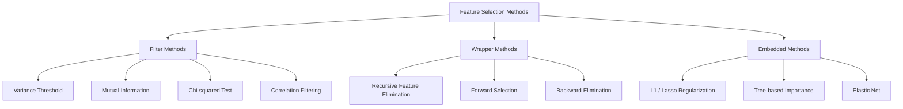
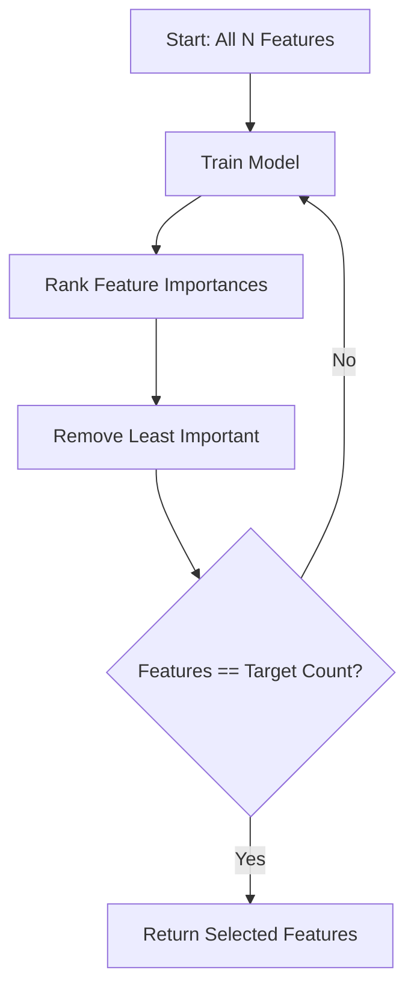
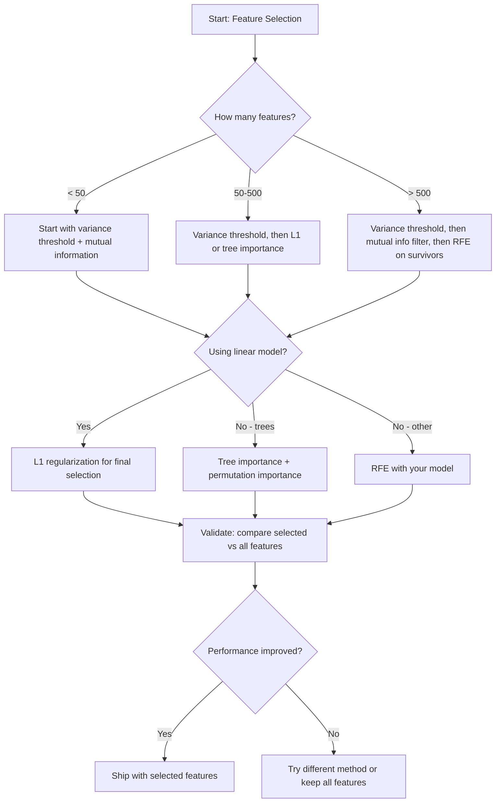

# Chọn tính năng

> Nhiều tính năng không tốt hơn, nhưng những tính năng đúng hơn.

**Type:** Build
**Language:**Python
**Prerequisites:** Phase 2, Lessons 01-09, 08 (feature engineering)
**Time:** ~75 minutes

## Mục tiêu học tập

- Thực hiện các phương pháp lọc (nới hạn biến thể, thông tin lẫn nhau, chi-quad) và phương pháp bao bì (RFE, lựa chọn phía trước) từ đầu
- Giải thích tại sao thông tin lẫn nhau nắm bắt các mối quan hệ không tuyến tính tính- mục tiêu mà mối tương quan không có
- So sánh L1 regularization (đánh chọn tích hợp) với RFE (đánh chọn bao bì) và đánh giá các tradeoff tính toán của chúng
- Xây dựng một đường ống chọn tính năng kết hợp nhiều phương pháp và chứng minh tổng quát hóa tốt hơn trên dữ liệu được giữ

## Vấn đề

Bạn có 500 tính năng. mô hình của bạn đào tạo chậm, quá tải liên tục, và không ai có thể giải thích những gì nó đã học được. Bạn thêm thêm nhiều tính năng hy vọng để cải thiện hiệu suất. Nó trở nên tồi tệ hơn.

Đây là lời nguyền của tính chiều trong hành động. Khi số lượng các tính năng tăng lên, khối lượng không gian tính năng nổ ra. Điểm dữ liệu trở nên hẹp. Khoảng cách giữa các điểm hội tụ. Mô hình cần nhiều dữ liệu hơn để tìm các mẫu thực tế. Các tính năng tiếng ồn nhấn chìm các tính năng tín hiệu.

Sự lựa chọn tính năng là thuốc chống thuốc. Giảm tiếng ồn. Giữ lại các tính năng mang lại thông tin thực tế về mục tiêu. Kết quả: đào tạo nhanh hơn, tổng quát tốt hơn, và các mô hình bạn có thể thực sự giải thích.

Mục tiêu không phải là sử dụng tất cả thông tin có sẵn mà là sử dụng thông tin đúng.

## Khái niệm

### Ba loại lựa chọn tính năng

Mỗi phương pháp lựa chọn tính năng rơi vào một trong ba loại:



**Filter methods**và chỉ số mỗi tính năng một cách độc lập bằng cách sử dụng một thước đo thống kê. Họ không sử dụng mô hình.

**Wrapper methods**- tập hợp các mô hình để đánh giá các bộ phụ tính năng. Họ sử dụng hiệu suất mô hình như điểm số. Kết quả tốt hơn, nhưng tốn kém bởi vì họ tập lại mô hình nhiều lần.

**Embedded methods**chọn các tính năng như một phần của đào tạo mô hình. L1 điều chỉnh đẩy trọng lượng lên không. Cây quyết định chia thành các tính năng hữu ích nhất. Việc lựa chọn xảy ra trong quá trình lắp ráp, không phải là một bước riêng biệt.

### Tỉ lệ biến động

Nếu một tính năng hầu như không khác nhau giữa các mẫu, nó sẽ không mang lại thông tin.

Hãy xem xét một tính năng là 0,0 cho 999 trong 1000 mẫu. sự khác biệt của nó gần bằng không. Không mô hình nào có thể sử dụng nó để phân biệt giữa các lớp.

```
variance(x) = mean((x - mean(x))^2)
```

Đặt ngưỡng (ví dụ: 0.01). Thả mọi tính năng với sự biến đổi dưới đó. Điều này loại bỏ các tính năng liên tục hoặc gần liên tục mà không cần nhìn vào biến mục tiêu.

Khi nào sử dụng nó: như một bước xử lý trước các phương pháp khác. Nó bắt được các tính năng rõ ràng vô dụng với chi phí gần bằng không.

Giới hạn: một tính năng có thể có sự khác biệt cao và vẫn là tiếng ồn thuần túy.

### Thông tin lẫn nhau

Thông tin lẫn nhau đo lường mức độ biết giá trị của tính năng X làm giảm sự không chắc chắn về mục tiêu Y.

```
I(X; Y) = sum_x sum_y p(x, y) * log(p(x, y) / (p(x) * p(y)))
```

Nếu X và Y là độc lập, p(x, y) = p(x) * p(y), do đó thuật ngữ log là 0 và I(X; Y) = 0.

Lợi thế chính so với tương quan: thông tin lẫn nhau nắm bắt các mối quan hệ phi tuyến tính. Một tính năng có thể có không tương quan với mục tiêu nhưng thông tin lẫn nhau cao vì mối quan hệ là vuông hoặc định kỳ.

Đối với các tính năng liên tục, phân định thành thùng trước tiên (sự ước tính dựa trên histogram). Số lượng thùng ảnh hưởng đến ước tính - quá ít thùng mất thông tin, quá nhiều thùng thêm tiếng ồn. Một lựa chọn phổ biến: thùng vuông hoặc quy tắc Sturges (1 + log2(n)).


### Phục tiêu tính năng tái phát (RFE)

RFE là một phương pháp bao bì. Nó sử dụng tính năng quan trọng của mô hình để cắt lặp đi lặp lại:

1. Trình hình với tất cả các tính năng
2. Các tính năng cấp độ theo tầm quan trọng (tỷ lệ đối với các mô hình tuyến tính, giảm tạp chất đối với cây)
3. Xóa các tính năng ít quan trọng nhất
4. Lặp lại cho đến khi số lượng các tính năng mong muốn vẫn còn



RFE xem xét các tương tác tính năng vì mô hình nhìn thấy tất cả các tính năng còn lại cùng nhau.

Chi phí: bạn đào tạo mô hình N - thời gian mục tiêu. Với 500 tính năng và mục tiêu 10, đó là 490 lần đào tạo. Đối với các mô hình đắt tiền, điều này chậm. Bạn có thể tăng tốc bằng cách loại bỏ nhiều tính năng mỗi bước (ví dụ, loại bỏ 10% dưới mỗi vòng).

### L1 (Lasso) Chuẩn bị

L1 quy định thêm giá trị tuyệt đối của trọng lượng vào hàm mất:

```
loss = prediction_error + alpha * sum(|w_i|)
```

Các tham số alpha kiểm soát cách tích cực các tính năng được cắt.

Tại sao chính xác là không? L1 hình phạt tạo ra một khu vực hạn chế hình kim cương trong không gian trọng lượng. Giải pháp tối ưu có xu hướng hạ cánh ở một góc của kim cương này, nơi một hoặc nhiều trọng lượng là không. L2 điều chỉnh (cột) tạo ra một hạn chế chu kỳ nơi trọng lượng thu nhỏ nhưng hiếm khi đạt đến không.

Đây là sự lựa chọn tính năng nhúng: mô hình học được trong quá trình đào tạo những tính năng mà phải bỏ qua.

Lợi ích: chạy đào tạo đơn, xử lý các tính năng tương quan (chọn một và không những người khác), được xây dựng trong hầu hết các triển khai mô hình tuyến tính.

Khác giới hạn: chỉ hoạt động cho các mô hình tuyến tính. Không thể nắm bắt tầm quan trọng của tính năng phi tuyến tính.

### Sự quan trọng của tính năng cây

Cây quyết định và các tập hợp của chúng (hàng rừng ngẫu nhiên, tăng độ nghiêng) tự nhiên xếp hạng các tính năng. Mỗi phân chia làm giảm tạp chất (Gini hoặc entropy để phân loại, biến thể để lùi lại).

Đối với một khu rừng ngẫu nhiên với cây T:

```
importance(feature_j) = (1/T) * sum over all trees of
    sum over all nodes splitting on feature_j of
        (n_samples * impurity_decrease)
```

Điều này cung cấp một điểm số tầm quan trọng bình thường cho mỗi tính năng. Nó xử lý các mối quan hệ phi tuyến tính và tương tác tính năng tự động.

Cảnh sát: tầm quan trọng dựa trên cây bị thiên vị về các tính năng có nhiều giá trị độc đáo (đồng tính cao). Một cột ID ngẫu nhiên sẽ xuất hiện quan trọng vì nó chia sẻ hoàn hảo mọi mẫu. Sử dụng tầm quan trọng permutation như một kiểm tra trí tuệ.

### Tầm quan trọng của sự chuyển đổi

Một phương pháp mô hình-những người:

1. Cử lý mô hình và ghi lại hiệu suất cơ sở trên dữ liệu xác thực
2. Đối với mỗi tính năng: trộn các giá trị của nó ngẫu nhiên, đo đạc giảm hiệu suất
3. Thêm vào đó, tính năng này càng lớn

Nếu sự trộn lẫn của một tính năng không làm tổn hại hiệu suất, mô hình không phụ thuộc vào nó.

Tầm quan trọng của sự chuyển đổi tránh sự thiên vị về tính chất của sự quan trọng dựa trên cây. Nhưng nó chậm: một đánh giá đầy đủ cho mỗi tính năng, lặp lại nhiều lần để ổn định.

### Bảng so sánh

| Method | Type | Speed | Nonlinear | Feature Interactions |
|--------|------|-------|-----------|---------------------|
| Variance threshold | Filter | Very fast | No | No |
| Mutual information | Filter | Fast | Yes | No |
| Correlation filter | Filter | Fast | No | No |
| RFE | Wrapper | Slow | Depends on model | Yes |
| L1 / Lasso | Embedded | Fast | No (linear) | No |
| Tree importance | Embedded | Medium | Yes | Yes |
| Permutation importance | Model-agnostic | Slow | Yes | Yes |

### Hình ảnh dòng chảy quyết định



```figure
f3-feature-prune
```

## Hãy xây dựng nó

### Bước 1: Tạo dữ liệu tổng hợp với cấu trúc tính năng được biết đến

```python
import numpy as np


def make_feature_selection_data(n_samples=500, seed=42):
    rng = np.random.RandomState(seed)

    x1 = rng.randn(n_samples)
    x2 = rng.randn(n_samples)
    x3 = rng.randn(n_samples)
    x4 = x1 + 0.1 * rng.randn(n_samples)
    x5 = x2 + 0.1 * rng.randn(n_samples)

    informative = np.column_stack([x1, x2, x3, x4, x5])

    correlated = np.column_stack([
        x1 * 0.9 + 0.1 * rng.randn(n_samples),
        x2 * 0.8 + 0.2 * rng.randn(n_samples),
        x3 * 0.7 + 0.3 * rng.randn(n_samples),
        x1 * 0.5 + x2 * 0.5 + 0.1 * rng.randn(n_samples),
        x2 * 0.6 + x3 * 0.4 + 0.1 * rng.randn(n_samples),
    ])

    noise = rng.randn(n_samples, 10) * 0.5

    X = np.hstack([informative, correlated, noise])
    y = (2 * x1 - 1.5 * x2 + x3 + 0.5 * rng.randn(n_samples) > 0).astype(int)

    feature_names = (
        [f"info_{i}" for i in range(5)]
        + [f"corr_{i}" for i in range(5)]
        + [f"noise_{i}" for i in range(10)]
    )

    return X, y, feature_names
```

Chúng ta biết sự thật cơ bản: các tính năng 0-4 là thông tin (cả 3 và 4 là bản sao tương quan của 0 và 1), các tính năng 5-9 tương quan với các tính năng thông tin, các tính năng 10-19 là tiếng ồn thuần túy.

### Bước 2: Khoảng hạn biến động

```python
def variance_threshold(X, threshold=0.01):
    variances = np.var(X, axis=0)
    mask = variances > threshold
    return mask, variances
```

### Bước 3: Thông tin lẫn nhau (tự riêng tư)

```python
def discretize(x, n_bins=10):
    min_val, max_val = x.min(), x.max()
    if max_val == min_val:
        return np.zeros_like(x, dtype=int)
    bin_edges = np.linspace(min_val, max_val, n_bins + 1)
    binned = np.digitize(x, bin_edges[1:-1])
    return binned


def mutual_information(X, y, n_bins=10):
    n_samples, n_features = X.shape
    mi_scores = np.zeros(n_features)

    y_vals, y_counts = np.unique(y, return_counts=True)
    p_y = y_counts / n_samples

    for f in range(n_features):
        x_binned = discretize(X[:, f], n_bins)
        x_vals, x_counts = np.unique(x_binned, return_counts=True)
        p_x = dict(zip(x_vals, x_counts / n_samples))

        mi = 0.0
        for xv in x_vals:
            for yi, yv in enumerate(y_vals):
                joint_mask = (x_binned == xv) & (y == yv)
                p_xy = np.sum(joint_mask) / n_samples
                if p_xy > 0:
                    mi += p_xy * np.log(p_xy / (p_x[xv] * p_y[yi]))
        mi_scores[f] = mi

    return mi_scores
```

### Bước 4: Phục tiêu tính năng tái phát

```python
def simple_logistic_importance(X, y, lr=0.1, epochs=100):
    n_samples, n_features = X.shape
    w = np.zeros(n_features)
    b = 0.0

    for _ in range(epochs):
        z = X @ w + b
        pred = 1.0 / (1.0 + np.exp(-np.clip(z, -500, 500)))
        error = pred - y
        w -= lr * (X.T @ error) / n_samples
        b -= lr * np.mean(error)

    return w, b


def rfe(X, y, n_features_to_select=5, lr=0.1, epochs=100):
    n_total = X.shape[1]
    remaining = list(range(n_total))
    rankings = np.ones(n_total, dtype=int)
    rank = n_total

    while len(remaining) > n_features_to_select:
        X_subset = X[:, remaining]
        w, _ = simple_logistic_importance(X_subset, y, lr, epochs)
        importances = np.abs(w)

        least_idx = np.argmin(importances)
        original_idx = remaining[least_idx]
        rankings[original_idx] = rank
        rank -= 1
        remaining.pop(least_idx)

    for idx in remaining:
        rankings[idx] = 1

    selected_mask = rankings == 1
    return selected_mask, rankings
```

### Bước 5: Chọn tính năng L1

```python
def soft_threshold(w, alpha):
    return np.sign(w) * np.maximum(np.abs(w) - alpha, 0)


def l1_feature_selection(X, y, alpha=0.1, lr=0.01, epochs=500):
    n_samples, n_features = X.shape
    w = np.zeros(n_features)
    b = 0.0

    for _ in range(epochs):
        z = X @ w + b
        pred = 1.0 / (1.0 + np.exp(-np.clip(z, -500, 500)))
        error = pred - y

        gradient_w = (X.T @ error) / n_samples
        gradient_b = np.mean(error)

        w -= lr * gradient_w
        w = soft_threshold(w, lr * alpha)
        b -= lr * gradient_b

    selected_mask = np.abs(w) > 1e-6
    return selected_mask, w
```

### Bước 6: Tầm quan trọng dựa trên cây (trái quyết định đơn giản)

```python
def gini_impurity(y):
    if len(y) == 0:
        return 0.0
    classes, counts = np.unique(y, return_counts=True)
    probs = counts / len(y)
    return 1.0 - np.sum(probs ** 2)


def best_split(X, y, feature_idx):
    values = np.unique(X[:, feature_idx])
    if len(values) <= 1:
        return None, -1.0

    best_threshold = None
    best_gain = -1.0
    parent_gini = gini_impurity(y)
    n = len(y)

    for i in range(len(values) - 1):
        threshold = (values[i] + values[i + 1]) / 2.0
        left_mask = X[:, feature_idx] <= threshold
        right_mask = ~left_mask

        n_left = np.sum(left_mask)
        n_right = np.sum(right_mask)

        if n_left == 0 or n_right == 0:
            continue

        gain = parent_gini - (n_left / n) * gini_impurity(y[left_mask]) - (n_right / n) * gini_impurity(y[right_mask])

        if gain > best_gain:
            best_gain = gain
            best_threshold = threshold

    return best_threshold, best_gain


def tree_importance(X, y, n_trees=50, max_depth=5, seed=42):
    rng = np.random.RandomState(seed)
    n_samples, n_features = X.shape
    importances = np.zeros(n_features)

    for _ in range(n_trees):
        sample_idx = rng.choice(n_samples, size=n_samples, replace=True)
        feature_subset = rng.choice(n_features, size=max(1, int(np.sqrt(n_features))), replace=False)

        X_boot = X[sample_idx]
        y_boot = y[sample_idx]

        tree_imp = _build_tree_importance(X_boot, y_boot, feature_subset, max_depth)
        importances += tree_imp

    total = importances.sum()
    if total > 0:
        importances /= total

    return importances


def _build_tree_importance(X, y, feature_subset, max_depth, depth=0):
    n_features = X.shape[1]
    importances = np.zeros(n_features)

    if depth >= max_depth or len(np.unique(y)) <= 1 or len(y) < 4:
        return importances

    best_feature = None
    best_threshold = None
    best_gain = -1.0

    for f in feature_subset:
        threshold, gain = best_split(X, y, f)
        if gain > best_gain:
            best_gain = gain
            best_feature = f
            best_threshold = threshold

    if best_feature is None or best_gain <= 0:
        return importances

    importances[best_feature] += best_gain * len(y)

    left_mask = X[:, best_feature] <= best_threshold
    right_mask = ~left_mask

    importances += _build_tree_importance(X[left_mask], y[left_mask], feature_subset, max_depth, depth + 1)
    importances += _build_tree_importance(X[right_mask], y[right_mask], feature_subset, max_depth, depth + 1)

    return importances
```

### Bước 7: Thực hiện tất cả các phương pháp và so sánh

Các tập tin mã chạy tất cả năm phương pháp trên cùng một tập dữ liệu tổng hợp và in một bảng so sánh cho thấy các tính năng mà mỗi phương pháp chọn.

## Sử dụng nó

Với scikit-learn, lựa chọn tính năng được xây dựng vào đường ống dẫn:

```python
from sklearn.feature_selection import (
    VarianceThreshold,
    mutual_info_classif,
    RFE,
    SelectFromModel,
)
from sklearn.linear_model import Lasso, LogisticRegression
from sklearn.ensemble import RandomForestClassifier

vt = VarianceThreshold(threshold=0.01)
X_filtered = vt.fit_transform(X)

mi_scores = mutual_info_classif(X, y)
top_k = np.argsort(mi_scores)[-10:]

rfe_selector = RFE(LogisticRegression(), n_features_to_select=10)
rfe_selector.fit(X, y)
X_rfe = rfe_selector.transform(X)

lasso_selector = SelectFromModel(Lasso(alpha=0.01))
lasso_selector.fit(X, y)
X_lasso = lasso_selector.transform(X)

rf = RandomForestClassifier(n_estimators=100)
rf.fit(X, y)
importances = rf.feature_importances_
```

Các thực hiện từ đầu cho thấy chính xác những gì xảy ra bên trong mỗi phương pháp.`var(X, axis=0)`và áp dụng một mặt nạ. thông tin chung là đếm tần số khớp và biên trong một bảng tình huống. RFE là một vòng tròn tập luyện, xếp hạng và cỏ. L1 là giảm độ nghiêng với một bước ngập ngập mềm.

Các phiên bản sklearn thêm độ bền (ví dụ, mutual_info_classif sử dụng ước tính mật độ k-NN thay vì binning), tốc độ (c thực hiện C) và tích hợp đường ống.

## Chuyển nó

Bài học này mang lại:
- `outputs/skill-feature-selector.md`-- một cây quyết định tham chiếu nhanh để chọn phương pháp lựa chọn tính năng đúng

## Các bài tập

1. **Forward selection**: thực hiện ngược lại của RFE. Bắt đầu với không tính năng. Ở mỗi bước, thêm tính năng cải thiện hiệu suất mô hình nhiều nhất. dừng khi thêm tính năng không còn giúp ích. So sánh các tính năng được chọn với kết quả RFE. Which is faster? Which gives better results?

2. **Stability selection**: chạy L1 tính năng lựa chọn 50 lần, mỗi lần trên một mẫu phụ ngẫu nhiên 80% của dữ liệu, với giá trị alpha khác nhau một chút. đếm bao nhiêu lần mỗi tính năng được chọn. Các tính năng được chọn trong > 80% các chạy là " ổn định. " So sánh tính năng ổn định với lựa chọn L1 một lần chạy.

3. **Multicollinearity detection**: tính toán các matrix tương quan cho tất cả các tính năng. Thực hiện một hàm, với một ngưỡng tương quan (ví dụ 0,9), loại bỏ một tính năng từ mỗi cặp có tương quan cao (giữ một với thông tin lẫn nhau cao hơn với mục tiêu).

4. **Feature selection pipeline**: ngưỡng biến số chuỗi, bộ lọc thông tin lẫn nhau và RFE vào một đường ống dẫn. Trước tiên loại bỏ các tính năng biến số gần bằng không, sau đó giữ 50% trên bằng thông tin lẫn nhau, sau đó chạy RFE trên những người sống sót. So sánh đường ống này với chạy RFE một mình trên tất cả các tính năng. đường ống dẫn nhanh hơn không? Nó cũng chính xác không?

5. **Permutation importance from scratch**: thực hiện tầm quan trọng của sự thay đổi. Đối với mỗi tính năng, trộn các giá trị của nó 10 lần, đo lường sự sụt giảm trung bình trong điểm số F1. So sánh xếp hạng với tầm quan trọng dựa trên cây. Tìm những trường hợp họ không đồng ý và giải thích lý do tại sao (khung: các tính năng tương quan).

## Các điều khoản chính

| Term | What people say | What it actually means |
|------|----------------|----------------------|
| Filter method | "Score features independently" | A feature selection approach that ranks features using a statistical measure without training a model, evaluating each feature in isolation |
| Wrapper method | "Use the model to pick features" | A feature selection approach that evaluates feature subsets by training a model and using its performance as the selection criterion |
| Embedded method | "The model selects features during training" | Feature selection that happens as part of model fitting, such as L1 regularization driving weights to zero |
| Mutual information | "How much one variable tells you about another" | A measure of the reduction in uncertainty about Y given knowledge of X, capturing both linear and nonlinear dependencies |
| Recursive Feature Elimination | "Train, rank, prune, repeat" | An iterative wrapper method that trains a model, removes the least important feature(s), and repeats until a target count is reached |
| L1 / Lasso regularization | "Penalty that kills features" | Adding the sum of absolute weight values to the loss function, which drives unimportant feature weights to exactly zero |
| Variance threshold | "Remove constant features" | Dropping features whose variance across samples falls below a specified threshold, filtering out features that carry no information |
| Feature importance | "Which features matter most" | A score indicating how much each feature contributes to model predictions, computed from split gains (trees) or coefficient magnitudes (linear) |
| Permutation importance | "Shuffle and measure the damage" | Evaluating feature importance by randomly shuffling each feature's values and measuring the resulting drop in model performance |
| Curse of dimensionality | "Too many features, not enough data" | The phenomenon where adding features increases the volume of the feature space exponentially, making data sparse and distances meaningless |

## Đọc thêm

- [An Introduction to Variable and Feature Selection (Guyon & Elisseeff, 2003)](https://jmlr.org/papers/v3/guyon03a.html)-- cuộc khảo sát cơ bản về các phương pháp lựa chọn tính năng, vẫn được tham khảo rộng rãi
- [scikit-learn Feature Selection Guide](https://scikit-learn.org/stable/modules/feature_selection.html)-- tham khảo thực tế cho các phương pháp lọc, bao bì và nhúng với các ví dụ mã
- [Stability Selection (Meinshausen & Buhlmann, 2010)](https://arxiv.org/abs/0809.2932)-- kết hợp mẫu phụ với lựa chọn tính năng cho kết quả mạnh mẽ, có thể tái tạo
- [Beware Default Random Forest Importances (Strobl et al., 2007)](https://bmcbioinformatics.biomedcentral.com/articles/10.1186/1471-2105-8-25)-- chứng minh sự thiên vị về tính trọng tâm dựa trên cây và đề xuất tầm quan trọng có điều kiện như là một lựa chọn thay thế
