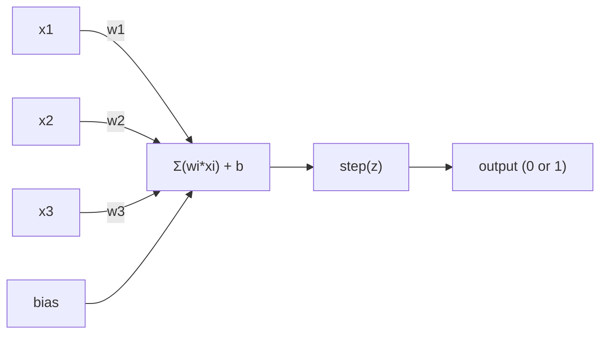
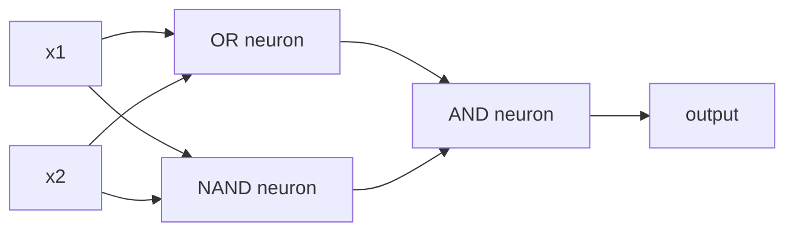

# Máy Perceptron

> perceptron là nguyên tử của mạng thần kinh. chia nó ra và bạn tìm thấy trọng lượng, thiên vị và quyết định.

**Type:** Build
**Languages:** Python
**Prerequisites:** Phase 1 (Linear Algebra Intuition)
**Time:** ~60 minutes

## Mục tiêu học tập

- Thực hiện một perceptron từ đầu trong Python, bao gồm quy tắc cập nhật trọng lượng và chức năng kích hoạt bước
- Giải thích tại sao một perceptron duy nhất có thể giải quyết các vấn đề phân tách theo đường thẳng và chứng minh trường hợp thất bại XOR
- XOR được giải quyết bằng cách tạo ra các cổng OR, NAND và AND
- Đào tạo một mạng hai lớp với kích hoạt sigmoid và backpropagation để học XOR tự động

## Vấn đề

Bạn biết các vector và các sản phẩm chấm. Bạn biết rằng một matrix chuyển đổi đầu vào thành đầu ra. Nhưng làm thế nào để một máy học cách chuyển đổi nào để sử dụng?

Perceptron trả lời câu hỏi này. Nó là máy học đơn giản nhất có thể: lấy một số đầu vào, nhân bằng trọng lượng, thêm một sự thiên vị, và đưa ra một quyết định nhị phân.

Hiểu perceptron có nghĩa là hiểu "làm học" thực sự có nghĩa là gì trong mã: điều chỉnh số cho đến khi đầu ra phù hợp với thực tế.

## Khái niệm

### Một Neuron, một quyết định

Một perceptron lấy n đầu vào, nhân mỗi lần bằng trọng lượng, tổng hợp chúng, thêm một thiên vị và truyền kết quả thông qua một chức năng kích hoạt.



Chức năng bước là tàn bạo: nếu tổng cộng cộng cộng với sự thiên vị được cân nhắc là >= 0, đầu ra 1. Nếu không, đầu ra là 0.

```
step(z) = 1  if z >= 0
           0  if z < 0
```

Đây là một phân loại tuyến tính. trọng lượng và thiên vị xác định một đường (hoặc siêu phẳng ở các chiều cao hơn) chia không gian đầu vào thành hai khu vực.

### Biên giới quyết định

Đối với hai đầu vào, perceptron vẽ một đường xuyên qua không gian 2D:

```
  x2
  ┤
  │  Class 1        /
  │    (0)          /
  │                /
  │               / w1·x1 + w2·x2 + b = 0
  │              /
  │             /     Class 2
  │            /        (1)
  ┼───────────/──────────── x1
```

Mọi thứ ở một bên của đường dẫn xuất phát 0. Mọi thứ ở phía bên kia xuất phát 1. Trình luyện di chuyển đường dẫn này cho đến khi nó phân chia các lớp một cách chính xác.

### Quy tắc học tập

Quy tắc học tập perceptron rất đơn giản:

```
For each training example (x, y_true):
    y_pred = predict(x)
    error = y_true - y_pred

    For each weight:
        w_i = w_i + learning_rate * error * x_i
    bias = bias + learning_rate * error
```

Nếu dự đoán là đúng, lỗi = 0, không có gì thay đổi. Nếu dự đoán 0 nhưng phải là 1, trọng lượng tăng lên. Nếu dự đoán 1 nhưng phải là 0, trọng lượng giảm xuống. Tốc độ học tập kiểm soát mức độ lớn của mỗi điều chỉnh.

### Vấn đề XOR

Đây là nơi nó phá vỡ.

```
AND gate:           OR gate:            XOR gate:
x1  x2  out         x1  x2  out         x1  x2  out
0   0   0           0   0   0           0   0   0
0   1   0           0   1   1           0   1   1
1   0   0           1   0   1           1   0   1
1   1   1           1   1   1           1   1   0
```

AND và OR có thể tách ra tuyến tính: bạn có thể vẽ một đường để tách các 0s khỏi 1s. XOR không. Không có đường đơn lẻ có thể tách ra [0,1] và [1,0] từ [0,0] và [1,1].

```
AND (separable):        XOR (not separable):

  x2                      x2
  1 ┤  0     1            1 ┤  1     0
    │     /                 │
  0 ┤  0 / 0              0 ┤  0     1
    ┼──/──────── x1         ┼──────────── x1
       line works!          no single line works!
```

Đây là một giới hạn cơ bản. Một perceptron duy nhất có thể giải quyết các vấn đề phân tách tuyến tính. Minsky và Papert chứng minh điều này vào năm 1969 và nó gần như tiêu diệt nghiên cứu mạng thần kinh trong một thập kỷ.

Giải pháp: xếp các perceptron thành các lớp. Một perceptron đa lớp có thể giải quyết XOR bằng cách kết hợp hai quyết định tuyến tính thành một quyết định không tuyến tính.

```figure
perceptron-boundary
```

## Hãy xây dựng nó

### Bước 1: Kiểu Perceptron

```python
class Perceptron:
    def __init__(self, n_inputs, learning_rate=0.1):
        self.weights = [0.0] * n_inputs
        self.bias = 0.0
        self.lr = learning_rate

    def predict(self, inputs):
        total = sum(w * x for w, x in zip(self.weights, inputs))
        total += self.bias
        return 1 if total >= 0 else 0

    def train(self, training_data, epochs=100):
        for epoch in range(epochs):
            errors = 0
            for inputs, target in training_data:
                prediction = self.predict(inputs)
                error = target - prediction
                if error != 0:
                    errors += 1
                    for i in range(len(self.weights)):
                        self.weights[i] += self.lr * error * inputs[i]
                    self.bias += self.lr * error
            if errors == 0:
                print(f"Converged at epoch {epoch + 1}")
                return
        print(f"Did not converge after {epochs} epochs")
```

### Bước 2: Đào tạo về logic gate

```python
and_data = [
    ([0, 0], 0),
    ([0, 1], 0),
    ([1, 0], 0),
    ([1, 1], 1),
]

or_data = [
    ([0, 0], 0),
    ([0, 1], 1),
    ([1, 0], 1),
    ([1, 1], 1),
]

not_data = [
    ([0], 1),
    ([1], 0),
]

print("=== AND Gate ===")
p_and = Perceptron(2)
p_and.train(and_data)
for inputs, _ in and_data:
    print(f"  {inputs} -> {p_and.predict(inputs)}")

print("\n=== OR Gate ===")
p_or = Perceptron(2)
p_or.train(or_data)
for inputs, _ in or_data:
    print(f"  {inputs} -> {p_or.predict(inputs)}")

print("\n=== NOT Gate ===")
p_not = Perceptron(1)
p_not.train(not_data)
for inputs, _ in not_data:
    print(f"  {inputs} -> {p_not.predict(inputs)}")
```

### Bước 3: Xem XOR thất bại

```python
xor_data = [
    ([0, 0], 0),
    ([0, 1], 1),
    ([1, 0], 1),
    ([1, 1], 0),
]

print("\n=== XOR Gate (single perceptron) ===")
p_xor = Perceptron(2)
p_xor.train(xor_data, epochs=1000)
for inputs, expected in xor_data:
    result = p_xor.predict(inputs)
    status = "OK" if result == expected else "WRONG"
    print(f"  {inputs} -> {result} (expected {expected}) {status}")
```

Đây là bằng chứng chắc chắn rằng một perceptron duy nhất không thể học được XOR.

### Bước 4: Giải quyết XOR bằng hai lớp

Trù: XOR = (x1 OR x2) Và KHÔNG (x1 AND x2). Kết hợp ba perceptron:



```python
def xor_network(x1, x2):
    or_neuron = Perceptron(2)
    or_neuron.weights = [1.0, 1.0]
    or_neuron.bias = -0.5

    nand_neuron = Perceptron(2)
    nand_neuron.weights = [-1.0, -1.0]
    nand_neuron.bias = 1.5

    and_neuron = Perceptron(2)
    and_neuron.weights = [1.0, 1.0]
    and_neuron.bias = -1.5

    hidden1 = or_neuron.predict([x1, x2])
    hidden2 = nand_neuron.predict([x1, x2])
    output = and_neuron.predict([hidden1, hidden2])
    return output


print("\n=== XOR Gate (multi-layer network) ===")
for inputs, expected in xor_data:
    result = xor_network(inputs[0], inputs[1])
    print(f"  {inputs} -> {result} (expected {expected})")
```

Tất cả bốn trường hợp đều đúng. Lắp xếp các perceptron thành các lớp tạo ra ranh giới quyết định mà không có perceptron nào có thể tạo ra.

### Bước 5: Căn nuôi mạng lưới hai tầng

Bước 4 là dây tay để kết nối trọng lượng. Điều đó hoạt động cho XOR, nhưng không phải cho các vấn đề thực sự khi bạn không biết trọng lượng đúng trước. Giải pháp: thay thế chức năng bước bằng sigmoid và học trọng lượng tự động thông qua backpropagation.

```python
class TwoLayerNetwork:
    def __init__(self, learning_rate=0.5):
        import random
        random.seed(0)
        self.w_hidden = [[random.uniform(-1, 1), random.uniform(-1, 1)] for _ in range(2)]
        self.b_hidden = [random.uniform(-1, 1), random.uniform(-1, 1)]
        self.w_output = [random.uniform(-1, 1), random.uniform(-1, 1)]
        self.b_output = random.uniform(-1, 1)
        self.lr = learning_rate

    def sigmoid(self, x):
        import math
        x = max(-500, min(500, x))
        return 1.0 / (1.0 + math.exp(-x))

    def forward(self, inputs):
        self.inputs = inputs
        self.hidden_outputs = []
        for i in range(2):
            z = sum(w * x for w, x in zip(self.w_hidden[i], inputs)) + self.b_hidden[i]
            self.hidden_outputs.append(self.sigmoid(z))
        z_out = sum(w * h for w, h in zip(self.w_output, self.hidden_outputs)) + self.b_output
        self.output = self.sigmoid(z_out)
        return self.output

    def train(self, training_data, epochs=10000):
        for epoch in range(epochs):
            total_error = 0
            for inputs, target in training_data:
                output = self.forward(inputs)
                error = target - output
                total_error += error ** 2

                d_output = error * output * (1 - output)

                saved_w_output = self.w_output[:]
                hidden_deltas = []
                for i in range(2):
                    h = self.hidden_outputs[i]
                    hd = d_output * saved_w_output[i] * h * (1 - h)
                    hidden_deltas.append(hd)

                for i in range(2):
                    self.w_output[i] += self.lr * d_output * self.hidden_outputs[i]
                self.b_output += self.lr * d_output

                for i in range(2):
                    for j in range(len(inputs)):
                        self.w_hidden[i][j] += self.lr * hidden_deltas[i] * inputs[j]
                    self.b_hidden[i] += self.lr * hidden_deltas[i]
```

```python
net = TwoLayerNetwork(learning_rate=2.0)
net.train(xor_data, epochs=10000)
for inputs, expected in xor_data:
    result = net.forward(inputs)
    predicted = 1 if result >= 0.5 else 0
    print(f"  {inputs} -> {result:.4f} (rounded: {predicted}, expected {expected})")
```

Hai điểm khác biệt quan trọng từ bước 4. Thứ nhất, sigmoid thay thế chức năng bước - nó mịn, vì vậy gradient tồn tại. thứ hai, `train`phương pháp truyền lỗi ngược từ đầu ra đến lớp ẩn, điều chỉnh mỗi trọng lượng tương xứng với đóng góp của nó vào lỗi. đó là backpropagation trong 20 dòng.

Đây là cầu nối đến bài học 03.`d_output`và `hidden_deltas`là quy tắc chuỗi được áp dụng cho biểu đồ mạng.

## Sử dụng nó

Tất cả những gì bạn vừa xây dựng từ đầu đều tồn tại trong một nhập khẩu:

```python
from sklearn.linear_model import Perceptron as SkPerceptron
import numpy as np

X = np.array([[0,0],[0,1],[1,0],[1,1]])
y = np.array([0, 0, 0, 1])

clf = SkPerceptron(max_iter=100, tol=1e-3)
clf.fit(X, y)
print([clf.predict([x])[0] for x in X])
```

5 dòng, 30 dòng của anh.`Perceptron`lớp làm điều tương tự. phiên bản sklearn thêm kiểm tra hội tụ, nhiều hàm mất mát, và hỗ trợ đầu vào hiếm - nhưng vòng lặp cốt lõi là giống nhau: tổng cân, hàm bước, cập nhật trọng lượng về lỗi.

Sự chênh lệch thực sự xuất hiện trên quy mô.

- Chức năng bước trở thành sigmoid, ReLU, hoặc các hoạt động mượt mà khác
- Các trọng lượng được học tự động thông qua backpropagation (Dạy 03)
- Các lớp trở nên sâu hơn: 3, 10, 100+ lớp
- Nguyên tắc tương tự: mỗi lớp tạo ra các tính năng mới từ các sản phẩm của lớp trước

Một perceptron duy nhất chỉ có thể vẽ đường thẳng.

## Chuyển nó

Bài học này mang lại:
- `outputs/skill-perceptron.md`- một kỹ năng bao gồm khi cần thiết kiến trúc một lớp vs đa lớp

## Các bài tập

1. Đào tạo một perceptron trên một cổng NAND (cổng phổ quát - bất kỳ mạch logic nào có thể được xây dựng từ NAND).
2. Thay đổi lớp Perceptron để theo dõi ranh giới quyết định (w1*x1 + w2*x2 + b = 0) tại mỗi thời kỳ. Bác in cách đường thay đổi trong quá trình đào tạo trên cổng AND.
3. Xây dựng một perceptron 3 đầu vào chỉ phát ra 1 khi ít nhất 2 trong 3 đầu vào là 1 (một hàm số phiếu đa số).

## Các điều khoản chính

| Term | What people say | What it actually means |
|------|----------------|----------------------|
| Perceptron | "A fake neuron" | A linear classifier: dot product of inputs and weights, plus bias, through a step function |
| Weight | "How important an input is" | A multiplier that scales each input's contribution to the decision |
| Bias | "The threshold" | A constant that shifts the decision boundary, letting the perceptron fire even with zero inputs |
| Activation function | "The thing that squishes values" | A function applied after the weighted sum - step function for perceptrons, sigmoid/ReLU for modern networks |
| Linearly separable | "You can draw a line between them" | A dataset where a single hyperplane can perfectly separate the classes |
| XOR problem | "The thing perceptrons can't do" | Proof that single-layer networks cannot learn non-linearly-separable functions |
| Decision boundary | "Where the classifier switches" | The hyperplane w*x + b = 0 that divides input space into two classes |
| Multi-layer perceptron | "A real neural network" | Perceptrons stacked in layers, where each layer's output feeds the next layer's input |

## Đọc thêm

- Frank Rosenblatt, "The Perceptron: A Probabilistic Model for Information Storage and Organization in the Brain" (1958) -- bài báo ban đầu bắt đầu tất cả
- Minsky & Papert, "Perceptrons" (1969) -- cuốn sách chứng minh XOR không thể giải quyết được bởi các mạng lưới một lớp và giết chết nghiên cứu perceptron trong một thập kỷ
- Michael Nielsen, "Nền mạng thần kinh và học tập sâu", Chương 1 (http://neuralnetworksanddeeplearning.com/) -- miễn phí trực tuyến, giải thích trực quan tốt nhất về cách thức các perceptron tạo thành các mạng
