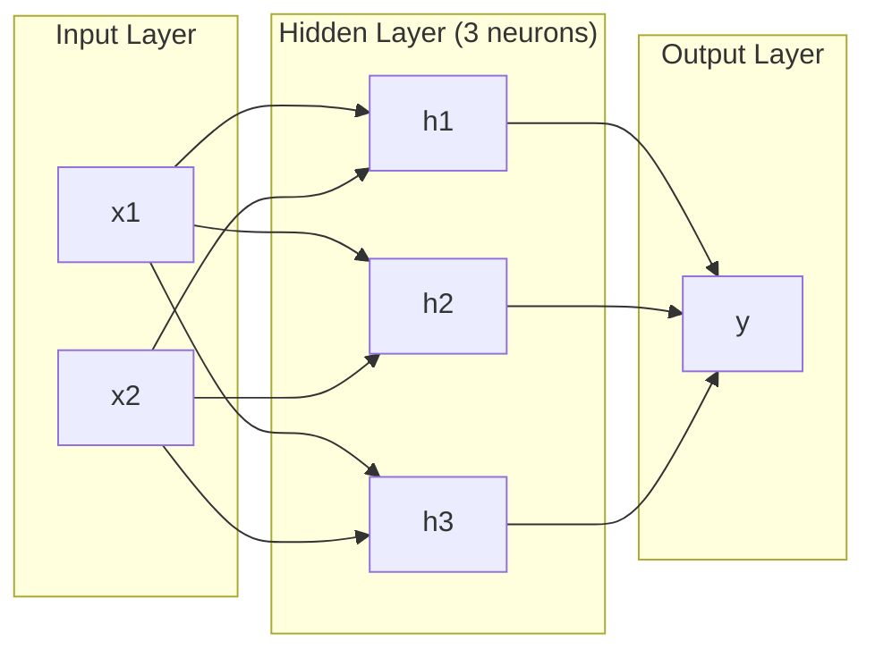
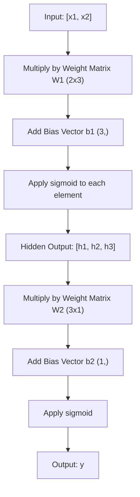
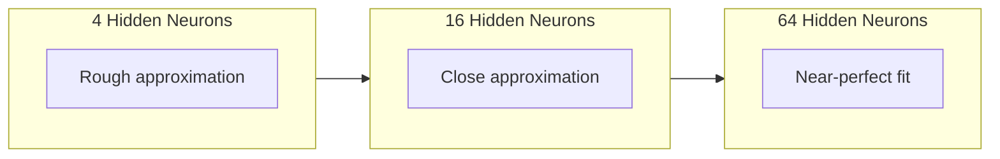

# Các mạng đa tầng và đường đi trước

> Một tế bào thần kinh vẽ một đường, xếp chúng lên, và bạn có thể vẽ bất cứ thứ gì.

**Type:** Build
**Languages:** Python
**Prerequisites:** Phase 01 (Math Foundations), Lesson 03.01 (The Perceptron)
**Time:** ~90 minutes

## Mục tiêu học tập

- Xây dựng một mạng đa tầng từ đầu với lớp Layer và Network thực hiện một thông qua tiến hoàn chỉnh
- Các kích thước của ma trận theo dõi qua mỗi lớp của một mạng và xác định sự không phù hợp hình dạng
- Giải thích cách xếp chồng các hoạt động không tuyến tính cho phép một mạng học ranh giới quyết định cong
- Giải quyết vấn đề XOR bằng cách sử dụng kiến trúc 2-2-1 với cân sigmoid được điều chỉnh bằng tay

## Vấn đề

Một tế bào thần kinh đơn lẻ là một ngăn kéo đường. Đó là tất cả. Một đường thẳng thông qua dữ liệu của bạn. Mọi vấn đề thực sự trong AI -- nhận dạng hình ảnh, hiểu ngôn ngữ, chơi Go -- đòi hỏi đường cong.

Năm 1969, Minsky và Papert chứng minh rằng sự hạn chế này là nguy hiểm: một mạng lưới một lớp không thể học XOR. Không phải "quan đấu để học" - toán học không thể. Bảng thực tế XOR đặt [0,1] và [1,0] ở một bên, [0,0] và [1,1] ở bên kia. Không có một đường duy nhất tách chúng ra.

Điều này đã làm mất nguồn tài trợ mạng thần kinh trong hơn một thập kỷ. Sự khắc phục rõ ràng trong quá khứ: ngừng sử dụng một lớp. Nạp các tế bào thần kinh thành các lớp. Hãy để lớp đầu tiên cắt lớp đầu vào các tính năng mới, và để lớp thứ hai kết hợp những tính năng đó thành những quyết định không có một dòng duy nhất có thể đưa ra.

Dòng đó là mạng đa tầng. Đó là nền tảng của mọi mô hình học sâu trong sản xuất ngày nay. Tiến trình tiến - dữ liệu chảy từ đầu vào qua các lớp ẩn đến đầu ra - là thứ đầu tiên bạn cần xây dựng trước khi bất cứ điều gì khác hoạt động.

## Khái niệm

### Các lớp: Nhập, ẩn, ra

Một mạng đa tầng có ba loại lớp:

**Input layer**-- không phải là một lớp. Nó chứa dữ liệu nguyên liệu của bạn. Hai tính năng có nghĩa là hai nút đầu vào. Không có tính toán xảy ra ở đây.

**Hidden layers**- nơi mà công việc diễn ra. Mỗi tế bào thần kinh lấy mọi đầu ra từ lớp trước, áp dụng trọng lượng và một sự thiên vị, sau đó chuyển kết quả qua một chức năng kích hoạt. "Bỏ" bởi vì bạn không bao giờ thấy các giá trị này trực tiếp trong dữ liệu đào tạo.

**Output layer**-- câu trả lời cuối cùng. Đối với phân loại nhị phân, một tế bào thần kinh với sigmoid. Đối với đa lớp, một tế bào thần kinh cho mỗi lớp.



Đây là một mạng lưới 2-3-1. hai đầu vào, ba tế bào thần kinh ẩn, một đầu ra. Mỗi kết nối mang trọng lượng. Mỗi tế bào thần kinh (trừ đầu vào) mang một sự thiên vị.

Mỗi lớp tạo ra một vector số được gọi là trạng thái ẩn. Đối với văn bản, trạng thái ẩn tăng chiều kích -- mã hóa một từ như 768 số để nắm bắt ý nghĩa ngữ nghĩa. Đối với hình ảnh, chúng giảm chiều kích -- nén hàng triệu pixel thành một biểu diễn có thể quản lý. trạng thái ẩn là nơi mà học tập sống.

### Các tế bào thần kinh và kích hoạt

Mỗi tế bào thần kinh làm ba điều:

1. Tăng vào mỗi đầu vào bằng trọng lượng tương ứng của nó
2. Kết hợp tất cả các sản phẩm và thêm một bias
3. Chuyển số tiền qua hàm kích hoạt

Cho đến nay, kích hoạt là sigmoid:

```
sigmoid(z) = 1 / (1 + e^(-z))
```

Sigmoid đúc bất kỳ số nào vào phạm vi (0, 1). Các đầu vào tích cực lớn đẩy về phía 1. Các đầu vào tiêu cực lớn đẩy về phía 0.

### Tiếp tục: Cách lưu thông dữ liệu

Việc đi trước đẩy dữ liệu nhập thông qua mạng, lớp cho lớp, cho đến khi nó đạt đến đầu ra. Không có học tập xảy ra trong quá trình đi trước. Đó là tính toán thuần túy: nhân, thêm, kích hoạt, lặp lại.



Ở mỗi lớp, ba hoạt động xảy ra theo trình tự:

```
z = W * input + b       (linear transformation)
a = sigmoid(z)           (activation)
```

Khả năng xuất phát từ một lớp trở thành đầu vào cho lớp tiếp theo. Đó là toàn bộ chuyển tiếp về phía trước.

### Các kích thước matrix

Các chiều kích theo dõi là kỹ năng sửa lỗi quan trọng nhất trong học sâu. Đây là mạng 2-3-1:

| Step | Operation | Dimensions | Result Shape |
|------|-----------|------------|-------------|
| Input | x | -- | (2,) |
| Hidden linear | W1 * x + b1 | W1: (3, 2), b1: (3,) | (3,) |
| Hidden activation | sigmoid(z1) | -- | (3,) |
| Output linear | W2 * h + b2 | W2: (1, 3), b2: (1,) | (1,) |
| Output activation | sigmoid(z2) | -- | (1,) |

Quy tắc: khối lượng tử liệu W ở lớp k có hình dạng (neurons_in_layer_k, neurons_in_layer_k_minus_1).

### Định lý thuyết tiếp cận phổ quát

Năm 1989, George Cybenko chứng minh một điều đáng chú ý: một mạng lưới thần kinh với một lớp ẩn duy nhất và đủ các tế bào thần kinh có thể gần gũi với bất kỳ chức năng liên tục nào với độ chính xác mong muốn.

Điều này không có nghĩa là một lớp ẩn luôn luôn tốt nhất. Nó có nghĩa là kiến trúc là lý thuyết khả năng. Trong thực tế, các mạng sâu hơn (nhiều lớp, ít tế bào thần kinh mỗi lớp) học các chức năng tương tự với số tham số tổng cộng ít hơn nhiều so với các mạng nông rộng. Đó là lý do tại sao việc học sâu hoạt động.

Nhận thức: mỗi tế bào thần kinh trong lớp ẩn học một "bump" hoặc tính năng. đủ các bump đặt ở đúng vị trí có thể gần gũi bất kỳ đường cong mịn nào.



### Sự hợp tác

Các mạng thần kinh có thể được tạo ra. Bạn có thể xếp chồng chúng, chuỗi chúng, chạy chúng song song. Một mô hình Whisper sử dụng một mạng mã hóa để xử lý âm thanh và một mạng mã hóa riêng để tạo văn bản. Các LLM hiện đại chỉ có thể làm mã hóa. BERT chỉ có thể làm mã hóa. T5 là mã hóa-tử lý.

```figure
mlp-forward
```

## Hãy xây dựng nó

Python tinh khiết, không có numpy, mọi matrix hoạt động được viết từ đầu.

### Bước 1: Tăng động Sigmoid

```python
import math

def sigmoid(x):
    x = max(-500.0, min(500.0, x))
    return 1.0 / (1.0 + math.exp(-x))
```

Cẹp đến [-500, 500] ngăn chặn quá tải. `math.exp(500)`là lớn nhưng hữu hạn. `math.exp(1000)`là vô hạn.

### Bước 2: lớp lớp

Hoạt động quan trọng nhất trong tất cả các học tập sâu là nhân số tử liệu. Mỗi lớp, mỗi đầu chú ý, mỗi bước đi về phía trước - nó là các matmuls tất cả các cách xuống. Một lớp tuyến tính lấy một vector đầu vào, nhân nó bằng một matrix trọng lượng, và thêm một vector thiên vị: y = Wx + b.

Một lớp chứa một khối lượng tử liệu và một vector thiên vị. phương pháp tiến của nó lấy một vector đầu vào và trả lại đầu ra hoạt động.

```python
class Layer:
    def __init__(self, n_inputs, n_neurons, weights=None, biases=None):
        if weights is not None:
            self.weights = weights
        else:
            import random
            self.weights = [
                [random.uniform(-1, 1) for _ in range(n_inputs)]
                for _ in range(n_neurons)
            ]
        if biases is not None:
            self.biases = biases
        else:
            self.biases = [0.0] * n_neurons

    def forward(self, inputs):
        self.last_input = inputs
        self.last_output = []
        for neuron_idx in range(len(self.weights)):
            z = sum(
                w * x for w, x in zip(self.weights[neuron_idx], inputs)
            )
            z += self.biases[neuron_idx]
            self.last_output.append(sigmoid(z))
        return self.last_output
```

Các khối lượng tử liệu có hình dạng (n_neurons, n_inputs). Mỗi hàng là trọng lượng của một tế bào thần kinh trên tất cả các đầu vào.

### Bước 3: Đội lớp mạng

Một mạng là một danh sách các lớp. Các đường đi trước liên kết chúng: đầu ra của lớp k cung cấp vào lớp k + 1.

```python
class Network:
    def __init__(self, layers):
        self.layers = layers

    def forward(self, inputs):
        current = inputs
        for layer in self.layers:
            current = layer.forward(current)
        return current
```

Đó là toàn bộ đường đi về phía trước. 4 đường logic. Dữ liệu đi vào, chảy qua mỗi lớp, ra ngoài bên kia.

### Bước 4: XOR với trọng lượng được chỉnh bằng tay

Trong bài học 01, chúng tôi giải quyết XOR bằng cách kết hợp OR, NAND và AND perceptrons. Bây giờ làm điều tương tự với lớp Layer và Network của chúng tôi. kiến trúc 2-2-1: hai đầu vào, hai tế bào thần kinh ẩn, một đầu ra.

```python
hidden = Layer(
    n_inputs=2,
    n_neurons=2,
    weights=[[20.0, 20.0], [-20.0, -20.0]],
    biases=[-10.0, 30.0],
)

output = Layer(
    n_inputs=2,
    n_neurons=1,
    weights=[[20.0, 20.0]],
    biases=[-30.0],
)

xor_net = Network([hidden, output])

xor_data = [
    ([0, 0], 0),
    ([0, 1], 1),
    ([1, 0], 1),
    ([1, 1], 0),
]

for inputs, expected in xor_data:
    result = xor_net.forward(inputs)
    predicted = 1 if result[0] >= 0.5 else 0
    print(f"  {inputs} -> {result[0]:.6f} (rounded: {predicted}, expected: {expected})")
```

Các trọng lượng lớn (20, -20) làm cho sigmoid hoạt động như một chức năng bước. Neuron ẩn đầu tiên gần OR. Neuron thứ hai gần NAND. Neuron đầu ra kết hợp chúng thành AND, đó là XOR.

### Bước 5: Định dạng vòng tròn

Một vấn đề khó hơn: phân loại các điểm 2D như bên trong hoặc bên ngoài một vòng tròn bán kính 0,5 tập trung vào nguồn gốc. Điều này đòi hỏi một ranh giới quyết định cong - không thể cho một perceptron duy nhất.

```python
import random
import math

random.seed(42)

data = []
for _ in range(200):
    x = random.uniform(-1, 1)
    y = random.uniform(-1, 1)
    label = 1 if (x * x + y * y) < 0.25 else 0
    data.append(([x, y], label))

circle_net = Network([
    Layer(n_inputs=2, n_neurons=8),
    Layer(n_inputs=8, n_neurons=1),
])
```

Với các trọng lượng ngẫu nhiên, mạng sẽ không phân loại tốt. Nhưng các thông qua phía trước vẫn chạy. Đây là điểm -- các thông qua phía trước chỉ là tính toán. Học các trọng lượng đúng là sự lây lan ngược, đến trong Bài học 03.

```python
correct = 0
for inputs, expected in data:
    result = circle_net.forward(inputs)
    predicted = 1 if result[0] >= 0.5 else 0
    if predicted == expected:
        correct += 1

print(f"Accuracy with random weights: {correct}/{len(data)} ({100*correct/len(data):.1f}%)")
```

Những trọng lượng ngẫu nhiên mang lại độ chính xác kém -- thường tệ hơn so với dự đoán của lớp đa số. Sau khi đào tạo (Dạy 03), kiến trúc này với 8 tế bào thần kinh ẩn sẽ vẽ một ranh giới cong tách bên trong khỏi bên ngoài.

## Sử dụng nó

PyTorch làm tất cả trên trong bốn dòng:

```python
import torch
import torch.nn as nn

model = nn.Sequential(
    nn.Linear(2, 8),
    nn.Sigmoid(),
    nn.Linear(8, 1),
    nn.Sigmoid(),
)

x = torch.tensor([[0.0, 0.0], [0.0, 1.0], [1.0, 0.0], [1.0, 1.0]])
output = model(x)
print(output)
```

`nn.Linear(2, 8)`là lớp lớp của bạn: khối lượng hình dạng (8, 2), vector bias hình dạng (8,). `nn.Sigmoid()`là hàm sigmoid của bạn được áp dụng theo các yếu tố. `nn.Sequential`là lớp mạng của bạn: các lớp chuỗi theo thứ tự.

Sự khác biệt là tốc độ và quy mô. PyTorch chạy trên GPU, xử lý hàng triệu mẫu, và tự động tính toán gradient để phát triển ngược. Nhưng logic chuyển tiếp về phía trước giống như những gì bạn vừa xây dựng từ đầu.

## Chuyển nó

Bài học này tạo ra một lời nhắc có thể được sử dụng nhiều lần để thiết kế kiến trúc mạng:

- `outputs/prompt-network-architect.md`

Sử dụng nó khi bạn cần quyết định bao nhiêu lớp, bao nhiêu tế bào thần kinh mỗi lớp, và các chức năng kích hoạt nào để sử dụng cho một vấn đề nhất định.

## Các bài tập

1. Xây dựng một mạng lưới 2-4-2-1 ( hai lớp ẩn) và chạy chuyển tiếp về phía trước trên dữ liệu XOR với trọng lượng ngẫu nhiên. Bác các đầu ra lớp ẩn trung gian để xem đại diện biến đổi như thế nào ở mỗi lớp.

2. Thay đổi kích thước lớp ẩn trong phân loại vòng tròn từ 8 lên 2, sau đó là 32. Bắt đầu đi trước với trọng lượng ngẫu nhiên mỗi lần. Số lượng tế bào thần kinh ẩn có thay đổi phạm vi đầu ra hoặc phân bố không? Tại sao?

3. Thực hiện một`count_parameters`Phương pháp trên lớp mạng trả lại tổng số trọng lượng và thiên vị có thể được đào tạo. kiểm tra nó trên một mạng 784-256-128-10 (kiến trúc MNIST cổ điển).

4. Xây dựng một thông qua về phía trước cho một mạng 3-4-4-2. cung cấp cho nó các giá trị màu RGB (được bình thường hóa thành 0-1) và quan sát hai đầu ra. Đây là kiến trúc cho một phân loại màu đơn giản với hai lớp.

5. Thay thế sigmoid bằng hàm "giải thoát bước": trả lại 0,01 * z nếu z < 0, nếu không 1.0. chạy chuyển tiếp về phía trước trên XOR với cùng trọng lượng điều chỉnh bằng tay từ bước 4.

## Các điều khoản chính

| Term | What people say | What it actually means |
|------|----------------|----------------------|
| Forward pass | "Running the model" | Pushing input through every layer -- multiply by weights, add bias, activate -- to produce an output |
| Hidden layer | "The middle part" | Any layer between input and output whose values are not directly observed in the data |
| Multi-layer network | "A deep neural network" | Layers of neurons stacked sequentially, where each layer's output feeds the next layer's input |
| Activation function | "The nonlinearity" | A function applied after the linear transformation that introduces curves into the decision boundary |
| Sigmoid | "The S-curve" | sigma(z) = 1/(1+e^(-z)), squashes any real number to (0,1), smooth and differentiable everywhere |
| Weight matrix | "The parameters" | A matrix W of shape (current_layer_neurons, previous_layer_neurons) containing learnable connection strengths |
| Bias vector | "The offset" | A vector added after the matrix multiply that lets neurons activate even when all inputs are zero |
| Universal approximation | "Neural nets can learn anything" | A single hidden layer with enough neurons can approximate any continuous function -- but "enough" can mean billions |
| Linear transformation | "The matrix multiply step" | z = W * x + b, the computation before activation, which maps inputs to a new space |
| Decision boundary | "Where the classifier switches" | The surface in input space where the network output crosses the classification threshold |

## Đọc thêm

- Michael Nielsen, "Nền mạng thần kinh và học tập sâu", Chương 1-2 (http://neuralnetworksanddeeplearning.com/) -- giải thích miễn phí rõ ràng nhất về các đường đi trước và cấu trúc mạng, với hình ảnh tương tác
- Cybenko, "Thiến gần bằng các siêu định của một hàm Sigmoidal" (1989) - bài báo định lý thuyết gần gũi phổ quát ban đầu, đáng ngạc nhiên có thể đọc được
- 3Blue1Brown, "Nhưng mạng thần kinh là gì?"https://www.youtube.com/watch?v=aircAruvnKk) -- 20 phút đi bộ trực quan qua các lớp, trọng lượng và đi trước tạo ra mô hình tâm lý đúng
- Goodfellow, Bengio, Courville, "Dân học sâu sắc", Chương 6 (https://www.deeplearningbook.org/) -- tiêu chuẩn tham chiếu cho các mạng đa tầng, miễn phí trực tuyến
