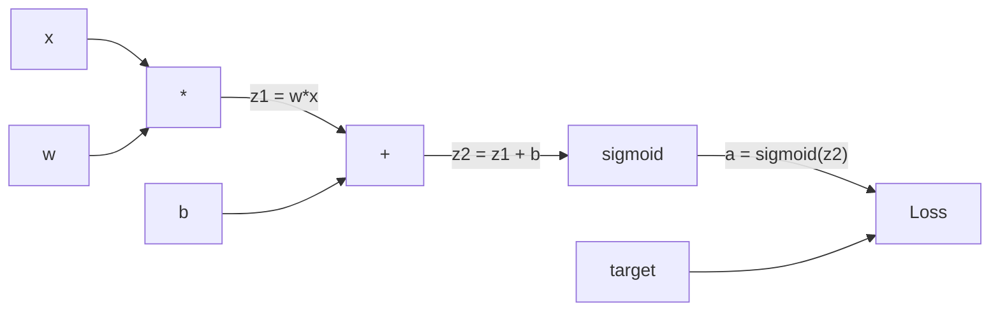
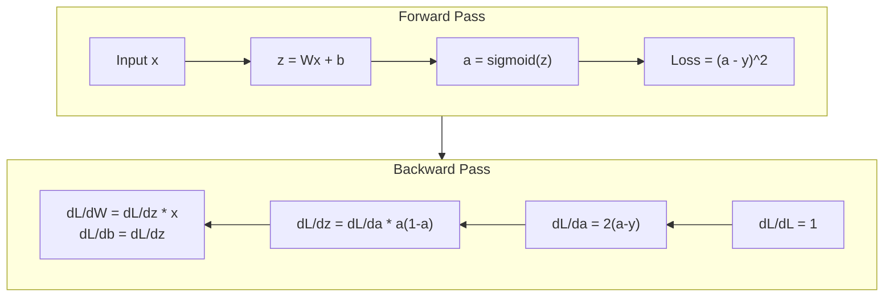
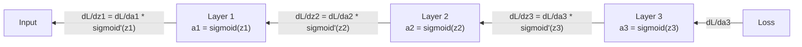

# Phân tích ngược từ Scratch

> Phân tích ngược là thuật toán giúp học tập có thể. Nếu không có nó, mạng thần kinh chỉ là các máy phát điện số ngẫu nhiên đắt tiền.

**Type:** Build
**Languages:** Python
**Prerequisites:** Lesson 03.02 (Multi-Layer Networks)
**Time:** ~120 minutes

## Mục tiêu học tập

- Thực hiện một động cơ tự phân cấp dựa trên giá trị xây dựng biểu đồ tính toán và tính toán gradient thông qua phân loại topological
- Thuộc dẫn đường ngược cho việc cộng, nhân và sigmoid bằng cách sử dụng quy tắc chuỗi
- Đào tạo một mạng đa tầng trên XOR và phân loại vòng tròn chỉ sử dụng động cơ phát triển ngược của bạn từ đầu
- Xác định vấn đề gradient biến mất trong các mạng sigmoid sâu và giải thích lý do tại sao gradient thu hẹp theo cách theo cấp

## Vấn đề

mạng của bạn có một lớp ẩn với 768 đầu vào và 3072 đầu ra. đó là 2.359.296 trọng lượng. nó đã đưa ra một dự đoán sai. trọng lượng nào gây ra sai lầm? kiểm tra từng trọng lượng một cách riêng biệt có nghĩa là 2.3 triệu lần đi về phía trước. Backpropagation tính toán tất cả 2.3 triệu gradient trong một lần đi ngược. đó không phải là một tối ưu hóa. đó là sự khác biệt giữa có thể đào tạo và không thể.

Cách tiếp cận ngây thơ: lấy một trọng lượng, đẩy nó một lượng nhỏ, chạy lại đi trước, đo lường liệu mất mát đã tăng hay giảm. Điều đó cho bạn gradient cho trọng lượng đó. Bây giờ làm điều đó cho mỗi trọng lượng trong mạng. Bội lên hàng ngàn bước đào tạo và hàng triệu điểm dữ liệu. Bạn sẽ cần thời gian địa chất để đào tạo bất cứ điều gì hữu ích.

Phân tích ngược giải quyết vấn đề này. Một bước đi về phía trước, một bước đi về phía sau, tất cả các gradient được tính toán. Tránh là quy tắc chuỗi từ toán học, được áp dụng một cách có hệ thống cho một biểu đồ tính toán. Đây là thuật toán làm cho việc học sâu trở nên thực tế. Nếu không có nó, chúng ta vẫn sẽ bị kẹt trong các vấn đề đồ chơi.

## Khái niệm

### Quy tắc chuỗi, áp dụng cho các mạng

Bạn đã thấy quy tắc chuỗi trong giai đoạn 01, Bài học 05. Kết luận nhanh: nếu y = f(g(x)), thì dy/dx = f'(g(x)) * g'(x. Bạn nhân các dẫn xuất dọc theo chuỗi.

Trong một mạng thần kinh, "thống chuỗi" là chuỗi các hoạt động từ đầu vào đến mất. Mỗi lớp áp dụng trọng lượng, thêm thiên vị, đi qua một hoạt động.

### Hình đồ tính toán

Mỗi bước đi về phía trước tạo ra một biểu đồ. Mỗi nút là một hoạt động (phùi, thêm, sigmoid). Mỗi cạnh mang một giá trị về phía trước và một gradient về phía sau.



Chuyển về phía trước: giá trị chảy từ trái sang phải. x và w tạo ra z1 = w*x. Thêm b để có z2. Sigmoid cho hoạt động a. So sánh a với mục tiêu y bằng hàm mất.

Trở về phía sau: gradient chảy từ bên phải sang bên trái. Bắt đầu bằng dL/da (như mất mát thay đổi với kích hoạt). nhân bằng da/dz2 (tái dẫn sigmoid). Điều đó cho dL/dz2. chia thành dL/db (tương đương dL/dz2, vì z2 = z1 + b) và dL/dz1.

Mỗi nút trong biểu đồ có một công việc trong quá trình đi ngược: lấy gradient từ trên, nhân bằng dẫn xuất địa phương của nó, và truyền xuống.

### Lên trước và ngược lại



Các thông qua phía trước lưu trữ tất cả các giá trị trung gian: z, a, các đầu vào cho mỗi lớp. Các thông qua phía sau cần những giá trị được lưu trữ này để tính toán gradient. Đây là sự giao dịch bộ nhớ-sử toán ở trung tâm của backprop. Bạn trao đổi bộ nhớ (tiếp kích lưu trữ) với tốc độ (một thông qua thay vì hàng triệu).

### Lối chảy dần qua mạng lưới

Đối với một mạng 3 tầng, chuỗi gradient qua mỗi tầng:



Ở mỗi lớp, gradient được nhân bằng dẫn xuất sigmoid. dẫn xuất sigmoid là * (1 - a), đạt mức tối đa 0,25 (khi a = 0,5). Ba lớp sâu, gradient được nhân bằng tối đa 0,25 ^ 3 = 0,0156.

### Các gradient biến mất

Đây là vấn đề gradient biến mất. Sigmoid đập vỡ đầu ra của nó giữa 0 và 1. dẫn xuất của nó luôn là ít hơn 0.25.

```
sigmoid(z):     Output range [0, 1]
sigmoid'(z):    Max value 0.25 (at z = 0)

After 5 layers:   gradient * 0.25^5 = 0.001x original
After 10 layers:  gradient * 0.25^10 = 0.000001x original
```

Đó là lý do tại sao các mạng sigmoid sâu gần như không thể đào tạo. Giải pháp - ReLU và các biến thể của nó - là chủ đề của bài học 04. Cho đến bây giờ, hãy hiểu rằng backprop hoạt động hoàn hảo. Vấn đề là nó đang làm việc qua.

### Thuộc dẫn các gradient cho một mạng lưới hai lớp

Khóa toán cụ thể cho một mạng với đầu vào x, lớp ẩn với sigmoid, lớp đầu ra với sigmoid và mất MSE.

Nhận tiền:
```
z1 = W1 * x + b1
a1 = sigmoid(z1)
z2 = W2 * a1 + b2
a2 = sigmoid(z2)
L = (a2 - y)^2
```

Chuyển ngược (nói quy tắc chuỗi từng bước):
```
dL/da2 = 2(a2 - y)
da2/dz2 = a2 * (1 - a2)
dL/dz2 = dL/da2 * da2/dz2 = 2(a2 - y) * a2 * (1 - a2)

dL/dW2 = dL/dz2 * a1
dL/db2 = dL/dz2

dL/da1 = dL/dz2 * W2
da1/dz1 = a1 * (1 - a1)
dL/dz1 = dL/da1 * da1/dz1

dL/dW1 = dL/dz1 * x
dL/db1 = dL/dz1
```

Mỗi gradient là sản phẩm của các phái sinh địa phương được theo dõi từ khi mất.

```figure
backprop-vanishing
```

## Hãy xây dựng nó

### Bước 1: nút giá trị

Mỗi số trong tính toán của chúng ta trở thành một giá trị. Nó lưu trữ dữ liệu của nó, độ nghiêng của nó, và cách nó được tạo ra (vì vậy nó biết cách tính toán độ nghiêng ngược).

```python
class Value:
    def __init__(self, data, children=(), op=''):
        self.data = data
        self.grad = 0.0
        self._backward = lambda: None
        self._children = set(children)
        self._op = op

    def __repr__(self):
        return f"Value(data={self.data:.4f}, grad={self.grad:.4f})"
```

Không có gradient (0.0) chưa có hàm ngược (không có op).`_children`theo dõi các giá trị đã tạo ra cái này, để chúng ta có thể sắp xếp topologically biểu đồ sau đó.

### Bước 2: Các hoạt động với các chức năng ngược

Mỗi hoạt động tạo ra một giá trị mới và xác định cách gradient chảy ngược qua nó.

```python
def __add__(self, other):
    other = other if isinstance(other, Value) else Value(other)
    out = Value(self.data + other.data, (self, other), '+')

    def _backward():
        self.grad += out.grad
        other.grad += out.grad

    out._backward = _backward
    return out

def __mul__(self, other):
    other = other if isinstance(other, Value) else Value(other)
    out = Value(self.data * other.data, (self, other), '*')

    def _backward():
        self.grad += other.data * out.grad
        other.grad += self.data * out.grad

    out._backward = _backward
    return out
```

Để thêm: d(a+b) /da = 1, d(a+b) /db = 1. Vì vậy cả hai đầu vào nhận được gradient đầu ra trực tiếp.

Đối với nhân: d(a*b) /da = b, d(a*b) /db = a. Mỗi đầu vào nhận được giá trị của người khác nhân gradient đầu ra.

- `+=`là quan trọng. Một giá trị có thể được sử dụng trong nhiều hoạt động. gradient của nó là tổng số gradient từ tất cả các con đường.

### Bước 3: Sigmoid và mất

```python
import math

def sigmoid(self):
    x = self.data
    x = max(-500, min(500, x))
    s = 1.0 / (1.0 + math.exp(-x))
    out = Value(s, (self,), 'sigmoid')

    def _backward():
        self.grad += (s * (1 - s)) * out.grad

    out._backward = _backward
    return out
```

Tiến hóa Sigmoid: sigmoid(x) * (1 - sigmoid(x)). Chúng tôi tính toán sigmoid(x) = s trong quá trình chuyển tiếp về phía trước. Sử dụng lại. Không có công việc bổ sung.

```python
def mse_loss(predicted, target):
    diff = predicted + Value(-target)
    return diff * diff
```

MSE cho một đầu ra duy nhất: (được dự đoán - mục tiêu) ^ 2. Chúng ta thể hiện trừ như là cộng với một giá trị bị phủ nhận.

### Bước 4: Đi ngược

Topological sort đảm bảo chúng ta xử lý các nút theo thứ tự đúng - gradient của một nút được tích lũy đầy đủ trước khi chúng ta lan truyền qua nó.

```python
def backward(self):
    topo = []
    visited = set()

    def build_topo(v):
        if v not in visited:
            visited.add(v)
            for child in v._children:
                build_topo(child)
            topo.append(v)

    build_topo(self)
    self.grad = 1.0
    for v in reversed(topo):
        v._backward()
```

Bắt đầu từ mất (đường độ = 1.0, vì dL / dL = 1). Đi ngược qua biểu đồ sắp xếp.`_backward`đẩy gradient lên con cái của nó.

### Bước 5: Lớp và mạng lưới

```python
import random

class Neuron:
    def __init__(self, n_inputs):
        scale = (2.0 / n_inputs) ** 0.5
        self.weights = [Value(random.uniform(-scale, scale)) for _ in range(n_inputs)]
        self.bias = Value(0.0)

    def __call__(self, x):
        act = sum((wi * xi for wi, xi in zip(self.weights, x)), self.bias)
        return act.sigmoid()

    def parameters(self):
        return self.weights + [self.bias]


class Layer:
    def __init__(self, n_inputs, n_outputs):
        self.neurons = [Neuron(n_inputs) for _ in range(n_outputs)]

    def __call__(self, x):
        out = [n(x) for n in self.neurons]
        return out[0] if len(out) == 1 else out

    def parameters(self):
        params = []
        for n in self.neurons:
            params.extend(n.parameters())
        return params


class Network:
    def __init__(self, sizes):
        self.layers = []
        for i in range(len(sizes) - 1):
            self.layers.append(Layer(sizes[i], sizes[i + 1]))

    def __call__(self, x):
        for layer in self.layers:
            x = layer(x)
            if not isinstance(x, list):
                x = [x]
        return x[0] if len(x) == 1 else x

    def parameters(self):
        params = []
        for layer in self.layers:
            params.extend(layer.parameters())
        return params

    def zero_grad(self):
        for p in self.parameters():
            p.grad = 0.0
```

Một Neuron lấy đầu vào, tính toán tổng số trọng lượng + thiên vị, và áp dụng sigmoid. Tỷ lệ khởi đầu trọng lượng bằng sqrt(2/n_input) để ngăn ngừa bão hòa sigmoid trong các mạng sâu hơn. Một Layer là một danh sách Neuron. Một Network là một danh sách các Layer.`parameters()`phương pháp thu thập tất cả các giá trị có thể học được để chúng ta có thể cập nhật chúng.

### Bước 6: Đào trên XOR

```python
random.seed(42)
net = Network([2, 4, 1])

xor_data = [
    ([0.0, 0.0], 0.0),
    ([0.0, 1.0], 1.0),
    ([1.0, 0.0], 1.0),
    ([1.0, 1.0], 0.0),
]

learning_rate = 1.0

for epoch in range(1000):
    total_loss = Value(0.0)
    for inputs, target in xor_data:
        x = [Value(i) for i in inputs]
        pred = net(x)
        loss = mse_loss(pred, target)
        total_loss = total_loss + loss

    net.zero_grad()
    total_loss.backward()

    for p in net.parameters():
        p.data -= learning_rate * p.grad

    if epoch % 100 == 0:
        print(f"Epoch {epoch:4d} | Loss: {total_loss.data:.6f}")

print("\nXOR Results:")
for inputs, target in xor_data:
    x = [Value(i) for i in inputs]
    pred = net(x)
    print(f"  {inputs} -> {pred.data:.4f} (expected {target})")
```

Xem mất mát giảm từ dự đoán ngẫu nhiên để sửa chữa XOR đầu ra, được thúc đẩy hoàn toàn bởi các gradient tính toán backpropagation và đẩy trọng lượng theo đúng hướng.

### Bước 7: Định dạng vòng tròn

Trong bài học 02, bạn đã chỉnh cân bằng tay để phân loại vòng tròn.

```python
random.seed(7)

def generate_circle_data(n=100):
    data = []
    for _ in range(n):
        x1 = random.uniform(-1.5, 1.5)
        x2 = random.uniform(-1.5, 1.5)
        label = 1.0 if x1 * x1 + x2 * x2 < 1.0 else 0.0
        data.append(([x1, x2], label))
    return data

circle_data = generate_circle_data(80)

circle_net = Network([2, 8, 1])
learning_rate = 0.5

for epoch in range(2000):
    random.shuffle(circle_data)
    total_loss_val = 0.0
    for inputs, target in circle_data:
        x = [Value(i) for i in inputs]
        pred = circle_net(x)
        loss = mse_loss(pred, target)
        circle_net.zero_grad()
        loss.backward()
        for p in circle_net.parameters():
            p.data -= learning_rate * p.grad
        total_loss_val += loss.data

    if epoch % 200 == 0:
        correct = 0
        for inputs, target in circle_data:
            x = [Value(i) for i in inputs]
            pred = circle_net(x)
            predicted_class = 1.0 if pred.data > 0.5 else 0.0
            if predicted_class == target:
                correct += 1
        accuracy = correct / len(circle_data) * 100
        print(f"Epoch {epoch:4d} | Loss: {total_loss_val:.4f} | Accuracy: {accuracy:.1f}%")
```

Chúng tôi sử dụng SGD trực tuyến ở đây - cập nhật trọng lượng sau mỗi mẫu thay vì tích lũy toàn bộ lô. Điều này phá vỡ đối xứng nhanh hơn và tránh bão hòa sigmoid trên cảnh quan mất mát đầy đủ. Trộn dữ liệu mỗi thời đại ngăn chặn mạng ghi nhớ thứ tự.

Không cần chỉnh sửa bằng tay. Mạng lưới tự phát hiện ra ranh giới quyết định vòng tròn. Đó là sức mạnh của sự lan rộng ngược: bạn xác định kiến trúc, hàm mất và dữ liệu. thuật toán tính toán trọng lượng.

## Sử dụng nó

PyTorch làm tất cả trên trong một vài dòng. Ý tưởng cốt lõi là giống nhau - autograd xây dựng một biểu đồ tính toán trong quá trình đi về phía trước và theo dõi nó trở lại để tính toán gradient.

```python
import torch
import torch.nn as nn

model = nn.Sequential(
    nn.Linear(2, 4),
    nn.Sigmoid(),
    nn.Linear(4, 1),
    nn.Sigmoid(),
)
optimizer = torch.optim.SGD(model.parameters(), lr=1.0)
criterion = nn.MSELoss()

X = torch.tensor([[0,0],[0,1],[1,0],[1,1]], dtype=torch.float32)
y = torch.tensor([[0],[1],[1],[0]], dtype=torch.float32)

for epoch in range(1000):
    pred = model(X)
    loss = criterion(pred, y)
    optimizer.zero_grad()
    loss.backward()
    optimizer.step()

print("PyTorch XOR Results:")
with torch.no_grad():
    for i in range(4):
        pred = model(X[i])
        print(f"  {X[i].tolist()} -> {pred.item():.4f} (expected {y[i].item()})")
```

`loss.backward()`là của bạn `total_loss.backward()`- `optimizer.step()`là hướng dẫn của bạn `p.data -= lr * p.grad`- `optimizer.zero_grad()`là của bạn `net.zero_grad()`. Khóa học tương tự, thực hiện sức mạnh công nghiệp. PyTorch xử lý tốc độ GPU, độ chính xác hỗn hợp, kiểm tra độ dốc, và hàng trăm loại lớp. Nhưng việc vượt qua ngược là cùng một quy tắc chuỗi áp dụng cho cùng một biểu đồ tính toán.

Trình luyện chạy đi trước, rồi đi ngược, rồi cập nhật trọng lượng. Inference chỉ chạy qua phía trước. Không có gradient, không có cập nhật. Sự phân biệt này quan trọng bởi vì suy luận là những gì xảy ra trong sản xuất. Khi bạn gọi cho một API như Claude hoặc GPT, bạn đang đưa ra suy luận -- lời nhắc của bạn chảy về phía trước qua mạng, và token ra ngoài ở đầu kia. Không thay đổi trọng lượng. Nhận thức về backprop là quan trọng bởi vì nó hình thành mọi trọng lượng trong mạng đó.

## Chuyển nó

Bài học này mang lại:
- `outputs/prompt-gradient-debugger.md`-- một lời nhắc tái sử dụng để chẩn đoán các vấn đề gradient (sự biến mất, nổ, NaN) trong bất kỳ mạng thần kinh nào

## Các bài tập

1. Thêm một `__sub__`phương pháp để lớp giá trị (a - b = a + (-1 * b)). Sau đó thực hiện a `__neg__`Phương pháp kiểm tra rằng các gradient là chính xác bằng cách so sánh với tính toán thủ công cho một biểu thức đơn giản như (a - b) ^ 2.

2. Thêm một `relu`phương pháp để Value (output max ((0, x), dẫn xuất là 1 nếu x > 0, thì 0). Thay thế sigmoid bằng relu trong các lớp ẩn và tập trên XOR một lần nữa. So sánh tốc độ hội tụ. Bạn nên xem đào tạo nhanh hơn - đây là xem trước Bài học 04.

3. Thực hiện một`__pow__`Phương pháp về giá trị cho các quyền số nguyên. Sử dụng nó để thay thế `mse_loss`với một đúng `(predicted - target) ** 2`biểu hiện. kiểm tra gradient phù hợp với thực hiện ban đầu.

4. Thêm cắt gradient vào vòng đào tạo: sau khi gọi `backward()`, cắt tất cả các gradient đến [-1, 1]. Tập một mạng lưới sâu hơn (4+ lớp với sigmoid) và so sánh đường cong mất mát với và không cắt. Đây là phòng thủ đầu tiên của bạn chống lại gradient nổ.

5. XOR: Sau khi đào tạo trên XOR, in gradient của mỗi tham số trong mạng. Xác định lớp nào có gradient nhỏ nhất. Điều này cho thấy vấn đề gradient biến mất bạn đọc về trong phần Concept.

## Các điều khoản chính

| Term | What people say | What it actually means |
|------|----------------|----------------------|
| Backpropagation | "The network learns" | An algorithm that computes dL/dw for every weight by applying the chain rule backward through the computational graph |
| Computational graph | "The network structure" | A directed acyclic graph where nodes are operations and edges carry values (forward) and gradients (backward) |
| Chain rule | "Multiply the derivatives" | If y = f(g(x)), then dy/dx = f'(g(x)) * g'(x) -- the mathematical foundation of backpropagation |
| Gradient | "The direction of steepest ascent" | The partial derivative of the loss with respect to a parameter -- tells you how to change that parameter to reduce the loss |
| Vanishing gradient | "Deep networks don't learn" | Gradients shrink exponentially as they propagate through layers with saturating activations like sigmoid |
| Forward pass | "Running the network" | Computing the output from inputs by sequentially applying each layer's operations and storing intermediate values |
| Backward pass | "Computing gradients" | Traversing the computational graph in reverse, accumulating gradients at each node using the chain rule |
| Learning rate | "How fast it learns" | A scalar that controls the step size when updating weights: w_new = w_old - lr * gradient |
| Topological sort | "The right order" | An ordering of graph nodes where each node appears after all nodes it depends on -- ensures gradients are fully accumulated before propagation |
| Autograd | "Automatic differentiation" | A system that builds computational graphs during forward computation and automatically computes gradients -- what PyTorch's engine does |

## Đọc thêm

- Rumelhart, Hinton & Williams, "Giáo trình học đại diện bằng lỗi truyền ngược" (1986) - bài báo đã làm cho truyền ngược trở lại và đào tạo mạng đa tầng mở
- 3Blue1Brown, loạt "Nền mạng thần kinh" (https://www.youtube.com/playlist?list=PLZHQObOWTQDNU6R1_67000Dx_ZCJB-3pi) -- giải thích trực quan tốt nhất về sự lây lan trở lại và dòng chảy gradient qua các mạng
