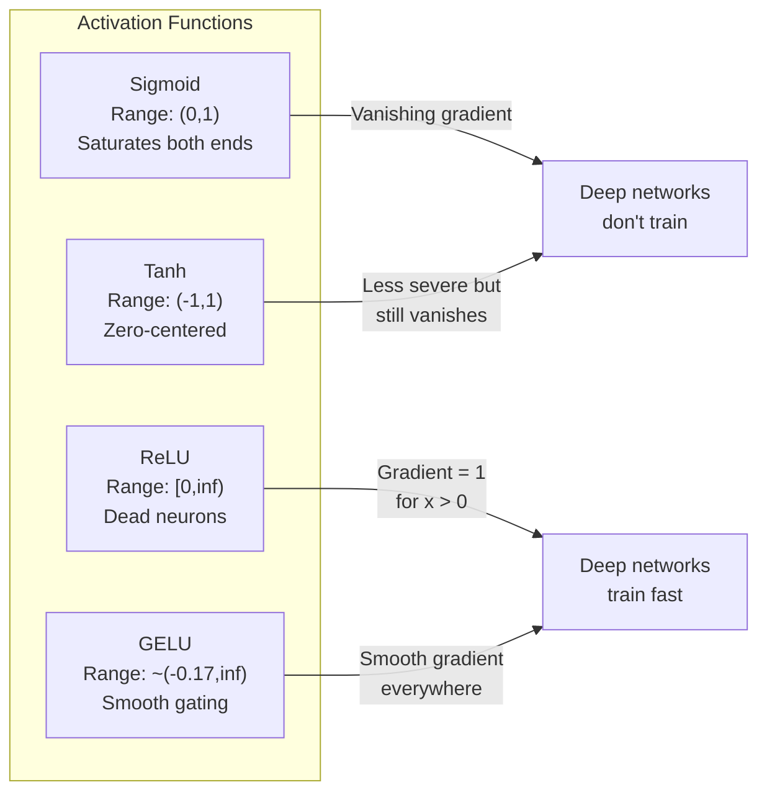
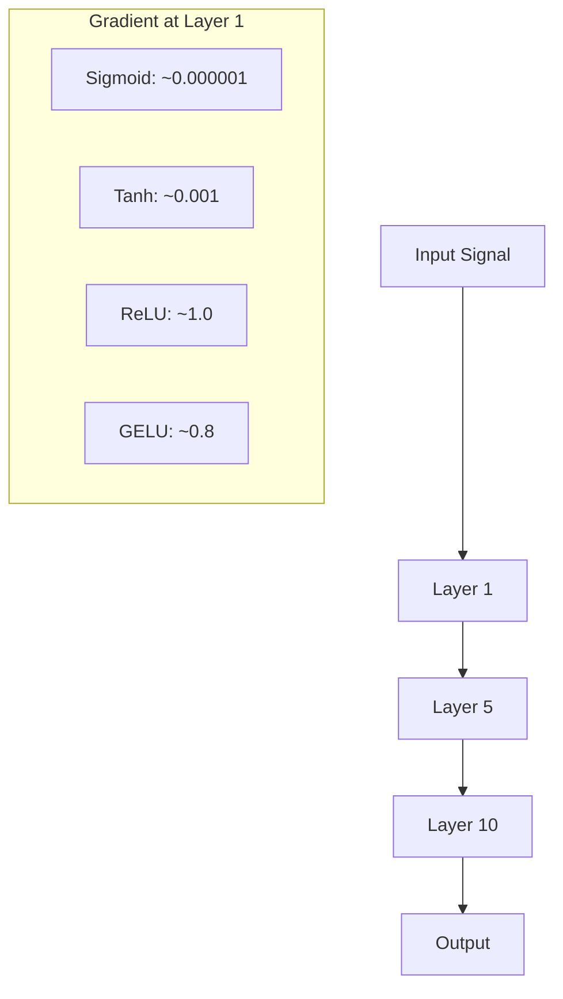
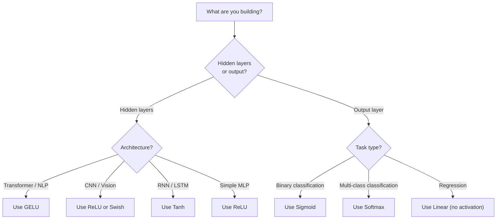

# Các chức năng kích hoạt

> Nếu không có tính không tuyến tính, mạng 100 tầng của bạn là một số lượng tử hình cao cấp.

**Type:** Build
**Languages:** Python
**Prerequisites:** Lesson 03.03 (Backpropagation)
**Time:** ~75 minutes

## Mục tiêu học tập

- Thực hiện sigmoid, tanh, ReLU, Leaky ReLU, GELU, Swish, và softmax với các phái sinh của chúng từ đầu
- Chẩn đoán vấn đề biến mất gradient bằng cách đo cường độ kích hoạt thông qua 10+ lớp với kích hoạt khác nhau
- Khám phá các tế bào thần kinh chết trong mạng ReLU và giải thích tại sao GELU tránh chế độ thất bại này
- Chọn chức năng kích hoạt chính xác cho một kiến trúc nhất định (transformer, CNN, RNN, lớp đầu ra)

## Vấn đề

Lắp 2 chuyển đổi tuyến tính: y = W2 ((W1x + b1) + b2. mở rộng nó: y = W2W1x + W2b1 + b2. Đó chỉ là y = Ax + c - một chuyển đổi tuyến tính đơn lẻ. Bất kể bạn xếp hàng bao nhiêu lớp tuyến tính, kết quả sẽ sụp đổ thành một số tử liệu nhân. Mạng 100 lớp của bạn có sức mạnh đại diện giống như một lớp đơn.

Đây không phải là một sự tò mò lý thuyết. Nó có nghĩa là một mạng lưới tuyến tính sâu không thể học XOR, không thể phân loại một tập dữ liệu xoắn ốc, không thể nhận ra một khuôn mặt.

Các chức năng kích hoạt phá vỡ tính tuyến tính. Chúng biến dạng đầu ra của mỗi lớp thông qua một chức năng không tuyến tính, cho phép mạng lưới khui ranh giới quyết định, gần gũi các chức năng tùy tiện và thực sự học hỏi. Nhưng chọn hoạt động sai và gradient của bạn biến mất đến không (sigmoid trong mạng sâu), nổ đến vô hạn (tiếp kích không giới hạn mà không cần khởi tạo cẩn thận), hoặc các tế bào thần kinh của bạn chết vĩnh viễn (ReLU với thiên vị tiêu cực lớn). Việc chọn chức năng kích hoạt trực tiếp xác định xem mạng của bạn có học được hay không.

## Khái niệm

### Tại sao không tuyến tính là cần thiết

Tỷ lệ nhân tử liệu là hợp thể. Tỷ lệ nhân một vector bằng số tử liệu A sau đó là số tử liệu B giống nhau với số nhân bằng AB. Điều này có nghĩa là xếp hàng mười lớp tuyến tính bằng một lớp tuyến tính với một số tử liệu lớn. Tất cả các tham số đó, tất cả chiều sâu đó - lãng phí. Bạn cần một cái gì đó để phá vỡ chuỗi. Đó là những gì các chức năng kích hoạt làm.

Đây là bằng chứng. Một lớp tuyến tính tính toán f ((x) = Wx + b. Dòng hai:

```
Layer 1: h = W1 * x + b1
Layer 2: y = W2 * h + b2
```

Thay thế:

```
y = W2 * (W1 * x + b1) + b2
y = (W2 * W1) * x + (W2 * b1 + b2)
y = A * x + c
```

Một lớp. Nhập một kích hoạt không tuyến tính g() giữa các lớp:

```
h = g(W1 * x + b1)
y = W2 * h + b2
```

Bây giờ thay thế bị phá vỡ. W2 * g(W1 * x + b1) + b2 không thể được giảm xuống thành một chuyển đổi tuyến tính duy nhất. Mạng có thể đại diện cho các chức năng phi tuyến tính. Mỗi lớp bổ sung với một kích hoạt thêm dung lượng đại diện.

### Sigmoid

chức năng kích hoạt ban đầu cho mạng thần kinh.

```
sigmoid(x) = 1 / (1 + e^(-x))
```

Phạm vi sản xuất: (0, 1). Dẻo, phân biệt, lập bản đồ bất kỳ số thực nào với giá trị tương tự như xác suất.

Các dẫn xuất:

```
sigmoid'(x) = sigmoid(x) * (1 - sigmoid(x))
```

Giá trị tối đa của phái sinh này là 0,25, xảy ra ở x = 0. Trong sự lan rộng ngược, gradient nhân qua các lớp.

```
0.25^10 = 0.000000953674
```

Chỉ dưới một triệu phần trăm của tín hiệu ban đầu. Đây là vấn đề biến mất của gradient. Các gradient ở các lớp ban đầu trở nên nhỏ đến nỗi trọng lượng hầu như không cập nhật. Mạng dường như học hỏi - mất mát giảm ở các lớp sau đó - nhưng các lớp đầu tiên bị đóng băng. Mạng sigmoid sâu đơn giản là không tập luyện.

Vấn đề bổ sung: các đầu ra sigmoid luôn tích cực (0 đến 1), có nghĩa là gradient trên trọng lượng luôn luôn là cùng một dấu hiệu.

### Tanh

Phiên bản trung tâm của sigmoid.

```
tanh(x) = (e^x - e^(-x)) / (e^x + e^(-x))
```

Phạm vi sản xuất: (-1, 1). Trung tâm không, loại bỏ vấn đề zig-zag.

Các dẫn xuất:

```
tanh'(x) = 1 - tanh(x)^2
```

Tiến dẫn tối đa là 1.0 ở x = 0 - tốt hơn bốn lần so với sigmoid. Nhưng vấn đề gradient biến mất vẫn tồn tại. Đối với đầu vào tích cực hoặc tiêu cực lớn, dẫn dẫn gần bằng không. Mười lớp vẫn đập nghiền gradient, ít hơn một cách hung hăng.

### ReLU: Sự đột phá

Định hướng đơn vị tuyến tính được phổ biến cho việc học sâu bởi Nair và Hinton vào năm 2010 (các chức năng tự nó có từ công việc năm 1969 của Fukushima), nó đã thay đổi mọi thứ.

```
relu(x) = max(0, x)
```

Phạm vi đầu ra: [0, vô hạn).

```
relu'(x) = 1  if x > 0
            0  if x <= 0
```

Không có gradient biến mất cho các đầu vào tích cực. gradient chính xác là 1, đi thẳng qua. Đó là lý do tại sao các mạng sâu trở nên có thể đào tạo - ReLU giữ lại độ lớn gradient trên các lớp.

Nhưng có một chế độ thất bại: vấn đề của các tế bào thần kinh chết. Nếu đầu vào trọng lượng của một tế bào thần kinh luôn luôn âm tính (do sự thiên vị tiêu cực lớn hoặc khởi đầu trọng lượng không may), đầu ra của nó luôn luôn là không, độ nghiêng của nó luôn luôn là không, và nó không bao giờ cập nhật. Nó vĩnh viễn chết. Trong thực tế, 10-40% các tế bào thần kinh trong một mạng ReLU có thể chết trong quá trình đào tạo.

### ReLU bị rò rỉ

Cách đơn giản nhất để chữa trị cho các tế bào thần kinh chết.

```
leaky_relu(x) = x        if x > 0
                alpha * x if x <= 0
```

Ở đó alpha là một liên tục nhỏ, thường là 0.01. Mặt tiêu cực có một độ nghiêng nhỏ thay vì không, vì vậy các tế bào thần kinh chết vẫn nhận được tín hiệu gradient và có thể phục hồi.

### GELU: Sự cố hiện đại

Gaussian Error Linear Unit. Được giới thiệu bởi Hendrycks và Gimpel vào năm 2016.

```
gelu(x) = x * Phi(x)
```

Phi ((x) là hàm phân phối tích lũy của phân bố bình thường tiêu chuẩn.

```
gelu(x) ~= 0.5 * x * (1 + tanh(sqrt(2/pi) * (x + 0.044715 * x^3)))
```

GELU là mượt mà ở mọi nơi, cho phép các giá trị tiêu cực nhỏ (không giống như ReLU mà cắt cứng đến không), và có một cách giải thích xác suất: nó cân nhắc mỗi đầu vào bằng cách xác định khả năng nó tích cực dưới phân bố Gaussian.

### Swish / SiLU

Tự kích hoạt được phát hiện bởi Ramachandran et al. vào năm 2017 thông qua tìm kiếm tự động.

```
swish(x) = x * sigmoid(x)
```

Swish chính thức là x * sigmoid ((x). Google phát hiện ra nó thông qua tìm kiếm tự động trên không gian chức năng kích hoạt -- một mạng thần kinh thiết kế các phần của mạng thần kinh.

Giống như GELU, nó mịn, không đơn điệu và cho phép các giá trị tiêu cực nhỏ. Sự khác biệt là tinh tế: Swish sử dụng sigmoid để cổng trong khi GELU sử dụng Gaussian CDF. Trong thực tế, hiệu suất gần giống nhau. Swish được sử dụng trong EfficientNet và một số mô hình thị giác. GELU thống trị trong mô hình ngôn ngữ.

### Softmax: Tích hoạt đầu ra

Không được sử dụng trong các lớp ẩn. Softmax chuyển đổi một vector của điểm số thô (logits) thành phân bố xác suất.

```
softmax(x_i) = e^(x_i) / sum(e^(x_j) for all j)
```

Mỗi đầu ra là từ 0 đến 1. Tất cả các đầu ra tổng cộng đến 1. Điều này làm cho nó trở thành kích hoạt cuối cùng tiêu chuẩn cho phân loại đa lớp. Logit lớn nhất có xác suất cao nhất, nhưng không giống như argmax, softmax có thể phân biệt và bảo tồn thông tin về sự tin cậy tương đối.

### So sánh hình dạng



### So sánh dòng chảy dần



### Khi nào hoạt động



```figure
softmax-temperature
```

## Hãy xây dựng nó

### Bước 1: Thực hiện tất cả các chức năng kích hoạt với các phái sinh

Mỗi hàm lấy một float và trả lại một float. Mỗi hàm phái sinh lấy đầu vào tương tự và trả lại gradient.

```python
import math

def sigmoid(x):
    x = max(-500, min(500, x))
    return 1.0 / (1.0 + math.exp(-x))

def sigmoid_derivative(x):
    s = sigmoid(x)
    return s * (1 - s)

def tanh_act(x):
    return math.tanh(x)

def tanh_derivative(x):
    t = math.tanh(x)
    return 1 - t * t

def relu(x):
    return max(0.0, x)

def relu_derivative(x):
    return 1.0 if x > 0 else 0.0

def leaky_relu(x, alpha=0.01):
    return x if x > 0 else alpha * x

def leaky_relu_derivative(x, alpha=0.01):
    return 1.0 if x > 0 else alpha

def gelu(x):
    return 0.5 * x * (1 + math.tanh(math.sqrt(2 / math.pi) * (x + 0.044715 * x ** 3)))

def gelu_derivative(x):
    phi = 0.5 * (1 + math.erf(x / math.sqrt(2)))
    pdf = math.exp(-0.5 * x * x) / math.sqrt(2 * math.pi)
    return phi + x * pdf

def swish(x):
    return x * sigmoid(x)

def swish_derivative(x):
    s = sigmoid(x)
    return s + x * s * (1 - s)

def softmax(xs):
    max_x = max(xs)
    exps = [math.exp(x - max_x) for x in xs]
    total = sum(exps)
    return [e / total for e in exps]
```

### Bước 2: Hãy tưởng tượng nơi các gradient chết

Xét gradient ở 100 điểm có khoảng cách ngang từ -5 đến 5. Bác một histogram văn bản cho thấy gradient của mỗi hoạt động gần bằng không.

```python
def gradient_scan(name, derivative_fn, start=-5, end=5, n=100):
    step = (end - start) / n
    near_zero = 0
    healthy = 0
    for i in range(n):
        x = start + i * step
        g = derivative_fn(x)
        if abs(g) < 0.01:
            near_zero += 1
        else:
            healthy += 1
    pct_dead = near_zero / n * 100
    print(f"{name:15s}: {healthy:3d} healthy, {near_zero:3d} near-zero ({pct_dead:.0f}% dead zone)")

gradient_scan("Sigmoid", sigmoid_derivative)
gradient_scan("Tanh", tanh_derivative)
gradient_scan("ReLU", relu_derivative)
gradient_scan("Leaky ReLU", leaky_relu_derivative)
gradient_scan("GELU", gelu_derivative)
gradient_scan("Swish", swish_derivative)
```

### Bước 3: Phương pháp biến mất

Chuyển tín hiệu về phía trước qua N lớp sử dụng sigmoid vs ReLU. đo lường cách kích hoạt lớn thay đổi.

```python
import random

def vanishing_gradient_experiment(activation_fn, name, n_layers=10, n_inputs=5):
    random.seed(42)
    values = [random.gauss(0, 1) for _ in range(n_inputs)]

    print(f"\n{name} through {n_layers} layers:")
    for layer in range(n_layers):
        weights = [random.gauss(0, 1) for _ in range(n_inputs)]
        z = sum(w * v for w, v in zip(weights, values))
        activated = activation_fn(z)
        magnitude = abs(activated)
        bar = "#" * int(magnitude * 20)
        print(f"  Layer {layer+1:2d}: magnitude = {magnitude:.6f} {bar}")
        values = [activated] * n_inputs

vanishing_gradient_experiment(sigmoid, "Sigmoid")
vanishing_gradient_experiment(relu, "ReLU")
vanishing_gradient_experiment(gelu, "GELU")
```

### Bước 4: Tận dạng Neuron chết

Tạo một mạng ReLU, truyền thông vào ngẫu nhiên qua nó, đếm bao nhiêu tế bào thần kinh không bao giờ phát nổ.

```python
def dead_neuron_detector(n_inputs=5, hidden_size=20, n_samples=1000):
    random.seed(0)
    weights = [[random.gauss(0, 1) for _ in range(n_inputs)] for _ in range(hidden_size)]
    biases = [random.gauss(0, 1) for _ in range(hidden_size)]

    fire_counts = [0] * hidden_size

    for _ in range(n_samples):
        inputs = [random.gauss(0, 1) for _ in range(n_inputs)]
        for neuron_idx in range(hidden_size):
            z = sum(w * x for w, x in zip(weights[neuron_idx], inputs)) + biases[neuron_idx]
            if relu(z) > 0:
                fire_counts[neuron_idx] += 1

    dead = sum(1 for c in fire_counts if c == 0)
    rarely_fire = sum(1 for c in fire_counts if 0 < c < n_samples * 0.05)
    healthy = hidden_size - dead - rarely_fire

    print(f"\nDead Neuron Report ({hidden_size} neurons, {n_samples} samples):")
    print(f"  Dead (never fired):     {dead}")
    print(f"  Barely alive (<5%):     {rarely_fire}")
    print(f"  Healthy:                {healthy}")
    print(f"  Dead neuron rate:       {dead/hidden_size*100:.1f}%")

    for i, c in enumerate(fire_counts):
        status = "DEAD" if c == 0 else "WEAK" if c < n_samples * 0.05 else "OK"
        bar = "#" * (c * 40 // n_samples)
        print(f"  Neuron {i:2d}: {c:4d}/{n_samples} fires [{status:4s}] {bar}")

dead_neuron_detector()
```

### Bước 5: So sánh đào tạo - Sigmoid vs ReLU vs GELU

Đào tạo cùng một mạng hai lớp trên bộ dữ liệu vòng tròn (điểm bên trong vòng tròn = lớp 1, bên ngoài = lớp 0) với ba kích hoạt khác nhau. So sánh tốc độ hội tụ.

```python
def make_circle_data(n=200, seed=42):
    random.seed(seed)
    data = []
    for _ in range(n):
        x = random.uniform(-2, 2)
        y = random.uniform(-2, 2)
        label = 1.0 if x * x + y * y < 1.5 else 0.0
        data.append(([x, y], label))
    return data


class ActivationNetwork:
    def __init__(self, activation_fn, activation_deriv, hidden_size=8, lr=0.1):
        random.seed(0)
        self.act = activation_fn
        self.act_d = activation_deriv
        self.lr = lr
        self.hidden_size = hidden_size

        self.w1 = [[random.gauss(0, 0.5) for _ in range(2)] for _ in range(hidden_size)]
        self.b1 = [0.0] * hidden_size
        self.w2 = [random.gauss(0, 0.5) for _ in range(hidden_size)]
        self.b2 = 0.0

    def forward(self, x):
        self.x = x
        self.z1 = []
        self.h = []
        for i in range(self.hidden_size):
            z = self.w1[i][0] * x[0] + self.w1[i][1] * x[1] + self.b1[i]
            self.z1.append(z)
            self.h.append(self.act(z))

        self.z2 = sum(self.w2[i] * self.h[i] for i in range(self.hidden_size)) + self.b2
        self.out = sigmoid(self.z2)
        return self.out

    def backward(self, target):
        error = self.out - target
        d_out = error * self.out * (1 - self.out)

        for i in range(self.hidden_size):
            d_h = d_out * self.w2[i] * self.act_d(self.z1[i])
            self.w2[i] -= self.lr * d_out * self.h[i]
            for j in range(2):
                self.w1[i][j] -= self.lr * d_h * self.x[j]
            self.b1[i] -= self.lr * d_h
        self.b2 -= self.lr * d_out

    def train(self, data, epochs=200):
        losses = []
        for epoch in range(epochs):
            total_loss = 0
            correct = 0
            for x, y in data:
                pred = self.forward(x)
                self.backward(y)
                total_loss += (pred - y) ** 2
                if (pred >= 0.5) == (y >= 0.5):
                    correct += 1
            avg_loss = total_loss / len(data)
            accuracy = correct / len(data) * 100
            losses.append(avg_loss)
            if epoch % 50 == 0 or epoch == epochs - 1:
                print(f"    Epoch {epoch:3d}: loss={avg_loss:.4f}, accuracy={accuracy:.1f}%")
        return losses


data = make_circle_data()

configs = [
    ("Sigmoid", sigmoid, sigmoid_derivative),
    ("ReLU", relu, relu_derivative),
    ("GELU", gelu, gelu_derivative),
]

results = {}
for name, act_fn, act_d_fn in configs:
    print(f"\n=== Training with {name} ===")
    net = ActivationNetwork(act_fn, act_d_fn, hidden_size=8, lr=0.1)
    losses = net.train(data, epochs=200)
    results[name] = losses

print("\n=== Final Loss Comparison ===")
for name, losses in results.items():
    print(f"  {name:10s}: start={losses[0]:.4f} -> end={losses[-1]:.4f} (improvement: {(1 - losses[-1]/losses[0])*100:.1f}%)")
```

## Sử dụng nó

PyTorch cung cấp tất cả các loại này dưới dạng cả các dạng chức năng và mô-đun:

```python
import torch
import torch.nn as nn
import torch.nn.functional as F

x = torch.randn(4, 10)

relu_out = F.relu(x)
gelu_out = F.gelu(x)
sigmoid_out = torch.sigmoid(x)
swish_out = F.silu(x)

logits = torch.randn(4, 5)
probs = F.softmax(logits, dim=1)

model = nn.Sequential(
    nn.Linear(10, 64),
    nn.GELU(),
    nn.Linear(64, 32),
    nn.GELU(),
    nn.Linear(32, 5),
)
```

Lớp ẩn trong một biến thể: GELU. Lớp ẩn trong một CNN: ReLU. Lớp sản xuất để phân loại: softmax. Lớp sản xuất để hồi quy: không có (đường tuyến). Lớp sản xuất cho xác suất: sigmoid. Đó là nó. Bắt đầu với các mặc định này. Chỉ thay đổi chúng khi bạn có bằng chứng.

RNN và LSTM sử dụng tanh cho trạng thái ẩn và sigmoid cho cổng, nhưng nếu bạn đang xây dựng từ đầu ngày nay, bạn có thể không sử dụng RNN. Nếu các tế bào thần kinh đang chết trong mạng ReLU của bạn, hãy chuyển sang GELU. Đừng tìm ra Leaky ReLU trừ khi bạn có một lý do cụ thể - GELU giải quyết vấn đề của các tế bào thần kinh chết và cung cấp dòng chảy gradient tốt hơn.

## Chuyển nó

Bài học này mang lại:
- `outputs/prompt-activation-selector.md`-- một lời nhắc tái sử dụng giúp bạn chọn đúng chức năng kích hoạt cho bất kỳ kiến trúc

## Các bài tập

1. Thực hiện Parametric ReLU (PReLU) nơi độ nghiêng âm alpha là một tham số có thể học được. Đọc nó trên bộ dữ liệu vòng tròn và so sánh với cố định Leaky ReLU.

2. Thực hiện thí nghiệm gradient biến mất với 50 lớp thay vì 10. Chụp quy mô tại mỗi lớp cho sigmoid, tanh, ReLU và GELU. Ở lớp nào tín hiệu của mỗi kích hoạt hiệu quả đạt đến không?

3. Thực hiện ELU (Exponential Linear Unit): elu(x) = x nếu x > 0, alpha * (e^x - 1) nếu x <= 0. So sánh tốc độ của các tế bào thần kinh chết với ReLU trên cùng một mạng.

4. Xây dựng một "chân sát sức khỏe gradient" chạy trong thời gian đào tạo: tại mỗi thời kỳ, tính toán độ lớn gradient trung bình ở mỗi lớp. In một cảnh báo khi gradient của bất kỳ lớp nào giảm xuống dưới 0,001 hoặc vượt quá 100.

5. Thay đổi so sánh đào tạo để sử dụng tập dữ liệu XOR từ Bài học 01 thay vì vòng tròn.

## Các điều khoản chính

| Term | What people say | What it actually means |
|------|----------------|----------------------|
| Activation function | "The nonlinear part" | A function applied to each neuron's output that breaks linearity, enabling the network to learn nonlinear mappings |
| Vanishing gradient | "Gradients disappear in deep networks" | Gradients shrink exponentially through layers when the activation's derivative is less than 1, making early layers untrainable |
| Exploding gradient | "Gradients blow up" | Gradients grow exponentially through layers when the effective multiplier exceeds 1, causing unstable training |
| Dead neuron | "A neuron that stopped learning" | A ReLU neuron whose input is permanently negative, producing zero output and zero gradient |
| Sigmoid | "Squishes values to 0-1" | The logistic function 1/(1+e^-x), historically important but causes vanishing gradients in deep networks |
| ReLU | "Clips negatives to zero" | max(0, x) -- the activation that made deep learning practical by preserving gradient magnitude |
| GELU | "The transformer activation" | Gaussian Error Linear Unit, a smooth activation that weights inputs by their probability of being positive |
| Swish/SiLU | "Self-gated ReLU" | x * sigmoid(x), discovered through automated search, used in EfficientNet |
| Softmax | "Turns scores into probabilities" | Normalizes a vector of logits into a probability distribution where all values are in (0,1) and sum to 1 |
| Leaky ReLU | "ReLU that doesn't die" | max(alpha*x, x) where alpha is small (0.01), preventing dead neurons by allowing small negative gradients |
| Saturation | "The flat part of sigmoid" | Regions where an activation's derivative approaches zero, blocking gradient flow |
| Logit | "The raw score before softmax" | The unnormalized output of the final layer before applying softmax or sigmoid |

## Đọc thêm

- Nair & Hinton, "Các đơn vị tuyến tính sửa chữa cải thiện máy Boltzmann hạn chế" (2010) - bài báo giới thiệu ReLU và cho phép đào tạo các mạng sâu
- Hendrycks & Gimpel, "Gaussian Error Linear Units (GELUs) " (2016) -- giới thiệu chức năng kích hoạt trở thành mặc định cho các bộ chuyển đổi
- Ramachandran et al., "Sẽ tìm các chức năng kích hoạt" (2017) -- sử dụng tìm kiếm tự động để khám phá Swish, cho thấy thiết kế kích hoạt có thể được tự động hóa
- Glorot & Bengio, "Hiểu được sự khó khăn của việc đào tạo các mạng lưới thần kinh cấp dữ liệu sâu" (2010) - bài báo chẩn đoán biến mất / bùng nổ gradient và đề xuất Xavier khởi tạo
- Goodfellow, Bengio, Courville, "Dân học sâu" Chương 6.3 (https://www.deeplearningbook.org/) -- xử lý nghiêm ngặt các đơn vị ẩn và chức năng kích hoạt
