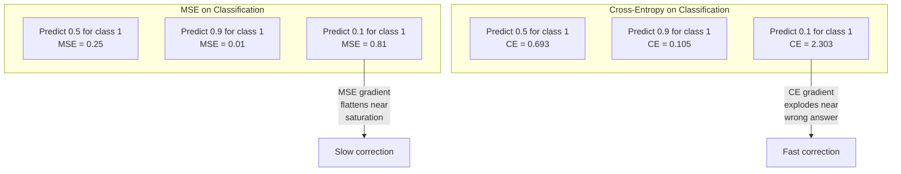
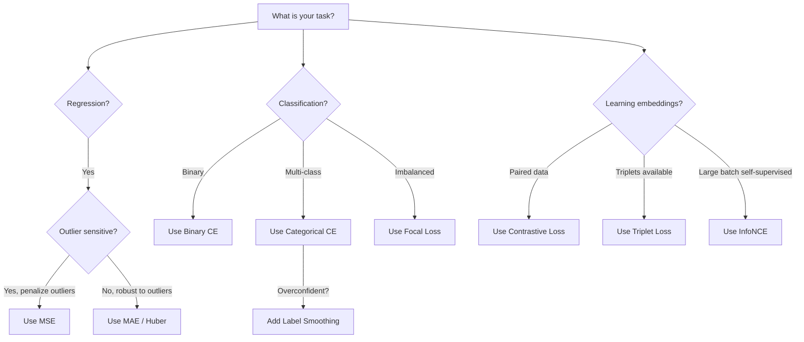
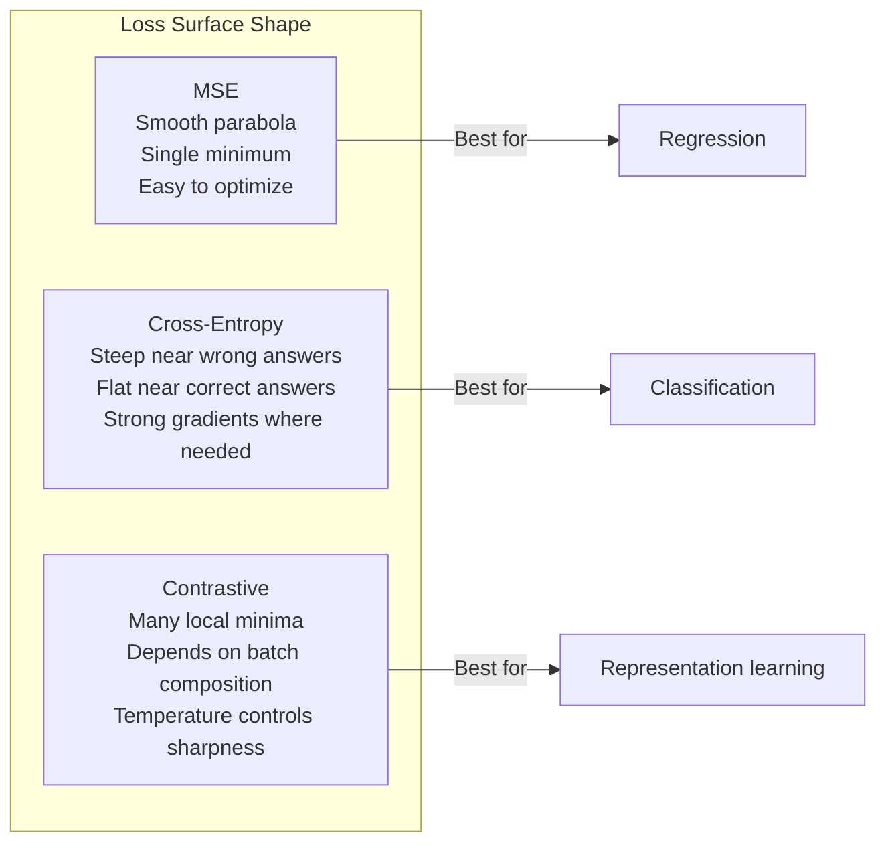

# Các chức năng mất mát

> mạng của bạn đưa ra một dự đoán. thực tại mặt đất nói ngược lại. nó sai như thế nào? số đó là lỗ. chọn hàm lỗ sai và mô hình của bạn tối ưu hóa cho sai hoàn toàn.

**Type:** Build
**Languages:** Python
**Prerequisites:** Lesson 03.04 (Activation Functions)
**Time:** ~75 minutes

## Mục tiêu học tập

- Thực hiện MSE, cross-entropy nhị phân, cross-entropy hạng mục và mất mát tương phản (InfoNCE) từ đầu với các gradient của chúng
- Giải thích lý do tại sao MSE không được phân loại bằng cách hiển thị chế độ thất bại "định đoán 0.5 cho mọi thứ"
- Lấy nhãn làm mượt mà cho sự liên kết và mô tả cách nó ngăn ngừa dự đoán quá tự tin
- Chọn hàm mất tích chính xác cho sự lùi lại, phân loại nhị phân, phân loại đa lớp và nhúng các nhiệm vụ học tập

## Vấn đề

Một mô hình giảm thiểu MSE trên một vấn đề phân loại sẽ dự đoán một cách tự tin 0.5 cho mọi thứ. Nó giảm thiểu tổn thất. Nó cũng vô dụng.

Chức năng mất mát là điều duy nhất mô hình của bạn thực sự tối ưu hóa. Không chính xác. Không có điểm số F1. Không phải là những thông số mà anh báo cáo cho quản lý của anh. Máy tối ưu hóa lấy gradient của hàm mất và điều chỉnh trọng lượng để làm cho số đó nhỏ hơn. Nếu hàm mất không nắm bắt những gì bạn quan tâm, mô hình sẽ tìm ra cách rẻ nhất về mặt toán học để thỏa mãn nó, và cách đó hầu như không bao giờ là những gì bạn muốn.

Đây là một ví dụ cụ thể. Bạn có một nhiệm vụ phân loại nhị phân. Hai lớp, 50/50 chia. Anh dùng MSE như là tổn thất của mình. Mô hình dự đoán 0,5 cho mỗi đầu vào. MSE trung bình là 0,25, đó là mức tối thiểu có thể mà không thực sự học được bất cứ điều gì. Mô hình này không có khả năng phân biệt nhưng nó đã giảm thiểu chức năng mất mát của bạn. Chuyển sang entropy chéo và cùng một mô hình bị buộc phải đẩy dự đoán về phía 0 hoặc 1, bởi vì -log(0.5) = 0.693 là một tổn thất khủng khiếp, trong khi -log(0.99) = 0.01 thưởng cho dự đoán chính xác. Sự lựa chọn của hàm mất là sự khác biệt giữa một mô hình học hỏi và một mô hình chơi theo métrics.

Nó trở nên tồi tệ hơn. Trong việc học tự giám sát, bạn thậm chí không có nhãn. Khối thấu hiểu đánh giá tín hiệu học tập hoàn toàn: những gì được tính là tương tự, những gì được tính là khác nhau, và mô hình phải đẩy chúng ra sao.

## Khái niệm

### Phản ứng thông tin thông tin thông tin thông tin

Các mặc định cho sự lùi lại. tính toán sự khác biệt vuông giữa dự đoán và mục tiêu, trung bình trên tất cả các mẫu.

```
MSE = (1/n) * sum((y_pred - y_true)^2)
```

Tại sao tính cách bình phương là quan trọng: nó phạt lỗi lớn theo cách hình tư. một lỗi 2 tốn 4 lần so với một lỗi 1. một lỗi 10 tốn 100 lần. Điều này làm cho MSE nhạy cảm với các giá trị ngoại lệ - một dự đoán sai lầm độc đáo thống trị tổn thất.

Số thực: nếu mô hình của bạn dự đoán giá nhà ở và là không $10,000 on most houses but off by $200.000 trên một biệt thự, MSE sẽ cố gắng sửa chữa một biệt thự đó, có khả năng làm tổn hại hiệu suất trên 99 ngôi nhà khác.

Tỷ lệ gradient của MSE đối với một dự đoán là:

```
dMSE/dy_pred = (2/n) * (y_pred - y_true)
```

Trình độ lỗi đường thẳng. Trình độ lỗi lớn hơn có gradient lớn hơn. Đây là tính năng để lùi lại (trầm lỗi lớn cần sửa chữa lớn) và lỗi để phân loại (bạn muốn phạt những câu trả lời sai trái tự tin theo cách theo cấp số, chứ không phải theo đường thẳng).

### Thiệt hại qua trần gian

Chức năng mất mát cho phân loại. Dựa trên lý thuyết thông tin - nó đo sự khác biệt giữa phân bố xác suất dự đoán và phân bố thực sự.

**Binary Cross-Entropy (BCE):**

```
BCE = -(y * log(p) + (1 - y) * log(1 - p))
```

Ở đó y là nhãn thực (0 hoặc 1) và p là xác suất dự đoán.

Tại sao -log(p) hoạt động: khi nhãn thực là 1 và bạn dự đoán p = 0,99, tổn thất là -log(0.99) = 0,01. Khi bạn dự đoán p = 0,01, tổn thất là -log(0.01) = 4,6. Sự khác biệt 460x là lý do tại sao cross-entropy hoạt động. Nó trừng phạt tàn bạo những dự đoán sai lầm tự tin trong khi hầu như không phạt những dự đoán chính xác tự tin.

Đường độ nói cùng một câu chuyện:

```
dBCE/dp = -(y/p) + (1-y)/(1-p)
```

Khi y = 1 và p gần bằng không, gradient là -1/p, gần vô hạn âm. Mô hình nhận được một tín hiệu khổng lồ để sửa lỗi của nó. Khi p gần 1, gradient là nhỏ.

**Categorical Cross-Entropy:**

Đối với phân loại đa lớp với mục tiêu mã hóa một nóng.

```
CCE = -sum(y_i * log(p_i))
```

Chỉ có lớp thực đóng góp vào sự mất mát (vì tất cả các y_i khác là không). Nếu có 10 lớp và lớp đúng có xác suất 0.1 (đường đoán ngẫu nhiên), sự mất mát là -log(0.1) = 2.3. Nếu lớp đúng có xác suất 0.9, sự mất mát là -log(0.9) = 0.105. Mô hình học tập trung khối lượng xác suất vào câu trả lời đúng.

### Tại sao MSE không được phân loại



Các gradient MSE phẳng khi dự đoán gần 0 hoặc 1 (do bão hòa sigmoid). gradient entropy chéo bù đắp cho điều này - -log hủy bỏ các khu vực phẳng của sigmoid, tạo ra gradient mạnh chính xác nơi chúng cần thiết nhất.

### Đẹp nhãn

Các nhãn hiệu tiêu chuẩn cho một loại nóng nói rằng "Đây là 100% lớp 3 và 0% tất cả mọi thứ khác". Đó là một tuyên bố mạnh mẽ.

```
smooth_label = (1 - alpha) * one_hot + alpha / num_classes
```

Với alpha = 0,1 và 10 lớp: thay vì [0, 0, 1, 0, ...], mục tiêu trở thành [0, 01, 0, 01, 0, 91, 0, 01, ...]. Mô hình nhắm mục tiêu 0,91 thay vì 1.0.

Tại sao điều này hoạt động: một mô hình cố gắng để ra ra chính xác 1.0 thông qua một softmax cần phải đẩy logits đến vô hạn. Điều này gây ra sự tự tin quá mức, làm tổn thương tổng quát và làm cho mô hình dễ vỡ khi chuyển đổi phân phối.

### Khối lượng thua lỗ

Không có nhãn, không có lớp học, chỉ là cặp đầu vào và câu hỏi: chúng giống nhau hay khác nhau?

**SimCLR-style contrastive loss (NT-Xent / InfoNCE):**

Hãy lấy một hình ảnh. tạo ra hai hình ảnh tăng cường của nó (crop, rotate, color jitter). Đây là "cặp tích cực" - chúng nên có những nhúng tương tự. Mỗi hình ảnh khác trong loạt tạo thành một "cặp âm" - chúng nên có những nhúng khác nhau.

```
L = -log(exp(sim(z_i, z_j) / tau) / sum(exp(sim(z_i, z_k) / tau)))
```

Khi sim() là sự tương đồng cosine, z_i và z_j là cặp tích cực, tổng là trên tất cả các âm, và tau (già nhiệt) kiểm soát sự phân phối sắc nét.

Số thực: kích thước lô 256 có nghĩa là 255 âm tính cho mỗi cặp dương tính. Nhiệt độ tau = 0,07 (SimCLR mặc định). Sự mất mát trông giống như một Softmax trên sự tương đồng - nó muốn sự tương đồng của cặp dương tính là cao nhất trong tất cả 256 tùy chọn.

**Triplet Loss:**

Cần 3 đầu vào: neo, tích cực ( cùng lớp), âm (khoa khác).

```
L = max(0, d(anchor, positive) - d(anchor, negative) + margin)
```

Lợi nhuận (thường là 0.2-1.0) áp dụng khoảng cách tối thiểu giữa khoảng cách tích cực và âm. Nếu âm đã đủ xa, tổn thất là không - không có gradient, không cập nhật. Điều này làm cho việc đào tạo hiệu quả nhưng đòi hỏi phải khai thác ba phần cẩn thận (chọn âm cứng gần neo).

### Thiệt tiêu

Đối với các tập dữ liệu không cân bằng. Cross-entropy tiêu chuẩn xử lý tất cả các ví dụ được phân loại đúng cách bằng nhau.

```
FL = -alpha * (1 - p_t)^gamma * log(p_t)
```

Khi p_t là xác suất dự đoán của lớp thực và gamma kiểm soát sự tập trung. với gamma = 0, đây là entropy chéo tiêu chuẩn. với gamma = 2 (đặc định):

- Ví dụ đơn giản (p_t = 0,9): trọng lượng = (0,1) ^ 2 = 0,01.
- Ví dụ cứng (p_t = 0,1): trọng lượng = (0,9) ^ 2 = 0,81. tín hiệu gradient đầy đủ.

Thiếu trọng tâm được giới thiệu bởi Lin et al. cho việc phát hiện đối tượng, nơi 99% các khu vực ứng cử là nền (nôgatif dễ dàng).

### Cây quyết định mất chức năng



### Vị cảnh mất mát



```figure
cross-entropy-loss
```

## Hãy xây dựng nó

### Bước 1: MSE và mức độ của nó

```python
def mse(predictions, targets):
    n = len(predictions)
    total = 0.0
    for p, t in zip(predictions, targets):
        total += (p - t) ** 2
    return total / n

def mse_gradient(predictions, targets):
    n = len(predictions)
    grads = []
    for p, t in zip(predictions, targets):
        grads.append(2.0 * (p - t) / n)
    return grads
```

### Bước 2: Binary Cross-Entropy

Vấn đề log(0) là thực. Nếu mô hình dự đoán chính xác 0 cho một ví dụ tích cực, log(0) = vô hạn âm.

```python
import math

def binary_cross_entropy(predictions, targets, eps=1e-15):
    n = len(predictions)
    total = 0.0
    for p, t in zip(predictions, targets):
        p_clipped = max(eps, min(1 - eps, p))
        total += -(t * math.log(p_clipped) + (1 - t) * math.log(1 - p_clipped))
    return total / n

def bce_gradient(predictions, targets, eps=1e-15):
    grads = []
    for p, t in zip(predictions, targets):
        p_clipped = max(eps, min(1 - eps, p))
        grads.append(-(t / p_clipped) + (1 - t) / (1 - p_clipped))
    return grads
```

### Bước 3: Cấu hình chéo phân loại với Softmax

Softmax chuyển đổi logits nguyên thô thành xác suất.

```python
def softmax(logits):
    max_val = max(logits)
    exps = [math.exp(x - max_val) for x in logits]
    total = sum(exps)
    return [e / total for e in exps]

def categorical_cross_entropy(logits, target_index, eps=1e-15):
    probs = softmax(logits)
    p = max(eps, probs[target_index])
    return -math.log(p)

def cce_gradient(logits, target_index):
    probs = softmax(logits)
    grads = list(probs)
    grads[target_index] -= 1.0
    return grads
```

Tỷ lệ gradient của softmax + cross-entropy đơn giản hóa rất đẹp: nó chỉ là (sự xác suất dự đoán - 1) cho lớp thực, và (sự xác suất dự đoán) cho tất cả các lớp khác.

### Bước 4: Đơn vị nhãn

```python
def label_smoothed_cce(logits, target_index, num_classes, alpha=0.1, eps=1e-15):
    probs = softmax(logits)
    loss = 0.0
    for i in range(num_classes):
        if i == target_index:
            smooth_target = 1.0 - alpha + alpha / num_classes
        else:
            smooth_target = alpha / num_classes
        p = max(eps, probs[i])
        loss += -smooth_target * math.log(p)
    return loss
```

### Bước 5: Khối thấu (InfoNCE đơn giản hóa)

```python
def cosine_similarity(a, b):
    dot = sum(x * y for x, y in zip(a, b))
    norm_a = math.sqrt(sum(x * x for x in a))
    norm_b = math.sqrt(sum(x * x for x in b))
    if norm_a < 1e-10 or norm_b < 1e-10:
        return 0.0
    return dot / (norm_a * norm_b)

def contrastive_loss(anchor, positive, negatives, temperature=0.07):
    sim_pos = cosine_similarity(anchor, positive) / temperature
    sim_negs = [cosine_similarity(anchor, neg) / temperature for neg in negatives]

    max_sim = max(sim_pos, max(sim_negs)) if sim_negs else sim_pos
    exp_pos = math.exp(sim_pos - max_sim)
    exp_negs = [math.exp(s - max_sim) for s in sim_negs]
    total_exp = exp_pos + sum(exp_negs)

    return -math.log(max(1e-15, exp_pos / total_exp))
```

### Bước 6: MSE vs Cross-Entropy về phân loại

Đào tạo cùng một mạng từ bài học 04 (cục dữ liệu vòng tròn) với cả hai hàm mất.

```python
import random

def sigmoid(x):
    x = max(-500, min(500, x))
    return 1.0 / (1.0 + math.exp(-x))

def make_circle_data(n=200, seed=42):
    random.seed(seed)
    data = []
    for _ in range(n):
        x = random.uniform(-2, 2)
        y = random.uniform(-2, 2)
        label = 1.0 if x * x + y * y < 1.5 else 0.0
        data.append(([x, y], label))
    return data


class LossComparisonNetwork:
    def __init__(self, loss_type="bce", hidden_size=8, lr=0.1):
        random.seed(0)
        self.loss_type = loss_type
        self.lr = lr
        self.hidden_size = hidden_size

        self.w1 = [[random.gauss(0, 0.5) for _ in range(2)] for _ in range(hidden_size)]
        self.b1 = [0.0] * hidden_size
        self.w2 = [random.gauss(0, 0.5) for _ in range(hidden_size)]
        self.b2 = 0.0

    def forward(self, x):
        self.x = x
        self.z1 = []
        self.h = []
        for i in range(self.hidden_size):
            z = self.w1[i][0] * x[0] + self.w1[i][1] * x[1] + self.b1[i]
            self.z1.append(z)
            self.h.append(max(0.0, z))

        self.z2 = sum(self.w2[i] * self.h[i] for i in range(self.hidden_size)) + self.b2
        self.out = sigmoid(self.z2)
        return self.out

    def backward(self, target):
        if self.loss_type == "mse":
            d_loss = 2.0 * (self.out - target)
        else:
            eps = 1e-15
            p = max(eps, min(1 - eps, self.out))
            d_loss = -(target / p) + (1 - target) / (1 - p)

        d_sigmoid = self.out * (1 - self.out)
        d_out = d_loss * d_sigmoid

        for i in range(self.hidden_size):
            d_relu = 1.0 if self.z1[i] > 0 else 0.0
            d_h = d_out * self.w2[i] * d_relu
            self.w2[i] -= self.lr * d_out * self.h[i]
            for j in range(2):
                self.w1[i][j] -= self.lr * d_h * self.x[j]
            self.b1[i] -= self.lr * d_h
        self.b2 -= self.lr * d_out

    def compute_loss(self, pred, target):
        if self.loss_type == "mse":
            return (pred - target) ** 2
        else:
            eps = 1e-15
            p = max(eps, min(1 - eps, pred))
            return -(target * math.log(p) + (1 - target) * math.log(1 - p))

    def train(self, data, epochs=200):
        losses = []
        for epoch in range(epochs):
            total_loss = 0.0
            correct = 0
            for x, y in data:
                pred = self.forward(x)
                self.backward(y)
                total_loss += self.compute_loss(pred, y)
                if (pred >= 0.5) == (y >= 0.5):
                    correct += 1
            avg_loss = total_loss / len(data)
            accuracy = correct / len(data) * 100
            losses.append((avg_loss, accuracy))
            if epoch % 50 == 0 or epoch == epochs - 1:
                print(f"    Epoch {epoch:3d}: loss={avg_loss:.4f}, accuracy={accuracy:.1f}%")
        return losses
```

## Sử dụng nó

PyTorch cung cấp tất cả các chức năng mất tiêu chuẩn với sự ổn định số tích hợp trong:

```python
import torch
import torch.nn as nn
import torch.nn.functional as F

predictions = torch.tensor([0.9, 0.1, 0.7], requires_grad=True)
targets = torch.tensor([1.0, 0.0, 1.0])

mse_loss = F.mse_loss(predictions, targets)
bce_loss = F.binary_cross_entropy(predictions, targets)

logits = torch.randn(4, 10)
labels = torch.tensor([3, 7, 1, 9])
ce_loss = F.cross_entropy(logits, labels)
ce_smooth = F.cross_entropy(logits, labels, label_smoothing=0.1)
```

Sử dụng `F.cross_entropy`(không `F.nll_loss`+ hàm mềm tối đa thủ công) Nó kết hợp log-softmax và log-thiên suất âm trong một hoạt động ổn định về mặt số.

Để học tương phản, hầu hết các nhóm sử dụng các ứng dụng tùy chỉnh hoặc thư viện như `lightly`hoặc `pytorch-metric-learning`. Loop cốt lõi luôn giống nhau: tính toán sự tương đồng đôi, tạo ra Softmax trên tích cực và tiêu cực, backpropagate.

## Chuyển nó

Bài học này mang lại:
- `outputs/prompt-loss-function-selector.md`-- một lời nhắc tái sử dụng để chọn đúng hàm mất
- `outputs/prompt-loss-debugger.md`-- một lời khuyên chẩn đoán cho khi đường cong mất mát của bạn trông sai

## Các bài tập

1. Thực hiện mất Huber (smooth L1 loss), đó là MSE cho lỗi nhỏ và MAE cho lỗi lớn. Tập một mạng lưới hồi quy dự đoán y = sin(x) với MSE đối với Huber khi 5% các mục tiêu đào tạo có thêm tiếng ồn ngẫu nhiên (outliers). So sánh lỗi thử nghiệm cuối cùng.

2. Thêm mất tập trung vào vòng đào tạo phân loại nhị phân. Tạo một bộ dữ liệu không cân bằng (90% lớp 0, 10% lớp 1). So sánh tiêu chuẩn BCE so với mất tập trung (gamma = 2) trên nhóm thiểu số nhớ lại sau 200 thời đại.

3. Thực hiện mất ba phần tử bằng khai thác âm tính bán cứng. Tạo dữ liệu nhúng 2D cho 5 lớp. Đối với mỗi neo, tìm âm tính khó nhất vẫn còn xa hơn tích cực (bàn bộ cứng). So sánh sự hội tụ với sự lựa chọn ba phần tử ngẫu nhiên.

4. Thực hiện so sánh MSE vs entropy chéo nhưng theo dõi độ lớn gradient tại mỗi lớp trong quá trình đào tạo. Chụp các chuẩn gradient trung bình cho mỗi thời đại. Kiểm tra rằng sự nghiêng entropy tạo ra độ nghiêng lớn hơn trong thời đại đầu khi mô hình không chắc chắn nhất.

5. Thực hiện mất đi sự phân biệt KL và xác minh rằng giảm thiểu KL(true khi được dự đoán) mang lại cùng gradient như cross-entropy khi phân bố thực sự là một-hot.

## Các điều khoản chính

| Term | What people say | What it actually means |
|------|----------------|----------------------|
| Loss function | "How wrong the model is" | A differentiable function mapping predictions and targets to a scalar that the optimizer minimizes |
| MSE | "Average squared error" | Mean of squared differences between predictions and targets; penalizes large errors quadratically |
| Cross-entropy | "The classification loss" | Measures divergence between predicted probability distribution and true distribution using -log(p) |
| Binary cross-entropy | "BCE" | Cross-entropy for two classes: -(y*log(p) + (1-y)*log(1-p)) |
| Label smoothing | "Softening the targets" | Replacing hard 0/1 targets with soft values (e.g., 0.1/0.9) to prevent overconfidence and improve generalization |
| Contrastive loss | "Pull together, push apart" | A loss that learns representations by making similar pairs close and dissimilar pairs far in embedding space |
| InfoNCE | "The CLIP/SimCLR loss" | Normalized temperature-scaled cross-entropy over similarity scores; treats contrastive learning as classification |
| Focal loss | "The imbalanced data fix" | Cross-entropy weighted by (1-p_t)^gamma to down-weight easy examples and focus on hard ones |
| Triplet loss | "Anchor-positive-negative" | Pushes anchor closer to positive than negative by at least a margin in embedding space |
| Temperature | "Sharpness knob" | A scalar divisor on logits/similarities that controls how peaked the resulting distribution is; lower = sharper |

## Đọc thêm

- Lin et al., "Lạc trọng tâm cho phát hiện đối tượng dày đặc" (2017) -- giới thiệu mất trọng tâm để xử lý sự mất cân bằng lớp cực kỳ trong phát hiện đối tượng (RetinaNet)
- Chen et al., "A Simple Framework for Contrastive Learning of Visual Representations" (SimCLR, 2020) - định nghĩa đường ống học tương phản hiện đại với mất NT-Xent
- Szegedy et al., "Rethinking the Inception Architecture" (2016) -- giới thiệu việc làm nhẵn nhãn như một kỹ thuật quy định, hiện là tiêu chuẩn trong hầu hết các mô hình lớn
- Hinton et al., "Distilling the Knowledge in a Neural Network" (2015) -- Destilation of knowledge using soft targets and KL divergence, foundational for model compression
