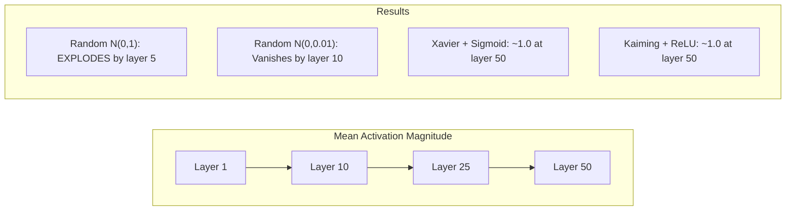
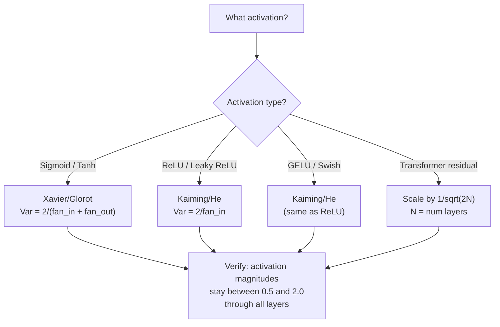

# Sự khởi động trọng lượng và sự ổn định của đào tạo

> Bắt đầu sai và đào tạo không bao giờ bắt đầu. Bắt đầu đúng và 50 lớp đào tạo như một cách trơn tru như 3.

**Type:** Build
**Languages:** Python
**Prerequisites:** Lesson 03.04 (Activation Functions), Lesson 03.07 (Regularization)
**Time:** ~90 minutes

## Mục tiêu học tập

- Thực hiện chiến lược khởi tạo không, ngẫu nhiên, Xavier/Glorot và Kaiming/He và đo tác động của chúng lên quy mô kích hoạt thông qua 50 lớp
- Thuộc dẫn tại sao Xavier init sử dụng Var(w) = 2/(fan_in + fan_out) và Kaiming sử dụng Var(w) = 2/fan_in
- Hiển thị vấn đề đối xứng với zero khởi đầu và giải thích tại sao chỉ có thang số ngẫu nhiên là không đủ
- Hợp tác chiến lược khởi động chính xác với chức năng kích hoạt: Xavier cho sigmoid/tanh, Kaiming cho ReLU/GELU

## Vấn đề

Khi bắt đầu tất cả trọng lượng lên đến 0, không có gì học được. Mỗi tế bào thần kinh tính toán cùng một chức năng, nhận được cùng một gradient, và cập nhật giống nhau. Sau 10.000 thời đại, lớp ẩn của 512 tế bào thần kinh của bạn vẫn là 512 bản sao của cùng một tế bào thần kinh. Bạn đã trả tiền cho 512 tham số và nhận được 1.

Khi các kích hoạt phát nổ qua mạng, bằng lớp 10, giá trị đạt 1e15.

Đổi đầu chúng theo cách ngẫu nhiên từ một phân bố bình thường tiêu chuẩn. Nó hoạt động cho 3 lớp. Ở 50 lớp, tín hiệu sụp đổ xuống mức không hoặc nổ ra vô tận tùy thuộc vào việc thang đo ngẫu nhiên có quá nhỏ hoặc quá lớn. Biên giới giữa "làm việc" và "sụp đổ" mỏng như gạo.

Việc khởi tạo trọng lượng là quyết định bị đánh giá thấp nhất trong học tập sâu. Kiến trúc nhận được các bài báo. Những người tối ưu hóa nhận được các bài đăng trên blog. Việc khởi tạo nhận được một ghi chú chân. Nhưng sai lầm và không có gì khác quan trọng - mạng lưới của bạn đã chết trước khi bắt đầu đào tạo.

## Khái niệm

### Vấn đề đối xứng

Mỗi neuron trong một lớp có cấu trúc tương tự: nhân đầu vào bằng trọng lượng, thêm thiên vị, áp dụng kích hoạt. Nếu tất cả trọng lượng bắt đầu ở cùng một giá trị (không là trường hợp cực đoan), mỗi neuron tính toán cùng một đầu ra. Trong quá trình phát triển ngược, mỗi neuron nhận được cùng một gradient. Trong giai đoạn cập nhật, mỗi neuron thay đổi bằng cùng một số lượng.

Bạn bị kẹt. Mạng lưới có hàng trăm tham số, nhưng tất cả chúng di chuyển theo bước khóa. Điều này được gọi là đối xứng, và sự khởi tạo ngẫu nhiên là cách phá vỡ nó. Mỗi tế bào thần kinh bắt đầu ở một điểm khác nhau trong không gian trọng lượng, vì vậy mỗi tế bào học được một tính năng khác nhau.

Nhưng "thình tự" không đủ. * quy mô * của sự ngẫu nhiên xác định xem mạng lưới tàu.

### Sự pha trộn lây lan qua các lớp

Hãy xem xét một lớp duy nhất với đầu vào fan_in:

```
z = w1*x1 + w2*x2 + ... + w_n*x_n
```

Nếu mỗi trọng lượng wi được rút ra từ phân bố với sự biến động Var(w) và mỗi input xi có sự biến động Var(x), sự biến động đầu ra là:

```
Var(z) = fan_in * Var(w) * Var(x)
```

Nếu Var(w) = 1 và fan_in = 512, sự biến động đầu ra là 512x sự biến động đầu vào. Sau 10 lớp: 512 ^ 10 = 1.2e27. tín hiệu của bạn đã nổ ra.

Nếu Var ((w) = 0,001, sự biến động đầu ra sẽ giảm 0,001 * 512 = 0,512 cho mỗi lớp. Sau 10 lớp: 0.512 ^ 10 = 0,00013. tín hiệu của bạn đã biến mất.

Mục tiêu: chọn Var(w) để Var(z) = Var(x). Độ lớn tín hiệu vẫn không đổi trên các lớp.

### Xavier/Glorot khởi tạo

Glorot and Bengio (2010) đã lấy giải pháp cho các hoạt động sigmoid và tanh. Để giữ sự khác biệt liên tục trong cả đường đi về phía trước và ngược:

```
Var(w) = 2 / (fan_in + fan_out)
```

Trong thực tế, trọng lượng được lấy từ:

```
w ~ Uniform(-limit, limit)  where limit = sqrt(6 / (fan_in + fan_out))
```

hoặc:

```
w ~ Normal(0, sqrt(2 / (fan_in + fan_out)))
```

Điều này hoạt động bởi vì sigmoid và tanh gần như tuyến tính gần bằng không, nơi hoạt động được khởi động đúng cách sống.

### Kaiming/He khởi tạo

ReLU tiêu diệt một nửa các đầu ra (tất cả mọi thứ tiêu cực trở thành không). Fan_in hiệu quả được giảm một nửa bởi vì trung bình một nửa các đầu vào được đánh giá bằng không. Xavier init không tính toán cho điều này - nó đánh giá thấp sự khác biệt cần thiết.

He et al. (2015) đã điều chỉnh công thức:

```
Var(w) = 2 / fan_in
```

Các trọng lượng được lấy từ:

```
w ~ Normal(0, sqrt(2 / fan_in))
```

Tỷ lệ 2 bù đắp cho ReLU làm nạc một nửa các hoạt động. Nếu không có nó, tín hiệu thu hẹp khoảng 0,5x cho mỗi lớp. Với 50 lớp: 0,5^50 = 8,8e-16. Kaiming init ngăn chặn điều này.

### Tạo ra Transformer

GPT-2 đã đưa ra một mô hình khác. Các kết nối dư thừa thêm đầu ra của mỗi tầng phụ vào đầu vào của nó:

```
x = x + sublayer(x)
```

Mỗi sự bổ sung làm tăng sự biến động. Với N lớp dư thừa, sự biến động tăng tương ứng với N. GPT-2 quy mô trọng lượng của các lớp dư bằng 1/sqrt(2N), nơi N là số lượng các lớp. Điều này giữ cho cường độ tín hiệu tích lũy ổn định.

Llama 3 (405B tham số, 126 lớp) sử dụng một kế hoạch tương tự. Nếu không có quy mô này, dòng dư sẽ phát triển không giới hạn thông qua 126 lớp chú ý và các khối chuyển tiếp.

```mermaid
flowchart TD
    subgraph "Zero Init"
        Z1["Layer 1<br/>All weights = 0"] --> Z2["Layer 2<br/>All neurons identical"]
        Z2 --> Z3["Layer 3<br/>Still identical"]
        Z3 --> ZR["Result: 1 effective neuron<br/>regardless of width"]
    end

    subgraph "Xavier Init"
        X1["Layer 1<br/>Var = 2/(fan_in+fan_out)"] --> X2["Layer 2<br/>Signal stable"]
        X2 --> X3["Layer 50<br/>Signal stable"]
        X3 --> XR["Result: Trains with<br/>sigmoid/tanh"]
    end

    subgraph "Kaiming Init"
        K1["Layer 1<br/>Var = 2/fan_in"] --> K2["Layer 2<br/>Signal stable"]
        K2 --> K3["Layer 50<br/>Signal stable"]
        K3 --> KR["Result: Trains with<br/>ReLU/GELU"]
    end
```



### Tầm kích hoạt thông qua 50 lớp



### Chọn tâm trí đúng đắn



```figure
weight-init-variance
```

## Hãy xây dựng nó

### Bước 1: Chiến lược khởi động

Bốn cách để khởi tạo một số liệu vật nặng. Mỗi trả lại một danh sách danh sách (một số liệu vật 2D) với các cột fan_in và hàng fan_out.

```python
import math
import random


def zero_init(fan_in, fan_out):
    return [[0.0 for _ in range(fan_in)] for _ in range(fan_out)]


def random_init(fan_in, fan_out, scale=1.0):
    return [[random.gauss(0, scale) for _ in range(fan_in)] for _ in range(fan_out)]


def xavier_init(fan_in, fan_out):
    std = math.sqrt(2.0 / (fan_in + fan_out))
    return [[random.gauss(0, std) for _ in range(fan_in)] for _ in range(fan_out)]


def kaiming_init(fan_in, fan_out):
    std = math.sqrt(2.0 / fan_in)
    return [[random.gauss(0, std) for _ in range(fan_in)] for _ in range(fan_out)]
```

### Bước 2: Các chức năng kích hoạt

Chúng ta cần sigmoid, tanh, và ReLU để kiểm tra mỗi chiến lược init với kích hoạt dự định của nó.

```python
def sigmoid(x):
    x = max(-500, min(500, x))
    return 1.0 / (1.0 + math.exp(-x))


def tanh_act(x):
    return math.tanh(x)


def relu(x):
    return max(0.0, x)
```

### Bước 3: Đi qua 50 lớp

Chuyển dữ liệu ngẫu nhiên qua một mạng sâu và đo mức kích hoạt trung bình ở mỗi lớp.

```python
def forward_deep(init_fn, activation_fn, n_layers=50, width=64, n_samples=100):
    random.seed(42)
    layer_magnitudes = []

    inputs = [[random.gauss(0, 1) for _ in range(width)] for _ in range(n_samples)]

    for layer_idx in range(n_layers):
        weights = init_fn(width, width)
        biases = [0.0] * width

        new_inputs = []
        for sample in inputs:
            output = []
            for neuron_idx in range(width):
                z = sum(weights[neuron_idx][j] * sample[j] for j in range(width)) + biases[neuron_idx]
                output.append(activation_fn(z))
            new_inputs.append(output)
        inputs = new_inputs

        magnitudes = []
        for sample in inputs:
            magnitudes.append(sum(abs(v) for v in sample) / width)
        mean_mag = sum(magnitudes) / len(magnitudes)
        layer_magnitudes.append(mean_mag)

    return layer_magnitudes
```

### Bước 4: Thử nghiệm

Thực hiện tất cả các kết hợp: zero init, random N(0,1), random N(0,0.01), Xavier với sigmoid, Xavier với tanh, Kaiming với ReLU. Bác kích ở các lớp khóa.

```python
def run_experiment():
    configs = [
        ("Zero init + Sigmoid", lambda fi, fo: zero_init(fi, fo), sigmoid),
        ("Random N(0,1) + ReLU", lambda fi, fo: random_init(fi, fo, 1.0), relu),
        ("Random N(0,0.01) + ReLU", lambda fi, fo: random_init(fi, fo, 0.01), relu),
        ("Xavier + Sigmoid", xavier_init, sigmoid),
        ("Xavier + Tanh", xavier_init, tanh_act),
        ("Kaiming + ReLU", kaiming_init, relu),
    ]

    print(f"{'Strategy':<30} {'L1':>10} {'L5':>10} {'L10':>10} {'L25':>10} {'L50':>10}")
    print("-" * 80)

    for name, init_fn, act_fn in configs:
        mags = forward_deep(init_fn, act_fn)
        row = f"{name:<30}"
        for idx in [0, 4, 9, 24, 49]:
            val = mags[idx]
            if val > 1e6:
                row += f" {'EXPLODED':>10}"
            elif val < 1e-6:
                row += f" {'VANISHED':>10}"
            else:
                row += f" {val:>10.4f}"
        print(row)
```

### Bước 5: Kiểm tra đối xứng

Hãy chứng minh rằng 0 init tạo ra các tế bào thần kinh giống nhau.

```python
def symmetry_demo():
    random.seed(42)
    weights = zero_init(2, 4)
    biases = [0.0] * 4

    inputs = [0.5, -0.3]
    outputs = []
    for neuron_idx in range(4):
        z = sum(weights[neuron_idx][j] * inputs[j] for j in range(2)) + biases[neuron_idx]
        outputs.append(sigmoid(z))

    print("\nSymmetry Demo (4 neurons, zero init):")
    for i, out in enumerate(outputs):
        print(f"  Neuron {i}: output = {out:.6f}")
    all_same = all(abs(outputs[i] - outputs[0]) < 1e-10 for i in range(len(outputs)))
    print(f"  All identical: {all_same}")
    print(f"  Effective parameters: 1 (not {len(weights) * len(weights[0])})")
```

### Bước 6: Báo cáo độ lớn từng lớp

Bác in một biểu đồ thanh hình ảnh của kích hoạt quy mô thông qua 50 lớp.

```python
def magnitude_report(name, magnitudes):
    print(f"\n{name}:")
    for i, mag in enumerate(magnitudes):
        if i % 5 == 0 or i == len(magnitudes) - 1:
            if mag > 1e6:
                bar = "X" * 50 + " EXPLODED"
            elif mag < 1e-6:
                bar = "." + " VANISHED"
            else:
                bar_len = min(50, max(1, int(mag * 10)))
                bar = "#" * bar_len
            print(f"  Layer {i+1:3d}: {bar} ({mag:.6f})")
```

## Sử dụng nó

PyTorch cung cấp các chức năng tích hợp như sau:

```python
import torch
import torch.nn as nn

layer = nn.Linear(512, 256)

nn.init.xavier_uniform_(layer.weight)
nn.init.xavier_normal_(layer.weight)

nn.init.kaiming_uniform_(layer.weight, nonlinearity='relu')
nn.init.kaiming_normal_(layer.weight, nonlinearity='relu')

nn.init.zeros_(layer.bias)
```

Khi anh gọi`nn.Linear(512, 256)`PyTorch mặc định là Kaiming Uniform Initialisation. Đó là lý do tại sao hầu hết các mạng đơn giản "chỉ làm việc" - PyTorch đã đưa ra sự lựa chọn đúng đắn. Nhưng khi bạn xây dựng kiến trúc tùy chỉnh hoặc đi sâu hơn 20 lớp, bạn cần phải hiểu những gì đang xảy ra và có khả năng thay thế mặc định.

Đối với các bộ biến đổi, các mô hình HuggingFace thường xử lý khởi tạo trong các mô hình của họ.`_init_weights`phương pháp. GPT-2 thực hiện quy mô dự đoán dư bằng 1/sqrt ((N). Nếu bạn đang xây dựng một biến thể từ đầu, bạn cần phải thêm nó vào chính mình.

## Chuyển nó

Bài học này mang lại:
- `outputs/prompt-init-strategy.md`-- một lời nhắc đưa ra chẩn đoán các vấn đề khởi tạo trọng lượng và đề xuất chiến lược đúng

## Các bài tập

1. Thêm khởi tạo LeCun (Var = 1/fan_in, được thiết kế để kích hoạt SELU).

2. Thực hiện quy mô dư thừa GPT-2: nhân đầu ra của mỗi lớp bằng 1/sqrt(2 *N) trước khi thêm vào dòng dư thừa.

3. Tạo một chức năng " kiểm tra sức khỏe init" lấy kích thước lớp và loại kích hoạt của mạng, sau đó khuyến cáo khởi tạo đúng và cảnh báo nếu init hiện tại sẽ gây ra vấn đề.

4. Tiến hành thí nghiệm với fan_in = 16 vs fan_in = 1024. Xavier và Kaiming thích nghi với fan_in, nhưng không.

5. Thực hiện khởi tạo trực giác (tạo ra một dải ngẫu nhiên, tính toán SVD của nó, sử dụng dải ngẫu nhiên U). So sánh với Kaiming cho các mạng ReLU ở 50 lớp.

## Các điều khoản chính

| Term | What people say | What it actually means |
|------|----------------|----------------------|
| Weight initialization | "Set starting weights randomly" | The strategy for choosing initial weight values that determines whether a network can train at all |
| Symmetry breaking | "Make neurons different" | Using random initialization to ensure neurons learn distinct features instead of computing identical functions |
| Fan-in | "Number of inputs to a neuron" | The number of incoming connections, which determines how input variance accumulates in the weighted sum |
| Fan-out | "Number of outputs from a neuron" | The number of outgoing connections, relevant for maintaining gradient variance during backpropagation |
| Xavier/Glorot init | "The sigmoid initialization" | Var(w) = 2/(fan_in + fan_out), designed to preserve variance through sigmoid and tanh activations |
| Kaiming/He init | "The ReLU initialization" | Var(w) = 2/fan_in, accounts for ReLU zeroing half the activations |
| Variance propagation | "How signals grow or shrink through layers" | The mathematical analysis of how activation variance changes layer by layer based on weight scale |
| Residual scaling | "GPT-2's init trick" | Scaling residual connection weights by 1/sqrt(2N) to prevent variance growth through N transformer layers |
| Dead network | "Nothing trains" | A network where poor initialization causes all gradients to be zero or all activations to saturate |
| Exploding activations | "Values go to infinity" | When weight variance is too high, causing activation magnitudes to grow exponentially through layers |

## Đọc thêm

- Glorot & Bengio, "Hiểu được sự khó khăn của việc đào tạo các mạng lưới thần kinh cấp dữ liệu sâu" (2010) - bài báo khởi tạo Xavier ban đầu với phân tích biến thể
- He et al., "Thắm sâu vào các bộ sửa chữa" (2015) -- giới thiệu khởi tạo Kaiming cho các mạng ReLU
- Radford et al., "Các mô hình ngôn ngữ là người học đa nhiệm không được giám sát" (2019) -- GPT-2 giấy với quy mô dư thừa khởi tạo
- Mishkin & Matas, "All You Need is a Good Init" (2016) - khởi tạo đơn vị theo trình độ lớp, một lựa chọn thay thế thực nghiệm cho các công thức phân tích
