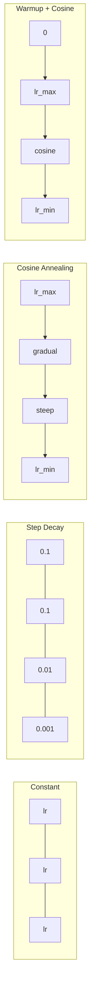
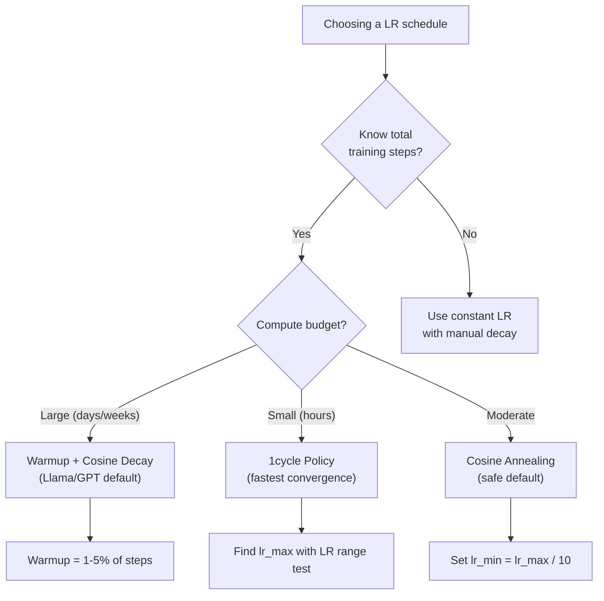
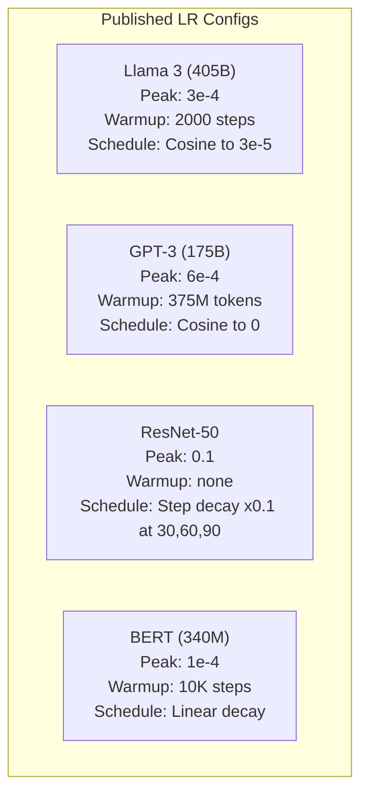

# Lịch học và làm ấm

> Tốc độ học tập là một siêu tham số quan trọng nhất. Không phải kiến trúc, không phải kích thước tập dữ liệu, không phải chức năng kích hoạt, tốc độ học tập. Nếu bạn không điều chỉnh gì khác, điều chỉnh này.

**Type:** Build
**Languages:** Python
**Prerequisites:** Lesson 03.06 (Optimizers), Lesson 03.08 (Weight Initialization)
**Time:** ~90 minutes

## Mục tiêu học tập

- Thực hiện các lịch trình học tập liên tục, phân rã từng bước, gia tăng co-sin, ấm lên + co-sin và tốc độ học tập 1 chu kỳ từ đầu
- Hiển thị ba chế độ thất bại trong việc lựa chọn tốc độ học tập: chênh lệch (quá cao), trì hoãn (quá thấp) và dao động (không phân rã)
- Giải thích tại sao sự ấm áp là cần thiết cho những người cải thiện dựa trên Adam và làm thế nào nó ổn định việc đào tạo sớm
- So sánh tốc độ hội tụ trong tất cả năm lịch trình trên cùng một nhiệm vụ và chọn một phù hợp cho một ngân sách đào tạo nhất định

## Vấn đề

Đặt tốc độ học tập là 0.1. Trình luyện khác nhau -- mất mát nhảy vô hạn trong 3 bước. Đặt nó là 0.0001. Trình luyện xẻo - sau 100 thời đại, mô hình hầu như không di chuyển từ ngẫu nhiên. Đặt nó là 0.01. Trình luyện hoạt động trong 50 thời đại, sau đó mất mát dao động xung quanh mức tối thiểu nó không bao giờ đạt được bởi vì các bước quá lớn.

Tốc độ học tập tối ưu không phải là một sự ổn định. Nó thay đổi trong quá trình đào tạo. Đầu tiên, bạn muốn các bước lớn để phủ mặt đất nhanh chóng. Cuối buổi đào tạo, bạn muốn các bước nhỏ để ổn định thành một mức tối thiểu sắc nét. Sự khác biệt giữa mô hình 90% chính xác và mô hình 95% chính xác thường chỉ là lịch trình.

Mỗi mô hình lớn được xuất bản trong ba năm qua sử dụng một lịch trình tốc độ học tập. Llama 3 sử dụng đỉnh lr = 3e-4 với 2000 bước nóng lên và sự phân rã cosine đến 3e-5. GPT-3 sử dụng lr = 6e-4 với nóng lên hơn 375 triệu token.

Bạn cần phải hiểu lịch trình vì các mặc định sẽ không làm việc cho vấn đề của bạn. Khi bạn điều chỉnh một mô hình được đào tạo trước, lịch trình đúng là khác với đào tạo từ đầu. Khi bạn tăng kích thước lô, thời gian ấm lên cần phải thay đổi. Khi đào tạo nghỉ ở bước 10.000, bạn cần biết liệu đó là một vấn đề lịch trình hay gì khác.

## Khái niệm

### Tốc độ học tập liên tục

Cách đơn giản nhất là chọn một con số, sử dụng nó cho từng bước.

```
lr(t) = lr_0
```

Nó hiếm khi tối ưu. Nó hoặc quá cao cho cuối tập luyện (sự dao động xung quanh mức tối thiểu) hoặc quá thấp cho sự bắt đầu (sự tính toán lãng phí trên các bước nhỏ).

### Bước phân rã

Cách thức cũ từ thời đại ResNet: Giảm tốc độ học tập bằng một nhân tố (thường là 10 lần) ở thời kỳ cố định.

```
lr(t) = lr_0 * gamma^(floor(epoch / step_size))
```

Ở đó gamma = 0,1 và step_size = 30, nghĩa là: lr giảm 10x mỗi 30 thời kỳ. ResNet-50 sử dụng điều này -- lr = 0,1, giảm 10x ở thời kỳ 30, 60, và 90.

Vấn đề: điểm suy giảm tối ưu phụ thuộc vào bộ dữ liệu và kiến trúc. Hãy chuyển sang một vấn đề khác và bạn cần phải điều chỉnh lại khi nào để giảm.

### Cosine Annealing

Sự suy giảm trơn tru từ tốc độ học tập tối đa xuống tối thiểu, theo đường cong cosine:

```
lr(t) = lr_min + 0.5 * (lr_max - lr_min) * (1 + cos(pi * t / T))
```

Ở đó t là bước hiện tại và T là tổng số bước.

Tại t=0, thuật ngữ cosine là 1, vì vậy lr = lr_max. Tại t=T, thuật ngữ cosine là -1, vì vậy lr = lr_min. Sự phân rã là nhẹ nhàng lúc đầu, tăng tốc ở giữa, và trở nên nhẹ nhàng lại gần cuối.

Đây là mặc định cho hầu hết các khóa đào tạo hiện đại. Không có các siêu tham số để điều chỉnh vượt quá lr_max và lr_min. Hình dạng cosine phù hợp với quan sát thực nghiệm rằng hầu hết các học tập xảy ra giữa đào tạo - bạn muốn kích thước bước hợp lý trong thời gian quan trọng đó.

### Sự ấm áp: Tại sao bạn bắt đầu nhỏ

Adam và các trình tối ưu hóa thích ứng khác duy trì ước tính chạy của trung bình và biến thể gradient. Ở bước 0, những ước tính này được khởi tạo thành không.

Warmup sửa chữa điều này. Bắt đầu với một tốc độ học tập nhỏ (thường là lr_max / warmup_steps hoặc thậm chí là không) và tăng lên lr_max theo đường thẳng qua các bước N đầu tiên.

```
lr(t) = lr_max * (t / warmup_steps)     for t < warmup_steps
```

LMA 3 được đào tạo với khoảng 1,8 nghìn tỷ token và được nóng lên cho 2000 bước. GPT-3 đã nóng lên hơn 375 triệu token.

### Sự nóng lên tuyến tính + sự phân rã của cosine

Đường mặc định hiện đại. tăng lên tuyến tính, sau đó phân hủy với cosine:

```
if t < warmup_steps:
    lr(t) = lr_max * (t / warmup_steps)
else:
    progress = (t - warmup_steps) / (total_steps - warmup_steps)
    lr(t) = lr_min + 0.5 * (lr_max - lr_min) * (1 + cos(pi * progress))
```

Đây là những gì Llama, GPT, PaLM và hầu hết các biến đổi hiện đại sử dụng. Sự nóng lên ngăn ngừa sự bất ổn sớm. Sự phân hủy cosine đặt mô hình vào mức tối thiểu tốt.

### Chính sách chu kỳ 1

Phát hiện của Leslie Smith (2018): tăng tốc độ học tập từ giá trị thấp lên giá trị cao trong nửa đầu đào tạo, sau đó tăng nó lại trong nửa sau.

Lý thuyết: tốc độ học tập cao hoạt động như một sự điều chỉnh bằng cách thêm tiếng ồn vào quỹ đạo tối ưu hóa. Mô hình khám phá nhiều hơn về cảnh quan mất mát trong giai đoạn tăng lên, tìm thấy bể bể tốt hơn.

```
Phase 1 (0 to T/2):    lr ramps from lr_max/25 to lr_max
Phase 2 (T/2 to T):    lr ramps from lr_max to lr_max/10000
```

1cycle thường chạy nhanh hơn coisinetching cho một ngân sách tính toán cố định.

### Các hình dạng lịch trình



### Hình ảnh dòng chảy quyết định



### Số thực từ các mô hình được xuất bản



```figure
lr-schedule
```

## Hãy xây dựng nó

### Bước 1: Đặt lịch trình hoạt động

Mỗi hàm thực hiện bước hiện tại và trả lại tốc độ học tập ở bước đó.

```python
import math


def constant_schedule(step, lr=0.01, **kwargs):
    return lr


def step_decay_schedule(step, lr=0.1, step_size=100, gamma=0.1, **kwargs):
    return lr * (gamma ** (step // step_size))


def cosine_schedule(step, lr=0.01, total_steps=1000, lr_min=1e-5, **kwargs):
    if step >= total_steps:
        return lr_min
    return lr_min + 0.5 * (lr - lr_min) * (1 + math.cos(math.pi * step / total_steps))


def warmup_cosine_schedule(step, lr=0.01, total_steps=1000, warmup_steps=100, lr_min=1e-5, **kwargs):
    if total_steps <= warmup_steps:
        return lr * (step / max(warmup_steps, 1))
    if step < warmup_steps:
        return lr * step / warmup_steps
    progress = (step - warmup_steps) / (total_steps - warmup_steps)
    return lr_min + 0.5 * (lr - lr_min) * (1 + math.cos(math.pi * progress))


def one_cycle_schedule(step, lr=0.01, total_steps=1000, **kwargs):
    mid = max(total_steps // 2, 1)
    if step < mid:
        return (lr / 25) + (lr - lr / 25) * step / mid
    else:
        progress = (step - mid) / max(total_steps - mid, 1)
        return lr * (1 - progress) + (lr / 10000) * progress
```

### Bước 2: Hãy xem trước tất cả các lịch trình

In một biểu đồ dựa trên văn bản cho thấy mỗi lịch trình phát triển theo cách đào tạo.

```python
def visualize_schedule(name, schedule_fn, total_steps=500, **kwargs):
    steps = list(range(0, total_steps, total_steps // 20))
    if total_steps - 1 not in steps:
        steps.append(total_steps - 1)

    lrs = [schedule_fn(s, total_steps=total_steps, **kwargs) for s in steps]
    max_lr = max(lrs) if max(lrs) > 0 else 1.0

    print(f"\n{name}:")
    for s, lr_val in zip(steps, lrs):
        bar_len = int(lr_val / max_lr * 40)
        bar = "#" * bar_len
        print(f"  Step {s:4d}: lr={lr_val:.6f} {bar}")
```

### Bước 3: Mạng lưới đào tạo

Một mạng lưới hai tầng đơn giản trên bộ dữ liệu vòng tròn, giống như các bài học trước đây, nhưng bây giờ chúng tôi thay đổi lịch trình.

```python
import random


def sigmoid(x):
    x = max(-500, min(500, x))
    return 1.0 / (1.0 + math.exp(-x))


def relu(x):
    return max(0.0, x)


def relu_deriv(x):
    return 1.0 if x > 0 else 0.0


def make_circle_data(n=200, seed=42):
    random.seed(seed)
    data = []
    for _ in range(n):
        x = random.uniform(-2, 2)
        y = random.uniform(-2, 2)
        label = 1.0 if x * x + y * y < 1.5 else 0.0
        data.append(([x, y], label))
    return data


def train_with_schedule(schedule_fn, schedule_name, data, epochs=300, base_lr=0.05, **kwargs):
    random.seed(0)
    hidden_size = 8
    total_steps = epochs * len(data)

    std = math.sqrt(2.0 / 2)
    w1 = [[random.gauss(0, std) for _ in range(2)] for _ in range(hidden_size)]
    b1 = [0.0] * hidden_size
    w2 = [random.gauss(0, std) for _ in range(hidden_size)]
    b2 = 0.0

    step = 0
    epoch_losses = []

    for epoch in range(epochs):
        total_loss = 0
        correct = 0

        for x, target in data:
            lr = schedule_fn(step, lr=base_lr, total_steps=total_steps, **kwargs)

            z1 = []
            h = []
            for i in range(hidden_size):
                z = w1[i][0] * x[0] + w1[i][1] * x[1] + b1[i]
                z1.append(z)
                h.append(relu(z))

            z2 = sum(w2[i] * h[i] for i in range(hidden_size)) + b2
            out = sigmoid(z2)

            error = out - target
            d_out = error * out * (1 - out)

            for i in range(hidden_size):
                d_h = d_out * w2[i] * relu_deriv(z1[i])
                w2[i] -= lr * d_out * h[i]
                for j in range(2):
                    w1[i][j] -= lr * d_h * x[j]
                b1[i] -= lr * d_h
            b2 -= lr * d_out

            total_loss += (out - target) ** 2
            if (out >= 0.5) == (target >= 0.5):
                correct += 1
            step += 1

        avg_loss = total_loss / len(data)
        accuracy = correct / len(data) * 100
        epoch_losses.append(avg_loss)

    return epoch_losses
```

### Bước 4: So sánh tất cả các lịch trình

Tập luyện cùng một mạng với mỗi lịch trình và so sánh hành vi mất mát cuối cùng và hội tụ.

```python
def compare_schedules(data):
    configs = [
        ("Constant", constant_schedule, {}),
        ("Step Decay", step_decay_schedule, {"step_size": 15000, "gamma": 0.1}),
        ("Cosine", cosine_schedule, {"lr_min": 1e-5}),
        ("Warmup+Cosine", warmup_cosine_schedule, {"warmup_steps": 3000, "lr_min": 1e-5}),
        ("1cycle", one_cycle_schedule, {}),
    ]

    print(f"\n{'Schedule':<20} {'Start Loss':>12} {'Mid Loss':>12} {'End Loss':>12} {'Best Loss':>12}")
    print("-" * 70)

    for name, schedule_fn, extra_kwargs in configs:
        losses = train_with_schedule(schedule_fn, name, data, epochs=300, base_lr=0.05, **extra_kwargs)
        mid_idx = len(losses) // 2
        best = min(losses)
        print(f"{name:<20} {losses[0]:>12.6f} {losses[mid_idx]:>12.6f} {losses[-1]:>12.6f} {best:>12.6f}")
```

### Bước 5: LR quá cao vs quá thấp

Hiển thị ba chế độ thất bại: quá cao (sự phân lập), quá thấp (crawling), và chỉ đúng.

```python
def lr_sensitivity(data):
    learning_rates = [1.0, 0.1, 0.01, 0.001, 0.0001]

    print("\nLR Sensitivity (constant schedule, 100 epochs):")
    print(f"  {'LR':>10} {'Start Loss':>12} {'End Loss':>12} {'Status':>15}")
    print("  " + "-" * 52)

    for lr in learning_rates:
        losses = train_with_schedule(constant_schedule, f"lr={lr}", data, epochs=100, base_lr=lr)
        start = losses[0]
        end = losses[-1]

        if end > start or math.isnan(end) or end > 1.0:
            status = "DIVERGED"
        elif end > start * 0.9:
            status = "BARELY MOVED"
        elif end < 0.15:
            status = "CONVERGED"
        else:
            status = "LEARNING"

        end_str = f"{end:.6f}" if not math.isnan(end) else "NaN"
        print(f"  {lr:>10.4f} {start:>12.6f} {end_str:>12} {status:>15}")
```

## Sử dụng nó

PyTorch cung cấp các lập trình viên trong `torch.optim.lr_scheduler`- Có thể là:

```python
import torch
import torch.optim as optim
from torch.optim.lr_scheduler import CosineAnnealingLR, OneCycleLR, StepLR

model = nn.Sequential(nn.Linear(10, 64), nn.ReLU(), nn.Linear(64, 1))
optimizer = optim.Adam(model.parameters(), lr=3e-4)

scheduler = CosineAnnealingLR(optimizer, T_max=1000, eta_min=1e-5)

for step in range(1000):
    loss = train_step(model, optimizer)
    scheduler.step()
```

Đối với warmup + cosine, sử dụng một lập trình lambda hoặc `get_cosine_schedule_with_warmup`từ HuggingFace:

```python
from transformers import get_cosine_schedule_with_warmup

scheduler = get_cosine_schedule_with_warmup(
    optimizer,
    num_warmup_steps=2000,
    num_training_steps=100000,
)
```

Chức năng HuggingFace là điều mà hầu hết các kịch bản chỉnh sửa tinh tế Llama và GPT sử dụng. Khi nghi ngờ, sử dụng warmup + cosine với warmup = 3-5% tổng bước. Nó hoạt động cho hầu hết mọi thứ.

## Chuyển nó

Bài học này mang lại:
- `outputs/prompt-lr-schedule-advisor.md`-- một lời nhắc đề nghị đúng lịch trình học tập và các siêu tham số cho thiết lập đào tạo của bạn

## Các bài tập

1. Thực hiện phân rã theo hàm số: lr(t) = lr_0 * gamma^t nơi gamma = 0,999. So sánh với cosine annealing trên bộ dữ liệu vòng tròn.

2. Thực hiện thử nghiệm phạm vi tốc độ học tập (Leslie Smith): tập luyện vài trăm bước trong khi tăng theo tỉ lệ tăng từ 1e-7 đến 1.

3. Tập luyện với warmup + cosine nhưng thay đổi thời gian làm nóng: 0%, 1%, 5%, 10%, 20% tổng bước. Tìm điểm ngọt ngào nơi tập luyện ổn định nhất.

4. Thực hiện cosine annealing với khởi động lại ấm (SGDR): thiết lập lại tốc độ học tập để lr_max mỗi bước T và phân rã một lần nữa. So sánh với cosine tiêu chuẩn trong một cuộc tập luyện dài hơn.

5. Xây dựng một "chúng phẫu thuật lịch trình" theo dõi mất tập luyện và tự động chuyển từ ấm lên cosine khi mất ổn định, và giảm lr nếu mất cao nguyên quá lâu.

## Các điều khoản chính

| Term | What people say | What it actually means |
|------|----------------|----------------------|
| Learning rate | "How fast the model learns" | The scalar that multiplies the gradient to determine the parameter update size |
| Schedule | "Change the LR over time" | A function that maps training step to learning rate, designed to optimize convergence |
| Warmup | "Start with a small LR" | Linearly ramping the LR from near-zero to the target value over the first N steps to stabilize optimizer statistics |
| Cosine annealing | "Smooth LR decay" | Decreasing the LR following a cosine curve from lr_max to lr_min over training |
| Step decay | "Drop LR at milestones" | Multiplying the LR by a factor (usually 0.1) at fixed epoch intervals |
| 1cycle policy | "Up then down" | Leslie Smith's method of ramping LR up then down in a single cycle for faster convergence |
| LR range test | "Find the best learning rate" | Training briefly while increasing LR to find the value where loss starts diverging |
| Cosine with warm restarts | "Reset and repeat" | Periodically resetting the LR to lr_max and decaying again (SGDR) |
| Eta min | "The floor for the LR" | The minimum learning rate that the schedule decays to |
| Peak learning rate | "The maximum LR" | The highest LR reached during training, typically after warmup |

## Đọc thêm

- Loshchilov & Hutter, "SGDR: Stochastic Gradient Descent with Warm Restarts" (2017) -- giới thiệu cosine annealing và warm restarts
- Smith, "Super-Convergence: Trình đào tạo rất nhanh của mạng thần kinh sử dụng tỷ lệ học tập lớn" (2018) -- bài báo chính sách 1 vòng
- Touvron et al., "Llama 2: Open Foundation and Fine-Tuned Chat Models" (2023) -- ghi lại lịch trình ấm lên + cosine được sử dụng ở quy mô
- Goyal et al., "Sự chính xác, Sản lượng nhỏ lớn SGD: đào tạo ImageNet trong 1 giờ" (2017) -- quy tắc quy mô tuyến tính và nóng lên cho đào tạo hàng lớn
