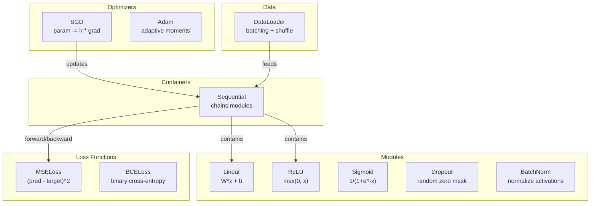
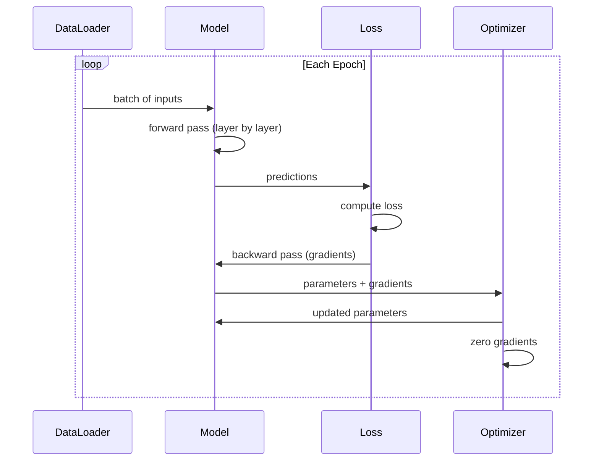
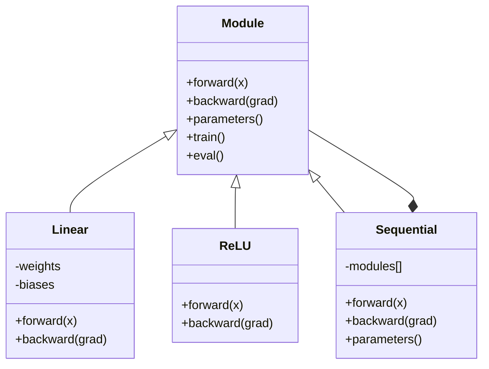

# Xây dựng khung hình nhỏ của riêng bạn

> Bạn đã xây dựng các tế bào thần kinh, các lớp, mạng lưới, backprop, kích hoạt, hàm mất mát, tối ưu hóa, quy định, khởi tạo, và lịch LR. tất cả như các mảnh riêng biệt. Bây giờ dây chúng cùng nhau vào một khung. không PyTorch. không TensorFlow. của bạn.

**Type:** Build
**Languages:** Python
**Prerequisites:** All of Phase 03 (Lessons 01-09)
**Time:** ~120 minutes

## Mục tiêu học tập

- Xây dựng một khung học sâu đầy đủ (~ 500 dòng) với Module, Linear, ReLU, Sigmoid, Dropout, BatchNorm, Sequential, hàm mất mát, tối ưu hóa và DataLoader
- Giải thích trừu tượng Module (trên, sau, các tham số) và lý do tại sao việc chuyển đổi chế độ tàu/từ là cần thiết
- Cụm tất cả các thành phần vào một vòng đào tạo làm việc đào tạo một mạng lưới 4 tầng về phân loại vòng tròn
- Bản đồ từng thành phần của framework của bạn với tương đương PyTorch của nó (nn.Module, nn.Sequential, optim.Adam, DataLoader)

## Vấn đề

Bạn có mười bài học về các khối xây dựng phân tán trên các tệp riêng biệt.`Value`lớp ở đây, vòng lặp đào tạo ở đó, khởi tạo trọng lượng trong một tập tin khác, lịch học tập ở một tập tin khác. để đào tạo một mạng, bạn sao chép-làm lại từ năm bài học khác nhau và dây chúng cùng nhau bằng tay.

Đó là những gì Framework giải quyết. PyTorch cho bạn`nn.Module`- `nn.Sequential`- `optim.Adam`- `DataLoader`TensorFlow cho bạn một mô hình vòng tập luyện liên kết chúng với nhau.`keras.Layer`- `keras.Sequential`- `keras.optimizers.Adam`Đây không phải là phép thuật, mà là những mô hình tổ chức cho phép xác định, đào tạo và đánh giá mạng lưới mà không phải luôn luôn tái tạo hệ thống ống nước.

Bạn sẽ xây dựng cùng một thứ trong khoảng 500 dòng Python. Không numpy. Không phụ thuộc bên ngoài. Một framework có thể xác định bất kỳ mạng feedforward nào, đào tạo nó với SGD hoặc Adam, tập hợp dữ liệu, áp dụng drop-out và batch normalization, sử dụng bất kỳ kích hoạt nào, và lên lịch tốc độ học tập.

Khi bạn hoàn thành, bạn sẽ hiểu chính xác những gì xảy ra khi bạn viết.`model = nn.Sequential(...)`Tại sao anh lại không biết được.`model.train()`và `model.eval()`Bạn sẽ hiểu tại sao.`optimizer.zero_grad()`Bạn sẽ hiểu tất cả, bởi vì bạn đã xây dựng tất cả.

## Khái niệm

### Phân tích mô-đun

Mỗi lớp trong PyTorch đều thừa hưởng từ`nn.Module`Một mô-đun có ba trách nhiệm:

1. **forward()**-- tính toán đầu ra đầu vào được cung cấp
2. **parameters()**- trả lại tất cả các trọng lượng có thể huấn luyện
3. **backward()**-- gradient tính toán (được xử lý bởi autograd trong PyTorch, rõ ràng trong của chúng tôi)

Một lớp tuyến tính là một mô-đun. Một kích hoạt ReLU là một mô-đun. Một lớp bỏ rơi là một mô-đun. Một lớp bình thường hóa lô là một mô-đun. Tất cả chúng đều có giao diện tương tự.

### Bộ chứa theo trình tự

`nn.Sequential`Các chuỗi Module. chuyển tiếp: dữ liệu cấp dữ liệu thông qua Module 1, sau đó Module 2, sau đó Module 3. chuyển tiếp ngược: đảo ngược chuỗi. Bảng chứa chính nó là một Module -- nó có forward(), tham số(), và ngược lại(). Đây là mô hình tổng hợp: một chuỗi Module chính nó là một Module.

### Cách đào tạo và cách đánh giá

Giảm học ngẫu nhiên phân số các tế bào thần kinh trong quá trình đào tạo nhưng vượt qua tất cả mọi thứ trong quá trình đánh giá.`train()`và `eval()`Các phương pháp chuyển đổi hành vi này.`training`cờ.

### Tối ưu hóa

Máy tối ưu hóa cập nhật các tham số bằng cách sử dụng gradient của chúng. SGD: `param -= lr * grad`Adam: duy trì ước tính động lực và biến động, sau đó cập nhật. Optimizer không biết về kiến trúc mạng - nó chỉ thấy một danh sách phẳng các tham số và gradient của chúng.

### DataLoader

Lưu tập hàng hóa quan trọng vì hai lý do: Thứ nhất, bạn không thể đặt toàn bộ bộ dữ liệu trong bộ nhớ cho các vấn đề lớn. Thứ hai, giảm độ phân tích nhỏ cung cấp tiếng ồn giúp thoát khỏi các mức tối thiểu địa phương.

### Thiết kế khung



### Lòng huấn luyện



### Đường bậc của mô-đun



```figure
gradient-clipping
```

## Hãy xây dựng nó

### Bước 1: Kiểu cơ sở mô-đun

Các giao diện trừu tượng mà mỗi lớp thực hiện.

```python
class Module:
    def __init__(self):
        self.training = True

    def forward(self, x):
        raise NotImplementedError

    def backward(self, grad):
        raise NotImplementedError

    def parameters(self):
        return []

    def train(self):
        self.training = True

    def eval(self):
        self.training = False
```

### Bước 2: Lớp tuyến tính

Các khối xây dựng cơ bản. lưu trữ trọng lượng và thiên vị, tính toán Wx + b về phía trước, và trọng lượng / sao lưu gradient ngược.

```python
import math
import random


class Linear(Module):
    def __init__(self, fan_in, fan_out):
        super().__init__()
        std = math.sqrt(2.0 / fan_in)
        self.weights = [[random.gauss(0, std) for _ in range(fan_in)] for _ in range(fan_out)]
        self.biases = [0.0] * fan_out
        self.weight_grads = [[0.0] * fan_in for _ in range(fan_out)]
        self.bias_grads = [0.0] * fan_out
        self.fan_in = fan_in
        self.fan_out = fan_out
        self.input = None

    def forward(self, x):
        self.input = x
        output = []
        for i in range(self.fan_out):
            val = self.biases[i]
            for j in range(self.fan_in):
                val += self.weights[i][j] * x[j]
            output.append(val)
        return output

    def backward(self, grad):
        input_grad = [0.0] * self.fan_in
        for i in range(self.fan_out):
            self.bias_grads[i] += grad[i]
            for j in range(self.fan_in):
                self.weight_grads[i][j] += grad[i] * self.input[j]
                input_grad[j] += grad[i] * self.weights[i][j]
        return input_grad

    def parameters(self):
        params = []
        for i in range(self.fan_out):
            for j in range(self.fan_in):
                params.append((self.weights, i, j, self.weight_grads))
            params.append((self.biases, i, None, self.bias_grads))
        return params
```

### Bước 3: Các mô-đun kích hoạt

ReLU, Sigmoid và Tanh là các mô-đun, mỗi mô-đun lưu trữ những gì nó cần cho việc đi ngược.

```python
class ReLU(Module):
    def __init__(self):
        super().__init__()
        self.mask = None

    def forward(self, x):
        self.mask = [1.0 if v > 0 else 0.0 for v in x]
        return [max(0.0, v) for v in x]

    def backward(self, grad):
        return [g * m for g, m in zip(grad, self.mask)]


class Sigmoid(Module):
    def __init__(self):
        super().__init__()
        self.output = None

    def forward(self, x):
        self.output = []
        for v in x:
            v = max(-500, min(500, v))
            self.output.append(1.0 / (1.0 + math.exp(-v)))
        return self.output

    def backward(self, grad):
        return [g * o * (1 - o) for g, o in zip(grad, self.output)]


class Tanh(Module):
    def __init__(self):
        super().__init__()
        self.output = None

    def forward(self, x):
        self.output = [math.tanh(v) for v in x]
        return self.output

    def backward(self, grad):
        return [g * (1 - o * o) for g, o in zip(grad, self.output)]
```

### Bước 4: Modul bỏ

Tự nhiên nạc các yếu tố trong quá trình đào tạo. Scale các yếu tố còn lại bằng 1/(1-p) vì vậy các giá trị mong đợi vẫn giống nhau. Không làm gì trong quá trình eval.

```python
class Dropout(Module):
    def __init__(self, p=0.5):
        super().__init__()
        self.p = p
        self.mask = None

    def forward(self, x):
        if not self.training:
            return x
        self.mask = [0.0 if random.random() < self.p else 1.0 / (1 - self.p) for _ in x]
        return [v * m for v, m in zip(x, self.mask)]

    def backward(self, grad):
        if self.mask is None:
            return grad
        return [g * m for g, m in zip(grad, self.mask)]
```

### Bước 5: Modul BatchNorm

Tiêu chuẩn hóa kích hoạt đến trung bình không và sự biến đổi đơn vị cho mỗi tính năng trên toàn bộ lô. Giữ lại thống kê chạy cho chế độ đánh giá.

```python
class BatchNorm(Module):
    def __init__(self, size, momentum=0.1, eps=1e-5):
        super().__init__()
        self.size = size
        self.gamma = [1.0] * size
        self.beta = [0.0] * size
        self.gamma_grads = [0.0] * size
        self.beta_grads = [0.0] * size
        self.running_mean = [0.0] * size
        self.running_var = [1.0] * size
        self.momentum = momentum
        self.eps = eps
        self.x_norm = None
        self.std_inv = None
        self.batch_input = None

    def forward_batch(self, batch):
        batch_size = len(batch)
        output_batch = []

        if self.training:
            mean = [0.0] * self.size
            for sample in batch:
                for j in range(self.size):
                    mean[j] += sample[j]
            mean = [m / batch_size for m in mean]

            var = [0.0] * self.size
            for sample in batch:
                for j in range(self.size):
                    var[j] += (sample[j] - mean[j]) ** 2
            var = [v / batch_size for v in var]

            self.std_inv = [1.0 / math.sqrt(v + self.eps) for v in var]

            self.x_norm = []
            self.batch_input = batch
            for sample in batch:
                normed = [(sample[j] - mean[j]) * self.std_inv[j] for j in range(self.size)]
                self.x_norm.append(normed)
                output = [self.gamma[j] * normed[j] + self.beta[j] for j in range(self.size)]
                output_batch.append(output)

            for j in range(self.size):
                self.running_mean[j] = (1 - self.momentum) * self.running_mean[j] + self.momentum * mean[j]
                self.running_var[j] = (1 - self.momentum) * self.running_var[j] + self.momentum * var[j]
        else:
            std_inv = [1.0 / math.sqrt(v + self.eps) for v in self.running_var]
            for sample in batch:
                normed = [(sample[j] - self.running_mean[j]) * std_inv[j] for j in range(self.size)]
                output = [self.gamma[j] * normed[j] + self.beta[j] for j in range(self.size)]
                output_batch.append(output)

        return output_batch

    def forward(self, x):
        result = self.forward_batch([x])
        return result[0]

    def backward(self, grad):
        if self.x_norm is None:
            return grad
        for j in range(self.size):
            self.gamma_grads[j] += self.x_norm[0][j] * grad[j]
            self.beta_grads[j] += grad[j]
        return [grad[j] * self.gamma[j] * self.std_inv[j] for j in range(self.size)]

    def parameters(self):
        params = []
        for j in range(self.size):
            params.append((self.gamma, j, None, self.gamma_grads))
            params.append((self.beta, j, None, self.beta_grads))
        return params
```

### Bước 6: Cụ thể

Các mô-đun chuỗi. Lên về phía trước từ trái sang phải, ngược lại từ phải sang trái.

```python
class Sequential(Module):
    def __init__(self, *modules):
        super().__init__()
        self.modules = list(modules)

    def forward(self, x):
        for module in self.modules:
            x = module.forward(x)
        return x

    def backward(self, grad):
        for module in reversed(self.modules):
            grad = module.backward(grad)
        return grad

    def parameters(self):
        params = []
        for module in self.modules:
            params.extend(module.parameters())
        return params

    def train(self):
        self.training = True
        for module in self.modules:
            module.train()

    def eval(self):
        self.training = False
        for module in self.modules:
            module.eval()
```

### Bước 7: Giảm chức năng

MSE và Binary Cross-Entropy. Mỗi trả lại giá trị mất và cung cấp một ngược (() trả lại gradient.

```python
class MSELoss:
    def __call__(self, predicted, target):
        self.predicted = predicted
        self.target = target
        n = len(predicted)
        self.loss = sum((p - t) ** 2 for p, t in zip(predicted, target)) / n
        return self.loss

    def backward(self):
        n = len(self.predicted)
        return [2 * (p - t) / n for p, t in zip(self.predicted, self.target)]


class BCELoss:
    def __call__(self, predicted, target):
        self.predicted = predicted
        self.target = target
        eps = 1e-7
        n = len(predicted)
        self.loss = 0
        for p, t in zip(predicted, target):
            p = max(eps, min(1 - eps, p))
            self.loss += -(t * math.log(p) + (1 - t) * math.log(1 - p))
        self.loss /= n
        return self.loss

    def backward(self):
        eps = 1e-7
        n = len(self.predicted)
        grads = []
        for p, t in zip(self.predicted, self.target):
            p = max(eps, min(1 - eps, p))
            grads.append((-t / p + (1 - t) / (1 - p)) / n)
        return grads
```

### Bước 8: SGD và Adam Optimizers

Cả hai đều lấy danh sách các tham số và cập nhật trọng lượng bằng cách sử dụng gradient.

```python
class SGD:
    def __init__(self, parameters, lr=0.01):
        self.params = parameters
        self.lr = lr

    def step(self):
        for container, i, j, grad_container in self.params:
            if j is not None:
                container[i][j] -= self.lr * grad_container[i][j]
            else:
                container[i] -= self.lr * grad_container[i]

    def zero_grad(self):
        for container, i, j, grad_container in self.params:
            if j is not None:
                grad_container[i][j] = 0.0
            else:
                grad_container[i] = 0.0


class Adam:
    def __init__(self, parameters, lr=0.001, beta1=0.9, beta2=0.999, eps=1e-8):
        self.params = parameters
        self.lr = lr
        self.beta1 = beta1
        self.beta2 = beta2
        self.eps = eps
        self.t = 0
        self.m = [0.0] * len(parameters)
        self.v = [0.0] * len(parameters)

    def step(self):
        self.t += 1
        for idx, (container, i, j, grad_container) in enumerate(self.params):
            if j is not None:
                g = grad_container[i][j]
            else:
                g = grad_container[i]

            self.m[idx] = self.beta1 * self.m[idx] + (1 - self.beta1) * g
            self.v[idx] = self.beta2 * self.v[idx] + (1 - self.beta2) * g * g

            m_hat = self.m[idx] / (1 - self.beta1 ** self.t)
            v_hat = self.v[idx] / (1 - self.beta2 ** self.t)

            update = self.lr * m_hat / (math.sqrt(v_hat) + self.eps)

            if j is not None:
                container[i][j] -= update
            else:
                container[i] -= update

    def zero_grad(self):
        for container, i, j, grad_container in self.params:
            if j is not None:
                grad_container[i][j] = 0.0
            else:
                grad_container[i] = 0.0
```

### Bước 9: DataLoader

Chia dữ liệu thành hàng, tùy chọn trộn mỗi thời đại.

```python
class DataLoader:
    def __init__(self, data, batch_size=32, shuffle=True):
        self.data = data
        self.batch_size = batch_size
        self.shuffle = shuffle

    def __iter__(self):
        indices = list(range(len(self.data)))
        if self.shuffle:
            random.shuffle(indices)
        for start in range(0, len(indices), self.batch_size):
            batch_indices = indices[start:start + self.batch_size]
            batch = [self.data[i] for i in batch_indices]
            inputs = [item[0] for item in batch]
            targets = [item[1] for item in batch]
            yield inputs, targets

    def __len__(self):
        return (len(self.data) + self.batch_size - 1) // self.batch_size
```

### Bước 10: Cải tạo mạng lưới 4 lớp về phân loại vòng tròn

Định nghĩa mô hình, chọn lỗ, chọn tối ưu hóa, chạy vòng huấn luyện.

```python
def make_circle_data(n=500, seed=42):
    random.seed(seed)
    data = []
    for _ in range(n):
        x = random.uniform(-2, 2)
        y = random.uniform(-2, 2)
        label = 1.0 if x * x + y * y < 1.5 else 0.0
        data.append(([x, y], [label]))
    return data


def train():
    random.seed(42)

    model = Sequential(
        Linear(2, 16),
        ReLU(),
        Linear(16, 16),
        ReLU(),
        Linear(16, 8),
        ReLU(),
        Linear(8, 1),
        Sigmoid(),
    )

    criterion = BCELoss()
    optimizer = Adam(model.parameters(), lr=0.01)

    data = make_circle_data(500)
    split = int(len(data) * 0.8)
    train_data = data[:split]
    test_data = data[split:]

    loader = DataLoader(train_data, batch_size=16, shuffle=True)

    model.train()

    for epoch in range(100):
        total_loss = 0
        total_correct = 0
        total_samples = 0

        for batch_inputs, batch_targets in loader:
            batch_loss = 0
            for x, t in zip(batch_inputs, batch_targets):
                pred = model.forward(x)
                loss = criterion(pred, t)
                batch_loss += loss

                optimizer.zero_grad()
                grad = criterion.backward()
                model.backward(grad)
                optimizer.step()

                predicted_class = 1.0 if pred[0] >= 0.5 else 0.0
                if predicted_class == t[0]:
                    total_correct += 1
                total_samples += 1

            total_loss += batch_loss

        avg_loss = total_loss / total_samples
        accuracy = total_correct / total_samples * 100

        if epoch % 10 == 0 or epoch == 99:
            print(f"Epoch {epoch:3d} | Loss: {avg_loss:.6f} | Train Accuracy: {accuracy:.1f}%")

    model.eval()
    correct = 0
    for x, t in test_data:
        pred = model.forward(x)
        predicted_class = 1.0 if pred[0] >= 0.5 else 0.0
        if predicted_class == t[0]:
            correct += 1
    test_accuracy = correct / len(test_data) * 100
    print(f"\nTest Accuracy: {test_accuracy:.1f}% ({correct}/{len(test_data)})")

    return model, test_accuracy
```

## Sử dụng nó

Đây là tương đương PyTorch của những gì bạn vừa xây dựng:

```python
import torch
import torch.nn as nn
from torch.utils.data import DataLoader, TensorDataset

model = nn.Sequential(
    nn.Linear(2, 16),
    nn.ReLU(),
    nn.Linear(16, 16),
    nn.ReLU(),
    nn.Linear(16, 8),
    nn.ReLU(),
    nn.Linear(8, 1),
    nn.Sigmoid(),
)

criterion = nn.BCELoss()
optimizer = torch.optim.Adam(model.parameters(), lr=0.01)

for epoch in range(100):
    model.train()
    for inputs, targets in dataloader:
        optimizer.zero_grad()
        predictions = model(inputs)
        loss = criterion(predictions, targets)
        loss.backward()
        optimizer.step()

    model.eval()
    with torch.no_grad():
        test_predictions = model(test_inputs)
```

Cấu trúc giống nhau.`Sequential`- `Linear`- `ReLU`- `Sigmoid`- `BCELoss`- `Adam`- `zero_grad`- `backward`- `step`- `train`- `eval`Phân biệt là PyTorch xử lý tự động (không cần phải thực hiện ngược lại) trong mỗi mô-đun, chạy trên GPU, và đã được tối ưu hóa trong nhiều năm.

Khi bạn nhìn thấy mã PyTorch, bạn biết chính xác những gì đang xảy ra ở mỗi dòng.

## Chuyển nó

Bài học này mang lại:
- `outputs/prompt-framework-architect.md`-- một lời nhắc để thiết kế kiến trúc mạng thần kinh sử dụng trừu tượng khung

## Các bài tập

1. Thêm một `SoftmaxCrossEntropyLoss`lớp để phân loại đa lớp. Softmax dự đoán, tính toán mất tích entropy chéo, và xử lý kết hợp ngược đi. kiểm tra nó trên một tập dữ liệu xoắn ốc 3 lớp.

2. Thực hiện lập trình tốc độ học tập trong trình tối ưu hóa: thêm một `set_lr()`phương pháp và dây trong lịch trình cosine từ Bài học 09. Tập phân loại vòng tròn bằng warmup + cosine và so sánh với LR liên tục.

3. Thêm một `save()`và `load()`phương pháp để theo dõi mà tập trung tất cả các trọng lượng vào một tệp JSON và tải chúng lại.

4. Thực hiện giảm cân (L2 quy định) trong tối ưu hóa Adam.`weight_decay`- Đánh giá: - Đánh giá: - Đánh giá: - Đánh giá:

5. Thay thế vòng đào tạo mỗi mẫu bằng tích lũy gradient mini-batch thích hợp: tích lũy gradient trên tất cả các mẫu trong một lô, sau đó chia theo kích thước lô và thực hiện một bước tối ưu hóa.

## Các điều khoản chính

| Term | What people say | What it actually means |
|------|----------------|----------------------|
| Module | "A layer" | The base abstraction in a framework -- anything with forward(), backward(), and parameters() |
| Sequential | "Stack layers in order" | A container that chains modules, applying them in sequence for forward and reverse for backward |
| Forward pass | "Run the network" | Computing the output by passing input through each module in order |
| Backward pass | "Compute gradients" | Propagating the loss gradient through each module in reverse to compute parameter gradients |
| Parameters | "The trainable weights" | All values in the network that the optimizer can update -- weights and biases |
| Optimizer | "The thing that updates weights" | An algorithm that uses gradients to update parameters, implementing SGD, Adam, or other rules |
| DataLoader | "The thing that feeds data" | An iterator that splits a dataset into batches, optionally shuffling between epochs |
| Training mode | "model.train()" | A flag that enables stochastic behavior like dropout and batch normalization with batch stats |
| Evaluation mode | "model.eval()" | A flag that disables dropout and uses running statistics for batch normalization |
| Zero grad | "Clear the gradients" | Resetting all parameter gradients to zero before computing the next batch's gradients |

## Đọc thêm

- Paszke et al., "PyTorch: Một phong cách bắt buộc, High-Performance Deep Learning Library" (2019) -- bài báo mô tả các quyết định thiết kế của PyTorch
- Chollet, "Depth Learning with Python, Second Edition" (2021) - Chương 3 bao gồm nội bộ Keras với mô-đun / lớp trừu tượng tương tự
- Johnson, "Tiny-DNN" (https://github.com/tiny-dnn/tiny-dnn) -- một khung học sâu C++ chỉ có tiêu đề để hiểu nội bộ khung
