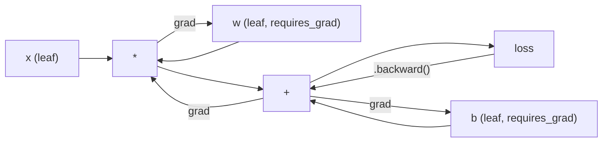
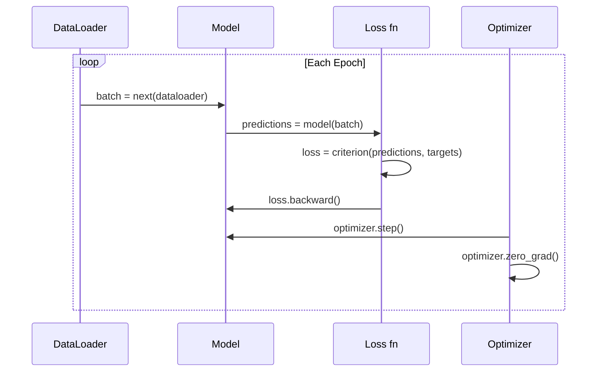

# Khởi đầu về PyTorch

> Anh đã chế tạo động cơ từ đống nhựa và crankshafts.

**Type:** Build
**Languages:** Python
**Prerequisites:** Lesson 03.10 (Build Your Own Mini Framework)
**Time:** ~75 minutes

## Mục tiêu học tập

- Xây dựng và đào tạo mạng thần kinh bằng cách sử dụng PyTorch nn.Module, nn.Sequential và autograd
- Sử dụng các tensor PyTorch, tăng tốc GPU và vòng tròn huấn luyện tiêu chuẩn (zero_grad, tiến, mất, trở lại, bước)
- Chuyển đổi các thành phần khung mini của bạn từ đầu thành các tương đương PyTorch của chúng
- Tự hình và so sánh tốc độ đào tạo giữa khung Python thuần túy của bạn và PyTorch trên cùng một nhiệm vụ

## Vấn đề

Bạn có một framework mini hoạt động. Lớp tuyến tính, ReLU, dropout, batch standard, Adam, DataLoader, một vòng tròn đào tạo. Nó đào tạo một mạng lưới 4 lớp về vấn đề phân loại vòng tròn trong Python tinh khiết.

Nó cũng chậm hơn 500 lần so với PyTorch trên cùng một vấn đề.

Phụ thể của bạn xử lý một mẫu một lần với các vòng Python đinh. PyTorch gửi các hoạt động tương tự đến các hạt nhân C ++ / CUDA tối ưu hóa chạy trên GPU. Trên một NVIDIA A100, PyTorch đào tạo ResNet-50 (25,6M tham số) trên ImageNet (1.28M hình ảnh) trong khoảng 6 giờ. Phụ thể của bạn sẽ mất khoảng 3.000 giờ cho cùng một nhiệm vụ - nếu nó không hết bộ nhớ trước.

Tốc độ không phải là khoảng cách duy nhất. Khung của bạn không có hỗ trợ GPU. Không có phân biệt tự động - bạn đã viết ngược lại với mỗi mô-đun. Không có phân phối. Không có đào tạo phân tán. Không có độ chính xác hỗn hợp. Không có cách để gỡ lỗi dòng chảy gradient mà không có tuyên bố in.

PyTorch lấp đầy từng khoảng trống này. và nó làm như vậy trong khi giữ nguyên mô hình tâm lý chính xác mà bạn đã xây dựng: Module, forward(), parameters(), backward(), optimizer.step(). Các khái niệm chuyển giao một đến một.

## Khái niệm

### Tại sao PyTorch thắng

Năm 2015, TensorFlow yêu cầu bạn xác định một biểu đồ tính toán tĩnh trước khi chạy bất cứ thứ gì. Bạn xây dựng biểu đồ, biên soạn nó, sau đó cung cấp dữ liệu thông qua nó. Debugging có nghĩa là nhìn vào hình ảnh biểu đồ. Thay đổi kiến trúc có nghĩa là xây dựng lại biểu đồ từ đầu.

PyTorch được ra mắt vào năm 2017 với một triết lý khác: thực hiện đầy nhiệt tình. Bạn viết Python. Nó chạy ngay lập tức. `y = model(x)`thực sự tính toán y ngay bây giờ, không phải "chúng thêm một nút vào một biểu đồ sẽ tính toán y sau này". Điều này có nghĩa là công cụ gỡ lỗi Python tiêu chuẩn đã hoạt động. print() đã hoạt động. pdb đã hoạt động. nếu / khác trong quá trình chuyển tiếp của bạn đã hoạt động.

Đến năm 2020, thị trường đã nói lên. Phổ phần của PyTorch trong các bài báo nghiên cứu ML đã tăng từ 7% (2017) lên hơn 75% (2022). Meta, Google DeepMind, OpenAI, Anthropic và Hugging Face đều sử dụng PyTorch như là khung chính của họ. TensorFlow 2.x đã chấp nhận thực hiện nhiệt tình để đáp ứng - sự thừa nhận ngầm rằng thiết kế của PyTorch là đúng.

Bài học: các nhà phát triển trải nghiệm hợp chất. Một framework chậm hơn 10% nhưng nhanh hơn 50% để debug thắng mỗi lần.

### Các tensor

Một tensor là một mảng đa chiều với ba tính chất quan trọng: hình dạng, dtype và thiết bị.

```python
import torch

x = torch.zeros(3, 4)           # shape: (3, 4), dtype: float32, device: cpu
x = torch.randn(2, 3, 224, 224) # batch of 2 RGB images, 224x224
x = torch.tensor([1, 2, 3])     # from a Python list
```

**Shape**là chiều kích. Một hình dáng là hình (), một vector là (n,), một matrix là (m, n), một loạt hình ảnh là (những bộ, kênh, chiều cao, chiều rộng).

**Dtype**điều khiển độ chính xác và bộ nhớ.

| dtype | Bits | Range | Use case |
|-------|------|-------|----------|
| float32 | 32 | ~7 decimal digits | Default training |
| float16 | 16 | ~3.3 decimal digits | Mixed precision |
| bfloat16 | 16 | Same range as float32, less precision | LLM training |
| int8 | 8 | -128 to 127 | Quantized inference |

**Device**xác định nơi tính toán xảy ra.

```python
device = torch.device("cuda" if torch.cuda.is_available() else "cpu")
x = torch.randn(3, 4, device=device)
x = x.to("cuda")
x = x.cpu()
```

Mỗi hoạt động đòi hỏi tất cả các tensor trên cùng một thiết bị. Đây là lỗi # 1 PyTorch bắt đầu hit: `RuntimeError: Expected all tensors to be on the same device`Hãy sửa nó bằng cách chuyển mọi thứ sang cùng một thiết bị trước khi tính toán.

**Reshaping**là thời gian liên tục -- nó thay đổi metadata, không phải dữ liệu.

```python
x = torch.randn(2, 3, 4)
x.view(2, 12)      # reshape to (2, 12) -- must be contiguous
x.reshape(6, 4)    # reshape to (6, 4) -- works always
x.permute(2, 0, 1) # reorder dimensions
x.unsqueeze(0)     # add dimension: (1, 2, 3, 4)
x.squeeze()        # remove size-1 dimensions
```

### Autograd

Phụ thể mini của bạn yêu cầu bạn thực hiện ngược lại cho mỗi mô-đun. PyTorch không. Nó ghi lại mọi hoạt động trên các tensor vào một biểu đồ đường trục trục hướng ( biểu đồ tính toán) và sau đó đi qua biểu đồ đó ngược lại để tính toán gradient tự động.



Sự khác biệt chính từ khung của bạn: PyTorch sử dụng tự động hóa dựa trên băng. Mỗi hoạt động được thêm vào một "băng" trong quá trình đi trước.`.backward()`quay lại băng ngược lại.

```python
x = torch.randn(3, requires_grad=True)
y = x ** 2 + 3 * x
z = y.sum()
z.backward()
print(x.grad)  # dz/dx = 2x + 3
```

Ba quy tắc của tự cấp:

1. Chỉ có các tensor lá với `requires_grad=True`gradient tích lũy
2. Các gradient tích lũy theo mặc định -- gọi `optimizer.zero_grad()`trước mỗi lần đi ngược
3. `torch.no_grad()`Thiết lập các phương pháp theo dõi gradient (được sử dụng trong quá trình đánh giá)

### nn.Mô-đun

`nn.Module`là lớp cơ sở cho mỗi thành phần mạng thần kinh trong PyTorch. Bạn đã xây dựng trừu tượng này trong Bài học 10. Phiên bản của PyTorch thêm đăng ký tham số tự động, khám phá mô-đun tái tạo, quản lý thiết bị và định nghĩa trạng thái.

```python
import torch.nn as nn

class MLP(nn.Module):
    def __init__(self, input_dim, hidden_dim, output_dim):
        super().__init__()
        self.layer1 = nn.Linear(input_dim, hidden_dim)
        self.relu = nn.ReLU()
        self.layer2 = nn.Linear(hidden_dim, output_dim)

    def forward(self, x):
        x = self.layer1(x)
        x = self.relu(x)
        x = self.layer2(x)
        return x
```

Khi bạn chỉ định một`nn.Module`hoặc `nn.Parameter`như một thuộc tính trong `__init__`PyTorch sẽ tự động ghi lại nó.`model.parameters()`Đây là lý do tại sao bạn không bao giờ phải tự thu thập trọng lượng như bạn đã làm trong khung mini.

Các khối xây dựng chính:

| Module | What it does | Parameters |
|--------|-------------|------------|
| nn.Linear(in, out) | Wx + b | in*out + out |
| nn.Conv2d(in_ch, out_ch, k) | 2D convolution | in_ch*out_ch*k*k + out_ch |
| nn.BatchNorm1d(features) | Normalize activations | 2 * features |
| nn.Dropout(p) | Random zeroing | 0 |
| nn.ReLU() | max(0, x) | 0 |
| nn.GELU() | Gaussian error linear | 0 |
| nn.Embedding(vocab, dim) | Lookup table | vocab * dim |
| nn.LayerNorm(dim) | Per-sample normalization | 2 * dim |

### Các chức năng mất và Optimizers

PyTorch sẽ đưa ra các phiên bản sẵn sàng sản xuất của mọi thứ mà bạn đã xây dựng.

**Loss functions**(từ `torch.nn`):

| Loss | Task | Input |
|------|------|-------|
| nn.MSELoss() | Regression | Any shape |
| nn.CrossEntropyLoss() | Multi-class classification | Logits (not softmax) |
| nn.BCEWithLogitsLoss() | Binary classification | Logits (not sigmoid) |
| nn.L1Loss() | Regression (robust) | Any shape |
| nn.CTCLoss() | Sequence alignment | Log probabilities |

Lưu ý: `CrossEntropyLoss`kết hợp`LogSoftmax`+ `NLLLoss`thông qua logits nguyên liệu, không phải đầu ra softmax. Đây là một sai lầm phổ biến mà sản xuất gradient sai âm thầm.

**Optimizers**(từ `torch.optim`):

| Optimizer | When to use | Typical LR |
|-----------|-------------|-----------|
| SGD(params, lr, momentum) | CNNs, well-tuned pipelines | 0.01--0.1 |
| Adam(params, lr) | Default starting point | 1e-3 |
| AdamW(params, lr, weight_decay) | Transformers, fine-tuning | 1e-4--1e-3 |
| LBFGS(params) | Small-scale, second-order | 1.0 |

### Lòng huấn luyện

Mỗi vòng huấn luyện PyTorch đều theo cùng một mô hình 5 bước.



Mô hình kinh điển:

```python
for epoch in range(num_epochs):
    model.train()
    for inputs, targets in train_loader:
        inputs, targets = inputs.to(device), targets.to(device)
        optimizer.zero_grad()
        outputs = model(inputs)
        loss = criterion(outputs, targets)
        loss.backward()
        optimizer.step()
```

5 dòng trong vòng tròn hàng loạt, 5 dòng huấn luyện GPT-4, Stable Diffusion và LLaMA, kiến trúc thay đổi, dữ liệu thay đổi, 5 dòng này không thay đổi.

### Dataset và DataLoader

PyTorch's `Dataset`là một lớp trừu tượng với hai phương pháp: `__len__`và `__getitem__`- `DataLoader`gói nó với batching, shuffling, và tải dữ liệu đa quy trình.

```python
from torch.utils.data import Dataset, DataLoader

class MNISTDataset(Dataset):
    def __init__(self, images, labels):
        self.images = images
        self.labels = labels

    def __len__(self):
        return len(self.labels)

    def __getitem__(self, idx):
        return self.images[idx], self.labels[idx]

loader = DataLoader(dataset, batch_size=64, shuffle=True, num_workers=4)
```

`num_workers=4`tạo ra 4 quá trình để tải dữ liệu song song trong khi GPU đào tạo trên loạt hiện tại.

### Đào tạo GPU

Chuyển mô hình sang GPU:

```python
device = torch.device("cuda" if torch.cuda.is_available() else "cpu")
model = model.to(device)
```

Điều này chuyển từng tham số và bộ đệm sang GPU.

```python
inputs, targets = inputs.to(device), targets.to(device)
```

**Mixed precision**Giảm sử dụng bộ nhớ một nửa và tăng gấp đôi thông suất trên các GPU hiện đại (A100, H100, RTX 4090) bằng cách chạy về phía trước/lại trong float16 trong khi giữ trọng lượng chủ trong float32:

```python
from torch.amp import autocast, GradScaler

scaler = GradScaler()
for inputs, targets in loader:
    with autocast(device_type="cuda"):
        outputs = model(inputs)
        loss = criterion(outputs, targets)
    scaler.scale(loss).backward()
    scaler.step(optimizer)
    scaler.update()
    optimizer.zero_grad()
```

### So sánh: Mini Framework vs PyTorch vs JAX

| Feature | Mini Framework (L10) | PyTorch | JAX |
|---------|---------------------|---------|-----|
| Autodiff | Manual backward() | Tape-based autograd | Functional transforms |
| Execution | Eager (Python loops) | Eager (C++ kernels) | Traced + JIT compiled |
| GPU support | No | Yes (CUDA, ROCm, MPS) | Yes (CUDA, TPU) |
| Speed (MNIST MLP) | ~300s/epoch | ~0.5s/epoch | ~0.3s/epoch |
| Module system | Custom Module class | nn.Module | Stateless functions (Flax/Equinox) |
| Debugging | print() | print(), pdb, breakpoint() | Harder (JIT tracing breaks print) |
| Ecosystem | None | Hugging Face, Lightning, timm | Flax, Optax, Orbax |
| Learning curve | You built it | Moderate | Steep (functional paradigm) |
| Production use | Toy problems | Meta, OpenAI, Anthropic, HF | Google DeepMind, Midjourney |

```figure
dropout-mask
```

## Hãy xây dựng nó

Một MLP 3 tầng được đào tạo trên MNIST chỉ sử dụng nguyên thủy PyTorch. Không bao bì cấp cao.`torchvision.datasets`Chúng tôi tự tải xuống và phân tích dữ liệu thô.

### Bước 1: Lắp MNIST từ các tệp nguyên liệu

MNIST được gửi dưới dạng 4 tệp gzip: hình ảnh đào tạo (60.000 x 28 x 28), nhãn đào tạo, hình ảnh thử nghiệm (10.000 x 28 x 28), nhãn thử nghiệm. Chúng tôi tải xuống chúng và phân tích định dạng nhị phân.

```python
import torch
import torch.nn as nn
import struct
import gzip
import urllib.request
import os

def download_mnist(path="./mnist_data"):
    base_url = "https://storage.googleapis.com/cvdf-datasets/mnist/"
    files = [
        "train-images-idx3-ubyte.gz",
        "train-labels-idx1-ubyte.gz",
        "t10k-images-idx3-ubyte.gz",
        "t10k-labels-idx1-ubyte.gz",
    ]
    os.makedirs(path, exist_ok=True)
    for f in files:
        filepath = os.path.join(path, f)
        if not os.path.exists(filepath):
            urllib.request.urlretrieve(base_url + f, filepath)

def load_images(filepath):
    with gzip.open(filepath, "rb") as f:
        magic, num, rows, cols = struct.unpack(">IIII", f.read(16))
        data = f.read()
        images = torch.frombuffer(bytearray(data), dtype=torch.uint8)
        images = images.reshape(num, rows * cols).float() / 255.0
    return images

def load_labels(filepath):
    with gzip.open(filepath, "rb") as f:
        magic, num = struct.unpack(">II", f.read(8))
        data = f.read()
        labels = torch.frombuffer(bytearray(data), dtype=torch.uint8).long()
    return labels
```

### Bước 2: Định nghĩa mô hình

Một MLP 3 tầng: 784 -> 256 -> 128 -> 10. ReLU hoạt động. Thả để điều chỉnh. Không có quy tắc hàng để giữ cho nó đơn giản.

```python
class MNISTModel(nn.Module):
    def __init__(self):
        super().__init__()
        self.net = nn.Sequential(
            nn.Linear(784, 256),
            nn.ReLU(),
            nn.Dropout(0.2),
            nn.Linear(256, 128),
            nn.ReLU(),
            nn.Dropout(0.2),
            nn.Linear(128, 10),
        )

    def forward(self, x):
        return self.net(x)
```

Lớp đầu ra tạo ra 10 logit nguyên liệu (một trong mỗi chữ số). Không có softmax -- `CrossEntropyLoss`xử lý nội bộ.

Số lượng tham số: 784*256 + 256 + 256*128 + 128 + 128*10 + 10 = 235.146.

### Bước 3: Lòng huấn luyện

Mô hình tiến-thất-đến lại-đến lại.

```python
def train_one_epoch(model, loader, criterion, optimizer, device):
    model.train()
    total_loss = 0
    correct = 0
    total = 0
    for images, labels in loader:
        images, labels = images.to(device), labels.to(device)
        optimizer.zero_grad()
        outputs = model(images)
        loss = criterion(outputs, labels)
        loss.backward()
        optimizer.step()
        total_loss += loss.item() * images.size(0)
        _, predicted = outputs.max(1)
        correct += predicted.eq(labels).sum().item()
        total += labels.size(0)
    return total_loss / total, correct / total


def evaluate(model, loader, criterion, device):
    model.eval()
    total_loss = 0
    correct = 0
    total = 0
    with torch.no_grad():
        for images, labels in loader:
            images, labels = images.to(device), labels.to(device)
            outputs = model(images)
            loss = criterion(outputs, labels)
            total_loss += loss.item() * images.size(0)
            _, predicted = outputs.max(1)
            correct += predicted.eq(labels).sum().item()
            total += labels.size(0)
    return total_loss / total, correct / total
```

Lưu ý `torch.no_grad()`Khi sử dụng máy tính để phân tích, PyTorch sẽ tạo ra một biểu đồ tính toán mà bạn không bao giờ sử dụng.

### Bước 4: Kết nối mọi thứ

```python
def main():
    device = torch.device("cuda" if torch.cuda.is_available() else "cpu")

    download_mnist()
    train_images = load_images("./mnist_data/train-images-idx3-ubyte.gz")
    train_labels = load_labels("./mnist_data/train-labels-idx1-ubyte.gz")
    test_images = load_images("./mnist_data/t10k-images-idx3-ubyte.gz")
    test_labels = load_labels("./mnist_data/t10k-labels-idx1-ubyte.gz")

    train_dataset = torch.utils.data.TensorDataset(train_images, train_labels)
    test_dataset = torch.utils.data.TensorDataset(test_images, test_labels)
    train_loader = torch.utils.data.DataLoader(
        train_dataset, batch_size=64, shuffle=True
    )
    test_loader = torch.utils.data.DataLoader(
        test_dataset, batch_size=256, shuffle=False
    )

    model = MNISTModel().to(device)
    criterion = nn.CrossEntropyLoss()
    optimizer = torch.optim.Adam(model.parameters(), lr=1e-3)

    num_params = sum(p.numel() for p in model.parameters())
    print(f"Device: {device}")
    print(f"Parameters: {num_params:,}")
    print(f"Train samples: {len(train_dataset):,}")
    print(f"Test samples: {len(test_dataset):,}")
    print()

    for epoch in range(10):
        train_loss, train_acc = train_one_epoch(
            model, train_loader, criterion, optimizer, device
        )
        test_loss, test_acc = evaluate(
            model, test_loader, criterion, device
        )
        print(
            f"Epoch {epoch+1:2d} | "
            f"Train Loss: {train_loss:.4f} | Train Acc: {train_acc:.4f} | "
            f"Test Loss: {test_loss:.4f} | Test Acc: {test_acc:.4f}"
        )

    torch.save(model.state_dict(), "mnist_mlp.pt")
    print(f"\nModel saved to mnist_mlp.pt")
    print(f"Final test accuracy: {test_acc:.4f}")
```

Tạo ra dự kiến sau 10 thời kỳ: ~ 97,8% độ chính xác thử nghiệm. Thời gian đào tạo trên CPU: ~ 30 giây. Trên GPU: ~ 5 giây. Trên khung mini của bạn với kiến trúc tương tự: ~ 45 phút.

## Sử dụng nó

### So sánh nhanh: Mini Framework vs PyTorch

| Mini Framework (Lesson 10) | PyTorch |
|---------------------------|---------|
| `model = Sequential(Linear(784, 256), ReLU(), ...)` | `model = nn.Sequential(nn.Linear(784, 256), nn.ReLU(), ...)` |
| `pred = model.forward(x)` | `pred = model(x)` |
| `optimizer.zero_grad()` | `optimizer.zero_grad()` |
| `grad = criterion.backward()` then `model.backward(grad)` | `loss.backward()` |
| `optimizer.step()` | `optimizer.step()` |
| No GPU | `model.to("cuda")` |
| Manual backward for every module | Autograd handles everything |

Giao diện gần giống nhau, sự khác biệt là mọi thứ dưới nắp.

### Tiết kiệm và tải mô hình

```python
torch.save(model.state_dict(), "model.pt")

model = MNISTModel()
model.load_state_dict(torch.load("model.pt", weights_only=True))
model.eval()
```

Luôn tiết kiệm`state_dict()`(the parameter dictionary), không phải đối tượng mô hình. lưu đối tượng mô hình sử dụng mỳ, mà phá vỡ khi bạn refactor code.

### Lập trình học tập

```python
scheduler = torch.optim.lr_scheduler.CosineAnnealingLR(
    optimizer, T_max=10
)
for epoch in range(10):
    train_one_epoch(model, train_loader, criterion, optimizer, device)
    scheduler.step()
```

PyTorch cung cấp 15 chương trình lên lịch: StepLR, ExponentialLR, CosineAnnealingLR, OneCycleLR, ReduceLROnPlateau. Tất cả được kết nối vào cùng một giao diện tối ưu hóa.

## Chuyển nó

Bài học này tạo ra hai đồ tạo vật:

- `outputs/prompt-pytorch-debugger.md`-- một lời nhắc để chẩn đoán các thất bại tập luyện PyTorch phổ biến
- `outputs/skill-pytorch-patterns.md`-- một tài liệu tham khảo kỹ năng cho các mô hình đào tạo PyTorch

## Các bài tập

1. **Add batch normalization.**Nhập `nn.BatchNorm1d`Sau mỗi lớp tuyến tính (trước khi kích hoạt). So sánh độ chính xác thử nghiệm và tốc độ đào tạo so với phiên bản chỉ ngừng hoạt động.

2. **Implement a learning rate finder.**Trình luyện cho một thời đại với tốc độ học tập tăng theo cấp số (từ 1e-7 đến 1.0).

3. **Port to GPU with mixed precision.**Thêm `torch.amp.autocast`và `GradScaler`để vòng đào tạo. đo thông qua (chọn mẫu/ giây) với và không có độ chính xác hỗn hợp trên GPU.

4. **Build a custom Dataset.**Tải xuống Fashion-MNIST (tương tự như MNIST nhưng với các mặt hàng quần áo).`FashionMNISTDataset(Dataset)`lớp với `__getitem__`và `__len__`- Tập luyện cùng một MLP và so sánh độ chính xác.

5. **Replace Adam with SGD + momentum.**Đào tàu với `SGD(params, lr=0.01, momentum=0.9)`So sánh đường cong hội tụ.`CosineAnnealingLR`và xem SGD có bắt kịp Adam vào thời kỳ 10.

## Các điều khoản chính

| Term | What people say | What it actually means |
|------|----------------|----------------------|
| Tensor | "A multi-dimensional array" | A typed, device-aware array with automatic differentiation support baked into every operation |
| Autograd | "Automatic backprop" | A tape-based system that records operations during forward pass, then replays them in reverse to compute exact gradients |
| nn.Module | "A layer" | The base class for any differentiable computation block -- registers parameters, supports nesting, handles train/eval modes |
| state_dict | "The model weights" | An OrderedDict mapping parameter names to tensors -- the portable, serializable representation of a trained model |
| .backward() | "Compute gradients" | Traverse the computational graph in reverse, computing and accumulating gradients for every leaf tensor with requires_grad=True |
| .to(device) | "Move to GPU" | Recursively transfer all parameters and buffers to the specified device (CPU, CUDA, MPS) |
| DataLoader | "The data pipeline" | An iterator that batches, shuffles, and optionally parallelizes data loading from a Dataset |
| Mixed precision | "Use float16" | Train with float16 forward/backward for speed while keeping float32 master weights for numerical stability |
| Eager execution | "Run it now" | Operations execute immediately when called, not deferred to a later compilation step -- the core design choice that differentiates PyTorch from TF 1.x |
| zero_grad | "Reset gradients" | Set all parameter gradients to zero before the next backward pass, since PyTorch accumulates gradients by default |

## Đọc thêm

- Paszke et al., "PyTorch: Một phong cách bắt buộc, High-Performance Deep Learning Library" (2019) -- bài báo ban đầu giải thích các thương lượng thiết kế của PyTorch
- Các hướng dẫn PyTorch: "Giáo dục PyTorch với ví dụ" (https://pytorch.org/tutorials/beginner/pytorch_with_examples.html) -- đường chính thức từ tensor đến nn.Module
- PyTorch Performance Tuning Guide (https://pytorch.org/tutorials/recipes/recipes/tuning_guide.html) -- độ chính xác hỗn hợp, nhân viên DataLoader, bộ nhớ gắn kết và các tối ưu hóa sản xuất khác
- Horace He, "Make Deep Learning Go Brrrr" (Tạo học sâu trở thành một sự phát triển mạnh mẽ)https://horace.io/brrr_intro.html) -- tại sao đào tạo GPU là nhanh chóng, với các chiến lược tối ưu hóa cụ thể của PyTorch
