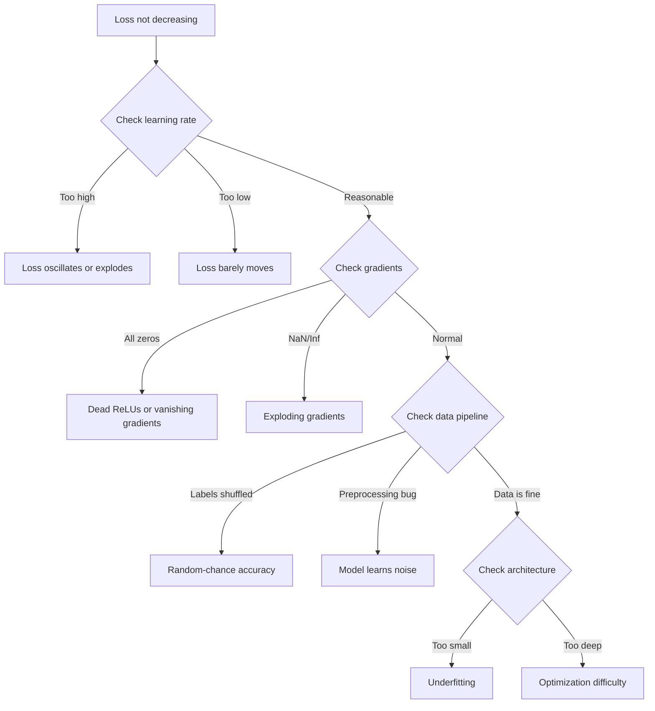
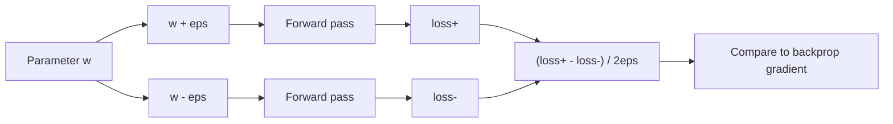
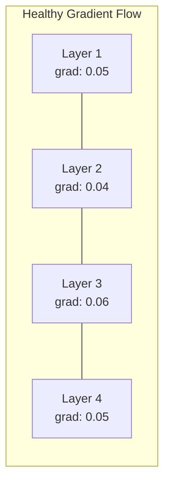
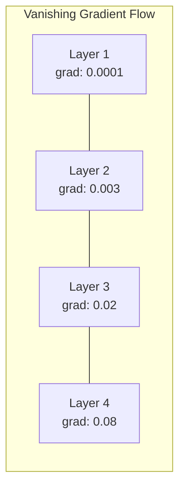
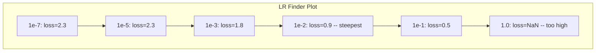

# Giải quyết các mạng thần kinh

> mạng của bạn được biên soạn. nó chạy. nó tạo ra một số. số không đúng và không có gì bị hỏng. chào mừng đến với loại lỗi khắc nghiệt nhất - loại mà không có thông báo lỗi.

**Type:** Build
**Languages:** Python, PyTorch
**Prerequisites:** Phase 03 Lessons 01-10 (especially backpropagation, loss functions, optimizers)
**Time:** ~90 minutes

## Mục tiêu học tập

- Chẩn đoán các lỗi mạng thần kinh phổ biến (sự mất NaN, đường cong mất phẳng, quá phù hợp, dao động) bằng cách sử dụng các chiến lược gỡ lỗi có hệ thống
- Sử dụng kỹ thuật "overfit one batch" để xác minh rằng kiến trúc mô hình và vòng đào tạo của bạn là đúng
- Kiểm tra quy mô gradient, phân phối kích hoạt và chuẩn trọng lượng để xác định các vấn đề gradient biến mất/bùng nổ
- Xây dựng danh sách kiểm tra gỡ lỗi bao gồm các vấn đề về đường ống dữ liệu, kiến trúc mô hình, chức năng mất mát, tối ưu hóa và tốc độ học tập

## Vấn đề

Phần mềm truyền thống bị hỏng khi bị hỏng. Một chỉ số không có tính năng tạo ra ngoại lệ. Một sự không phù hợp kiểu không thành công trong thời gian biên soạn. Một lỗi không theo một tạo ra một đầu ra rõ ràng sai.

Các mạng thần kinh không mang lại cho bạn sự sang trọng đó.

Một mạng thần kinh bị hỏng chạy đến khi hoàn thành, in một giá trị mất mát, và đưa ra dự đoán. Sự mất mát có thể giảm đi. Những dự đoán có vẻ hợp lý. Nhưng mô hình này là sai lầm lặng lẽ - học các đường tắt, ghi nhớ tiếng ồn, hoặc hội tụ với một mức tối thiểu địa phương vô dụng. Các nhà nghiên cứu của Google ước tính rằng 60-70% thời gian gỡ lỗi ML được dành cho các lỗi "hư lặng" không tạo ra lỗi nhưng làm suy giảm chất lượng mô hình.

Sự khác biệt giữa mô hình làm việc và mô hình bị hỏng thường là một dòng bị hỏng: một dòng bị thiếu `zero_grad()`, một chiều hướng được chuyển thể, tốc độ học tập giảm 10x. Công thức "Dịch thức đào tạo mạng thần kinh" (2019) bắt đầu với điều này: "Những lỗi mạng thần kinh phổ biến nhất là lỗi không bị sập".

Bài học này dạy bạn tìm những con bọ đó.

## Khái niệm

### Tầm nghĩ sai lầm

Hãy quên đi việc khắc phục lỗi in và pray. Việc khắc phục lỗi mạng thần kinh đòi hỏi phải có một cách tiếp cận có hệ thống vì vòng lặp phản hồi chậm (từ vài phút đến vài giờ mỗi lần tập luyện) và các triệu chứng không rõ ràng (sự mất mát xấu có thể có nghĩa là 20 điều khác nhau).

Quy tắc vàng:**start simple, add complexity one piece at a time, and verify each piece independently.**



### Bệnh 1: Khối mất không giảm

Đây là lời phàn nàn phổ biến nhất: vòng đào tạo chạy, thời đại trôi qua, và sự mất mát vẫn còn bằng hoặc dao động hoang dã.

**Wrong learning rate.**Đối với Adam, bắt đầu từ 1e-3. Đối với SGD, bắt đầu từ 1e-1 hoặc 1e-2. Luôn thử 3 tỷ lệ học tập trải dài 10 lần mỗi lần (ví dụ, 1e-2, 1e-3, 1e-4) trước khi kết luận rằng điều gì đó khác là sai.

**Dead ReLUs.**Nếu một tế bào thần kinh ReLU nhận được một đầu vào tiêu cực lớn, nó sẽ phát ra 0 và gradient của nó là 0. Nó không bao giờ hoạt động lại. Nếu đủ tế bào thần kinh chết, mạng không thể học. Kiểm tra: in phần nhỏ của các hoạt động chính xác là 0 sau mỗi lớp ReLU. Nếu > 50% đã chết, hãy chuyển sang LeakyReLU hoặc giảm tốc độ học tập.

**Vanishing gradients.**Trong các mạng sâu với kích hoạt sigmoid hoặc tanh, gradient thu hẹp theo cấp số khi chúng lan rộng ngược. Khi chúng đạt đến lớp đầu tiên, chúng là ~0.

**Exploding gradients.**Vấn đề ngược lại - gradient tăng theo tốc độ tăng trưởng. phổ biến trong RNN và mạng rất sâu. Loss nhảy lên NaN.`torch.nn.utils.clip_grad_norm_`), giảm tốc độ học tập, hoặc thêm bình thường hóa.

### Bệnh 2: Lượng mất giảm nhưng mô hình xấu

Sự chính xác của bài tập đạt 99%, nhưng độ chính xác của thử nghiệm là 55%. hoặc mô hình tạo ra kết quả vô nghĩa trên dữ liệu thực.

**Overfitting.**Mô hình ghi nhớ dữ liệu đào tạo thay vì các mô hình học tập. Khoảng cách giữa đào tạo và mất xác nhận tăng theo thời gian.

**Data leakage.**Dữ liệu thử nghiệm bị rò rỉ vào đào tạo. Độ chính xác là đáng ngờ cao. Nguyên nhân phổ biến: trộn trước khi chia, xử lý trước với thống kê từ bộ dữ liệu đầy đủ, sao chép mẫu trên các chia.

**Label errors.**5-10% nhãn trong hầu hết các tập dữ liệu thực là sai (Northcutt et al., 2021 -- "Lỗi nhãn phổ biến trong các tập thử nghiệm"). mô hình học tiếng ồn. sửa chữa: sử dụng học tập tự tin để tìm và sửa chữa các ví dụ có nhãn sai, hoặc sử dụng cắt giảm lỗ để bỏ qua các mẫu mất mát cao.

### triệu chứng 3: NaN hoặc Inf trong mất mát

Giá trị mất mát trở thành `nan`hoặc `inf`- Trình luyện đã chết.

**Learning rate too high.**Các bản cập nhật cấp độ vượt quá mức trọng lượng nổ.

**log(0) or log(negative).**Các tính toán mất tích entropy chéo `log(p)`Nếu mô hình của bạn xuất ra chính xác 0 hoặc một xác suất âm, nhật ký nổ.`[eps, 1-eps]`nơi `eps=1e-7`- Tôi không biết.

**Division by zero.**Phân hợp hợp chuẩn hóa chia bằng lệch chuẩn. Một nhóm với giá trị liên tục có std=0. Fix: thêm epsilon vào tên gọi (PyTorch làm điều này theo mặc định, nhưng các thực hiện tùy chỉnh có thể không).

**Numerical overflow.**Các hoạt động lớn được đưa vào `exp()`sản xuất Inf. Softmax đặc biệt dễ bị mắc. Fix: trừ tối đa trước khi tăng trưởng (truc log-sum-exp).

### Kỹ thuật 1: Kiểm tra độ

So sánh gradient phân tích của bạn (từ backprop) với gradient số (từ các khác biệt hữu hạn). Nếu họ không đồng ý, thông qua ngược của bạn có một lỗi.

Tốc độ số cho tham số `w`- Có thể là:

```
grad_numerical = (loss(w + eps) - loss(w - eps)) / (2 * eps)
```

Tỷ lệ hợp đồng (các khác biệt tương đối):

```
rel_diff = |grad_analytical - grad_numerical| / max(|grad_analytical|, |grad_numerical|, 1e-8)
```

Nếu`rel_diff < 1e-5`: đúng. Nếu `rel_diff > 1e-3`Có lẽ là một con bọ.



### Kỹ thuật 2: Thống kê hoạt động

Theo dõi trung bình và lệch chuẩn của các hoạt động sau mỗi lớp trong quá trình đào tạo.

| Health indicator | Mean | Std | Diagnosis |
|-----------------|------|-----|-----------|
| Healthy | ~0 | ~1 | Network is learning normally |
| Saturated | >>0 or <<0 | ~0 | Activations stuck at extreme values |
| Dead | 0 | 0 | Neurons are dead (all zeros) |
| Exploding | >>10 | >>10 | Activations growing without bound |

### Kỹ thuật 3: Khán hình lưu lượng theo cấp

Bước vẽ là độ lớn gradient trung bình cho mỗi lớp. Trong một mạng lưới khỏe mạnh, độ lớn gradient nên tương tự trên các lớp. Nếu các lớp đầu có độ gradient nhỏ hơn 1000 lần so với các lớp sau, bạn có độ gradient biến mất.





### Kỹ thuật 4: Kiểm tra Overfit-One-Batch

Kỹ thuật sửa lỗi quan trọng nhất trong học tập sâu.

Hãy lấy một lô nhỏ (8-32 mẫu). Tập luyện trên nó cho 100 lần lặp lại. Lỗ phí sẽ đi đến gần bằng không và độ chính xác tập luyện sẽ đạt 100%. Nếu không, mô hình hoặc vòng tập luyện của bạn có một lỗi cơ bản - không tiến hành đào tạo đầy đủ.

Kiểm tra này bắt được:
- Các hàm mất tích bị phá vỡ
- Các đường đi ngược bị phá vỡ
- Kiến trúc quá nhỏ để đại diện cho dữ liệu
- Máy tối ưu hóa không kết nối với các tham số mô hình
- Dữ liệu và nhãn không phù hợp

Điều này mất 30 giây để chạy và tiết kiệm nhiều giờ để gỡ lỗi các chạy đào tạo đầy đủ.

### Kỹ thuật 5: Tìm kiếm tốc độ học tập

Leslie Smith (2017) đề xuất xóa tỷ lệ học tập từ rất nhỏ (1e-7) sang rất lớn (10) trong một thời đại trong khi ghi lại sự mất mát.



LR tốt nhất trong ví dụ này: ~1e-3 (một thứ tự kích thước trước điểm thẳm nhất).

### Những con bọ PyTorch phổ biến

Đây là những con bọ lãng phí nhiều giờ tập thể nhất trong cộng đồng PyTorch:

| Bug | Symptom | Fix |
|-----|---------|-----|
| Forgetting `optimizer.zero_grad()` | Gradients accumulate across batches, loss oscillates | Add `optimizer.zero_grad()` before `loss.backward()` |
| Forgetting `model.eval()` at test time | Dropout and batch norm behave differently, test accuracy varies between runs | Add `model.eval()` and `torch.no_grad()` |
| Wrong tensor shapes | Silent broadcasting produces wrong results, no error | Print shapes after every operation during debugging |
| CPU/GPU mismatch | `RuntimeError: expected CUDA tensor` | Use `.to(device)` on model AND data |
| Not detaching tensors | Computation graph grows forever, OOM | Use `.detach()` or `with torch.no_grad()` |
| In-place operations breaking autograd | `RuntimeError: modified by in-place operation` | Replace `x += 1` with `x = x + 1` |
| Data not normalized | Loss stuck at random-chance level | Normalize inputs to mean=0, std=1 |
| Labels as wrong dtype | Cross-entropy expects `Long`, got `Float` | Cast labels: `labels.long()` |

### Bảng giải lỗi chính

| Symptom | Likely cause | First thing to try |
|---------|-------------|-------------------|
| Loss stuck at -log(1/num_classes) | Model predicting uniform distribution | Check data pipeline, verify labels match inputs |
| Loss NaN after a few steps | Learning rate too high | Reduce LR by 10x |
| Loss NaN immediately | log(0) or division by zero | Add epsilon to log/division operations |
| Loss oscillating wildly | LR too high or batch size too small | Reduce LR, increase batch size |
| Loss decreasing then plateaus | LR too high for fine-tuning phase | Add LR schedule (cosine or step decay) |
| Training acc high, test acc low | Overfitting | Add dropout, weight decay, more data |
| Training acc = test acc = chance | Model not learning anything | Run overfit-one-batch test |
| Training acc = test acc but both low | Underfitting | Bigger model, more layers, more features |
| Gradients all zero | Dead ReLUs or detached computation graph | Switch to LeakyReLU, check `.requires_grad` |
| Out of memory during training | Batch too large or graph not freed | Reduce batch size, use `torch.no_grad()` for eval |

```figure
learning-curves
```

## Hãy xây dựng nó

Một bộ công cụ chẩn đoán theo dõi các đường cong kích hoạt, gradient và mất mát. Bạn sẽ cố ý phá vỡ một mạng và sử dụng bộ công cụ để chẩn đoán từng vấn đề.

### Bước 1: Kiểu NetworkDebugger

Hook vào mô hình PyTorch để ghi lại hoạt động và số liệu thống kê gradient cho mỗi lớp.

```python
import torch
import torch.nn as nn
import math


class NetworkDebugger:
    def __init__(self, model):
        self.model = model
        self.activation_stats = {}
        self.gradient_stats = {}
        self.loss_history = []
        self.lr_losses = []
        self.hooks = []
        self._register_hooks()

    def _register_hooks(self):
        for name, module in self.model.named_modules():
            if isinstance(module, (nn.Linear, nn.Conv2d, nn.ReLU, nn.LeakyReLU)):
                hook = module.register_forward_hook(self._make_activation_hook(name))
                self.hooks.append(hook)
                hook = module.register_full_backward_hook(self._make_gradient_hook(name))
                self.hooks.append(hook)

    def _make_activation_hook(self, name):
        def hook(module, input, output):
            with torch.no_grad():
                out = output.detach().float()
                self.activation_stats[name] = {
                    "mean": out.mean().item(),
                    "std": out.std().item(),
                    "fraction_zero": (out == 0).float().mean().item(),
                    "min": out.min().item(),
                    "max": out.max().item(),
                }
        return hook

    def _make_gradient_hook(self, name):
        def hook(module, grad_input, grad_output):
            if grad_output[0] is not None:
                with torch.no_grad():
                    grad = grad_output[0].detach().float()
                    self.gradient_stats[name] = {
                        "mean": grad.mean().item(),
                        "std": grad.std().item(),
                        "abs_mean": grad.abs().mean().item(),
                        "max": grad.abs().max().item(),
                    }
        return hook

    def record_loss(self, loss_value):
        self.loss_history.append(loss_value)

    def check_loss_health(self):
        if len(self.loss_history) < 2:
            return "NOT_ENOUGH_DATA"
        recent = self.loss_history[-10:]
        if any(math.isnan(v) or math.isinf(v) for v in recent):
            return "NAN_OR_INF"
        if len(self.loss_history) >= 20:
            first_half = sum(self.loss_history[:10]) / 10
            second_half = sum(self.loss_history[-10:]) / 10
            if second_half >= first_half * 0.99:
                return "NOT_DECREASING"
        if len(recent) >= 5:
            diffs = [recent[i+1] - recent[i] for i in range(len(recent)-1)]
            if max(diffs) - min(diffs) > 2 * abs(sum(diffs) / len(diffs)):
                return "OSCILLATING"
        return "HEALTHY"

    def check_activations(self):
        issues = []
        for name, stats in self.activation_stats.items():
            if stats["fraction_zero"] > 0.5:
                issues.append(f"DEAD_NEURONS: {name} has {stats['fraction_zero']:.0%} zero activations")
            if abs(stats["mean"]) > 10:
                issues.append(f"EXPLODING_ACTIVATIONS: {name} mean={stats['mean']:.2f}")
            if stats["std"] < 1e-6:
                issues.append(f"COLLAPSED_ACTIVATIONS: {name} std={stats['std']:.2e}")
        return issues if issues else ["HEALTHY"]

    def check_gradients(self):
        issues = []
        grad_magnitudes = []
        for name, stats in self.gradient_stats.items():
            grad_magnitudes.append((name, stats["abs_mean"]))
            if stats["abs_mean"] < 1e-7:
                issues.append(f"VANISHING_GRADIENT: {name} abs_mean={stats['abs_mean']:.2e}")
            if stats["abs_mean"] > 100:
                issues.append(f"EXPLODING_GRADIENT: {name} abs_mean={stats['abs_mean']:.2e}")
        if len(grad_magnitudes) >= 2:
            first_mag = grad_magnitudes[0][1]
            last_mag = grad_magnitudes[-1][1]
            if last_mag > 0 and first_mag / last_mag > 100:
                issues.append(f"GRADIENT_RATIO: first/last = {first_mag/last_mag:.0f}x (vanishing)")
        return issues if issues else ["HEALTHY"]

    def print_report(self):
        print("\n=== NETWORK DEBUGGER REPORT ===")
        print(f"\nLoss health: {self.check_loss_health()}")
        if self.loss_history:
            print(f"  Last 5 losses: {[f'{v:.4f}' for v in self.loss_history[-5:]]}")
        print("\nActivation diagnostics:")
        for item in self.check_activations():
            print(f"  {item}")
        print("\nGradient diagnostics:")
        for item in self.check_gradients():
            print(f"  {item}")
        print("\nPer-layer activation stats:")
        for name, stats in self.activation_stats.items():
            print(f"  {name}: mean={stats['mean']:.4f} std={stats['std']:.4f} zero={stats['fraction_zero']:.1%}")
        print("\nPer-layer gradient stats:")
        for name, stats in self.gradient_stats.items():
            print(f"  {name}: abs_mean={stats['abs_mean']:.2e} max={stats['max']:.2e}")

    def remove_hooks(self):
        for hook in self.hooks:
            hook.remove()
        self.hooks.clear()
```

### Bước 2: Kiểm tra Overfit-One-Batch

```python
def overfit_one_batch(model, x_batch, y_batch, criterion, lr=0.01, steps=200):
    optimizer = torch.optim.Adam(model.parameters(), lr=lr)
    model.train()
    print("\n=== OVERFIT ONE BATCH TEST ===")
    print(f"Batch size: {x_batch.shape[0]}, Steps: {steps}")

    for step in range(steps):
        optimizer.zero_grad()
        output = model(x_batch)
        loss = criterion(output, y_batch)
        loss.backward()
        optimizer.step()

        if step % 50 == 0 or step == steps - 1:
            with torch.no_grad():
                preds = (output > 0).float() if output.shape[-1] == 1 else output.argmax(dim=1)
                targets = y_batch if y_batch.dim() == 1 else y_batch.squeeze()
                acc = (preds.squeeze() == targets).float().mean().item()
            print(f"  Step {step:3d} | Loss: {loss.item():.6f} | Accuracy: {acc:.1%}")

    final_loss = loss.item()
    if final_loss > 0.1:
        print(f"\n  FAIL: Loss did not converge ({final_loss:.4f}). Model or training loop is broken.")
        return False
    print(f"\n  PASS: Loss converged to {final_loss:.6f}")
    return True
```

### Bước 3: Tìm kiếm tỷ lệ học tập

```python
def find_learning_rate(model, x_data, y_data, criterion, start_lr=1e-7, end_lr=10, steps=100):
    import copy
    original_state = copy.deepcopy(model.state_dict())
    optimizer = torch.optim.SGD(model.parameters(), lr=start_lr)
    lr_mult = (end_lr / start_lr) ** (1 / steps)

    model.train()
    results = []
    best_loss = float("inf")
    current_lr = start_lr

    print("\n=== LEARNING RATE FINDER ===")

    for step in range(steps):
        optimizer.zero_grad()
        output = model(x_data)
        loss = criterion(output, y_data)

        if math.isnan(loss.item()) or loss.item() > best_loss * 10:
            break

        best_loss = min(best_loss, loss.item())
        results.append((current_lr, loss.item()))

        loss.backward()
        optimizer.step()

        current_lr *= lr_mult
        for param_group in optimizer.param_groups:
            param_group["lr"] = current_lr

    model.load_state_dict(original_state)

    if len(results) < 10:
        print("  Could not complete LR sweep -- loss diverged too quickly")
        return results

    min_loss_idx = min(range(len(results)), key=lambda i: results[i][1])
    suggested_lr = results[max(0, min_loss_idx - 10)][0]

    print(f"  Swept {len(results)} steps from {start_lr:.0e} to {results[-1][0]:.0e}")
    print(f"  Minimum loss {results[min_loss_idx][1]:.4f} at lr={results[min_loss_idx][0]:.2e}")
    print(f"  Suggested learning rate: {suggested_lr:.2e}")

    return results
```

### Bước 4: Kiểm tra độ

```python
def _flat_to_multi_index(flat_idx, shape):
    multi_idx = []
    remaining = flat_idx
    for dim in reversed(shape):
        multi_idx.insert(0, remaining % dim)
        remaining //= dim
    return tuple(multi_idx)


def gradient_check(model, x, y, criterion, eps=1e-4):
    model.train()
    x_double = x.double()
    y_double = y.double()
    model_double = model.double()

    print("\n=== GRADIENT CHECK ===")
    overall_max_diff = 0
    checked = 0

    for name, param in model_double.named_parameters():
        if not param.requires_grad:
            continue

        layer_max_diff = 0

        model_double.zero_grad()
        output = model_double(x_double)
        loss = criterion(output, y_double)
        loss.backward()
        analytical_grad = param.grad.clone()

        num_checks = min(5, param.numel())
        for i in range(num_checks):
            idx = _flat_to_multi_index(i, param.shape)
            original = param.data[idx].item()

            param.data[idx] = original + eps
            with torch.no_grad():
                loss_plus = criterion(model_double(x_double), y_double).item()

            param.data[idx] = original - eps
            with torch.no_grad():
                loss_minus = criterion(model_double(x_double), y_double).item()

            param.data[idx] = original

            numerical = (loss_plus - loss_minus) / (2 * eps)
            analytical = analytical_grad[idx].item()

            denom = max(abs(numerical), abs(analytical), 1e-8)
            rel_diff = abs(numerical - analytical) / denom

            layer_max_diff = max(layer_max_diff, rel_diff)
            checked += 1

        overall_max_diff = max(overall_max_diff, layer_max_diff)
        status = "OK" if layer_max_diff < 1e-5 else "MISMATCH"
        print(f"  {name}: max_rel_diff={layer_max_diff:.2e} [{status}]")

    model.float()

    print(f"\n  Checked {checked} parameters")
    if overall_max_diff < 1e-5:
        print("  PASS: Gradients match (rel_diff < 1e-5)")
    elif overall_max_diff < 1e-3:
        print("  WARN: Small differences (1e-5 < rel_diff < 1e-3)")
    else:
        print("  FAIL: Gradient mismatch detected (rel_diff > 1e-3)")
    return overall_max_diff
```

### Bước 5: Các mạng lưới bị phá vỡ cố ý

Bây giờ áp dụng bộ công cụ cho các mạng bị hỏng và chẩn đoán từng mạng.

```python
def demo_broken_networks():
    torch.manual_seed(42)
    x = torch.randn(64, 10)
    y = (x[:, 0] > 0).long()

    print("\n" + "=" * 60)
    print("BUG 1: Learning rate too high (lr=10)")
    print("=" * 60)
    model1 = nn.Sequential(nn.Linear(10, 32), nn.ReLU(), nn.Linear(32, 2))
    debugger1 = NetworkDebugger(model1)
    optimizer1 = torch.optim.SGD(model1.parameters(), lr=10.0)
    criterion = nn.CrossEntropyLoss()
    for step in range(20):
        optimizer1.zero_grad()
        out = model1(x)
        loss = criterion(out, y)
        debugger1.record_loss(loss.item())
        loss.backward()
        optimizer1.step()
    debugger1.print_report()
    debugger1.remove_hooks()

    print("\n" + "=" * 60)
    print("BUG 2: Dead ReLUs from bad initialization")
    print("=" * 60)
    model2 = nn.Sequential(nn.Linear(10, 32), nn.ReLU(), nn.Linear(32, 32), nn.ReLU(), nn.Linear(32, 2))
    with torch.no_grad():
        for m in model2.modules():
            if isinstance(m, nn.Linear):
                m.weight.fill_(-1.0)
                m.bias.fill_(-5.0)
    debugger2 = NetworkDebugger(model2)
    optimizer2 = torch.optim.Adam(model2.parameters(), lr=1e-3)
    for step in range(50):
        optimizer2.zero_grad()
        out = model2(x)
        loss = criterion(out, y)
        debugger2.record_loss(loss.item())
        loss.backward()
        optimizer2.step()
    debugger2.print_report()
    debugger2.remove_hooks()

    print("\n" + "=" * 60)
    print("BUG 3: Missing zero_grad (gradients accumulate)")
    print("=" * 60)
    model3 = nn.Sequential(nn.Linear(10, 32), nn.ReLU(), nn.Linear(32, 2))
    debugger3 = NetworkDebugger(model3)
    optimizer3 = torch.optim.SGD(model3.parameters(), lr=0.01)
    for step in range(50):
        out = model3(x)
        loss = criterion(out, y)
        debugger3.record_loss(loss.item())
        loss.backward()
        optimizer3.step()
    debugger3.print_report()
    debugger3.remove_hooks()

    print("\n" + "=" * 60)
    print("HEALTHY NETWORK: Correct setup for comparison")
    print("=" * 60)
    model_good = nn.Sequential(nn.Linear(10, 32), nn.ReLU(), nn.Linear(32, 2))
    debugger_good = NetworkDebugger(model_good)
    optimizer_good = torch.optim.Adam(model_good.parameters(), lr=1e-3)
    for step in range(50):
        optimizer_good.zero_grad()
        out = model_good(x)
        loss = criterion(out, y)
        debugger_good.record_loss(loss.item())
        loss.backward()
        optimizer_good.step()
    debugger_good.print_report()
    debugger_good.remove_hooks()

    print("\n" + "=" * 60)
    print("OVERFIT-ONE-BATCH TEST (healthy model)")
    print("=" * 60)
    model_test = nn.Sequential(nn.Linear(10, 32), nn.ReLU(), nn.Linear(32, 2))
    overfit_one_batch(model_test, x[:8], y[:8], criterion)

    print("\n" + "=" * 60)
    print("LEARNING RATE FINDER")
    print("=" * 60)
    model_lr = nn.Sequential(nn.Linear(10, 32), nn.ReLU(), nn.Linear(32, 2))
    find_learning_rate(model_lr, x, y, criterion)

    print("\n" + "=" * 60)
    print("GRADIENT CHECK")
    print("=" * 60)
    model_grad = nn.Sequential(nn.Linear(10, 8), nn.ReLU(), nn.Linear(8, 2))
    gradient_check(model_grad, x[:4], y[:4], criterion)
```

## Sử dụng nó

### PyTorch Built-in Tools

```python
import torch
import torch.nn as nn

model = nn.Sequential(
    nn.Linear(768, 256),
    nn.ReLU(),
    nn.Linear(256, 10),
)

with torch.autograd.detect_anomaly():
    output = model(input_tensor)
    loss = criterion(output, target)
    loss.backward()

for name, param in model.named_parameters():
    if param.grad is not None:
        print(f"{name}: grad_mean={param.grad.abs().mean():.2e}")
```

### Tích hợp trọng lượng & phân biệt đối xử

```python
import wandb

wandb.init(project="debug-training")

for epoch in range(100):
    loss = train_one_epoch()
    wandb.log({
        "loss": loss,
        "lr": optimizer.param_groups[0]["lr"],
        "grad_norm": torch.nn.utils.clip_grad_norm_(model.parameters(), float("inf")),
    })

    for name, param in model.named_parameters():
        if param.grad is not None:
            wandb.log({f"grad/{name}": wandb.Histogram(param.grad.cpu().numpy())})
```

### TensorBoard

```python
from torch.utils.tensorboard import SummaryWriter

writer = SummaryWriter("runs/debug_experiment")

for epoch in range(100):
    loss = train_one_epoch()
    writer.add_scalar("Loss/train", loss, epoch)

    for name, param in model.named_parameters():
        writer.add_histogram(f"weights/{name}", param, epoch)
        if param.grad is not None:
            writer.add_histogram(f"gradients/{name}", param.grad, epoch)
```

### Danh sách kiểm tra sửa lỗi (trước khi đào tạo đầy đủ)

1. Làm thử nghiệm quá phù hợp với một loạt, nếu nó thất bại, dừng lại.
2. Bác bản tổng kết mô hình -- xác minh số lượng tham số là hợp lý.
3. Thực hiện một lần đi trước với dữ liệu ngẫu nhiên -- kiểm tra hình dạng đầu ra.
4. Đào tàu 5 thời đại -- xác minh mất mát giảm.
5. Kiểm tra số liệu hoạt động không có lớp chết, không có vụ nổ.
6. Kiểm tra dòng chảy gradient - không biến mất, không nổ.
7. Kiểm tra đường ống dữ liệu -- in 5 mẫu ngẫu nhiên với nhãn.

## Chuyển nó

Bài học này mang lại:
- `outputs/prompt-nn-debugger.md`-- một lời nhắc để chẩn đoán các thất bại đào tạo mạng thần kinh
- `outputs/skill-debug-checklist.md`-- một danh sách kiểm tra cây quyết định cho các vấn đề đào tạo debugging

Các mô hình triển khai chính để gỡ lỗi:
- Thêm các cái nén giám sát vào các kịch bản đào tạo sản xuất
- Lập nhật ký hoạt động và thống kê gradient đến W&B hoặc TensorBoard mỗi bước N
- Thực hiện các cảnh báo tự động cho mất NaN, các tế bào thần kinh chết (> 80% không) hoặc vụ nổ gradient
- Luôn chạy thử nghiệm overfit-one-batch khi thay đổi kiến trúc hoặc đường ống dữ liệu

## Các bài tập

1. **Add an exploding gradient detector.**Thay đổi `NetworkDebugger`để phát hiện khi gradient vượt quá ngưỡng và tự động gợi ý giá trị cắt gradient.

2. **Build a dead neuron resurrector.**Viết một hàm xác định các tế bào thần kinh ReLU chết (luôn ra 0) và khởi động lại trọng lượng tiếp cận của chúng bằng cách khởi động Kaiming.

3. **Implement the learning rate finder with plotting.**Tăng `find_learning_rate`để lưu kết quả như một CSV và viết một kịch bản riêng biệt đọc CSV và hiển thị đường cong LR vs mất bằng cách sử dụng matplotlib.

4. **Create a data pipeline validator.**Viết một hàm kiểm tra: sao chép mẫu trên các phân chia tàu/ thử nghiệm, mất cân bằng phân phối nhãn (> tỷ lệ 10:1), bình thường hóa đầu vào (tương đương gần 0, std gần 1), và giá trị NaN/Inf trong dữ liệu.

5. **Debug a real failure.**Hãy lấy khuôn khổ nhỏ từ Bài học 10, giới thiệu một lỗi tinh tế (ví dụ, chuyển giao các khối lượng tử liệu ngược), và sử dụng kiểm tra gradient để xác định chính xác tham số nào có gradient sai.

## Các điều khoản chính

| Term | What people say | What it actually means |
|------|----------------|----------------------|
| Silent bug | "It runs but gives bad results" | A bug that produces no error but degrades model quality -- the dominant failure mode in ML |
| Dead ReLU | "The neurons died" | A ReLU neuron whose input is always negative, so it outputs 0 and receives 0 gradient permanently |
| Vanishing gradients | "Early layers stop learning" | Gradients shrink exponentially through layers, making weights in early layers effectively frozen |
| Exploding gradients | "Loss went to NaN" | Gradients grow exponentially through layers, causing weight updates so large they overflow |
| Gradient checking | "Verify backprop is correct" | Comparing analytical gradients from backprop to numerical gradients from finite differences |
| Overfit-one-batch | "The most important debug test" | Training on a single small batch to verify the model CAN learn -- if it cannot, something is fundamentally broken |
| LR finder | "Sweep to find the right learning rate" | Exponentially increasing the learning rate over one epoch and picking the rate just before loss diverges |
| Data leakage | "Test data leaked into training" | When information from the test set contaminates training, producing artificially high accuracy |
| Activation statistics | "Monitor layer health" | Tracking mean, std, and zero-fraction of each layer's output to detect dead, saturated, or exploding neurons |
| Gradient clipping | "Cap the gradient magnitude" | Scaling gradients down when their norm exceeds a threshold, preventing exploding gradient updates |

## Đọc thêm

- Smith, "Tỷ lệ học tập chu kỳ cho đào tạo mạng thần kinh" (2017) - bài báo giới thiệu bài kiểm tra phạm vi học tập (LR finder)
- Northcutt et al., "Những lỗi nhãn phổ biến trong các bộ thử nghiệm làm mất ổn định các tiêu chuẩn học máy" (2021) -- chứng minh rằng 3-6% các tiêu chuẩn trong ImageNet, CIFAR-10, và các tiêu chuẩn chính khác là sai
- Zhang et al., "Giả sử học sâu đòi hỏi phải suy nghĩ lại về tổng quát" (2017) - bài báo cho thấy các mạng thần kinh có thể ghi nhớ các nhãn ngẫu nhiên, đó là lý do tại sao quá phù hợp một loạt thử nghiệm hoạt động
- Tài liệu PyTorch về `torch.autograd.detect_anomaly`và `torch.autograd.set_detect_anomaly`cho việc phát hiện NaN/Inf tích hợp
