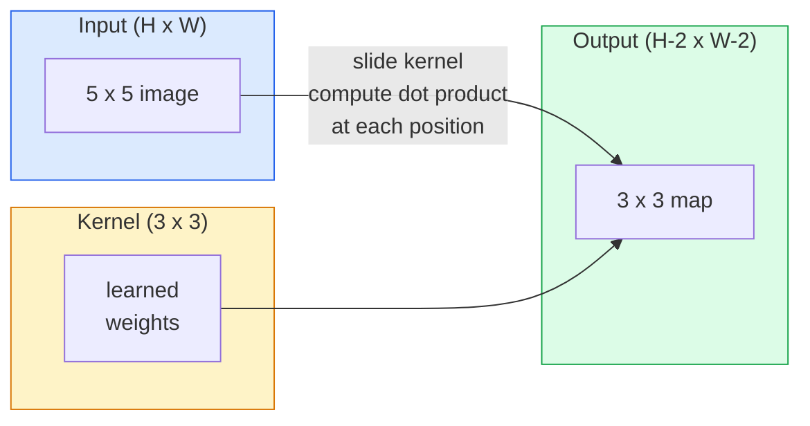
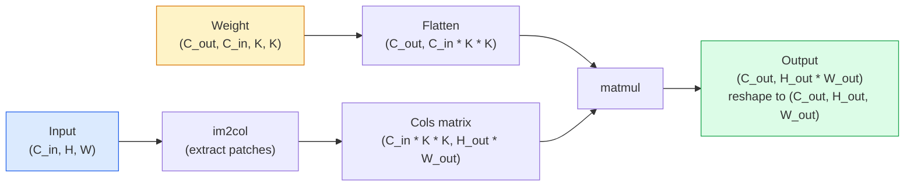

# Chuyển đổi từ không

> Một convolution là một lớp dày đặc nhỏ mà bạn trượt qua một hình ảnh, chia sẻ cùng một trọng lượng ở mọi vị trí.

**Type:** Build
**Languages:** Python
**Prerequisites:** Phase 3 (Deep Learning Core), Phase 4 Lesson 01 (Image Fundamentals)
**Time:** ~75 minutes

## Mục tiêu học tập

- Thực hiện convolution 2D từ đầu chỉ sử dụng NumPy, bao gồm phiên bản vòng tròn tổ và một vectorized `im2col`phiên bản
- Xét kích thước không gian đầu ra cho bất kỳ kết hợp nào của kích thước đầu vào, kích thước hạt nhân, lấp đầy và bước, và biện minh cho `(H - K + 2P) / S + 1`công thức
- Các hạt nhân thiết kế bằng tay (đàn, mờ, sắc nét, Sobel) và giải thích tại sao mỗi hạt tạo ra mô hình kích hoạt nó thực hiện
- Các cúi vây đệm vào một bộ khai thác tính năng và kết nối độ sâu của đệm với kích thước của trường thụ thể

## Vấn đề

Một lớp kết nối hoàn toàn trên hình ảnh RGB 224x224 sẽ cần 224 * 224 * 3 = 150.528 trọng lượng đầu vào mỗi tế bào thần kinh. Một lớp ẩn duy nhất với 1.000 đơn vị đã có 150 triệu tham số trước khi bạn đã học được bất cứ điều gì hữu ích. Tệ hơn, lớp đó không có ý tưởng rằng một con chó ở phía trên bên trái và một con chó ở phía dưới bên phải là mô hình tương tự. Nó xử lý mọi vị trí pixel như độc lập, điều này hoàn toàn sai đối với hình ảnh: dịch một con mèo bằng ba pixel không nên buộc mạng lưới học lại khái niệm.

Hai tính chất mà mô hình hình ảnh cần là **translation equivariance**(tức năng xuất phát thay đổi khi input thay đổi) và **parameter sharing**(chính xác tính năng cùng chạy khắp mọi nơi) các lớp dày đặc cho bạn không cho.

Convolution không được phát minh ra cho việc học sâu. Nó là cùng một hoạt động cung cấp năng lượng cho nén JPEG, mờ Gaussian trong Photoshop, phát hiện cạnh trong tầm nhìn công nghiệp và mọi bộ lọc âm thanh đã từng được xuất khẩu. Lý do CNN thống trị ImageNet từ năm 2012 đến năm 2020 là convolution là tiền lệ chính xác cho dữ liệu nơi các giá trị gần đó có liên quan và mô hình tương tự có thể xuất hiện ở bất cứ đâu.

## Khái niệm

### Một hạt nhân, trượt

Một sự xoay quanh 2D lấy một khối lượng nhỏ được gọi là hạt nhân (hoặc bộ lọc), trượt nó qua đầu vào, và tại mỗi vị trí tính toán tổng số các sản phẩm thông minh về các yếu tố.



Ví dụ cụ thể 3x3 trên đầu vào 5x5 (không đệm, bước 1):

```
Input X (5 x 5):                Kernel W (3 x 3):

  1  2  0  1  2                   1  0 -1
  0  1  3  1  0                   2  0 -2
  2  1  0  2  1                   1  0 -1
  1  0  2  1  3
  2  1  1  0  1

The kernel slides across every valid 3 x 3 window. Output Y is 3 x 3:

 Y[0,0] = sum( W * X[0:3, 0:3] )
 Y[0,1] = sum( W * X[0:3, 1:4] )
 Y[0,2] = sum( W * X[0:3, 2:5] )
 Y[1,0] = sum( W * X[1:4, 0:3] )
 ... and so on
```

Một công thức đó  **shared weights, locality, sliding window** là toàn bộ ý tưởng.

### Công thức kích thước sản xuất

Với kích thước không gian đầu vào `H`, kích thước hạt nhân `K`, bọc `P`, bước đi`S`- Có thể là:

```
H_out = floor( (H - K + 2P) / S ) + 1
```

Hãy nhớ điều này. Bạn sẽ tính toán nó hàng chục lần cho mỗi kiến trúc.

| Scenario | H | K | P | S | H_out |
|----------|---|---|---|---|-------|
| Valid conv, no padding | 32 | 3 | 0 | 1 | 30 |
| Same conv (preserves size) | 32 | 3 | 1 | 1 | 32 |
| Downsample by 2 | 32 | 3 | 1 | 2 | 16 |
| Pool 2x2 | 32 | 2 | 0 | 2 | 16 |
| Large receptive field | 32 | 7 | 3 | 2 | 16 |

"Tương tự đệm" có nghĩa là chọn P để H_out == H khi S == 1. Đối với K lẻ, đó là P = (K - 1) / 2. Đó là lý do tại sao các hạt nhân 3x3 thống trị  chúng là hạt nhân lẻ nhỏ nhất vẫn có trung tâm.

### Đánh đệm

Nếu không đệm, mỗi vòng quay sẽ thu hẹp bản đồ tính năng. Lưu trữ 20 trong số đó và hình ảnh 224x224 của bạn sẽ trở thành 184x184, làm lãng phí tính toán trên biên giới và làm phức tạp các kết nối còn lại cần hình dạng phù hợp.

```
Zero padding (P = 1) on a 5 x 5 input:

  0  0  0  0  0  0  0
  0  1  2  0  1  2  0
  0  0  1  3  1  0  0
  0  2  1  0  2  1  0       Now the kernel can centre on pixel
  0  1  0  2  1  3  0       (0, 0) and still have three rows and
  0  2  1  1  0  1  0       three columns of values to multiply.
  0  0  0  0  0  0  0
```

Các mô hình bạn gặp trong thực tế: `zero`(được phổ biến nhất), `reflect`(nghĩa lường cạnh, tránh ranh giới cứng trong các mô hình tạo ra), `replicate`(tác lại cạnh), `circular`(đóng quanh, được sử dụng trong các vấn đề toroidal).

### Động thái

bước là kích thước bước của trượt. `stride=1`là mặc định. `stride=2`làm giảm một nửa kích thước không gian và là cách cổ điển để lấy mẫu bên trong một CNN mà không có một lớp hợp nhất riêng  mọi kiến trúc hiện đại (ResNet, ConvNeXt, MobileNet) sử dụng conv có bước thay vì max-pool ở đâu đó.

```
Stride 1 on a 5 x 5 input, 3 x 3 kernel:

  starts: (0,0) (0,1) (0,2)        -> output row 0
          (1,0) (1,1) (1,2)        -> output row 1
          (2,0) (2,1) (2,2)        -> output row 2

  Output: 3 x 3

Stride 2 on the same input:

  starts: (0,0) (0,2)              -> output row 0
          (2,0) (2,2)              -> output row 1

  Output: 2 x 2
```

### Nhiều kênh nhập

Hình ảnh thực có ba kênh. Một convolution 3x3 trên một đầu vào RGB thực sự là một khối lượng 3x3x3: một mảnh 3x3 cho mỗi kênh đầu vào. Tại mỗi vị trí không gian, bạn nhân và cộng trên cả ba mảnh và thêm một thiên vị.

```
Input:   (C_in,  H,  W)        3 x 5 x 5
Kernel:  (C_in,  K,  K)        3 x 3 x 3 (one kernel)
Output:  (1,     H', W')       2D map

For a layer that produces C_out output channels, you stack C_out kernels:

Weight:  (C_out, C_in, K, K)   e.g. 64 x 3 x 3 x 3
Output:  (C_out, H', W')       64 x 3 x 3

Parameter count: C_out * C_in * K * K + C_out   (the + C_out is biases)
```

Dòng cuối cùng là dòng bạn sẽ tính toán khi lập kế hoạch cho một mô hình.`64 * 3 * 3 * 3 + 64 = 1,792`- Thêm vào số liệu.

### Trù của Im2col

Các vòng tròn đệm dễ đọc nhưng chậm. GPU muốn số nhân tử liệu lớn. Tránh: phẳng mọi cửa sổ trường thụ nhận của đầu vào vào một cột của một tử liệu lớn, phẳng hạt nhân thành một hàng, và toàn bộ sự xoắn trở thành một matmul.



Mỗi triển khai conv sản xuất là một số biến thể của thủ thuật cache-tiling này (conv trực tiếp, Winograd, FFT conv cho các lõi lớn).

### Vùng tiếp nhận

Một con 3x3 đơn lẻ nhìn vào 9 pixel đầu vào. xếp hàng hai con 3x3 và một neuron trong lớp thứ hai nhìn vào 5x5 pixel đầu vào. ba con 3x3 đưa ra 7x7.

```
RF after L stacked K x K convs (stride 1) = 1 + L * (K - 1)

With strides:   RF grows multiplicatively with stride along each layer.
```

Toàn bộ lý do "3x3 tất cả các cách xuống" hoạt động (VGG, ResNet, ConvNeXt) là hai conv 3x3 thấy cùng một diện tích đầu vào như một conv 5x5 nhưng với ít tham số và một không tuyến tính thêm giữa.

```figure
convolution-kernel
```

## Hãy xây dựng nó

### Bước 1: Pad một mảng

Bắt đầu với nguyên thủy nhỏ nhất: một hàm bao phủ bằng số không xung quanh một mảng H x W.

```python
import numpy as np

def pad2d(x, p):
    if p == 0:
        return x
    h, w = x.shape[-2:]
    out = np.zeros(x.shape[:-2] + (h + 2 * p, w + 2 * p), dtype=x.dtype)
    out[..., p:p + h, p:p + w] = x
    return out

x = np.arange(9).reshape(3, 3)
print(x)
print()
print(pad2d(x, 1))
```

Trùi trục trục`x.shape[:-2]`nghĩa là cùng một chức năng hoạt động trên `(H, W)`- `(C, H, W)`, hoặc`(N, C, H, W)`Không có sửa đổi.

### Bước 2: 2D convolution với vòng tròn đốn

Việc thực hiện tham chiếu  chậm, nhưng không rõ ràng.`torch.nn.functional.conv2d`- Về nguyên tắc thì có.

```python
def conv2d_naive(x, w, b=None, stride=1, padding=0):
    c_in, h, w_in = x.shape
    c_out, c_in_w, kh, kw = w.shape
    assert c_in == c_in_w

    x_pad = pad2d(x, padding)
    h_out = (h + 2 * padding - kh) // stride + 1
    w_out = (w_in + 2 * padding - kw) // stride + 1

    out = np.zeros((c_out, h_out, w_out), dtype=np.float32)
    for oc in range(c_out):
        for i in range(h_out):
            for j in range(w_out):
                hs = i * stride
                ws = j * stride
                patch = x_pad[:, hs:hs + kh, ws:ws + kw]
                out[oc, i, j] = np.sum(patch * w[oc])
        if b is not None:
            out[oc] += b[oc]
    return out
```

Bốn vòng tròn (cửa dẫn, hàng, cột, cộng với tổng âm trên C_in, kh, kw). Đây là sự thật cơ bản bạn sẽ kiểm tra mỗi thực hiện nhanh hơn.

### Bước 3: Kiểm tra bằng một hạt nhân được thiết kế bằng tay

Xây dựng một hạt nhân Sobel thẳng đứng, áp dụng nó vào một hình ảnh bước tổng hợp, và xem cạnh thẳng đứng chiếu sáng.

```python
def synthetic_step_image():
    img = np.zeros((1, 16, 16), dtype=np.float32)
    img[:, :, 8:] = 1.0
    return img

sobel_x = np.array([
    [[-1, 0, 1],
     [-2, 0, 2],
     [-1, 0, 1]]
], dtype=np.float32)[None]

x = synthetic_step_image()
y = conv2d_naive(x, sobel_x, padding=1)
print(y[0].round(1))
```

Hãy mong đợi các giá trị tích cực lớn trên cột 7 (tăng độ sáng từ trái sang phải) và số 0 ở mọi nơi khác.

### Bước 4: im2col

Chuyển đổi mọi cửa sổ kích thước hạt nhân trong đầu vào thành một cột của một matrix.`C_in=3, K=3`, mỗi cột là 27 số.

```python
def im2col(x, kh, kw, stride=1, padding=0):
    c_in, h, w = x.shape
    x_pad = pad2d(x, padding)
    h_out = (h + 2 * padding - kh) // stride + 1
    w_out = (w + 2 * padding - kw) // stride + 1

    cols = np.zeros((c_in * kh * kw, h_out * w_out), dtype=x.dtype)
    col = 0
    for i in range(h_out):
        for j in range(w_out):
            hs = i * stride
            ws = j * stride
            patch = x_pad[:, hs:hs + kh, ws:ws + kw]
            cols[:, col] = patch.reshape(-1)
            col += 1
    return cols, h_out, w_out
```

Nó vẫn là một vòng Python, nhưng bây giờ việc nâng nặng sẽ là một matmul đơn vectorized.

### Bước 5: Conv nhanh qua im2col + matmul

Thay thế vòng lặp bốn lần bằng một nhân tử liệu.

```python
def conv2d_im2col(x, w, b=None, stride=1, padding=0):
    c_out, c_in, kh, kw = w.shape
    cols, h_out, w_out = im2col(x, kh, kw, stride, padding)
    w_flat = w.reshape(c_out, -1)
    out = w_flat @ cols
    if b is not None:
        out += b[:, None]
    return out.reshape(c_out, h_out, w_out)
```

Kiểm tra chính xác: chạy cả hai thực hiện và so sánh.

```python
rng = np.random.default_rng(0)
x = rng.normal(0, 1, (3, 16, 16)).astype(np.float32)
w = rng.normal(0, 1, (8, 3, 3, 3)).astype(np.float32)
b = rng.normal(0, 1, (8,)).astype(np.float32)

y_naive = conv2d_naive(x, w, b, padding=1)
y_im2col = conv2d_im2col(x, w, b, padding=1)

print(f"max abs diff: {np.max(np.abs(y_naive - y_im2col)):.2e}")
```

`max abs diff`nên ở đó `1e-5` sự khác biệt là thứ tự tích lũy điểm nổi, không phải là lỗi.

### Bước 6: Một ngân hàng hạt nhân được thiết kế bằng tay

Năm bộ lọc cho thấy một lớp conve có thể thể thể hiện trước khi tập luyện.

```python
KERNELS = {
    "identity": np.array([[0, 0, 0], [0, 1, 0], [0, 0, 0]], dtype=np.float32),
    "blur_3x3": np.ones((3, 3), dtype=np.float32) / 9.0,
    "sharpen": np.array([[0, -1, 0], [-1, 5, -1], [0, -1, 0]], dtype=np.float32),
    "sobel_x": np.array([[-1, 0, 1], [-2, 0, 2], [-1, 0, 1]], dtype=np.float32),
    "sobel_y": np.array([[-1, -2, -1], [0, 0, 0], [1, 2, 1]], dtype=np.float32),
}

def apply_kernel(img2d, kernel):
    x = img2d[None].astype(np.float32)
    w = kernel[None, None]
    return conv2d_im2col(x, w, padding=1)[0]
```

Được áp dụng cho bất kỳ hình ảnh thang xám nào, mờ dần, sắc nét lên cạnh, Sobel-x chiếu sáng các cạnh thẳng đứng, Sobel-y chiếu sáng các cạnh ngang. Đây chính xác là các mô hình mà lớp conv được đào tạo đầu tiên trong AlexNet và VGG đã học được vì mô hình hình ảnh tốt cần các máy dò cạnh và điểm bất kể nhiệm vụ nào sau đó.

## Sử dụng nó

PyTorch's `nn.Conv2d`kết thúc cùng một hoạt động với autograd, hạt nhân CUDA, và tối ưu hóa cuDNN.

```python
import torch
import torch.nn as nn

conv = nn.Conv2d(in_channels=3, out_channels=64, kernel_size=3, stride=1, padding=1)
print(conv)
print(f"weight shape: {tuple(conv.weight.shape)}   # (C_out, C_in, K, K)")
print(f"bias shape:   {tuple(conv.bias.shape)}")
print(f"param count:  {sum(p.numel() for p in conv.parameters())}")

x = torch.randn(8, 3, 224, 224)
y = conv(x)
print(f"\ninput  shape: {tuple(x.shape)}")
print(f"output shape: {tuple(y.shape)}")
```

Thay đổi `padding=1`cho `padding=0`và đầu ra giảm xuống 222x222. Swap `stride=1`cho `stride=2`và nó giảm xuống 112x112. cùng một công thức mà bạn đã ghi nhớ ở trên.

## Chuyển nó

Bài học này mang lại:

- `outputs/prompt-cnn-architect.md` một lời nhắc, với kích thước đầu vào, ngân sách tham số và lĩnh vực tiếp nhận mục tiêu, thiết kế một loạt các `Conv2d`các lớp với K/S/P phải ở mỗi bước.
- `outputs/skill-conv-shape-calculator.md` một kỹ năng đi bộ một lớp tính năng mạng theo lớp và trả lại hình dạng đầu ra, trường thụ nhận và số parameter cho mỗi khối.

## Các bài tập

1. **(Easy)**Với một số lượng 128x128 lượng dữ liệu trên thang xám và một đống `[Conv3x3(s=1,p=1), Conv3x3(s=2,p=1), Conv3x3(s=1,p=1), Conv3x3(s=2,p=1)]`, tính toán kích thước không gian đầu ra và trường nhận ở mỗi lớp bằng tay.`nn.Sequential`của con tàu giả.
2. **(Medium)**Tăng `conv2d_naive`và `conv2d_im2col`để chấp nhận một `groups`Hãy cho thấy.`groups=C_in=C_out`tái tạo một sự xoay quanh chiều sâu và số parameter của nó là `C * K * K`thay vì `C * C * K * K`- Tôi không biết.
3. **(Hard)**Thực hiện chuyển ngược của `conv2d_im2col`bằng tay: với độ nghiêng của sản lượng, tính toán độ nghiêng của `x`và `w`- Kiểm tra chống lại`torch.autograd.grad`Trù: gradient của im2col là`col2im`, và nó phải tích lũy các cửa sổ chồng chéo.

## Các điều khoản chính

| Term | What people say | What it actually means |
|------|----------------|----------------------|
| Convolution | "Sliding a filter" | A learnable dot product applied at every spatial location with shared weights; mathematically a cross-correlation, but everyone calls it convolution |
| Kernel / filter | "The feature detector" | A small weight tensor of shape (C_in, K, K) whose dot product with a window of input produces one output pixel |
| Stride | "How far you jump" | The step size between consecutive kernel placements; stride 2 halves each spatial dimension |
| Padding | "Zeros on the edges" | Extra values added around the input so the kernel can centre on border pixels; `same` padding keeps output size equal to input size |
| Receptive field | "How much the neuron sees" | The patch of original input that a given output activation depends on, growing with depth and stride |
| im2col | "The GEMM trick" | Rearranging every receptive window into columns so convolution becomes one big matrix multiply — the core of every fast conv kernel |
| Depthwise conv | "One kernel per channel" | A conv with `groups == C_in`, computing each output channel from only its matching input channel; the backbone of MobileNet and ConvNeXt |
| Translation equivariance | "Shift in, shift out" | Property that shifting the input by k pixels shifts the output by k pixels; comes for free with shared weights |

## Đọc thêm

- [A guide to convolution arithmetic for deep learning (Dumoulin & Visin, 2016)](https://arxiv.org/abs/1603.07285) các sơ đồ cuối cùng của đệm / bước / mở rộng mà mỗi khóa học lặng lẽ sao chép
- [CS231n: Convolutional Neural Networks for Visual Recognition](https://cs231n.github.io/convolutional-networks/) các ghi chú bài giảng kinh điển, bao gồm cả lời giải thích ban đầu của im2col
- [The Annotated ConvNet (fast.ai)](https://nbviewer.org/github/fastai/fastbook/blob/master/13_convolutions.ipynb) một sổ ghi chép đi từ vòng xoắn thủ công đến bộ phân loại chữ số được đào tạo
- [Receptive Field Arithmetic for CNNs (Dang Ha The Hien)](https://distill.pub/2019/computing-receptive-fields/) trình giải thích tương tác chất lượng giấy của các tính toán trường thụ hưởng
