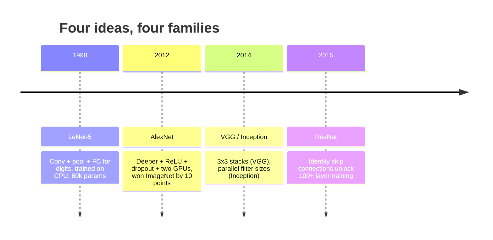
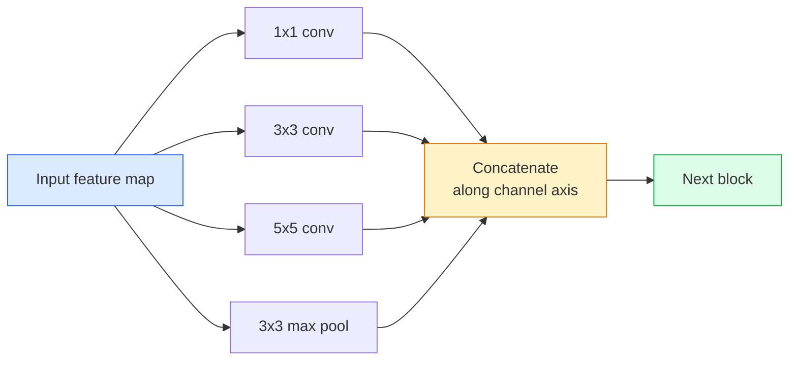
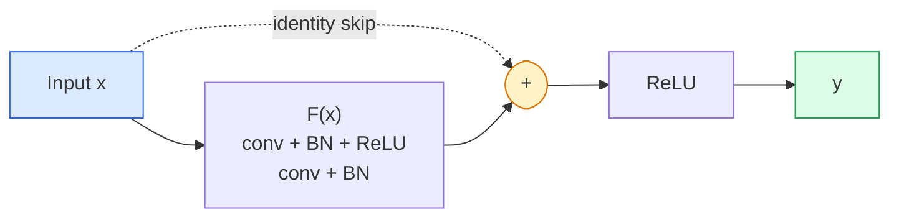

# CNNs  LeNet đến ResNet

> Mỗi CNN lớn trong 30 năm qua đều là một công thức không tuyến tính với một ý tưởng mới.

**Type:** Learn + Build
**Languages:** Python
**Prerequisites:** Phase 3 Lesson 11 (PyTorch), Phase 4 Lesson 01 (Image Fundamentals), Phase 4 Lesson 02 (Convolutions from Scratch)
**Time:** ~75 minutes

## Mục tiêu học tập

- Theo dõi dòng dõi kiến trúc LeNet-5 -> AlexNet -> VGG -> Inception -> ResNet và nêu ra ý tưởng mới duy nhất mỗi gia đình đã đóng góp
- Thực hiện LeNet-5, một khối kiểu VGG, và ResNet BasicBlock trong PyTorch, mỗi dòng dưới 40 dòng
- Giải thích tại sao các kết nối còn lại biến một mạng lưới 1.000 tầng từ không thể đào tạo thành hiện đại nhất
- Đọc một xương sống hiện đại (ResNet-18, ResNet-50) và dự đoán hình dạng đầu ra, trường thụ nhận và số parameter trước khi xem nguồn

## Vấn đề

Năm 2011, trình phân loại ImageNet tốt nhất đạt độ chính xác top-5 khoảng 74%. Năm 2012, AlexNet đạt 85%. Năm 2015, ResNet đạt điểm số 96%. Không có dữ liệu mới. Không có thế hệ GPU mới. Những lợi ích đến từ ý tưởng kiến trúc. Một kỹ sư tầm nhìn làm việc phải biết ý tưởng nào đến từ giấy nào bởi vì mỗi xương sống sản xuất bạn gửi vào năm 2026 là một sự kết hợp lại của những mảnh cùng đó và bởi vì các ý tưởng tiếp tục chuyển tiếp: các conv tập hợp đã đi từ CNNs đến biến đổi, kết nối dư thừa đã đi từ ResNet đến mỗi LLM hiện có, bình thường hóa lô sống trong mô hình phân phối.

Nghiên cứu các mạng này để cũng miễn dịch bạn chống lại một sai lầm phổ biến: tìm kiếm mô hình lớn nhất có sẵn khi một mạng có kích thước LeNet sẽ giải quyết vấn đề. MNIST không cần ResNet. Biết đường cong quy mô của mỗi gia đình cho bạn biết nơi ngồi trên nó.

## Khái niệm

### Bốn ý tưởng đã thay đổi tầm nhìn



Không có gì khác trong tầm nhìn cổ điển quan trọng như bốn bước nhảy này.

### LeNet-5 (1998)

Yann LeCun's digit recognition. 60,000 parameter. 2 conve-pool block, 2 layer được kết nối hoàn toàn, tanh activations.

```
input (1, 32, 32)
  conv 5x5 -> (6, 28, 28)
  avg pool 2x2 -> (6, 14, 14)
  conv 5x5 -> (16, 10, 10)
  avg pool 2x2 -> (16, 5, 5)
  flatten -> 400
  dense -> 120
  dense -> 84
  dense -> 10
```

Mọi thứ mà thế giới hiện đại gọi là một CNN  biến đổi thay thế và giảm mẫu cung cấp cho một đầu phân loại nhỏ  là LeNet với nhiều lớp hơn, các kênh lớn hơn và kích hoạt tốt hơn.

### AlexNet (2012)

Ba thay đổi đã phá vỡ ImageNet:

1. **ReLU**thay vì tanh. các gradient ngừng biến mất. đào tạo tăng tốc gấp 6 lần.
2. **Dropout**Điều chỉnh trở thành một lớp, không phải là một thủ thuật.
3. **Depth and width**5 lớp conve, 3 lớp dày đặc, 60M tham số, được đào tạo trên hai GPU với mô hình chia trên chúng.

Hình 2 của bài báo vẫn cho thấy GPU chia thành hai dòng song song. Sự song song đó là một giải pháp phần cứng, không phải là một cái nhìn sâu sắc về kiến trúc  nhưng ba ý tưởng trên vẫn còn trong mọi mô hình bạn sử dụng.

### VGG (2014)

VGG hỏi: nếu bạn chỉ sử dụng 3x3 xoắn và bạn đi sâu thì sẽ xảy ra gì?

```
stack:   conv 3x3 -> conv 3x3 -> pool 2x2
repeat:  16 or 19 conv layers
```

Hai conv 3x3 thấy cùng một diện tích đầu vào 5x5 như một conv 5x5 nhưng với ít tham số hơn (2 * 9 * C^2 = 18C^2 vs 25 * C^2) và một ReLU bổ sung giữa. VGG biến quan sát này thành một kiến trúc toàn bộ. Sự đơn giản  một loại khối, lặp lại  làm cho nó trở thành điểm tham chiếu cho tất cả những gì đã đến sau đó.

Chi phí: 138M tham số, chậm để đào tạo, đắt tiền để suy luận.

### Sự khởi đầu (2014, cùng năm)

Câu trả lời của Google cho "Tôi nên sử dụng kích thước hạt nhân nào?" là: tất cả chúng, song song.



Mỗi nhánh chuyên về 1x1 cho việc trộn kênh, 3x3 cho kết cấu địa phương, 5x5 cho các mẫu lớn hơn, tập hợp cho các tính năng thay đổi thay đổi và concat cho phép lớp tiếp theo chọn bất kỳ nhánh nào hữu ích.

### Vấn đề phân rã

Vào năm 2015, VGG-19 đã hoạt động và VGG-32 không. Độ sâu được cho là giúp đỡ, nhưng sau ~ 20 lớp cả huấn luyện và mất kiểm tra trở nên tồi tệ hơn.

```
Plain deep network:
  y = f_L( f_{L-1}( ... f_1(x) ... ) )

Gradient wrt early layer:
  dL/dW_1 = dL/dy * df_L/df_{L-1} * ... * df_2/df_1 * df_1/dW_1

Each multiplicative term has magnitude roughly (weight magnitude) * (activation gain).
Stack 100 of them with gains < 1 and the gradient is effectively zero.
```

VGG hoạt động ở 19 lớp vì chuẩn hàng loạt (được xuất bản cùng lúc) giữ hoạt động được quy mô tốt.

### ResNet (2015)

Anh ấy, Zhang, Ren, Sun đề xuất một thay đổi sửa chữa mọi thứ:

```
standard block:   y = F(x)
residual block:   y = F(x) + x
```

- `+ x`nghĩa là lớp luôn có thể chọn không làm gì khi lái xe `F(x)`Một ResNet 1000 lớp bây giờ là tối đa như một mạng 1 lớp, bởi vì mỗi khối bổ sung có một cửa ngõ thoát tầm thường. Với sự đảm bảo đó, người tối ưu sẵn sàng để làm cho mỗi khối * một chút * hữu ích  và một chút hữu ích, xếp chồng lên 100 lần, là hiện đại nhất.



Hai biến thể của khối xuất hiện khắp nơi:

- **BasicBlock**(ResNet-18, ResNet-34): hai con 3x3 con, bỏ qua cả hai.
- **Bottleneck**(ResNet-50, -101, -152): 1x1 xuống, 3x3 trung, 1x1 lên, bỏ qua ba.

Khi skip phải vượt qua một mẫu xuống (trước =2), con đường nhận dạng được thay thế bằng một con đường 1x1 bước = 2 để phù hợp với hình dạng.

### Tại sao các chất còn lại quan trọng hơn tầm nhìn

Ý tưởng không thực sự là về phân loại hình ảnh. Nó là về việc biến các mạng lưới sâu từ "các ngón tay của bạn và hy vọng gradient sống sót" thành một công cụ kỹ thuật đáng tin cậy, có thể mở rộng. Mỗi biến thể bạn sẽ đọc về giai đoạn tiếp theo có kết nối skip chính xác giống nhau trong mỗi khối.

```figure
pooling
```

## Hãy xây dựng nó

### Bước 1: LeNet-5

Một mạng LeNet trung thành, hoạt động Tanh, hợp tác trung bình.`nn.CrossEntropyLoss`xuống dòng nước thay vì các kết nối Gaussian ban đầu.

```python
import torch
import torch.nn as nn
import torch.nn.functional as F

class LeNet5(nn.Module):
    def __init__(self, num_classes=10):
        super().__init__()
        self.conv1 = nn.Conv2d(1, 6, kernel_size=5)
        self.conv2 = nn.Conv2d(6, 16, kernel_size=5)
        self.pool = nn.AvgPool2d(2)
        self.fc1 = nn.Linear(16 * 5 * 5, 120)
        self.fc2 = nn.Linear(120, 84)
        self.fc3 = nn.Linear(84, num_classes)

    def forward(self, x):
        x = self.pool(torch.tanh(self.conv1(x)))
        x = self.pool(torch.tanh(self.conv2(x)))
        x = torch.flatten(x, 1)
        x = torch.tanh(self.fc1(x))
        x = torch.tanh(self.fc2(x))
        return self.fc3(x)

net = LeNet5()
x = torch.randn(1, 1, 32, 32)
print(f"output: {net(x).shape}")
print(f"params: {sum(p.numel() for p in net.parameters()):,}")
```

Tạo sản lượng dự kiến: `output: torch.Size([1, 10])`- `params: 61,706`Đó là toàn bộ bộ phân loại chữ số bắt đầu tầm nhìn hiện đại.

### Bước 2: Một khối VGG

Một khối tái sử dụng: hai con 3x3, ReLU, batch chuẩn, tối đa hồ bơi.

```python
class VGGBlock(nn.Module):
    def __init__(self, in_c, out_c):
        super().__init__()
        self.conv1 = nn.Conv2d(in_c, out_c, kernel_size=3, padding=1)
        self.bn1 = nn.BatchNorm2d(out_c)
        self.conv2 = nn.Conv2d(out_c, out_c, kernel_size=3, padding=1)
        self.bn2 = nn.BatchNorm2d(out_c)
        self.pool = nn.MaxPool2d(2)

    def forward(self, x):
        x = F.relu(self.bn1(self.conv1(x)))
        x = F.relu(self.bn2(self.conv2(x)))
        return self.pool(x)

class MiniVGG(nn.Module):
    def __init__(self, num_classes=10):
        super().__init__()
        self.stack = nn.Sequential(
            VGGBlock(3, 32),
            VGGBlock(32, 64),
            VGGBlock(64, 128),
        )
        self.head = nn.Sequential(
            nn.AdaptiveAvgPool2d(1),
            nn.Flatten(),
            nn.Linear(128, num_classes),
        )

    def forward(self, x):
        return self.head(self.stack(x))

net = MiniVGG()
x = torch.randn(1, 3, 32, 32)
print(f"output: {net(x).shape}")
print(f"params: {sum(p.numel() for p in net.parameters()):,}")
```

Ba khối VGG trên CIFAR, một hồ bơi thích ứng, một lớp tuyến tính. ~ 290k tham số.

### Bước 3: Một ResNet BasicBlock

Các khối xây dựng cốt lõi của ResNet-18 và ResNet-34.

```python
class BasicBlock(nn.Module):
    def __init__(self, in_c, out_c, stride=1):
        super().__init__()
        self.conv1 = nn.Conv2d(in_c, out_c, kernel_size=3, stride=stride, padding=1, bias=False)
        self.bn1 = nn.BatchNorm2d(out_c)
        self.conv2 = nn.Conv2d(out_c, out_c, kernel_size=3, stride=1, padding=1, bias=False)
        self.bn2 = nn.BatchNorm2d(out_c)
        if stride != 1 or in_c != out_c:
            self.shortcut = nn.Sequential(
                nn.Conv2d(in_c, out_c, kernel_size=1, stride=stride, bias=False),
                nn.BatchNorm2d(out_c),
            )
        else:
            self.shortcut = nn.Identity()

    def forward(self, x):
        out = F.relu(self.bn1(self.conv1(x)))
        out = self.bn2(self.conv2(out))
        out = out + self.shortcut(x)
        return F.relu(out)
```

`bias=False`trên các lớp conv là một quy ước chuẩn hàng loạt  Bias của BN đã xử lý sự thiên vị, vì vậy mang theo sự thiên vị conv cũng là một sự lãng phí.`shortcut`Chỉ cần một con conv thực khi bước hoặc số lượng kênh thay đổi; nếu không nó là một danh tính không hoạt động.

### Bước 4: Một ResNet nhỏ

Lắp bốn nhóm BasicBlocks để có được ResNet hoạt động cho các đầu vào kích thước CIFAR.

```python
class TinyResNet(nn.Module):
    def __init__(self, num_classes=10):
        super().__init__()
        self.stem = nn.Sequential(
            nn.Conv2d(3, 32, kernel_size=3, stride=1, padding=1, bias=False),
            nn.BatchNorm2d(32),
            nn.ReLU(inplace=True),
        )
        self.layer1 = self._make_group(32, 32, num_blocks=2, stride=1)
        self.layer2 = self._make_group(32, 64, num_blocks=2, stride=2)
        self.layer3 = self._make_group(64, 128, num_blocks=2, stride=2)
        self.layer4 = self._make_group(128, 256, num_blocks=2, stride=2)
        self.head = nn.Sequential(
            nn.AdaptiveAvgPool2d(1),
            nn.Flatten(),
            nn.Linear(256, num_classes),
        )

    def _make_group(self, in_c, out_c, num_blocks, stride):
        blocks = [BasicBlock(in_c, out_c, stride=stride)]
        for _ in range(num_blocks - 1):
            blocks.append(BasicBlock(out_c, out_c, stride=1))
        return nn.Sequential(*blocks)

    def forward(self, x):
        x = self.stem(x)
        x = self.layer1(x)
        x = self.layer2(x)
        x = self.layer3(x)
        x = self.layer4(x)
        return self.head(x)

net = TinyResNet()
x = torch.randn(1, 3, 32, 32)
print(f"output: {net(x).shape}")
print(f"params: {sum(p.numel() for p in net.parameters()):,}")
```

4 nhóm gồm 2 khối mỗi nhóm. bước 2 ở đầu nhóm 2, 3, 4. số lượng kênh tăng gấp đôi ở mỗi mẫu xuống. khoảng 2,8M tham số. Đó là công thức tiêu chuẩn để cân bằng sạch lên ResNet-152.

### Bước 5: So sánh hiệu quả từ tham số đến tính năng

Lấy cùng một đầu vào qua cả ba mạng và so sánh số lượng tham số.

```python
def summary(name, net, x):
    y = net(x)
    params = sum(p.numel() for p in net.parameters())
    print(f"{name:12s}  input {tuple(x.shape)} -> output {tuple(y.shape)}  params {params:>10,}")

x = torch.randn(1, 3, 32, 32)
summary("LeNet5",     LeNet5(),       torch.randn(1, 1, 32, 32))
summary("MiniVGG",    MiniVGG(),      x)
summary("TinyResNet", TinyResNet(),   x)
```

Ba mô hình, ba thời đại, ba thứ tự lớn trong số lượng tham số. để chính xác CIFAR-10, bạn cần khoảng: LeNet 60%, MiniVGG 89%, TinyResNet 93% sau một vài thời gian đào tạo.

## Sử dụng nó

`torchvision.models`cho bạn các phiên bản được đào tạo trước tất cả các điều trên. chữ ký cuộc gọi là giống nhau trên tất cả các gia đình, đó chính là điểm của trừu tượng xương sống.

```python
from torchvision.models import resnet18, ResNet18_Weights, vgg16, VGG16_Weights

r18 = resnet18(weights=ResNet18_Weights.IMAGENET1K_V1)
r18.eval()

print(f"ResNet-18 params: {sum(p.numel() for p in r18.parameters()):,}")
print(r18.layer1[0])
print()

v16 = vgg16(weights=VGG16_Weights.IMAGENET1K_V1)
v16.eval()
print(f"VGG-16   params: {sum(p.numel() for p in v16.parameters()):,}")
```

ResNet-18 có 11,7M tham số. VGG-16 có 138M. Độ chính xác tương tự như ImageNet top-1 (69,8% so với 71,6%). Kết nối dư thừa mua bạn một chiến thắng hiệu quả tham số 12x. Đó là lý do tại sao các biến thể ResNet thống trị từ năm 2016 cho đến khi ViT đến năm 2021 và vẫn thống trị triển khai trong thế giới thực nơi tính toán là hạn chế.

Đối với việc học chuyển, công thức luôn giống nhau: tải trước khi được huấn luyện, đóng băng xương sống, thay thế đầu phân loại.

```python
for p in r18.parameters():
    p.requires_grad = False
r18.fc = nn.Linear(r18.fc.in_features, 10)
```

Bây giờ bạn có một phân loại CIFAR lớp 10 thừa hưởng các đại diện ImageNet trả tiền.

## Chuyển nó

Bài học này mang lại:

- `outputs/prompt-backbone-selector.md` một lời nhắc chọn đúng gia đình CNN (LeNet/VGG/ResNet/MobileNet/ConvNeXt) cho một nhiệm vụ, kích thước bộ dữ liệu và ngân sách tính toán.
- `outputs/skill-residual-block-reviewer.md` một kỹ năng đọc một mô-đun PyTorch và đánh dấu sai lầm skip-connection (không có đường tắt khi thay đổi bước, lệnh kích hoạt đường tắt, vị trí BN tương đối với việc bổ sung).

## Các bài tập

1. **(Easy)**Đếm tham số bằng tay cho `TinyResNet`Lớp theo lớp. So sánh với `sum(p.numel() for p in net.parameters())`Phần lớn ngân sách các tham số đi đâu  convs, BN, hoặc đầu phân loại?
2. **(Medium)**Thực hiện khối nút thắt chai (1x1 -> 3x3 -> 1x1 với skip) và sử dụng nó để xây dựng một mạng ResNet-50 kiểu cho CIFAR. So sánh các tham số so với `TinyResNet`- Tôi không biết.
3. **(Hard)**Tắt kết nối skip khỏi `BasicBlock`, đào tạo một mạng "đơn" 34 khối và một ResNet 34 khối trên CIFAR-10 trong 10 thời kỳ mỗi. Lãng mất tập vs thời kỳ cho cả hai. Tái tạo kết quả He et al. Hình 1 nơi mạng sâu đơn giản hội tụ với tổn thất cao hơn so với đôi hèn hơn của nó.

## Các điều khoản chính

| Term | What people say | What it actually means |
|------|----------------|----------------------|
| Backbone | "The model" | The stack of convolutional blocks that produces the feature map fed to the task head |
| Residual connection | "Skip connection" | `y = F(x) + x`; lets the optimiser learn identity by setting F to zero, which makes arbitrary depth trainable |
| BasicBlock | "Two 3x3 convs with a skip" | The ResNet-18/34 building block: conv-BN-ReLU-conv-BN-add-ReLU |
| Bottleneck | "1x1 down, 3x3, 1x1 up" | The ResNet-50/101/152 block; cheap at high channel counts because the 3x3 runs on a reduced width |
| Degradation problem | "Deeper is worse" | Past ~20 plain conv layers, both training and test error increase; solved by residual connections, not by more data |
| Stem | "The first layer" | The initial conv that converts 3-channel input into the base feature width; usually 7x7 stride 2 for ImageNet, 3x3 stride 1 for CIFAR |
| Head | "The classifier" | The layers after the final backbone block: adaptive pool, flatten, linear(s) |
| Transfer learning | "Pretrained weights" | Loading a backbone trained on ImageNet and fine-tuning only the head on your task |

## Đọc thêm

- [Deep Residual Learning for Image Recognition (He et al., 2015)](https://arxiv.org/abs/1512.03385) bài báo ResNet; mỗi con số là đáng để nghiên cứu
- [Very Deep Convolutional Networks (Simonyan & Zisserman, 2014)](https://arxiv.org/abs/1409.1556) giấy VGG; vẫn là tài liệu tham khảo tốt nhất cho "tại sao 3x3"
- [ImageNet Classification with Deep CNNs (Krizhevsky et al., 2012)](https://papers.nips.cc/paper_files/paper/2012/hash/c399862d3b9d6b76c8436e924a68c45b-Abstract.html) AlexNet; tờ báo kết thúc thời đại sản xuất tính năng bằng tay
- [Going Deeper with Convolutions (Szegedy et al., 2014)](https://arxiv.org/abs/1409.4842) Sự khởi đầu v1; ý tưởng lọc song song vẫn xuất hiện trong các bộ biến đổi tầm nhìn
