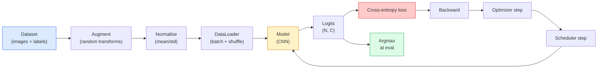

# Định dạng hình ảnh

> Một phân loại là một hàm từ các pixel đến phân bố xác suất trên các lớp.

**Type:** Build
**Languages:** Python
**Prerequisites:** Phase 2 Lesson 09 (Model Evaluation), Phase 3 Lesson 10 (Mini Framework), Phase 4 Lesson 03 (CNNs)
**Time:** ~75 minutes

## Mục tiêu học tập

- Xây dựng một đường ống phân loại hình ảnh từ đầu đến cuối trên CIFAR-10: bộ dữ liệu, tăng cường, mô hình, vòng đào tạo, đánh giá
- Giải thích vai trò của mỗi thành phần (data loader, mất mát, tối ưu hóa, lập lịch, tăng cường) và dự đoán cách phá vỡ bất kỳ một trong số chúng biểu hiện trong đường cong mất mát
- Thực hiện trộn lẫn, cắt và làm trơn nhãn từ đầu và biện minh khi nào mỗi loại đáng thêm
- Đọc một số liệu hỗn loạn và một bảng độ chính xác/tái nhớ cho mỗi lớp để chẩn đoán các lỗi tập hợp dữ liệu và mô hình vượt quá độ chính xác tổng thể

## Vấn đề

Mỗi nhiệm vụ nhìn thấy được chuyển đến phân loại hình ảnh ở một mức độ nào đó. Khám phá phân loại các khu vực. phân loại phân loại các pixel. Khám phục hồi xếp hạng theo sự tương đồng với các lớp trung tâm.

Hầu hết các lỗi phân loại không có trong mô hình. Chúng sống trong đường ống dẫn: một chuẩn hóa bị hỏng, một bộ đào tạo không bị thay đổi, tăng cường làm sai nhãn, một phân chia xác thực bị ô nhiễm bởi dữ liệu đào tạo, tỷ lệ học tập lặng lẽ khác nhau sau thời kỳ 30. Một CNN sẽ đạt 93% trên CIFAR-10 với một thiết lập chính xác thường đạt điểm 70-75% với một bị hỏng, và đường cong thua lỗ trông hợp lý suốt thời gian.

Bài học này dây cáp toàn bộ đường ống bằng tay để mọi bộ phận đều có thể kiểm tra.`torchvision.datasets`có thể giấu một con bọ.

## Khái niệm

### Hành trình phân loại



Mỗi dòng trong vòng lặp này là nơi mà một lỗi có thể sống. Cross-entropy lấy logits nguyên liệu, không phải đầu ra softmax, vì vậy bất kỳ `model(x).softmax()`trước khi mất mát lặng lẽ tính toán gradient sai. tăng áp dụng cho đầu vào chỉ, không nhãn  ngoại trừ hỗn hợp, kết hợp cả hai. `optimizer.zero_grad()`phải xảy ra một lần mỗi bước; bỏ qua nó tích lũy gradient và trông giống như một tỷ lệ học tập vô cùng không ổn định. Mỗi một trong những lỗi này làm phẳng đường cong học tập mà không ném một lỗi.

### Cross-entropy, logits, và softmax

Một phân loại sản xuất `C`số cho mỗi hình ảnh được gọi là logits. Sử dụng softmax chuyển đổi chúng thành phân phối xác suất:

```
softmax(z)_i = exp(z_i) / sum_j exp(z_j)
```

Cross-entropy đo khả năng log âm của lớp đúng:

```
CE(z, y) = -log( softmax(z)_y )
        = -z_y + log( sum_j exp(z_j) )
```

Hình dạng bên phải là số ổn định (log-sum-exp).`nn.CrossEntropyLoss`Fuses softmax + NLL trong một op và lấy logits thô trực tiếp.

### Tại sao tăng cường hiệu quả

Một CNN có thiên hướng inductive cho dịch (từ chia sẻ trọng lượng) nhưng không có bất biến tích hợp vào cây trồng, cúi, màu jitter, hoặc mùi. Cách duy nhất để dạy cho nó những bất biến đó là bằng cách cho nó hiển thị các pixel thực hành chúng.

```
Original crop:  "dog facing left"
Flip:           "dog facing right"       <- same label, different pixels
Rotate(+15):    "dog, slight tilt"
Colour jitter:  "dog in warmer light"
RandomErasing:  "dog with patch missing"
```

Quy tắc: tăng cường phải giữ nhãn. Cutout và xoay trên một chữ số có thể xoay "6" vào "9"; cho bộ dữ liệu đó bạn sử dụng phạm vi xoay nhỏ hơn và chọn tăng cường tôn trọng các bất biến cụ thể về chữ số.

### Trộn và cắt trộn

Sự tăng cường thông thường biến đổi các pixel nhưng giữ cho các nhãn chỉ nóng. **Mixup**và **cutmix**phá vỡ bằng cách liên kết cả hai.

```
Mixup:
  lambda ~ Beta(a, a)
  x = lambda * x_i + (1 - lambda) * x_j
  y = lambda * y_i + (1 - lambda) * y_j

Cutmix:
  paste a random rectangle of x_j into x_i
  y = area-weighted mix of y_i and y_j
```

Tại sao nó giúp ích: mô hình ngừng ghi nhớ các mục tiêu nóng nhất và học cách liên kết giữa các lớp học.

### Đơn vị nhãn

Một người anh em của sự nhầm lẫn.`[0, 0, 1, 0, 0]`, tàu chống lại `[eps/C, eps/C, 1-eps, eps/C, eps/C]`cho một người nhỏ `eps`như 0.1. ngăn chặn mô hình từ việc sản xuất logit sắc nét tùy tiện và cải thiện hiệu chuẩn hầu như không chi phí.`nn.CrossEntropyLoss(label_smoothing=0.1)`từ PyTorch 1.10.

### Đánh giá vượt quá độ chính xác

Sự chính xác tổng hợp che giấu sự mất cân bằng. Một phân loại nhị phân 90-10 luôn dự đoán điểm số lớp đa số là 90%. Các công cụ thực sự cho bạn biết những gì đang xảy ra:

- **Per-class accuracy** một số cho mỗi lớp; ngay lập tức xuất hiện các loại có hiệu suất thấp.
- **Confusion matrix** C x C lưới với hàng i col j = số lượng lớp thực i dự đoán như lớp j; đường vạch là chính xác, các đường vạch ngoài là nơi mô hình của bạn sống.
- **Top-1 / Top-5** liệu lớp học chính xác có nằm trong dự đoán đầu 1 hoặc đầu 5; Top-5 quan trọng đối với ImageNet vì các lớp học như "Norwich terrier" so với "Norfolk terrier" thực sự không rõ ràng.
- **Calibration (ECE)** dự đoán độ tin cậy 0,8 có đúng 80% thời gian không?

```figure
receptive-field
```

## Hãy xây dựng nó

### Bước 1: Một bộ dữ liệu tổng hợp xác định

CIFAR-10 sống trên đĩa. Để làm cho bài học này có thể tái tạo và nhanh chóng chúng tôi xây dựng một tập dữ liệu tổng hợp trông giống như CIFAR  32x32 hình ảnh RGB với cấu trúc cụ thể cho lớp mà mô hình phải học.

```python
import numpy as np
import torch
from torch.utils.data import Dataset


def synthetic_cifar(num_per_class=1000, num_classes=10, seed=0):
    rng = np.random.default_rng(seed)
    X = []
    Y = []
    for c in range(num_classes):
        centre = rng.uniform(0, 1, (3,))
        freq = 2 + c
        for _ in range(num_per_class):
            yy, xx = np.meshgrid(np.linspace(0, 1, 32), np.linspace(0, 1, 32), indexing="ij")
            r = np.sin(xx * freq) * 0.5 + centre[0]
            g = np.cos(yy * freq) * 0.5 + centre[1]
            b = (xx + yy) * 0.5 * centre[2]
            img = np.stack([r, g, b], axis=-1)
            img += rng.normal(0, 0.08, img.shape)
            img = np.clip(img, 0, 1)
            X.append(img.astype(np.float32))
            Y.append(c)
    X = np.stack(X)
    Y = np.array(Y)
    idx = rng.permutation(len(X))
    return X[idx], Y[idx]


class ArrayDataset(Dataset):
    def __init__(self, X, Y, transform=None):
        self.X = X
        self.Y = Y
        self.transform = transform

    def __len__(self):
        return len(self.X)

    def __getitem__(self, i):
        img = self.X[i]
        if self.transform is not None:
            img = self.transform(img)
        img = torch.from_numpy(img).permute(2, 0, 1)
        return img, int(self.Y[i])
```

Mỗi lớp có màu sắc và tần số riêng của nó, cộng với tiếng ồn Gaussian để buộc mô hình học tín hiệu thay vì ghi nhớ pixel.

### Bước 2: Tiêu chuẩn hóa và tăng cường

Hai biến đổi mà mọi đường ống thị giác đều có.

```python
def standardize(mean, std):
    mean = np.array(mean, dtype=np.float32)
    std = np.array(std, dtype=np.float32)
    def _fn(img):
        return (img - mean) / std
    return _fn


def random_hflip(p=0.5):
    def _fn(img):
        if np.random.random() < p:
            return img[:, ::-1, :].copy()
        return img
    return _fn


def random_crop(pad=4):
    def _fn(img):
        h, w = img.shape[:2]
        padded = np.pad(img, ((pad, pad), (pad, pad), (0, 0)), mode="reflect")
        y = np.random.randint(0, 2 * pad)
        x = np.random.randint(0, 2 * pad)
        return padded[y:y + h, x:x + w, :]
    return _fn


def compose(*fns):
    def _fn(img):
        for fn in fns:
            img = fn(img)
        return img
    return _fn
```

Nhấp vào tấm trước khi trồng, không phải là tấm bằng không, bởi vì biên giới đen là một tín hiệu mà mô hình sẽ học cách bỏ qua theo cách không hữu ích.

### Bước 3: Trộn lẫn

Trộn hai hình ảnh và hai nhãn bên trong bước đào tạo. được thực hiện như một biến đổi hàng loạt để nó sống bên cạnh các thông qua phía trước thay vì bên trong bộ dữ liệu.

```python
def mixup_batch(x, y, num_classes, alpha=0.2):
    if alpha <= 0:
        return x, torch.nn.functional.one_hot(y, num_classes).float()
    lam = float(np.random.beta(alpha, alpha))
    idx = torch.randperm(x.size(0), device=x.device)
    x_mixed = lam * x + (1 - lam) * x[idx]
    y_onehot = torch.nn.functional.one_hot(y, num_classes).float()
    y_mixed = lam * y_onehot + (1 - lam) * y_onehot[idx]
    return x_mixed, y_mixed


def soft_cross_entropy(logits, soft_targets):
    log_probs = torch.log_softmax(logits, dim=-1)
    return -(soft_targets * log_probs).sum(dim=-1).mean()
```

`soft_cross_entropy`là sự phân phối giữa các điểm giao hợp với các điểm giao hợp mềm. nó giảm xuống mức một điểm giao hợp khi mục tiêu chính xác là một điểm giao hợp.

### Bước 4: Chuyển tập

Công thức hoàn chỉnh: một lần vượt qua dữ liệu, gradient một lần mỗi lô, lập trình viên bước một lần mỗi thời đại.

```python
import torch
import torch.nn as nn
from torch.utils.data import DataLoader
from torch.optim import SGD
from torch.optim.lr_scheduler import CosineAnnealingLR

def train_one_epoch(model, loader, optimizer, device, num_classes, use_mixup=True):
    model.train()
    total, correct, loss_sum = 0, 0, 0.0
    for x, y in loader:
        x, y = x.to(device), y.to(device)
        if use_mixup:
            x_m, y_soft = mixup_batch(x, y, num_classes)
            logits = model(x_m)
            loss = soft_cross_entropy(logits, y_soft)
        else:
            logits = model(x)
            loss = nn.functional.cross_entropy(logits, y, label_smoothing=0.1)
        optimizer.zero_grad()
        loss.backward()
        optimizer.step()
        loss_sum += loss.item() * x.size(0)
        total += x.size(0)
        # Training accuracy vs the un-mixed labels `y` is only an approximation
        # when mixup is on (the model saw soft targets, not y). Treat it as a
        # rough progress signal; rely on val accuracy for real performance.
        with torch.no_grad():
            pred = logits.argmax(dim=-1)
            correct += (pred == y).sum().item()
    return loss_sum / total, correct / total


@torch.no_grad()
def evaluate(model, loader, device, num_classes):
    model.eval()
    total, correct = 0, 0
    loss_sum = 0.0
    cm = torch.zeros(num_classes, num_classes, dtype=torch.long)
    for x, y in loader:
        x, y = x.to(device), y.to(device)
        logits = model(x)
        loss = nn.functional.cross_entropy(logits, y)
        pred = logits.argmax(dim=-1)
        for t, p in zip(y.cpu(), pred.cpu()):
            cm[t, p] += 1
        loss_sum += loss.item() * x.size(0)
        total += x.size(0)
        correct += (pred == y).sum().item()
    return loss_sum / total, correct / total, cm
```

Năm tính bất biến mà bạn kiểm tra mỗi khi bạn viết một vòng tròn huấn luyện:

1. `model.train()`trước khi đào tạo,`model.eval()`trước khi đánh giá  biến đổi hành vi bỏ và batchnorm.
2. `.zero_grad()`trước đây`.backward()`- Tôi không biết.
3. `.item()`khi tích lũy số liệu để không có gì giữ cho biểu đồ tính toán sống.
4. `@torch.no_grad()`trong quá trình đánh giá  tiết kiệm trí nhớ và thời gian, ngăn ngừa tai nạn tinh tế.
5. Argmax so với logits thô, không phải softmax  kết quả tương tự, một lần ít hơn.

### Bước 5: Đặt nó lại

Sử dụng `TinyResNet`từ bài học trước, đào tạo cho một vài thời đại, đánh giá.

```python
from main import synthetic_cifar, ArrayDataset
from main import standardize, random_hflip, random_crop, compose
from main import mixup_batch, soft_cross_entropy
from main import train_one_epoch, evaluate
# TinyResNet comes from the previous lesson (03-cnns-lenet-to-resnet).
# Adjust the import path to wherever you stored the previous lesson's code.
from cnns_lenet_to_resnet import TinyResNet  # example placeholder

X, Y = synthetic_cifar(num_per_class=500)
split = int(0.9 * len(X))
X_train, Y_train = X[:split], Y[:split]
X_val, Y_val = X[split:], Y[split:]

mean = [0.5, 0.5, 0.5]
std = [0.25, 0.25, 0.25]
train_tf = compose(random_hflip(), random_crop(pad=4), standardize(mean, std))
eval_tf = standardize(mean, std)

train_ds = ArrayDataset(X_train, Y_train, transform=train_tf)
val_ds = ArrayDataset(X_val, Y_val, transform=eval_tf)

train_loader = DataLoader(train_ds, batch_size=128, shuffle=True, num_workers=0)
val_loader = DataLoader(val_ds, batch_size=256, shuffle=False, num_workers=0)

device = "cuda" if torch.cuda.is_available() else "cpu"
model = TinyResNet(num_classes=10).to(device)
optimizer = SGD(model.parameters(), lr=0.1, momentum=0.9, weight_decay=5e-4, nesterov=True)
scheduler = CosineAnnealingLR(optimizer, T_max=10)

for epoch in range(10):
    tr_loss, tr_acc = train_one_epoch(model, train_loader, optimizer, device, 10, use_mixup=True)
    va_loss, va_acc, _ = evaluate(model, val_loader, device, 10)
    scheduler.step()
    print(f"epoch {epoch:2d}  lr {scheduler.get_last_lr()[0]:.4f}  "
          f"train {tr_loss:.3f}/{tr_acc:.3f}  val {va_loss:.3f}/{va_acc:.3f}")
```

Trên bộ dữ liệu tổng hợp, điều này đạt đến độ chính xác xác xác thực gần như hoàn hảo trong vòng năm thời đại, đó là điểm: đường ống là chính xác, mô hình có thể học được điều gì. Thay đổi bộ dữ liệu cho CIFAR-10 thực và cùng một vòng lặp tàu đến ~ 90% mà không thay đổi.

### Bước 6: Đọc các mã số nhầm lẫn

Chỉ riêng độ chính xác không bao giờ cho bạn biết mô hình đang thất bại ở đâu.

```python
def print_confusion(cm, labels=None):
    c = cm.shape[0]
    labels = labels or [str(i) for i in range(c)]
    print(f"{'':>6}" + "".join(f"{l:>5}" for l in labels))
    for i in range(c):
        row = cm[i].tolist()
        print(f"{labels[i]:>6}" + "".join(f"{v:>5}" for v in row))
    print()
    tp = cm.diag().float()
    fp = cm.sum(dim=0).float() - tp
    fn = cm.sum(dim=1).float() - tp
    prec = tp / (tp + fp).clamp_min(1)
    rec = tp / (tp + fn).clamp_min(1)
    f1 = 2 * prec * rec / (prec + rec).clamp_min(1e-9)
    for i in range(c):
        print(f"{labels[i]:>6}  prec {prec[i]:.3f}  rec {rec[i]:.3f}  f1 {f1[i]:.3f}")

_, _, cm = evaluate(model, val_loader, device, 10)
print_confusion(cm)
```

Các hàng là các lớp thực, cột là dự đoán. Một nhóm số lượng ngoài đường chọc giữa lớp 3 và 5 có nghĩa là mô hình nhầm lẫn hai thứ đó và cung cấp cho bạn một điểm khởi đầu cho việc thu thập dữ liệu nhắm mục tiêu hoặc tăng cường cụ thể cho lớp.

## Sử dụng nó

`torchvision`cho CIFAR-10 thực sự toàn bộ đường ống là bốn dòng cộng với một vòng lặp huấn luyện.

```python
from torchvision.datasets import CIFAR10
from torchvision.transforms import Compose, RandomCrop, RandomHorizontalFlip, ToTensor, Normalize

mean = (0.4914, 0.4822, 0.4465)
std = (0.2470, 0.2435, 0.2616)
train_tf = Compose([
    RandomCrop(32, padding=4, padding_mode="reflect"),
    RandomHorizontalFlip(),
    ToTensor(),
    Normalize(mean, std),
])
eval_tf = Compose([ToTensor(), Normalize(mean, std)])

train_ds = CIFAR10(root="./data", train=True,  download=True, transform=train_tf)
val_ds   = CIFAR10(root="./data", train=False, download=True, transform=eval_tf)
```

Hai điều cần lưu ý: trung bình / std là **dataset-specific** được tính trên bộ đào tạo CIFAR-10, không phải ImageNet  và tấm phản xạ là chính sách thu hoạch mặc định của cộng đồng.

## Chuyển nó

Bài học này mang lại:

- `outputs/prompt-classifier-pipeline-auditor.md` một lời nhắc kiểm tra kịch bản đào tạo cho năm biến số trên và xuất hiện vi phạm đầu tiên.
- `outputs/skill-classification-diagnostics.md` một kỹ năng, với một số lượng hỗn loạn và một danh sách tên lớp, tóm tắt các thất bại cho từng lớp và đề xuất giải pháp độc đáo có tác động nhất.

## Các bài tập

1. **(Easy)**Cụ thể, các mô hình có thể được sử dụng trong 5 thời gian trên bộ dữ liệu tổng hợp.
2. **(Medium)**Thực hiện Cutout  0, một hình vuông 8x8 ngẫu nhiên trong mỗi hình ảnh đào tạo  và chạy một sự trừu tượng so với không tăng, hflip+crop, hflip+crop+cutout, hflip+crop+mixup.
3. **(Hard)**Xây dựng một đường ống CIFAR-100 (100 lớp, cùng kích thước đầu vào) và tái tạo một cuộc tập luyện ResNet-34 chạy trong phạm vi 1% độ chính xác được xuất bản.

## Các điều khoản chính

| Term | What people say | What it actually means |
|------|----------------|----------------------|
| Logits | "Raw outputs" | The pre-softmax vector of C numbers per image; cross-entropy expects these, not softmaxed values |
| Cross-entropy | "The loss" | Negative log-probability of the correct class; combines log-softmax and NLL in one stable op |
| DataLoader | "The batcher" | Wraps a dataset with shuffling, batching, and (optional) multi-worker loading; gets blamed for half of training bugs |
| Augmentation | "Random transforms" | Any pixel-level transform at training time that preserves the label; teaches invariances the CNN does not have natively |
| Mixup / Cutmix | "Mix two images" | Blend both inputs and labels so the classifier learns smooth interpolations instead of hard boundaries |
| Label smoothing | "Softer targets" | Replace one-hot with (1-eps, eps/(C-1), ...); improves calibration and slightly boosts accuracy |
| Top-k accuracy | "Top-5" | The correct class is in the k highest-probability predictions; used on datasets with genuinely ambiguous classes |
| Confusion matrix | "Where errors live" | C x C table where entry (i, j) counts images of true class i predicted as j; diagonal is right, off-diagonal tells you what to fix |

## Đọc thêm

- [CS231n: Training Neural Networks](https://cs231n.github.io/neural-networks-3/) vẫn là chuyến đi rõ ràng nhất của đường ống đào tạo trên một trang
- [Bag of Tricks for Image Classification (He et al., 2019)](https://arxiv.org/abs/1812.01187) mỗi trò lừa nhỏ cộng lại thêm 3-4% cho độ chính xác ResNet trên ImageNet
- [mixup: Beyond Empirical Risk Minimization (Zhang et al., 2017)](https://arxiv.org/abs/1710.09412) bài viết hỗn hợp ban đầu; ba trang lý thuyết cộng với các thí nghiệm thuyết phục
- [Why temperature scaling matters (Guo et al., 2017)](https://arxiv.org/abs/1706.04599) giấy chứng minh các mạng hiện đại là sai cân và sửa nó với một tham số scalar
