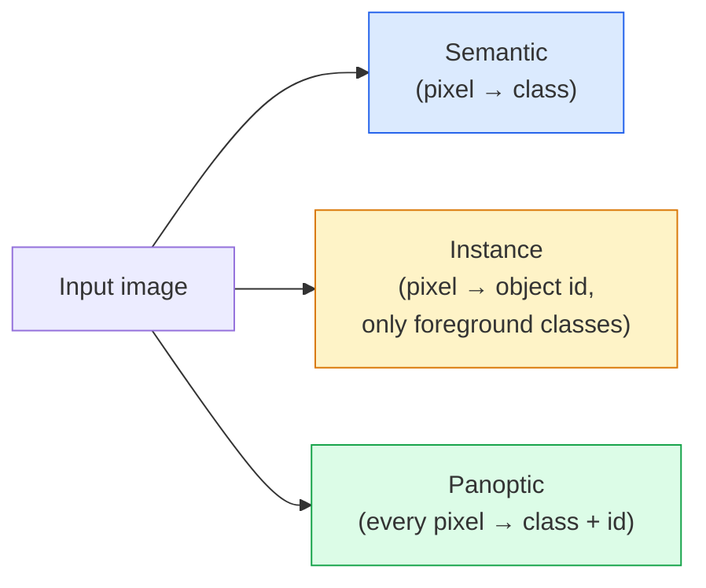
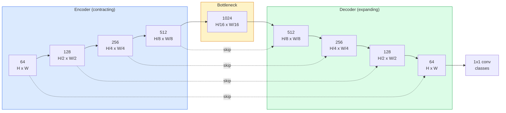

# Phân tích ngữ nghĩa  U-Net

> Căn phân là phân loại ở mỗi pixel. U-Net làm cho nó hoạt động bằng cách kết hợp một bộ mã hóa downsampling với một bộ mã hóa upsampling và dây kết nối skip giữa chúng.

**Type:** Build
**Languages:** Python
**Prerequisites:** Phase 4 Lesson 03 (CNNs), Phase 4 Lesson 04 (Image Classification)
**Time:** ~75 minutes

## Mục tiêu học tập

- Sự phân biệt phân đoạn ngữ nghĩa, ví dụ và toàn cảnh và chọn nhiệm vụ phù hợp cho một vấn đề nhất định
- Xây dựng một U-Net từ đầu trong PyTorch với các khối mã hóa, một nút thắt chai, một máy giải mã với các biến chuyển chuyển, và bỏ qua các kết nối
- Thực hiện pixel-wise cross-entropy, Dice mất, và mất kết hợp là mặc định hiện tại cho phân đoạn y tế và công nghiệp
- Đọc số liệu IoU và Dice cho mỗi lớp và chẩn đoán liệu điểm số xấu có đến từ việc nhớ lại các đối tượng nhỏ, độ chính xác ranh giới hoặc mất cân bằng lớp

## Vấn đề

Việc phân loại sẽ đưa ra một nhãn cho mỗi hình ảnh. Việc phát hiện sẽ đưa ra một số hộp cho mỗi hình ảnh. Việc phân chia sẽ đưa ra một nhãn cho mỗi pixel. Đối với một lượng nhập kích thước `H x W`, đầu ra là một tensor hình dạng `H x W`(tôn ngữ) hoặc `H x W x N_instances`Đó là hàng triệu dự đoán cho mỗi hình ảnh, không phải một.

Cấu trúc phân đoạn là lý do tại sao nó cung cấp năng lực cho hầu hết các sản phẩm hình ảnh dự đoán dày đặc: hình ảnh y tế (năm nấm), lái xe tự trị (cường, làn đường, trở ngại), vệ tinh (những dấu chân xây dựng, ranh giới cây trồng), phân tích tài liệu (các khu vực bố trí), robot (các khu vực có thể nắm bắt).

Vấn đề kiến trúc đơn giản để nói và không đơn giản để giải quyết: bạn cần mạng để xem bối cảnh toàn cầu của một hình ảnh (đây là cảnh gì) và chi tiết pixel địa phương (đúng là pixel nào là đường và đường đạp) cùng một lúc. Một CNN tiêu chuẩn nén không gian để có được bối cảnh, mà ném đi chi tiết. U-Net là thiết kế đã có cả hai.

## Khái niệm

### Semantic vs instance vs panoptic



- **Semantic**"Đây là đường, đó là xe". Hai xe cạnh nhau sụp đổ thành một khối.
- **Instance**nói "đây là xe #3, đó là xe #5. " Không quan tâm đến các thứ nền ("thông" = bầu trời, đường, cỏ).
- **Panoptic**kết hợp cả hai: mỗi pixel nhận được một nhãn lớp, mỗi instance nhận được một ID độc đáo, thứ và thứ cả hai được phân đoạn.

Bài học này bao gồm ngữ nghĩa. Bài học tiếp theo (Mask R-CNN) bao gồm trường hợp.

### Hình dạng U-Net



Các mã hóa giảm phân giải không gian bốn lần và tăng gấp đôi các kênh. Các mã hóa đảo ngược: tăng gấp đôi phân giải không gian bốn lần và giảm nửa các kênh. Các kết nối skip kết nối kết nối các tính năng mã hóa phù hợp với các tính năng mã hóa tại mỗi độ phân giải. Bản đồ cuối cùng 1x1 conv`64 -> num_classes`với độ phân giải đầy đủ.

Tại sao các kết nối skip là cần thiết: máy giải mã chỉ nhìn thấy các bản đồ tính năng nhỏ khi nó cố gắng đưa ra dự đoán cấp pixel. Không có các skip nó không thể xác định vị trí cạnh chính xác vì thông tin đó đã bị nén trong máy giải mã.

### Chuyển đổi đối với mẫu tăng hàng tỷ

Máy giải mã phải mở rộng kích thước không gian.

- **Transposed convolution**(`nn.ConvTranspose2d` mẫu học được. Tầm U-Net lịch sử. Có thể tạo ra các đồ tạo của bảng cờ nếu bước và kích thước hạt nhân không chia đều.
- **Bilinear upsample + 3x3 conv** mẫu hình lên trơn trơn tiếp theo là một convent.

Cả hai đều xuất hiện trong tự nhiên. Đối với một U-Net đầu tiên, bilinear là an toàn hơn.

### Cross-entropy trên lưới pixel

Đối với phân đoạn ngữ nghĩa với lớp C, đầu ra mô hình là `(N, C, H, W)`Mục tiêu là`(N, H, W)`với các ID lớp nguyên số. Cross-entropy giống như trường hợp phân loại, chỉ áp dụng ở mọi vị trí không gian:

```
Loss = mean over (n, h, w) of -log( softmax(logits[n, :, h, w])[target[n, h, w]] )
```

`F.cross_entropy`PyTorch xử lý hình dạng này một cách tự nhiên.

### Sự mất tích và tại sao bạn cần nó

Cross-entropy đối xử với mọi pixel bằng nhau. Điều đó là sai khi một lớp thống trị khung hình (phản ảnh y tế: 99% nền, 1% khối u). Mạng có thể ghi điểm chính xác 99% bằng cách dự đoán nền ở khắp mọi nơi và vẫn vô dụng.

Thiếu tích Dice giải quyết vấn đề này bằng cách trực tiếp tối ưu hóa sự chồng chéo giữa mặt nạ dự đoán và thực:

```
Dice(p, y) = 2 * sum(p * y) / (sum(p) + sum(y) + epsilon)
Dice_loss = 1 - Dice
```

nơi `p`là bản đồ xác suất sigmoid/softmax cho một lớp và `y`là mặt nạ thực tại cơ bản nhị phân. sự mất mát chỉ là không khi sự chồng chéo hoàn hảo. Bởi vì nó dựa trên tỷ lệ, sự mất cân bằng lớp là không liên quan.

Trong thực tế, sử dụng **combined loss**- Có thể là:

```
L = L_cross_entropy + lambda * L_dice       (lambda ~ 1)
```

Cross-entropy cung cấp gradient ổn định ban đầu trong đào tạo; Dice tập trung đuôi đào tạo vào thực sự phù hợp với hình dạng mặt nạ.

### Các số liệu đánh giá

- **Pixel accuracy**% của các pixel được dự đoán đúng. rẻ. Phá vỡ trên dữ liệu không cân bằng vì cùng lý do như chính xác trong phân loại.
- **IoU per class** giao thông trên liên đoàn cho mỗi lớp mặt nạ; trung bình giữa các lớp = mIoU.
- **Dice (F1 on pixels)** tương tự như IoU; `Dice = 2 * IoU / (1 + IoU)`Phương pháp hình ảnh y tế thích Dice, cộng đồng lái xe thích IoU; chúng có liên quan một cách đơn giản.
- **Boundary F1** đo lường ranh giới dự đoán gần như thế nào với ranh giới thực tế mặt đất, trừng phạt ngay cả những thay đổi nhỏ.

Tờ báo cáo về một lớp học, không chỉ là một lớp học.

### Trả giá trị giải pháp đầu vào

Bộ mã hóa của U-Net làm giảm phân giải gấp bốn lần, vì vậy đầu vào phải được chia bằng 16. Hình ảnh y tế thường là 512x512 hoặc 1024x1024.`H * W * C_max`, và ở 1024x1024 với 1024 kênh nút chai, đường đi trước đã sử dụng gigabytes VRAM.

Hai phương pháp giải quyết tiêu chuẩn:
1. Đơn gạch nhập  quy trình 256x256 gạch với chồng chéo và đan.
2. Thay thế nút thắt bằng các vòng xoắn mở rộng giữ độ phân giải không gian cao hơn nhưng mở rộng lĩnh vực thụ thể (gia đình DeepLab).

Đối với mô hình đầu tiên, đầu vào 256x256 với U-Net cơ sở 64 kênh được đào tạo thoải mái trên 8 GB VRAM.

```figure
segmentation-flood
```

## Hãy xây dựng nó

### Bước 1: Block Encoder

Hai conv 3x3 với chuẩn hàng và ReLU. conv đầu tiên thay đổi số lượng kênh; conv thứ hai giữ nó.

```python
import torch
import torch.nn as nn
import torch.nn.functional as F

class DoubleConv(nn.Module):
    def __init__(self, in_c, out_c):
        super().__init__()
        self.net = nn.Sequential(
            nn.Conv2d(in_c, out_c, kernel_size=3, padding=1, bias=False),
            nn.BatchNorm2d(out_c),
            nn.ReLU(inplace=True),
            nn.Conv2d(out_c, out_c, kernel_size=3, padding=1, bias=False),
            nn.BatchNorm2d(out_c),
            nn.ReLU(inplace=True),
        )

    def forward(self, x):
        return self.net(x)
```

Phòng này được tái sử dụng trong suốt. `bias=False`vì bản beta của BN xử lý sự thiên vị.

### Bước 2: Các khối xuống và lên

```python
class Down(nn.Module):
    def __init__(self, in_c, out_c):
        super().__init__()
        self.net = nn.Sequential(
            nn.MaxPool2d(2),
            DoubleConv(in_c, out_c),
        )

    def forward(self, x):
        return self.net(x)


class Up(nn.Module):
    def __init__(self, in_c, out_c):
        super().__init__()
        self.up = nn.Upsample(scale_factor=2, mode="bilinear", align_corners=False)
        self.conv = DoubleConv(in_c, out_c)

    def forward(self, x, skip):
        x = self.up(x)
        if x.shape[-2:] != skip.shape[-2:]:
            x = F.interpolate(x, size=skip.shape[-2:], mode="bilinear", align_corners=False)
        x = torch.cat([skip, x], dim=1)
        return self.conv(x)
```

Kiểm tra hình dạng chỉ dành cho không gian (`shape[-2:]`) xử lý các đầu vào có kích thước không thể chia bằng 16; một kho `F.interpolate`So sánh hình dạng đầy đủ cũng sẽ kích hoạt sự khác biệt về số lượng kênh, đó nên là một lỗi lớn, không phải là một sự liên kết im lặng.

### Bước 3: U-Net

```python
class UNet(nn.Module):
    def __init__(self, in_channels=3, num_classes=2, base=64):
        super().__init__()
        self.inc = DoubleConv(in_channels, base)
        self.d1 = Down(base, base * 2)
        self.d2 = Down(base * 2, base * 4)
        self.d3 = Down(base * 4, base * 8)
        self.d4 = Down(base * 8, base * 16)
        self.u1 = Up(base * 16 + base * 8, base * 8)
        self.u2 = Up(base * 8 + base * 4, base * 4)
        self.u3 = Up(base * 4 + base * 2, base * 2)
        self.u4 = Up(base * 2 + base, base)
        self.outc = nn.Conv2d(base, num_classes, kernel_size=1)

    def forward(self, x):
        x1 = self.inc(x)
        x2 = self.d1(x1)
        x3 = self.d2(x2)
        x4 = self.d3(x3)
        x5 = self.d4(x4)
        x = self.u1(x5, x4)
        x = self.u2(x, x3)
        x = self.u3(x, x2)
        x = self.u4(x, x1)
        return self.outc(x)

net = UNet(in_channels=3, num_classes=2, base=32)
x = torch.randn(1, 3, 256, 256)
print(f"output: {net(x).shape}")
print(f"params: {sum(p.numel() for p in net.parameters()):,}")
```

Hình dạng đầu ra `(1, 2, 256, 256)` kích thước không gian tương tự như đầu vào, `num_classes`Các kênh.`base=32`- Tôi không biết.

### Bước 4: Lối mất

```python
def dice_loss(logits, targets, num_classes, eps=1e-6):
    probs = F.softmax(logits, dim=1)
    targets_one_hot = F.one_hot(targets, num_classes).permute(0, 3, 1, 2).float()
    dims = (0, 2, 3)
    intersection = (probs * targets_one_hot).sum(dim=dims)
    denom = probs.sum(dim=dims) + targets_one_hot.sum(dim=dims)
    dice = (2 * intersection + eps) / (denom + eps)
    return 1 - dice.mean()


def combined_loss(logits, targets, num_classes, lam=1.0):
    ce = F.cross_entropy(logits, targets)
    dc = dice_loss(logits, targets, num_classes)
    return ce + lam * dc, {"ce": ce.item(), "dice": dc.item()}
```

Các Dice được tính toán cho mỗi lớp sau đó trung bình (macro Dice).`eps`ngăn chặn phân chia bằng không cho các lớp không có trong lô.

### Bước 5: Métric IoU

```python
@torch.no_grad()
def iou_per_class(logits, targets, num_classes):
    preds = logits.argmax(dim=1)
    ious = torch.zeros(num_classes)
    for c in range(num_classes):
        pred_c = (preds == c)
        true_c = (targets == c)
        inter = (pred_c & true_c).sum().float()
        union = (pred_c | true_c).sum().float()
        ious[c] = (inter / union) if union > 0 else torch.tensor(float("nan"))
    return ious
```

Trả lại một vector dài C. `nan`Các lớp không có trong lô  không trung bình so với các lớp khi tính mIoU.

### Bước 6: Bộ dữ liệu tổng hợp để xác minh toàn diện

Tạo hình dạng trên nền màu sắc để mạng phải học hình dạng, không phải màu pixel.

```python
import numpy as np
from torch.utils.data import Dataset, DataLoader

def synthetic_segmentation(num_samples=200, size=64, seed=0):
    rng = np.random.default_rng(seed)
    images = np.zeros((num_samples, size, size, 3), dtype=np.float32)
    masks = np.zeros((num_samples, size, size), dtype=np.int64)
    for i in range(num_samples):
        bg = rng.uniform(0, 1, (3,))
        images[i] = bg
        masks[i] = 0
        num_shapes = rng.integers(1, 4)
        for _ in range(num_shapes):
            cls = int(rng.integers(1, 3))
            color = rng.uniform(0, 1, (3,))
            cx, cy = rng.integers(10, size - 10, size=2)
            r = int(rng.integers(4, 12))
            yy, xx = np.meshgrid(np.arange(size), np.arange(size), indexing="ij")
            if cls == 1:
                mask = (xx - cx) ** 2 + (yy - cy) ** 2 < r ** 2
            else:
                mask = (np.abs(xx - cx) < r) & (np.abs(yy - cy) < r)
            images[i][mask] = color
            masks[i][mask] = cls
        images[i] += rng.normal(0, 0.02, images[i].shape)
        images[i] = np.clip(images[i], 0, 1)
    return images, masks


class SegDataset(Dataset):
    def __init__(self, images, masks):
        self.images = images
        self.masks = masks

    def __len__(self):
        return len(self.images)

    def __getitem__(self, i):
        img = torch.from_numpy(self.images[i]).permute(2, 0, 1).float()
        mask = torch.from_numpy(self.masks[i]).long()
        return img, mask
```

Ba lớp: nền (0), vòng tròn (1), vuông (2).

### Bước 7: vòng đào tạo

```python
def train_one_epoch(model, loader, optimizer, device, num_classes):
    model.train()
    loss_sum, total = 0.0, 0
    iou_sum = torch.zeros(num_classes)
    for x, y in loader:
        x, y = x.to(device), y.to(device)
        logits = model(x)
        loss, _ = combined_loss(logits, y, num_classes)
        optimizer.zero_grad()
        loss.backward()
        optimizer.step()
        loss_sum += loss.item() * x.size(0)
        total += x.size(0)
        iou_sum += iou_per_class(logits, y, num_classes).nan_to_num(0)
    return loss_sum / total, iou_sum / len(loader)
```

Lấy thời gian này trong 10-30 thời gian trên bộ dữ liệu tổng hợp và xem mIoU tăng lên trên 0,9 cho các lớp hình dạng.`nan_to_num(0)`xử lý các lớp không có trong một lô như là không; cho độ chính xác của mỗi lớp IoU, mặt nạ theo sự hiện diện và sử dụng `torch.nanmean`qua các lô tại thời điểm đánh giá thay vì trung bình ở đây.

## Sử dụng nó

Để sản xuất, `segmentation_models_pytorch`("smp") bao gồm mọi kiến trúc phân đoạn tiêu chuẩn với bất kỳ hình ảnh đèn pin hoặc timm. Ba dòng:

```python
import segmentation_models_pytorch as smp

model = smp.Unet(
    encoder_name="resnet34",
    encoder_weights="imagenet",
    in_channels=3,
    classes=3,
)
```

Cũng đáng để biết cho công việc thực sự:
- **DeepLabV3+**thay thế lấy mẫu giảm dựa trên hồ tối đa bằng conv mở rộng để nút thắt giữ độ phân giải; ranh giới nhanh hơn trên vệ tinh và dữ liệu lái xe.
- **SegFormer**đổi mã hóa conve cho một biến thể phân cấp; SOTA hiện tại trên nhiều điểm tham khảo.
- **Mask2Former**- **OneFormer**thống nhất phân đoạn ngữ nghĩa, instance và panoptic trong một kiến trúc duy nhất.

Cả ba đều là những người thay thế trong năm`smp`hoặc `transformers`với cùng bộ tải dữ liệu.

## Chuyển nó

Bài học này mang lại:

- `outputs/prompt-segmentation-task-picker.md` một lời nhắc chọn giữa phân đoạn ngữ nghĩa, instance và panoptic và đặt tên kiến trúc cho một nhiệm vụ nhất định.
- `outputs/skill-segmentation-mask-inspector.md` một kỹ năng báo cáo phân phối lớp học, thống kê mặt nạ dự đoán và các lớp học bị dự đoán thấp hoặc không rõ ràng.

## Các bài tập

1. **(Easy)**Thực hiện`bce_dice_loss`cho một nhiệm vụ phân đoạn nhị phân (phân cảnh trước vs nền). Kiểm tra trên một tập dữ liệu hai lớp tổng hợp rằng sự mất tích kết hợp hội tụ nhanh hơn BCE một mình khi nền trước là 5% của các pixel.
2. **(Medium)**Thay thế `nn.Upsample + conv`Up-block với một `nn.ConvTranspose2d`Up-block. tập hợp cả hai trên bộ dữ liệu tổng hợp và so sánh mIoU. Quan sát nơi các đồ tạo ván cờ xuất hiện trong phiên bản chuyển thể-conv.
3. **(Hard)**Hãy lấy một bộ dữ liệu phân đoạn thực (Pets Oxford-IIIT, Cityscapes mini split, hoặc một bộ phụ y tế) và tập trung U-Net đến trong vòng 2 điểm IoU của `smp.Unet`báo cáo cho mỗi lớp IoU và xác định những lớp nào có lợi nhiều nhất khi thêm Dice vào lỗ.

## Các điều khoản chính

| Term | What people say | What it actually means |
|------|----------------|----------------------|
| Semantic segmentation | "Label every pixel" | Per-pixel classification into C classes; instances of the same class merge |
| Instance segmentation | "Label every object" | Separates distinct instances of the same class; foreground-only |
| Panoptic segmentation | "Semantic + instance" | Every pixel gets a class; every thing instance also gets a unique id |
| Skip connection | "U-Net bridge" | Concatenation of encoder features into matching-resolution decoder features; preserves high-frequency detail |
| Transposed conv | "Deconvolution" | Learnable upsampling; can produce checkerboard artifacts |
| Dice loss | "Overlap loss" | 1 - 2|A ∩ B| / (|A| + |B|); optimises mask overlap directly and is robust to class imbalance |
| mIoU | "Mean intersection over union" | Average IoU across classes; the community-standard metric for segmentation |
| Boundary F1 | "Boundary accuracy" | F1 score computed on boundary pixels only; matters for precision-critical tasks |

## Đọc thêm

- [U-Net: Convolutional Networks for Biomedical Image Segmentation (Ronneberger et al., 2015)](https://arxiv.org/abs/1505.04597) giấy gốc; hình ảnh mọi người sao chép là trên trang 2
- [Fully Convolutional Networks (Long et al., 2015)](https://arxiv.org/abs/1411.4038) báo cáo đầu tiên làm cho phân đoạn một vấn đề kết thúc đến kết thúc con
- [segmentation_models_pytorch](https://github.com/qubvel/segmentation_models.pytorch) tham chiếu cho phân đoạn sản xuất; mỗi kiến trúc tiêu chuẩn cộng với mỗi lỗ tiêu chuẩn
- [Lessons learned from training SOTA segmentation (kaggle.com competitions)](https://www.kaggle.com/code/iafoss/carvana-unet-pytorch) một thông tin về lý do tại sao TTA, nhãn giả và trọng lượng lớp quan trọng đối với dữ liệu thực
