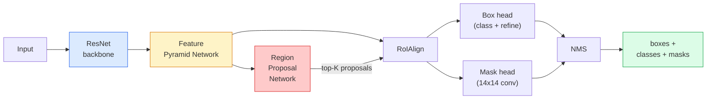

# Phân tích giai đoạn  Mask R-CNN

> Thêm một nhánh nạ nhỏ vào máy dò R-CNN nhanh hơn và bạn có phân đoạn ví dụ. Phần khó là RoIAlign, và nó khó hơn nó trông.

**Type:** Build + Learn
**Languages:** Python
**Prerequisites:** Phase 4 Lesson 06 (YOLO), Phase 4 Lesson 07 (U-Net)
**Time:** ~75 minutes

## Mục tiêu học tập

- Theo dõi kiến trúc R-CNN Mask từ đầu đến cuối: xương sống, FPN, RPN, RoIAlign, đầu hộp, đầu mặt nạ
- Thực hiện RoIAlign từ đầu và giải thích lý do tại sao RoIPool không còn được sử dụng
- Sử dụng tầm nhìn ngọn đuốc `maskrcnn_resnet50_fpn_v2`mô hình được đào tạo trước cho mặt nạ mẫu chất lượng sản xuất và đọc định dạng đầu ra của nó đúng
- Định chỉnh R-CNN trên một bộ dữ liệu tùy chỉnh nhỏ bằng cách thay thế hộp và đầu mặt nạ và giữ xương sống đóng băng

## Vấn đề

Phân vùng ngữ nghĩa cung cấp cho bạn một mặt nạ cho mỗi lớp. Phân vùng mô hình cung cấp cho bạn một mặt nạ cho mỗi đối tượng, ngay cả khi hai đối tượng chia sẻ một lớp. Việc đếm cá nhân, theo dõi qua khung, và đo mọi thứ (hộp giới hạn của mỗi gạch trong một bức tường, mỗi tế bào trong hình ảnh kính hiển vi) tất cả đều yêu cầu phân đoạn mô hình.

Mask R-CNN (He et al., 2017) giải quyết vấn đề này bằng cách tái định dạng phân đoạn ví dụ như phát hiện cộng với một mặt nạ. Thiết kế rất sạch sẽ đến nỗi trong năm năm tiếp theo gần như mọi giấy phân đoạn ví dụ đều là một biến thể của Mask R-CNN, và việc thực hiện torchvision vẫn là mặc định sản xuất cho tập dữ liệu nhỏ đến trung bình.

Vấn đề kỹ thuật khó khăn là lấy mẫu: làm thế nào để cắt một khu vực tính năng kích thước cố định ra khỏi một hộp đề xuất mà các góc không phù hợp với ranh giới pixel?

## Khái niệm

### Kiến trúc



5 điều cần hiểu:

1. **Backbone**ResNet-50 hoặc ResNet-101 được đào tạo trên ImageNet.
2. **FPN (Feature Pyramid Network)** kết nối phía trên xuống + bên cung cấp cho mỗi kênh cấp C các tính năng giàu ngữ nghĩa.
3. **RPN (Region Proposal Network)** một đầu con nhỏ, ở mỗi vị trí neo, dự đoán "có một đối tượng ở đây không?" và "Tôi tinh chỉnh hộp như thế nào?".
4. **RoIAlign** lấy mẫu một vá đặc tính kích thước cố định (ví dụ: 7x7) từ bất kỳ hộp nào ở bất kỳ cấp độ FPN nào.
5. **Heads** đầu hộp hai lớp tinh chế hộp và chọn một lớp, cộng với một đầu con nhỏ mà ra ra một `28x28`Mặt nạ nhị phân cho mỗi đề xuất.

### Tại sao RoIAlign, không phải RoIPool

Các bản gốc Fast R-CNN sử dụng RoIPool, phân chia một hộp đề xuất thành một lưới, lấy tính năng tối đa trong mỗi tế bào, và vòng tròn tất cả các phối hợp thành số nguyên.

```
RoIPool:
  box (34.7, 51.3, 98.2, 142.9)
  round -> (34, 51, 98, 142)
  split grid -> round each cell boundary
  misalignment accumulates at every step

RoIAlign:
  box (34.7, 51.3, 98.2, 142.9)
  sample at exact float coordinates using bilinear interpolation
  no rounding anywhere
```

RoIAlign nâng mặt nạ AP lên 3-4 điểm trên COCO miễn phí.

### RPN trong một đoạn

Ở mỗi vị trí của bản đồ tính năng, đặt các hộp neo K có kích thước và hình dạng khác nhau. Dự đoán điểm đối tượng cho mỗi neo và một sự bù đắp hồi quy để biến neo thành một hộp phù hợp hơn. Giữ số lượng trên của khoảng 1.000 hộp, áp dụng NMS ở IoU 0,7, và giao cho những người sống sót vào đầu. RPN được đào tạo với cấu trúc nhỏ của riêng mình  cùng với lỗ YOLO từ Bài 6, chỉ với hai lớp (nhân vật / không có đối tượng).

### Đầu mặt nạ

Đối với mỗi đề xuất (sau RoIAlign) đầu mặt nạ là một FCN nhỏ: bốn conv 3x3, một conv 2x, một conv cuối cùng 1x1 tạo ra`num_classes`các kênh phát hành tại `28x28`giải pháp. Chỉ có kênh tương ứng với lớp dự đoán được giữ; những kênh khác bị bỏ qua. Điều này tách biệt dự đoán mặt nạ từ phân loại.

Hãy lấy mẫu mặt nạ 28x28 với kích thước pixel ban đầu của đề xuất để tạo ra mặt nạ nhị phân cuối cùng.

### Khối thối

Mask R-CNN có bốn lỗ cộng lại:

```
L = L_rpn_cls + L_rpn_box + L_box_cls + L_box_reg + L_mask
```

- `L_rpn_cls`- `L_rpn_box` đối tượng + hộp lùi lại cho các đề xuất RPN.
- `L_box_cls` sự phân loại chéo trên các lớp (C+1) (bao gồm cả nền) trên phân loại đầu.
- `L_box_reg` L1 mịn trên hộp đầu tinh tế.
- `L_mask` Binary cross-entropy trên mỗi pixel trên đầu ra mặt nạ 28x28.

Mỗi lỗ có trọng lượng mặc định riêng của nó; thực hiện torchvision phơi bày chúng như các lập luận nhà xây dựng.

### Phương thức đầu ra

`torchvision.models.detection.maskrcnn_resnet50_fpn_v2`trả lại một danh sách các dict, một cho mỗi hình ảnh:

```
{
    "boxes":  (N, 4) in (x1, y1, x2, y2) pixel coordinates,
    "labels": (N,) class IDs, 0 = background so indices are 1-based,
    "scores": (N,) confidence scores,
    "masks":  (N, 1, H, W) float masks in [0, 1] — threshold at 0.5 for binary,
}
```

Mặt nạ đã có độ phân giải đầy đủ.

```figure
cv3-roialign-sampling
```

## Hãy xây dựng nó

### Bước 1: Định hướng từ đầu

Đây là một thành phần của Mask R-CNN dễ hiểu hơn là mã so với văn bản.

```python
import torch
import torch.nn.functional as F

def roi_align_single(feature, box, output_size=7, spatial_scale=1 / 16.0):
    """
    feature: (C, H, W) single-image feature map
    box: (x1, y1, x2, y2) in original image pixel coordinates
    output_size: side of the output grid (7 for box head, 14 for mask head)
    spatial_scale: reciprocal of the feature map stride
    """
    C, H, W = feature.shape
    x1, y1, x2, y2 = [c * spatial_scale - 0.5 for c in box]
    bin_w = (x2 - x1) / output_size
    bin_h = (y2 - y1) / output_size

    grid_y = torch.linspace(y1 + bin_h / 2, y2 - bin_h / 2, output_size)
    grid_x = torch.linspace(x1 + bin_w / 2, x2 - bin_w / 2, output_size)
    yy, xx = torch.meshgrid(grid_y, grid_x, indexing="ij")

    gx = 2 * (xx + 0.5) / W - 1
    gy = 2 * (yy + 0.5) / H - 1
    grid = torch.stack([gx, gy], dim=-1).unsqueeze(0)
    sampled = F.grid_sample(feature.unsqueeze(0), grid, mode="bilinear",
                            align_corners=False)
    return sampled.squeeze(0)
```

Mỗi số ở vị trí mẫu bằng hai tuyến, không tròn, không lượng hóa, không giảm gradient.

### Bước 2: So sánh với RoIAlign của torchvision

```python
from torchvision.ops import roi_align

feature = torch.randn(1, 16, 50, 50)
boxes = torch.tensor([[0, 10, 20, 100, 90]], dtype=torch.float32)  # (batch_idx, x1, y1, x2, y2)

ours = roi_align_single(feature[0], boxes[0, 1:].tolist(), output_size=7, spatial_scale=1/4)
theirs = roi_align(feature, boxes, output_size=(7, 7), spatial_scale=1/4, sampling_ratio=1, aligned=True)[0]

print(f"shape ours:   {tuple(ours.shape)}")
print(f"shape theirs: {tuple(theirs.shape)}")
print(f"max|diff|:    {(ours - theirs).abs().max().item():.3e}")
```

Với `sampling_ratio=1`và `aligned=True`, hai người phù hợp với bên trong `1e-5`- Tôi không biết.

### Bước 3: Lắp một mặt nạ R-CNN được huấn luyện trước

```python
import torch
from torchvision.models.detection import maskrcnn_resnet50_fpn_v2, MaskRCNN_ResNet50_FPN_V2_Weights

model = maskrcnn_resnet50_fpn_v2(weights=MaskRCNN_ResNet50_FPN_V2_Weights.DEFAULT)
model.eval()
print(f"params: {sum(p.numel() for p in model.parameters()):,}")
print(f"classes (including background): {len(model.roi_heads.box_predictor.cls_score.out_features * [0])}")
```

Các tham số 46M, 91 lớp (COCO). lớp đầu tiên (id 0) là nền; mọi thứ mô hình thực sự phát hiện bắt đầu từ id 1.

### Bước 4: Đi kết luận

```python
with torch.no_grad():
    x = torch.randn(3, 400, 600)
    predictions = model([x])
p = predictions[0]
print(f"boxes:  {tuple(p['boxes'].shape)}")
print(f"labels: {tuple(p['labels'].shape)}")
print(f"scores: {tuple(p['scores'].shape)}")
print(f"masks:  {tuple(p['masks'].shape)}")
```

Tăngtor mặt nạ là hình dạng`(N, 1, H, W)`. Khoảng 0,5 để có được một mặt nạ nhị phân cho mỗi đối tượng:

```python
binary_masks = (p['masks'] > 0.5).squeeze(1)  # (N, H, W) boolean
```

### Bước 5: Thay đổi đầu cho một class count tùy chỉnh

Công thức điều chỉnh tinh tế phổ biến: sử dụng lại xương sống, FPN và RPN; thay thế hai đầu phân loại.

```python
from torchvision.models.detection.faster_rcnn import FastRCNNPredictor
from torchvision.models.detection.mask_rcnn import MaskRCNNPredictor

def build_custom_maskrcnn(num_classes):
    model = maskrcnn_resnet50_fpn_v2(weights=MaskRCNN_ResNet50_FPN_V2_Weights.DEFAULT)
    in_features = model.roi_heads.box_predictor.cls_score.in_features
    model.roi_heads.box_predictor = FastRCNNPredictor(in_features, num_classes)
    in_features_mask = model.roi_heads.mask_predictor.conv5_mask.in_channels
    hidden_layer = 256
    model.roi_heads.mask_predictor = MaskRCNNPredictor(in_features_mask, hidden_layer, num_classes)
    return model

custom = build_custom_maskrcnn(num_classes=5)
print(f"custom cls_score.out_features: {custom.roi_heads.box_predictor.cls_score.out_features}")
```

`num_classes`phải bao gồm lớp nền, vì vậy một tập dữ liệu với 4 lớp đối tượng sử dụng `num_classes=5`- Tôi không biết.

### Bước 6: Giữ những gì không cần huấn luyện

Trong các tập dữ liệu nhỏ, đóng băng xương sống và FPN. Chỉ có đối tượng RPN + hồi quy và hai đầu học.

```python
def freeze_backbone_and_fpn(model):
    # torchvision Mask R-CNN packs the FPN inside `model.backbone` (as
    # `model.backbone.fpn`), so iterating `model.backbone.parameters()` covers
    # both the ResNet feature layers and the FPN lateral/output convs.
    for p in model.backbone.parameters():
        p.requires_grad = False
    return model

custom = freeze_backbone_and_fpn(custom)
trainable = sum(p.numel() for p in custom.parameters() if p.requires_grad)
print(f"trainable after freeze: {trainable:,}")
```

Trong bộ dữ liệu 500 hình ảnh, đây là sự khác biệt giữa sự hội tụ và quá phù hợp.

## Sử dụng nó

Loop đào tạo đầy đủ cho Mask R-CNN trong torchvision là 40 dòng và không thay đổi đáng kể giữa các nhiệm vụ  trao đổi tập dữ liệu và đi.

```python
def train_step(model, images, targets, optimizer):
    model.train()
    loss_dict = model(images, targets)
    losses = sum(loss for loss in loss_dict.values())
    optimizer.zero_grad()
    losses.backward()
    optimizer.step()
    return {k: v.item() for k, v in loss_dict.items()}
```

- `targets`danh sách phải có các chữ cái mỗi hình ảnh với `boxes`- `labels`, và`masks`(đúng như `(num_instances, H, W)`mô hình trả lại một dict của bốn lỗ trong quá trình đào tạo và một danh sách dự đoán trong eval, được nhấn vào `model.training`- Tôi không biết.

- `pycocotools`evaluator tạo ra mAP@IoU=0.5:0.95 cả cho các hộp và cho mặt nạ; bạn cần cả hai số để biết liệu đầu hộp hay đầu mặt nạ là nút thắt.

## Chuyển nó

Bài học này mang lại:

- `outputs/prompt-instance-vs-semantic-router.md` một lời nhắc hỏi đặt ba câu hỏi và chọn ví dụ vs ngữ nghĩa vs toàn quan tính cộng với mô hình chính xác để bắt đầu.
- `outputs/skill-mask-rcnn-head-swapper.md` một kỹ năng tạo ra 10 dòng mã để thay đổi đầu trên bất kỳ mô hình phát hiện đèn pin, do các mới `num_classes`- Tôi không biết.

## Các bài tập

1. **(Easy)**Kiểm tra RoIAlign của bạn chống lại `torchvision.ops.roi_align`trên 100 hộp ngẫu nhiên. báo cáo sự khác biệt tuyệt đối tối đa. Ngoài ra chạy RoIPool (hành vi trước năm 2017) và hiển thị nó phân biệt bằng ~ 1-2 phích số bản đồ tính năng trên các hộp gần biên giới.
2. **(Medium)**- Đúng rồi.`maskrcnn_resnet50_fpn_v2`trên một bộ dữ liệu tùy chỉnh 50 hình ảnh (bất kỳ hai lớp: bóng, cá, hố, logo).
3. **(Hard)**Thay thế đầu mặt nạ của Mask R-CNN bằng một cái dự đoán ở 56x56 thay vì 28x28. đo mAP@IoU = 0,75 trước và sau. Giải thích tại sao lợi nhuận (hoặc thiếu một) phù hợp với sự đổi giá biên giới-sự chính xác / bộ nhớ dự kiến.

## Các điều khoản chính

| Term | What people say | What it actually means |
|------|----------------|----------------------|
| Mask R-CNN | "Detection plus masks" | Faster R-CNN + a small FCN head that predicts a 28x28 mask per proposal per class |
| FPN | "Feature pyramid" | Top-down + lateral connections that give every stride level C channels of semantic-rich features |
| RPN | "Region proposer" | A small conv head that produces ~1000 object/no-object proposals per image |
| RoIAlign | "No-rounding crop" | Bilinearly samples a fixed-size feature grid from any float-coordinate box |
| RoIPool | "Pre-2017 crop" | Same purpose as RoIAlign but rounds box coordinates; obsolete |
| Mask AP | "Instance mAP" | Average precision computed with mask IoU instead of box IoU; the COCO instance segmentation metric |
| Binary mask head | "Per-class mask" | Predicts one binary mask per class for each proposal; only the predicted class's channel is kept |
| Background class | "Class 0" | The catch-all "no object" class; indices for real classes start at 1 |

## Đọc thêm

- [Mask R-CNN (He et al., 2017)](https://arxiv.org/abs/1703.06870) bài báo; phần 3 về RoIAlign là bài đọc quan trọng
- [FPN: Feature Pyramid Networks (Lin et al., 2017)](https://arxiv.org/abs/1612.03144) giấy FPN; mọi máy dò hiện đại sử dụng nó
- [torchvision Mask R-CNN tutorial](https://pytorch.org/tutorials/intermediate/torchvision_tutorial.html) tham chiếu cho vòng tròn điều chỉnh tinh tế
- [Detectron2 model zoo](https://github.com/facebookresearch/detectron2/blob/main/MODEL_ZOO.md) Các thiết kế sản xuất với trọng lượng được đào tạo cho hầu hết các biến thể phát hiện và phân đoạn
