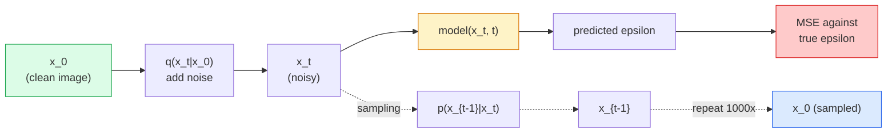

# Tạo hình ảnh  Mô hình phân tán

> Một mô hình phân tán học cách phủ định, huấn luyện nó để loại bỏ một chút tiếng ồn nhỏ từ một hình ảnh ồn ào, lặp lại một ngàn lần ngược lại, và bạn có một máy tạo hình ảnh.

**Type:** Build
**Languages:** Python
**Prerequisites:** Phase 4 Lesson 07 (U-Net), Phase 1 Lesson 06 (Probability), Phase 3 Lesson 06 (Optimizers)
**Time:** ~75 minutes

## Mục tiêu học tập

- Thuộc dẫn quá trình âm thanh về phía trước `x_0 -> x_1 -> ... -> x_T`và giải thích tại sao hình thức đóng`q(x_t | x_0)`giữ cho bất kỳ t
- Thực hiện một mục tiêu đào tạo theo kiểu DDPM để giảm tiếng ồn được thêm vào mỗi bước, và một mẫu người đi lại từ tiếng ồn thuần túy sang hình ảnh
- Xây dựng một U-Net có điều kiện thời gian (số nhỏ đủ để đào tạo trên CPU) dự đoán tiếng ồn cho bất kỳ bước thời gian nào
- Giải thích sự khác biệt giữa lấy mẫu DDPM và DDIM, và khi nào mỗi mẫu phù hợp (Sự học 23 bao gồm sự phù hợp dòng chảy và dòng chảy chỉnh sâu)

## Vấn đề

GAN tạo ra một cú bắn: tiếng ồn vào, hình ảnh ra, một lần đi trước. Chúng nhanh và khó huấn luyện. Các mô hình phân tán tạo ra lặp đi lặp lại: bắt đầu từ tiếng ồn thuần khiết, chỉ định bằng các bước nhỏ, hình ảnh xuất hiện. Chúng chậm và dễ huấn luyện. Trong năm năm qua, đặc tính sau đây đã thống trị: bất kỳ đội nhỏ nào có thể đào tạo mô hình phân tán và nhận được các mẫu hợp lý; đào tạo GAN là một nghề bạn học được qua nhiều năm chạy thất bại.

Ngoài sự ổn định đào tạo, cấu trúc lặp lại của sự phân tán là điều mở khóa tất cả những gì mà thế hệ hình ảnh hiện đại làm: điều kiện văn bản, vẽ, chỉnh sửa hình ảnh, độ phân giải siêu, phong cách có thể kiểm soát. Mỗi bước trong vòng lấy mẫu là một nơi để tiêm một hạn chế mới. Đó là lý do tại sao Stable Diffusion, Imagen, DALL-E 3, Midjourney, và mọi mô hình hình ảnh có thể điều khiển mà bạn sẽ sử dụng đều dựa trên sự pha trộn.

Bài học này xây dựng DDPM tối thiểu: tiếng ồn về phía trước, tiếng ồn về phía sau, vòng đào tạo. Bài học tiếp theo (Stable Diffusion) dây nó vào một hệ thống sản xuất với một VAE, một mã hóa văn bản và hướng dẫn không có phân loại.

## Khái niệm

### Quá trình tiến bộ

Hãy chụp ảnh`x_0`Thêm một lượng nhỏ tiếng ồn Gaussian để có được`x_1`Thêm thêm một lượng nhỏ để lấy được`x_2`Cứ tiếp tục bước đi cho đến khi`x_T`gần như không thể phân biệt được với tiếng ồn Gaussian thuần túy.

```
q(x_t | x_{t-1}) = N(x_t; sqrt(1 - beta_t) * x_{t-1},  beta_t * I)
```

`beta_t`là một lịch trình biến động nhỏ, thường tuyến tính từ 0.0001 đến 0.02 trên T = 1000 bước.

### Chuyến nhảy hình thức đóng

Thêm tiếng ồn một bước một lần là một chuỗi Markov, nhưng toán học gấp: bạn có thể lấy mẫu`x_t`trực tiếp từ `x_0`chỉ một bước thôi.

```
Define alpha_t = 1 - beta_t
Define alpha_bar_t = prod_{s=1..t} alpha_s

Then:
  q(x_t | x_0) = N(x_t; sqrt(alpha_bar_t) * x_0,  (1 - alpha_bar_t) * I)

Equivalently:
  x_t = sqrt(alpha_bar_t) * x_0 + sqrt(1 - alpha_bar_t) * epsilon
  where epsilon ~ N(0, I)
```

Sự phân tán này là lý do thực tế.`t`, mẫu `x_t`trực tiếp từ `x_0`, và đào tạo trong một bước không cần mô phỏng toàn bộ chuỗi Markov.

### Quá trình ngược

Quá trình tiến lên là cố định.`p(x_{t-1} | x_t)`là những gì mạng thần kinh học được.`x_{t-1}`trực tiếp; họ dự đoán tiếng ồn`epsilon`thêm vào bước t, và toán học dẫn đến `x_{t-1}`từ nó.



### Sự mất tập

Đối với mỗi bước đào tạo:

1. lấy mẫu hình ảnh thực sự`x_0`- Tôi không biết.
2. Mô tả bước thời gian `t`một cách đồng nhất từ [1, T].
3. Phản ứng tiếng ồn`epsilon ~ N(0, I)`- Tôi không biết.
4. Lưu ý`x_t = sqrt(alpha_bar_t) * x_0 + sqrt(1 - alpha_bar_t) * epsilon`- Tôi không biết.
5. Dự đoán`epsilon_theta(x_t, t)`với mạng lưới.
6. Giảm thiểu `|| epsilon - epsilon_theta(x_t, t) ||^2`- Tôi không biết.

Đó là nó. mạng thần kinh học được dự đoán tiếng ồn ở bất kỳ bước nào. mất mát là MSE. Không có trò chơi đối kháng, không có sụp đổ, không có dao động.

### Bộ lấy mẫu (DDPM)

Để tạo ra: bắt đầu từ `x_T ~ N(0, I)`và đi lại một bước một lần.

```
for t = T, T-1, ..., 1:
    eps = model(x_t, t)
    x_{t-1} = (1 / sqrt(alpha_t)) * (x_t - (beta_t / sqrt(1 - alpha_bar_t)) * eps) + sqrt(beta_t) * z
    where z ~ N(0, I) if t > 1, else 0
return x_0
```

Điều quan trọng là mặc dù điều kiện ngược không được biết trong hình thức đóng chung, cho quá trình tiến của Gaussian cụ thể này nó là.

### Tại sao 1000 bước

Lịch trình âm thanh phía trước được chọn để mỗi bước thêm đủ tiếng ồn để bước ngược gần như là Gaussian.

### DDIM: lấy mẫu nhanh hơn 20 lần

Việc đào tạo cũng giống nhau. Phân tích thay đổi. DDIM (Song et al., 2020) xác định một quy trình ngược xác định mà bỏ qua các bước thời gian mà không cần đào tạo lại. Phân tích bằng 50 bước với DDIM mang lại chất lượng DDPM gần 1000 bước. Mỗi hệ thống sản xuất sử dụng DDIM hoặc một biến thể nhanh hơn (DPM-Solver, tổ tiên của Euler).

### Điều kiện thời gian

Mạng lưới `epsilon_theta(x_t, t)`cần biết bước thời gian mà nó đang chỉ định.`t`thông qua các bản ghi thời gian hình âm (những ý tưởng tương tự như mã hóa vị trí trong các biến thể) được thêm vào các bản đồ tính năng ở mọi cấp độ U-Net.

```
t_embedding = sinusoidal(t)
feature_map += MLP(t_embedding)
```

Không điều chỉnh thời gian mạng phải đoán mức độ tiếng ồn từ hình ảnh đó, hoạt động nhưng ít hiệu quả hơn nhiều.

```figure
cv-diffusion-image
```

## Hãy xây dựng nó

### Bước 1: Chương trình tiếng ồn

```python
import torch

def linear_beta_schedule(T=1000, beta_start=1e-4, beta_end=2e-2):
    return torch.linspace(beta_start, beta_end, T)


def precompute_schedule(betas):
    alphas = 1.0 - betas
    alphas_cumprod = torch.cumprod(alphas, dim=0)
    return {
        "betas": betas,
        "alphas": alphas,
        "alphas_cumprod": alphas_cumprod,
        "sqrt_alphas_cumprod": torch.sqrt(alphas_cumprod),
        "sqrt_one_minus_alphas_cumprod": torch.sqrt(1.0 - alphas_cumprod),
        "sqrt_recip_alphas": torch.sqrt(1.0 / alphas),
    }

schedule = precompute_schedule(linear_beta_schedule(T=1000))
```

Lập trước một lần, thu thập theo chỉ số trong quá trình đào tạo và lấy mẫu.

### Bước 2: Phân phối về phía trước (q_sample)

```python
def q_sample(x0, t, noise, schedule):
    sqrt_a = schedule["sqrt_alphas_cumprod"][t].view(-1, 1, 1, 1)
    sqrt_one_minus_a = schedule["sqrt_one_minus_alphas_cumprod"][t].view(-1, 1, 1, 1)
    return sqrt_a * x0 + sqrt_one_minus_a * noise
```

Mô hình đóng cửa một dòng. `t`là một loạt các bước thời gian, một trong mỗi hình ảnh trong loạt.

### Bước 3: Một mạng U-Net nhỏ với điều kiện thời gian

```python
import torch.nn as nn
import torch.nn.functional as F
import math

def timestep_embedding(t, dim=64):
    half = dim // 2
    freqs = torch.exp(-math.log(10000) * torch.arange(half, device=t.device) / half)
    args = t[:, None].float() * freqs[None]
    emb = torch.cat([args.sin(), args.cos()], dim=-1)
    return emb


class TinyUNet(nn.Module):
    def __init__(self, img_channels=3, base=32, t_dim=64):
        super().__init__()
        self.t_mlp = nn.Sequential(
            nn.Linear(t_dim, base * 4),
            nn.SiLU(),
            nn.Linear(base * 4, base * 4),
        )
        self.t_dim = t_dim
        self.enc1 = nn.Conv2d(img_channels, base, 3, padding=1)
        self.enc2 = nn.Conv2d(base, base * 2, 4, stride=2, padding=1)
        self.mid = nn.Conv2d(base * 2, base * 2, 3, padding=1)
        self.dec1 = nn.ConvTranspose2d(base * 2, base, 4, stride=2, padding=1)
        self.dec2 = nn.Conv2d(base * 2, img_channels, 3, padding=1)
        self.time_proj = nn.Linear(base * 4, base * 2)

    def forward(self, x, t):
        t_emb = timestep_embedding(t, self.t_dim)
        t_emb = self.t_mlp(t_emb)
        t_proj = self.time_proj(t_emb)[:, :, None, None]

        h1 = F.silu(self.enc1(x))
        h2 = F.silu(self.enc2(h1)) + t_proj
        h3 = F.silu(self.mid(h2))
        d1 = F.silu(self.dec1(h3))
        d2 = torch.cat([d1, h1], dim=1)
        return self.dec2(d2)
```

U-Net hai cấp với điều kiện thời gian được tiêm vào nút thắt chai.

### Bước 4: vòng đào tạo

```python
def train_step(model, x0, schedule, optimizer, device, T=1000):
    model.train()
    x0 = x0.to(device)
    bs = x0.size(0)
    t = torch.randint(0, T, (bs,), device=device)
    noise = torch.randn_like(x0)
    x_t = q_sample(x0, t, noise, schedule)
    pred = model(x_t, t)
    loss = F.mse_loss(pred, noise)
    optimizer.zero_grad()
    loss.backward()
    optimizer.step()
    return loss.item()
```

Đó là toàn bộ vòng đào tạo, không có trò chơi GAN, không có thua lỗ chuyên môn, một cuộc gọi MSE.

### Bước 5: Nhận mẫu (DDPM)

```python
@torch.no_grad()
def sample(model, schedule, shape, T=1000, device="cpu"):
    model.eval()
    x = torch.randn(shape, device=device)
    betas = schedule["betas"].to(device)
    sqrt_one_minus_a = schedule["sqrt_one_minus_alphas_cumprod"].to(device)
    sqrt_recip_alphas = schedule["sqrt_recip_alphas"].to(device)

    for t in reversed(range(T)):
        t_batch = torch.full((shape[0],), t, dtype=torch.long, device=device)
        eps = model(x, t_batch)
        coef = betas[t] / sqrt_one_minus_a[t]
        mean = sqrt_recip_alphas[t] * (x - coef * eps)
        if t > 0:
            x = mean + torch.sqrt(betas[t]) * torch.randn_like(x)
        else:
            x = mean
    return x
```

1000 đường đi trước để tạo ra một loạt các mẫu. trong mã thực bạn sẽ đổi lấy một mẫu 50 bước DDIM.

### Bước 6: Dùng lấy mẫu DDIM (định nghĩa, ~ 20 lần nhanh hơn)

```python
@torch.no_grad()
def sample_ddim(model, schedule, shape, steps=50, T=1000, device="cpu", eta=0.0):
    model.eval()
    x = torch.randn(shape, device=device)
    alphas_cumprod = schedule["alphas_cumprod"].to(device)

    ts = torch.linspace(T - 1, 0, steps + 1).long()
    for i in range(steps):
        t = ts[i]
        t_prev = ts[i + 1]
        t_batch = torch.full((shape[0],), t, dtype=torch.long, device=device)
        eps = model(x, t_batch)
        a_t = alphas_cumprod[t]
        a_prev = alphas_cumprod[t_prev] if t_prev >= 0 else torch.tensor(1.0, device=device)
        x0_pred = (x - torch.sqrt(1 - a_t) * eps) / torch.sqrt(a_t)
        sigma = eta * torch.sqrt((1 - a_prev) / (1 - a_t) * (1 - a_t / a_prev))
        dir_xt = torch.sqrt(1 - a_prev - sigma ** 2) * eps
        noise = sigma * torch.randn_like(x) if eta > 0 else 0
        x = torch.sqrt(a_prev) * x0_pred + dir_xt + noise
    return x
```

`eta=0`là hoàn toàn xác định (những đầu vào âm thanh tương tự luôn tạo ra cùng một đầu ra). `eta=1`phục hồi DDPM.

## Sử dụng nó

Đối với công việc sản xuất, sử dụng `diffusers`- Có thể là:

```python
from diffusers import DDPMScheduler, UNet2DModel

unet = UNet2DModel(sample_size=32, in_channels=3, out_channels=3, layers_per_block=2)
scheduler = DDPMScheduler(num_train_timesteps=1000)
```

Thư viện cung cấp các lập trình viên sẵn sàng (DDPM, DDIM, DPM-Solver, Euler, Heun), U-Nets có thể cấu hình, đường ống dẫn cho văn bản-to-image và hình ảnh-to-image, và trợ lý điều chỉnh tinh tế LoRA.

Để nghiên cứu,`k-diffusion`(Katherine Crowson) có các ứng dụng tham chiếu trung thành nhất và các biến thể lấy mẫu tốt nhất.

## Chuyển nó

Bài học này mang lại:

- `outputs/prompt-diffusion-sampler-picker.md` một lời nhắc chọn DDPM / DDIM / DPM-Solver / Euler dựa trên mục tiêu chất lượng, ngân sách độ trễ và loại điều kiện.
- `outputs/skill-noise-schedule-designer.md` một kỹ năng tạo ra một lịch trình beta tuyến tính, cosine, hoặc sigmoid với mức độ tham nhũng mục tiêu và cộng với các bản đồ chẩn đoán tỷ lệ tín hiệu-xâo động theo thời gian.

## Các bài tập

1. **(Easy)**Hình ảnh quá trình tiến lên: chụp một hình ảnh và vẽ `x_t``t in [0, 100, 250, 500, 750, 1000]`- Hãy kiểm tra.`x_1000`trông giống như tiếng ồn Gaussian.
2. **(Medium)**Đào tạo TinyUNet trên bộ dữ liệu vòng tròn tổng hợp trong 20 thời đại và lấy mẫu 16 vòng tròn. So sánh lấy mẫu DDPM (1000 bước) và DDIM (50 bước)  liệu chúng có tạo ra hình ảnh tương tự từ giống giống tiếng ồn?
3. **(Hard)**Thực hiện lịch trình tiếng ồn cosine (Nichol & Dhariwal, 2021): `alpha_bar_t = cos^2((t/T + s) / (1 + s) * pi / 2)`- Tập cùng một mô hình với các lịch trình tuyến tính và cosine và cho thấy cosine cung cấp các mẫu tốt hơn với số bước thấp.

## Các điều khoản chính

| Term | What people say | What it actually means |
|------|----------------|----------------------|
| Forward process | "Add noise over time" | Fixed Markov chain that corrupts an image into Gaussian noise over T steps |
| Reverse process | "Denoise step by step" | Learned distribution that walks back from noise to image |
| Epsilon prediction | "Predict the noise" | The training target: `epsilon_theta(x_t, t)` predicts the noise added at step t |
| Beta schedule | "Noise amounts" | Sequence of T small variances that define how much noise enters per step |
| alpha_bar_t | "Cumulative retain factor" | Product of (1 - beta_s) up to time t; bigger t means less signal left |
| DDPM sampler | "Ancestral, stochastic" | Samples each x_{t-1} from its conditional Gaussian; 1000 steps |
| DDIM sampler | "Deterministic, fast" | Rewrites sampling as a deterministic ODE; 20-100 steps with similar quality |
| Time conditioning | "Tell the model which t" | Sinusoidal embedding of t injected into the U-Net so it knows the noise level |

## Đọc thêm

- [Denoising Diffusion Probabilistic Models (Ho et al., 2020)](https://arxiv.org/abs/2006.11239) báo cáo làm cho việc truyền tải thực tế và đánh bại GAN trên FID
- [Improved DDPM (Nichol & Dhariwal, 2021)](https://arxiv.org/abs/2102.09672) lịch trình cosine và v-chỉ số hóa
- [DDIM (Song, Meng, Ermon, 2020)](https://arxiv.org/abs/2010.02502) mẫu xác định làm cho suy luận thời gian thực có thể
- [Elucidating the Design Space of Diffusion (Karras et al., 2022)](https://arxiv.org/abs/2206.00364) một cái nhìn thống nhất của mỗi lựa chọn thiết kế phân tán; tài liệu tham khảo tốt nhất hiện tại
