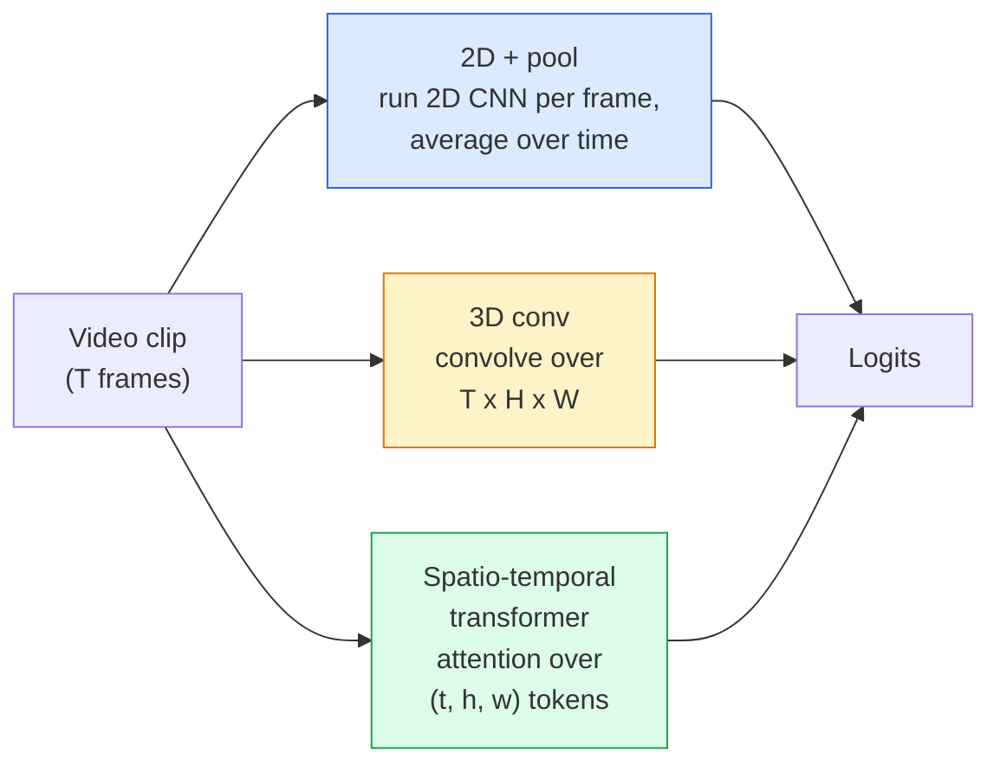

# Video Nghĩ  Tiêu mẫu thời gian

> Một video là một chuỗi hình ảnh cộng với vật lý kết nối chúng. Mỗi mô hình video hoặc xử lý thời gian như một trục bổ sung (3D conv), một chuỗi để tham dự (giới chuyển đổi), hoặc một tính năng để trích xuất một lần và bể (2D + bể).

**Type:** Learn + Build
**Languages:** Python
**Prerequisites:** Phase 4 Lesson 03 (CNNs), Phase 4 Lesson 04 (Image Classification)
**Time:** ~45 minutes

## Mục tiêu học tập

- Hóa ra sự khác biệt giữa ba phương pháp mô hình hóa video chính (2D+pool, 3D conv, space-temporal transformer) và dự đoán các sự thỏa hiệp về chi phí và độ chính xác của chúng
- Thực hiện lấy mẫu khung, hợp nhất thời gian và phân loại cơ sở 2D + pool trong PyTorch
- Giải thích tại sao các hạt nhân 3D "bùng phát" của I3D chuyển tốt từ trọng lượng ImageNet và một conv (2+1) D nhân tố làm gì khác nhau
- Đọc các bộ dữ liệu và số liệu nhận dạng hành động tiêu chuẩn: Kinetics-400/600, UCF101, Something-Something V2; độ chính xác hàng đầu ở cấp độ clip và video

## Vấn đề

Một video 30 giây ở tốc độ 30 fps là 900 hình ảnh. Thần túy, phân loại video là phân loại hình ảnh chạy 900 lần sau đó là một số loại tổng hợp. Điều đó hoạt động khi hành động được nhìn thấy trong hầu hết mọi khung hình (cách thể thao, nấu ăn, video tập thể dục) và thất bại nặng khi hành động được xác định bởi chuyển động chính nó: "đẩy một cái gì đó từ trái sang phải" trông giống như hai đối tượng tĩnh trong mỗi khung hình.

Câu hỏi cốt lõi cho mọi kiến trúc video là: khi nào cấu trúc thời gian được mô hình hóa, và làm thế nào? Câu trả lời thúc đẩy mọi thứ khác  tính toán chi phí, chiến lược trước khi tập luyện, liệu bạn có thể tái sử dụng trọng lượng ImageNet, tập hợp dữ liệu nào mô hình được đào tạo.

Bài học này cố ý ngắn hơn các bài học hình ảnh tĩnh. Máy cơ bản hình ảnh đã được thiết lập, và hiểu biết video chủ yếu là về câu chuyện thời gian: lấy mẫu, mô hình hóa và tổng hợp.

## Khái niệm

### Ba gia đình kiến trúc



### 2D + hồ bơi

Hãy lấy một 2D CNN (ResNet, EfficientNet, ViT). Đưa nó độc lập trên mỗi khung hình được lấy mẫu. Tỷ lệ trung bình (hoặc tập trung tối đa, hoặc tập trung sự chú ý) các nhúng per khung. Đưa các vector tập hợp đến một phân loại.

Lợi thế:
- ImageNet chuyển giao trực tiếp trước khi đào tạo.
- Tốt nhất để thực hiện.
- Giá rẻ: T khung * chi phí suy luận hình ảnh đơn.

Khối tác:
- Không thể mô hình chuyển động.
- Sự hợp nhất thời gian không thay đổi theo thứ tự; "cửa mở" và "cửa đóng" trông giống nhau.

Khi nào sử dụng: các nhiệm vụ có vẻ nặng, chuyển giao học tập trên các tập dữ liệu video nhỏ, đường cơ sở ban đầu.

### Chuyển chuyển 3D

Thay thế hạt nhân 2D (H, W) bằng hạt nhân 3D (T, H, W).

Trùi I3D: lấy một mô hình 2D ImageNet được đào tạo trước, "tăng" mỗi hạt nhân 2D bằng cách sao chép nó dọc theo một trục thời gian mới. Một conv 3x3 2D trở thành một conv 3x3 3D. Điều này cho mô hình 3D trọng lượng trước được đào tạo mạnh mẽ thay vì đào tạo từ đầu.

Lợi thế:
- Cần mô hình chuyển động trực tiếp.
- Tăng lạm phát I3D mang lại việc học tập chuyển đổi miễn phí.

Khối tác:
- T/8 nhiều FLOP hơn đối tác 2D (cho hạt nhân thời gian 3 xếp chồng lên 3 lần).
- Các hạt nhân thời gian nhỏ; chuyển động tầm xa cần một cách tiếp cận kim tự tháp hoặc dòng chảy kép.

Khi sử dụng: nhận dạng hành động khi chuyển động là tín hiệu (Something-Something V2, Kinetics với các lớp chuyển động nặng).

### Máy biến đổi không gian-thời gian

Đánh dấu video vào một lưới các bản vá không-thời gian và tham gia tất cả chúng.

Các mô hình chú ý quan trọng:
- **Joint** một sự chú ý lớn trên (t, h, w).`T*H*W`- Đắt lắm.
- **Divided** hai sự chú ý mỗi khối: một trong thời gian, một trong không gian.
- **Factorised** Sự chú ý thời gian thay thế với sự chú ý không gian trên các khối.

Lợi thế:
- Độ chính xác SOTA trên mọi chỉ số chuẩn chính.
- Chuyển từ các bộ biến hình ảnh (ViT) thông qua lạm phát các vá.
- Hỗ trợ video ngữ cảnh dài thông qua sự chú ý ít.

Khối tác:
- Đói máy tính.
- Cần sự lựa chọn cẩn thận về mô hình hoặc bóng chạy.

Khi nào sử dụng: tập hợp dữ liệu lớn, hiểu video độ trung thực cao, các nhiệm vụ video + văn bản đa phương thức.

### Phân mẫu khung

Một clip 10 giây ở tốc độ 30 fps là 300 khung hình; cung cấp tất cả 300 cho bất kỳ mô hình nào là lãng phí.

- **Uniform sampling** chọn khung T ngang trên clip.
- **Dense sampling** cửa sổ khung T liền kề ngẫu nhiên. phổ biến cho các conv 3D vì chuyển động đòi hỏi khung lân cận.
- **Multi-clip** lấy mẫu nhiều cửa sổ khung T từ cùng một video, phân loại từng cửa sổ, dự đoán trung bình tại thời điểm thử nghiệm.

T thường là 8, 16, 32, hoặc 64. T cao hơn = tín hiệu thời gian nhiều hơn với tính toán nhiều hơn.

### Đánh giá

Hai cấp độ:
- **Clip-level accuracy** mô hình thấy một clip khung T, báo cáo top-k.
- **Video-level accuracy** dự đoán cấp độ clip trung bình trên nhiều clip mỗi video; cao hơn và ổn định hơn.

Luôn báo cáo cả hai. Một mô hình ghi điểm 78% clip / 82% video phụ thuộc rất nhiều vào thời gian thử nghiệm trung bình; một mô hình ghi điểm 80% / 81% mạnh hơn cho mỗi clip.

### Các bộ dữ liệu bạn sẽ gặp

- **Kinetics-400 / 600 / 700** bộ dữ liệu hành động mục đích chung. 400k clip; URL YouTube (nhiều người đã chết).
- **Something-Something V2** Các hành động được định nghĩa bởi chuyển động ("quyển X từ trái sang phải"). Không thể được giải quyết bằng 2D + pool.
- **UCF-101**- **HMDB-51** lớn tuổi, nhỏ hơn, vẫn được báo cáo.
- **AVA** hành động *định vị* trong không gian và thời gian; khó hơn so với phân loại.

```figure
v4-video-temporal
```

## Hãy xây dựng nó

### Bước 1: Chụp mẫu khung

Các mẫu đơn vị và dày đặc hoạt động trên một danh sách khung (hoặc một tensor video).

```python
import numpy as np

def sample_uniform(num_frames_total, T):
    if num_frames_total <= T:
        return list(range(num_frames_total)) + [num_frames_total - 1] * (T - num_frames_total)
    step = num_frames_total / T
    return [int(i * step) for i in range(T)]


def sample_dense(num_frames_total, T, rng=None):
    rng = rng or np.random.default_rng()
    if num_frames_total <= T:
        return list(range(num_frames_total)) + [num_frames_total - 1] * (T - num_frames_total)
    start = int(rng.integers(0, num_frames_total - T + 1))
    return list(range(start, start + T))
```

Cả hai đều quay lại`T`chỉ số mà bạn sử dụng để cắt các tensor video.

### Bước 2: Một đường cơ sở 2D + pool

Lấy ResNet-18 2D trên mỗi khung hình, tính năng trung bình, phân loại.

```python
import torch
import torch.nn as nn
from torchvision.models import resnet18, ResNet18_Weights

class FramePool(nn.Module):
    def __init__(self, num_classes=400, pretrained=True):
        super().__init__()
        weights = ResNet18_Weights.IMAGENET1K_V1 if pretrained else None
        backbone = resnet18(weights=weights)
        self.features = nn.Sequential(*(list(backbone.children())[:-1]))  # global avg pool kept
        self.head = nn.Linear(512, num_classes)

    def forward(self, x):
        # x: (N, T, 3, H, W)
        N, T = x.shape[:2]
        x = x.view(N * T, *x.shape[2:])
        feats = self.features(x).view(N, T, -1)
        pooled = feats.mean(dim=1)
        return self.head(pooled)

model = FramePool(num_classes=10)
x = torch.randn(2, 8, 3, 224, 224)
print(f"output: {model(x).shape}")
print(f"params: {sum(p.numel() for p in model.parameters()):,}")
```

Một mươi triệu tham số, ImageNet đã được đào tạo trước, chạy theo mỗi khung, trung bình, phân loại. Hình cơ sở này thường nằm trong vòng 5-10 điểm của các mô hình 3D thích hợp cho các nhiệm vụ có vẻ nặng  đôi khi tốt hơn, bởi vì nó sử dụng lại xương sống ImageNet mạnh hơn.

### Bước 3: Một con thùng 3D phong cách I3D

Chuyển một con 2D duy nhất thành con 3D bằng cách lặp lại trọng lượng dọc theo một trục thời gian mới.

```python
def inflate_2d_to_3d(conv2d, time_kernel=3):
    out_c, in_c, kh, kw = conv2d.weight.shape
    weight_3d = conv2d.weight.data.unsqueeze(2)  # (out, in, 1, kh, kw)
    weight_3d = weight_3d.repeat(1, 1, time_kernel, 1, 1) / time_kernel
    conv3d = nn.Conv3d(in_c, out_c, kernel_size=(time_kernel, kh, kw),
                        padding=(time_kernel // 2, conv2d.padding[0], conv2d.padding[1]),
                        stride=(1, conv2d.stride[0], conv2d.stride[1]),
                        bias=False)
    conv3d.weight.data = weight_3d
    return conv3d

conv2d = nn.Conv2d(3, 64, kernel_size=3, padding=1, bias=False)
conv3d = inflate_2d_to_3d(conv2d, time_kernel=3)
print(f"2D weight shape:  {tuple(conv2d.weight.shape)}")
print(f"3D weight shape:  {tuple(conv3d.weight.shape)}")
x = torch.randn(1, 3, 8, 56, 56)
print(f"3D output shape:  {tuple(conv3d(x).shape)}")
```

Sự phân chia của `time_kernel`giữ cường độ kích hoạt gần như không đổi  quan trọng để không phá vỡ thống kê chuẩn hàng loạt trên lần qua đầu tiên.

### Bước 4: Tỷ lệ nhân tố (2+1) D con

Chia một con 3D thành 2D (không gian) và 1D (khiệt thời gian). cùng một lĩnh vực nhận thức, ít tham số hơn, độ chính xác tốt hơn trên một số điểm chuẩn.

```python
class Conv2Plus1D(nn.Module):
    def __init__(self, in_c, out_c, kernel_size=3):
        super().__init__()
        mid_c = (in_c * out_c * kernel_size * kernel_size * kernel_size) \
                // (in_c * kernel_size * kernel_size + out_c * kernel_size)
        self.spatial = nn.Conv3d(in_c, mid_c, kernel_size=(1, kernel_size, kernel_size),
                                 padding=(0, kernel_size // 2, kernel_size // 2), bias=False)
        self.bn = nn.BatchNorm3d(mid_c)
        self.act = nn.ReLU(inplace=True)
        self.temporal = nn.Conv3d(mid_c, out_c, kernel_size=(kernel_size, 1, 1),
                                  padding=(kernel_size // 2, 0, 0), bias=False)

    def forward(self, x):
        return self.temporal(self.act(self.bn(self.spatial(x))))

c = Conv2Plus1D(3, 64)
x = torch.randn(1, 3, 8, 56, 56)
print(f"(2+1)D output: {tuple(c(x).shape)}")
```

Một mạng R(2+1)D đầy đủ giống như ResNet-18 với mỗi 3x3 conv được thay thế bởi `Conv2Plus1D`- Tôi không biết.

## Sử dụng nó

Hai thư viện bao gồm các video sản xuất:

- `torchvision.models.video` R(2+1)D, MViT, Swin3D với trọng lượng Kinetics được đào tạo trước.
- `pytorchvideo`(Meta)  mẫu vườn thú, bộ tải dữ liệu cho Kinetics / SSv2 / AVA, biến đổi tiêu chuẩn.

Đối với mô hình video ngôn ngữ thị giác (video captioning, video QA), sử dụng `transformers`(`VideoMAE`- `VideoLLaMA`- `InternVideo`().

## Chuyển nó

Bài học này mang lại:

- `outputs/prompt-video-architecture-picker.md` một lời nhắc chọn 2D + pool / I3D / (2+1) D / biến đổi dựa trên ngoại hình đối với chuyển động, kích thước bộ dữ liệu và ngân sách tính toán.
- `outputs/skill-frame-sampler-auditor.md` một kỹ năng kiểm tra mẫu của một đường ống video và đánh dấu các lỗi phổ biến: chỉ số không bằng một, lấy mẫu không đồng đều khi `num_frames < T`, thiếu cây trồng bảo tồn hình dạng, vv

## Các bài tập

1. **(Easy)**Xét FLOPs (khoảng) cho FramePool với T=8 so với ResNet 3D kiểu I3D với T=8.
2. **(Medium)**Tạo một bộ dữ liệu video tổng hợp: các quả bóng ngẫu nhiên di chuyển theo hướng ngẫu nhiên, được dán nhãn theo hướng chuyển động ("người trái sang phải", "người phải sang trái", "người châm ngang lên"). Đào FramePool trên nó.
3. **(Hard)**Xây dựng một R(2+1) D-18 bằng cách thay thế mọi Conv2d trong ResNet-18 với `Conv2Plus1D`- Thổi trọng lượng của con đầu tiên từ ResNet-18 được đào tạo trước ImageNet.

## Các điều khoản chính

| Term | What people say | What it actually means |
|------|----------------|----------------------|
| 2D + pool | "Per-frame classifier" | Run a 2D CNN on every sampled frame, average-pool features across time, classify |
| 3D convolution | "Spatio-temporal kernel" | Kernel that convolves over (T, H, W); can model motion natively |
| Inflation | "Lift 2D weights to 3D" | Initialise 3D conv weights by repeating a 2D conv's weights along the new time axis, then divide by kernel_T to preserve activation scale |
| (2+1)D | "Factorised conv" | Split 3D into 2D spatial + 1D temporal; fewer parameters, extra non-linearity between |
| Divided attention | "Time then space" | Transformer block with two attentions per layer: one over tokens at the same frame, one over tokens at the same position |
| Clip | "T-frame window" | A sampled subsequence of T frames; the unit a video model consumes |
| Clip vs video accuracy | "Two eval settings" | Clip = one sample per video, video = average across multiple sampled clips |
| Kinetics | "The ImageNet of video" | 400-700 action classes, 300k+ YouTube clips, the standard video pretraining corpus |

## Đọc thêm

- [I3D: Quo Vadis, Action Recognition (Carreira & Zisserman, 2017)](https://arxiv.org/abs/1705.07750) giới thiệu lạm phát và bộ dữ liệu Kinetics
- [R(2+1)D: A Closer Look at Spatiotemporal Convolutions (Tran et al., 2018)](https://arxiv.org/abs/1711.11248) con số được phân tích theo yếu tố, vẫn là một đường cơ sở mạnh mẽ
- [TimeSformer: Is Space-Time Attention All You Need? (Bertasius et al., 2021)](https://arxiv.org/abs/2102.05095) máy biến hình video mạnh đầu tiên
- [VideoMAE (Tong et al., 2022)](https://arxiv.org/abs/2203.12602) tự động mã hóa che giấu dự thi cho video; công thức dự thi hiện nay thống trị
