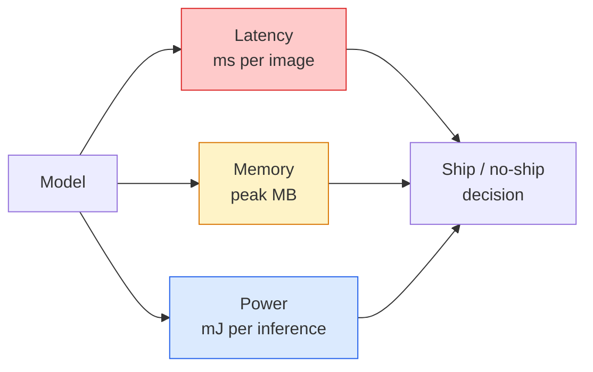

# Khán giả thời gian thực  Lập khẩu cạnh

> Kết luận cạnh là kỷ luật để có được một mô hình 90 độ chính xác chạy với tốc độ 30 fps trên một thiết bị có 2 GB RAM.

**Type:** Learn + Build
**Languages:** Python
**Prerequisites:** Phase 4 Lesson 04 (Image Classification), Phase 10 Lesson 11 (Quantization)
**Time:** ~75 minutes

## Mục tiêu học tập

- Đo độ trễ suy luận, bộ nhớ đỉnh và dung lượng cho bất kỳ mô hình PyTorch nào, và đọc FLOPs / params / trade-off độ trễ
- Phân tích mô hình thị giác đến INT8 bằng cách sử dụng định lượng sau khi đào tạo của PyTorch và xác minh sự mất độ chính xác < 1%
- Xuất khẩu sang ONNX và biên soạn bằng ONNX Runtime hoặc TensorRT; nêu tên ba lỗi xuất khẩu phổ biến nhất và sửa chữa chúng
- Giải thích khi nào nên chọn MobileNetV3, EfficientNet-Lite, ConvNeXt-Tiny, hoặc MobileViT cho hạn chế cạnh

## Vấn đề

Một mô hình tầm nhìn thời gian đào tạo là một con quái vật điểm nổi. 100M tham số, 10 GFLOP mỗi lần đi trước, 2 GB VRAM. Không có điều gì trong đó phù hợp với điện thoại, đơn vị thông tin giải trí của xe hơi, máy ảnh công nghiệp hoặc máy bay không người lái. Việc vận chuyển một hệ thống tầm nhìn có nghĩa là phù hợp với các dự đoán tương tự vào ngân sách nhỏ hơn 100 lần.

Ba nút làm hầu hết công việc: lựa chọn mô hình (một kiến trúc nhỏ hơn với cùng một công thức), định lượng (INT8 thay vì FP32) và thời gian chạy suy luận (ONNX Runtime, TensorRT, Core ML, TFLite).

Bài học này đặt kỷ luật đo trước (bạn không thể tối ưu hóa những gì bạn không thể đo), sau đó đi bộ ba nút. Mục tiêu không phải là học mọi thời gian chạy cạnh mà là biết những đòn bẩy nào tồn tại và làm thế nào để xác minh mỗi đòn bẩy làm theo ý tưởng của bạn.

## Khái niệm

### Ba ngân sách



- **Latency**: p50, p95, p99. Chỉ trung bình p50 che giấu hành vi đuôi quan trọng cho hệ thống thời gian thực.
- **Peak memory**: mức tối đa mà thiết bị nhìn thấy, không phải là mức trung bình ổn định.
- **Power / energy**: hàng triệu giọt mỗi suy luận trên một thiết bị chạy pin.

Một bảng của (chương tự, độ trễ, bộ nhớ, độ chính xác) là những gì mà một quyết định cạnh được thực hiện.

### Thiết kế đo lường

Ba quy tắc mà mọi hồ sơ cạnh phải tuân thủ:

1. **Warm up**mô hình với 5-10 con đốm đi trước trước khi đo lường. kho lưu trữ lạnh và biên soạn JIT tạo ra số đầu tiên không đại diện.
2. **Synchronise**Lượng tải GPU với `torch.cuda.synchronize()`Nếu không có nó bạn đo lường phát phát hạt nhân, không phải thực hiện hạt nhân.
3. **Fix input sizes**độ trễ ở 224x224 không phải là độ trễ ở 512x512.

### FLOPs như một đại diện

FLOPs (phản ứng điểm nổi theo suy luận) là một proxy rẻ tiền, độc lập với thiết bị cho độ trễ. hữu ích cho so sánh kiến trúc, gây hiểu lầm như đồng hồ tường tuyệt đối. Một mô hình với 10% FLOPs nhiều hơn có thể nhanh hơn 2 lần trong thực tế vì nó sử dụng các ops thân thiện với phần cứng (các conv sâu biên soạn tốt, conv lớn 7x7 không).

Quy tắc: sử dụng FLOP để tìm kiếm kiến trúc, sử dụng độ trễ trên thiết bị để đưa ra quyết định triển khai.

### Số lượng trong một đoạn

Thay thế trọng lượng và kích hoạt FP32 bằng INT8. kích thước mô hình giảm 4x, băng thông bộ nhớ giảm 4x, tính toán giảm 2-4x trên phần cứng có lõi INT8 (mỗi SoC di động hiện đại, mọi GPU NVIDIA với Tensor Cores).

Các loại:

- **Dynamic** trọng lượng lượng tử đến INT8, kích hoạt tính toán bằng FP.
- **Static (post-training)** trọng lượng lượng + kích hoạt hiệu chuẩn trong một bộ hiệu chuẩn nhỏ.
- **Quantisation-aware training (QAT)** mô phỏng số lượng trong quá trình đào tạo để mô hình học tập xung quanh nó.

Đối với thị lực, định lượng tĩnh sau khi đào tạo mang lại 95% lợi ích với 5% nỗ lực.

### Phân cắt và chưng cất

- **Pruning** loại bỏ các trọng lượng không quan trọng (dựa trên độ lớn) hoặc kênh (dự cấu trúc).
- **Distillation** đào tạo một học sinh nhỏ để bắt chước các logit của một giáo viên lớn.

### Thời gian chạy suy luận

- **PyTorch eager** chậm, không dùng để triển khai.
- **TorchScript** di sản.`torch.compile`và xuất khẩu ONNX.
- **ONNX Runtime**CPU, CUDA, CoreML, TensorRT, OpenVINO đều có các nhà cung cấp ONNX.
- **TensorRT** NVIDIA's compiler. độ trễ tốt nhất trên các GPU NVIDIA (workstation và Jetson).
- **Core ML** Thời gian chạy của Apple cho iOS/macOS.`.mlmodel`hoặc `.mlpackage`- Tôi không biết.
- **TFLite** Thời gian chạy của Google cho Android/ARM.`.tflite`- Tôi không biết.
- **OpenVINO** Thời gian chạy của Intel cho CPU/VPU.`.xml`+ `.bin`- Tôi không biết.

Trong thực tế: xuất PyTorch -> ONNX -> chọn thời gian chạy cho mục tiêu. ONNX là ngôn ngữ ngoại ngữ.

### Bộ chọn kiến trúc cạnh

| Budget | Model | Why |
|--------|-------|-----|
| < 3M params | MobileNetV3-Small | Compiles everywhere, good baseline |
| 3-10M | EfficientNet-Lite-B0 | Best accuracy per param on TFLite |
| 10-20M | ConvNeXt-Tiny | Best accuracy-per-param, CPU-friendly |
| 20-30M | MobileViT-S or EfficientViT | Transformer with ImageNet accuracy |
| 30-80M | Swin-V2-Tiny | If stack supports window attention |

Quantize tất cả các điều này đến INT8 trừ khi bạn có một lý do cụ thể để không.

```figure
cnn-param-count
```

## Hãy xây dựng nó

### Bước 1: Đánh giá độ trễ đúng

```python
import time
import torch

def measure_latency(model, input_shape, device="cpu", warmup=10, iters=50):
    model = model.to(device).eval()
    x = torch.randn(input_shape, device=device)
    with torch.no_grad():
        for _ in range(warmup):
            model(x)
        if device == "cuda":
            torch.cuda.synchronize()
        times = []
        for _ in range(iters):
            if device == "cuda":
                torch.cuda.synchronize()
            t0 = time.perf_counter()
            model(x)
            if device == "cuda":
                torch.cuda.synchronize()
            times.append((time.perf_counter() - t0) * 1000)
    times.sort()
    return {
        "p50_ms": times[len(times) // 2],
        "p95_ms": times[int(len(times) * 0.95)],
        "p99_ms": times[int(len(times) * 0.99)],
        "mean_ms": sum(times) / len(times),
    }
```

Sưởi ấm, đồng bộ hóa, sử dụng `time.perf_counter()`- Báo cáo phần trăm, không chỉ là xấu.

### Bước 2: Parameter và FLOP đếm

```python
def parameter_count(model):
    return sum(p.numel() for p in model.parameters())

def flops_estimate(model, input_shape):
    """
    Rough FLOP count for a conv/linear-only model. For production use `fvcore` or `ptflops`.
    """
    total = 0
    def conv_hook(m, inp, out):
        nonlocal total
        c_out, c_in, kh, kw = m.weight.shape
        h, w = out.shape[-2:]
        total += 2 * c_in * c_out * kh * kw * h * w
    def linear_hook(m, inp, out):
        nonlocal total
        total += 2 * m.in_features * m.out_features
    hooks = []
    for m in model.modules():
        if isinstance(m, torch.nn.Conv2d):
            hooks.append(m.register_forward_hook(conv_hook))
        elif isinstance(m, torch.nn.Linear):
            hooks.append(m.register_forward_hook(linear_hook))
    model.eval()
    with torch.no_grad():
        model(torch.randn(input_shape))
    for h in hooks:
        h.remove()
    return total
```

Đối với các dự án thực sự sử dụng `fvcore.nn.FlopCountAnalysis`hoặc `ptflops`; họ xử lý mỗi loại mô-đun đúng cách.

### Bước 3: Quantization tĩnh sau khi đào tạo

```python
def quantise_ptq(model, calibration_loader, backend="x86"):
    import torch.ao.quantization as tq
    model = model.eval().cpu()
    model.qconfig = tq.get_default_qconfig(backend)
    tq.prepare(model, inplace=True)
    with torch.no_grad():
        for x, _ in calibration_loader:
            model(x)
    tq.convert(model, inplace=True)
    return model
```

Ba bước: cấu hình, chuẩn bị (đã thêm các nhà quan sát), chuẩn bị với dữ liệu thực, chuyển đổi (fuse + quantize).`Conv -> BN -> ReLU`-> `ConvBnReLU`), trong đó `torch.ao.quantization.fuse_modules`tay cầm.

### Bước 4: Xuất khẩu sang ONNX

```python
def export_onnx(model, sample_input, path="model.onnx"):
    model = model.eval()
    torch.onnx.export(
        model,
        sample_input,
        path,
        input_names=["input"],
        output_names=["output"],
        dynamic_axes={"input": {0: "batch"}, "output": {0: "batch"}},
        opset_version=17,
    )
    return path
```

`opset_version=17`là sự cố định an toàn vào năm 2026.`dynamic_axes`cho phép bạn chạy mô hình ONNX với kích thước lô tùy ý.

### Bước 5: Đánh giá và so sánh chế độ

```python
import torch.nn as nn
from torchvision.models import mobilenet_v3_small

def compare_regimes():
    model = mobilenet_v3_small(weights=None, num_classes=10)
    params = parameter_count(model)
    flops = flops_estimate(model, (1, 3, 224, 224))
    lat_fp32 = measure_latency(model, (1, 3, 224, 224), device="cpu")
    print(f"FP32 MobileNetV3-Small: {params:,} params  {flops/1e9:.2f} GFLOPs  "
          f"p50={lat_fp32['p50_ms']:.2f}ms  p95={lat_fp32['p95_ms']:.2f}ms")
```

Chạy cùng một chức năng cho `resnet50`- `efficientnet_v2_s`, và`convnext_tiny`và bạn có bảng so sánh bạn cần cho một quyết định triển khai.

## Sử dụng nó

Các khối sản xuất hội tụ theo một trong ba con đường:

- **Web / serverless**: PyTorch -> ONNX -> ONNX Runtime (cơ sở cung cấp CPU hoặc CUDA).
- **NVIDIA edge (Jetson, GPU server)**PyTorch -> ONNX -> TensorRT.
- **Mobile**: PyTorch -> ONNX -> Core ML (iOS) hoặc TFLite (Android).

Để đo lường, `torch-tb-profiler`- `nvprof`- `nsys`, và các công cụ trên macOS cho ra các phân tích lớp theo lớp. `benchmark_app`(OpenVINO) và `trtexec`(TensorRT) cho số CLI độc lập.

## Chuyển nó

Bài học này mang lại:

- `outputs/prompt-edge-deployment-planner.md` một lời nhắc chọn xương sống, chiến lược định lượng, và thời gian chạy cho thiết bị mục tiêu và độ trễ SLA.
- `outputs/skill-latency-profiler.md` một kỹ năng viết một kịch bản đánh giá độ trễ hoàn chỉnh với sự nóng lên, đồng bộ hóa, phân phần trăm và theo dõi bộ nhớ.

## Các bài tập

1. **(Easy)**đo độ trễ p50 cho `resnet18`- `mobilenet_v3_small`- `efficientnet_v2_s`, và`convnext_tiny`báo cáo bảng và xác định kiến trúc nào có độ chính xác tốt nhất trên mỗi ms.
2. **(Medium)**Sử dụng định lượng tĩnh sau khi đào tạo cho `mobilenet_v3_small`. báo cáo mất độ trễ và độ chính xác FP32 so với INT8 trên một bộ phận CIFAR-10 hoặc tương tự.
3. **(Hard)**Xuất khẩu`convnext_tiny`đến ONNX, chạy qua nó `onnxruntime`với `CPUExecutionProvider`, và so sánh độ trễ với đường cơ sở PyTorch thèm. xác định lớp đầu tiên nơi ONNX Runtime nhanh hơn và giải thích tại sao.

## Các điều khoản chính

| Term | What people say | What it actually means |
|------|----------------|----------------------|
| Latency | "How fast" | Time from input to output; p50/p95/p99 percentiles, not mean |
| FLOPs | "Model size" | Floating-point ops per forward pass; rough proxy for compute cost |
| INT8 quantisation | "8-bit" | Replace FP32 weights/activations with 8-bit integers; ~4x smaller, 2-4x faster |
| PTQ | "Post-training quantisation" | Quantise a trained model without retraining; easy, usually enough |
| QAT | "Quantisation-aware training" | Simulate quantisation during training; best accuracy, requires labelled data |
| ONNX | "The neutral format" | Model exchange format supported by every mainstream inference runtime |
| TensorRT | "NVIDIA compiler" | Compiles ONNX into an optimised engine for NVIDIA GPUs |
| Distillation | "Teacher -> student" | Train a small model to mimic a big model's logits; recovers most lost accuracy |

## Đọc thêm

- [EfficientNet (Tan & Le, 2019)](https://arxiv.org/abs/1905.11946) quy mô hợp chất cho các kiến trúc hiệu quả
- [MobileNetV3 (Howard et al., 2019)](https://arxiv.org/abs/1905.02244) kiến trúc di động đầu tiên với h-swish và squeeze-excite
- [A Practical Guide to TensorRT Optimization (NVIDIA)](https://developer.nvidia.com/blog/accelerating-model-inference-with-tensorrt-tips-and-best-practices-for-pytorch-users/) làm thế nào để thực sự có được các số thông qua trong giấy
- [ONNX Runtime docs](https://onnxruntime.ai/docs/) định lượng, tối ưu hóa biểu đồ, lựa chọn nhà cung cấp
