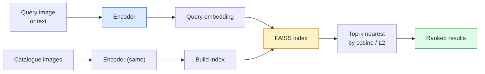

# Khám ảnh lấy lại & học métrics

> Một hệ thống lấy lại xếp hạng ứng cử viên theo khoảng cách trong không gian nhúng. Học métrics là kỷ luật định hình không gian đó để khoảng cách có nghĩa là bạn muốn gì.

**Type:** Build
**Languages:** Python
**Prerequisites:** Phase 4 Lesson 14 (ViT), Phase 4 Lesson 18 (CLIP)
**Time:** ~45 minutes

## Mục tiêu học tập

- Giải thích lỗ học metric dựa trên tripartite, contrast, và proxy và chọn đúng cho một tập dữ liệu nhất định
- Thực hiện tiêu chuẩn hóa L2 và tương đồng cosine đúng cách và kiểm tra sự khác biệt giữa "những mục tương tự" và "những lớp tương tự"
- Xây dựng chỉ mục FAISS, truy vấn theo văn bản và hình ảnh, và báo cáo recall@K cho một bộ truy vấn bị trì hoãn
- Sử dụng DINOv2, CLIP và SigLIP như các xương sống nhúng ra khỏi kệ và biết khi nào mỗi người thắng

## Vấn đề

Khám phá là ở mọi nơi trong tầm nhìn sản xuất: phát hiện trùng lặp, tìm kiếm hình ảnh ngược, tìm kiếm trực quan ("khám phá sản phẩm tương tự"), xác định lại khuôn mặt, nhận dạng lại người để giám sát, phù hợp cấp trường hợp cho thương mại điện tử. Câu hỏi về sản phẩm luôn giống nhau: "giấy hình ảnh truy vấn này, xếp hạng danh mục của tôi".

Hai quyết định thiết kế hình thành toàn bộ hệ thống. Nhập vào  mô hình nào tạo ra các vector. Chỉ số  cách tìm hàng xóm gần nhất ở quy mô. Cả hai đều là hàng hóa vào năm 2026 (DINOv2 cho nhập vào, FAISS cho chỉ số), làm tăng thanh: phần khó khăn là xác định *cái gì được tính là tương tự* cho ứng dụng của bạn, sau đó hình thành không gian nhập để khoảng cách phù hợp.

Việc hình thành là học metric. Đó là một kỷ luật nhỏ nhưng có đòn bẩy cao.

## Khái niệm

### Khám phá một cái nhìn



### Bốn gia đình mất mát

| Loss | Requires | Pros | Cons |
|------|----------|------|------|
| **Contrastive** | (anchor, positive) + negatives | Simple, works with any pair label | Slow to converge without many negatives |
| **Triplet** | (anchor, positive, negative) | Intuitive; direct margin control | Hard-triplet mining is expensive |
| **NT-Xent / InfoNCE** | Pairs + batch-mined negatives | Scales to large batches | Needs big batch or momentum queue |
| **Proxy-based (ProxyNCA)** | Class labels only | Fast, stable, no mining | Can overfit to proxies on small datasets |

Đối với hầu hết các trường hợp sử dụng sản xuất, bắt đầu với một xương sống đã được đào tạo trước và chỉ thêm một metric-làm bài học tinh tế nếu các nhúng off-the-shelf hiệu quả kém trên bộ thử nghiệm của bạn.

### Thiệt hại gấp ba lần chính thức

```
L = max(0, ||f(a) - f(p)||^2 - ||f(a) - f(n)||^2 + margin)
```

Kéo neo `a`gần như tích cực `p`, đẩy nó ra khỏi âm tính `n`, với một `margin`cấu trúc ba hình ảnh tổng quát cho bất kỳ thứ tự tương tự nào.

Các vấn đề khai thác mỏ: dễ dàng (`n`- Không.`a`(với các hệ thống đào tạo bán cứng (`n`hơn `p`nhưng trong phạm vi biên giới) là công thức của FaceNet năm 2016 và vẫn thống trị.

### Sự tương đồng của cosine so với L2

Hai chỉ số, hai quy ước:

- **Cosine**: góc giữa các vector. yêu cầu các embeddings L2 chuẩn hóa.
- **L2**: khoảng cách Euclidean. hoạt động trên các nhúng nguyên liệu hoặc chuẩn hóa, nhưng thường được kết hợp với L2- chuẩn hóa + L2 vuông.

Đối với hầu hết các mạng hiện đại, hai mạng này tương đương: `||a - b||^2 = 2 - 2 cos(a, b)`Khi nào `||a|| = ||b|| = 1`Chọn một hội nghị phù hợp với việc tập luyện của bạn; trộn chúng lặng lẽ thay đổi ý nghĩa của "các gần nhất".

### Recall@K

Métric lấy lại tiêu chuẩn:

```
recall@K = fraction of queries where at least one correct match is in the top K results
```

Tờ recall@1, @5, @10 bên cạnh. Một recall@10 trên 0,95 với recall@1 dưới 0,5 có nghĩa là không gian nhúng có cấu trúc đúng nhưng xếp hạng là ồn ào  thử các giai điệu tinh tế dài hơn hoặc một bước xếp hạng lại.

Đối với phát hiện trùng lặp, độ chính xác @K quan trọng hơn vì mỗi dương tính sai là một lỗi hiển thị của người dùng. Đối với tìm kiếm trực quan, recall@K là tín hiệu sản phẩm.

### FAISS trong một đoạn

Tìm kiếm tương đồng AI trên Facebook. Thư viện thực tế cho tìm kiếm hàng xóm gần nhất. Ba lựa chọn chỉ mục:

- `IndexFlatIP`- `IndexFlatL2` lực thô, chính xác, không có huấn luyện.
- `IndexIVFFlat` chia thành các tế bào K, tìm kiếm chỉ những tế bào gần nhất.
- `IndexHNSW` dựa trên đồ thị, nhanh nhất cho nhiều truy vấn, kích thước chỉ mục lớn.

Với 100k vector bạn có thể muốn `IndexFlatIP`với sự tương đồng cosine.`IndexIVFFlat`. Đối với 100M+ kết hợp với định lượng sản phẩm (`IndexIVFPQ`().

### Khám phá cấp độ giai đoạn so với cấp độ danh mục

Hai vấn đề rất khác nhau với cùng tên:

- **Category-level** "đ tìm mèo trong danh mục của tôi". Sự tương đồng theo các điều kiện lớp học; các nhúng CLIP / DINOv2 không sẵn có hoạt động tốt.
- **Instance-level** "đ tìm * sản phẩm chính xác này* trong danh mục của tôi". Cần phân biệt tinh vi giữa các đối tượng tương tự về mặt trực quan trong cùng một lớp; các bản nhúng ra khỏi kệ kém hiệu quả; điều chỉnh tinh tế với các vấn đề học tập métric.

Luôn hỏi bạn đang giải quyết vấn đề nào trước khi chọn một mô hình.

```figure
metric-embedding
```

## Hãy xây dựng nó

### Bước 1: mất trí

```python
import torch
import torch.nn.functional as F

def triplet_loss(anchor, positive, negative, margin=0.2):
    d_ap = F.pairwise_distance(anchor, positive, p=2)
    d_an = F.pairwise_distance(anchor, negative, p=2)
    return F.relu(d_ap - d_an + margin).mean()
```

Một dòng, hoạt động trên các L2 chuẩn hoặc nhúng nguyên liệu.

### Bước 2: khai thác bán cứng

Với một loạt các nhúng và nhãn, tìm âm bán cứng khó nhất cho mỗi neo.

```python
def semi_hard_negatives(emb, labels, margin=0.2):
    dist = torch.cdist(emb, emb)
    same_class = labels[:, None] == labels[None, :]
    diff_class = ~same_class
    N = emb.size(0)

    positives = dist.clone()
    positives[~same_class] = float("-inf")
    positives.fill_diagonal_(float("-inf"))
    pos_idx = positives.argmax(dim=1)

    semi_hard = dist.clone()
    semi_hard[same_class] = float("inf")
    d_ap = dist[torch.arange(N), pos_idx].unsqueeze(1)
    semi_hard[dist <= d_ap] = float("inf")
    neg_idx = semi_hard.argmin(dim=1)

    fallback_mask = semi_hard[torch.arange(N), neg_idx] == float("inf")
    if fallback_mask.any():
        hardest = dist.clone()
        hardest[same_class] = float("inf")
        neg_idx = torch.where(fallback_mask, hardest.argmin(dim=1), neg_idx)
    return pos_idx, neg_idx
```

Mỗi neo nhận được tích cực cứng nhất trong lớp và một âm bán cứng nằm xa hơn tích cực nhưng trong biên giới.

### Bước 3: Recall@K

```python
def recall_at_k(query_emb, gallery_emb, query_labels, gallery_labels, k=1):
    sim = query_emb @ gallery_emb.T
    _, top_k = sim.topk(k, dim=-1)
    matches = (gallery_labels[top_k] == query_labels[:, None]).any(dim=-1)
    return matches.float().mean().item()
```

Top-k theo sản phẩm bên trong trên L2 được chuẩn hóa nhúng bằng top-k theo cosine.

### Bước 4: Đặt chúng lại

```python
import torch
import torch.nn as nn
from torch.optim import Adam

class Encoder(nn.Module):
    def __init__(self, in_dim=128, emb_dim=64):
        super().__init__()
        self.net = nn.Sequential(
            nn.Linear(in_dim, 128), nn.ReLU(),
            nn.Linear(128, emb_dim),
        )

    def forward(self, x):
        return F.normalize(self.net(x), dim=-1)

torch.manual_seed(0)
num_classes = 6
protos = F.normalize(torch.randn(num_classes, 128), dim=-1)

def sample_batch(bs=32):
    labels = torch.randint(0, num_classes, (bs,))
    x = protos[labels] + 0.15 * torch.randn(bs, 128)
    return x, labels

enc = Encoder()
opt = Adam(enc.parameters(), lr=3e-3)

for step in range(200):
    x, y = sample_batch(32)
    emb = enc(x)
    pos_idx, neg_idx = semi_hard_negatives(emb, y)
    loss = triplet_loss(emb, emb[pos_idx], emb[neg_idx])
    opt.zero_grad(); loss.backward(); opt.step()
```

Sau vài trăm bước các cluster nhúng tạo thành một cluster cho mỗi lớp.

## Sử dụng nó

Các đống sản xuất vào năm 2026:

- **DINOv2 + FAISS** lấy lại hình ảnh mục đích chung.
- **CLIP + FAISS** khi các truy vấn là văn bản.
- **Fine-tuned DINOv2 + FAISS** truy xuất cấp trường hợp, face re-ID, thời trang, thương mại điện tử.
- **Milvus / Weaviate / Qdrant** bao bì DB vector được quản lý xung quanh FAISS hoặc HNSW.

Đối với SOTA lấy lại trường hợp, công thức là: DINOv2 xương sống, thêm đầu nhúng, tinh chỉnh bằng một bộ ba hoặc mất InfoNCE trên cặp được dán nhãn trường hợp, chỉ số trong FAISS.

## Chuyển nó

Bài học này mang lại:

- `outputs/prompt-retrieval-loss-picker.md` một lời nhắc chọn triplet / InfoNCE / ProxyNCA cho một vấn đề tìm kiếm nhất định.
- `outputs/skill-recall-at-k-runner.md` một kỹ năng viết một vòng đánh giá sạch cho recall@K với các phân chia tàu / val / phòng trưng bày và hợp đồng dữ liệu thích hợp.

## Các bài tập

1. **(Easy)**Hãy chạy ví dụ đồ chơi ở trên. Chụp các bản ghi với PCA trước và sau khi tập luyện để xem sáu cluster hình thành.
2. **(Medium)**Thêm một thực hiện mất mát ProxyNCA: một học "bản quyền" cho mỗi lớp, giao hợp chéo tiêu chuẩn trên sự tương đồng cosine. So sánh tốc độ hội tụ so với mất mát ba phần trên dữ liệu đồ chơi.
3. **(Hard)**Hãy lấy 1.000 hình ảnh xác nhận ImageNet, nhúng vào DINOv2 thông qua HuggingFace, xây dựng chỉ số FAISS phẳng, và báo cáo recall@{1, 5, 10} chống lại cùng một hình ảnh như truy vấn (có thể là 1.0) và chống lại sự chia rẽ với nhãn ImageNet như thực tại căn bản.

## Các điều khoản chính

| Term | What people say | What it actually means |
|------|----------------|----------------------|
| Metric learning | "Shape the space" | Training an encoder so distances in its output space reflect a target similarity |
| Triplet loss | "Pull and push" | L = max(0, d(a, p) - d(a, n) + margin); the canonical metric-learning loss |
| Semi-hard mining | "Useful negatives" | Negatives further from the anchor than the positive but within margin; empirically the most informative |
| Proxy-based loss | "Class prototypes" | One learned proxy per class; cross-entropy over similarity-to-proxies; no pair mining |
| Recall@K | "Top-K hit rate" | Fraction of queries with at least one correct result in the top K |
| Instance retrieval | "Find this exact thing" | Fine-grained matching; off-the-shelf features usually underperform |
| FAISS | "The NN library" | Facebook's nearest-neighbour library; supports exact and approximate indexes |
| HNSW | "Graph index" | Hierarchical navigable small world; fast approximate NN with small memory overhead |

## Đọc thêm

- [FaceNet: A Unified Embedding for Face Recognition (Schroff et al., 2015)](https://arxiv.org/abs/1503.03832) lỗ ba mảnh / giấy khai thác bán cứng
- [In Defense of the Triplet Loss for Person Re-Identification (Hermans et al., 2017)](https://arxiv.org/abs/1703.07737) hướng dẫn thực tế về việc chỉnh sửa tinh tế ba bản
- [FAISS documentation](https://github.com/facebookresearch/faiss/wiki) mọi chỉ số, mọi giao dịch
- [SMoT: Metric Learning Taxonomy (Kim et al., 2021)](https://arxiv.org/abs/2010.06927) khảo sát về các tổn thất hiện đại và mối liên hệ của chúng
