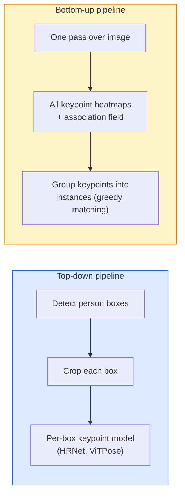

# Khám phá và ước tính vị trí

> Một tư thế là một tập hợp các điểm khóa được sắp xếp. Một máy dò điểm khóa là một máy quay lại bản đồ nhiệt. Mọi thứ khác là kế toán.

**Type:** Build
**Languages:** Python
**Prerequisites:** Phase 4 Lesson 06 (Detection), Phase 4 Lesson 07 (U-Net)
**Time:** ~45 minutes

## Mục tiêu học tập

- Sự khác biệt giữa ước tính tư thế từ trên xuống và từ dưới lên và nói khi nào mỗi người được sử dụng
- Hình ảnh nhiệt hồi phục cho các điểm khóa K với mục tiêu Gaussian-per-keypoint và trích xuất các điều phối điểm khóa tại suy luận
- Giải thích các trường liên quan phần (PAF) và cách các đường ống từ dưới lên liên kết các điểm khóa thành các trường hợp
- Sử dụng MediaPipe Pose hoặc MMPose để ước tính điểm chính sản xuất và hiểu định dạng đầu ra của chúng

## Vấn đề

Các nhiệm vụ chủ chốt ẩn dưới nhiều tên: tư thế con người (17 khớp cơ thể), dấu hiệu khuôn mặt (68 hoặc 478 điểm), tay (21 điểm), tư thế động vật, tư thế vật robot, các dấu hiệu giải phẫu y tế.

Tín hình hình ảnh là nền tảng của chụp chuyển động, ứng dụng thể dục, phân tích thể thao, kiểm soát cử chỉ, hoạt hình, thử nghiệm AR và nắm bắt robot.

Câu hỏi kỹ thuật là quy mô. Một hình ảnh đơn, một người tư thế là một vấn đề 20ms.

## Khái niệm

### Từ trên xuống xuống xuống



- **Top-down** phát hiện người trước tiên, sau đó chạy mô hình điểm khóa cho mỗi người trên mỗi cây trồng. Độ chính xác cao nhất; cân bằng theo đường thẳng với số người.
- **Bottom-up** một bước đi trước dự đoán tất cả các điểm khóa cộng với một trường liên kết; nhóm chúng. Thời gian liên tục bất kể kích thước đám đông.

Top-down (HRNet, ViTPose) là người dẫn đầu độ chính xác; bottom-up (OpenPose, HigherHRNet) là người dẫn đầu thông qua cho các cảnh đông đúc.

### Khung trở lại bản đồ nhiệt

Thay vì lùi lại `(x, y)`trực tiếp, dự đoán một `H x W`heatmap mỗi điểm khóa với một khối Gaussian tập trung vào vị trí thực.

```
target[k, y, x] = exp(-((x - cx_k)^2 + (y - cy_k)^2) / (2 sigma^2))
```

Khi suy luận, argmax của mỗi heatmap là vị trí điểm khóa dự đoán.

Tại sao heatmaps hoạt động tốt hơn so với sự lùi ngược trực tiếp: cấu trúc không gian của mạng (conv feature map) tự nhiên phù hợp với đầu ra không gian.

### Định vị vị của các subpixel

Argmax cho các tọa độ nguyên số. Để chính xác sub-pixel, tinh chỉnh bằng cách gắn một hình ngụng vào argmax và các hàng xóm của nó, hoặc sử dụng các ofset nổi tiếng `(dx, dy) = 0.25 * (heatmap[y, x+1] - heatmap[y, x-1], ...)`hướng đi.

### Các lĩnh vực liên quan phần (PAF)

OpenPose's thủ thuật cho kết nối từ dưới lên. Đối với mỗi cặp điểm khóa kết nối (ví dụ: vai trái đến khuỷu tay trái), dự đoán một lĩnh vực 2 kênh mã hóa vector đơn vị chỉ ra từ một đến một. Để kết nối một vai với khuỷu tay của nó, tích hợp PAF dọc theo đường nối cặp ứng cử viên; cặp có tích hợp cao nhất được kết hợp.

```
For each connection (limb):
  PAF channels: 2 (unit vector x, y)
  Line integral: sum over sample points of (PAF . line_direction)
  Higher integral = stronger match
```

Tốt và quy mô đến kích thước đám đông tùy ý mà không có cây trồng cho mỗi người.

### Các điểm khóa COCO

Bộ dữ liệu đặt cơ thể tiêu chuẩn: 17 điểm khóa mỗi người, PCK (Tỷ lệ phần trăm điểm khóa chính xác) và OKS (Tương tự điểm khóa đối tượng) như là métrics. OKS là điểm khóa tương tự của IoU và là những gì COCO mAP@OKS báo cáo.

### 2D vs 3D

- **2D pose** các phối hợp hình ảnh; giải quyết ở chất lượng sản xuất (MediaPipe, HRNet, ViTPose).
- **3D pose** các phối hợp thế giới / máy ảnh; nghiên cứu vẫn đang hoạt động.
  - Tăng dự đoán 2D lên 3D với một MLP nhỏ (VideoPose3D).
  - Trở lại 3D trực tiếp từ hình ảnh (PyMAF, MHFormer).
  - Thiết lập đa quan sát (CMU Panoptic) cho sự thật trên mặt đất.

```figure
cv3-pose-heatmap
```

## Hãy xây dựng nó

### Bước 1: Mục tiêu bản đồ nhiệt Gaussian

```python
import numpy as np
import torch

def gaussian_heatmap(size, cx, cy, sigma=2.0):
    yy, xx = np.meshgrid(np.arange(size), np.arange(size), indexing="ij")
    return np.exp(-((xx - cx) ** 2 + (yy - cy) ** 2) / (2 * sigma ** 2)).astype(np.float32)

hm = gaussian_heatmap(64, 32, 32, sigma=2.0)
print(f"peak: {hm.max():.3f} at ({hm.argmax() % 64}, {hm.argmax() // 64})")
```

Các bản đồ nhiệt mỗi điểm khóa được xếp dọc theo trục kênh cho ra toàn bộ tensor mục tiêu.

### Bước 2: Đầu phím nhỏ

Một mô hình kiểu U-Net đưa ra các kênh heatmap K.

```python
import torch.nn as nn
import torch.nn.functional as F

class TinyKeypointNet(nn.Module):
    def __init__(self, num_keypoints=4, base=16):
        super().__init__()
        self.down1 = nn.Sequential(nn.Conv2d(3, base, 3, 2, 1), nn.ReLU(inplace=True))
        self.down2 = nn.Sequential(nn.Conv2d(base, base * 2, 3, 2, 1), nn.ReLU(inplace=True))
        self.mid = nn.Sequential(nn.Conv2d(base * 2, base * 2, 3, 1, 1), nn.ReLU(inplace=True))
        self.up1 = nn.ConvTranspose2d(base * 2, base, 2, 2)
        self.up2 = nn.ConvTranspose2d(base, num_keypoints, 2, 2)

    def forward(self, x):
        h1 = self.down1(x)
        h2 = self.down2(h1)
        h3 = self.mid(h2)
        u1 = self.up1(h3)
        return self.up2(u1)
```

Nhập `(N, 3, H, W)`, sản lượng`(N, K, H, W)`Loss là MSE/pixel đối với các mục tiêu Gaussian.

### Bước 3: Thuyết định  trích xuất các tọa độ điểm khóa

```python
def heatmap_to_coords(heatmaps):
    """
    heatmaps: (N, K, H, W)
    returns:  (N, K, 2) float coordinates in image pixels
    """
    N, K, H, W = heatmaps.shape
    hm = heatmaps.reshape(N, K, -1)
    idx = hm.argmax(dim=-1)
    ys = (idx // W).float()
    xs = (idx % W).float()
    return torch.stack([xs, ys], dim=-1)

coords = heatmap_to_coords(torch.randn(2, 4, 32, 32))
print(f"coords: {coords.shape}")  # (2, 4, 2)
```

Một đường để suy luận. để tinh chỉnh sub-pixel, liên kết xung quanh argmax.

### Bước 4: Bộ dữ liệu điểm khóa tổng hợp

Khả năng đơn giản: vẽ bốn điểm trên một tấm vải trắng và học cách dự đoán chúng.

```python
def make_synthetic_sample(size=64):
    img = np.ones((3, size, size), dtype=np.float32)
    rng = np.random.default_rng()
    kps = rng.integers(8, size - 8, size=(4, 2))
    for cx, cy in kps:
        img[:, cy - 2:cy + 2, cx - 2:cx + 2] = 0.0
    hms = np.stack([gaussian_heatmap(size, cx, cy) for cx, cy in kps])
    return img, hms, kps
```

Đủ dễ để một mô hình nhỏ học trong một phút.

### Bước 5: Căn luyện

```python
model = TinyKeypointNet(num_keypoints=4)
opt = torch.optim.Adam(model.parameters(), lr=3e-3)

for step in range(200):
    batch = [make_synthetic_sample() for _ in range(16)]
    imgs = torch.from_numpy(np.stack([b[0] for b in batch]))
    hms = torch.from_numpy(np.stack([b[1] for b in batch]))
    pred = model(imgs)
    # Upsample pred to full resolution
    pred = F.interpolate(pred, size=hms.shape[-2:], mode="bilinear", align_corners=False)
    loss = F.mse_loss(pred, hms)
    opt.zero_grad(); loss.backward(); opt.step()
```

## Sử dụng nó

- **MediaPipe Pose** Máy ước tính hình ảnh sản xuất của Google; vận chuyển thời gian chạy WebGL + di động với độ trễ dưới 10ms.
- **MMPose**(OpenMMLab)  cơ sở mã nghiên cứu toàn diện; mọi kiến trúc SOTA với trọng lượng được đào tạo trước.
- **YOLOv8-pose** nhanh nhất thời gian thực nhiều người tư thế với một chuyển tiếp phía trước.
- **transformers HumanDPT / PoseAnything** các phương pháp tiếp cận ngôn ngữ thị giác mới hơn cho tư thế từ vựng mở (bất kỳ đối tượng, bất kỳ tập hợp điểm chính nào).

## Chuyển nó

Bài học này mang lại:

- `outputs/prompt-pose-stack-picker.md` một lời nhắc chọn MediaPipe / YOLOv8-pose / HRNet / ViTPose cho độ trễ, kích thước đám đông, và nhu cầu 2D vs 3D.
- `outputs/skill-heatmap-to-coords.md` một kỹ năng viết các bản đồ nhiệt sub-pixel-to-coordinate thói quen được sử dụng bởi mỗi mô hình tư thế sản xuất.

## Các bài tập

1. **(Easy)**Tập hình mẫu điểm khóa nhỏ trên bộ dữ liệu tổng hợp 4 điểm. báo cáo trung bình lỗi L2 giữa các điểm khóa dự đoán và đúng sau 200 bước.
2. **(Medium)**Thêm tinh tế sub-pixel: do vị trí argmax, phù hợp một hình dụ 1D dọc theo x và y từ các pixel lân cận.
3. **(Hard)**Xây dựng một bộ dữ liệu tổng hợp 2 người trong đó mỗi hình ảnh cho thấy hai ví dụ của mô hình 4 điểm khóa. Đọc một đường ống từ dưới lên với PAF dự đoán điểm khóa thuộc về ví dụ nào, và đánh giá OKS.

## Các điều khoản chính

| Term | What people say | What it actually means |
|------|----------------|----------------------|
| Keypoint | "A landmark" | A specific ordered point on an object (joint, corner, feature) |
| Pose | "The skeleton" | An ordered set of keypoints belonging to one instance |
| Top-down | "Detect then pose" | Two-stage pipeline: person detector + per-crop keypoint model; highest accuracy |
| Bottom-up | "Pose first, group later" | Single-pass all-keypoint prediction + grouping; constant time in crowd size |
| Heatmap | "Gaussian target" | H x W tensor per keypoint with peak at the true location; the preferred regression target |
| PAF | "Part Affinity Field" | 2-channel unit vector field encoding limb directions; used to group keypoints into instances |
| OKS | "Keypoint IoU" | Object Keypoint Similarity; the COCO metric for pose |
| HRNet | "High-Resolution Net" | The dominant top-down keypoint architecture; preserves high-res features throughout |

## Đọc thêm

- [OpenPose (Cao et al., 2017)](https://arxiv.org/abs/1812.08008) từ dưới lên với PAF; vẫn là bản ghi tốt nhất của cách tiếp cận
- [HRNet (Sun et al., 2019)](https://arxiv.org/abs/1902.09212) kiến trúc tham chiếu từ trên xuống
- [ViTPose (Xu et al., 2022)](https://arxiv.org/abs/2204.12484) ViT đơn giản như một xương sống tư thế; SOTA hiện tại trên nhiều điểm tham khảo
- [MediaPipe Pose](https://developers.google.com/mediapipe/solutions/vision/pose_landmarker) sản xuất thời gian thực; đống nhanh nhất được triển khai vào năm 2026
