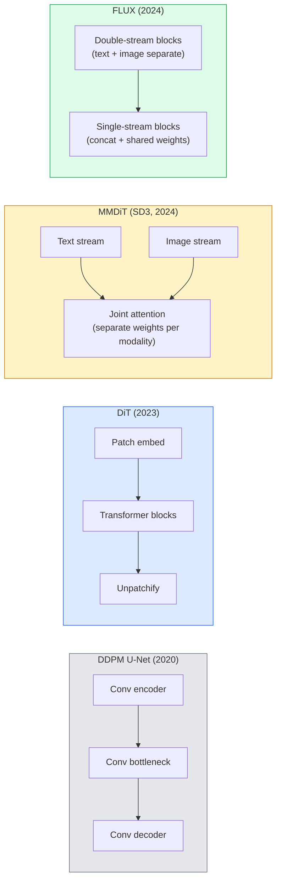

# Các biến đổi pha trộn và dòng chảy được sửa chữa

> U-Net không phải là bí mật của sự phát tán. Thay thế nó bằng một biến đổi, thay đổi lịch trình tiếng ồn cho một dòng chảy thẳng, và đột nhiên bạn có SD3, FLUX, và mỗi mô hình văn bản-đến hình ảnh 2026

**Type:** Learn + Build
**Languages:** Python
**Prerequisites:** Phase 4 Lesson 10 (Diffusion DDPM), Phase 4 Lesson 14 (ViT), Phase 7 Lesson 02 (Self-Attention)
**Time:** ~75 minutes

## Mục tiêu học tập

- Theo dõi sự tiến hóa từ U-Net DDPM (Dạy 10) đến Diffusion Transformer (DiT), MMDiT (SD3), và single+double-stream DiT (FLUX)
- Giải thích dòng chảy được chỉnh sửa: tại sao một quỹ đạo thẳng giữa tiếng ồn và dữ liệu cho phép các mô hình lấy mẫu trong 20 bước thay vì 1000
- Thực hiện một khối DiT nhỏ và một vòng đào tạo dòng chảy chỉnh, cả hai dưới 100 đường
- Cấu phân các biến thể mô hình (SD3, FLUX.1-dev, FLUX.1-schnell, Z-Image, Qwen-Image) theo kiến trúc, số lượng tham số và cấp phép

## Vấn đề

Bài học 10 xây dựng một DDPM với một trình báo U-Net. Công thức đó thống trị năm 2020-2023: U-Net + lịch trình beta + mất dự đoán tiếng ồn. Nó sản xuất Stable Diffusion 1.5 và 2.1 và DALL-E 2.

Mỗi mô hình văn bản-được hình ảnh tiên tiến năm 2026 đã vượt qua nó. Stable Diffusion 3, FLUX, SD4, Z-Image, Qwen-Image, Hunyuan-Image  không sử dụng U-Net. Họ sử dụng Diffusion Transformers (DiT). SD3 và FLUX cũng thay đổi lịch âm thanh DDPM cho dòng chảy chỉnh sửa, điều này làm thẳng con đường từ âm thanh đến dữ liệu và cho phép suy luận 1-4 bước với sự nhất quán hoặc biến thể chưng cất.

Sự thay đổi quan trọng bởi vì đó là lý do tại sao việc tạo hình ảnh dựa trên sự phân tán trở nên có thể kiểm soát, chính xác ngay lập tức (sản xuất văn bản giải quyết SD3/SD4) và nhanh chóng sản xuất.

## Khái niệm

### Từ U-Net đến biến đổi



- **DiT**(Peebles & Xie, 2023)  thay thế U-Net bằng một biến thể giống như ViT trên các bản vá ẩn.
- **MMDiT**(SD3, Esser et al., 2024)  hai dòng với trọng lượng riêng biệt cho các mã thông báo văn bản và hình ảnh chia sẻ sự chú ý chung.
- **FLUX**(Black Forest Labs, 2024)  đầu tiên N khối dòng hai như SD3, sau đó khối kết nối và chia sẻ trọng lượng (nguyên dòng duy nhất) để hiệu quả ở độ sâu cao hơn.
- **Z-Image**(2025)  DiT đơn dòng hiệu quả ở các tham số 6B thách thức "tăng bằng mọi chi phí".

### Dòng chảy được sửa đổi trong một đoạn

DDPM định nghĩa quá trình tiến tới là một SDE `x_t`Sự ngược lại được học là một SDE thứ hai, được giải quyết bằng 1000 bước nhỏ.

Phong trào được sửa chữa xác định một **straight-line**sự phân cực giữa dữ liệu sạch và tiếng ồn sạch:

```
x_t = (1 - t) * x_0 + t * epsilon,     t in [0, 1]
```

Đào tạo một mạng để dự đoán tốc độ`v_theta(x_t, t) = epsilon - x_0` hướng về phía trước dọc theo con đường thẳng từ dữ liệu sạch đến tiếng ồn (`dx_t/dt`Trong quá trình lấy mẫu, bạn tích hợp tốc độ này trở lại để bước từ tiếng ồn sang dữ liệu.

SD3 gọi đây là **Rectified Flow Matching**FLUX, Z-Image và hầu hết các mô hình 2026 sử dụng cùng một mục tiêu. Kết luận điển hình: 20-30 bước Euler (định nghĩa) so với 50+ bước DDIM trong chế độ DDPM cũ.

### Điều kiện AdaLN

DTS điều kiện trên bước thời gian và lớp / văn bản qua **adaptive layer norm**: dự đoán`scale`và `shift`Phong cách này là làm cho các mô hình hình hình ảnh của các máy tính có thể được sử dụng trong các hệ thống U-Nets và áp dụng chúng sau LayerNorm.

```
cond -> MLP -> (scale, shift, gate)
norm(x) * (1 + scale) + shift, then residual add * gate
```

### Các mã hóa văn bản trong SD3 và FLUX

- **SD3**sử dụng ba bộ mã hóa văn bản: hai mô hình CLIP + T5-XXL. Các nhúng kết nối và được cung cấp cho dòng hình ảnh như điều kiện văn bản.
- **FLUX**sử dụng một CLIP-L + T5-XXL.
- **Qwen-Image / Z-Image**Các biến thể sử dụng các mã hóa văn bản nội bộ của riêng họ phù hợp với LLM cơ bản của họ.

Các mã hóa văn bản là một phần lớn tại sao SD3/FLUX lý luận về các yêu cầu tốt hơn nhiều so với SD1.5. T5-XXL một mình là 4.7B các tham số.

### Các hướng dẫn không có phân loại vẫn còn

Phòng chảy sửa đổi thay đổi mẫu, không phải điều kiện. hướng dẫn không phân loại (đánh văn bản với xác suất 10% trong khi đào tạo, trộn dự đoán có điều kiện và không điều kiện khi suy luận) hoạt động giống nhau với dòng chảy sửa đổi. Hầu hết các mô hình 2026 sử dụng thang đo hướng dẫn 3.5-5  thấp hơn 7.5 của SD1.5 vì các mô hình dòng chảy sửa đổi theo dõi các yêu cầu chặt chẽ hơn theo mặc định.

### Sự phù hợp, Turbo, Schnell, LCM

Bốn tên cho cùng một ý tưởng: chưng cất mô hình nhiều bước chậm thành mô hình vài bước nhanh.

- **LCM (Latent Consistency Model)** đào tạo một học sinh dự đoán kết quả `x_0`từ bất kỳ trung gian nào `x_t`chỉ một bước thôi.
- **SDXL Turbo / FLUX schnell** Mô hình 1-4 bước được đào tạo bằng cách chưng cất pha trộn đối kháng.
- **SD Turbo** Mô hình nhất quán theo kiểu OpenAI thích nghi với sự lan truyền ẩn.

Sản xuất dịch vụ của bất kỳ tàu mẫu mới nào đều có cả một điểm kiểm soát "bất lượng đầy đủ" và một biến thể "turbo / nhanh". Schnell ("quá" bằng tiếng Đức, quy ước của Black Forest Labs) chạy trong 1-4 bước và phù hợp với đường ống dẫn thời gian thực.

### Mô hình cảnh quan năm 2026

| Model | Size | Architecture | License |
|-------|------|--------------|---------|
| Stable Diffusion 3 Medium | 2B | MMDiT | SAI Community |
| Stable Diffusion 3.5 Large | 8B | MMDiT | SAI Community |
| FLUX.1-dev | 12B | Double + Single Stream DiT | non-commercial |
| FLUX.1-schnell | 12B | same, distilled | Apache 2.0 |
| FLUX.2 | — | iterated FLUX.1 | mixed |
| Z-Image | 6B | S3-DiT (Scalable Single-Stream) | permissive |
| Qwen-Image | ~20B | DiT + Qwen text tower | Apache 2.0 |
| Hunyuan-Image-3.0 | ~80B | DiT | research |
| SD4 Turbo | 3B | DiT + distillation | SAI Commercial |

FLUX.1-schnell là mặc định nguồn mở 2026 . Z-Image là nhà lãnh đạo hiệu quả. FLUX.2 và SD4 là các mẹo chất lượng hiện tại.

### Tại sao sự thay đổi giai đoạn này quan trọng

DDPM + U-Net đã hoạt động. DiT + dòng chảy sửa chữa làm việc **better, faster, and scales more cleanly**. Sự chuyển đổi tương tự như từ RNN đến các biến thể trong NLP: cả hai kiến trúc đã giải quyết cùng một vấn đề, nhưng các biến thể đã mở rộng và hiện nay thống trị. Mỗi bài báo năm 2026 về hình ảnh, video hoặc thế hệ 3D sử dụng một mô tả hình dạng DiT và thường là một mục tiêu lưu lượng chỉnh sửa. U-Net DDPM hiện nay chủ yếu là giáo dục (Lớp 10).

```figure
cv3-rectified-flow
```

## Hãy xây dựng nó

### Bước 1: Một khối DiT với AdaLN

```python
import torch
import torch.nn as nn


class AdaLNZero(nn.Module):
    """
    Adaptive LayerNorm with a gate. Predicts (scale, shift, gate) from the conditioning.
    Init such that the whole block starts as identity ("zero init").
    """

    def __init__(self, dim, cond_dim):
        super().__init__()
        self.norm = nn.LayerNorm(dim, elementwise_affine=False)
        self.mlp = nn.Linear(cond_dim, dim * 3)
        nn.init.zeros_(self.mlp.weight)
        nn.init.zeros_(self.mlp.bias)

    def forward(self, x, cond):
        scale, shift, gate = self.mlp(cond).chunk(3, dim=-1)
        h = self.norm(x) * (1 + scale.unsqueeze(1)) + shift.unsqueeze(1)
        return h, gate.unsqueeze(1)


class DiTBlock(nn.Module):
    def __init__(self, dim=192, heads=3, mlp_ratio=4, cond_dim=192):
        super().__init__()
        self.adaln1 = AdaLNZero(dim, cond_dim)
        self.attn = nn.MultiheadAttention(dim, heads, batch_first=True)
        self.adaln2 = AdaLNZero(dim, cond_dim)
        self.mlp = nn.Sequential(
            nn.Linear(dim, dim * mlp_ratio),
            nn.GELU(),
            nn.Linear(dim * mlp_ratio, dim),
        )

    def forward(self, x, cond):
        h, gate1 = self.adaln1(x, cond)
        a, _ = self.attn(h, h, h, need_weights=False)
        x = x + gate1 * a
        h, gate2 = self.adaln2(x, cond)
        x = x + gate2 * self.mlp(h)
        return x
```

`AdaLNZero`bắt đầu như một bản đồ danh tính vì trọng lượng MLP của nó được khởi xướng đến không.

### Bước 2: Một DiT nhỏ

```python
def timestep_embedding(t, dim):
    import math
    half = dim // 2
    freqs = torch.exp(-math.log(10000) * torch.arange(half, device=t.device) / half)
    args = t[:, None].float() * freqs[None]
    return torch.cat([args.sin(), args.cos()], dim=-1)


class TinyDiT(nn.Module):
    def __init__(self, image_size=16, patch_size=2, in_channels=3, dim=96, depth=4, heads=3):
        super().__init__()
        self.patch_size = patch_size
        self.num_patches = (image_size // patch_size) ** 2
        self.patch = nn.Conv2d(in_channels, dim, kernel_size=patch_size, stride=patch_size)
        self.pos = nn.Parameter(torch.zeros(1, self.num_patches, dim))
        self.time_mlp = nn.Sequential(
            nn.Linear(dim, dim * 2),
            nn.SiLU(),
            nn.Linear(dim * 2, dim),
        )
        self.blocks = nn.ModuleList([DiTBlock(dim, heads, cond_dim=dim) for _ in range(depth)])
        self.norm_out = nn.LayerNorm(dim, elementwise_affine=False)
        self.head = nn.Linear(dim, patch_size * patch_size * in_channels)

    def forward(self, x, t):
        n = x.size(0)
        x = self.patch(x)
        x = x.flatten(2).transpose(1, 2) + self.pos
        t_emb = self.time_mlp(timestep_embedding(t, self.pos.size(-1)))
        for blk in self.blocks:
            x = blk(x, t_emb)
        x = self.norm_out(x)
        x = self.head(x)
        return self._unpatchify(x, n)

    def _unpatchify(self, x, n):
        p = self.patch_size
        h = w = int(self.num_patches ** 0.5)
        x = x.view(n, h, w, p, p, -1).permute(0, 5, 1, 3, 2, 4).reshape(n, -1, h * p, w * p)
        return x
```

### Bước 3: Đào tạo dòng chảy được sửa chữa

```python
import torch.nn.functional as F

def rectified_flow_train_step(model, x0, optimizer, device):
    model.train()
    x0 = x0.to(device)
    n = x0.size(0)
    t = torch.rand(n, device=device)
    epsilon = torch.randn_like(x0)
    x_t = (1 - t[:, None, None, None]) * x0 + t[:, None, None, None] * epsilon

    target_velocity = epsilon - x0
    pred_velocity = model(x_t, t)

    loss = F.mse_loss(pred_velocity, target_velocity)
    optimizer.zero_grad()
    loss.backward()
    optimizer.step()
    return loss.item()
```

So sánh với mất dự đoán tiếng ồn của DDPM (Dạy học 10): cùng cấu trúc, mục tiêu khác nhau.`epsilon`, chúng ta dự đoán **velocity** `epsilon - x_0`, chỉ ra từ dữ liệu đến tiếng ồn dọc theo đường thẳng.

### Bước 4: mẫu Euler

Phương pháp Euler là đơn giản nhất và, đối với mô hình dòng chảy chỉnh sửa được đào tạo tốt, gần như chính xác như các máy giải quyết thứ tự cao hơn ở 20 bước.

```python
@torch.no_grad()
def rectified_flow_sample(model, shape, steps=20, device="cpu"):
    model.eval()
    x = torch.randn(shape, device=device)
    dt = 1.0 / steps
    t = torch.ones(shape[0], device=device)
    for _ in range(steps):
        v = model(x, t)
        x = x - dt * v
        t = t - dt
    return x
```

20 bước. trên một mô hình được đào tạo, nó tạo ra các mẫu tương đương với 1000 bước DDPM.

### Bước 5: Kiểm tra khói từ đầu đến cuối

```python
import numpy as np

def synthetic_blobs(num=200, size=16, seed=0):
    rng = np.random.default_rng(seed)
    out = np.zeros((num, 3, size, size), dtype=np.float32)
    yy, xx = np.meshgrid(np.arange(size), np.arange(size), indexing="ij")
    for i in range(num):
        cx, cy = rng.uniform(4, size - 4, size=2)
        r = rng.uniform(2, 4)
        mask = (xx - cx) ** 2 + (yy - cy) ** 2 < r ** 2
        colour = rng.uniform(-1, 1, size=3)
        for c in range(3):
            out[i, c][mask] = colour[c]
    return torch.from_numpy(out)
```

Đào một `TinyDiT`Sau 500 bước, các sản phẩm được lấy mẫu sẽ trông giống như những vết bẩn màu mờ.

## Sử dụng nó

Để tạo hình ảnh thực với FLUX / SD3 / Z-Image, `diffusers`mỗi tàu có API thống nhất:

```python
from diffusers import FluxPipeline, StableDiffusion3Pipeline
import torch

pipe = FluxPipeline.from_pretrained(
    "black-forest-labs/FLUX.1-schnell",
    torch_dtype=torch.bfloat16,
).to("cuda")

out = pipe(
    prompt="a golden retriever surfing a tsunami, hyperrealistic, studio lighting",
    guidance_scale=0.0,           # schnell was trained without CFG
    num_inference_steps=4,
    max_sequence_length=256,
).images[0]
out.save("surf.png")
```

Ba dòng.`FLUX.1-schnell`Trong bốn bước. Thay đổi ID mô hình cho `black-forest-labs/FLUX.1-dev`cho chất lượng cao hơn ở 20-30 bước với CFG.

Đối với SD3:

```python
pipe = StableDiffusion3Pipeline.from_pretrained(
    "stabilityai/stable-diffusion-3.5-large",
    torch_dtype=torch.bfloat16,
).to("cuda")
out = pipe(prompt, guidance_scale=3.5, num_inference_steps=28).images[0]
```

## Chuyển nó

Bài học này mang lại:

- `outputs/prompt-dit-model-picker.md` chọn giữa SD3, FLUX.1-dev, FLUX.1-schnell, Z-Image, SD4 Turbo vì chất lượng, độ trễ và hạn chế cấp phép.
- `outputs/skill-rectified-flow-trainer.md` viết một vòng đào tạo hoàn chỉnh cho dòng chảy chỉnh sửa với lấy mẫu AdaLN DiT và Euler.

## Các bài tập

1. **(Easy)**Đọc các TinyDiT trên trên trên bộ dữ liệu blob tổng hợp trong 500 bước. So sánh các mẫu được sản xuất với 10, 20 và 50 bước Euler.
2. **(Medium)**Thêm điều kiện văn bản bằng cách kết nối một lớp học được học tập nhúng vào thời gian nhúng (10 điểm "các lớp" theo màu sắc).
3. **(Hard)**Xét khoảng cách Fréchet (FID proxy) giữa các mẫu được tạo từ các phiên bản lưu lượng chỉnh sửa và DDPM của mạng có cùng kích thước được đào tạo trên cùng một số dữ liệu cho cùng một số bước.

## Các điều khoản chính

| Term | What people say | What it actually means |
|------|----------------|----------------------|
| DiT | "Diffusion transformer" | Transformer that replaces the U-Net as the diffusion denoiser; operates on patchified latents |
| AdaLN | "Adaptive layer norm" | Timestep/text conditioning via learned scale, shift, gate applied after LayerNorm; standard in every modern DiT |
| MMDiT | "Multi-modal DiT (SD3)" | Separate weight streams for text and image tokens that share a joint self-attention |
| Single-stream / double-stream | "FLUX trick" | First N blocks double-stream (separate weights per modality), later blocks single-stream (concat + shared weights) for efficiency |
| Rectified flow | "Straight-line noise-to-data" | Linear interpolation between data and noise; network predicts velocity; fewer ODE steps needed at inference |
| Velocity target | "epsilon - x_0" | The regression target in rectified flow; points from clean data to noise |
| CFG guidance | "classifier-free guidance" | Mix conditional and unconditional predictions; still used in rectified-flow models |
| Schnell / turbo / LCM | "1-4 step distillation" | Small-step variants distilled from full-quality models; production real-time |

## Đọc thêm

- [Scalable Diffusion Models with Transformers (Peebles & Xie, 2023)](https://arxiv.org/abs/2212.09748) giấy DiT
- [Scaling Rectified Flow Transformers (Esser et al., SD3 paper)](https://arxiv.org/abs/2403.03206) MMDiT và dòng chảy chỉnh quy mô
- [FLUX.1 model card and technical report (Black Forest Labs)](https://huggingface.co/black-forest-labs/FLUX.1-dev) chi tiết hai lần + dòng đơn
- [Z-Image: Efficient Image Generation Foundation Model (2025)](https://arxiv.org/html/2511.22699v1) DiT dòng đơn tại 6B
- [Elucidating the Design Space of Diffusion (Karras et al., 2022)](https://arxiv.org/abs/2206.00364) tham chiếu cho mỗi thương mại thiết kế phân tán
- [Latent Consistency Models (Luo et al., 2023)](https://arxiv.org/abs/2310.04378) làm thế nào LCM- LoRA cho bạn kết luận 4 bước
