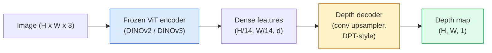

# Độ sâu đơn phương & Đánh giá hình học

> Bản đồ độ sâu là một hình ảnh một kênh mà mỗi pixel là khoảng cách từ máy ảnh. Dự đoán nó từ một khung RGB đã không thể được thực hiện mà không có stereo hoặc LiDAR. Năm 2026, một bộ mã hóa ViT đóng băng cộng với một đầu nhẹ sẽ đạt được trong vài phần trăm của sự thật mặt đất.

**Type:** Build + Use
**Languages:** Python
**Prerequisites:** Phase 4 Lesson 14 (ViT), Phase 4 Lesson 17 (Self-Supervised Vision), Phase 4 Lesson 07 (U-Net)
**Time:** ~60 minutes

## Mục tiêu học tập

- Sự phân biệt độ sâu tương đối và độ sâu métric và trạng thái mà mỗi mô hình sản xuất (MiDaS, Marigold, Depth Anything V3, ZoeDepth) giải quyết
- Sử dụng độ sâu bất cứ điều gì V3 (DINOv2 backbone) để dự đoán độ sâu cho hình ảnh độc lập tùy ý mà không có hiệu chuẩn
- Giải thích tại sao độ sâu đơn hình hoạt động từ một hình ảnh duy nhất (số quan điểm, độ nghiêng kết cấu, tiền lệ học) và điều gì nó không thể phục hồi (sự quy mô tuyệt đối, hình học bị che)
- Tăng phát hiện 2D đến các điểm 3D bằng cách sử dụng bản đồ độ sâu và nội tại của máy ảnh pinhole

## Vấn đề

Độ sâu là trục thiếu trong tầm nhìn máy tính 2D. Với RGB, bạn biết mọi thứ xuất hiện ở vị trí hình ảnh; bạn không biết chúng ở xa như thế nào.

Đánh giá độ sâu đơn  dự đoán độ sâu từ một khung RGB  được sử dụng để tạo ra đầu ra mờ, không đáng tin cậy. Đến năm 2026, các bộ mã hóa được đào tạo trước đã thay đổi điều này: Depth Anything V3 sử dụng xương sống DINOv2 đóng băng và sản xuất bản đồ độ sâu phổ biến trên các lĩnh vực nội thất, ngoài trời, y tế và vệ tinh. Marigold tái định hình độ sâu như là một vấn đề phân tán điều kiện. ZoeDepth lùi lại khoảng cách chính xác.

Độ sâu cũng là cầu nối giữa phát hiện 2D và hiểu biết 3D: nhân các pixel của một hộp phát hiện bằng độ sâu và bạn nâng đối tượng 2D lên thành một đám mây điểm 3D. Đó là lõi của mọi hệ thống che giấu AR, mọi đường ống dẫn tránh trở ngại và mọi robot "tăng tách".

## Khái niệm

### Tâm độ tương đối đối với độ sâu métric

- **Relative depth** được ra lệnh `z`"Pixel A gần hơn so với pixel B, nhưng tỷ lệ khoảng cách không được neo với mét".
- **Metric depth** khoảng cách tuyệt đối trong mét từ máy ảnh.

MiDaS và Depth Anything V3 tạo ra độ sâu tương đối. Marigold tạo ra độ sâu tương đối. ZoeDepth, UniDepth và Metric3D tạo ra độ sâu métric.

### Mô hình mã hóa-chế vị mã hóa



Depth Anything V3 đóng băng bộ mã hóa và chỉ đào tạo bộ mã hóa kiểu DPT. Bộ mã hóa cung cấp các tính năng phong phú; bộ mã hóa liên kết chúng trở lại độ phân giải hình ảnh và giảm độ sâu.

### Tại sao một hình ảnh duy nhất tạo ra độ sâu

Một hình ảnh 2D chứa nhiều tín hiệu đơn hình tương quan với độ sâu:

- **Perspective** Các đường song song trong 3D hội tụ trong 2D.
- **Texture gradient** bề mặt xa có kết cấu nhỏ hơn, dày đặc hơn.
- **Occlusion order** Các vật thể gần hơn che giấu những vật thể xa hơn.
- **Size constancy** các vật thể được biết (các chiếc xe hơi, con người) cho phép quy mô gần như.
- **Atmospheric perspective** Các vật thể xa trông mờ hơn và xanh hơn trong cảnh ngoài trời.

Một ViT được đào tạo trên hàng tỷ hình ảnh nội bộ hóa các tín hiệu này. Với đủ dữ liệu và xương sống mạnh mẽ, độ sâu đơn hình đạt độ chính xác hợp lý mà không cần bất kỳ giám sát 3D rõ ràng.

### Độ sâu đơn hình không thể làm gì

- **Absolute metric scale**Không có nội tại hoặc một đối tượng được biết trong hiện trường. mạng có thể dự đoán "cốc là hai lần xa hơn muỗng" mà không biết liệu cốc là 1 m hoặc 10 m xa.
- **Occluded geometry** mặt sau của một chiếc ghế không thể nhìn thấy và không thể suy luận đáng tin cậy.
- **Truly untextured / reflective surfaces** gương, kính, tường đồng nhất.

### Độ sâu bất cứ điều gì V3 vào năm 2026

- Vanilla DINOv2 ViT-L/14 như một bộ mã hóa (đóng).
- DPT decoder.
- Được đào tạo trên các cặp hình ảnh được đặt từ nhiều nguồn khác nhau (không cần giám sát độ sâu rõ ràng ngoài sự nhất quán quang học).
- Dự đoán hình học không gian phù hợp từ **an arbitrary number of visual inputs, with or without known camera poses**- Tôi không biết.
- SOTA trên độ sâu đơn hình, hình học bất kỳ quan sát, hình ảnh hiển thị, camera định hình ước tính.

Đây là mô hình để gọi khi bạn cần độ sâu vào năm 2026.

### Marigold  phân tán cho độ sâu

Marigold (Ke et al., CVPR 2024) tái định hình ước tính độ sâu như là sự phân tán hình ảnh theo điều kiện. Điều kiện: RGB. Mục tiêu: bản đồ độ sâu. Sử dụng một U-Net Stable Diffusion 2 được đào tạo trước như là xương sống. Bản đồ độ sâu sản xuất là đặc biệt sắc ở ranh giới đối tượng. Trade-off: suy luận chậm hơn so với các mô hình cấp dữ liệu (10-50 bước từ chối).

### Bản chất và máy ảnh lỗ vít

Để nâng một pixel `(u, v)`với độ sâu `d`đến một điểm 3D `(X, Y, Z)`trong các tọa độ máy ảnh:

```
fx, fy, cx, cy = camera intrinsics
X = (u - cx) * d / fx
Y = (v - cy) * d / fy
Z = d
```

Bản chất đến từ siêu dữ liệu EXIF, một mô hình hiệu chuẩn hoặc một ước tính bản chất đơn (Perspective Fields, UniDepth).

### Đánh giá

Hai chỉ số tiêu chuẩn:

- **AbsRel**(sự sai lầm tương đối tuyệt đối): `mean(|d_pred - d_gt| / d_gt)`Tối thấp hơn là tốt hơn. 0,05-0,1 cho các mô hình sản xuất.
- **delta < 1.25**(sự chính xác ngưỡng): phần nhỏ của các pixel nơi `max(d_pred/d_gt, d_gt/d_pred) < 1.25`Tăng hơn thì tốt hơn. 0,9+ cho SOTA.

Đối với độ sâu tương đối (Depth Anything V3, MiDaS), đánh giá sử dụng các phiên bản không biến đổi quy mô và chuyển động của cả hai số liệu.

```figure
depth-sweep
```

## Hãy xây dựng nó

### Bước 1: Métric độ sâu

```python
import torch

def abs_rel_error(pred, target, mask=None):
    if mask is not None:
        pred = pred[mask]
        target = target[mask]
    return (torch.abs(pred - target) / target.clamp(min=1e-6)).mean().item()


def delta_accuracy(pred, target, threshold=1.25, mask=None):
    if mask is not None:
        pred = pred[mask]
        target = target[mask]
    ratio = torch.maximum(pred / target.clamp(min=1e-6), target / pred.clamp(min=1e-6))
    return (ratio < threshold).float().mean().item()
```

Luôn che dấu các pixel độ sâu không hợp lệ (không, NaN, bão hòa) trước khi đánh giá.

### Bước 2: Định hướng quy mô và chuyển động

Đối với các mô hình độ sâu tương đối, hãy sắp xếp dự đoán với sự thật cơ bản trước khi tính toán métrics.`a * pred + b = target`- Có thể là:

```python
def align_scale_shift(pred, target, mask=None):
    if mask is not None:
        p = pred[mask]
        t = target[mask]
    else:
        p = pred.flatten()
        t = target.flatten()
    A = torch.stack([p, torch.ones_like(p)], dim=1)
    coeffs, *_ = torch.linalg.lstsq(A, t.unsqueeze(-1))
    a, b = coeffs[:2, 0]
    return a * pred + b
```

Đi chạy`align_scale_shift`trước đây`abs_rel_error`khi đánh giá MiDaS / Depth Anything.

### Bước 3: Tăng độ sâu lên một đám mây điểm

```python
import numpy as np

def depth_to_point_cloud(depth, intrinsics):
    H, W = depth.shape
    fx, fy, cx, cy = intrinsics
    v, u = np.meshgrid(np.arange(H), np.arange(W), indexing="ij")
    z = depth
    x = (u - cx) * z / fx
    y = (v - cy) * z / fy
    return np.stack([x, y, z], axis=-1)


depth = np.random.uniform(0.5, 4.0, (240, 320))
intr = (320.0, 320.0, 160.0, 120.0)
pc = depth_to_point_cloud(depth, intr)
print(f"point cloud shape: {pc.shape}  (H, W, 3)")
```

Một chức năng, mỗi ứng dụng được nâng 3D. Xuất khẩu đám mây điểm đến `.ply`và mở trong MeshLab hoặc CloudCompare.

### Bước 4: Kiểm tra khói với cảnh độ sâu tổng hợp

```python
def synthetic_depth(size=96):
    yy, xx = np.meshgrid(np.arange(size), np.arange(size), indexing="ij")
    # Floor: linear gradient from near (top) to far (bottom)
    depth = 1.0 + (yy / size) * 4.0
    # Box in the middle: closer
    mask = (np.abs(xx - size / 2) < size / 6) & (np.abs(yy - size * 0.6) < size / 6)
    depth[mask] = 2.0
    return depth.astype(np.float32)


gt = torch.from_numpy(synthetic_depth(96))
pred = gt + 0.3 * torch.randn_like(gt)  # simulated prediction
aligned = align_scale_shift(pred, gt)
print(f"before align  absRel = {abs_rel_error(pred, gt):.3f}")
print(f"after align   absRel = {abs_rel_error(aligned, gt):.3f}")
```

### Bước 5: Độ sâu bất cứ điều gì sử dụng V3 (chỉ dẫn)

```python
import torch
from transformers import pipeline
from PIL import Image

pipe = pipeline(task="depth-estimation", model="LiheYoung/depth-anything-v2-large")

image = Image.open("street.jpg").convert("RGB")
out = pipe(image)
depth_np = np.array(out["depth"])
```

Ba dòng.`out["depth"]`là một PIL thang xám; chuyển đổi thành numpy cho toán học. Đối với Depth Anything V3 cụ thể, thay đổi ID mô hình một khi được phát hành; API không thay đổi.

## Sử dụng nó

- **Depth Anything V3**(Meta AI / ByteDance, 2024-2026)  mặc định cho độ sâu tương đối. mô hình viT lớn nhanh nhất trong sản xuất.
- **Marigold**(ETH, 2024)  chất lượng thị giác cao nhất, suy luận chậm.
- **UniDepth**(ETH, 2024)  độ sâu métric với ước tính nội tại của máy ảnh.
- **ZoeDepth**(Intel, 2023)  độ sâu mét; cũ hơn, vẫn đáng tin cậy.
- **MiDaS v3.1** di sản nhưng ổn định; điểm cơ sở tốt để so sánh.

Mô hình tích hợp điển hình:

1. RGB frame đến.
2. Mô hình độ sâu tạo ra bản đồ độ sâu.
3. Máy phát hiện tạo ra hộp.
4. Lift hộp trung tâm thông qua độ sâu đến 3D; hợp nhất với đám mây điểm nếu có sẵn.
5. Hậu: Khóa AR, lập kế hoạch đường, ước tính kích thước đối tượng, thay thế âm thanh.

Để sử dụng thời gian thực, Depth Anything V2 Small (INT8 lượng hóa) đạt ~ 30 fps trên GPU tiêu dùng ở 518x518.

## Chuyển nó

Bài học này mang lại:

- `outputs/prompt-depth-model-picker.md` chọn giữa Depth Anything V3, Marigold, UniDepth, MiDaS cho thời gian trễ, metric-vs-relative need, và kiểu cảnh.
- `outputs/skill-depth-to-pointcloud.md` một kỹ năng xây dựng đám mây điểm từ các bản đồ độ sâu với xử lý nội tại chính xác và xuất khẩu đến `.ply`- Tôi không biết.

## Các bài tập

1. **(Easy)**Chạy độ sâu bất cứ điều gì V2 trên bất kỳ 10 hình ảnh của bàn của bạn. Giữ độ sâu như PNGs thang xám và kiểm tra. Xác định một đối tượng có độ sâu dự đoán sai và giải thích tại sao các tín hiệu đơn hình thất bại.
2. **(Medium)**Với RGB + độ sâu từ Depth Anything V2, nâng lên một đám mây điểm và hiển thị với `open3d`So sánh hai cảnh (trên / ngoài trời) và ghi chú xem có vẻ đáng tin cậy hơn.
3. **(Hard)**Hãy lấy năm cặp hình ảnh chỉ khác nhau bởi vị trí của một đối tượng được biết (ví dụ: chai di chuyển gần hơn 30 cm). Sử dụng UniDepth để dự đoán độ sâu métric trên cả hai.

## Các điều khoản chính

| Term | What people say | What it actually means |
|------|----------------|----------------------|
| Monocular depth | "Single-image depth" | Depth estimation from one RGB frame, no stereo or LiDAR |
| Relative depth | "Ordered depth" | Ordered z-values without real-world units |
| Metric depth | "Absolute distance" | Depth in metres; requires calibration or a model trained with metric supervision |
| AbsRel | "Absolute relative error" | Mean of |d_pred - d_gt| / d_gt; standard depth metric |
| Delta accuracy | "delta < 1.25" | Fraction of pixels with prediction within 25% of ground truth |
| Pinhole camera | "fx, fy, cx, cy" | The camera model used to lift (u, v, d) to (X, Y, Z) |
| DPT | "Dense Prediction Transformer" | The conv-based decoder used on top of frozen ViT encoders for depth |
| DINOv2 backbone | "The reason it works" | Self-supervised features that generalise across domains without depth labels |

## Đọc thêm

- [Depth Anything V3 paper page](https://depth-anything.github.io/) Độ sâu SOTA đơn hình với mã hóa DINOv2
- [Marigold (Ke et al., CVPR 2024)](https://marigoldmonodepth.github.io/) Đánh giá độ sâu dựa trên sự phân tán
- [UniDepth (Piccinelli et al., 2024)](https://arxiv.org/abs/2403.18913) Độ sâu métric với nội tại
- [MiDaS v3.1 (Intel ISL)](https://github.com/isl-org/MiDaS) đường cơ sở tương đối sâu của các dòng truyền giáo
- [DINOv3 blog post (Meta)](https://ai.meta.com/blog/dinov3-self-supervised-vision-model/) gia đình mã hóa nâng độ chính xác độ sâu
