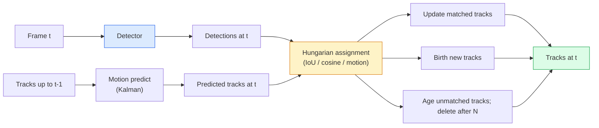

# Theo dõi nhiều đối tượng & trí nhớ video

> Theo dõi là phát hiện cộng với liên kết. phát hiện mọi khung hình. Tích hợp các phát hiện của khung hình này với các dấu vết của khung hình cuối cùng bằng ID.

**Type:** Build
**Languages:** Python
**Prerequisites:** Phase 4 Lesson 06 (YOLO Detection), Phase 4 Lesson 08 (Mask R-CNN), Phase 4 Lesson 24 (SAM 3)
**Time:** ~60 minutes

## Mục tiêu học tập

- Hóa ra phân biệt theo dõi theo dò từ theo dõi dựa trên truy vấn và đặt tên cho các gia đình thuật toán (SORT, DeepSORT, ByteTrack, BoT-SORT, SAM 2 bộ nhớ theo dõi, SAM 3.1 Object Multiplex)
- Thực hiện IoU + Hungary assignment từ đầu cho theo dõi theo dò
- Giải thích ngân hàng bộ nhớ của SAM 2 và lý do tại sao nó xử lý sự bịt kín tốt hơn so với liên kết dựa trên IoU
- Đọc ba số liệu theo dõi (MOTA, IDF1, HOTA) và chọn một trong số đó quan trọng cho một trường hợp sử dụng nhất định

## Vấn đề

Một máy dò cho bạn biết các đối tượng ở đâu trong một khung hình.`t`là cùng một đối tượng như một phát hiện trong khung`t-1`Nếu không có nó, bạn không thể đếm được những vật vượt qua một đường, theo dõi một quả bóng qua một sự bịt kín, hoặc biết "cỗ xe #4 đã ở trong làn đường trong 8 giây".

Theo dõi là điều cần thiết cho mọi sản phẩm đối diện với video: phân tích thể thao, giám sát, lái xe tự động, phân tích video y tế, giám sát động vật hoang dã, đếm dấu từ. Các khối xây dựng cốt lõi được chia sẻ: một bộ phát hiện mỗi khung, một mô hình chuyển động (trình lọc Kalman hoặc một cái gì đó giàu hơn), một bước liên kết (đồ pháp Hungary về IoU / cosine / các tính năng học), và một vòng đời đường (sự sinh, cập nhật, cái chết).

Năm 2026 đã mang lại hai mô hình mới: **SAM 2 memory-based tracking**(tức nhớ tính năng thay vì kết hợp mô hình chuyển động) và **SAM 3.1 Object Multiplex**Bài học này đi theo các phương pháp cổ điển trước, sau đó là phương pháp dựa trên bộ nhớ.

## Khái niệm

### Theo dõi bằng phát hiện



Mỗi bộ theo dõi mà bạn sẽ gặp vào năm 2026 là một biến thể trong vòng lặp này.

- **SORT**(2016): Kalman filter + IoU Hungarian. đơn giản, nhanh chóng, không có mô hình ngoại hình.
- **DeepSORT**(2017): SORT + một tính năng xuất hiện dựa trên CNN cho mỗi bài hát (ReID).
- **ByteTrack**(2021): liên kết các phát hiện độ tự tin thấp với giai đoạn thứ hai; không cần thiết các tính năng xuất hiện nhưng hiệu suất cao nhất trên MOT17.
- **BoT-SORT**(2022): Byte + camera motion compensation + ReID.
- **StrongSORT / OC-SORT** Những người theo dõi ByteTrack có chuyển động và ngoại hình tốt hơn.

### Bộ lọc Kalman trong một đoạn

Một bộ lọc Kalman duy trì trạng thái theo dõi .`(x, y, w, h, dx, dy, dw, dh)`với một sự đồng hóa.**predict**trạng thái sử dụng mô hình tốc độ liên tục, sau đó **update**Các bản cập nhật này tin tưởng vào việc phát hiện nhiều hơn khi sự không chắc chắn dự đoán cao. Điều này cung cấp quỹ đạo trơn tru và khả năng tiếp tục theo dõi thông qua một sự đóng kín ngắn (1-5 khung).

Mỗi bộ theo dõi cổ điển sử dụng bộ lọc Kalman trong bước dự đoán chuyển động.

### Algoritm Hungary

Với một `M x N`Matrix chi phí (tracks x detections), tìm việc giao dịch một đối với một để giảm thiểu tổng chi phí.`1 - IoU(track_bbox, detection_bbox)`hoặc tương đồng âm tính của các tính năng xuất hiện. thời gian chạy là O(((M+N) ^ 3); cho M, N lên đến ~ 1000 nó đủ nhanh trong Python thông qua `scipy.optimize.linear_sum_assignment`- Tôi không biết.

### Ý tưởng chính của ByteTrack

Các máy theo dõi tiêu chuẩn cho thấy độ tự tin thấp (< 0, 5).**second-stage candidates**: sau khi kết hợp các đường ray với các phát hiện độ tin cậy cao, các đường ray không sánh được cố gắng kết hợp các phát hiện độ tin cậy thấp với ngưỡng IoU nhẹ nhàng hơn.

### SAM 2 theo dõi dựa trên bộ nhớ

SAM 2 xử lý video bằng cách giữ một **memory bank**Các bộ nhớ được phân tích với các tính năng của khung mới, và bộ giải mã tạo ra một mặt nạ cho cùng một bản trong khung mới.

Không bộ lọc Kalman, không có bài tập tiếng Hungary.

Lợi thế:
- Đứng vững đến các sự che giấu lớn (tưởng thức mang lại danh tính trường hợp trên nhiều khung).
- Từ khóa mở khi kết hợp với các lời nhắn văn bản của SAM 3.
- Nó hoạt động mà không có mô hình chuyển động riêng biệt.

Khối tác:
- Hạt chậm hơn ByteTrack để theo dõi nhiều vật thể.
- Ngân hàng bộ nhớ tăng lên; hạn chế cửa sổ ngữ cảnh.

### SAM 3.1 Object Multiplex

SAM 2 / SAM 3 theo dõi trước giữ một ngân hàng bộ nhớ riêng biệt mỗi lần. Đối với 50 đối tượng, 50 ngân hàng bộ nhớ. Object Multiplex (March 2026) sụp đổ chúng thành một bộ nhớ chung với **per-instance query tokens**- Giá cả tăng theo đường thẳng dưới số trường hợp.

Multiplex là tiêu chuẩn mặc định mới cho việc theo dõi đám đông vào năm 2026: đám đông biểu diễn, nhân viên kho, giao thông giao thông.

### Ba số liệu cần biết

- **MOTA (Multi-Object Tracking Accuracy)** 1 - (FN + FP + ID switch) / GT. Đánh nặng theo loại lỗi; một số liệu đơn lẻ kết hợp các lỗi phát hiện và liên kết.
- **IDF1 (ID F1)** trung bình hợp đồng của độ chính xác và nhớ ID. Tập trung cụ thể vào mức độ tốt của mỗi đường dẫn thực tại giữ ID của mình theo thời gian.
- **HOTA (Higher Order Tracking Accuracy)** phân hủy thành độ chính xác phát hiện (DetA) và độ chính xác liên kết (AssA).

Đối với giám sát (còn là ai): IDF1 là những gì bạn báo cáo. Đối với phân tích thể thao (tài đếm): HOTA. Đối với so sánh học thuật chung: HOTA.

```figure
cv3-track-assoc
```

## Hãy xây dựng nó

### Bước 1: Matrix chi phí dựa trên IoU

```python
import numpy as np


def bbox_iou(a, b):
    """
    a, b: (N, 4) arrays of [x1, y1, x2, y2].
    Returns (N_a, N_b) IoU matrix.
    """
    ax1, ay1, ax2, ay2 = a[:, 0], a[:, 1], a[:, 2], a[:, 3]
    bx1, by1, bx2, by2 = b[:, 0], b[:, 1], b[:, 2], b[:, 3]
    inter_x1 = np.maximum(ax1[:, None], bx1[None, :])
    inter_y1 = np.maximum(ay1[:, None], by1[None, :])
    inter_x2 = np.minimum(ax2[:, None], bx2[None, :])
    inter_y2 = np.minimum(ay2[:, None], by2[None, :])
    inter = np.clip(inter_x2 - inter_x1, 0, None) * np.clip(inter_y2 - inter_y1, 0, None)
    area_a = (ax2 - ax1) * (ay2 - ay1)
    area_b = (bx2 - bx1) * (by2 - by1)
    union = area_a[:, None] + area_b[None, :] - inter
    return inter / np.clip(union, 1e-8, None)
```

### Bước 2: Trình theo dõi kiểu SORT tối thiểu

Calman bỏ qua cho ngắn gọn  chúng ta sử dụng một liên kết IoU đơn giản ở đây; trong sản xuất dự đoán Kalman là thiết yếu.`sort`Phạm Python cung cấp phiên bản đầy đủ.

```python
from scipy.optimize import linear_sum_assignment


class Track:
    def __init__(self, tid, bbox, frame):
        self.id = tid
        self.bbox = bbox
        self.last_frame = frame
        self.hits = 1

    def update(self, bbox, frame):
        self.bbox = bbox
        self.last_frame = frame
        self.hits += 1


class SimpleTracker:
    def __init__(self, iou_threshold=0.3, max_age=5):
        self.tracks = []
        self.next_id = 1
        self.iou_threshold = iou_threshold
        self.max_age = max_age

    def step(self, detections, frame):
        if not self.tracks:
            for d in detections:
                self.tracks.append(Track(self.next_id, d, frame))
                self.next_id += 1
            return [(t.id, t.bbox) for t in self.tracks]

        track_boxes = np.array([t.bbox for t in self.tracks])
        det_boxes = np.array(detections) if len(detections) else np.empty((0, 4))

        iou = bbox_iou(track_boxes, det_boxes) if len(det_boxes) else np.zeros((len(track_boxes), 0))
        cost = 1 - iou
        cost[iou < self.iou_threshold] = 1e6

        matched_track = set()
        matched_det = set()
        if cost.size > 0:
            row, col = linear_sum_assignment(cost)
            for r, c in zip(row, col):
                if cost[r, c] < 1.0:
                    self.tracks[r].update(det_boxes[c], frame)
                    matched_track.add(r); matched_det.add(c)

        for i, d in enumerate(det_boxes):
            if i not in matched_det:
                self.tracks.append(Track(self.next_id, d, frame))
                self.next_id += 1

        self.tracks = [t for t in self.tracks if frame - t.last_frame <= self.max_age]
        return [(t.id, t.bbox) for t in self.tracks]
```

60 dòng. lấy các phát hiện trên mỗi khung, trả lại ID theo dõi trên mỗi khung. Hệ thống thực thêm dự đoán Kalman, sự phù hợp lại của ByteTrack giai đoạn hai, và tính năng xuất hiện.

### Bước 3: Kiểm tra đường mòn tổng hợp

```python
def synthetic_frames(num_frames=20, num_objects=3, H=240, W=320, seed=0):
    rng = np.random.default_rng(seed)
    starts = rng.uniform(20, 200, size=(num_objects, 2))
    velocities = rng.uniform(-5, 5, size=(num_objects, 2))
    frames = []
    for f in range(num_frames):
        dets = []
        for i in range(num_objects):
            cx, cy = starts[i] + f * velocities[i]
            dets.append([cx - 10, cy - 10, cx + 10, cy + 10])
        frames.append(dets)
    return frames


tracker = SimpleTracker()
for f, dets in enumerate(synthetic_frames()):
    tracks = tracker.step(dets, f)
```

Ba vật di chuyển thẳng phải giữ thẻ ID của họ trên tất cả 20 khung hình.

### Bước 4: Métric chuyển đổi ID

```python
def count_id_switches(tracks_per_frame, gt_per_frame):
    """
    tracks_per_frame:  list of list of (track_id, bbox)
    gt_per_frame:      list of list of (gt_id, bbox)
    Returns number of ID switches.
    """
    prev_assignment = {}
    switches = 0
    for tracks, gts in zip(tracks_per_frame, gt_per_frame):
        if not tracks or not gts:
            continue
        t_boxes = np.array([b for _, b in tracks])
        g_boxes = np.array([b for _, b in gts])
        iou = bbox_iou(g_boxes, t_boxes)
        for g_idx, (gt_id, _) in enumerate(gts):
            j = iou[g_idx].argmax()
            if iou[g_idx, j] > 0.5:
                t_id = tracks[j][0]
                if gt_id in prev_assignment and prev_assignment[gt_id] != t_id:
                    switches += 1
                prev_assignment[gt_id] = t_id
    return switches
```

Đây là một số liệu đơn giản hóa IDF1 lân cận: đếm bao nhiêu lần một đối tượng thực tại mặt đất thay đổi ID đường theo dõi dự đoán được gán.`py-motmetrics`và `TrackEval`- Tôi không biết.

## Sử dụng nó

Các máy theo dõi sản xuất vào năm 2026:

- `ultralytics` YOLOv8 + ByteTrack / BoT-SORT tích hợp. `results = model.track(source, tracker="bytetrack.yaml")`- Đáng mặc định.
- `supervision`(Roboflow)  Bị trùm ByteTrack cộng với tiện ích ghi chú.
- SAM 2 / SAM 3.1  theo dõi dựa trên bộ nhớ qua `processor.track()`- Tôi không biết.
- Dòng tùy chỉnh: máy dò (YOLOv8 / RT-DETR) + `sort-tracker`- `OC-SORT`- `StrongSORT`- Tôi không biết.

Chọn:

- Người đi bộ / xe hơi / hộp ở tốc độ 30+ fps: **ByteTrack with ultralytics**- Tôi không biết.
- Nhiều trường hợp của một lớp trong đám đông:**SAM 3.1 Object Multiplex**- Tôi không biết.
- Các vết lấn nặng với hình dạng có thể xác định được: **DeepSORT / StrongSORT**(Các tính năng ReID).
- Thể thao / tương tác phức tạp: **BoT-SORT**hoặc các máy theo dõi học (MOTRv3).

## Chuyển nó

Bài học này mang lại:

- `outputs/prompt-tracker-picker.md` chọn SORT / ByteTrack / BoT-SORT / SAM 2 / SAM 3.1 cho các loại cảnh, mô hình bịt kín và ngân sách thời gian trễ.
- `outputs/skill-mot-evaluator.md` viết một vòng đánh giá đầy đủ cho MOTA / IDF1 / HOTA chống lại các đường mòn thực tại mặt đất.

## Các bài tập

1. **(Easy)**Hãy chạy bộ theo dõi tổng hợp ở trên với 3, 10 và 30 đối tượng. báo cáo số lượng chuyển đổi ID trong mỗi trường hợp. xác định nơi liên kết đơn giản chỉ với IoU bắt đầu thất bại.
2. **(Medium)**Thêm một bước dự đoán tốc độ liên tục Kalman trước khi kết hợp.
3. **(Hard)**Thêm vào bộ theo dõi dựa trên bộ nhớ của SAM 2 (via `transformers`Thử cả SimpleTracker và SAM 2 trên một clip 30 giây của đám đông và so sánh số lượng chuyển đổi ID, bằng cách dán nhãn bằng tay các ID thực tại cho 5 người nổi bật.

## Các điều khoản chính

| Term | What people say | What it actually means |
|------|----------------|----------------------|
| Tracking-by-detection | "Detect then associate" | Per-frame detector + Hungarian assignment on IoU / appearance |
| Kalman filter | "Motion predict" | Linear dynamics + covariance for smooth track predictions and occlusion handling |
| Hungarian algorithm | "Optimal assignment" | Solves the minimum-cost bipartite matching problem; `scipy.optimize.linear_sum_assignment` |
| ByteTrack | "Low-confidence second pass" | Re-match unmatched tracks to low-confidence detections to recover short occlusions |
| DeepSORT | "SORT + appearance" | Adds a ReID feature for cross-frame matching; better for ID preservation |
| Memory bank | "SAM 2 trick" | Per-instance spatio-temporal features stored across frames; cross-attention replaces explicit association |
| Object Multiplex | "SAM 3.1 shared memory" | Single shared memory with per-instance queries for fast many-object tracking |
| HOTA | "Modern tracking metric" | Decomposes into detection and association accuracy; community standard |

## Đọc thêm

- [SORT (Bewley et al., 2016)](https://arxiv.org/abs/1602.00763) giấy theo dõi bằng phát hiện tối thiểu
- [DeepSORT (Wojke et al., 2017)](https://arxiv.org/abs/1703.07402) thêm tính năng xuất hiện
- [ByteTrack (Zhang et al., 2022)](https://arxiv.org/abs/2110.06864) Tiếp tục thông qua thứ hai có độ tự tin thấp
- [BoT-SORT (Aharon et al., 2022)](https://arxiv.org/abs/2206.14651) Khấu trừ chuyển động của máy ảnh
- [HOTA (Luiten et al., 2020)](https://arxiv.org/abs/2009.07736) Metric theo dõi phân hủy
- [SAM 2 video segmentation (Meta, 2024)](https://ai.meta.com/sam2/) bộ theo dõi dựa trên bộ nhớ
- [SAM 3.1 Object Multiplex (Meta, March 2026)](https://ai.meta.com/blog/segment-anything-model-3/)
