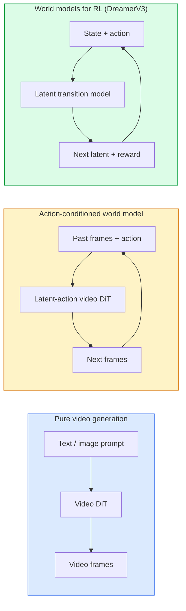

# Các mẫu hình thế giới và video truyền hình

> Một mô hình video dự đoán những giây tiếp theo của một cảnh là một mô phỏng thế giới điều kiện dự đoán về hành động và bạn có một động cơ trò chơi học.

**Type:** Learn + Build
**Languages:** Python
**Prerequisites:** Phase 4 Lesson 10 (Diffusion), Phase 4 Lesson 12 (Video Understanding), Phase 4 Lesson 23 (DiT + Rectified Flow)
**Time:** ~75 minutes

## Mục tiêu học tập

- Giải thích sự khác biệt giữa mô hình sản xuất video thuần túy (Sora 2) và mô hình thế giới điều kiện hành động (Genie 3, DreamerV3)
- Mô tả một video DiT: các bản vá không gian-thời gian, mã hóa vị trí 3D, chú ý chung trên các token (T, H, W)
- Theo dõi cách mô hình thế giới kết nối với robot: VLM kế hoạch → mô hình video mô phỏng → động lực ngược phát hành hành động
- Chọn giữa Sora 2, Genie 3, Runway GWM-1 Worlds, Wan-Video và HunyuanVideo cho một trường hợp sử dụng nhất định (video sáng tạo, sim tương tác, tổng hợp lái xe tự động)

## Vấn đề

Sản xuất video và mô hình hóa thế giới hội tụ vào năm 2026. Một mô hình có thể tạo ra một phút video liên tục, theo một nghĩa nào đó, đã học được cách thế giới di chuyển: sự vĩnh viễn của vật thể, trọng lực, tính nguyên nhân, phong cách. Nếu bạn điều chỉnh dự đoán đó về hành động (lên trái, mở cửa), mô hình video trở thành một mô phỏng có thể học được có thể thay thế một động cơ trò chơi, mô phỏng lái xe, hoặc môi trường robot.

Những gì đang bị đặt cược là bê tông. Genie 3 tạo ra môi trường có thể chơi từ một hình ảnh duy nhất. Đường băng GWM-1 Worlds tổng hợp vô hạn các cảnh khám phá. Sora 2 sản xuất video dài một phút với âm thanh đồng bộ và vật lý mô hình. NVIDIA Cosmos-Drive, Wayve Gaia-2 và Tesla DrivingWorld tạo ra video lái xe thực tế cho dữ liệu đào tạo xe tự lái. Mô hình thế giới đang lặng lẽ chiếm lấy sim-to-real cho robot.

Bài học này là bài học "hình ảnh lớn" cho giai đoạn 4. Nó kết nối việc tạo hình ảnh, hiểu video và lý luận đại lý vào mô hình kiến trúc nghiên cứu thống trị đang tiến tới.

## Khái niệm

### Ba gia đình mô hình hóa thế giới



- **Sora 2**là sản xuất video hoàn toàn dựa trên các yêu cầu không có giao diện hành động bạn không thể "định hướng" nó giữa triển khai
- **Genie 3**- **GWM-1 Worlds**- **Mirage / Magica**là các mô hình thế giới điều chỉnh hành động. Nhập vào các hành động ẩn trong video được quan sát, sau đó điều chỉnh dự đoán khung hình tương lai về các hành động.
- **DreamerV3**và gia đình mô hình thế giới RL cổ điển dự đoán trong một không gian ẩn với điều kiện hành động rõ ràng, được đào tạo trên một tín hiệu phần thưởng. ít hình ảnh hơn; hữu ích hơn cho RL hiệu quả mẫu.

### Video DiT kiến trúc

```
Video latent:          (C, T, H, W)
Patchify (spatial):    grid of P_h x P_w patches per frame
Patchify (temporal):   group P_t frames into a temporal patch
Resulting tokens:      (T / P_t) * (H / P_h) * (W / P_w) tokens
```

Việc mã hóa vị trí là 3D: một sự nhúng xoay hoặc học tập cho mỗi phối hợp (t, h, w).

- **Full joint** tất cả các token tham gia vào tất cả các token. O ((N ^ 2) với N token. cấm cho video dài.
- **Divided** sự chú ý thời gian thay thế (nơi không gian tương tự, qua thời gian: `(H*W) * T^2`) và sự chú ý không gian (một bước thời gian, trên không gian: `T * (H*W)^2`Được sử dụng bởi TimeSformer và hầu hết các video DiT.
- **Window** cửa sổ địa phương trong (t, h, w). Được sử dụng bởi Video Swin.

Mỗi mô hình truyền hình năm 2026 sử dụng một trong ba mô hình này cộng với điều kiện AdaLN (Dạy học 23) và dòng chảy được chỉnh sửa.

### Điều kiện cho các hành động: mô hình hành động ẩn

Genie học được một **latent action**cho mỗi khung bằng cách dự đoán phân biệt hành động giữa một cặp khung liên tiếp. Bộ giải mã của mô hình sau đó điều kiện trên hành động ẩn ẩn  không phải trên các phím bàn phím rõ ràng. Khi suy luận, người dùng có thể xác định một hành động ẩn (hoặc lấy mẫu một từ một trước mới) và mô hình tạo ra khung tiếp theo phù hợp với hành động đó.

Sora bỏ qua giao diện hành động hoàn toàn. Bộ giải mã của nó dự đoán các token thời gian không gian tiếp theo từ các token thời gian không gian trước.

### Tự tin về thể chất

Sor 2 được công bố rõ ràng vào năm 2026**physical plausibility**: trọng lượng, cân bằng, vĩnh viễn của vật thể, nguyên nhân và hiệu ứng. Được đo bằng cách sử dụng điểm xác thực được đánh giá bằng tay; mô hình cải thiện rõ ràng trên các vật thể bị rơi, các ký tự va chạm và thất bại theo mục đích (một nhảy không được thực hiện) so với Sora 1.

Sự khả thi vẫn là chế độ thất bại thống trị. Các video 2024-2025 của những người ăn spaghetti hoặc uống từ kính cho thấy mô hình thiếu đại diện đối tượng bền vững. Mô hình 2026 (Sora 2, Runway Gen-5, HunyuanVideo) giảm nhưng không loại bỏ chúng.

### Các mô hình lái xe tự động thế giới

Các mô hình thế giới lái xe tạo ra cảnh đường thực tế được điều chỉnh theo quỹ đạo, hộp biên hoặc bản đồ định hướng.

- **Cosmos-Drive-Dreams**(NVIDIA)  tạo ra vài phút video lái xe cho đào tạo RL.
- **Gaia-2**(Wayve)  tổng hợp cảnh theo quỹ đạo để đánh giá chính sách.
- **DrivingWorld**(Tesla)  mô phỏng thời tiết khác nhau, thời gian trong ngày, điều kiện giao thông.
- **Vista**(ByteDance)  tổng hợp cảnh lái xe phản ứng.

Chúng thay thế thu thập dữ liệu thực tế đắt tiền cho các trường hợp góc  đi bộ đường bộ vào ban đêm, giao lộ băng, các loại xe bất thường  mà nếu không sẽ đòi hỏi hàng triệu dặm lái xe.

### Bộ đống robot: VLM + mô hình video + động lực ngược

Loop robot 3 thành phần mới nổi:

1. **VLM**phân tích mục tiêu ("tôi lấy cốc đỏ"), lên kế hoạch một chuỗi hành động cấp cao.
2. **Video generation model**mô phỏng việc thực hiện mỗi hành động sẽ trông như thế nào  dự đoán quan sát N khung phía trước.
3. **Inverse dynamics model**lấy ra các lệnh động cơ cụ thể mà sẽ tạo ra những quan sát đó.

Điều này thay thế hình dạng phần thưởng và RL nặng mẫu. Mô hình thế giới làm cho trí tưởng tượng; động lực ngược đóng vòng lặp trên kích hoạt. Genie Envisioner là một phiên bản; nhiều nhóm nghiên cứu đang hội tụ về cấu trúc này.

### Đánh giá

- **Visual quality** FVD (Fréchet Video Distance), nghiên cứu người dùng.
- **Prompt alignment** CLIPS score per frame, đánh giá theo kiểu VQA.
- **Physical plausibility** đánh giá tay trên một bộ điểm chuẩn (Sora 2 điểm chuẩn nội bộ, VBench).
- **Controllability**(đối với các mô hình thế giới tương tác)  hành động → sự nhất quán quan sát; bạn có thể quay lại trạng thái trước đây không?

### Mô hình cảnh quan năm 2026

| Model | Use | Parameters | Output | License |
|-------|-----|------------|--------|---------|
| Sora 2 | text-to-video, audio | — | 1-min 1080p + audio | API only |
| Runway Gen-5 | text/image-to-video | — | 10s clips | API |
| Runway GWM-1 Worlds | interactive world | — | infinite 3D rollout | API |
| Genie 3 | interactive world from image | 11B+ | playable frames | research preview |
| Wan-Video 2.1 | open text-to-video | 14B | high-quality clips | non-commercial |
| HunyuanVideo | open text-to-video | 13B | 10s clips | permissive |
| Cosmos / Cosmos-Drive | autonomous driving sim | 7-14B | driving scenes | NVIDIA open |
| Magica / Mirage 2 | AI-native game engine | — | modifiable worlds | product |

```figure
v4-world-rollout
```

## Hãy xây dựng nó

### Bước 1: 3D patchify cho video

```python
import torch
import torch.nn as nn


class VideoPatch3D(nn.Module):
    def __init__(self, in_channels=4, dim=64, patch_t=2, patch_h=2, patch_w=2):
        super().__init__()
        self.proj = nn.Conv3d(
            in_channels, dim,
            kernel_size=(patch_t, patch_h, patch_w),
            stride=(patch_t, patch_h, patch_w),
        )
        self.patch_t = patch_t
        self.patch_h = patch_h
        self.patch_w = patch_w

    def forward(self, x):
        # x: (N, C, T, H, W)
        x = self.proj(x)
        n, c, t, h, w = x.shape
        tokens = x.reshape(n, c, t * h * w).transpose(1, 2)
        return tokens, (t, h, w)
```

Một khoang 3D với bước bằng hạt nhân hoạt động như một bộ sơn không gian-thời gian. `(T, H, W) -> (T/2, H/2, W/2)`lưới mã thông báo.

### Bước 2: Mã hóa vị trí xoay 3D

Rotary Position Embeddings (RoPE) được áp dụng riêng biệt dọc theo `t`- `h`- `w`Vòng trục:

```python
def rope_3d(tokens, t_dim, h_dim, w_dim, grid):
    """
    tokens: (N, T*H*W, D)
    grid: (T, H, W) sizes
    t_dim + h_dim + w_dim == D
    """
    T, H, W = grid
    n, seq, d = tokens.shape
    if t_dim + h_dim + w_dim != d:
        raise ValueError(f"t_dim+h_dim+w_dim ({t_dim}+{h_dim}+{w_dim}) must equal D={d}")
    assert seq == T * H * W
    t_idx = torch.arange(T, device=tokens.device).repeat_interleave(H * W)
    h_idx = torch.arange(H, device=tokens.device).repeat_interleave(W).repeat(T)
    w_idx = torch.arange(W, device=tokens.device).repeat(T * H)
    # Simplified: just scale channels by frequencies. Real RoPE rotates pairs.
    freqs_t = torch.exp(-torch.log(torch.tensor(10000.0)) * torch.arange(t_dim // 2, device=tokens.device) / (t_dim // 2))
    freqs_h = torch.exp(-torch.log(torch.tensor(10000.0)) * torch.arange(h_dim // 2, device=tokens.device) / (h_dim // 2))
    freqs_w = torch.exp(-torch.log(torch.tensor(10000.0)) * torch.arange(w_dim // 2, device=tokens.device) / (w_dim // 2))
    emb_t = torch.cat([torch.sin(t_idx[:, None] * freqs_t), torch.cos(t_idx[:, None] * freqs_t)], dim=-1)
    emb_h = torch.cat([torch.sin(h_idx[:, None] * freqs_h), torch.cos(h_idx[:, None] * freqs_h)], dim=-1)
    emb_w = torch.cat([torch.sin(w_idx[:, None] * freqs_w), torch.cos(w_idx[:, None] * freqs_w)], dim=-1)
    return tokens + torch.cat([emb_t, emb_h, emb_w], dim=-1)
```

Hình thức phụ gia đơn giản hóa. RoPE thực xoay các kênh được ghép đôi ở tần số; thông tin vị trí là giống nhau.

### Bước 3: ngăn chặn sự chú ý

```python
class DividedAttentionBlock(nn.Module):
    def __init__(self, dim=64, heads=2):
        super().__init__()
        self.time_attn = nn.MultiheadAttention(dim, heads, batch_first=True)
        self.space_attn = nn.MultiheadAttention(dim, heads, batch_first=True)
        self.ln1 = nn.LayerNorm(dim)
        self.ln2 = nn.LayerNorm(dim)
        self.ln3 = nn.LayerNorm(dim)
        self.mlp = nn.Sequential(nn.Linear(dim, 4 * dim), nn.GELU(), nn.Linear(4 * dim, dim))

    def forward(self, x, grid):
        T, H, W = grid
        n, seq, d = x.shape
        # time attention: same (h, w), across t
        xt = x.view(n, T, H * W, d).permute(0, 2, 1, 3).reshape(n * H * W, T, d)
        a, _ = self.time_attn(self.ln1(xt), self.ln1(xt), self.ln1(xt), need_weights=False)
        xt = (xt + a).reshape(n, H * W, T, d).permute(0, 2, 1, 3).reshape(n, seq, d)
        # space attention: same t, across (h, w)
        xs = xt.view(n, T, H * W, d).reshape(n * T, H * W, d)
        a, _ = self.space_attn(self.ln2(xs), self.ln2(xs), self.ln2(xs), need_weights=False)
        xs = (xs + a).reshape(n, T, H * W, d).reshape(n, seq, d)
        xs = xs + self.mlp(self.ln3(xs))
        return xs
```

Sự chú ý thời gian ở mỗi vị trí không gian qua thời gian; sự chú ý không gian ở trong mỗi khung hình qua các vị trí. Hai O(T^2 + (HW) ^ 2) hoạt động thay vì một O((THW) ^2). Đây là lõi của TimeSformer và mọi video hiện đại DiT.

### Bước 4: Tạo một video nhỏ DiT

```python
class TinyVideoDiT(nn.Module):
    def __init__(self, in_channels=4, dim=64, depth=2, heads=2):
        super().__init__()
        self.patch = VideoPatch3D(in_channels=in_channels, dim=dim, patch_t=2, patch_h=2, patch_w=2)
        self.blocks = nn.ModuleList([DividedAttentionBlock(dim, heads) for _ in range(depth)])
        self.out = nn.Linear(dim, in_channels * 2 * 2 * 2)

    def forward(self, x):
        tokens, grid = self.patch(x)
        for blk in self.blocks:
            tokens = blk(tokens, grid)
        return self.out(tokens), grid
```

Không phải máy phát điện video hoạt động; một bản demo cấu trúc mà mỗi mảnh hình thành đúng.

### Bước 5: Kiểm tra hình dạng

```python
vid = torch.randn(1, 4, 8, 16, 16)  # (N, C, T, H, W)
model = TinyVideoDiT()
out, grid = model(vid)
print(f"input  {tuple(vid.shape)}")
print(f"tokens grid {grid}")
print(f"output {tuple(out.shape)}")
```

- Đợi`grid = (4, 8, 8)`và `out = (1, 256, 32)`sau khi được dán; đầu sau đó chiếu vào các bản vá không gian-thời gian theo mã thông báo, sẵn sàng để được không dán lại vào một video.

## Sử dụng nó

Các mô hình tiếp cận sản xuất cho năm 2026:

- **Sora 2 API**(OpenAI)  text-to-video, đồng bộ âm thanh. giá cao cấp.
- **Runway Gen-5 / GWM-1**(Runway)  hình ảnh-video, thế giới tương tác.
- **Wan-Video 2.1 / HunyuanVideo** tự lưu trữ nguồn mở.
- **Cosmos / Cosmos-Drive**(NVIDIA)  mô phỏng lái xe mở trọng lượng.
- **Genie 3** xem trước nghiên cứu, yêu cầu truy cập.

Để xây dựng một mô hình demo thế giới tương tác: bắt đầu với Wan-Video cho chất lượng, lớp trên một bộ điều chỉnh hành động ẩn để tương tác.

Đối với robot, những gì chúng ta có thể làm là:

1. Mục tiêu ngôn ngữ -> VLM (Qwen3-VL) -> kế hoạch cấp cao.
2. Kế hoạch -> mô hình video hành động ẩn -> triển khai tưởng tượng.
3. Rollout -> mô hình động lực ngược -> hành động cấp thấp.
4. Các hành động được thực hiện -> quan sát được đưa trở lại bước 1.

## Chuyển nó

Bài học này mang lại:

- `outputs/prompt-video-model-picker.md` chọn giữa Sora 2 / Runway / Wan / HunyuanVideo / Cosmos với nhiệm vụ, giấy phép và thời gian trễ.
- `outputs/skill-physical-plausibility-checks.md` một kỹ năng xác định kiểm tra tự động (thường trực của vật thể, trọng lực, tính liên tục) để chạy trên bất kỳ video nào được tạo trước khi vận chuyển.

## Các bài tập

1. **(Easy)**Xét số lượng mã thông báo cho một video 360p 5 giây ở patch-t=2, patch-h=8, patch-w=8. Lý do về bộ nhớ để chú ý ở kích thước này.
2. **(Medium)**Thay đổi khối chú ý chia trên cho một khối chú ý chung đầy đủ và đo hình dạng và số lượng tham số. Giải thích tại sao sự chú ý chia là cần thiết cho các mô hình video thực.
3. **(Hard)**Xây dựng mô hình video hành động ẩn tối thiểu: lấy một bộ dữ liệu của (frame_t, action_t, frame_{t+1}) gấp ba (bất kỳ trò chơi 2D đơn giản nào), luyện tập một video nhỏ DiT được điều chỉnh trên các nhúng hành động, và cho thấy rằng các hành động khác nhau tạo ra các khung hình tiếp theo khác nhau.

## Các điều khoản chính

| Term | What people say | What it actually means |
|------|----------------|----------------------|
| World model | "Learned simulator" | A model that predicts future observations given state and action |
| Video DiT | "Spacetime transformer" | Diffusion transformer with 3D patchification and divided attention |
| Latent action | "Inferred control" | Discrete or continuous action latent inferred from frame pairs; used to condition next-frame generation |
| Divided attention | "Time then space" | Two attention operations per block — across time then across space — to keep O(N^2) manageable |
| Object permanence | "Things stay real" | Scene property that video models must learn; classic failure mode on food, glassware |
| FVD | "Fréchet Video Distance" | Video equivalent of FID; primary visual quality metric |
| Inverse dynamics model | "Observations to actions" | Given (state, next state), output the action that connects them; closes robotics loop |
| Cosmos-Drive | "NVIDIA driving sim" | Open-weights autonomous-driving world model for RL and evaluation |

## Đọc thêm

- [Sora technical report (OpenAI)](https://openai.com/index/video-generation-models-as-world-simulators/)
- [Genie: Generative Interactive Environments (Bruce et al., 2024)](https://arxiv.org/abs/2402.15391) mô hình thế giới hành động ẩn
- [TimeSformer (Bertasius et al., 2021)](https://arxiv.org/abs/2102.05095) sự chú ý phân chia cho các máy biến hình
- [DreamerV3 (Hafner et al., 2023)](https://arxiv.org/abs/2301.04104) Mô hình thế giới cho RL
- [Cosmos-Drive-Dreams (NVIDIA, 2025)](https://research.nvidia.com/labs/toronto-ai/cosmos-drive-dreams/) mô hình lái xe thế giới
- [Top 10 Video Generation Models 2026 (DataCamp)](https://www.datacamp.com/blog/top-video-generation-models)
- [From Video Generation to World Model — survey repo](https://github.com/ziqihuangg/Awesome-From-Video-Generation-to-World-Model/)
