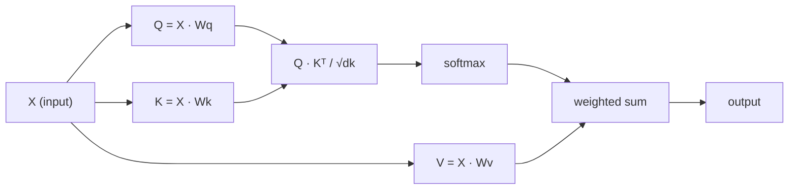

# Chú ý bản thân từ đầu

> Sự chú ý là một bảng tìm kiếm nơi mỗi từ hỏi "Ai quan trọng với tôi?" - và học được câu trả lời.

**Type:** Build
**Languages:** Python
**Prerequisites:** Phase 3 (Deep Learning Core), Phase 5 Lesson 10 (Sequence-to-Sequence)
**Time:** ~90 minutes

## Mục tiêu học tập

- Thực hiện việc tự chú ý sản phẩm điểm quy mô từ đầu chỉ sử dụng NumPy, bao gồm dự đoán truy vấn/t chìa khóa/ giá trị và tổng cân đối với softmax
- Xây dựng một lớp chú ý nhiều đầu chia các đầu, tính toán chú ý song song và kết quả kết nối
- Theo dõi cách mà các mô hình chú ý nắm bắt các mối quan hệ token và giải thích tại sao việc quy mô bằng sqrt(d_k) ngăn chặn sự bão hòa softmax
- Sử dụng sự che giấu nguyên nhân để chuyển đổi sự chú ý hai chiều thành sự chú ý tự động (tương tự giải mã)

## Vấn đề

RNN xử lý chuỗi một token một lần. Đến khi bạn đạt token 50, thông tin từ token 1 đã được nén thông qua 50 bước nén.

Bài báo Bahdanau năm 2014 cho thấy sự khắc phục: để máy giải mã nhìn lại từng vị trí mã hóa và quyết định những vị trí nào quan trọng cho bước hiện tại. Nhưng nó vẫn được gắn vào một RNN. Bài báo "Trông tâm là tất cả những gì bạn cần" năm 2017 đặt ra một câu hỏi sắc bén hơn: nếu sự chú ý là cơ chế * duy nhất *? Không tái phát. Không có sự xoắn. Chỉ cần chú ý.

Sự chú ý tự tính cho phép mỗi vị trí trong một chuỗi chú ý đến mọi vị trí khác trong một bước song song.

## Khái niệm

### Phân tích tìm kiếm cơ sở dữ liệu

Hãy nghĩ về sự chú ý như một tìm kiếm cơ sở dữ liệu mềm:

```
Traditional database:
  Query: "capital of France"  -->  exact match  -->  "Paris"

Attention:
  Query: "capital of France"  -->  similarity to ALL keys  -->  weighted blend of ALL values
```

Mỗi token tạo ra ba vector:
- **Query (Q)**"Tôi đang tìm gì?"
- **Key (K)**"Tôi có gì trong đó?"
- **Value (V)**: "Tôi cung cấp thông tin gì nếu được chọn?"

Kết quả điểm giữa truy vấn và tất cả các phím tạo ra điểm chú ý. Điểm cao có nghĩa là "phím này phù hợp với truy vấn của tôi".

### Q, K, V tính toán

Mỗi token được chiếu qua ba khối lượng được học:

```
Input embeddings (sequence of n tokens, each d-dimensional):

  X = [x1, x2, x3, ..., xn]       shape: (n, d)

Three weight matrices:

  Wq  shape: (d, dk)
  Wk  shape: (d, dk)
  Wv  shape: (d, dv)

Projections:

  Q = X @ Wq    shape: (n, dk)      each token's query
  K = X @ Wk    shape: (n, dk)      each token's key
  V = X @ Wv    shape: (n, dv)      each token's value
```

Nhìn chung, một dấu hiệu:

```
             Wq
  x_i ------[*]------> q_i    "What am I looking for?"
       |
       |     Wk
       +----[*]------> k_i    "What do I contain?"
       |
       |     Wv
       +----[*]------> v_i    "What do I offer?"
```

### Matrix chú ý

Khi bạn có Q, K, V cho tất cả các token, điểm chú ý tạo thành một matrix:

```
Scores = Q @ K^T    shape: (n, n)

              k1    k2    k3    k4    k5
        +-----+-----+-----+-----+-----+
   q1   | 2.1 | 0.3 | 0.1 | 0.8 | 0.2 |   <- how much q1 attends to each key
        +-----+-----+-----+-----+-----+
   q2   | 0.4 | 1.9 | 0.7 | 0.1 | 0.3 |
        +-----+-----+-----+-----+-----+
   q3   | 0.2 | 0.6 | 2.3 | 0.5 | 0.1 |
        +-----+-----+-----+-----+-----+
   q4   | 0.9 | 0.1 | 0.4 | 1.7 | 0.6 |
        +-----+-----+-----+-----+-----+
   q5   | 0.1 | 0.3 | 0.2 | 0.5 | 2.0 |
        +-----+-----+-----+-----+-----+

Each row: one token's attention over the entire sequence
```

Xem một truy vấn tại một thời điểm lau các phím: mỗi hàng ghi điểm mỗi token, softmax biến điểm số thành trọng lượng, và vector ngữ cảnh là sự pha trộn trọng lượng của các giá trị.

```figure
attention-matrix
```

### Tại sao có quy mô?

Các sản phẩm chấm tăng trưởng với kích thước dk. Nếu dk = 64, các sản phẩm chấm có thể nằm trong phạm vi mười, đẩy softmax vào các vùng mà gradient biến mất.

```
Scaled scores = (Q @ K^T) / sqrt(dk)
```

Điều này giữ các giá trị trong phạm vi mà softmax tạo ra gradient hữu ích.

### Softmax biến điểm thành trọng lượng

Softmax chuyển đổi điểm số thô thành phân bố xác suất trên mỗi hàng:

```
Raw scores for q1:   [2.1, 0.3, 0.1, 0.8, 0.2]
                            |
                         softmax
                            |
Attention weights:   [0.52, 0.09, 0.07, 0.14, 0.08]   (sums to ~1.0)
```

Bây giờ mỗi token có một bộ trọng lượng cho biết bao nhiêu để xem xét cho mỗi token khác.

### Số lượng giá trị cân nhắc

Kết quả cuối cùng cho mỗi token là tổng cộng trọng lượng của tất cả các vector giá trị:

```
output_i = sum( attention_weight[i][j] * v_j  for all j )

For token 1:
  output_1 = 0.52 * v1 + 0.09 * v2 + 0.07 * v3 + 0.14 * v4 + 0.08 * v5
```

### Đường ống đầy đủ



Công thức trong một dòng:

```
Attention(Q, K, V) = softmax( Q @ K^T / sqrt(dk) ) @ V
```

```figure
softmax-attention-scaling
```

## Hãy xây dựng nó

### Bước 1: Softmax từ đầu

Softmax chuyển đổi logits nguyên liệu thành xác suất.

```python
import numpy as np

def softmax(x):
    shifted = x - np.max(x, axis=-1, keepdims=True)
    exp_x = np.exp(shifted)
    return exp_x / np.sum(exp_x, axis=-1, keepdims=True)

logits = np.array([2.0, 1.0, 0.1])
print(f"logits:  {logits}")
print(f"softmax: {softmax(logits)}")
print(f"sum:     {softmax(logits).sum():.4f}")
```

### Bước 2: Kiểm tra điểm sản phẩm quy mô

Chức năng cốt lõi lấy các matrix Q, K, V và trả lại sự phát ra sự chú ý cộng với các matrix trọng lượng.

```python
def scaled_dot_product_attention(Q, K, V):
    dk = Q.shape[-1]
    scores = Q @ K.T / np.sqrt(dk)
    weights = softmax(scores)
    output = weights @ V
    return output, weights
```

### Bước 3: Kiểu tập tập tập trung vào bản thân với dự đoán được học

Một mô-đun tự chú ý đầy đủ với các matrix trọng lượng Wq, Wk, Wv được khởi tạo bằng quy mô giống Xavier.

```python
class SelfAttention:
    def __init__(self, d_model, dk, dv, seed=42):
        rng = np.random.default_rng(seed)
        scale = np.sqrt(2.0 / (d_model + dk))
        self.Wq = rng.normal(0, scale, (d_model, dk))
        self.Wk = rng.normal(0, scale, (d_model, dk))
        scale_v = np.sqrt(2.0 / (d_model + dv))
        self.Wv = rng.normal(0, scale_v, (d_model, dv))
        self.dk = dk

    def forward(self, X):
        Q = X @ self.Wq
        K = X @ self.Wk
        V = X @ self.Wv
        output, weights = scaled_dot_product_attention(Q, K, V)
        return output, weights
```

### Bước 4: Đọc bằng một câu

Tạo những bản nhúng giả cho một câu và xem trọng lượng sự chú ý.

```python
sentence = ["The", "cat", "sat", "on", "the", "mat"]
n_tokens = len(sentence)
d_model = 8
dk = 4
dv = 4

rng = np.random.default_rng(42)
X = rng.normal(0, 1, (n_tokens, d_model))

attn = SelfAttention(d_model, dk, dv, seed=42)
output, weights = attn.forward(X)

print("Attention weights (each row: where that token looks):\n")
print(f"{'':>6}", end="")
for token in sentence:
    print(f"{token:>6}", end="")
print()

for i, token in enumerate(sentence):
    print(f"{token:>6}", end="")
    for j in range(n_tokens):
        w = weights[i][j]
        print(f"{w:6.3f}", end="")
    print()
```

### Bước 5: Hình ảnh sự chú ý với hotmap ASCII

Chụp ảnh trọng lượng chú ý của nhân vật để có thể nhìn thấy nhanh chóng.

```python
def ascii_heatmap(weights, tokens, chars=" ░▒▓█"):
    n = len(tokens)
    print(f"\n{'':>6}", end="")
    for t in tokens:
        print(f"{t:>6}", end="")
    print()

    for i in range(n):
        print(f"{tokens[i]:>6}", end="")
        for j in range(n):
            level = int(weights[i][j] * (len(chars) - 1) / weights.max())
            level = min(level, len(chars) - 1)
            print(f"{'  ' + chars[level] + '   '}", end="")
        print()

ascii_heatmap(weights, sentence)
```

## Sử dụng nó

PyTorch's `nn.MultiheadAttention`làm chính xác những gì chúng tôi xây dựng, cộng với phân chia đa đầu và dự đoán đầu ra:

```python
import torch
import torch.nn as nn

d_model = 8
n_heads = 2
seq_len = 6

mha = nn.MultiheadAttention(embed_dim=d_model, num_heads=n_heads, batch_first=True)

X_torch = torch.randn(1, seq_len, d_model)

output, attn_weights = mha(X_torch, X_torch, X_torch)

print(f"Input shape:            {X_torch.shape}")
print(f"Output shape:           {output.shape}")
print(f"Attention weight shape: {attn_weights.shape}")
print(f"\nAttn weights (averaged over heads):")
print(attn_weights[0].detach().numpy().round(3))
```

Sự khác biệt chính: sự chú ý đa đầu chạy nhiều chức năng chú ý song song, mỗi chức năng có dự đoán Q, K, V của riêng mình với kích thước dk = d_model / n_head, sau đó kết quả kết nối. Điều này cho phép mô hình chú ý đến các loại mối quan hệ khác nhau cùng một lúc.

## Chuyển nó

Bài học này mang lại:
- `outputs/prompt-attention-explainer.md`- một lời nhắc để giải thích sự chú ý thông qua phân tích tìm kiếm cơ sở dữ liệu

## Các bài tập

1. Thay đổi `scaled_dot_product_attention`để chấp nhận một matrix mặt nạ tùy chọn đặt một số vị trí đến vô hạn âm trước softmax (đó là cách hoạt động của việc che giấu nguyên nhân/các mã hóa)
2. Thực hiện sự chú ý đa đầu từ đầu: chia Q, K, V thành `n_heads`các mảnh, chạy sự chú ý vào mỗi, kết nối, và chiếu qua một khối lượng cuối cùng
3. Hãy lấy hai câu khác nhau cùng chiều dài, đưa chúng qua cùng một ví dụ về sự chú ý đến bản thân, và so sánh các mô hình chú ý của chúng.

## Các điều khoản chính

| Term | What people say | What it actually means |
|------|----------------|----------------------|
| Query (Q) | "The question vector" | A learned projection of the input that represents what information this token is looking for |
| Key (K) | "The label vector" | A learned projection that represents what information this token contains, matched against queries |
| Value (V) | "The content vector" | A learned projection carrying the actual information that gets aggregated based on attention scores |
| Scaled dot-product attention | "The attention formula" | softmax(QK^T / sqrt(dk)) @ V - scaling prevents softmax saturation in high dimensions |
| Self-attention | "The token looks at itself and others" | Attention where Q, K, V all come from the same sequence, letting every position attend to every other position |
| Attention weights | "How much focus" | A probability distribution over positions, produced by softmax over scaled dot products |
| Multi-head attention | "Parallel attention" | Running multiple attention functions with different projections, then concatenating results for richer representations |

## Đọc thêm

- [Attention Is All You Need (Vaswani et al., 2017)](https://arxiv.org/abs/1706.03762)- giấy biến đổi gốc
- [The Illustrated Transformer (Jay Alammar)](https://jalammar.github.io/illustrated-transformer/)- Điểm nhìn tốt nhất của toàn bộ kiến trúc
- [The Annotated Transformer (Harvard NLP)](https://nlp.seas.harvard.edu/annotated-transformer/)- thực hiện PyTorch theo dòng với lời giải thích
