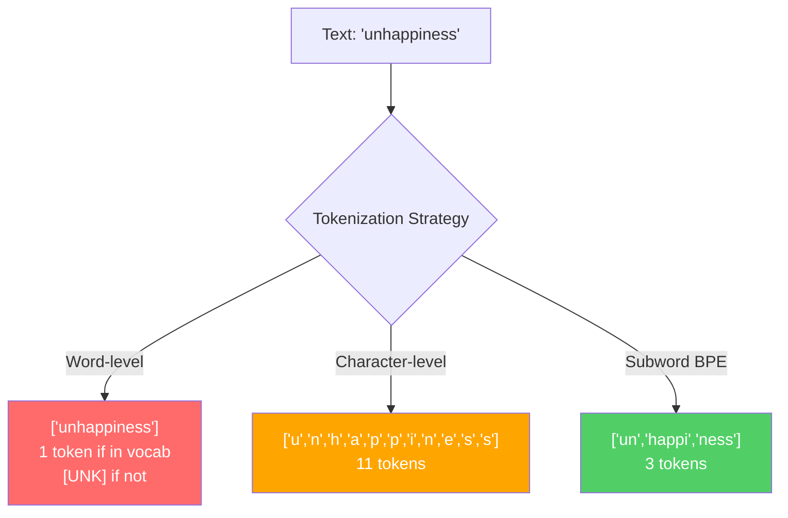
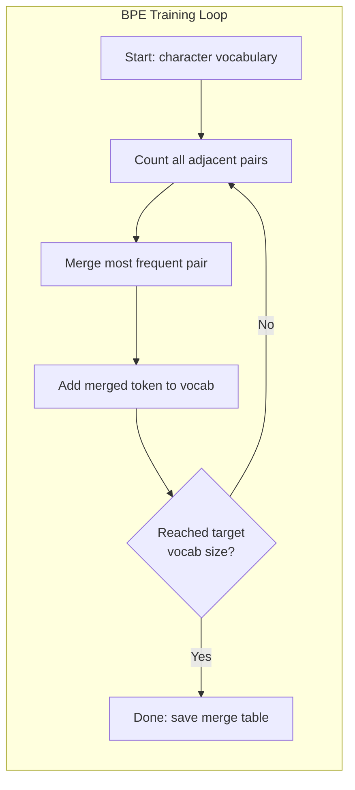
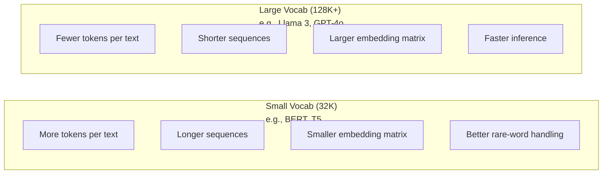

# Các token: BPE, WordPiece, SentencePiece

> LLM của bạn không đọc tiếng Anh. Nó đọc số nguyên. Tokenizer quyết định liệu số nguyên có ý nghĩa hay lãng phí nó.

**Type:** Build
**Languages:** Python
**Prerequisites:** Phase 05 (NLP Foundations)
**Time:** ~90 minutes

## Mục tiêu học tập

- Thực hiện các thuật toán token hóa BPE, WordPiece và Unigram từ đầu và so sánh các chiến lược hợp nhất của họ
- Giải thích kích thước từ vựng ảnh hưởng đến hiệu quả mô hình như thế nào: quá nhỏ tạo ra chuỗi dài, quá lớn chất thải nhúng các tham số
- Phân tích các đồ tạo token trên các ngôn ngữ và mã, xác định nơi các token cụ thể bị phá vỡ
- Sử dụng thư viện tiktoken và phrasepiece để token hóa văn bản và kiểm tra ID token kết quả

## Vấn đề

Thạc sĩ của bạn không đọc tiếng Anh, không đọc bất kỳ ngôn ngữ nào, nó đọc số.

Khoảng cách giữa "Hello, world!" và [15496, 11, 995, 0] là tokenizer. Mỗi từ, mỗi không gian, mỗi dấu chấm phải được chuyển đổi thành một số nguyên trước khi mô hình có thể xử lý nó.

Nếu bạn hiểu sai, mô hình của bạn sẽ lãng phí khả năng mã hóa các từ thông thường với nhiều mã thông báo. "do cùng không may" trở thành bốn token thay vì một. Màn hình của bạn 128K chỉ thu hẹp 75% vì văn bản nặng trong nhiều từ. Làm đúng và cùng một cửa sổ ngữ cảnh có ý nghĩa gấp đôi. Sự khác biệt giữa "mô hình này xử lý mã tốt" và "mô hình này nghiêng vào Python" thường được giảm xuống vào cách thức tokenizer được đào tạo.

Mỗi cuộc gọi API bạn thực hiện với GPT-4 hoặc Claude được định giá theo mã thông báo. Mỗi mã thông báo mô hình của bạn tạo ra chi phí tính toán. càng ít mã thông báo cần thiết để đại diện cho một đầu ra, kết luận kết thúc đến kết thúc càng nhanh. Tokenization không phải là xử lý trước. Đó là kiến trúc.

## Khái niệm

### Ba phương pháp thất bại (và một cách đã thắng)

Có ba cách hiển nhiên để chuyển đổi văn bản thành số. Hai trong số đó không hoạt động trên quy mô.

**Word-level tokenization**"The cat sat" trở thành ["The", "cat", "sat"]". đơn giản. Nhưng còn "tokenization" hay "GPT-4o" hay một từ hợp chất của Đức như "Geschwindigkeitsbegrenzung"?`[UNK]`token -- cách mô hình nói "Tôi không biết điều này là gì". Chỉ riêng tiếng Anh có hơn một triệu hình thức từ. Thêm mã, URL, dấu hiệu khoa học và 100 ngôn ngữ khác và bạn cần một từ vựng vô hạn.

**Character-level tokenization**"Hello" trở thành ["h", "e", "l", "l", "o"". Từ vựng nhỏ bé (một vài trăm ký tự). Không có mã thông báo không biết bao giờ. Nhưng các chuỗi trở nên cực kỳ dài. Một câu có thể là 10 mã thông báo từ sẽ trở thành 50 mã thông báo cấp ký tự. mô hình phải học rằng "t", "h", "e" cùng nhau có nghĩa là "the" - đốt cháy khả năng chú ý đến một cái gì đó con người học vào tuổi ba.

**Subword tokenization**tìm thấy điểm ngọt ngào. Các từ phổ biến vẫn toàn bộ: "the" là một biểu tượng. Các từ hiếm bị phân hủy thành các mảnh có ý nghĩa: "không hạnh phúc" trở thành ["un", "happy", "ness"").

Mỗi LLM hiện đại sử dụng mã hóa từ phụ. GPT-2, GPT-4, BERT, Llama 3, Claude - tất cả chúng. Câu hỏi là thuật toán nào.



### BPE: Mã hóa cặp byte

BPE là một thuật toán nén tham lam được tái sử dụng để token hóa. Ý tưởng là đủ đơn giản để phù hợp với một thẻ chỉ mục.

Bắt đầu với các ký tự riêng lẻ. Đếm từng cặp lân cận trong tập thể dục. Thủy cặp thường xuyên nhất thành một mã thông báo mới. Lặp lại cho đến khi bạn đạt đến kích thước từ vựng mục tiêu của bạn.

```figure
tokenizer-bpe
```

Đây là BPE chạy trên một bộ phận nhỏ với các từ "hệ nhất", "hệ nhất", và "hữu mới nhất":

```
Corpus (with word frequencies):
  "lower"  x5
  "lowest" x2
  "newest" x6

Step 0 -- Start with characters:
  l o w e r       (x5)
  l o w e s t     (x2)
  n e w e s t     (x6)

Step 1 -- Count adjacent pairs:
  (e,s): 8    (s,t): 8    (l,o): 7    (o,w): 7
  (w,e): 13   (e,r): 5    (n,e): 6    ...

Step 2 -- Merge most frequent pair (w,e) -> "we":
  l o we r        (x5)
  l o we s t      (x2)
  n e we s t      (x6)

Step 3 -- Recount and merge (e,s) -> "es":
  l o we r        (x5)
  l o we s t      (x2)    <- 'es' only forms from 'e'+'s', not 'we'+'s'
  n e we s t      (x6)    <- wait, the 'e' before 'we' and 's' after 'we'

Actually tracking this precisely:
  After "we" merge, remaining pairs:
  (l,o): 7   (o,we): 7   (we,r): 5   (we,s): 8
  (s,t): 8   (n,e): 6    (e,we): 6

Step 3 -- Merge (we,s) -> "wes" or (s,t) -> "st" (tied at 8, pick first):
  Merge (we,s) -> "wes":
  l o we r        (x5)
  l o wes t       (x2)
  n e wes t       (x6)

Step 4 -- Merge (wes,t) -> "west":
  l o we r        (x5)
  l o west        (x2)
  n e west        (x6)

...continue until target vocab size reached.
```

Bảng kết hợp là tokenizer. Để mã hóa văn bản mới, áp dụng các kết hợp theo thứ tự mà họ đã học. Thuật liệu đào tạo xác định các kết hợp tồn tại, và sự lựa chọn đó định hình vĩnh viễn những gì mô hình thấy.



### BPE cấp bằng byte (GPT-2, GPT-3, GPT-4)

BPE tiêu chuẩn hoạt động trên các ký tự Unicode. BPE cấp bayt hoạt động trên các byte thô (0-255). Điều này cung cấp cho bạn một từ vựng cơ bản chính xác là 256, xử lý bất kỳ ngôn ngữ hoặc mã hóa nào, và không bao giờ tạo ra một token không rõ.

GPT-2 đã đưa ra cách tiếp cận này. Thuật từ cơ sở bao gồm mọi byte có thể. BPE hợp nhất xây dựng trên đó. Thư viện tiktoken của OpenAI thực hiện BPE cấp byte với các kích thước từ vựng sau:

- GPT-2: 50,257 token
- GPT-3.5/GPT-4: ~100,256 token (cl100k_base encoding)
- GPT-4o: 200,019 token (o200k_base encoding)

### WordPiece (BERT)

WordPiece trông giống như BPE nhưng chọn kết hợp khác nhau. Thay vì tần số nguyên liệu, nó tối đa hóa khả năng dữ liệu đào tạo:

```
BPE merge criterion:      count(A, B)
WordPiece merge criterion: count(AB) / (count(A) * count(B))
```

BPE hỏi: "Điều gì xuất hiện thường xuyên nhất?" WordPiece hỏi: "Điều gì xuất hiện cùng nhau thường xuyên hơn bạn mong đợi ngẫu nhiên?" Sự khác biệt tinh tế này tạo ra các từ vựng khác nhau. WordPiece ưa thích hợp nhất nơi sự xuất hiện cùng là đáng ngạc nhiên, không chỉ thường xuyên.

WordPiece cũng sử dụng một "##" tiền tố cho các từ phụ tiếp tục:

```
"unhappiness" -> ["un", "##happi", "##ness"]
"embedding"   -> ["em", "##bed", "##ding"]
```

"##" cho bạn biết phần này tiếp tục một token trước đó. BERT sử dụng WordPiece với một từ vựng của 30,522 token. Mỗi biến thể BERT - DistilBERT, tokenizer của RoBERTa thực sự là BPE, nhưng BERT chính là WordPiece.

### Câu (Llama, T5)

SentencePiece xử lý đầu vào như một dòng chữ Unicode thô, bao gồm không gian trắng. Không có bước pre-tokenization. Không có quy tắc cụ thể về ngôn ngữ về ranh giới từ. Điều này làm cho nó thực sự không hiểu ngôn ngữ - nó hoạt động trên tiếng Trung, tiếng Nhật, tiếng Thái và các ngôn ngữ khác nơi không gian không tách từ.

SentencePiece hỗ trợ hai thuật toán:
- **BPE mode**: logic merge giống như BPE tiêu chuẩn, áp dụng cho các chuỗi ký tự nguyên liệu
- **Unigram mode**: bắt đầu với một từ vựng lớn và lặp đi lặp lại loại bỏ các mã thông báo ít ảnh hưởng đến khả năng tổng thể.

Llama 2 sử dụng SentencePiece BPE với một từ vựng 32.000 token. T5 sử dụng SentencePiece Unigram với 32.000 token. Lưu ý: Llama 3 chuyển sang một token BPE cấp bằng byte dựa trên tiktoken với 128.256 token.

### Số lượng từ vựng

Đây là một quyết định kỹ thuật thực sự với hậu quả có thể đo lường được.



Số cụ thể. Đối với một từ vựng 128K với 4 096 chiều nhúng, các mã nhúng đơn giản là 128.000 x 4.096 = 524 triệu tham số. Đối với một từ vựng 32K, nó là 131 triệu tham số. Đó là một sự khác biệt tham số 400M từ lựa chọn tokeniser đơn giản.

Nhưng từ vựng lớn hơn nén văn bản một cách hung hăng hơn. cùng một đoạn văn tiếng Anh lấy 100 token với một từ vựng 32K có thể lấy 70 token với một từ vựng 128K. Điều đó có nghĩa là 30% ít hơn đi trước trong quá trình tạo ra. Đối với một mô hình phục vụ hàng triệu yêu cầu, đó là giảm trực tiếp chi phí tính toán.

Xu hướng rõ ràng: quy mô từ vựng đang tăng lên. GPT-2 sử dụng 50.257. GPT-4 sử dụng ~ 100K. Llama 3 sử dụng 128K. GPT-4o sử dụng 200K.

| Model | Vocab Size | Tokenizer Type | Avg Tokens per English Word |
|-------|-----------|----------------|---------------------------|
| BERT | 30,522 | WordPiece | ~1.4 |
| GPT-2 | 50,257 | Byte-level BPE | ~1.3 |
| Llama 2 | 32,000 | SentencePiece BPE | ~1.4 |
| GPT-4 | ~100,256 | Byte-level BPE | ~1.2 |
| Llama 3 | 128,256 | Byte-level BPE (tiktoken) | ~1.1 |
| GPT-4o | 200,019 | Byte-level BPE | ~1.0 |

### Thuế đa ngôn ngữ

Các người mã hóa được đào tạo chủ yếu bằng tiếng Anh là tàn bạo đối với các ngôn ngữ khác. Văn bản Hàn Quốc trong mã hóa GPT-2 trung bình là 2-3 mã hóa mỗi từ. tiếng Trung có thể tệ hơn. Điều này có nghĩa là người dùng Hàn Quốc có một cửa sổ ngữ cảnh có kích thước nửa của người dùng tiếng Anh - trả cùng một giá cho mật độ thông tin ít hơn.

Đây là lý do tại sao Llama 3 đã tăng gấp bốn lần từ 32K lên 128K. Nhiều token dành riêng cho các kịch bản không phải tiếng Anh có nghĩa là nén công bằng hơn giữa các ngôn ngữ.

```figure
tokenizer-tradeoff
```

## Hãy xây dựng nó

### Bước 1: Tokenizer cấp tính

Bắt đầu từ nền tảng. Một tokeniser cấp ký tự lập bản đồ cho mỗi ký tự đến điểm mã Unicode của nó. Không cần đào tạo. Không có mã thông báo không rõ. Chỉ là bản đồ trực tiếp.

```python
class CharTokenizer:
    def encode(self, text):
        return [ord(c) for c in text]

    def decode(self, tokens):
        return "".join(chr(t) for t in tokens)
```

"hello" trở thành [104, 101, 108, 108, 111]. Mỗi ký tự là biểu tượng riêng của nó. Đây là đường cơ bản mà chúng ta cải thiện.

### Bước 2: BPE Tokenizer từ đầu

Thực hiện thực tế. Chúng tôi tập luyện trên các byte thô (như GPT-2), đếm cặp, hợp nhất thường xuyên nhất, và ghi lại mỗi hợp nhất theo thứ tự.

```python
from collections import Counter

class BPETokenizer:
    def __init__(self):
        self.merges = {}
        self.vocab = {}

    def _get_pairs(self, tokens):
        pairs = Counter()
        for i in range(len(tokens) - 1):
            pairs[(tokens[i], tokens[i + 1])] += 1
        return pairs

    def _merge_pair(self, tokens, pair, new_token):
        merged = []
        i = 0
        while i < len(tokens):
            if i < len(tokens) - 1 and tokens[i] == pair[0] and tokens[i + 1] == pair[1]:
                merged.append(new_token)
                i += 2
            else:
                merged.append(tokens[i])
                i += 1
        return merged

    def train(self, text, num_merges):
        tokens = list(text.encode("utf-8"))
        self.vocab = {i: bytes([i]) for i in range(256)}

        for i in range(num_merges):
            pairs = self._get_pairs(tokens)
            if not pairs:
                break
            best_pair = max(pairs, key=pairs.get)
            new_token = 256 + i
            tokens = self._merge_pair(tokens, best_pair, new_token)
            self.merges[best_pair] = new_token
            self.vocab[new_token] = self.vocab[best_pair[0]] + self.vocab[best_pair[1]]

        return self

    def encode(self, text):
        tokens = list(text.encode("utf-8"))
        for pair, new_token in self.merges.items():
            tokens = self._merge_pair(tokens, pair, new_token)
        return tokens

    def decode(self, tokens):
        byte_sequence = b"".join(self.vocab[t] for t in tokens)
        return byte_sequence.decode("utf-8", errors="replace")
```

Loop đào tạo là cốt lõi của BPE: đếm cặp, hợp nhất người chiến thắng, lặp lại. Mỗi hợp nhất làm giảm tổng số lượng token.`num_merges`vòng, từ vựng tăng từ 256 (bytes cơ sở) đến 256 + num_merges.

Việc mã hóa áp dụng các hợp nhất theo thứ tự chính xác mà họ đã học được. Điều này quan trọng. Nếu hợp nhất 1 tạo ra "th" và hợp nhất 5 tạo ra "the", việc mã hóa phải áp dụng hợp nhất 1 trước để "the" có thể hình thành từ "th" + "e" trong hợp nhất 5.

Việc giải mã là ngược lại: tìm kiếm mỗi ID token trong từ vựng, kết nối các byte, giải mã thành UTF-8.

### Bước 3: Mã hóa và giải mã Roundtrip

```python
corpus = (
    "The cat sat on the mat. The cat ate the rat. "
    "The dog sat on the log. The dog ate the frog. "
    "Natural language processing is the study of how computers "
    "understand and generate human language. "
    "Tokenization is the first step in any NLP pipeline."
)

tokenizer = BPETokenizer()
tokenizer.train(corpus, num_merges=40)

test_sentences = [
    "The cat sat on the mat.",
    "Natural language processing",
    "tokenization pipeline",
    "unhappiness",
]

for sentence in test_sentences:
    encoded = tokenizer.encode(sentence)
    decoded = tokenizer.decode(encoded)
    raw_bytes = len(sentence.encode("utf-8"))
    ratio = len(encoded) / raw_bytes
    print(f"'{sentence}'")
    print(f"  Tokens: {len(encoded)} (from {raw_bytes} bytes) -- ratio: {ratio:.2f}")
    print(f"  Roundtrip: {'PASS' if decoded == sentence else 'FAIL'}")
```

Tỷ lệ nén cho bạn biết hiệu quả của tokenizer là bao nhiêu. Tỷ lệ 0,50 có nghĩa là tokenizer nén văn bản thành một nửa số token như các byte nguyên liệu. Tối thấp hơn là tốt hơn. Trong tập thể dục, tỷ lệ sẽ tốt. Trong văn bản không phân phối như "không hạnh phúc" (không xuất hiện trong corpus), tỷ lệ sẽ tồi tệ hơn - tokeniser rơi lại mã hóa cấp ký tự cho các mẫu không thể nhìn thấy.

### Bước 4: So sánh với tiktoken

```python
import tiktoken

enc = tiktoken.get_encoding("cl100k_base")

texts = [
    "The cat sat on the mat.",
    "unhappiness",
    "Hello, world!",
    "def fibonacci(n): return n if n < 2 else fibonacci(n-1) + fibonacci(n-2)",
    "Geschwindigkeitsbegrenzung",
]

for text in texts:
    our_tokens = tokenizer.encode(text)
    tiktoken_tokens = enc.encode(text)
    tiktoken_pieces = [enc.decode([t]) for t in tiktoken_tokens]
    print(f"'{text}'")
    print(f"  Our BPE:   {len(our_tokens)} tokens")
    print(f"  tiktoken:  {len(tiktoken_tokens)} tokens -> {tiktoken_pieces}")
```

tiktoken sử dụng chính xác cùng một thuật toán nhưng được đào tạo trên hàng trăm gigabytes văn bản với 100.000 hợp nhất. thuật toán là giống nhau. Sự khác biệt là dữ liệu đào tạo và số lượng hợp nhất. Tokenizer của bạn được đào tạo trên một đoạn với 40 hợp nhất không thể cạnh tranh với 100K hợp nhất của tiktoken trên một cơ thể lớn. Nhưng cơ chế là giống nhau.

### Bước 5: Phân tích từ vựng

```python
def analyze_vocabulary(tokenizer, test_texts):
    total_tokens = 0
    total_chars = 0
    token_usage = Counter()

    for text in test_texts:
        encoded = tokenizer.encode(text)
        total_tokens += len(encoded)
        total_chars += len(text)
        for t in encoded:
            token_usage[t] += 1

    print(f"Vocabulary size: {len(tokenizer.vocab)}")
    print(f"Total tokens across all texts: {total_tokens}")
    print(f"Total characters: {total_chars}")
    print(f"Avg tokens per character: {total_tokens / total_chars:.2f}")

    print(f"\nMost used tokens:")
    for token_id, count in token_usage.most_common(10):
        token_bytes = tokenizer.vocab[token_id]
        display = token_bytes.decode("utf-8", errors="replace")
        print(f"  Token {token_id:4d}: '{display}' (used {count} times)")

    unused = [t for t in tokenizer.vocab if t not in token_usage]
    print(f"\nUnused tokens: {len(unused)} out of {len(tokenizer.vocab)}")
```

Điều này cho thấy phân phối Zipf trong từ vựng của bạn. Một vài token thống trị (không gian, "the", "e"). Hầu hết các token hiếm khi được sử dụng. Các token sản xuất tối ưu hóa cho phân phối này - các mẫu phổ biến có thẻ ID token ngắn, các mẫu hiếm có biểu diễn dài hơn.

## Sử dụng nó

BPE của anh đã hoạt động, xem công cụ sản xuất trông như thế nào.

### tiktoken (OpenAI)

```python
import tiktoken

enc = tiktoken.get_encoding("cl100k_base")

text = "Tokenizers convert text to integers"
tokens = enc.encode(text)
print(f"Tokens: {tokens}")
print(f"Pieces: {[enc.decode([t]) for t in tokens]}")
print(f"Roundtrip: {enc.decode(tokens)}")
```

tiktoken được viết bằng Rust với liên kết Python. Nó mã hóa hàng triệu token mỗi giây.

### Nhấp mặt tokeners

```python
from tokenizers import Tokenizer
from tokenizers.models import BPE
from tokenizers.trainers import BpeTrainer
from tokenizers.pre_tokenizers import ByteLevel

tokenizer = Tokenizer(BPE())
tokenizer.pre_tokenizer = ByteLevel()

trainer = BpeTrainer(vocab_size=1000, special_tokens=["<pad>", "<eos>", "<unk>"])
tokenizer.train(["corpus.txt"], trainer)

output = tokenizer.encode("The cat sat on the mat.")
print(f"Tokens: {output.tokens}")
print(f"IDs: {output.ids}")
```

Thư viện mã hóa Hugging Face cũng là Rust dưới nắp. Nó đào tạo BPE trên quy mô gigabyte trong vài giây. Đây là những gì bạn sử dụng khi đào tạo mô hình của riêng bạn.

### Lắp đặt Tokenizer của Llama

```python
from transformers import AutoTokenizer

tokenizer = AutoTokenizer.from_pretrained("meta-llama/Llama-3.1-8B")

text = "Tokenizers are the unsung heroes of LLMs"
tokens = tokenizer.encode(text)
print(f"Token IDs: {tokens}")
print(f"Tokens: {tokenizer.convert_ids_to_tokens(tokens)}")
print(f"Vocab size: {tokenizer.vocab_size}")

multilingual = ["Hello world", "Hola mundo", "Bonjour le monde"]
for text in multilingual:
    ids = tokenizer.encode(text)
    print(f"'{text}' -> {len(ids)} tokens")
```

Từ vựng 128K của Llama 3 nén văn bản không tiếng Anh tốt hơn đáng kể so với từ vựng 50K của GPT-2. Bạn có thể tự xác minh điều này - mã hóa cùng một câu trong nhiều ngôn ngữ và đếm các token.

## Chuyển nó

Bài học này sẽ mang lại kết quả `outputs/prompt-tokenizer-analyzer.md`-- một lời nhắc tái sử dụng phân tích hiệu quả token hóa cho bất kỳ kết hợp văn bản và mô hình nào. Đưa nó một mẫu văn bản và nó cho bạn biết mô hình nào của tokenizer xử lý tốt nhất.

## Các bài tập

1. Thay đổi các biểu tượng BPE để in từ vựng tại mỗi bước kết hợp. Xem "t" + "h" trở thành "th", sau đó "th" + "e" trở thành "the". Theo dõi cách các từ tiếng Anh phổ biến được lắp ráp từng mảnh.

2. Thêm các token đặc biệt (`<pad>`- `<eos>`- `<unk>`(bp) để tokenizer BPE. Đưa cho họ ID 0, 1, 2 và chuyển tất cả các token khác tương ứng. Thực hiện một bước trước tokenization chia trên không gian trắng trước khi chạy BPE.

3. Thực hiện tiêu chí kết hợp WordPiece (tỷ lệ xác suất thay vì tần suất). Cử lý cả BPE và WordPiece trên cùng một cơ sở với cùng một số kết hợp. So sánh các từ vựng kết quả - một trong những từ nào tạo ra các phụ từ có ý nghĩa ngôn ngữ hơn?

4. Xây dựng một tiêu chuẩn hiệu quả của tokeniser đa ngôn ngữ. Lấy 10 câu bằng tiếng Anh, tiếng Tây Ban Nha, Trung Quốc, Hàn Quốc và Ả Rập. Đánh dấu mỗi câu bằng tiktoken (cl100k_base) và đo mức trung bình các token cho mỗi ký tự. Quantify "bảo thuế đa ngôn ngữ" cho mỗi ngôn ngữ.

5. Trén BPE tokenizer của bạn trên một corpus lớn hơn (tải xuống một bài viết Wikipedia). Tốt số lượng hợp nhất để đạt được tỷ lệ nén trong khoảng 10% của tiktoken trên cùng một văn bản. Điều này buộc bạn hiểu mối quan hệ giữa kích thước corpus, số lượng hợp nhất và chất lượng nén.

## Các điều khoản chính

| Term | What people say | What it actually means |
|------|----------------|----------------------|
| Token | "A word" | A unit in the model's vocabulary -- could be a character, subword, word, or multi-word chunk |
| BPE | "Some compression thing" | Byte Pair Encoding -- iteratively merge the most frequent adjacent pair of tokens until the target vocabulary size is reached |
| WordPiece | "BERT's tokenizer" | Like BPE but merges maximize the likelihood ratio count(AB)/(count(A)*count(B)) instead of raw frequency |
| SentencePiece | "A tokenizer library" | A language-agnostic tokenizer that operates on raw Unicode without pre-tokenization, supporting BPE and Unigram algorithms |
| Vocabulary size | "How many words it knows" | The total number of unique tokens: GPT-2 has 50,257, BERT has 30,522, Llama 3 has 128,256 |
| Fertility | "Not a tokenizer term" | Average number of tokens per word -- measures tokenizer efficiency across languages (1.0 is perfect, 3.0 means the model works three times harder) |
| Byte-level BPE | "GPT's tokenizer" | BPE operating on raw bytes (0-255) instead of Unicode characters, guaranteeing no unknown tokens for any input |
| Merge table | "The tokenizer file" | Ordered list of pair merges learned during training -- this IS the tokenizer, and order matters |
| Pre-tokenization | "Splitting on spaces" | Rules applied before subword tokenization: whitespace splitting, digit separation, punctuation handling |
| Compression ratio | "How efficient the tokenizer is" | Tokens produced divided by input bytes -- lower means better compression and faster inference |

## Đọc thêm

- [Sennrich et al., 2016 -- "Neural Machine Translation of Rare Words with Subword Units"](https://arxiv.org/abs/1508.07909)-- bài báo giới thiệu BPE cho NLP, biến một thuật toán nén năm 1994 thành nền tảng của token hóa hiện đại
- [Kudo & Richardson, 2018 -- "SentencePiece: A simple and language independent subword tokenizer"](https://arxiv.org/abs/1808.06226)-- token hóa ngôn ngữ-người hiểu biết làm cho các mô hình đa ngôn ngữ thực tế
- [OpenAI tiktoken repository](https://github.com/openai/tiktoken)-- sản xuất BPE thực hiện trong Rust với Python liên kết, được sử dụng bởi GPT-3.5/4/4o
- [Hugging Face Tokenizers documentation](https://huggingface.co/docs/tokenizers)-- đào tạo các tokenizer cấp sản xuất với hiệu suất Rust
