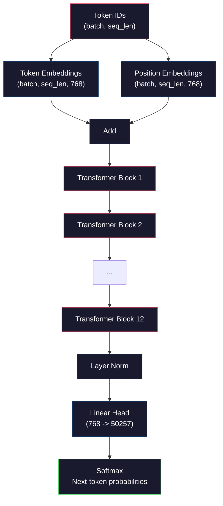
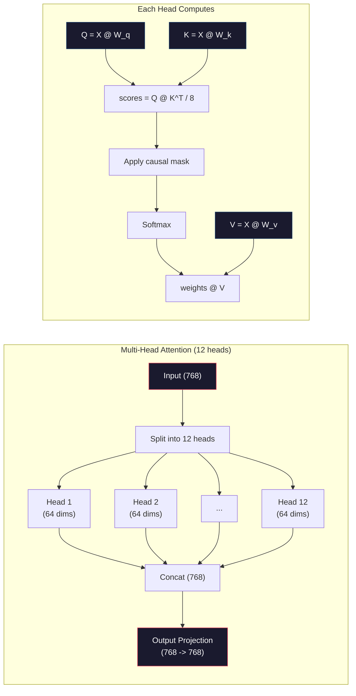
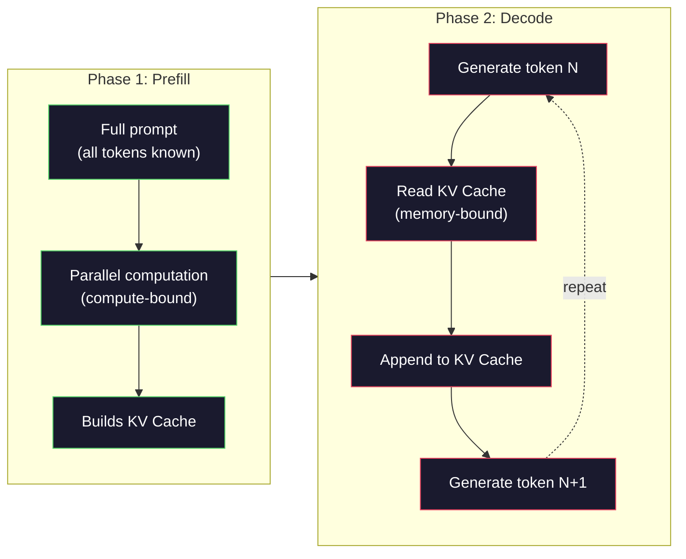

# Dự kiến đào tạo một Mini GPT (124M Parameters)

> GPT-2 Small có 124 triệu tham số. đó là 12 lớp biến đổi, 12 đầu chú ý, và 768 chiều nhúng. bạn có thể đào tạo nó từ đầu trên một GPU trong vài giờ. hầu hết mọi người không làm điều này. họ sử dụng các điểm kiểm tra được đào tạo trước. nhưng nếu bạn không đào tạo một cái đó, bạn không thực sự hiểu những gì đang xảy ra bên trong mô hình bạn đang xây dựng sản phẩm trên.

**Type:** Build
**Languages:** Python (with numpy)
**Prerequisites:** Phase 10, Lessons 01-03 (Tokenizers, Building a Tokenizer, Data Pipelines)
**Time:** ~120 minutes

## Mục tiêu học tập

- Thực hiện kiến trúc GPT-2 đầy đủ (124M tham số) từ đầu: nhúng token, nhúng vị trí, khối biến thể và đầu mô hình ngôn ngữ
- Trình luyện mô hình GPT trên một cơ thể văn bản bằng cách sử dụng dự đoán token tiếp theo với mất entropy chéo
- Thực hiện việc tạo văn bản tự rút bằng cách lấy mẫu nhiệt độ và lọc top-k/top-p
- Theo dõi đường cong mất tập luyện và xác nhận rằng mô hình học các mô hình ngôn ngữ nhất quán

## Vấn đề

Bạn biết biến đổi là gì, bạn đã đọc sơ đồ, bạn có thể đọc "trông trọng là tất cả những gì bạn cần" và vẽ các hộp có nhãn "Trong trọng tâm đa đầu" trên bảng màu.

Không có nghĩa là bạn hiểu được những gì xảy ra khi mô hình tạo ra văn bản.

Có 124,438,272 tham số trong GPT-2 Small (với cân nặng). Mỗi một trong số chúng được thiết lập bằng cách chạy một vòng tròn đào tạo: vượt qua phía trước, mất tính toán, vượt qua trở lại, nâng cấp trọng lượng. 12 khối biến đổi. 12 đầu chú ý mỗi khu. Một không gian nhúng 768 chiều. Một từ vựng của 50,257 token. Mỗi khi mô hình tạo ra một token, tất cả 124 triệu tham số tham gia vào một chuỗi nhân số tử liệu đơn lẻ lấy một chuỗi ID token và tạo ra phân phối xác suất trên token tiếp theo.

Nếu bạn chưa bao giờ tự xây dựng nó, bạn đang làm việc với một hộp đen. Bạn có thể sử dụng API. Bạn có thể điều chỉnh. Nhưng khi một cái gì đó sai lầm - khi mô hình ảo giác, khi nó lặp lại, khi nó từ chối làm theo hướng dẫn - bạn không có mô hình tâm lý về * tại sao*.

Bài học này xây dựng GPT-2 Small từ đầu. Không phải trong PyTorch. Trong numpy. Mỗi nhân tử liệu là hiển thị. Mỗi gradient được tính toán bằng mã của bạn. Bạn sẽ thấy chính xác 124 triệu số âm mưu để dự đoán từ tiếp theo.

## Khái niệm

### Kiến trúc GPT

GPT là một mô hình ngôn ngữ tự động. "Autoregressive" có nghĩa là nó tạo ra một token một lúc, mỗi token được điều kiện trên tất cả các token trước đó.

Dưới đây là biểu đồ tính toán đầy đủ từ ID token đến xác suất token tiếp theo:

1. Các thẻ nhận dạng nhập. hình dạng: (batch_size, seq_len).
2. Đơn hiệu nhúng tìm kiếm. Mỗi ID bản đồ đến một vector 768 chiều. hình dạng: (batch_size, seq_len, 768).
3. Định vị tìm kiếm. Mỗi vị trí (0, 1, 2, ...) được lập ra với một vector 768 chiều.
4. Thêm token + position embeddings.
5. Đi qua 12 khối biến đổi.
6. Tăng bình thường hóa lớp cuối cùng.
7. Định dạng: (batch_size, seq_len, vocab_size).
8. Softmax để có được xác suất.

Đó là toàn bộ mô hình, không có biến động, không có tái phát, chỉ có nhúng, chú ý, mạng feedforward và các quy tắc lớp xếp chồng lên 12 lần.



### Phép biến đổi

Mỗi trong 12 khối theo cùng một mô hình. Kiến trúc trước chuẩn (GPT-2 sử dụng chuẩn trước, không phải chuẩn sau như biến đổi ban đầu):

1. LayerNorm
2. Sự chú ý nhiều người
3. Kết nối còn lại (tăng đầu vào trở lại)
4. LayerNorm
5. Mạng lưới chuyển tiếp (MLP)
6. Kết nối còn lại (tăng đầu vào trở lại)

Các kết nối dư thừa là rất quan trọng. Nếu không có chúng, gradient biến mất khi chúng đạt đến khối 1 trong quá trình lan rộng ngược. Với chúng, gradient có thể chảy trực tiếp từ lỗ đến bất kỳ lớp nào thông qua con đường "lút".

### Lưu ý: Cơ chế cốt lõi

Sự chú ý tự nhiên cho phép mỗi token nhìn vào mỗi token trước đó và quyết định bao nhiêu để tham gia cho mỗi token.

Đối với mỗi vị trí token, tính toán ba vector từ đầu vào:
- **Query (Q)**"Tôi đang tìm gì?"
- **Key (K)**"Tôi có gì trong đó?"
- **Value (V)**"Tôi mang thông tin gì?"

```
Q = input @ W_q    (768 -> 768)
K = input @ W_k    (768 -> 768)
V = input @ W_v    (768 -> 768)

attention_scores = Q @ K^T / sqrt(d_k)
attention_scores = mask(attention_scores)   # causal mask: -inf for future positions
attention_weights = softmax(attention_scores)
output = attention_weights @ V
```

Mặt nạ nguyên nhân là điều làm cho GPT tự rút lui. Vị trí 5 có thể tham gia vào các vị trí 0-5 nhưng không phải 6, 7, 8, v.v. Điều này ngăn chặn mô hình "bảo quy" bằng cách nhìn vào các token trong tương lai trong quá trình đào tạo.

**Multi-head attention**chia không gian 768 chiều thành 12 đầu có mỗi chiều 64 chiều. Mỗi đầu học một mô hình chú ý khác nhau. Một đầu có thể theo dõi các mối quan hệ tổng hợp (thỏa thuận đối tượng-ngôn ngữ). Một đầu khác có thể theo dõi sự tương đồng ngữ học (ngôn ngữ). Một đầu khác có thể theo dõi sự gần gũi vị trí (ngôn ngữ gần gũi).



Việc chia bằng sqrt(d_k) -- sqrt(64) = 8 -- là quy mô. Nếu không có nó, các sản phẩm chấm lớn hơn cho các vector chiều cao, đẩy softmax vào các vùng mà gradient gần như không. Đây là một trong những hiểu biết chính trong bài viết ban đầu "Trông tâm là tất cả bạn cần".

### KV Cache: Tại sao việc suy luận nhanh chóng

Trong quá trình đào tạo, bạn xử lý toàn bộ chuỗi một lần. Trong quá trình suy luận, bạn tạo ra một token một lúc. Không có tối ưu hóa, tạo token N đòi hỏi phải tính lại sự chú ý cho tất cả các token trước đó N-1. đó là O(N^2) cho mỗi token được tạo ra, hoặc tổng cộng O(N^3) cho một chuỗi dài N.

KV Cache sẽ giải quyết chuyện này. Sau khi tính toán K và V cho mỗi token, lưu trữ chúng. Khi tạo token N + 1, bạn chỉ cần tính toán Q cho token mới và tìm kiếm K và V được lưu trữ từ tất cả token trước đó. Điều này làm giảm chi phí mỗi token từ O(N) đến O(1) cho tính toán K và V. Việc tính toán điểm chú ý vẫn là O(N) bởi vì bạn chăm sóc tất cả các vị trí trước đó, nhưng bạn tránh sự nhân số tử liệu dư thừa trên đầu vào.

Đối với GPT-2 với 12 lớp và 12 đầu, bộ nhớ cache KV lưu trữ 2 (K + V) x 12 lớp x 12 đầu x 64 dims = 18.432 giá trị mỗi token. Đối với một chuỗi 1024 token, đó là khoảng 75MB trong FP32. Đối với Llama 3 405B với 128 lớp, bộ nhớ cache KV cho một chuỗi duy nhất có thể vượt quá 10GB. Đây là lý do tại sao suy luận ngữ cảnh dài bị ràng buộc bởi bộ nhớ.

### Prefill vs Decode: Hai giai đoạn của việc đưa ra

Khi bạn gửi một lời nhắc đến một LLM, suy luận xảy ra trong hai giai đoạn khác nhau.

**Prefill**xử lý toàn bộ lệnh liên tục của bạn song song. Tất cả các token được biết đến, vì vậy mô hình có thể tính toán sự chú ý cho tất cả các vị trí cùng một lúc.

**Decode**tạo ra token một lần. Mỗi token mới phụ thuộc vào tất cả các token trước đó. Giai đoạn này là kết nối với bộ nhớ -- nút thắt đọc trọng lượng mô hình và bộ nhớ cache KV từ bộ nhớ GPU, không phải chính toán tử. Các lõi tính toán của GPU hầu hết ngồi yên chờ đọc bộ nhớ. Đối với GPT-2, mỗi bước giải mã mất khoảng cùng một thời gian bất kể số FLOPs mà các matmuls yêu cầu, bởi vì băng thông bộ nhớ là hạn chế.

Sự khác biệt này quan trọng đối với hệ thống sản xuất. Scale thông qua trước với tính toán GPU (more FLOPS = prefill nhanh hơn). Decode thông qua scale với băng thông bộ nhớ (memory faster = decode nhanh hơn). Đó là lý do tại sao H100 của NVIDIA tập trung vào cải thiện băng thông bộ nhớ so với A100 - nó trực tiếp tăng tốc việc tạo token.



### Lòng huấn luyện

Việc đào tạo LLM là dự đoán token tiếp theo. Với các token [0, 1, 2, ..., N-1], dự đoán token [1, 2, 3, ..., N].

Một bước huấn luyện:

1. **Forward pass**: Tham gia các lô thông qua tất cả 12 khối.
2. **Compute loss**: Cross-entropy giữa logits và token mục tiêu (khả năng nhập chuyển đổi bằng một vị trí).
3. **Backward pass**: Xét gradient cho tất cả các tham số 124M bằng cách sử dụng backpropagation.
4. **Optimizer step**GPT-2 sử dụng Adam để tăng tốc độ học tập và phân hủy cosine.

Chương trình học tập có nhiều tính quan trọng hơn bạn có thể mong đợi. GPT-2 nóng lên từ 0 đến tốc độ học tập đỉnh trong 2.000 bước đầu tiên, sau đó phân rã theo đường cong cosine. Bắt đầu với tốc độ học tập cao làm cho mô hình phân biệt. Cần suất học tập cao liên tục gây ra dao động trong đào tạo sau đó.

### GPT-2 Small: Số

| Component | Shape | Parameters |
|-----------|-------|------------|
| Token embeddings | (50257, 768) | 38,597,376 |
| Position embeddings | (1024, 768) | 786,432 |
| Per-block attention (W_q, W_k, W_v, W_out) | 4 x (768, 768) | 2,359,296 |
| Per-block FFN (up + down) | (768, 3072) + (3072, 768) | 4,718,592 |
| Per-block LayerNorms (2x) | 2 x 768 x 2 | 3,072 |
| Final LayerNorm | 768 x 2 | 1,536 |
| **Total per block** | | **7,080,960** |
| **Total (12 blocks)** | | **85,054,464 + 39,383,808 = 124,438,272** |

Dự án đầu ra ( đầu logits) chia sẻ trọng lượng với các mã hóa nhúng. Điều này được gọi là liên kết trọng lượng - nó làm giảm số lượng tham số bằng 38M và cải thiện hiệu suất bởi vì nó buộc mô hình sử dụng cùng không gian đại diện cho đầu vào và đầu ra.

## Hãy xây dựng nó

### Bước 1: Đặt lớp

Các token embedment lập bản đồ mỗi 50257 token có thể được chuyển thành một vector 768 chiều.

```python
import numpy as np

class Embedding:
    def __init__(self, vocab_size, embed_dim, max_seq_len):
        self.token_embed = np.random.randn(vocab_size, embed_dim) * 0.02
        self.pos_embed = np.random.randn(max_seq_len, embed_dim) * 0.02

    def forward(self, token_ids):
        seq_len = token_ids.shape[-1]
        tok_emb = self.token_embed[token_ids]
        pos_emb = self.pos_embed[:seq_len]
        return tok_emb + pos_emb
```

Sự lệch chuẩn 0,02 cho khởi tạo xuất phát từ giấy GPT-2. quá lớn và các bước đi trước ban đầu tạo ra các giá trị cực đoan gây mất ổn định cho đào tạo. quá nhỏ và các đầu ra ban đầu gần như giống nhau cho tất cả các đầu vào, làm cho các tín hiệu gradient sớm vô dụng.

### Bước 2: Kiểm tra bản thân bằng mặt nạ nguyên nhân

Đầu tiên là chú ý một đầu. Mặt nạ nguyên nhân đặt vị trí tương lai lên vô hạn âm trước softmax, đảm bảo mỗi vị trí chỉ có thể chăm sóc cho chính nó và vị trí trước đó.

```python
def attention(Q, K, V, mask=None):
    d_k = Q.shape[-1]
    scores = Q @ K.transpose(0, -1, -2 if Q.ndim == 4 else 1) / np.sqrt(d_k)
    if mask is not None:
        scores = scores + mask
    weights = np.exp(scores - scores.max(axis=-1, keepdims=True))
    weights = weights / weights.sum(axis=-1, keepdims=True)
    return weights @ V
```

Việc thực hiện softmax trừ tối đa trước khi tăng trưởng. Nếu không có điều này, exp(large_number) tràn sang vô hạn. Đây là một thủ thuật ổn định số mà không thay đổi đầu ra bởi vì softmax(x - c) = softmax(x) cho bất kỳ định vị c nào.

### Bước 3: Cung cấp nhiều đầu

Chia các đầu vào 768 chiều thành 12 đầu có mỗi chiều 64 chiều. Mỗi đầu tính toán sự chú ý độc lập. Kết quả kết hợp và dự án trở lại 768 chiều.

```python
class MultiHeadAttention:
    def __init__(self, embed_dim, num_heads):
        self.num_heads = num_heads
        self.head_dim = embed_dim // num_heads
        self.W_q = np.random.randn(embed_dim, embed_dim) * 0.02
        self.W_k = np.random.randn(embed_dim, embed_dim) * 0.02
        self.W_v = np.random.randn(embed_dim, embed_dim) * 0.02
        self.W_out = np.random.randn(embed_dim, embed_dim) * 0.02

    def forward(self, x, mask=None):
        batch, seq_len, d = x.shape
        Q = (x @ self.W_q).reshape(batch, seq_len, self.num_heads, self.head_dim).transpose(0, 2, 1, 3)
        K = (x @ self.W_k).reshape(batch, seq_len, self.num_heads, self.head_dim).transpose(0, 2, 1, 3)
        V = (x @ self.W_v).reshape(batch, seq_len, self.num_heads, self.head_dim).transpose(0, 2, 1, 3)

        scores = Q @ K.transpose(0, 1, 3, 2) / np.sqrt(self.head_dim)
        if mask is not None:
            scores = scores + mask
        weights = np.exp(scores - scores.max(axis=-1, keepdims=True))
        weights = weights / weights.sum(axis=-1, keepdims=True)
        attn_out = weights @ V

        attn_out = attn_out.transpose(0, 2, 1, 3).reshape(batch, seq_len, d)
        return attn_out @ self.W_out
```

Chín chuyển hình-hình hình-hình hình lại là phần nhầm lẫn nhất của sự chú ý đa đầu. Đây là những gì xảy ra: tensor (batch, seq_len, 768) trở thành (batch, seq_len, 12, 64), sau đó (batch, 12, seq_len, 64). Bây giờ mỗi 12 đầu có matrix riêng của mình (seq_len, 64) để chạy sự chú ý. Sau khi chú ý, chúng ta đảo ngược quá trình: (batch, 12, seq_len, 64) trở thành (batch, seq_len, 12, 64) trở thành (batch, seq_len, 768).

### Bước 4: Phòng chuyển đổi

Một khối biến đổi hoàn chỉnh: LayerNorm, chú ý nhiều đầu với dư, LayerNorm, feedforward với dư.

```python
class LayerNorm:
    def __init__(self, dim, eps=1e-5):
        self.gamma = np.ones(dim)
        self.beta = np.zeros(dim)
        self.eps = eps

    def forward(self, x):
        mean = x.mean(axis=-1, keepdims=True)
        var = x.var(axis=-1, keepdims=True)
        return self.gamma * (x - mean) / np.sqrt(var + self.eps) + self.beta


class FeedForward:
    def __init__(self, embed_dim, ff_dim):
        self.W1 = np.random.randn(embed_dim, ff_dim) * 0.02
        self.b1 = np.zeros(ff_dim)
        self.W2 = np.random.randn(ff_dim, embed_dim) * 0.02
        self.b2 = np.zeros(embed_dim)

    def forward(self, x):
        h = x @ self.W1 + self.b1
        h = np.maximum(0, h)  # GELU approximation: ReLU for simplicity
        return h @ self.W2 + self.b2


class TransformerBlock:
    def __init__(self, embed_dim, num_heads, ff_dim):
        self.ln1 = LayerNorm(embed_dim)
        self.attn = MultiHeadAttention(embed_dim, num_heads)
        self.ln2 = LayerNorm(embed_dim)
        self.ffn = FeedForward(embed_dim, ff_dim)

    def forward(self, x, mask=None):
        x = x + self.attn.forward(self.ln1.forward(x), mask)
        x = x + self.ffn.forward(self.ln2.forward(x))
        return x
```

Mạng feedforward mở rộng đầu vào 768 chiều lên 3.072 chiều (4x), áp dụng tính không tuyến tính, sau đó chiếu trở lại 768. Mô hình thu nhỏ mở rộng này cung cấp cho mô hình một đại diện nội bộ "thế hơn" để làm việc tại mỗi vị trí. GPT-2 sử dụng kích hoạt GELU, nhưng chúng tôi sử dụng ReLU ở đây để đơn giản hơn - sự khác biệt nhỏ để hiểu kiến trúc.

### Bước 5: Mô hình GPT đầy đủ

Lắp lên 12 khối biến đổi. Thêm lớp nhúng ở phía trước và dự đoán đầu ra ở phía sau.

```python
class MiniGPT:
    def __init__(self, vocab_size=50257, embed_dim=768, num_heads=12,
                 num_layers=12, max_seq_len=1024, ff_dim=3072):
        self.embedding = Embedding(vocab_size, embed_dim, max_seq_len)
        self.blocks = [
            TransformerBlock(embed_dim, num_heads, ff_dim)
            for _ in range(num_layers)
        ]
        self.ln_f = LayerNorm(embed_dim)
        self.vocab_size = vocab_size
        self.embed_dim = embed_dim

    def forward(self, token_ids):
        seq_len = token_ids.shape[-1]
        mask = np.triu(np.full((seq_len, seq_len), -1e9), k=1)

        x = self.embedding.forward(token_ids)
        for block in self.blocks:
            x = block.forward(x, mask)
        x = self.ln_f.forward(x)

        logits = x @ self.embedding.token_embed.T
        return logits

    def count_parameters(self):
        total = 0
        total += self.embedding.token_embed.size
        total += self.embedding.pos_embed.size
        for block in self.blocks:
            total += block.attn.W_q.size + block.attn.W_k.size
            total += block.attn.W_v.size + block.attn.W_out.size
            total += block.ffn.W1.size + block.ffn.b1.size
            total += block.ffn.W2.size + block.ffn.b2.size
            total += block.ln1.gamma.size + block.ln1.beta.size
            total += block.ln2.gamma.size + block.ln2.beta.size
        total += self.ln_f.gamma.size + self.ln_f.beta.size
        return total
```

Nhận ra sự liên kết trọng lượng: `logits = x @ self.embedding.token_embed.T`. Dự án đầu ra sử dụng lại các mã thông báo nhúng tử liệu (được chuyển giao). Đây không chỉ là một thủ thuật tiết kiệm tham số. Nó có nghĩa là mô hình sử dụng cùng không gian vector để hiểu các mã thông báo (nhúng) và dự đoán chúng (phản xuất).

### Bước 6: Lòng huấn luyện

Để thực hiện một cuộc tập luyện thực sự trên các tham số 124M, bạn sẽ cần một GPU và PyTorch. vòng tập luyện này cho thấy cơ học trên một mô hình nhỏ chạy trong numpy tinh khiết. Chúng tôi sử dụng một mô hình nhỏ (4 lớp, 4 đầu, 128 dims) để làm cho nó dễ xử lý.

```python
def cross_entropy_loss(logits, targets):
    batch, seq_len, vocab_size = logits.shape
    logits_flat = logits.reshape(-1, vocab_size)
    targets_flat = targets.reshape(-1)

    max_logits = logits_flat.max(axis=-1, keepdims=True)
    log_softmax = logits_flat - max_logits - np.log(
        np.exp(logits_flat - max_logits).sum(axis=-1, keepdims=True)
    )

    loss = -log_softmax[np.arange(len(targets_flat)), targets_flat].mean()
    return loss


def train_mini_gpt(text, vocab_size=256, embed_dim=128, num_heads=4,
                   num_layers=4, seq_len=64, num_steps=200, lr=3e-4):
    tokens = np.array(list(text.encode("utf-8")[:2048]))
    model = MiniGPT(
        vocab_size=vocab_size, embed_dim=embed_dim, num_heads=num_heads,
        num_layers=num_layers, max_seq_len=seq_len, ff_dim=embed_dim * 4
    )

    print(f"Model parameters: {model.count_parameters():,}")
    print(f"Training tokens: {len(tokens):,}")
    print(f"Config: {num_layers} layers, {num_heads} heads, {embed_dim} dims")
    print()

    for step in range(num_steps):
        start_idx = np.random.randint(0, max(1, len(tokens) - seq_len - 1))
        batch_tokens = tokens[start_idx:start_idx + seq_len + 1]

        input_ids = batch_tokens[:-1].reshape(1, -1)
        target_ids = batch_tokens[1:].reshape(1, -1)

        logits = model.forward(input_ids)
        loss = cross_entropy_loss(logits, target_ids)

        if step % 20 == 0:
            print(f"Step {step:4d} | Loss: {loss:.4f}")

    return model
```

Sự mất mát bắt đầu gần ln(vocab_size) - cho một từ vựng cấp bay 256 token, đó là ln(256) = 5.55. Một mô hình ngẫu nhiên gán xác suất bằng nhau cho mỗi token. Khi đào tạo tiến triển, sự mất mát giảm vì mô hình học cách dự đoán các mẫu phổ biến: "th" sau "t", không gian sau một khoảng thời gian, v.v.

Trong sản xuất, bạn sẽ sử dụng tối ưu hóa Adam với tích lũy gradient, tăng tốc độ học tập và cắt gradient.

### Bước 7: Tạo văn bản

Tạo ra sử dụng mô hình được đào tạo để dự đoán một token một lúc. Mỗi dự đoán được lấy mẫu từ phân phối đầu ra (hoặc được lấy tham lam như argmax).

```python
def generate(model, prompt_tokens, max_new_tokens=100, temperature=0.8):
    tokens = list(prompt_tokens)
    seq_len = model.embedding.pos_embed.shape[0]

    for _ in range(max_new_tokens):
        context = np.array(tokens[-seq_len:]).reshape(1, -1)
        logits = model.forward(context)
        next_logits = logits[0, -1, :]

        next_logits = next_logits / temperature
        probs = np.exp(next_logits - next_logits.max())
        probs = probs / probs.sum()

        next_token = np.random.choice(len(probs), p=probs)
        tokens.append(next_token)

    return tokens
```

Nhiệt độ điều khiển sự ngẫu nhiên. Nhiệt độ 1.0 sử dụng phân phối nguyên thô. Nhiệt độ 0.5 sắc sắc nét nó (đáng xác định hơn - mô hình chọn lựa hàng đầu thường xuyên hơn). Nhiệt độ 1.5 làm cho nó mảng (những token ngẫu nhiên hơn - các token xác suất thấp có cơ hội lớn hơn). Nhiệt độ 0.0 là giải mã tham lam (luôn chọn token xác suất cao nhất).

- `tokens[-seq_len:]`cửa sổ là cần thiết bởi vì mô hình có chiều dài ngữ cảnh tối đa (1024 cho GPT-2). Một khi bạn vượt quá nó, bạn phải thả các mã thông báo cũ nhất. Đây là "bỗng cửa sổ ngữ cảnh" mà mọi người nói về.

```figure
sampling-decoder
```

## Sử dụng nó

### Đào tạo và Demo thế hệ đầy đủ

```python
corpus = """The transformer architecture has revolutionized natural language processing.
Attention mechanisms allow the model to focus on relevant parts of the input.
Self-attention computes relationships between all pairs of positions in a sequence.
Multi-head attention splits the representation into multiple subspaces.
Each attention head can learn different types of relationships.
The feedforward network provides nonlinear transformations at each position.
Residual connections enable gradient flow through deep networks.
Layer normalization stabilizes training by normalizing activations.
Position embeddings give the model information about token ordering.
The causal mask ensures autoregressive generation during training.
Pre-training on large text corpora teaches the model general language understanding.
Fine-tuning adapts the pre-trained model to specific downstream tasks."""

model = train_mini_gpt(corpus, num_steps=200)

prompt = list("The transformer".encode("utf-8"))
output_tokens = generate(model, prompt, max_new_tokens=100, temperature=0.8)
generated_text = bytes(output_tokens).decode("utf-8", errors="replace")
print(f"\nGenerated: {generated_text}")
```

Trên một bản nhỏ với một mô hình nhỏ, văn bản được tạo ra sẽ là bán nhất quán trong tốt nhất. Nó sẽ học được một số mẫu cấp bayt từ văn bản đào tạo nhưng không thể tổng quát cách GPT-2 làm với dữ liệu đào tạo 40GB và kiến trúc tham số đầy đủ 124M. Điểm là không phải chất lượng đầu ra. Ý tưởng là bạn có thể theo dõi từng bước: tìm kiếm tích hợp, tính toán chú ý, chuyển đổi chuyển tiếp, dự đoán logit, softmax và lấy mẫu. Mọi hoạt động đều hiển thị.

## Chuyển nó

Bài học này sẽ mang lại kết quả `outputs/prompt-gpt-architecture-analyzer.md`-- một lời nhắc phân tích các lựa chọn kiến trúc trong bất kỳ mô hình kiểu GPT nào. Đưa cho nó một thẻ mô hình hoặc báo cáo kỹ thuật và nó phân chia phân bổ tham số, thiết kế chú ý và quyết định quy mô.

## Các bài tập

1. Thay vào 12/12, hãy sửa đổi mô hình để sử dụng 24 lớp và 16 đầu.

2. Thực hiện chức năng kích hoạt GELU (GELU(x) = x * 0.5 * (1 + erf(x / sqrt(2)))) và thay thế ReLU trong mạng feedforward.

3. Thêm một bộ nhớ cache KV vào chức năng tạo. Cung cấp các tensor K và V cho mỗi lớp sau khi chuyển tiếp trước đầu tiên, và sử dụng lại cho các token tiếp theo. Đo tốc độ tăng tốc: tạo 200 token với và không có bộ nhớ cache và so sánh thời gian đồng hồ tường.

4. Thực hiện lấy mẫu top-k (chỉ xem xét các token có xác suất cao nhất k) và lấy mẫu top-p (chọn mẫu lõi: xem xét bộ token nhỏ nhất có xác suất tích lũy vượt quá p). So sánh chất lượng đầu ra ở nhiệt độ 0,8 với top-k=50 so với top-p=0,95.

5. Xây dựng một trình soạn thảo đường cong mất tập luyện. Xây dựng mô hình cho 1000 bước và đường cong mất vs bước. Xác định ba giai đoạn: giảm ban đầu nhanh (đọc các byte phổ biến), giai đoạn trung gian chậm hơn (đọc các mô hình byte), và trũng cao (đóng trên cơ thể nhỏ).

## Các điều khoản chính

| Term | What people say | What it actually means |
|------|----------------|----------------------|
| Autoregressive | "It generates one word at a time" | Each output token is conditioned on all previous tokens -- the model predicts P(token_n \| token_0, ..., token_{n-1}) |
| Causal mask | "It can't see the future" | An upper-triangular matrix of -infinity values that prevents attention to future positions during training |
| Multi-head attention | "Multiple attention patterns" | Splitting Q, K, V into parallel heads (e.g., 12 heads of 64 dims each for GPT-2) so each head can learn different relationship types |
| KV Cache | "Caching for speed" | Storing computed Key and Value tensors from previous tokens to avoid redundant computation during autoregressive generation |
| Prefill | "Processing the prompt" | The first inference phase where all prompt tokens are processed in parallel -- compute-bound on GPU FLOPS |
| Decode | "Generating tokens" | The second inference phase where tokens are generated one at a time -- memory-bound on GPU bandwidth |
| Weight tying | "Sharing embeddings" | Using the same matrix for input token embeddings and the output projection head -- saves 38M params in GPT-2 |
| Residual connection | "Skip connection" | Adding the input directly to the output of a sublayer (x + sublayer(x)) -- enables gradient flow in deep networks |
| Layer normalization | "Normalizing activations" | Normalizing across the feature dimension to mean 0 and variance 1, with learnable scale and bias parameters |
| Cross-entropy loss | "How wrong the predictions are" | -log(probability assigned to the correct next token), averaged over all positions -- the standard LLM training objective |

## Đọc thêm

- [Radford et al., 2019 -- "Language Models are Unsupervised Multitask Learners" (GPT-2)](https://cdn.openai.com/better-language-models/language_models_are_unsupervised_multitask_learners.pdf)-- giấy GPT-2 giới thiệu các thông số từ 124M đến 1.5B
- [Vaswani et al., 2017 -- "Attention Is All You Need"](https://arxiv.org/abs/1706.03762)- giấy biến đổi gốc với sự chú ý của sản phẩm điểm và sự chú ý đa đầu
- [Llama 3 Technical Report](https://arxiv.org/abs/2407.21783)-- làm thế nào Meta mở rộng kiến trúc GPT đến 405B tham số với 16K GPU
- [Pope et al., 2022 -- "Efficiently Scaling Transformer Inference"](https://arxiv.org/abs/2211.05102)-- bài báo đã chính thức hóa phân tích cache KV và prefill vs decode
