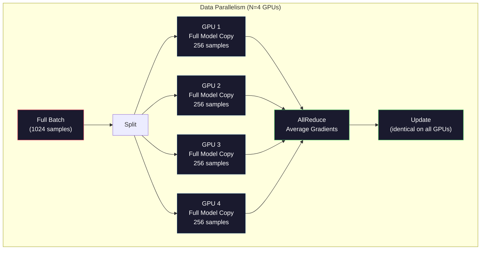
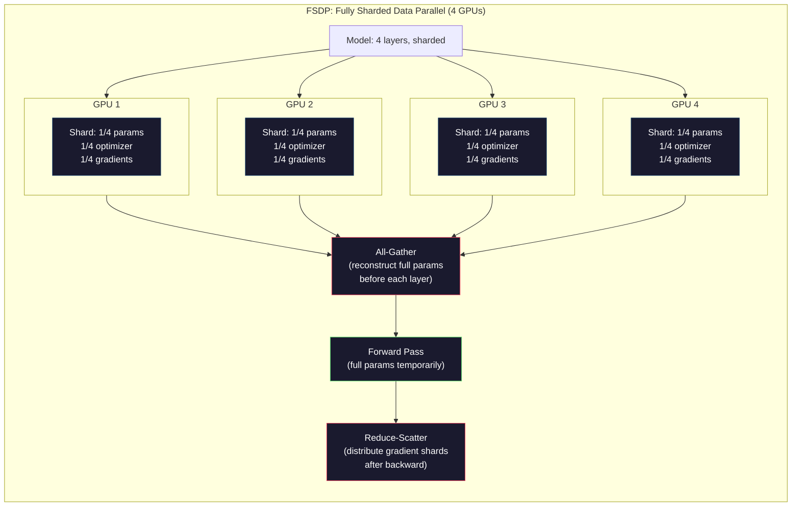
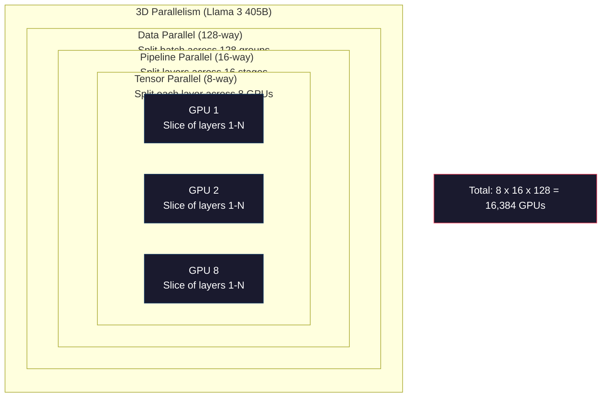

# Scaling: Đào tạo phân tán, FSDP, DeepSpeed

> Mô hình 124M của bạn được đào tạo trên một GPU. Bây giờ thử 7 tỷ tham số. Mô hình không phù hợp với bộ nhớ. Dữ liệu mất hàng tuần trên một máy. đào tạo phân tán không phải là tùy chọn trên quy mô. Đó là con đường duy nhất tiến tới.

**Type:** Build
**Languages:** Python
**Prerequisites:** Phase 10, Lesson 04 (Pre-Training a Mini GPT)
**Time:** ~120 minutes

## Mục tiêu học tập

- Giải thích ba loại song song (dữ liệu, tensor, đường ống dẫn) và khi nào mỗi loại cần thiết dựa trên mô hình và kích thước cluster
- Thực hiện đào tạo song song dữ liệu bằng cách sử dụng PyTorch DDP với sự đồng bộ hóa gradient trên nhiều GPU
- Xét ngân sách bộ nhớ cho kích thước mô hình nhất định (nặng + trạng thái tối ưu hóa + gradient + kích hoạt) để xác định phần cứng tối thiểu
- Cài đặt FSDP hoặc DeepSpeed ZeRO giai đoạn để phân mảnh các trạng thái mô hình trên GPU và các mô hình phù hợp vượt quá bộ nhớ GPU đơn

## Vấn đề

Một mô hình tham số 7B trong FP16 chỉ cần 14GB chỉ cho trọng lượng. Adam Optimizer lưu trữ hai bản sao bổ sung của mỗi tham số (sáng tính thời gian đầu tiên và giây phút thứ hai). Đó là một số 28GB khác. Gradients trong quá trình phát triển ngược thêm 14GB. Bạn ở 56GB trước khi một kích hoạt duy nhất được lưu trữ.

Một chiếc NVIDIA A100 có bộ nhớ 80GB.

56GB trong số 80GB tiêu thụ. Điều đó để lại 24GB cho kích hoạt - các giá trị trung gian được tính toán trong quá trình chuyển tiếp về phía trước phải được giữ sống cho sự lan rộng ngược. Đối với một chuỗi 2048 token với một mô hình 4096 chiều, kích hoạt của một lớp sử dụng khoảng 64MB. Với 32 lớp, bạn cần 2GB cho mỗi mẫu. kích thước lô 8 cần 16GB. Bạn có 24GB. kích thước lô 12 phát nổ.

Bây giờ hãy thử các tham số 70B. Chỉ riêng trọng lượng: 140GB trong FP16. Không phù hợp với một GPU. Bạn cần ít nhất 2 A100 (2 x 80GB = 160GB) chỉ để giữ trọng lượng. Thêm các trạng thái tối ưu hóa và gradient và bạn cần nhiều hơn nhiều: tối thiểu 3+ GPU, và thực tế 8-16 tùy thuộc vào chiến lược phân mảnh.

Llama 3 405B được đào tạo trên 16.384 GPU NVIDIA H100.$100 million in compute. DeepSeek V3 trained a comparable model for roughly $5,6 triệu bằng cách thông minh về kiến trúc (Mix of Experts có nghĩa là chỉ một phần nhỏ các tham số hoạt động cho mỗi token) và hiệu quả đào tạo.

Bài học này bao gồm bốn chiến lược giúp đào tạo quy mô lớn có thể: tương đồng dữ liệu, tương đồng tensor, tương đồng đường ống và tương đồng dữ liệu hoàn toàn phân mảnh. Bạn sẽ mô phỏng mỗi một trong những kỹ thuật này bằng Python tinh khi hiểu cơ học trước khi chạm vào một khuôn khổ đào tạo phân tán.

## Khái niệm

### Tại sao cần phân phối

Đây là toán học bộ nhớ cho các mô hình thực.

| Model | Params | Weights (FP16) | Adam States | Gradients (FP16) | Total (no activations) |
|-------|--------|----------------|-------------|------------------|----------------------|
| GPT-2 Small | 124M | 248 MB | 992 MB | 248 MB | 1.5 GB |
| Llama 3 8B | 8B | 16 GB | 64 GB | 16 GB | 96 GB |
| Llama 3 70B | 70B | 140 GB | 560 GB | 140 GB | 840 GB |
| Llama 3 405B | 405B | 810 GB | 3,240 GB | 810 GB | 4,860 GB |

Cột "Adam States" là kẻ giết người. Adam lưu trữ một trung bình chạy (m) và một biến thể chạy (v) cho mỗi tham số, cả trong FP32. Đối với mô hình 70B, đó là 70B x 4 byte x 2 = 560GB.

Một H100 có 80GB. Llama 3 405B cần ít nhất 61 H100 để giữ trọng lượng, tối ưu hóa và độ nghiêng. Thêm kích hoạt và số lượng tăng lên hơn nữa. Meta sử dụng 16.384 GPU không vì họ muốn - vì họ đã phải làm.

### Sự song song dữ liệu

Chiến lược phân phối đơn giản nhất. Tác lại toàn bộ mô hình thành N GPU. Chia từng tập hợp đào tạo thành N phần bình đẳng. Mỗi GPU chạy một lần đi về phía trước và ngược trên mảnh dữ liệu của nó. Sau khi đi ngược, trung bình các gradient trên tất cả GPU. Mỗi GPU cập nhật bản sao của mình của trọng lượng với cùng gradient trung bình, giữ tất cả các bản sao đồng bộ.

**The good:**Scaling thông qua tuyến tính. N GPU xử lý N lần nhiều dữ liệu mỗi bước. Truyền thông được giới hạn ở mức trung bình gradient, vốn chồng chéo với tính toán.

**The bad:**Mỗi GPU có một bản sao hoàn chỉnh của mô hình, trạng thái tối ưu hóa và độ gradient. Đối với mô hình 70B, mỗi GPU cần 840GB. Sự song song dữ liệu không làm gì để giảm bộ nhớ mỗi GPU. Nó chỉ làm giảm thời gian đào tạo.

**The math:**Kích thước lô hiệu quả = per_gpu_batch_size x N. Đối với N=64 GPU với mỗi lô GPU của 16, lô hiệu quả là 1,024. Llama 3 sử dụng một lô hiệu quả kích thước 16 triệu token mỗi bước.



### Tăng quan song song

Chia các lớp riêng lẻ trên các GPU. Một nhân tử liệu đơn được chia giữa các GPU, mỗi phần tính toán của kết quả.

Hãy xem xét một khối lượng tử liệu (8192, 8192) trong một lớp dẫn trước. Với sự song song của tensor 4 chiều, mỗi GPU có một mảnh (8192, 2048). Mỗi GPU nhân đầu vào bằng mảnh của nó, tạo ra một kết quả một phần. Kết quả một phần được kết hợp (via all-reduce hoặc all-gather) để tạo ra đầu ra đầy đủ.

**The good:**Giảm bộ nhớ mỗi GPU cho trọng lượng của mô hình. Một mô hình 70B chia thành 8 GPU có nghĩa là mỗi GPU có trọng lượng trị giá ~ 8.75B tham số.

**The bad:**Nó đòi hỏi phải có giao tiếp giữa GPU nhanh sau mỗi lớp. All-reduce sau mỗi matmul thêm độ trễ. Điều này hoạt động tốt với NVLink (900 GB / s giữa các GPU trên cùng một nút) nhưng kém trên các nút kết nối bằng InfiniBand (400 Gb / s, khoảng 50 GB / s).

**Real usage:**Megatron-LM là người tiên phong trong việc song song tensor. Llama 3 405B sử dụng song song tensor 8 chiều trong mỗi nút.

### Phòng song đường ống

Chia mô hình theo các lớp. GPU 1 chạy các lớp 1-8. GPU 2 chạy các lớp 9-16. GPU 3 chạy các lớp 17-24. GPU 4 chạy các lớp 25-32. Dữ liệu chảy qua đường ống dẫn: GPU 1 tính toán các lớp của nó và gửi kích hoạt đến GPU 2, tính toán các lớp của nó và gửi đến GPU 3, và như vậy.

**The good:**Sự liên lạc tối thiểu giữa các GPU - chỉ là kích hoạt ở các ranh giới lớp, nhỏ so với độ nghiêng hoặc trọng lượng.

**The bad:**Khi GPU 4 tính toán quá trình đi trước trên micro-batch 1, GPU 1, 2 và 3 là không hoạt động (họ đã chuyển phần của họ). Trong quá trình đi ngược, mô hình đảo ngược. Với đường ống vô lý, việc sử dụng GPU chỉ là 1/N cho các giai đoạn đường ống N.

**GPipe and PipeDream**giải quyết vấn đề bong bóng bằng cách chia các lô vào các lô nhỏ. GPU 1 bắt đầu trên lô nhỏ 2 ngay khi nó hoàn thành chuyển giao lô nhỏ 1. Điều này chồng chéo tính toán qua các giai đoạn đường ống. Với M lô nhỏ và N lô, phần nhỏ bong bóng giảm xuống (N-1) / M. Sử dụng M = 16 lô nhỏ với N = 4 lô và bong bóng là 3/16 = 18,75% thời gian trống.

### FSDP: Dữ liệu hoàn toàn phân mảnh song song

FSDP kết hợp khả năng mở rộng của sự song song dữ liệu với hiệu quả bộ nhớ của việc phân mảnh. Thay vì mỗi GPU giữ một bản sao hoàn chỉnh của mô hình, mỗi GPU chỉ giữ 1/N các tham số, gradient và trạng thái tối ưu hóa.

Trước khi một lớp đi về phía trước, FSDP chạy một **all-gather**để thu thập các tham số đầy đủ từ tất cả các GPU vào bộ nhớ của mỗi GPU. Sau khi đi về phía trước, mỗi GPU loại bỏ các tham số không địa phương. Trong thời gian ngược lại, tất cả tập hợp lại để tái cấu trúc các tham số cho tính toán gradient. Sau khi đi ngược, một **reduce-scatter**phân phối các mảnh gradient để mỗi GPU chỉ lưu trữ 1/N của gradient.

**The math for a 70B model on 8 GPUs:**

| Component | Without FSDP | With FSDP |
|-----------|-------------|-----------|
| Weights (FP16) | 140 GB per GPU | 17.5 GB per GPU |
| Adam States (FP32) | 560 GB per GPU | 70 GB per GPU |
| Gradients (FP16) | 140 GB per GPU | 17.5 GB per GPU |
| **Total** | **840 GB per GPU** | **105 GB per GPU** |

Nếu không có FSDP, bạn không thể gắn một mô hình 70B trên một GPU 80GB. Với FSDP trên 8 GPU, mỗi GPU sử dụng 105GB - chờ, vẫn không phù hợp. Bạn cần ít nhất 16 GPU để đạt dưới 80GB mỗi GPU, hoặc bạn kết hợp FSDP với kiểm tra hoạt động (tái tính năng hoạt động trong thời gian ngược thay vì lưu trữ chúng).

Chi phí giao tiếp cao hơn sự song song dữ liệu vanilla vì tất cả các bộ sưu tập trước mỗi lớp.



### DeepSpeed ZeRO

ZeRO (Zero Redundancy Optimizer) của DeepSpeed về khái niệm giống hệt FSDP nhưng được phát triển độc lập bởi Microsoft. Nó xác định ba giai đoạn, mỗi giai đoạn phân mảnh mạnh mẽ hơn:

| Stage | Shards | Memory Savings | Communication |
|-------|--------|---------------|---------------|
| ZeRO-1 | Optimizer states only | ~4x reduction | Same as data parallel |
| ZeRO-2 | + Gradients | ~8x reduction | Slightly more |
| ZeRO-3 | + Parameters | ~Nx reduction (N GPUs) | All-gather per layer |

ZeRO-3 tương đương với FSDP. Tên gọi khác, cơ chế là giống nhau. PyTorch đã thêm FSDP như một thực hiện bản địa sau khi DeepSpeed chứng minh khái niệm.

DeepSpeed cũng giới thiệu ZeRO-Offload (tạm dịch: "tạm dịch tối ưu hóa tải xuống CPU RAM", rẻ hơn và lớn hơn) và ZeRO-Infinity (tạm dịch: "tạm dịch: "tạm dịch: "tạm dịch: "tạm dịch: "tạm dịch: "tạm dịch: "tạm dịch: "tạm dịch: "tạm dịch: "tạm dịch: "tạm dịch: "tạm dịch: "tạm dịch: "tạm dịch: "tạm dịch: "tạm dịch: "tạm dịch: "tạm dịch: "tạm dịch: "tạm dịch: "tạm dịch: "tạm dịch: "tạm dịch: "tạm dịch: "tạm dịch: "tạm dịch: "tạm dịch: "tạm dịch: "tạm dịch: "tạm dịch: "tạm dịch: "tạm dịch: "tạm dịch: "tạm dịch: "tạm dịch: "tạm dịch: "tạm dịch: "tạm dịch: "tạm dịch: "tạm dịch: "tạm dịch: "tạm dịch: "tạm dịch: "tạm dịch: "tạm dịch: "tạm dịch: "tạm dịch: "tạm dịch: "tạm dịch: "tạm dịch: "tạm dịch: "tạm dịch: "tạm dịch: "tạm dịch: "tạm dịch: "tạm dịch: "tạm dịch: "tạm dịch: "tạm dịch: "tạm dịch: "tạm dịch: "tạm dịch: "tạm dịch: "tạm dịch: "tạm dịch: "tạm dịch: "tạm dịch: "tạm dịch: "tạm dịch: "tạm dịch: "tạm dịch: "tạm dịch: "tạm dịch: "tạm dịch: "t: "tạm dịch: "tạm dịch: "tạm dịch: "tạm dịch: "tạm dịch: "tạm dịch: "tạm dịch: "t: "tạm dịch: "t: "tạm dịch: "t: "tạm dịch: "t: "tạm dịch: "t: "tạm dịch: "t: "tạm dịch: "t: "tạm dịch

### Việc đào tạo chính xác hỗn hợp

Việc đào tạo hiện đại sử dụng nhiều định dạng điểm nổi cùng một lúc:

- **Forward pass**FP16 hoặc BF16 (16-bit). Nửa bộ nhớ của FP32. Matmuls chạy nhanh hơn 2 lần trên lõi tensor.
- **Master weights**: FP32 (32-bit). Được duy trì bởi máy tối ưu hóa cho độ chính xác số trong các bản cập nhật trọng lượng.
- **Loss scaling**: Nồng độ mất bằng một liên tục lớn trước khi đi ngược để ngăn chặn các gradient FP16 chảy xuống không. Chia bằng cùng một liên tục trước bước tối ưu hóa.

BF16 (Brain Float 16) có cùng phạm vi biểu tượng như FP32 (8 bit biểu tượng) nhưng độ chính xác giảm (7 bit mantissa so với FP32's 23). Nó hiếm khi cần quy mô mất mát vì nó có thể đại diện cho cùng phạm vi giá trị. FP16 có 5 bit biểu tượng và 10 bit mantissa - nó có thể đại diện cho các giá trị hạt mỏng nhưng chảy quá / chảy xuống ở độ lớn cực.

Các TPU của Google sử dụng BF16 bản địa. A100 và H100 của NVIDIA hỗ trợ cả FP16 và BF16. ngành công nghiệp phần lớn đã chuyển sang BF16 vì nó loại bỏ đau đầu giảm cân.

**Memory comparison for a 7B model:**

| Precision | Weights | Optimizer | Gradients | Total |
|-----------|---------|-----------|-----------|-------|
| FP32 everywhere | 28 GB | 56 GB | 28 GB | 112 GB |
| Mixed (BF16 + FP32 master) | 14 GB | 56 GB | 14 GB | 84 GB |

Độ chính xác hỗn hợp tiết kiệm 28GB trên mô hình này. Các trạng thái tối ưu hóa ở trong FP32 bất kể - đây là nơi mà hầu hết bộ nhớ đi.

### Megatron-LM và 3D Parallelism

Việc đào tạo quy mô lớn thực sự kết hợp cả ba sự song song:

- **Data parallelism**trên các nhóm các nút (kích thước lô quy mô)
- **Tensor parallelism**trong một nút (các lớp chia trên 8 GPU)
- **Pipeline parallelism**qua các nút (các nhóm lớp chia trên các máy)

Llama 3 405B trên 16.384 H100:
- Sự song song 8 chiều trong mỗi nút (8 GPU mỗi nút)
- Sự song song đường đường ống 16 đường qua các nút (16 giai đoạn đường ống)
- Sự tương đồng dữ liệu 128 chiều trên chiều còn lại (16,384 / 8 / 16 = 128)

Sự phân hủy 3D này (8 x 16 x 128 = 16,384) là cách bạn mở rộng đến hàng ngàn GPU. Mỗi GPU nhìn thấy một mảnh dữ liệu khác nhau (thường song dữ liệu), giữ một mảnh của mỗi lớp (thường song tensor), và tính toán một bộ các lớp khác nhau (thường song ống).

DeepSeek V3 đã có một cách tiếp cận khác. kiến trúc Mixture of Experts của họ chỉ kích hoạt 37B trong số 671B tham số mỗi token. Điều này có nghĩa là mỗi GPU chỉ cần tính toán (và lưu trữ kích hoạt cho) các tham số hoạt động. Họ được đào tạo trên 2.048 H800 GPU - ít hơn 1/8 số GPU của Meta - cho$5.6M vs Meta's estimated $100m.



```figure
paged-kv-cache
```

## Hãy xây dựng nó

### Bước 1: Tái mô phỏng sự song song dữ liệu

Chia một lô ra các GPU mô phỏng. Mỗi GPU tính toán một lần đi về phía trước trên mảnh của nó.

```python
import numpy as np

def simulate_data_parallelism(data, num_gpus, model_fn):
    batch_size = len(data)
    shard_size = batch_size // num_gpus
    remainder = batch_size % num_gpus

    gpu_losses = []
    gpu_gradients = []

    offset = 0
    for gpu_id in range(num_gpus):
        extra = 1 if gpu_id < remainder else 0
        shard = data[offset:offset + shard_size + extra]
        offset += shard_size + extra

        loss, grad = model_fn(shard)
        gpu_losses.append(loss)
        gpu_gradients.append(grad)

    avg_loss = np.mean(gpu_losses)
    avg_gradient = np.mean(gpu_gradients, axis=0)

    return avg_loss, avg_gradient
```

Hành động giảm tất cả (tỷ lệ gradient trung bình) là thông tin duy nhất trong sự song song dữ liệu. Trong thực tế, điều này sử dụng thư viện NCCL trên các GPU NVIDIA, điều này thực hiện ring all-reduce: mỗi GPU gửi 1/N của gradient của nó đến hàng xóm của nó, nhận 1/N từ hàng xóm khác, và sau các bước N-1 mỗi GPU có trung bình hoàn chỉnh. Tổng khối lượng truyền thông: 2 x gradient_size x (N-1)/N, gần 2x kích thước gradient cho N lớn.

### Bước 2: Chơi minh sự song song của áp lực

Chia một khối lượng tử liệu giữa các GPU. Mỗi GPU tính toán một số lần tử liệu phân phần. Kết quả kết hợp.

```python
def simulate_tensor_parallelism(input_data, weight_matrix, num_gpus):
    d_in, d_out = weight_matrix.shape
    assert d_out % num_gpus == 0, f"d_out {d_out} not divisible by num_gpus {num_gpus}"
    shard_size = d_out // num_gpus

    partial_results = []
    for gpu_id in range(num_gpus):
        start = gpu_id * shard_size
        end = start + shard_size
        weight_shard = weight_matrix[:, start:end]

        partial = input_data @ weight_shard
        partial_results.append(partial)

    full_output = np.concatenate(partial_results, axis=-1)

    direct_output = input_data @ weight_matrix
    error = np.abs(full_output - direct_output).max()

    return full_output, error
```

Sai lầm phải là chính xác bằng không (hoặc máy epsilon). Sự song song của áp lực chính xác về mặt toán học - nó tạo ra kết quả tương tự như tính toán toàn bộ matmul trên một GPU. Sự chia rẽ nằm dọc theo chiều đầu ra, vì vậy mỗi GPU tạo ra một mảnh cột khác nhau, và kết nối tái tạo kết quả đầy đủ.

Đối với các lớp tuyến tính song song cột (căn chia chiều kích đầu ra), bạn kết nối. Đối với đường song cột (căn chia chiều đầu vào), bạn cộng. Trong một biến thể FFN, đường thẳng đầu tiên (tăng) sử dụng đường song cột và đường thẳng thứ hai (các hợp đồng) sử dụng đường song cột. Điều này tránh được sự giảm hoàn toàn giữa hai lớp.

### Bước 3: Chơi minh sự song song đường đường ống

Chia các lớp của mô hình trên các GPU ảo. Khải minh vấn đề bong bóng nơi các giai đoạn đầu ngồi trống trong khi các giai đoạn sau tính toán.

```python
def simulate_pipeline_parallelism(num_layers, num_stages, num_microbatches):
    layers_per_stage = num_layers // num_stages

    timeline = {}
    clock = 0

    for mb in range(num_microbatches):
        for stage in range(num_stages):
            start_time = max(
                timeline.get((stage, mb - 1, "fwd"), (0, 0))[1] if mb > 0 else 0,
                timeline.get((stage - 1, mb, "fwd"), (0, 0))[1] if stage > 0 else 0,
            )
            end_time = start_time + layers_per_stage
            timeline[(stage, mb, "fwd")] = (start_time, end_time)

    last_fwd_end = max(v[1] for v in timeline.values())

    for mb in range(num_microbatches - 1, -1, -1):
        for stage in range(num_stages - 1, -1, -1):
            deps = [last_fwd_end]
            if mb < num_microbatches - 1 and (stage, mb + 1, "bwd") in timeline:
                deps.append(timeline[(stage, mb + 1, "bwd")][1])
            if stage < num_stages - 1 and (stage + 1, mb, "bwd") in timeline:
                deps.append(timeline[(stage + 1, mb, "bwd")][1])
            start_time = max(deps)
            end_time = start_time + layers_per_stage
            timeline[(stage, mb, "bwd")] = (start_time, end_time)

    total_time = max(v[1] for v in timeline.values())
    compute_time = num_microbatches * num_stages * layers_per_stage * 2
    bubble_fraction = 1.0 - compute_time / (total_time * num_stages)

    return timeline, total_time, bubble_fraction
```

Với 4 giai đoạn và 1 micro batch, phần nhỏ bong bóng là 75% -- 3 trong 4 GPU bất cứ lúc nào không hoạt động. Với 16 micro batch, nó giảm xuống khoảng 19%. Chi phí loại bỏ bong bóng là bộ nhớ: bạn phải lưu trữ kích hoạt cho tất cả các micro batch trên chuyến bay cùng một lúc.

### Bước 4: Máy tính bộ nhớ

Xét ra các yêu cầu bộ nhớ chính xác cho đào tạo bất kỳ kích thước mô hình nào.

```python
def memory_calculator(
    params_billions,
    precision_bytes=2,
    optimizer="adam",
    num_gpus=1,
    sharding="none",
    sequence_length=2048,
    batch_size_per_gpu=1,
    hidden_dim=None,
    num_layers=None,
):
    params = params_billions * 1e9

    weight_memory = params * precision_bytes

    if optimizer == "adam":
        optimizer_memory = params * 4 * 2
    elif optimizer == "sgd":
        optimizer_memory = params * 4
    else:
        optimizer_memory = 0

    gradient_memory = params * precision_bytes

    total_no_activation = weight_memory + optimizer_memory + gradient_memory

    if hidden_dim and num_layers:
        activation_per_layer = (
            sequence_length * batch_size_per_gpu * hidden_dim * precision_bytes * 4
        )
        activation_memory = activation_per_layer * num_layers
    else:
        activation_memory = params * precision_bytes * 0.5

    if sharding == "fsdp" or sharding == "zero3":
        weight_memory /= num_gpus
        optimizer_memory /= num_gpus
        gradient_memory /= num_gpus
    elif sharding == "zero2":
        optimizer_memory /= num_gpus
        gradient_memory /= num_gpus
    elif sharding == "zero1":
        optimizer_memory /= num_gpus

    per_gpu_total = weight_memory + optimizer_memory + gradient_memory + activation_memory

    return {
        "params_billions": params_billions,
        "weights_gb": weight_memory / 1e9,
        "optimizer_gb": optimizer_memory / 1e9,
        "gradients_gb": gradient_memory / 1e9,
        "activations_gb": activation_memory / 1e9,
        "per_gpu_total_gb": per_gpu_total / 1e9,
        "total_across_gpus_gb": per_gpu_total * num_gpus / 1e9,
        "fits_on_80gb": per_gpu_total / 1e9 <= 80,
        "num_gpus": num_gpus,
        "sharding": sharding,
    }
```

Máy tính này trả lời câu hỏi mà mỗi kỹ sư ML hỏi: "Tôi cần bao nhiêu GPU?" Đưa nó vào kích thước mô hình và xem nó có phù hợp không.

### Bước 5: Chơi minh độ chính xác hỗn hợp

So sánh sử dụng bộ nhớ giữa FP32, FP16 và đào tạo chính xác hỗn hợp.

```python
def mixed_precision_comparison(params_billions):
    params = params_billions * 1e9

    fp32_weights = params * 4
    fp32_optimizer = params * 4 * 2
    fp32_gradients = params * 4
    fp32_total = fp32_weights + fp32_optimizer + fp32_gradients

    fp16_weights = params * 2
    fp16_master = params * 4
    fp16_optimizer = params * 4 * 2
    fp16_gradients = params * 2
    fp16_total = fp16_weights + fp16_master + fp16_optimizer + fp16_gradients

    mixed_weights = params * 2
    mixed_optimizer = params * 4 * 2
    mixed_gradients = params * 2
    mixed_total = mixed_weights + mixed_optimizer + mixed_gradients

    return {
        "fp32_total_gb": fp32_total / 1e9,
        "fp16_with_master_gb": fp16_total / 1e9,
        "mixed_bf16_gb": mixed_total / 1e9,
        "savings_vs_fp32": 1 - mixed_total / fp32_total,
    }
```

Sự ngạc nhiên lớn nhất đối với hầu hết mọi người: độ chính xác hỗn hợp không làm giảm bộ nhớ một nửa. Các trạng thái tối ưu hóa (m và v của Adam) ở lại trong FP32 bất kể độ chính xác. Đối với mô hình 7B, đào tạo FP32 sử dụng 112GB. độ chính xác hỗn hợp sử dụng 84GB. Đó là giảm 25% chứ không phải 50%.

## Sử dụng nó

### Tiêu chuẩn tất cả các mô phỏng

```python
def run_all_demos():
    print("=" * 70)
    print("DATA PARALLELISM SIMULATION")
    print("=" * 70)

    np.random.seed(42)
    data = np.random.randn(64, 32)
    weight = np.random.randn(32, 16)

    def model_fn(batch):
        output = batch @ weight
        loss = np.mean(output ** 2)
        grad = 2 * batch.T @ (batch @ weight) / len(batch)
        return loss, grad

    for n_gpus in [1, 2, 4, 8]:
        loss, grad = simulate_data_parallelism(data, n_gpus, model_fn)
        print(f"  {n_gpus} GPUs: loss={loss:.4f}, grad_norm={np.linalg.norm(grad):.4f}")

    print()
    print("=" * 70)
    print("TENSOR PARALLELISM SIMULATION")
    print("=" * 70)

    x = np.random.randn(4, 8192)
    W = np.random.randn(8192, 8192)

    for n_gpus in [1, 2, 4, 8]:
        output, error = simulate_tensor_parallelism(x, W, n_gpus)
        print(f"  {n_gpus} GPUs: output_shape={output.shape}, max_error={error:.2e}")

    print()
    print("=" * 70)
    print("PIPELINE PARALLELISM SIMULATION")
    print("=" * 70)

    for n_mb in [1, 4, 8, 16, 32]:
        _, total_t, bubble = simulate_pipeline_parallelism(32, 4, n_mb)
        print(f"  {n_mb:2d} micro-batches: total_time={total_t:4d}, bubble={bubble:.1%}")

    print()
    print("=" * 70)
    print("MEMORY CALCULATOR")
    print("=" * 70)

    configs = [
        (7, "none", 1),
        (7, "fsdp", 8),
        (70, "none", 1),
        (70, "fsdp", 8),
        (70, "fsdp", 16),
        (405, "fsdp", 64),
        (405, "fsdp", 128),
    ]

    print(f"  {'Model':>8} {'Sharding':>8} {'GPUs':>5} {'Per-GPU':>10} {'Fits 80GB':>10}")
    print("  " + "-" * 50)
    for params, shard, gpus in configs:
        result = memory_calculator(params, num_gpus=gpus, sharding=shard)
        fits = "Yes" if result["fits_on_80gb"] else "No"
        print(f"  {params:>6}B {shard:>8} {gpus:>5} {result['per_gpu_total_gb']:>8.1f}GB {fits:>10}")

    print()
    print("=" * 70)
    print("MIXED PRECISION COMPARISON")
    print("=" * 70)

    for params_b in [7, 13, 70, 405]:
        result = mixed_precision_comparison(params_b)
        print(f"  {params_b}B: FP32={result['fp32_total_gb']:.0f}GB, "
              f"Mixed BF16={result['mixed_bf16_gb']:.0f}GB, "
              f"Savings={result['savings_vs_fp32']:.0%}")
```

## Chuyển nó

Bài học này sẽ mang lại kết quả `outputs/prompt-distributed-training-planner.md`-- một lời nhắc lấy kích thước mô hình và phần cứng có sẵn, sau đó tạo ra một kế hoạch đào tạo phân tán hoàn chỉnh: chiến lược song song, ngân sách bộ nhớ, chi phí giao tiếp và dung lượng dự kiến.

## Các bài tập

1. Thay đổi máy tính tính nhớ để bao gồm kiểm tra kiểm tra kích hoạt. Với kiểm tra chỉ lưu trữ các kích hoạt ở mỗi lớp K-th (tình thường K = 1, có nghĩa là tính lại tất cả).

2. Lũ rộng mô phỏng song song đường ống để thực hiện lịch trình 1F1B (một đi về phía trước, một trở lại) được sử dụng bởi PipeDream. So sánh phần bong bóng với lịch trình ngây thơ cho 4 giai đoạn và 8 micro-batch.

3. Thực hiện mô phỏng tích lũy gradient. Thay vì giảm tất cả sau mỗi micro-batch, tích lũy gradient tại địa phương cho các bước K, sau đó giảm tất cả. Hãy cho thấy cách điều này làm giảm truyền thông bằng K lần nhưng tạo ra các gradient cuối cùng giống nhau (và do đó là đào tạo giống nhau).

4. Xây dựng một ước tính chi phí. Với kích thước mô hình, số lượng token mục tiêu, loại GPU (A100 ở $2/hr, H100 at $3,50/h), và chiến lược song song, ước tính tổng chi phí đào tạo bằng đô la.$100M, DeepSeek V3 cost ~$5,6m.

5. Thêm ZeRO-Offload vào máy tính nhớ. Giả sử CPU RAM là 512GB mỗi nút và NVMe là 2TB. Hãy cho thấy cách giải phóng các trạng thái tối ưu hóa cho CPU cho phép mô hình 70B đào tạo trên 4 GPU thay vì 16, với chi phí của 30-50% bước tối ưu hóa chậm hơn.

## Các điều khoản chính

| Term | What people say | What it actually means |
|------|----------------|----------------------|
| Data parallelism | "Copy the model to every GPU" | Each GPU processes a different data shard; gradients are averaged via all-reduce after each step |
| Tensor parallelism | "Split a layer across GPUs" | Partition weight matrices so each GPU computes part of the matmul; requires fast NVLink interconnect |
| Pipeline parallelism | "Split layers across GPUs" | Each GPU runs a different group of layers; data flows through the pipeline with micro-batches to reduce bubbles |
| FSDP | "Shard everything" | Fully Sharded Data Parallel -- each GPU holds 1/N of weights, gradients, and optimizer states; all-gather before compute |
| ZeRO | "DeepSpeed's version of FSDP" | Zero Redundancy Optimizer with 3 stages: shard optimizer (Stage 1), + gradients (Stage 2), + parameters (Stage 3) |
| All-reduce | "Average across GPUs" | Collective operation where every GPU ends with the sum (or average) of all GPUs' inputs -- typically implemented as ring all-reduce |
| All-gather | "Collect from all GPUs" | Collective operation where every GPU ends with the concatenation of all GPUs' data -- used in FSDP to reconstruct full parameters |
| Reduce-scatter | "Sum and distribute" | Collective operation that reduces (sums) data and scatters different chunks to different GPUs -- used in FSDP for gradient sharding |
| Mixed precision | "Train in half precision" | Use FP16/BF16 for forward/backward and FP32 for optimizer states -- saves ~25% memory, not 50%, because the optimizer dominates |
| Pipeline bubble | "Idle time in the pipeline" | Fraction of time GPUs sit idle waiting for data from the previous stage -- reduced by using more micro-batches |

## Đọc thêm

- [Rajbhandari et al., 2020 -- "ZeRO: Memory Optimizations Toward Training Trillion Parameter Models"](https://arxiv.org/abs/1910.02054)- giấy DeepSpeed ZeRO xác định ba giai đoạn phân mảnh
- [Shoeybi et al., 2020 -- "Megatron-LM: Training Multi-Billion Parameter Language Models Using Model Parallelism"](https://arxiv.org/abs/1909.08053)-- NVIDIA's tensor parallelism for transformers
- [Narayanan et al., 2021 -- "Efficient Large-Scale Language Model Training on GPU Clusters Using Megatron-LM"](https://arxiv.org/abs/2104.04473)-- Sự song song 3D kết hợp dữ liệu, tensor và đường ống dẫn
- [Zhao et al., 2023 -- "PyTorch FSDP: Experiences on Scaling Fully Sharded Data Parallel"](https://arxiv.org/abs/2304.11277)-- Phân tích FSDP bản địa của PyTorch
- [Llama 3 Technical Report](https://arxiv.org/abs/2407.21783)-- 16.384 GPU đào tạo với chi tiết song song 3D
- [DeepSeek-V3 Technical Report](https://arxiv.org/abs/2412.19437)-- cách kiến trúc MoE làm giảm chi phí đào tạo bằng một thứ tự lớn
