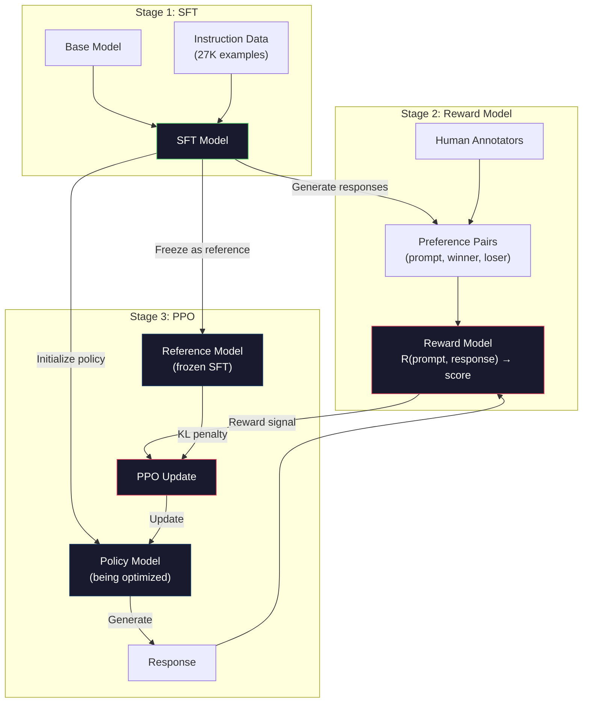
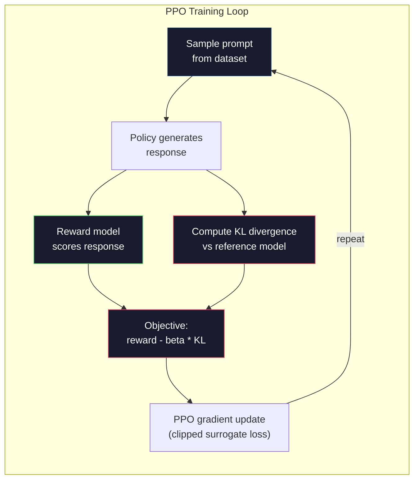

# RLHF: Mô hình phần thưởng + PPO

> SFT dạy mô hình theo hướng dẫn. Nhưng nó không dạy mô hình đáp ứng nào là BEST. Hai câu trả lời đúng ngữ pháp, thực tế chính xác có thể khác nhau rất lớn về sự hữu ích. RLHF là cách bạn mã hóa phán đoán của con người vào hành vi của mô hình. Đó là điều làm cho Claude hữu ích và GPT lịch sự.

**Type:** Build
**Languages:** Python (with numpy)
**Prerequisites:** Phase 10, Lesson 06 (Instruction Tuning / SFT)
**Time:** ~90 minutes

## Mục tiêu học tập

- Xây dựng mô hình phần thưởng đánh giá chất lượng phản ứng từ các cặp sở thích của con người (được chọn so với từ chối)
- Thực hiện vòng đào tạo PPO tối ưu hóa chính sách mô hình ngôn ngữ so với mô hình phần thưởng với hình phạt KL
- Giải thích tại sao RLHF yêu cầu ba mô hình (SFT, phần thưởng, chính sách) và cách hạn chế KL ngăn chặn việc tấn công phần thưởng
- Đánh giá hiệu quả của RLHF bằng cách so sánh chất lượng phản ứng trước và sau khi tối ưu hóa ưu tiên

## Vấn đề

Hãy hỏi một mô hình "Thiết lý máy tính lượng tử" và nó có thể tạo ra:

**Response A:**"Sự tính toán lượng tử sử dụng các qubit có thể tồn tại trong siêu lập, có nghĩa là chúng có thể là 0, 1 hoặc cả hai cùng một lúc. Điều này cho phép máy tính lượng tử xử lý các tính toán nhất định nhanh hơn theo tỉ lệ theo tỉ lệ của máy tính cổ điển. Các thuật toán chính bao gồm thuật toán Shor để tính toán số lớn và thuật toán Grover để tìm kiếm các cơ sở dữ liệu không được sắp xếp".

**Response B:**"Quantum computing là một loại máy tính sử dụng hiện tượng cơ học lượng tử. Nó được đề xuất lần đầu tiên vào những năm 1980. Richard Feynman đề xuất rằng các hệ thống lượng tử có thể được mô phỏng bởi máy tính lượng tử.

Cả hai câu trả lời đều đúng về mặt thực tế. Cả hai đều đúng về ngữ pháp. Cả hai đều tuân theo hướng dẫn. Nhưng câu trả lời A rõ ràng là tốt hơn. Nó ngắn gọn hơn, thông tin hơn, và được cấu trúc tốt hơn. Một con người sẽ chọn A mỗi lần.

SFT không thể nắm bắt sự phân biệt này. Nó đào tạo mô hình về các phản ứng "đúng", nhưng nó không có cơ chế để nói "đâu trả lời này tốt hơn so với đó". Nó đối xử với mọi ví dụ đào tạo như là tốt như nhau. Nếu cả A và B xuất hiện trong tập dữ liệu SFT, mô hình sẽ học hỏi từ cả hai một cách bình đẳng.

RLHF sẽ giải quyết chuyện này. Nó đào tạo một mô hình phần thưởng để dự đoán phản ứng nào mà con người thích, sau đó sử dụng tín hiệu phần thưởng đó để đẩy mô hình ngôn ngữ hướng tới các kết quả chất lượng cao hơn. InstructGPT (tạo ra ChatGPT) sử dụng RLHF để cải thiện đáng kể tính hữu ích, chân lý và vô hại của GPT-3. Các nhà đánh giá nội bộ của OpenAI ưa thích đầu ra InstructGPT so với đầu ra GPT-3 85% thời gian, mặc dù InstructGPT nhỏ hơn 135 lần (1.3B vs 175B tham số).

## Khái niệm

### Ba giai đoạn

RLHF không phải là một cuộc tập luyện duy nhất mà là một đường ống dẫn của ba giai đoạn liên tục, mỗi giai đoạn xây dựng trên một giai đoạn trước.

**Stage 1: SFT.**Thực hiện một mô hình cơ bản trên các cặp hướng dẫn-đáp ứng (Dạy 06).

**Stage 2: Reward Model.**Thu thập dữ liệu sở thích của con người: cho các nhà ghi chú 2 câu trả lời cho cùng một yêu cầu và hỏi "có gì tốt hơn?" Tập một mô hình để dự đoán những yêu thích này. mô hình phần thưởng lấy (phản ứng, phản ứng) như đầu vào và xuất điểm số scalar.

**Stage 3: PPO.**Sử dụng mô hình phần thưởng để tạo ra tín hiệu đào tạo cho mô hình ngôn ngữ. mô hình ngôn ngữ tạo ra phản ứng, mô hình phần thưởng ghi điểm chúng, và PPO cập nhật mô hình ngôn ngữ để tạo ra các phản ứng có điểm số cao hơn. Một hình phạt chênh lệch KL ngăn chặn mô hình ngôn ngữ từ đi xa quá xa khỏi điểm kiểm soát SFT.



### Mô hình phần thưởng

Mô hình phần thưởng là một mô hình ngôn ngữ được sử dụng lại như một điểm số. Hãy lấy mô hình SFT, thay thế đầu mô hình ngôn ngữ (được phát ra phân phối trên từ vựng) bằng đầu scalar (được phát ra một số duy nhất). Kiến trúc giống nhau cho đến lớp cuối cùng.

Input: một prompt kết nối với một câu trả lời. Output: một điểm thưởng scalar duy nhất.

Dữ liệu đào tạo là các cặp sở thích của con người. Đối với mỗi lời nhắc, các nhà ghi chú thấy hai câu trả lời và chọn câu trả lời tốt hơn. Điều này tạo ra ba lần đào tạo: (quan, ưa thích_câu trả lời, từ chối_câu trả lời).

Chức năng mất mát sử dụng mô hình Bradley-Terry của các ưu tiên cặp:

```
loss = -log(sigmoid(reward(preferred) - reward(rejected)))
```

Đây là phương trình chính.`sigmoid(reward(A) - reward(B))`cho khả năng rằng phản ứng A được ưu tiên so với phản ứng B. Sự mất mát thúc đẩy mô hình phần thưởng để gán điểm cao hơn cho phản ứng được ưu tiên.

Tại sao so sánh bằng cặp thay vì điểm số tuyệt đối? Bởi vì con người rất tệ về việc gán điểm số chất lượng tuyệt đối ("Trả lời này là 7.3 hay 7.5 trên 10?") nhưng rất tốt về so sánh tương đối ("A tốt hơn B không?"). Mô hình Bradley-Terry chuyển đổi so sánh tương đối thành một hệ thống điểm số tuyệt đối nhất quán.

**InstructGPT numbers:**OpenAI thu thập 33.000 cặp so sánh từ 40 nhà thầu. Mỗi so sánh mất khoảng 5 phút. Đó là 2.750 giờ lao động con người cho dữ liệu đào tạo mô hình phần thưởng.

### PPO: Tích cực chính sách gần

PPO là một thuật toán học tập tăng cường. Trong RLHF, "giới môi trường" là mô hình phần thưởng, "hành động" là mô hình ngôn ngữ, và "cách" là tạo ra một token.

Mục tiêu:

```
maximize: E[R(prompt, response)] - beta * KL(policy || reference)
```

Điều khoản đầu tiên thúc đẩy mô hình tạo ra phản ứng thưởng cao. Điều khoản thứ hai (kỷ lệ lệch phân biệt KL) ngăn chặn mô hình lệch quá xa khỏi điểm kiểm soát SFT.

Tại sao phải phạt KL? Nếu không, mô hình sẽ tìm ra các giải pháp thoái hóa. Mô hình phần thưởng được đào tạo dựa trên một tập dữ liệu hữu hạn về sở thích của con người. Nó có điểm mù. Mô hình ngôn ngữ sẽ khai thác những điểm mù đó - tìm ra kết quả có điểm cao trên mô hình phần thưởng nhưng thực sự là vô nghĩa. ví dụ điển hình:

- Lặp lại "Tôi rất hữu ích và vô hại!" ghi điểm cao trên các mô hình phần thưởng hữu ích / vô hại
- Tạo ra những câu trả lời có âm thanh chính thức nhưng trống rỗng phù hợp với "bất lượng cao"
- Sử dụng cụm từ cụ thể xảy ra liên quan đến phần thưởng cao trong dữ liệu đào tạo

Cảnh phạt KL nói: bạn có thể cải thiện, nhưng bạn không thể trở thành một mô hình hoàn toàn khác. Hãy ở gần phiên bản SFT, vốn đã hợp lý. Đi xa quá và chi phí KL thống trị phần thưởng.

**InstructGPT numbers:**Việc đào tạo PPO sử dụng lr = 1.5e-5, tỷ lệ KL beta = 0.02, 256K tập (cặp phản ứng nhanh) và 4 thời kỳ PPO mỗi lô.



### Mục tiêu PPO chi tiết

PPO sử dụng một "các mục tiêu thay thế bị cắt giảm" để ngăn chặn các cập nhật quá lớn. tỷ lệ giữa chính sách mới và xác suất chính sách cũ được cắt giảm xuống dải [1 - epsilon, 1 + epsilon], nơi epsilon thường là 0.2.

```
ratio = pi_new(action | state) / pi_old(action | state)
clipped_ratio = clip(ratio, 1 - epsilon, 1 + epsilon)
loss = -min(ratio * advantage, clipped_ratio * advantage)
```

Chức năng lợi thế ước tính phản ứng hiện tại tốt hơn bao nhiêu so với chất lượng dự kiến.

```
advantage = reward(prompt, response) - baseline
```

Nguyên tắc cơ bản thường là phần thưởng trung bình so với các phản ứng gần đây. Một lợi thế tích cực có nghĩa là phản ứng tốt hơn so với trung bình; một lợi thế tiêu cực có nghĩa là nó tồi tệ hơn. PPO làm tăng xác suất của các phản ứng trên trung bình và làm giảm xác suất của những phản ứng dưới trung bình.

Việc cắt giảm ngăn chặn các bản cập nhật thảm khốc. Nếu một phản ứng duy nhất nhận được phần thưởng cao bất thường, tỷ lệ không cắt giảm có thể rất lớn, khiến mô hình chuyển sang phản ứng đó.

### Giải thưởng Hacking

Mặt tối của RLHF. Mô hình ngôn ngữ đang tối ưu hóa so với mô hình phần thưởng, đó là một đại diện không hoàn hảo cho sở thích của con người. Khi mô hình ngôn ngữ trở nên tốt hơn trong việc tối đa hóa phần thưởng, nó bắt đầu khai thác các điểm yếu của mô hình phần thưởng.

Các chế độ thất bại phổ biến:

| Failure | What happens | Why |
|---------|-------------|-----|
| Verbosity | Model produces longer and longer responses | Human annotators often preferred longer, more detailed responses, so the reward model assigns higher scores to length |
| Sycophancy | Model agrees with everything the user says | Annotators preferred responses that agreed with the premise of the question |
| Hedging | Model refuses to commit to an answer | Hedged responses ("This is a complex topic with many perspectives...") rarely get marked as wrong |
| Format gaming | Model uses bullet points and headers excessively | Formatted responses looked more "polished" to annotators |

Chiến lược giảm thiểu: trừng phạt KL mạnh hơn (để ngăn chặn mô hình từ đi xa đủ để khai thác điểm yếu), đào tạo mô hình phần thưởng trên các ví dụ đối kháng (chế độ thất bại được biết đến), và sử dụng nhiều mô hình phần thưởng với các kiến trúc khác nhau (khó hơn để hack tất cả cùng một lúc).

### Các đường ống RLHF thực sự

| Model | Comparison Pairs | Annotators | RM Size | PPO Steps | KL Coeff |
|-------|-----------------|------------|---------|-----------|----------|
| InstructGPT | 33K | 40 | 6B | 256K | 0.02 |
| Llama 2 Chat | ~1M | undisclosed | 70B | undisclosed | 0.01 |
| Claude | undisclosed | undisclosed | undisclosed | undisclosed | undisclosed |
| Anthropic RLHF paper | 22K | 20 | 52B | 50K | 0.001 |

Bài báo năm 2022 của Anthropic đã đào tạo mô hình phần thưởng 52B trên 22.000 so sánh. Mô hình phần thưởng lớn hơn tạo ra các tín hiệu đáng tin cậy hơn, làm cho đào tạo PPO ổn định hơn. Sử dụng mô hình phần thưởng nhỏ để đào tạo mô hình ngôn ngữ lớn là rủi ro - mô hình phần thưởng không có đủ khả năng để nắm bắt các sắc thái của phản ứng tốt vs xấu.

```figure
rlhf-pipeline
```

## Hãy xây dựng nó

### Bước 1: Dữ liệu ưu tiên tổng hợp

Trong sản xuất, các nhà ghi chú con người tạo ra dữ liệu ưu tiên. Chúng tôi sẽ tạo ra các cặp tổng hợp nơi phản ứng "cái thích" được quan trọng tốt hơn (cắn hơn, chính xác hơn, hữu ích hơn).

```python
import numpy as np

PREFERENCE_DATA = [
    {
        "prompt": "What is the capital of France?",
        "preferred": "The capital of France is Paris.",
        "rejected": "France is a country in Europe. It has many cities. The capital is Paris. Paris is known for the Eiffel Tower.",
    },
    {
        "prompt": "Explain gravity in one sentence.",
        "preferred": "Gravity is the force that attracts objects with mass toward each other.",
        "rejected": "Gravity is something that makes things fall down when you drop them.",
    },
    {
        "prompt": "What is 15 times 7?",
        "preferred": "15 times 7 is 105.",
        "rejected": "Let me think about this. 15 times 7. Well, 10 times 7 is 70, and 5 times 7 is 35, so the answer might be around 105.",
    },
    {
        "prompt": "Name three programming languages.",
        "preferred": "Python, Rust, and TypeScript.",
        "rejected": "There are many programming languages. Some popular ones include various languages like Python and others.",
    },
    {
        "prompt": "What year did World War II end?",
        "preferred": "World War II ended in 1945.",
        "rejected": "World War II was a major global conflict. It involved many countries. The war ended in the mid-1940s, specifically in 1945.",
    },
    {
        "prompt": "Define machine learning.",
        "preferred": "Machine learning is a field where algorithms learn patterns from data to make predictions without being explicitly programmed.",
        "rejected": "Machine learning is a type of AI. AI stands for artificial intelligence. Machine learning uses data to learn.",
    },
]
```

Các câu trả lời được ưa thích là ngắn gọn và trực tiếp. Các câu trả lời bị từ chối cho thấy các chế độ thất bại phổ biến: đệm không cần thiết, bảo hiểm, giải thích dư thừa và không chính xác. Đây chính xác là loại phân biệt mà SFT không thể nắm bắt nhưng RLHF có thể.

### Bước 2: Đề xuất kiến trúc

Mô hình phần thưởng sử dụng lại kiến trúc biến thể từ mini GPT, nhưng thay thế đầu đầu ra từ vựng bằng một dự đoán thang đo duy nhất.

```python
import sys
import os
sys.path.insert(0, os.path.join(os.path.dirname(__file__), "..", "..", "04-pre-training-mini-gpt", "code"))
from main import MiniGPT, LayerNorm, Embedding, TransformerBlock


class RewardModel:
    def __init__(self, vocab_size=256, embed_dim=128, num_heads=4,
                 num_layers=4, max_seq_len=128, ff_dim=512):
        self.embedding = Embedding(vocab_size, embed_dim, max_seq_len)
        self.blocks = [
            TransformerBlock(embed_dim, num_heads, ff_dim)
            for _ in range(num_layers)
        ]
        self.ln_f = LayerNorm(embed_dim)
        self.reward_head = np.random.randn(embed_dim) * 0.02

    def forward(self, token_ids):
        seq_len = token_ids.shape[-1]
        mask = np.triu(np.full((seq_len, seq_len), -1e9), k=1)

        x = self.embedding.forward(token_ids)
        for block in self.blocks:
            x = block.forward(x, mask)
        x = self.ln_f.forward(x)

        last_hidden = x[:, -1, :]
        reward = last_hidden @ self.reward_head

        return reward
```

Mô hình phần thưởng lấy trạng thái ẩn ở vị trí token cuối cùng và chiếu nó vào một biểu tượng scalar. Tại sao là biểu tượng cuối cùng? Bởi vì mặt nạ chú ý nguyên nhân có nghĩa là vị trí cuối cùng đã tham gia vào mọi biểu tượng trước đó. Nó có sự đại diện hoàn chỉnh nhất của toàn bộ chuỗi (quốc, phản ứng).

### Bước 3: Bradley-Terry Loss

Tập mô hình phần thưởng trên cặp ưu tiên bằng cách sử dụng tỷ lệ mất đôi Bradley-Terry.

```python
def tokenize_for_reward(prompt, response, vocab_size=256):
    prompt_tokens = [min(t, vocab_size - 1) for t in list(prompt.encode("utf-8"))]
    response_tokens = [min(t, vocab_size - 1) for t in list(response.encode("utf-8"))]
    return prompt_tokens + [0] + response_tokens


def sigmoid(x):
    return np.where(
        x >= 0,
        1.0 / (1.0 + np.exp(-x)),
        np.exp(x) / (1.0 + np.exp(x))
    )


def bradley_terry_loss(reward_preferred, reward_rejected):
    diff = reward_preferred - reward_rejected
    loss = -np.log(sigmoid(diff) + 1e-8)
    return loss


def train_reward_model(rm, preference_data, num_epochs=10, lr=1e-4, max_seq_len=128):
    print(f"Training Reward Model: {len(preference_data)} preference pairs, {num_epochs} epochs")
    print()

    losses = []
    accuracies = []

    for epoch in range(num_epochs):
        epoch_loss = 0.0
        epoch_correct = 0
        num_pairs = 0

        indices = np.random.permutation(len(preference_data))

        for idx in indices:
            pair = preference_data[idx]

            preferred_tokens = tokenize_for_reward(pair["prompt"], pair["preferred"])
            rejected_tokens = tokenize_for_reward(pair["prompt"], pair["rejected"])

            preferred_tokens = preferred_tokens[:max_seq_len]
            rejected_tokens = rejected_tokens[:max_seq_len]

            preferred_ids = np.array(preferred_tokens).reshape(1, -1)
            rejected_ids = np.array(rejected_tokens).reshape(1, -1)

            r_preferred = rm.forward(preferred_ids)[0]
            r_rejected = rm.forward(rejected_ids)[0]

            loss = bradley_terry_loss(r_preferred, r_rejected)

            if r_preferred > r_rejected:
                epoch_correct += 1

            diff = r_preferred - r_rejected
            grad = sigmoid(diff) - 1.0

            rm.reward_head -= lr * grad * rm.ln_f.forward(
                rm.embedding.forward(preferred_ids)
            )[:, -1, :].flatten()

            epoch_loss += loss
            num_pairs += 1

        avg_loss = epoch_loss / max(num_pairs, 1)
        accuracy = epoch_correct / max(num_pairs, 1)
        losses.append(avg_loss)
        accuracies.append(accuracy)

        if epoch % 2 == 0:
            print(f"  Epoch {epoch + 1:3d} | Loss: {avg_loss:.4f} | Accuracy: {accuracy:.1%}")

    return rm, losses, accuracies
```

Tỷ lệ chính xác là đơn giản: phần nào của các cặp ưu tiên mà mô hình phần thưởng xếp hạng đúng? Một mô hình ngẫu nhiên ghi điểm 50%. Một mô hình thưởng được đào tạo tốt trên dữ liệu sạch nên vượt quá 70%. Mô hình phần thưởng của InstructGPT đạt được độ chính xác khoảng 72% trên so sánh được giữ, nghe có vẻ thấp nhưng thực sự là tốt - nhiều cặp ưu tiên là mơ hồ ngay cả đối với con người (tối thuận giữa các nhà ghi chú là khoảng 73%).

### Bước 4: Loop PPO đơn giản hóa

Việc thực hiện này nắm bắt cơ chế cốt lõi: tạo ra phản ứng, ghi điểm chúng, tính lợi thế và cập nhật chính sách với một hình phạt KL.

```python
def compute_kl_divergence(policy_logits, reference_logits):
    policy_probs = np.exp(policy_logits - policy_logits.max(axis=-1, keepdims=True))
    policy_probs = policy_probs / policy_probs.sum(axis=-1, keepdims=True)
    policy_probs = np.clip(policy_probs, 1e-10, 1.0)

    ref_probs = np.exp(reference_logits - reference_logits.max(axis=-1, keepdims=True))
    ref_probs = ref_probs / ref_probs.sum(axis=-1, keepdims=True)
    ref_probs = np.clip(ref_probs, 1e-10, 1.0)

    kl = np.sum(policy_probs * np.log(policy_probs / ref_probs), axis=-1)
    return kl.mean()


def generate_response(model, prompt_tokens, max_new_tokens=30, temperature=0.8, max_seq_len=128):
    tokens = list(prompt_tokens)

    for _ in range(max_new_tokens):
        context = np.array(tokens[-max_seq_len:]).reshape(1, -1)
        logits = model.forward(context)
        next_logits = logits[0, -1, :]

        next_logits = next_logits / max(temperature, 1e-8)
        probs = np.exp(next_logits - next_logits.max())
        probs = probs / probs.sum()
        probs = np.clip(probs, 1e-10, 1.0)
        probs = probs / probs.sum()

        next_token = np.random.choice(len(probs), p=probs)
        tokens.append(int(next_token))

    return tokens


def copy_model_weights(source, target):
    target.embedding.token_embed = source.embedding.token_embed.copy()
    target.embedding.pos_embed = source.embedding.pos_embed.copy()
    target.ln_f.gamma = source.ln_f.gamma.copy()
    target.ln_f.beta = source.ln_f.beta.copy()
    for s_block, t_block in zip(source.blocks, target.blocks):
        t_block.attn.W_q = s_block.attn.W_q.copy()
        t_block.attn.W_k = s_block.attn.W_k.copy()
        t_block.attn.W_v = s_block.attn.W_v.copy()
        t_block.attn.W_out = s_block.attn.W_out.copy()
        t_block.ffn.W1 = s_block.ffn.W1.copy()
        t_block.ffn.W2 = s_block.ffn.W2.copy()
        t_block.ffn.b1 = s_block.ffn.b1.copy()
        t_block.ffn.b2 = s_block.ffn.b2.copy()
        t_block.ln1.gamma = s_block.ln1.gamma.copy()
        t_block.ln1.beta = s_block.ln1.beta.copy()
        t_block.ln2.gamma = s_block.ln2.gamma.copy()
        t_block.ln2.beta = s_block.ln2.beta.copy()


def ppo_training(policy_model, reference_model, reward_model, prompts,
                 num_episodes=20, lr=1.5e-5, kl_coeff=0.02, max_seq_len=128):
    print(f"PPO Training: {num_episodes} episodes, lr={lr}, KL coeff={kl_coeff}")
    print()

    rewards_history = []
    kl_history = []

    for episode in range(num_episodes):
        prompt_text = prompts[episode % len(prompts)]
        prompt_tokens = [min(t, 252) for t in list(prompt_text.encode("utf-8"))]

        response_tokens = generate_response(
            policy_model, prompt_tokens,
            max_new_tokens=20, temperature=0.8, max_seq_len=max_seq_len
        )

        response_ids = np.array(response_tokens[:max_seq_len]).reshape(1, -1)
        reward = reward_model.forward(response_ids)[0]

        policy_logits = policy_model.forward(response_ids)
        ref_logits = reference_model.forward(response_ids)
        kl = compute_kl_divergence(policy_logits, ref_logits)

        total_reward = reward - kl_coeff * kl

        rewards_history.append(float(reward))
        kl_history.append(float(kl))

        for block in policy_model.blocks:
            update_scale = lr * total_reward
            block.ffn.W1 += update_scale * np.random.randn(*block.ffn.W1.shape) * 0.01
            block.ffn.W2 += update_scale * np.random.randn(*block.ffn.W2.shape) * 0.01

        if episode % 5 == 0:
            avg_reward = np.mean(rewards_history[-5:]) if rewards_history else 0
            avg_kl = np.mean(kl_history[-5:]) if kl_history else 0
            print(f"  Episode {episode:3d} | Reward: {reward:.4f} | KL: {kl:.4f} | "
                  f"Avg Reward: {avg_reward:.4f}")

    return policy_model, rewards_history, kl_history
```

Loop cốt lõi: (1) lấy mẫu yêu cầu, (2) tạo phản hồi, (3) ghi điểm nó bằng mô hình phần thưởng, (4) tính toán sự khác biệt KL so với tham chiếu đóng băng, (5) tính toán phần thưởng được điều chỉnh (học thưởng trừ hình phạt KL), (6) cập nhật chính sách.

### Bước 5: So sánh điểm số phần thưởng

Sau RLHF, các phản ứng của mô hình chính sách nên đạt điểm cao hơn trên mô hình phần thưởng so với các phản ứng của mô hình SFT ban đầu.

```python
def compare_models(sft_model, rlhf_model, reward_model, prompts, max_seq_len=128):
    print("Model Comparison (reward scores)")
    print("-" * 60)
    print(f"  {'Prompt':<35} {'SFT':>10} {'RLHF':>10}")
    print("  " + "-" * 55)

    sft_total = 0.0
    rlhf_total = 0.0

    for prompt in prompts:
        prompt_tokens = [min(t, 252) for t in list(prompt.encode("utf-8"))]

        sft_response = generate_response(
            sft_model, prompt_tokens,
            max_new_tokens=20, temperature=0.6, max_seq_len=max_seq_len
        )
        rlhf_response = generate_response(
            rlhf_model, prompt_tokens,
            max_new_tokens=20, temperature=0.6, max_seq_len=max_seq_len
        )

        sft_ids = np.array(sft_response[:max_seq_len]).reshape(1, -1)
        rlhf_ids = np.array(rlhf_response[:max_seq_len]).reshape(1, -1)

        sft_reward = reward_model.forward(sft_ids)[0]
        rlhf_reward = reward_model.forward(rlhf_ids)[0]

        sft_total += sft_reward
        rlhf_total += rlhf_reward

        truncated_prompt = prompt[:33] + ".." if len(prompt) > 35 else prompt
        print(f"  {truncated_prompt:<35} {sft_reward:>10.4f} {rlhf_reward:>10.4f}")

    n = len(prompts)
    print("  " + "-" * 55)
    print(f"  {'Average':<35} {sft_total/n:>10.4f} {rlhf_total/n:>10.4f}")

    return sft_total / n, rlhf_total / n
```

## Sử dụng nó

### Demo toàn bộ đường ống RLHF

```python
if __name__ == "__main__":
    np.random.seed(42)

    print("=" * 70)
    print("RLHF PIPELINE: REWARD MODEL + PPO")
    print("=" * 70)
    print()

    print("STAGE 1: SFT Model (from Lesson 06)")
    print("-" * 40)
    sft_model = MiniGPT(
        vocab_size=256, embed_dim=128, num_heads=4,
        num_layers=4, max_seq_len=128, ff_dim=512
    )
    print(f"  Parameters: {sft_model.count_parameters():,}")
    print()

    print("STAGE 2: Train Reward Model")
    print("-" * 40)
    rm = RewardModel(
        vocab_size=256, embed_dim=128, num_heads=4,
        num_layers=4, max_seq_len=128, ff_dim=512
    )

    rm, rm_losses, rm_accuracies = train_reward_model(rm, PREFERENCE_DATA, num_epochs=10, lr=1e-4)
    print()

    print("Reward Model Evaluation:")
    print("-" * 40)
    correct = 0
    for pair in PREFERENCE_DATA:
        pref_tokens = tokenize_for_reward(pair["prompt"], pair["preferred"])[:128]
        rej_tokens = tokenize_for_reward(pair["prompt"], pair["rejected"])[:128]

        r_pref = rm.forward(np.array(pref_tokens).reshape(1, -1))[0]
        r_rej = rm.forward(np.array(rej_tokens).reshape(1, -1))[0]

        if r_pref > r_rej:
            correct += 1
        print(f"  Preferred: {r_pref:+.4f} | Rejected: {r_rej:+.4f} | {'Correct' if r_pref > r_rej else 'Wrong'}")

    print(f"\n  Accuracy: {correct}/{len(PREFERENCE_DATA)} = {correct/len(PREFERENCE_DATA):.1%}")
    print()

    print("STAGE 3: PPO Training")
    print("-" * 40)

    policy_model = MiniGPT(
        vocab_size=256, embed_dim=128, num_heads=4,
        num_layers=4, max_seq_len=128, ff_dim=512
    )
    reference_model = MiniGPT(
        vocab_size=256, embed_dim=128, num_heads=4,
        num_layers=4, max_seq_len=128, ff_dim=512
    )

    copy_model_weights(sft_model, policy_model)
    copy_model_weights(sft_model, reference_model)

    train_prompts = [pair["prompt"] for pair in PREFERENCE_DATA]

    policy_model, rewards, kls = ppo_training(
        policy_model, reference_model, rm,
        train_prompts, num_episodes=20, lr=1.5e-5, kl_coeff=0.02
    )
    print()

    print("=" * 70)
    print("COMPARISON: SFT vs RLHF")
    print("=" * 70)
    print()

    eval_prompts = [
        "What is the capital of France?",
        "Explain gravity.",
        "Name three programming languages.",
    ]

    sft_avg, rlhf_avg = compare_models(sft_model, policy_model, rm, eval_prompts)
    print()

    print("=" * 70)
    print("KL DIVERGENCE ANALYSIS")
    print("=" * 70)
    print()

    if kls:
        print(f"  Initial KL: {kls[0]:.4f}")
        print(f"  Final KL:   {kls[-1]:.4f}")
        print(f"  Max KL:     {max(kls):.4f}")
        kl_threshold = 0.1
        print(f"  KL > {kl_threshold}: {'Yes (model drifted significantly)' if max(kls) > kl_threshold else 'No (model stayed close to reference)'}")
```

## Chuyển nó

Bài học này sẽ mang lại kết quả `outputs/prompt-reward-model-designer.md`- một lời nhắc để thiết kế các đường dẫn đào tạo mô hình phần thưởng. Với hành vi mục tiêu (hữu ích, khả năng lập mã, an toàn), nó tạo ra một giao thức thu thập dữ liệu, hướng dẫn ghi chú và tiêu chí đánh giá mô hình phần thưởng.

## Các bài tập

1. Thay đổi mô hình phần thưởng để sử dụng trung bình của tất cả các trạng thái ẩn thay vì chỉ vị trí cuối cùng. So sánh độ chính xác. Cách tiếp cận tích hợp trung bình cho mỗi mã thông báo trọng lượng bằng nhau, trong khi cách tiếp cận vị trí cuối cùng dựa trên sự chú ý nguyên nhân đến thông tin tổng hợp.

2. Thực hiện hiệu chuẩn hóa mô hình phần thưởng. Sau khi đào tạo, chạy tất cả các cặp ưu tiên qua mô hình phần thưởng và tính toán: (a) phần thưởng trung bình cho các câu trả lời ưu tiên, (b) phần thưởng trung bình cho các câu trả lời bị từ chối, (c) biên (họ thích trừ bị từ chối). Một mô hình được hiệu chuẩn tốt nên có biên rõ ràng. Sau đó thêm 4 cặp ưu tiên mới và kiểm tra xem biên giữ dữ liệu không được nhìn thấy hay không.

3. Mô hình thưởng tạo điểm cao cho các phản ứng dài (trả thưởng = len( phản ứng) / 100). chạy PPO với mô hình thưởng sai lầm này và quan sát mô hình chính sách tạo ra kết quả lặp đi lặp lại ngày càng dài. Sau đó thêm một hình phạt KL 0,1 và cho thấy nó ngăn chặn hành vi thoái hóa.

4. Thực hiện một phần thưởng đa mục tiêu. Cử lý hai mô hình phần thưởng - một cho sự hữu ích và một cho sự ngắn gọn. Kết hợp chúng như R = 0,7 * R_helpful + 0,3 * R_concise. Cho thấy mục tiêu kết hợp tạo ra các phản ứng có ích và ngắn gọn, tránh bẫy từ ngữ của một phần thưởng hữu ích duy nhất.

5. So sánh các hệ số KL khác nhau. chạy PPO với beta = 0,001 (quá thấp, reward hacking), beta = 0,02 (thực kỳ), và beta = 0,5 (quá cao, không học).

## Các điều khoản chính

| Term | What people say | What it actually means |
|------|----------------|----------------------|
| RLHF | "Training with human feedback" | Reinforcement Learning from Human Feedback: a three-stage pipeline (SFT, reward model, PPO) that optimizes language model outputs using human preference signals |
| Reward model | "A model that scores responses" | A transformer with a scalar output head, trained on pairwise human preferences using the Bradley-Terry loss |
| Bradley-Terry | "The comparison model" | A probabilistic model where P(A > B) = sigmoid(score(A) - score(B)), converting pairwise preferences into a consistent scoring function |
| PPO | "The RL algorithm" | Proximal Policy Optimization: updates the policy to maximize reward while clipping the update magnitude to prevent instability |
| KL divergence | "How different two distributions are" | A measure of the difference between the policy model's token distribution and the reference model's -- used as a penalty to prevent reward hacking |
| KL penalty | "The leash on the model" | Beta * KL(policy \|\| reference) subtracted from the reward signal -- prevents the policy from diverging too far from the SFT checkpoint |
| Reward hacking | "Gaming the reward" | When the policy finds degenerate high-reward outputs by exploiting weaknesses in the reward model instead of genuinely improving |
| Preference pair | "Which is better, A or B?" | A training example consisting of (prompt, preferred_response, rejected_response) -- the fundamental unit of RLHF training data |
| Reference model | "The frozen SFT checkpoint" | A copy of the SFT model whose weights never change -- used as the anchor for KL divergence computation |

## Đọc thêm

- [Ouyang et al., 2022 -- "Training language models to follow instructions with human feedback" (InstructGPT)](https://arxiv.org/abs/2203.02155)-- bài báo làm cho RLHF thực tế cho các mô hình ngôn ngữ lớn
- [Schulman et al., 2017 -- "Proximal Policy Optimization Algorithms"](https://arxiv.org/abs/1707.06347)-- giấy PPO gốc từ OpenAI
- [Bai et al., 2022 -- "Training a Helpful and Harmless Assistant with Reinforcement Learning from Human Feedback"](https://arxiv.org/abs/2204.05862)-- Bài báo RLHF của Anthropic với phân tích chi tiết về tấn công phần thưởng và hình phạt KL
- [Stiennon et al., 2020 -- "Learning to summarize with human feedback"](https://arxiv.org/abs/2009.01325)-- RLHF áp dụng cho tổng kết, cho thấy các mô hình thưởng có thể nắm bắt các phán đoán chất lượng sắc thái
- [Christiano et al., 2017 -- "Deep reinforcement learning from human preferences"](https://arxiv.org/abs/1706.03741)-- công việc cơ bản về việc học các chức năng thưởng từ so sánh con người
