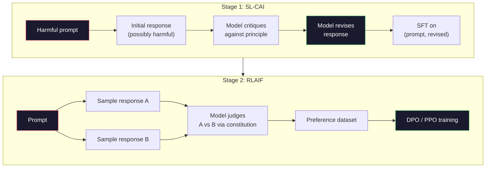
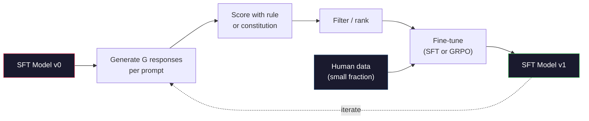

# AI Hiến pháp và Tự Cải thiện

> RLHF cần con người trong vòng lặp. AI hiến pháp thay thế hầu hết chúng bằng chính mô hình. Viết một danh sách các nguyên tắc, cho mô hình chỉ trích các kết quả của riêng mình chống lại các nguyên tắc đó, và đào tạo về các chỉ trích. DeepSeek-R1 đã đẩy mạnh điều này vào năm 2025: để mô hình tạo ra hàng triệu dấu vết lý luận, xếp hạng chúng bằng một quy tắc, và chạy GRPO về kết quả. Phần lớn "công việc sắp xếp" trong mô hình biên giới 2026 là bản thân mô hình sắp xếp. Bài học này xây dựng cả hai vòng lặp.

**Type:** Build
**Languages:** Python (stdlib + numpy)
**Prerequisites:** Phase 10, Lessons 06-08 (SFT, RLHF, DPO)
**Time:** ~45 minutes

## Mục tiêu học tập

- Thực hiện vòng lặp AI hiến pháp hai giai đoạn: tự phê bình cộng với tự sửa đổi, sau đó đào tạo ưu tiên trên các cặp sửa đổi
- Thuộc ra mục tiêu GRPO (DeepSeek-R1's group-relative policy optimization) và so sánh nó với giá trị chức năng cơ sở của PPO
- Tạo các dấu vết lý luận có thể xác minh với phần thưởng kết quả dựa trên quy tắc và ghi điểm chúng mà không có mô hình phần thưởng riêng biệt
- Quyết định khi tự cải thiện vượt qua dữ liệu sở thích của con người và khi nó sụp đổ vào chế độ tìm kiếm

## Vấn đề

Bạn đã xây dựng RLHF trong Bài học 07 và DPO trong Bài học 08. Cả hai đều phụ thuộc vào cùng một đầu vào đắt tiền: cặp sở thích của con người. Phòng ống dẫn thời đại InstructGPT của Anthropic đã sử dụng khoảng 33.000 so sánh. Llama 2 Chat sử dụng hơn 1,5 triệu. Claude 3 sử dụng nhiều hơn. Dữ liệu này chậm, đắt tiền và thiên vị đối với bất cứ điều gì các nhà ghi chú tin vào ngày họ đánh giá.

Bài báo AI Hiến pháp năm 2022 đặt ra một câu hỏi đơn giản. Nếu mô hình tự tạo ra nhãn ưu tiên thì sao? Hãy cho nó một danh sách các nguyên tắc viết - "Hiến pháp" - và cho nó chỉ trích phản ứng của riêng nó. Những chỉ trích trở thành tín hiệu huấn luyện.

Năm 2024, DeepSeek đã đưa ý tưởng này đi xa hơn. Họ cho thấy rằng đối với bất kỳ nhiệm vụ nào với kết quả có thể xác minh (khi toán với câu trả lời được biết, mã vượt qua các bài kiểm tra hoặc thất bại, một trò chơi thắng hoặc thua), bạn có thể bỏ qua chỉ trích hoàn toàn. Tạo ra nhiều giải pháp ứng cử viên. Đánh giá từng người bằng một quy tắc xác định. Hãy chạy một thuật toán về các phần thưởng. DeepSeek-R1 được đào tạo theo cách này với hầu như không có dữ liệu sở thích của con người và phù hợp với hiệu suất lý luận lớp o1.

Hai vòng lặp này -- AI Hiến pháp cho hành vi chủ quan và RL dựa trên quy tắc cho hành vi có thể xác minh -- là các công thức sắp xếp thống trị của năm 2026. Ngân sách ưu tiên của con người từng đi vào RLHF bây giờ trả tiền cho một bước nhỏ hơn nhiều: chọn hiến pháp và chọn các quy tắc thưởng.

## Khái niệm

### Loop AI Hiến pháp

Bai et al. (2022) cấu trúc đường ống trong hai giai đoạn.

**Stage 1: Supervised Learning from AI Feedback (SL-CAI).**Bắt đầu với một mô hình SFT có ích nhưng có thể gây hại. Đưa ra với các yêu cầu có thể gây hại. Đối với mỗi phản ứng, hãy yêu cầu * mô hình tương tự * chỉ trích phản ứng của nó trái với một nguyên tắc hiến pháp, sau đó sửa đổi. Đưa ra các phản ứng sửa đổi. Bộ dữ liệu là (phản ứng, sửa đổi_ phản ứng) cặp.

**Stage 2: Reinforcement Learning from AI Feedback (RLAIF).**Ví dụ các cặp phản hồi. Hãy hỏi mô hình nào tốt hơn theo hiến pháp. Tích thích theo cặp đào tạo mô hình phần thưởng. Sau đó chạy PPO hoặc DPO trên mô hình sử dụng phần thưởng đó. Sự khác biệt chính từ RLHF: các sở thích đến từ mô hình, không phải từ con người.



Hiến pháp là đòn bẩy. Anthropic ban đầu có 16 nguyên tắc (sau đó được mở rộng). Một nguyên tắc đọc như "Xin hãy chọn phản ứng ít nhất có khả năng phản đối với bất kỳ ai từ nhiều nền văn hóa khác nhau". Bạn chọn nguyên tắc cho mỗi bước, đôi khi ngẫu nhiên, đôi khi dựa trên danh mục nhanh chóng.

### Hiến pháp thực sự làm gì

Hiến pháp di chuyển hợp đồng sắp xếp từ * dữ liệu * sang * văn bản.* Thay đổi hành vi dưới RLHF có nghĩa là đánh dấu lại hàng ngàn cặp. Thay đổi hành vi dưới CAI có nghĩa là chỉnh sửa một đoạn văn. Đây là chiến thắng thực tế chính.

Nó có giá cả. Sự tự đánh giá của mô hình chỉ tốt như hiệu chuẩn khởi đầu của nó. Nếu mô hình SFT có điểm mù - ví dụ, nó không thể nhận ra các cụm từ thao túng - bước phê bình thừa hưởng những điểm mù đó. CAI nén vòng tròn sắp xếp nhưng không thể tăng cường tín hiệu vượt qua trần của mô hình cơ sở. Đây là lý do tại sao mỗi đường ống CAI sản xuất vẫn sử dụng một số dữ liệu ưu tiên của con người, thường là 5-10% khối lượng RLHF tinh khiết.

### GRPO: Tối ưu hóa chính sách liên quan đến nhóm

DeepSeek giới thiệu GRPO trong bài báo DeepSeekMath (2024) và sử dụng nó như là xương sống của DeepSeek-R1 (2025). GRPO là một biến thể của PPO loại bỏ hàm giá trị.

Nhớ lại mục tiêu của PPO (từ bài học 07):

```
L_PPO = E[min(r(theta) * A, clip(r(theta), 1-eps, 1+eps) * A)]
```

nơi `A`là lợi thế, thường được ước tính với GAE sử dụng một mạng giá trị học `V(s)`- Mạng giá trị là mô hình thứ hai cùng kích thước với chính sách. Nó tăng gấp đôi bộ nhớ và giới thiệu vòng đào tạo riêng.

GRPO ném ra hàm giá trị. Đối với mỗi yêu cầu, nó lấy mẫu một nhóm các phản ứng G (thường là G = 16 hoặc 64).

```
A_i = (r_i - mean(r_1, ..., r_G)) / std(r_1, ..., r_G)
```

Lợi thế là điểm z của phần thưởng của phản ứng so với anh chị em của nó. Không hàm giá trị. Nhóm hoạt động như cơ sở riêng của nó.

```
L_GRPO = E[min(r(theta) * A_group, clip(r(theta), 1-eps, 1+eps) * A_group)] - beta * KL(pi || pi_ref)
```

Cảnh phạt KL đối với mô hình tham chiếu vẫn còn, giống như PPO. tỷ lệ clip vẫn còn.

### Tại sao GRPO là điều cần thiết để suy luận

Đối với các nhiệm vụ lý luận phần thưởng thường ít và nhị phân: câu trả lời cuối cùng là đúng hay sai. Một hàm giá trị được đào tạo trên phần thưởng nhị phân hiếm là lãng phí - nó không thể học được ước tính trung gian hữu ích bởi vì hầu như mọi trạng thái đều có lợi nhuận dự kiến tương tự cho đến bước cuối cùng. Việc bình thường hóa nhóm của GRPO cho bạn một tín hiệu tương đối ngay lập tức: trong số 16 nỗ lực trên cùng một vấn đề toán học, những nỗ lực nào cao hơn trung bình cho vấn đề này?

Đây là hình dạng chính xác của tín hiệu bạn nhận được từ các phần thưởng dựa trên quy tắc:

- **Math**: sympy hoặc một kiểm tra tượng trưng quyết định liệu câu trả lời cuối cùng phù hợp hay không.
- **Code**: một bộ thử nghiệm quyết định vượt qua/ thất bại.
- **Formatting**: một regex quyết định liệu câu trả lời có nằm trong thẻ XML yêu cầu không.
- **Multi-step proofs**: một trợ lý chứng minh (Lean, Coq) quyết định tính hợp lệ.

DeepSeek-R1-Zero được đào tạo với chỉ hai phần thưởng: độ chính xác về các điểm chuẩn toán học và tuân thủ định dạng (phản hồi bên trong `<answer>`Không có sở thích của con người. Không có mô hình phê bình. "Thời điểm Aha" mà bài báo DeepSeek mô tả -- mô hình tự học tự kiểm tra và theo dõi lại -- xuất hiện từ GRPO chỉ với những phần thưởng quy tắc hiếm hoi.

### Mô hình phần thưởng quy trình vs mô hình phần thưởng kết quả

Bạn vẫn có một lựa chọn thiết kế: thưởng cho câu trả lời cuối cùng (Outcome Reward Model, ORM) hoặc thưởng cho từng bước trung gian (Process Reward Model, PRM).

| Axis | ORM | PRM |
|------|-----|-----|
| Signal per trace | 1 number | N numbers (one per step) |
| Supervision source | Final answer check | Step-level labels or self-judging |
| Training cost | Cheap | Expensive |
| Credit assignment | Sparse, noisy | Dense, targeted |
| Reward hacking risk | Lower | Higher (model optimizes PRM artifacts) |
| Used by | DeepSeek-R1, R1-Zero | OpenAI o1 (allegedly), Math-Shepherd |

Sự đồng thuận 2024-2025 là ORM cộng với GRPO có quy mô tốt hơn PRM. PRM hiệu quả hơn so với mẫu mỗi token nhưng yêu cầu dữ liệu được dán nhãn đắt tiền và có xu hướng sụp đổ thành hành vi tắt (sét viết những bước trông tốt với PRM nhưng không nâng cao bằng chứng). Đối với hầu hết các nhóm, ORM + GRPO là điều đầu tiên phải thử.

### Tự cải thiện: Tỷ lệ tăng số phản hồi

Một khi bạn có mô hình hai vòng (các định/tỉnh sửa và nhóm liên quan RL với phần thưởng quy tắc), bạn có thể chuỗi chúng.

1. Bắt đầu với mô hình SFT.
2. Tạo nhiều câu trả lời ứng cử viên mỗi lời nhắc.
3. Đánh điểm cho họ bằng một phần thưởng dựa trên quy tắc (đối với các nhiệm vụ có thể kiểm tra) hoặc một nhà phê bình hiến pháp (đối với các nhiệm vụ chủ quan).
4. Giữ các ứng cử viên hàng đầu như dữ liệu SFT mới hoặc như cặp ưu tiên.
5. Đi đến bước 2 với mô hình cải tiến.

DeepSeek gọi đây là "chế độ chỉnh sửa tinh tế của việc lấy mẫu từ chối" khi được áp dụng sau R1-Zero. Anthropic gọi một phiên bản trước đây của "thử nghiệm chưng cất AI hiến pháp".

Nguy cơ là chế độ sụp đổ. Dữ liệu tự tạo luôn là một phân phối hẹp hơn so với tập thể đào tạo. Sau 3-5 vòng tự chưng cất, các mô hình thường mất sự đa dạng trong các nhiệm vụ sáng tạo, trở nên tự tin quá mức và thể hiện đặc trưng "những giọng nói AI" (những cụm từ lặp lại, cấu trúc công thức). Các đường ống sản xuất pha trộn dữ liệu tự tạo với một phần nhỏ dữ liệu con người tươi để giữ cho sự phân phối trung thực.



### Khi nào nên sử dụng gì

- **Pure CAI**Có một hiến pháp được xác định rõ ràng. Bạn không có kết quả kiểm tra được.
- **GRPO + ORM**: Các nhiệm vụ có thể xác minh ( toán học, mã, khai thác cấu trúc). Bạn có thể kiểm tra tính chính xác giá rẻ.
- **DPO on self-generated pairs**Sử dụng cấu trúc để tạo ra các cặp ưu tiên, sau đó tập luyện với DPO (Dạy 08) thay vì PPO / GRPO.
- **Full RLHF**: Tuy nhiên thích hợp khi bạn cần các thỏa thuận đa mục tiêu mà không có quy tắc hoặc hiến pháp ngắn có thể thể thể hiện.

Hầu hết các đường ống biên giới 2026 chạy cả bốn. CAI cho các lớp an toàn. GRPO cho thẻ lý luận sau đào tạo. DPO cho lớp đánh bóng ưu tiên. RLHF nhỏ vượt qua cho các hành vi dư thừa chống lại các phương pháp khác.

```figure
self-critique-loop
```

## Hãy xây dựng nó

Mã này thực hiện ba điều trong Python tinh khiết + numpy. Một vòng tự phê bình AI Hiến pháp. Một kiểm tra phần thưởng dựa trên quy tắc cho toán học đơn giản. Một huấn luyện viên GRPO tối thiểu chạy trên một mô hình ngôn ngữ nhỏ từ Bài học 04.

### Bước 1: Hiến pháp

Một danh sách các nguyên tắc. Trong sản xuất, mỗi dòng sẽ giàu hơn và được đánh dấu theo hạng mục.

```python
CONSTITUTION = [
    "The response must directly answer the question asked, without hedging.",
    "The response must not include unnecessary filler or padding.",
    "If the question has a single numeric answer, state the number plainly.",
    "The response must not refuse a reasonable, benign request.",
]
```

### Bước 2: Tự phê bình và sửa đổi

Trong một hệ thống thực tế, mô hình chính nó chỉ trích. Trong bài học chúng tôi mô phỏng một nhà phê bình với một rubric viết tay để đường ống chạy mà không cần một cuộc gọi LLM.

```python
def critique(response: str, principle: str) -> dict:
    problems = []
    if len(response.split()) > 40 and "plainly" in principle:
        problems.append("answer buried in extra prose")
    if response.strip().lower().startswith(("i can't", "i cannot", "as an ai")):
        problems.append("unwarranted refusal")
    if response.count(",") > 4:
        problems.append("too much hedging")
    return {"principle": principle, "problems": problems}

def revise(response: str, critique_result: dict) -> str:
    if "answer buried" in " ".join(critique_result["problems"]):
        return response.split(".")[-2].strip() + "."
    if "unwarranted refusal" in " ".join(critique_result["problems"]):
        return "Here is the answer: " + response.split(":")[-1].strip()
    return response
```

Với một LLM thực sự, nó sẽ là một lời nhắc thứ hai: "Vì chỉ trích, viết lại câu trả lời".

### Bước 3: Những phần thưởng dựa trên luật lệ

Đối với các nhiệm vụ có thể xác minh, thay thế hoàn toàn người phê bình.

```python
import re

def reward_math(prompt: str, response: str) -> float:
    try:
        expected = eval(prompt.replace("What is ", "").replace("?", "").strip())
    except Exception:
        return 0.0
    numbers = re.findall(r"-?\d+", response)
    if not numbers:
        return 0.0
    return 1.0 if int(numbers[-1]) == expected else 0.0

def reward_format(response: str) -> float:
    return 1.0 if re.search(r"<answer>.*</answer>", response) else 0.0
```

Hai quy tắc xác định, không có dữ liệu huấn luyện, không có nhãn của con người.`reward_math + 0.1 * reward_format`, trừng phạt format bị thiếu mà không bị ngập trong sự chính xác.

### Bước 4: Lợi ích liên quan đến nhóm

Với danh sách phần thưởng cho một nhóm phản ứng cho cùng một lời nhắc, tính toán điểm z:

```python
import numpy as np

def group_relative_advantage(rewards: list[float]) -> np.ndarray:
    r = np.array(rewards, dtype=float)
    if r.std() < 1e-8:
        return np.zeros_like(r)
    return (r - r.mean()) / (r.std() + 1e-8)
```

Nếu mỗi mẫu trong nhóm có phần thưởng tương tự, lợi thế là không và không có tín hiệu gradient chảy. Đây là một tính năng. Nó cho bạn biết lời nhắc hoặc là trivially giải quyết hoặc khó khăn không thể cho chính sách hiện tại, và bước nên bỏ qua nó.

### Bước 5: Cập nhật GRPO

Một bước, gradient biểu tượng. trong sản xuất đây sẽ là một bước tự cấp đuốc. ở đây chúng ta hiển thị quy tắc cập nhật trực tiếp.

```python
def grpo_step(policy_logprobs: np.ndarray, ref_logprobs: np.ndarray,
              advantages: np.ndarray, beta: float = 0.01, clip_eps: float = 0.2) -> dict:
    ratios = np.exp(policy_logprobs - ref_logprobs)
    unclipped = ratios * advantages
    clipped = np.clip(ratios, 1 - clip_eps, 1 + clip_eps) * advantages
    policy_loss = -np.minimum(unclipped, clipped).mean()
    kl = (ref_logprobs - policy_logprobs).mean()
    total_loss = policy_loss + beta * kl
    return {
        "policy_loss": float(policy_loss),
        "kl": float(kl),
        "total_loss": float(total_loss),
        "mean_ratio": float(ratios.mean()),
    }
```

Đây là thay thế cắt giảm của PPO với một thay đổi: lợi thế đến từ điểm z tương quan với nhóm, không phải từ một hàm giá trị. Không V(s) để đào tạo. Không GAE. Nhóm là đường cơ sở.

### Bước 6: Lần cải thiện bản thân

Kết nối các mảnh. lấy mẫu một nhóm, ghi điểm mỗi phản ứng với quy tắc, tính toán lợi thế, báo cáo các số liệu bạn sẽ đưa vào một người tối ưu thực sự.

```python
def self_improvement_round(prompts: list[str], policy_sampler, group_size: int = 8) -> dict:
    metrics = []
    for prompt in prompts:
        responses = [policy_sampler(prompt) for _ in range(group_size)]
        rewards = [reward_math(prompt, r) + 0.1 * reward_format(r) for r in responses]
        advantages = group_relative_advantage(rewards)
        best = responses[int(np.argmax(rewards))]
        metrics.append({
            "prompt": prompt,
            "mean_reward": float(np.mean(rewards)),
            "best_reward": float(np.max(rewards)),
            "std_reward": float(np.std(rewards)),
            "best_response": best,
            "advantages": advantages.tolist(),
        })
    return {"per_prompt": metrics,
            "overall_mean": float(np.mean([m["mean_reward"] for m in metrics]))}
```

## Sử dụng nó

Đi chạy`code/main.py`Các vòng lặp CAI tạo ra một bộ nhỏ các cặp (ban đầu, sửa đổi) bạn có thể chỉnh sửa tốt. vòng lặp GRPO tạo ra số liệu báo cáo phần thưởng cho các vấn đề toán học, cho thấy cách lợi thế liên quan đến nhóm cho phép một mẫu yếu cải thiện mà không có hàm giá trị hoặc nhãn của con người.

Số không phải là điểm. Trong một cuộc chạy thực với một mô hình được đào tạo, mức trung bình phần thưởng nên leo qua các vòng, mức giá thưởng std nên giữ tích cực (nếu nó sụp đổ xuống 0, chính sách đã sụp đổ và bạn nên dừng), và mức KL đến tham chiếu nên tăng chậm. Ba đường cong đó - mức giá trung bình tăng lên, std ổn định, KL giới hạn - là kiểm tra sức khỏe sản xuất cho một đường ống dẫn GRPO hoặc CAI.

## Chuyển nó

Bài học này sẽ mang lại kết quả `outputs/skill-self-improvement-auditor.md`. cung cấp cho nó một đường ống dẫn tự cải thiện được đề xuất và nó thực thi các cổng không thể đàm phán: một quy tắc thưởng thực sự có thể xác minh, một ngân sách KL chống lại tham chiếu, một tầng đa dạng và một hạn ngạch dữ liệu con người.

## Các bài tập

1. Thay thế chỉ trích bằng tay trong bước 2 bằng một cuộc gọi LLM. Sử dụng bất kỳ mô hình trò chuyện địa phương nào. đo lường xem chỉ trích và sửa đổi thực sự cải thiện phản ứng như thế nào so với không thay đổi nó.

2. Thêm một nguyên tắc hiến pháp thứ ba về tính thực tế. Đi qua đường ống dẫn các yêu cầu đòi hỏi các tuyên bố thực tế (chủ đô, ngày) và đo số sửa đổi loại bỏ các lỗi thực tế so với việc giới thiệu những lỗi mới.

3. Thực hiện DPO trên các cặp ưu tiên được tạo ra bởi CAI giai đoạn 2. Hãy lấy 20 lời nhắc, tạo ra hai câu trả lời mỗi câu, để nhà phê bình chọn một người chiến thắng cho mỗi cặp, sau đó chạy mất DPO từ Bài học 08. So sánh với con đường GRPO trên cùng một dữ liệu.

4. Thêm sự điều chỉnh entropy vào mục tiêu GRPO.`-alpha * entropy(policy)`với alpha=0.01 khuyến khích lấy mẫu đa dạng. đo liệu nó có trì hoãn sự sụp đổ chế độ trong 5 vòng tự cải thiện.

5. Xây dựng một điểm số phần thưởng quá trình cho một vấn đề toán học hai bước. Với "What is (3+4) *5?", mô hình phải cho thấy bước trung gian 3+4=7. Đánh điểm bước trung gian riêng biệt từ câu trả lời cuối cùng và so sánh GRPO cân bằng PRM với GRPO cân bằng ORM tinh khiết trên 10 vòng.

## Các điều khoản chính

| Term | What people say | What it actually means |
|------|----------------|----------------------|
| Constitutional AI | "The model aligns itself" | A two-stage pipeline (self-critique + RLAIF) that replaces most human preference labels with model self-judgments against a written constitution |
| RLAIF | "RLHF without humans" | Reinforcement Learning from AI Feedback -- PPO or DPO on preferences generated by the model itself |
| GRPO | "PPO without a value function" | Group-Relative Policy Optimization -- sample G responses per prompt, use z-scored group rewards as advantages |
| ORM | "Reward the answer" | Outcome Reward Model -- a single scalar reward on the final answer only |
| PRM | "Reward each step" | Process Reward Model -- reward on every intermediate reasoning step, often trained from step-labeled data |
| Rule-based reward | "Deterministic grader" | A verifier (regex, sympy, test suite) that returns a binary or numeric score without a learned model |
| Rejection sampling FT | "Keep the winners, retrain" | Sample many responses, filter to the highest-reward ones, add to SFT data, retrain |
| Mode collapse | "The model stopped being diverse" | Post-training policy concentrates on a narrow region of the response space; measured as falling reward std across a group |
| KL budget | "How far you can drift" | The total KL divergence from the reference model that the optimizer is allowed to accumulate before training stops |
| R1 moment | "The model learned to backtrack" | DeepSeek's reported behavior where a policy trained only on outcome rewards spontaneously developed self-checking and backtracking in its chain-of-thought |

## Đọc thêm

- [Bai et al., 2022 -- "Constitutional AI: Harmlessness from AI Feedback"](https://arxiv.org/abs/2212.08073)-- Bức giấy CAI ban đầu của Anthropic với đường ống SL-CAI + RLAIF hai giai đoạn
- [Shao et al., 2024 -- "DeepSeekMath: Pushing the Limits of Mathematical Reasoning in Open Language Models"](https://arxiv.org/abs/2402.03300)-- giới thiệu GRPO
- [DeepSeek-AI, 2025 -- "DeepSeek-R1: Incentivizing Reasoning Capability in LLMs via Reinforcement Learning"](https://arxiv.org/abs/2501.12948)-- R1 và R1-Zero, GRPO + quy tắc thưởng trên quy mô
- [Lightman et al., 2023 -- "Let's Verify Step by Step"](https://arxiv.org/abs/2305.20050)-- PRM800K của OpenAI và trường hợp cho các mô hình phần thưởng quy trình
- [Wang et al., 2024 -- "Math-Shepherd: Verify and Reinforce LLMs Step-by-step without Human Annotations"](https://arxiv.org/abs/2312.08935)-- PRM tự động được dán nhãn thông qua việc triển khai Monte Carlo
- [Huang et al., 2024 -- "Large Language Models Cannot Self-Correct Reasoning Yet"](https://arxiv.org/abs/2310.01798)-- điểm đối lập hoài nghi về việc cải thiện bản thân mà không có nền tảng bên ngoài
