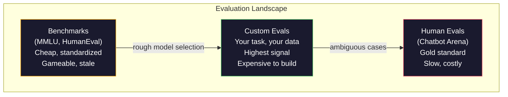
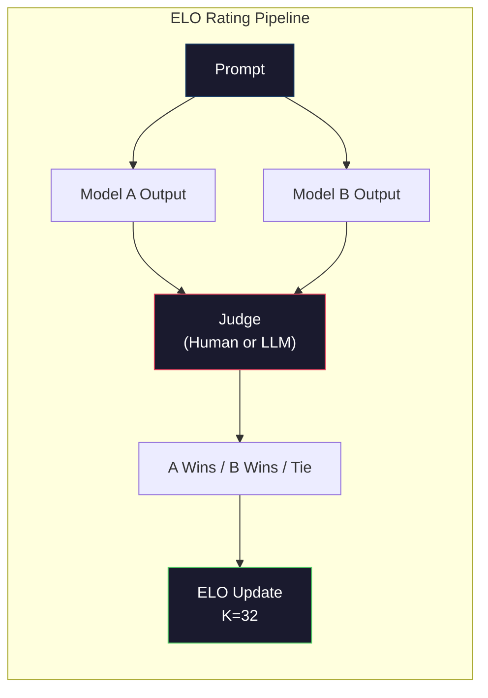

# Đánh giá: Định giá, Evals, LM Harness

> Luật Goodhart: khi một biện pháp trở thành mục tiêu, nó không còn là một biện pháp tốt nữa. Mỗi trò chơi phòng thí nghiệm biên giới đều có điểm chuẩn. Điểm MMLU tăng lên trong khi các mô hình vẫn không thể đếm đáng tin cậy số R trong "trâu tây". Đánh giá duy nhất quan trọng là đánh giá của bạn - về nhiệm vụ của bạn, với dữ liệu của bạn.

**Type:** Build
**Languages:** Python
**Prerequisites:** Phase 10, Lessons 01-05 (LLMs from Scratch)
**Time:** ~90 minutes

## Mục tiêu học tập

- Xây dựng một vòng đánh giá tùy chỉnh chạy nhiều lựa chọn và mở giới hạn tham chiếu với một mô hình ngôn ngữ
- Giải thích lý do tại sao các tiêu chuẩn chuẩn (MMLU, HumanEval) bão hòa và không phân biệt các mô hình biên giới
- Thực hiện các đánh giá cụ thể về nhiệm vụ với các số liệu thích hợp: kết hợp chính xác, F1, BLEU và điểm số LLM-as-judge
- Thiết kế một bộ đánh giá tùy chỉnh nhắm mục tiêu vào trường hợp sử dụng cụ thể của bạn thay vì chỉ dựa vào bảng xếp hạng công cộng

## Vấn đề

MMLU được xuất bản vào năm 2020 với 15.908 câu hỏi trên 57 đối tượng. Trong vòng ba năm, các mô hình biên giới đã bão hòa nó. GPT-4 đạt điểm 86,4%. Claude 3 Opus đạt điểm 86,8%. Llama 3 405B đạt điểm 88.6%. bảng xếp hạng bị nén thành một phạm vi 3 điểm nơi sự khác biệt là tiếng ồn thống kê, không phải khoảng trống khả năng thực tế.

Trong khi đó, những mô hình tương tự cũng thất bại trong những nhiệm vụ mà một đứa trẻ 10 tuổi xử lý mà không suy nghĩ. Claude 3.5 Sonnet, đạt điểm 88.7% trên MMLU, ban đầu không thể đếm chữ cái trong "dầu mọc" -- một nhiệm vụ đòi hỏi không có kiến thức thế giới và không có lý luận, chỉ là lặp lại ở cấp độ nhân vật. HumanEval thử nghiệm việc tạo mã với 164 vấn đề. Các mô hình đạt điểm 90% trên nó trong khi vẫn sản xuất mã bị hỏng trên các trường hợp cạnh bất kỳ nhà phát triển trẻ nào sẽ bắt được.

Khoảng cách giữa hiệu suất chuẩn và độ tin cậy trong thế giới thực là vấn đề trung tâm của đánh giá LLM. Các điểm chuẩn cho bạn biết mô hình hoạt động như thế nào trên điểm chuẩn. Chúng hầu như không nói gì về cách mô hình đó sẽ hoạt động trong nhiệm vụ cụ thể của bạn, với dữ liệu cụ thể của bạn, trong chế độ thất bại cụ thể của bạn. Nếu bạn đang xây dựng một bot hỗ trợ khách hàng, MMLU là không liên quan. Nếu bạn đang xây dựng một trợ lý mã, HumanEval chỉ bao gồm việc tạo cấp chức năng - nó không nói gì về việc gỡ lỗi, tái tạo hoặc giải thích mã trên các tệp.

Bạn cần đánh giá tùy chỉnh. Không phải vì các điểm chuẩn là vô dụng - chúng hữu ích cho việc lựa chọn mô hình thô sơ - nhưng bởi vì đánh giá cuối cùng phải phù hợp chính xác với điều kiện triển khai của bạn.

## Khái niệm

### Vị cảnh của Eval

Có ba loại đánh giá, mỗi loại có chi phí và chất lượng tín hiệu khác nhau.

**Benchmarks**MMLU, HumanEval, SWE-bench, MATH, ARC, HellaSwag. Bạn chạy một mô hình so với điểm chuẩn và nhận được điểm số. Lợi thế: mọi người sử dụng cùng một bài kiểm tra, vì vậy bạn có thể so sánh các mô hình. Khối thối: mô hình và dữ liệu đào tạo ngày càng ô nhiễm các điểm chuẩn này. Phòng thí nghiệm đào tạo trên dữ liệu bao gồm các câu hỏi điểm chuẩn. Điểm tăng. Khả năng có thể không.

**Custom evals**là các bộ thử nghiệm bạn xây dựng cho trường hợp sử dụng cụ thể của bạn. Bạn xác định các đầu vào, các sản phẩm dự kiến và chức năng ghi điểm. Một trình tóm tắt tài liệu pháp lý được đánh giá trên các tài liệu pháp lý. Một máy phát điện SQL được đánh giá trên sơ đồ cơ sở dữ liệu của bạn.

**Human evals**sử dụng các nhà ghi chú trả tiền để đánh giá các kết quả mô hình dựa trên các tiêu chí như hữu ích, chính xác, thông thạo và an toàn.$0.10-$2.00 mỗi phán quyết) và tốc độ (giờ đến ngày).



### Tại sao các điểm chuẩn bị bị phá vỡ

Ba cơ chế khiến điểm số chuẩn ngừng phản ánh khả năng thực tế.

**Data contamination.**Các cơ quan đào tạo cạo internet. Các câu hỏi chuẩn trực tiếp trên internet. Các mô hình nhìn thấy câu trả lời trong quá trình đào tạo. Đây không phải là gian lận theo nghĩa truyền thống - phòng thí nghiệm không cố ý bao gồm dữ liệu chuẩn. Nhưng cạo web trên quy mô web làm cho việc loại trừ gần như không thể.

**Teaching to the test.**Các phòng thí nghiệm tối ưu hóa các hỗn hợp đào tạo để hiệu suất chuẩn. Nếu 5% hỗn hợp đào tạo là lựa chọn đa dạng theo kiểu MMLU, mô hình học được định dạng và phân phối câu trả lời. MMLU là lựa chọn đa dạng bốn chiều. Các mô hình học được rằng phân phối câu trả lời tương đương trên A / B / C / D, điều này giúp ngay cả khi mô hình không biết câu trả lời.

**Saturation.**Khi mỗi mô hình biên giới đạt điểm 85-90% trên một điểm chuẩn, điểm chuẩn sẽ ngừng phân biệt đối xử. 10-15% câu hỏi còn lại có thể không rõ ràng, có nhãn sai hoặc đòi hỏi kiến thức miền mờ mờ.

### Sự bối rối: Kiểm tra sức khỏe nhanh chóng

Sự bối rối đo lường mức độ ngạc nhiên của một mô hình bởi một chuỗi các token.

```
PPL = exp(-1/N * sum(log P(token_i | context)))
```

Một độ phức tạp của 10 có nghĩa là mô hình trung bình không chắc chắn như chọn đồng đều giữa 10 tùy chọn tại mỗi vị trí mã thông báo. thấp hơn là tốt hơn. GPT-2 có độ phức tạp của ~30 trên WikiText-103. GPT-3 có được ~20. Llama 3 8B có được ~7.

Sự bối rối có thể hữu ích khi so sánh các mô hình trên cùng một bộ thử nghiệm, nhưng nó có điểm mù. Một mô hình có thể có sự bối rối thấp bằng cách dự đoán các mô hình phổ biến tốt trong khi là khủng khiếp ở các mô hình hiếm nhưng quan trọng. Nó cũng không nói gì về hướng dẫn theo dõi, lý luận hoặc tính chính xác thực tế. Sử dụng nó như một kiểm tra trí tuệ, chứ không phải là phán quyết cuối cùng.

### LLM-as-Judge

Sử dụng một mô hình mạnh để đánh giá hiệu suất của mô hình yếu hơn. Ý tưởng là đơn giản: yêu cầu GPT-4o hoặc Claude Sonnet đánh giá một phản ứng trên thang điểm 1-5 cho tính chính xác, hữu ích và an toàn. Điều này chi phí khoảng 0,01 đô la mỗi phán xét với GPT-4o-mini và tương quan đáng ngạc nhiên với phán đoán của con người - khoảng 80% đồng ý trên hầu hết các nhiệm vụ.

Một lời nhắc mơ hồ ("Tỷ lệ phản ứng này") tạo ra điểm số ồn ào. Một lời nhắc có cấu trúc với một rubric ("Score 5 nếu câu trả lời thực tế chính xác và trích dẫn một nguồn, 4 nếu chính xác nhưng không có nguồn gốc, 3 nếu một phần chính xác...") tạo ra điểm số phù hợp, có thể tái tạo.

Các chế độ thất bại: các mô hình thẩm phán hiển thị sự thiên vị về vị trí (tích ưu tiên phản ứng đầu tiên trong so sánh đôi), sự thiên vị về động từ (tích ưu tiên phản ứng dài hơn) và sự tự ưu tiên (GPT-4 tỷ lệ đầu ra GPT-4 cao hơn các đầu ra Claude tương đương).

### Đánh giá ELO từ so sánh đôi

Cách tiếp cận của Chatbot Arena. Cho thấy hai phản ứng với cùng một yêu cầu từ các mô hình khác nhau. Một người (hoặc thẩm phán LLM) chọn tốt hơn. Từ hàng ngàn so sánh này, tính toán xếp hạng ELO cho mỗi mô hình - cùng một hệ thống được sử dụng trong cờ vua.

Lợi thế của ELO: xếp hạng tương đối đáng tin cậy hơn điểm số tuyệt đối, xử lý liên kết đẹp đẽ, và hội tụ với ít so sánh hơn so với ghi điểm mỗi đầu ra độc lập.



### Các khung Eval

**lm-evaluation-harness**(EleutherAI): khung đánh giá mã nguồn mở tiêu chuẩn. hỗ trợ 200+ điểm chuẩn. chạy bất kỳ mô hình Hugging Face nào chống lại MMLU, HellaSwag, ARC, vv với một lệnh. Được sử dụng bởi bảng xếp hạng LLM mở.

**RAGAS**: khung đánh giá đặc biệt cho các đường ống RAG. đo độ trung thành (có câu trả lời phù hợp với bối cảnh được lấy?), liên quan (có bối cảnh được lấy có liên quan đến câu hỏi không?), và độ chính xác câu trả lời.

**promptfoo**: định nghĩa các trường hợp thử nghiệm trong YAML, chạy với nhiều mô hình, nhận được một báo cáo vượt qua / thất bại. hữu ích cho các yêu cầu thử nghiệm hồi quy - đảm bảo một thay đổi nhanh không phá vỡ các trường hợp thử nghiệm hiện có.

### Xây dựng các hình dạng Eval tùy chỉnh

Chỉ có một đánh giá quan trọng cho sản xuất.

1. **Define the task.**"Đâu hỏi" là quá mơ hồ. "Vì email khiếu nại của khách hàng, lấy tên sản phẩm, loại vấn đề và cảm xúc" là một nhiệm vụ bạn có thể đánh giá.

2. **Create test cases.**Minimum 50 cho một mẫu thử nghiệm, 200+ cho sản xuất. Mỗi trường hợp thử nghiệm là một cặp (input, expected_output). Bao gồm các trường hợp cạnh: inputs trống, inputs đối lập, inputs mơ hồ, inputs trong các ngôn ngữ khác.

3. **Define scoring.**Sự phù hợp chính xác cho các kết quả cấu trúc. BLEU/ROUGE cho sự tương đồng văn bản. LLM-as-judge cho chất lượng mở. F1 cho các nhiệm vụ khai thác. Kết hợp nhiều métrics với trọng lượng.

4. **Automate.**Mỗi đánh giá chạy với một lệnh, không có bước thủ công, lưu trữ kết quả trong định dạng cho phép so sánh theo thời gian.

5. **Track over time.**Một điểm đánh giá là vô nghĩa trong cách ly. Bạn cần dòng xu hướng. Điểm đánh giá đã cải thiện sau khi thay đổi prompt cuối cùng? nó đã lùi lại sau khi chuyển đổi mô hình? phiên bản đánh giá của bạn cùng với các yêu cầu của bạn.

| Eval Type | Cost per judgment | Agreement with humans | Best for |
|-----------|------------------|----------------------|----------|
| Exact match | ~$0 | 100% (when applicable) | Structured output, classification |
| BLEU/ROUGE | ~$0 | ~60% | Translation, summarization |
| LLM-as-judge | ~$0.01 | ~80% | Open-ended generation |
| Human eval | $0.10-$2.00 | N/A (is the ground truth) | Ambiguous, high-stakes tasks |

```figure
perplexity-loss
```

## Hãy xây dựng nó

### Bước 1: Một khung bình đẳng tối thiểu

Định nghĩa các trừu tượng cốt lõi. Một trường hợp eval có đầu vào, đầu ra dự kiến và một định nghĩa metadata tùy chọn. Một người ghi điểm lấy một dự đoán và tham chiếu và trả lại một điểm số giữa 0 và 1.

```python
import json
from collections import Counter

class EvalCase:
    def __init__(self, input_text, expected, metadata=None):
        self.input_text = input_text
        self.expected = expected
        self.metadata = metadata or {}

class EvalSuite:
    def __init__(self, name, cases, scorers):
        self.name = name
        self.cases = cases
        self.scorers = scorers

    def run(self, model_fn):
        results = []
        for case in self.cases:
            prediction = model_fn(case.input_text)
            scores = {}
            for scorer_name, scorer_fn in self.scorers.items():
                scores[scorer_name] = scorer_fn(prediction, case.expected)
            results.append({
                "input": case.input_text,
                "expected": case.expected,
                "prediction": prediction,
                "scores": scores,
            })
        return results
```

### Bước 2: Đánh điểm các chức năng

Xây dựng sự phù hợp chính xác, mã thông báo F1, và một điểm số giả lập LLM như thẩm phán.

```python
def exact_match(prediction, expected):
    return 1.0 if prediction.strip().lower() == expected.strip().lower() else 0.0

def token_f1(prediction, expected):
    pred_tokens = set(prediction.lower().split())
    exp_tokens = set(expected.lower().split())
    if not pred_tokens or not exp_tokens:
        return 0.0
    common = pred_tokens & exp_tokens
    precision = len(common) / len(pred_tokens)
    recall = len(common) / len(exp_tokens)
    if precision + recall == 0:
        return 0.0
    return 2 * (precision * recall) / (precision + recall)

def llm_judge_simulated(prediction, expected):
    pred_words = set(prediction.lower().split())
    exp_words = set(expected.lower().split())
    if not exp_words:
        return 0.0
    overlap = len(pred_words & exp_words) / len(exp_words)
    length_penalty = min(1.0, len(prediction) / max(len(expected), 1))
    return round(overlap * 0.7 + length_penalty * 0.3, 3)
```

### Bước 3: Hệ thống xếp hạng ELO

Thực hiện so sánh đôi với các bản cập nhật ELO. Đây chính xác là hệ thống Chatbot Arena sử dụng để xếp hạng các mô hình.

```python
class ELOTracker:
    def __init__(self, k=32, initial_rating=1500):
        self.ratings = {}
        self.k = k
        self.initial_rating = initial_rating
        self.history = []

    def _ensure_player(self, name):
        if name not in self.ratings:
            self.ratings[name] = self.initial_rating

    def expected_score(self, rating_a, rating_b):
        return 1 / (1 + 10 ** ((rating_b - rating_a) / 400))

    def record_match(self, player_a, player_b, outcome):
        self._ensure_player(player_a)
        self._ensure_player(player_b)

        ea = self.expected_score(self.ratings[player_a], self.ratings[player_b])
        eb = 1 - ea

        if outcome == "a":
            sa, sb = 1.0, 0.0
        elif outcome == "b":
            sa, sb = 0.0, 1.0
        else:
            sa, sb = 0.5, 0.5

        self.ratings[player_a] += self.k * (sa - ea)
        self.ratings[player_b] += self.k * (sb - eb)

        self.history.append({
            "a": player_a, "b": player_b,
            "outcome": outcome,
            "rating_a": round(self.ratings[player_a], 1),
            "rating_b": round(self.ratings[player_b], 1),
        })

    def leaderboard(self):
        return sorted(self.ratings.items(), key=lambda x: -x[1])
```

### Bước 4: tính toán phức tạp

Xét phức tạp bằng cách sử dụng xác suất token. thực tế bạn sẽ nhận được những điều này từ các logit của mô hình.

```python
import numpy as np

def perplexity(log_probs):
    if not log_probs:
        return float("inf")
    avg_neg_log_prob = -np.mean(log_probs)
    return float(np.exp(avg_neg_log_prob))

def token_log_probs_simulated(text, model_quality=0.8):
    np.random.seed(hash(text) % 2**31)
    tokens = text.split()
    log_probs = []
    for i, token in enumerate(tokens):
        base_prob = model_quality
        if len(token) > 8:
            base_prob *= 0.6
        if i == 0:
            base_prob *= 0.7
        prob = np.clip(base_prob + np.random.normal(0, 0.1), 0.01, 0.99)
        log_probs.append(float(np.log(prob)))
    return log_probs
```

### Bước 5: Kết quả tổng hợp

Xét số liệu tổng kết trên một evalu run: trung bình, trung bình, tỷ lệ vượt qua ở ngưỡng và phân chia theo métric.

```python
def summarize_results(results, threshold=0.8):
    all_scores = {}
    for r in results:
        for metric, score in r["scores"].items():
            all_scores.setdefault(metric, []).append(score)

    summary = {}
    for metric, scores in all_scores.items():
        arr = np.array(scores)
        summary[metric] = {
            "mean": round(float(np.mean(arr)), 3),
            "median": round(float(np.median(arr)), 3),
            "std": round(float(np.std(arr)), 3),
            "min": round(float(np.min(arr)), 3),
            "max": round(float(np.max(arr)), 3),
            "pass_rate": round(float(np.mean(arr >= threshold)), 3),
            "n": len(scores),
        }
    return summary

def print_summary(summary, suite_name="Eval"):
    print(f"\n{'=' * 60}")
    print(f"  {suite_name} Summary")
    print(f"{'=' * 60}")
    for metric, stats in summary.items():
        print(f"\n  {metric}:")
        print(f"    Mean:      {stats['mean']:.3f}")
        print(f"    Median:    {stats['median']:.3f}")
        print(f"    Std:       {stats['std']:.3f}")
        print(f"    Range:     [{stats['min']:.3f}, {stats['max']:.3f}]")
        print(f"    Pass rate: {stats['pass_rate']:.1%} (threshold >= 0.8)")
        print(f"    N:         {stats['n']}")
```

### Bước 6: Điền toàn bộ đường ống

Định nghĩa một nhiệm vụ, tạo các trường hợp thử nghiệm, mô phỏng hai mô hình, chạy các đánh giá, tính toán ELO từ so sánh cặp, và in bảng xếp hạng.

```python
def demo_model_good(prompt):
    responses = {
        "What is the capital of France?": "Paris",
        "What is 2 + 2?": "4",
        "Who wrote Hamlet?": "William Shakespeare",
        "What language is PyTorch written in?": "Python and C++",
        "What is the boiling point of water?": "100 degrees Celsius",
    }
    return responses.get(prompt, "I don't know")

def demo_model_bad(prompt):
    responses = {
        "What is the capital of France?": "Paris is the capital city of France",
        "What is 2 + 2?": "The answer is four",
        "Who wrote Hamlet?": "Shakespeare",
        "What language is PyTorch written in?": "Python",
        "What is the boiling point of water?": "212 Fahrenheit",
    }
    return responses.get(prompt, "Unknown")

cases = [
    EvalCase("What is the capital of France?", "Paris"),
    EvalCase("What is 2 + 2?", "4"),
    EvalCase("Who wrote Hamlet?", "William Shakespeare"),
    EvalCase("What language is PyTorch written in?", "Python and C++"),
    EvalCase("What is the boiling point of water?", "100 degrees Celsius"),
]

suite = EvalSuite(
    name="General Knowledge",
    cases=cases,
    scorers={
        "exact_match": exact_match,
        "token_f1": token_f1,
        "llm_judge": llm_judge_simulated,
    },
)

results_good = suite.run(demo_model_good)
results_bad = suite.run(demo_model_bad)

print_summary(summarize_results(results_good), "Model A (concise)")
print_summary(summarize_results(results_bad), "Model B (verbose)")
```

Mô hình "tốt" cho ra những câu trả lời chính xác. Mô hình "xấu" cho ra những câu nói phác thảo. Sự phù hợp chính xác trừng phạt mô hình nói phác thảo nghiêm trọng. Token F1 và LLM như thẩm phán là tha thứ hơn. Điều này minh họa lý do tại sao sự lựa chọn đo lường quan trọng: mô hình tương tự trông tuyệt vời hoặc khủng khiếp tùy thuộc vào cách bạn ghi điểm nó.

### Bước 7: Giải đấu ELO

Thực hiện so sánh đôi giữa các mô hình trên nhiều vòng.

```python
elo = ELOTracker(k=32)

for case in cases:
    pred_a = demo_model_good(case.input_text)
    pred_b = demo_model_bad(case.input_text)

    score_a = token_f1(pred_a, case.expected)
    score_b = token_f1(pred_b, case.expected)

    if score_a > score_b:
        outcome = "a"
    elif score_b > score_a:
        outcome = "b"
    else:
        outcome = "tie"

    elo.record_match("model_a_concise", "model_b_verbose", outcome)

print("\nELO Leaderboard:")
for name, rating in elo.leaderboard():
    print(f"  {name}: {rating:.0f}")
```

### Bước 8: Sự so sánh khó hiểu

So sánh sự phức tạp giữa các "mô hình" của các cấp độ chất lượng khác nhau.

```python
test_text = "The quick brown fox jumps over the lazy dog in the garden"

for quality, label in [(0.9, "Strong model"), (0.7, "Medium model"), (0.4, "Weak model")]:
    log_probs = token_log_probs_simulated(test_text, model_quality=quality)
    ppl = perplexity(log_probs)
    print(f"  {label} (quality={quality}): perplexity = {ppl:.2f}")
```

## Sử dụng nó

### Lâm đánh giá (EleutherAI)

Công cụ tiêu chuẩn để chạy các điểm chuẩn trên bất kỳ mô hình nào.

```python
# pip install lm-eval
# Command line:
# lm_eval --model hf --model_args pretrained=meta-llama/Llama-3.1-8B --tasks mmlu --batch_size 8

# Python API:
# import lm_eval
# results = lm_eval.simple_evaluate(
#     model="hf",
#     model_args="pretrained=meta-llama/Llama-3.1-8B",
#     tasks=["mmlu", "hellaswag", "arc_easy"],
#     batch_size=8,
# )
# print(results["results"])
```

### promptfoo

Định nghĩa các thử nghiệm trong YAML và chạy chống lại nhiều nhà cung cấp.

```yaml
# promptfoo.yaml
providers:
  - openai:gpt-4o-mini
  - anthropic:claude-3-haiku

prompts:
  - "Answer in one word: {{question}}"

tests:
  - vars:
      question: "What is the capital of France?"
    assert:
      - type: contains
        value: "Paris"
  - vars:
      question: "What is 2 + 2?"
    assert:
      - type: equals
        value: "4"
```

### RAGAS cho việc đánh giá RAG

```python
# pip install ragas
# from ragas import evaluate
# from ragas.metrics import faithfulness, answer_relevancy, context_precision
#
# result = evaluate(
#     dataset,
#     metrics=[faithfulness, answer_relevancy, context_precision],
# )
# print(result)
```

RAGAS đo những gì các đánh giá chung bỏ lỡ: liệu câu trả lời của mô hình có được dựa trên bối cảnh được lấy lại không, không chỉ là câu trả lời "đúng" trong bản tóm tắt.

## Chuyển nó

Bài học này sẽ mang lại kết quả `outputs/prompt-eval-designer.md`-- một lời nhắc có thể sử dụng lại thiết kế các bộ đánh giá tùy chỉnh cho bất kỳ nhiệm vụ nào. Cho nó một mô tả nhiệm vụ và nó tạo ra các trường hợp thử nghiệm, các chức năng ghi điểm và khuyến nghị ngưỡng vượt qua / thất bại.

Nó cũng sản xuất `outputs/skill-llm-evaluation.md`-- một khung quyết định để chọn đúng chiến lược đánh giá dựa trên loại nhiệm vụ, ngân sách và yêu cầu về độ trễ.

## Các bài tập

1. Thêm một điểm số "sự nhất quán" chạy cùng một đầu vào thông qua mô hình 5 lần và đo mức độ thường xuyên các đầu ra phù hợp.

2. Dễ dàng mở rộng trình theo dõi ELO để hỗ trợ nhiều chức năng thẩm phán (cái đính xác, F1, LLM-as-judge) và cân nặng chúng. So sánh bảng xếp hạng thay đổi như thế nào khi bạn cân nặng phù hợp chính xác so với F1 nặng.

3. Xây dựng một bộ đánh giá cho một nhiệm vụ cụ thể: phân loại email thành 5 loại. Xây dựng 100 trường hợp thử nghiệm với các ví dụ khác nhau bao gồm các trường hợp cạnh (những email có thể thuộc về nhiều loại, email trống, email bằng ngôn ngữ khác). đo lường hiệu suất của các "chương tự" khác nhau (thương lệ dựa trên quy tắc, phù hợp từ khóa, mô phỏng LLM).

4. Thực hiện phát hiện ô nhiễm: với một bộ câu hỏi đánh giá và một tập hợp đào tạo, kiểm tra tỷ lệ phần trăm câu hỏi đánh giá (hoặc các đoạn phrases gần) xuất hiện trong dữ liệu đào tạo.

5. Xây dựng một công cụ "model diff". Với kết quả đánh giá từ hai phiên bản mô hình, nhấn mạnh các trường hợp thử nghiệm cụ thể nào đã cải thiện, nào đã lùi lại và nào vẫn giống nhau. Đây là tương đương đánh giá của một code diff - rất cần thiết để hiểu liệu một thay đổi có giúp hay làm tổn thương.

## Các điều khoản chính

| Term | What people say | What it actually means |
|------|----------------|----------------------|
| MMLU | "The benchmark" | Massive Multitask Language Understanding -- 15,908 multiple choice questions across 57 subjects, saturated above 88% by 2025 |
| HumanEval | "Code eval" | 164 Python function-completion problems from OpenAI, tests only isolated function generation |
| SWE-bench | "Real coding eval" | 2,294 GitHub issues from 12 Python repos, measures end-to-end bug fixing including test generation |
| Perplexity | "How confused the model is" | exp(-avg(log P(token_i given context))) -- lower means the model assigns higher probability to the actual tokens |
| ELO rating | "Chess ranking for models" | A relative skill rating computed from pairwise win/loss records, used by Chatbot Arena to rank 100+ models |
| LLM-as-judge | "Using AI to grade AI" | A strong model scores a weaker model's outputs against a rubric, ~80% agreement with human judges at ~$0.01/judgment |
| Data contamination | "The model saw the test" | Training data includes benchmark questions, inflating scores without improving real capability |
| Eval suite | "A bunch of tests" | A versioned collection of (input, expected_output, scorer) triples that measure a specific capability |
| Pass rate | "What percentage it gets right" | Fraction of eval cases scoring above a threshold -- more actionable than mean score because it measures reliability |
| Chatbot Arena | "Model ranking website" | LMSYS platform with 2M+ human preference votes, producing the most trusted LLM leaderboard via ELO ratings |

## Đọc thêm

- [Hendrycks et al., 2021 -- "Measuring Massive Multitask Language Understanding"](https://arxiv.org/abs/2009.03300)-- bài báo của MMLU, vẫn là điểm chuẩn LLM được trích dẫn nhiều nhất mặc dù nó bão hòa
- [Chen et al., 2021 -- "Evaluating Large Language Models Trained on Code"](https://arxiv.org/abs/2107.03374)-- bài báo HumanEval từ OpenAI, đã thiết lập phương pháp đánh giá tạo ra mã
- [Zheng et al., 2023 -- "Judging LLM-as-a-Judge"](https://arxiv.org/abs/2306.05685)-- phân tích hệ thống sử dụng LLM để đánh giá LLM, bao gồm các kết quả về vị trí và sự thiên vị về lời nói
- [LMSYS Chatbot Arena](https://chat.lmsys.org/)-- nền tảng so sánh mô hình được crowdsourced với 2M + phiếu bầu, xếp hạng LLM thực tế đáng tin cậy nhất
