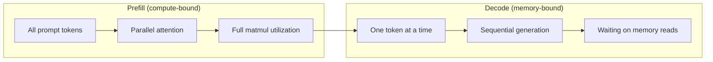
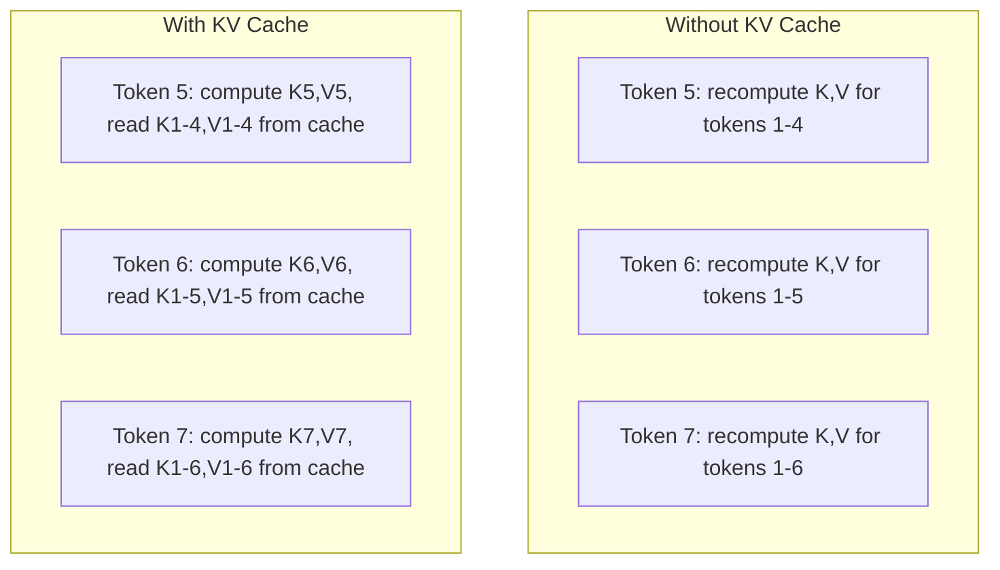
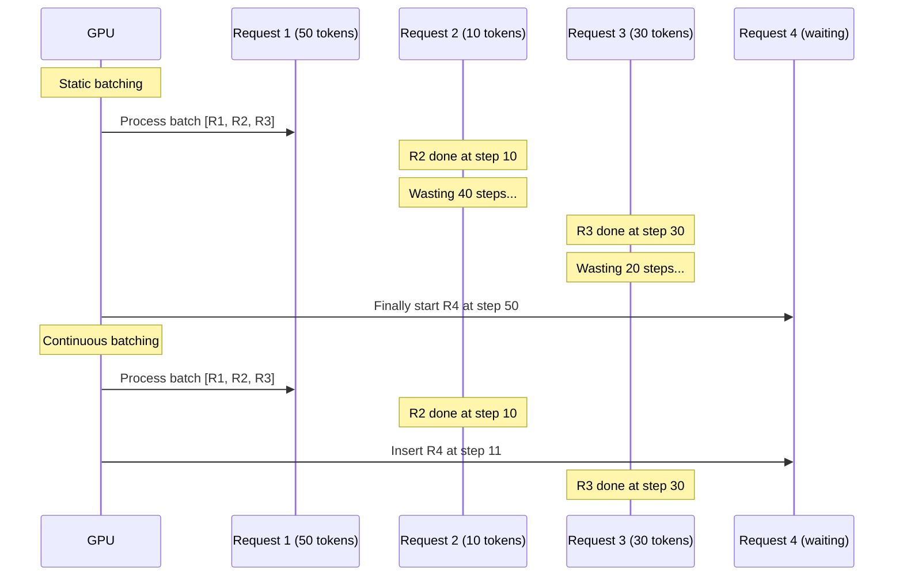
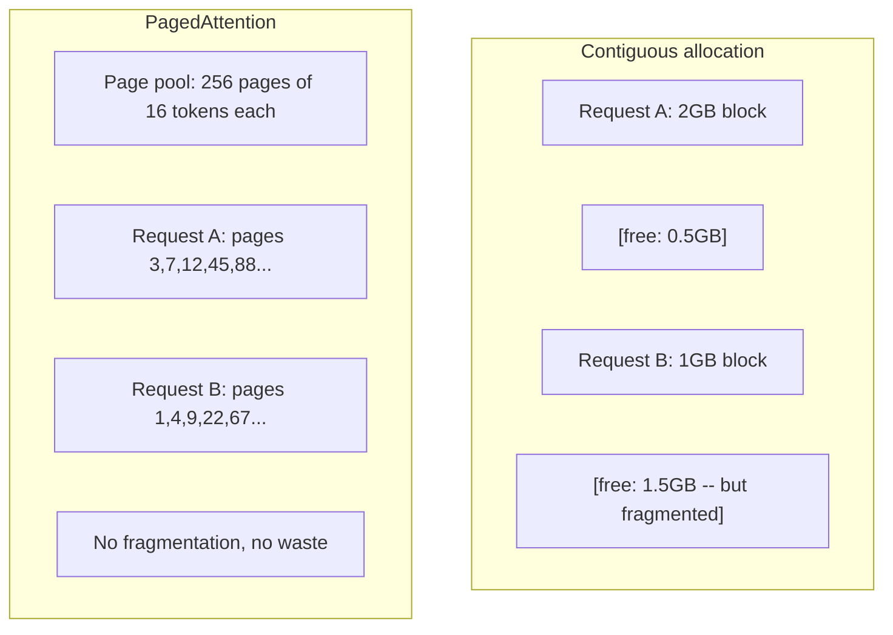
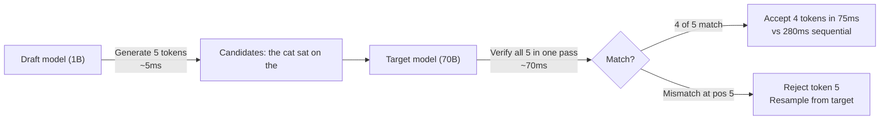

# Tích cực kết luận

> Hai giai đoạn xác định kết luận LLM. Prefill xử lý yêu cầu của bạn song song - liên kết với tính toán. Decode tạo ra token một lần - liên kết với bộ nhớ. Mỗi tối ưu hóa nhắm mục tiêu vào một hoặc cả hai.

**Type:** Build
**Languages:** Python
**Prerequisites:** Phase 10, Lessons 01-08 (Transformer architecture, attention)
**Time:** ~120 minutes

## Mục tiêu học tập

- Thực hiện KV-cache để loại bỏ tính toán dư thừa trong quá trình tạo token tự động
- Giải thích các giai đoạn prefill vs decode của suy luận LLM và lý do tại sao mỗi giai đoạn có những nút thắt khác nhau (các giai đoạn liên quan đến tính toán và bộ nhớ)
- Thực hiện các khái niệm batching liên tục và PagedAttention để tối đa hóa việc sử dụng GPU dưới các yêu cầu đồng thời
- So sánh các kỹ thuật tối ưu hóa suy luận (KV-cache, giải mã suy đoán, chú ý flash) và sự thỏa hiệp thông qua/sự trễ của chúng

## Vấn đề

Bạn triển khai Llama 3 70B trên 4xA100 GPU. Một người dùng duy nhất nhận được ~ 50 token mỗi giây. cảm thấy nhanh. Sau đó 100 người dùng đạt đến điểm cuối cùng cùng một lúc. Tạo thông qua giảm xuống còn 3 token / giây / người dùng. Tài khoản GPU 25.000 đô la / tháng của bạn phục vụ phản ứng chậm hơn so với một loại con người.

Bản thân mô hình không thay đổi giữa 1 người dùng và 100 người dùng. cùng trọng lượng, cùng kiến trúc, cùng toán học. Điều thay đổi là cách bạn lên lịch công việc. Sự suy luận ngây thơ lãng phí 90% + tính toán GPU có sẵn. Người dùng chờ token 47 giữ toàn bộ khe lô mở trong khi bộ nhớ GPU ngồi trống giữa các bộ phận. Trong khi đó, lời nhắc 2.000 token của người dùng mới có thể lấp đầy thời gian chết đó bằng tính toán hữu ích.

Đây không phải là vấn đề quy mô, mà là vấn đề lập lịch. Các kỹ thuật trong bài học này - KV cache, batching liên tục, PagedAttention, giải mã dự đoán, prefix cache - là những gì tách ra một$25k/month inference bill from a $5k/tháng một phục vụ cùng một lưu lượng truy cập.

vLLM phục vụ Llama 3 70B trên 4xA100-80GB đạt được ~ 50 token / giây / người dùng ở đồng thời thấp, và duy trì 15-25 TPS / người dùng ở 100 yêu cầu đồng thời thông qua batching liên tục và PagedAttention. Không có những tối ưu hóa này, cùng một phần cứng phục vụ 5 TPS / người dùng tại đồng thời đó. cùng GPU, cùng một mô hình, 4 lần thông suất.

## Khái niệm

### Prefill vs Decode

Mỗi yêu cầu suy luận LLM có hai giai đoạn riêng biệt.

**Prefill**xử lý toàn bộ lệnh nhập. Tất cả các token được biết đến, vì vậy sự chú ý có thể được tính toán song song trên toàn bộ chuỗi. Đây là một nhân số tử liệu lớn - lõi GPU vẫn bận rộn. Khói chai là tính toán: bao nhiêu FLOPS phần cứng của bạn có thể cung cấp mỗi giây. A100 thực hiện 312 TFLOPS (BF16).

**Decode**tạo ra các token đầu ra một lần. Mỗi token mới sẽ phục vụ tất cả các token trước đó, nhưng chỉ có một token được sản xuất cho mỗi thẻ chuyển tiếp. Các matrices trọng lượng có cùng kích thước như trong quá trình prefill, nhưng bạn đang nhân chúng bằng một vector thay vì một matrices. Các lõi GPU hoàn thành trong microsecond, sau đó chờ cho các lô trọng lượng tiếp theo đến từ bộ nhớ. Rào cản là băng thông bộ nhớ: bạn có thể truyền tải trọng lượng mô hình từ HBM đến các đơn vị tính toán nhanh như thế nào. Một chiếc A100 có băng thông 2 TB/s. Một mô hình 70B trong FP16 là 140 GB. Đọc toàn bộ mô hình một lần mất 70ms -- đó là sàn của bạn cho một bước giải mã đơn lẻ.



- **ops:byte ratio**(còn được gọi là cường độ toán học) nắm bắt sự thỏa hiệp này. Nó đo số lượng các hoạt động bạn thực hiện trên mỗi byte tải từ bộ nhớ.

```
ops:byte ratio = FLOPs per token / bytes read from memory
```

Trong khi prefill với một lô 4.096 token, bạn thực hiện ~ 4.096 hoạt động tích lũy nhân trên mỗi trọng lượng tải. tỷ lệ cao - bạn bị ràng buộc tính toán. Trong khi giải mã với kích thước lô 1, bạn thực hiện ~ 1 hoạt động trên mỗi trọng lượng tải. tỷ lệ thấp - bạn bị ràng buộc bộ nhớ.

Thông tin cơ bản: *decode là kết nối bộ nhớ bởi vì bạn đọc toàn bộ mô hình để tạo ra một token duy nhất.* Mỗi tối ưu hóa dưới đây hoặc làm giảm những gì bạn đọc, tăng số lượng token được xử lý mỗi lần đọc, hoặc tránh đọc hoàn toàn.

### KV Cache

Trong thời gian chú ý, truy vấn của mỗi token sẽ theo dõi các vector khóa và giá trị của mỗi token trước đó. Không lưu trữ, tạo token N đòi hỏi phải tính lại các dự báo khóa và giá trị cho tất cả các token trước N-1.

KV cache lưu trữ các dự báo khóa và giá trị từ tất cả các token trước đó. Khi tạo token N, bạn chỉ tính toán khóa và giá trị cho token N, sau đó kết nối chúng với K / V được lưu trữ trong cache từ token 1 đến N-1.



**Memory formula for KV cache:**

```
KV cache size = 2 * num_layers * num_kv_heads * head_dim * seq_len * bytes_per_param
```

Đối với Llama 3 70B (80 lớp, 8 đầu KV với GQA, đầu_dim=128, BF16):

```
per token: 2 * 80 * 8 * 128 * 2 bytes = 327,680 bytes = 320 KB
at 4,096 tokens: 320 KB * 4,096 = 1.28 GB
at 128K tokens: 320 KB * 131,072 = 40 GB
```

Một cuộc trò chuyện ngữ cảnh 128K duy nhất cho Llama 3 70B tiêu thụ 40 GB bộ nhớ cache KV - một nửa bộ nhớ của A100. Với 100 người dùng đồng thời với mỗi token 4K, bộ nhớ cache KV đơn độc đòi hỏi 128 GB. Đó là lý do tại sao quản lý bộ nhớ cache KV là thách thức trung tâm của tối ưu hóa suy luận.

### Lượng hàng liên tục

Các yêu cầu liên tục được xử lý cho đến khi một loạt các yêu cầu N đến, xử lý chúng cùng nhau, và chờ đến khi * tất cả * hoàn thành trước khi chấp nhận các yêu cầu mới. Nếu một yêu cầu cần 500 token và một yêu cầu khác cần 10, yêu cầu ngắn sẽ không hoạt động trong 490 bước giải mã sau khi nó hoàn thành.

Các gói liên tục (còn gọi là gói cấp lặp) đưa ra các yêu cầu mới vào gói ngay khi bất kỳ yêu cầu nào hoàn thành.



Sự cải thiện thông qua phụ thuộc vào độ dài đầu ra thay đổi bao nhiêu. Với chiều dài đồng nhất, batching liên tục phù hợp với batching tĩnh. Với chiều dài biến (ví dụ phổ biến), batching liên tục có thể cung cấp thông qua cao hơn 2-5 lần vì các khe GPU không bao giờ trống rỗng.

### PageedTrong ý

KV cache cho mỗi yêu cầu là một khối bộ nhớ liền kề. Khi các yêu cầu đến và rời đi, các mảnh bộ nhớ - giống như phân mảnh RAM trong hệ điều hành. Một yêu cầu mã thông báo 4K cần 1,28 GB liền kề. Ngay cả khi bạn có tổng số 2 GB miễn phí, bạn có thể không có 1,28 GB * liên tục*. Bạn hoặc lãng phí bộ nhớ hoặc từ chối yêu cầu.

PagedAttention (từ vLLM) áp dụng bộ nhớ ảo kiểu OS cho bộ nhớ cache KV. Thay vì phân bổ một khối liền kề mỗi yêu cầu, nó phân bổ "trang" kích thước cố định (thường mỗi thẻ là 16). Các trang có thể ở bất cứ nơi nào trong bộ nhớ GPU vật lý. Một bảng trang lập bản đồ các vị trí chuỗi logic của mỗi yêu cầu đến các vị trí trang vật lý.



PagedAttention cũng cho phép **copy-on-write**cho các trình tự trước được chia sẻ. Nếu 50 yêu cầu chia sẻ cùng một trình đơn hệ thống, các trang cache KV cho trình đơn hệ thống đó được lưu trữ một lần và được tham chiếu bởi tất cả 50 yêu cầu. Chỉ khi một yêu cầu khác nhau (tin nhắn người dùng khác nhau) nó nhận được các trang của riêng nó. Điều này làm giảm đáng kể sử dụng bộ nhớ cho các ứng dụng với các trình đơn hệ thống chia sẻ.

vLLM báo cáo lãng phí bộ nhớ gần bằng không (~ 4% so với ~ 60- 80% trong phân bổ ngây thơ) thông qua PagedAttention.

### Việc giải mã giả định

Việc giải mã chậm vì nó là theo trình tự -- bạn tạo ra một token, đưa nó lại, tạo ra token tiếp theo. Nhưng nếu bạn có thể đoán 5 token tiếp theo một cách rẻ tiền, sau đó xác minh tất cả cùng một lúc thì sao?

Việc giải mã giả định sử dụng một cái nhỏ, nhanh chóng **draft model**để tạo ra các mã thông báo ứng cử viên K.**target model**sau đó xử lý tất cả các ứng cử viên K trong một lần đi trước (có vẻ như là một prefill - song song, liên kết tính toán, hiệu quả). Nếu mô hình mục tiêu phù hợp với dự đoán của mô hình dự thảo, bạn chấp nhận tất cả các token K trong thời gian của một lần đi trước mục tiêu. Nếu nó không đồng ý ở vị trí j, bạn chấp nhận token 1 đến j-1 và loại bỏ phần còn lại.



Tốc độ tăng lên phụ thuộc vào **acceptance rate**- bao nhiêu lần dự đoán mô hình dự thảo phù hợp với mục tiêu. Đối với một Llama 3 8B dự thảo cho Llama 3 70B, tỷ lệ chấp nhận là 70-85% điển hình trên ngôn ngữ tự nhiên. Điều này dịch thành 2-3x tốc độ giải mã.

Ba cách tiếp cận để giải mã giả định:

| Method | Draft source | Acceptance rate | Overhead |
|--------|-------------|-----------------|----------|
| Draft-target (Leviathan et al.) | Separate small model | 70-85% | Draft model memory |
| EAGLE (Li et al.) | Lightweight head on target | 75-90% | ~1% extra parameters |
| N-gram lookup | Token n-gram table | 40-60% | Negligible |

**EAGLE**tập một cái đầu tự động nhỏ trên đỉnh của mô hình mục tiêu ẩn. Nó dự đoán việc nhúng token tiếp theo bằng cách sử dụng các tính năng lớp thứ hai đến cuối của mô hình mục tiêu. Bởi vì nó hoạt động trên các đại diện của mô hình mục tiêu (không phải mô hình riêng biệt), nó đạt được tỷ lệ chấp nhận cao hơn với bộ nhớ bổ sung tối thiểu. Eagle-2 thêm một cây dự thảo động điều chỉnh số lượng ứng cử viên dựa trên bối cảnh.

**N-gram speculative decoding**giữ một bảng n-gram tiếp tục từ ngữ cảnh hiện tại hoặc một cơ quan được xây dựng trước. Nếu dự thảo phù hợp với những gì đã xuất hiện trước đó trong cùng một cuộc trò chuyện (mô hình lặp lại, mã, đầu ra cấu trúc), nó phát nổ với không chi phí mạng thần kinh. Tỷ lệ chấp nhận trung bình thấp hơn nhưng chi phí cho mỗi suy đoán về cơ bản là miễn phí.

Việc giải mã suy đoán là * toán học chính xác * - phân phối đầu ra giống hệt với phân phối mô hình mục tiêu. Nó không phải là một sự ước tính. Bước xác minh đảm bảo rằng mỗi token được chấp nhận có xác suất chính xác mà mô hình mục tiêu đã gán.

### Prefix Caching

Nhiều yêu cầu chia sẻ cùng một tiền đề. Một hệ thống chatbot nhắc nhở. Một khối ngữ cảnh RAG. Một số hình ảnh ví dụ được đặt. Không có dự trữ tiền đề, mỗi yêu cầu tính lại bộ nhớ cache KV cho các token được chia sẻ này từ đầu.

Prefix caching lưu trữ bộ nhớ cache KV cho các bộ nhớ trước phổ biến và sử dụng lại nó trên các yêu cầu. Khi một yêu cầu mới đến với một bộ nhớ trước được biết đến, hệ thống sao chép (hoặc tham chiếu) các mục KV được lưu trữ trong bộ nhớ cache và chỉ tính toán KV cho hậu tố độc đáo.

Đối với một lệnh hệ thống 2.000 token được chia sẻ trên tất cả các yêu cầu, bộ nhớ cache tiền đề loại bỏ ~ 400ms của prefill mỗi yêu cầu. Với 100 yêu cầu / giây, đó tiết kiệm 40 giây tính toán GPU mỗi giây - hơn một GPU giá trị công việc.

RadixAttention của SGLang thực hiện lưu trữ tiền đề với một cây radix (trie) chỉ mục tiền đề theo nội dung token của chúng. Bất kỳ yêu cầu nào phù hợp với một tiền đề được lưu trữ sẽ được lưu trữ miễn phí. Cây cho phép kết hợp tiền đề một phần - nếu bạn chia sẻ 1.500 trong 2.000 tiền đề token với một mục được lưu trữ, bạn sử dụng lại 1.500 và tính lại chỉ 500.

### Máy động cơ trục xuất

Ba động cơ thống trị sản xuất LLM phục vụ:

| Engine | Key innovation | Best for |
|--------|---------------|----------|
| vLLM | PagedAttention, continuous batching | General-purpose serving, highest compatibility |
| SGLang | RadixAttention (prefix caching), structured generation | Multi-turn chatbots, constrained decoding |
| TensorRT-LLM | NVIDIA kernel fusion, FP8 quantization | Maximum single-GPU throughput on NVIDIA hardware |

**vLLM**là điểm khởi đầu mặc định. Nó hỗ trợ nhiều mô hình nhất, chạy trên bất kỳ nhà cung cấp GPU nào (NVIDIA, AMD, Intel), và đạt được dung lượng mạnh thông qua PagedAttention + batching liên tục. API tương thích OpenAI có nghĩa là bạn có thể bỏ nó vào thay thế cho bất kỳ cuộc gọi API OpenAI nào.

**SGLang**xây dựng trên cùng một nền tảng như vLLM nhưng thêm RadixAttention cho cache tiền đề và một ngôn ngữ cụ thể dành cho các chương trình LLM có cấu trúc. Nếu khối lượng công việc của bạn liên quan đến các cuộc trò chuyện đa lượt, sử dụng công cụ hoặc giải mã hạn chế (tạo ra JSON, sản xuất regex hướng dẫn), SGLang thường vượt trội hơn vLLM 2-5x thông qua việc tái sử dụng tiền đề.

**TensorRT-LLM**Bộ này kết hợp các mô hình thành các lõi GPU tối ưu hóa của NVIDIA. Nó hợp nhất các hoạt động (trọng tâm + tuyến tính + kích hoạt trong một lõi), sử dụng FP8 trên các GPU H100, và tích hợp với NVIDIA Triton Inference Server để triển khai sản xuất. Nó đạt được thông lượng GPU đơn cao nhất trên phần cứng NVIDIA nhưng đòi hỏi nhiều thiết lập hơn và chỉ hoạt động trên các GPU NVIDIA.

Số thực tế cho Llama 3 70B (4xA100-80GB, BF16):

| Metric | vLLM | SGLang | TensorRT-LLM |
|--------|------|--------|---------------|
| Throughput (1 user) | ~50 TPS | ~55 TPS | ~65 TPS |
| Throughput (100 users) | ~2,500 total TPS | ~3,200 total TPS | ~3,000 total TPS |
| Time to first token | ~400ms | ~300ms (prefix hit) | ~350ms |
| Max context | 128K | 128K | 128K |

### Các Ops:Byte Framework

Bạn không thể tối ưu hóa những gì bạn không đo. tỷ lệ ops:byte cho bạn biết bạn có bị ràng buộc bởi tính toán hay bộ nhớ, điều này xác định những tối ưu hóa nào quan trọng.

```
Compute roof: peak FLOPS of the GPU
Memory roof:  peak bandwidth * ops:byte ratio
```

Khi ops:byte thấp (đánh mã, lô nhỏ), bạn chạm vào mái băng thông bộ nhớ. Thêm nhiều tính toán (clock cao hơn, nhiều lõi hơn) không giúp ích. Bạn cần giảm đọc bộ nhớ (quantization, KV cache compression) hoặc tăng kích thước lô để giảm giá đọc trên công việc hữu ích hơn.

Khi ops:byte cao (prefill, batch lớn), bạn chạm vào mái tính toán. Optimize memory bandwidth không giúp. Bạn cần GPU nhanh hơn, hợp nhất lõi hoặc độ chính xác giảm để nén nhiều FLOPS hơn.

| Scenario | ops:byte | Bound | Optimize with |
|----------|----------|-------|---------------|
| Prefill, batch=1 | ~4,096 | Compute | Kernel fusion, FP8 |
| Decode, batch=1 | ~1 | Memory | Quantization, KV compression |
| Decode, batch=32 | ~32 | Memory | Larger batch, continuous batching |
| Decode, batch=256 | ~256 | Transitioning | Both matter |
| Decode, batch=1024 | ~1,024 | Compute | Kernel fusion, tensor parallelism |

Điểm giao thông trên A100 là xung quanh ops:byte = 156 (312 TFLOPS / 2 TB/s). dưới 156, bạn bị ràng buộc bởi bộ nhớ. trên 156, bạn bị ràng buộc bởi máy tính.

```figure
context-window-slide
```

## Hãy xây dựng nó

### Bước 1: KV Cache từ đầu

Chúng tôi xây dựng một bộ nhớ cache KV đa đầu lưu trữ các dự đoán khóa và giá trị cho mỗi lớp, cho mỗi đầu, và chứng minh mô hình tăng trưởng bộ nhớ.

```python
import numpy as np

class KVCache:
    def __init__(self, num_layers, num_heads, head_dim, max_seq_len, dtype=np.float16):
        self.num_layers = num_layers
        self.num_heads = num_heads
        self.head_dim = head_dim
        self.max_seq_len = max_seq_len
        self.dtype = dtype

        self.k_cache = np.zeros(
            (num_layers, num_heads, max_seq_len, head_dim), dtype=dtype
        )
        self.v_cache = np.zeros(
            (num_layers, num_heads, max_seq_len, head_dim), dtype=dtype
        )
        self.seq_len = 0

    def update(self, layer_idx, new_keys, new_values):
        num_new = new_keys.shape[1]
        end = self.seq_len + num_new
        self.k_cache[layer_idx, :, self.seq_len:end, :] = new_keys
        self.v_cache[layer_idx, :, self.seq_len:end, :] = new_values
        return (
            self.k_cache[layer_idx, :, :end, :],
            self.v_cache[layer_idx, :, :end, :]
        )

    def advance(self, num_tokens):
        self.seq_len += num_tokens

    def memory_bytes(self):
        return self.k_cache.nbytes + self.v_cache.nbytes

    def used_bytes(self):
        per_token = 2 * self.num_layers * self.num_heads * self.head_dim * np.dtype(self.dtype).itemsize
        return per_token * self.seq_len
```

### Bước 2: Cẩn thận với KV Cache

Một chú ý đơn giản đa đầu sử dụng bộ nhớ cache KV để giải mã các bước.

```python
def scaled_dot_product_attention(query, keys, values):
    head_dim = query.shape[-1]
    scores = np.matmul(query, keys.transpose(0, 1, 3, 2)) / np.sqrt(head_dim)
    seq_len_q = scores.shape[-2]
    seq_len_k = scores.shape[-1]
    if seq_len_q > 1:
        mask = np.triu(np.ones((seq_len_q, seq_len_k), dtype=np.float32), k=seq_len_k - seq_len_q + 1)
        scores = scores + mask * (-1e9)
    max_scores = np.max(scores, axis=-1, keepdims=True)
    exp_scores = np.exp(scores - max_scores)
    attn_weights = exp_scores / np.sum(exp_scores, axis=-1, keepdims=True)
    return np.matmul(attn_weights, values)


class MultiHeadAttention:
    def __init__(self, d_model, num_heads):
        self.num_heads = num_heads
        self.head_dim = d_model // num_heads
        scale = np.sqrt(2.0 / d_model)
        self.W_q = np.random.randn(d_model, d_model).astype(np.float32) * scale
        self.W_k = np.random.randn(d_model, d_model).astype(np.float32) * scale
        self.W_v = np.random.randn(d_model, d_model).astype(np.float32) * scale
        self.W_o = np.random.randn(d_model, d_model).astype(np.float32) * scale

    def forward(self, x, kv_cache=None, layer_idx=0):
        batch, seq_len, d_model = x.shape
        Q = np.matmul(x, self.W_q).reshape(batch, seq_len, self.num_heads, self.head_dim).transpose(0, 2, 1, 3)
        K = np.matmul(x, self.W_k).reshape(batch, seq_len, self.num_heads, self.head_dim).transpose(0, 2, 1, 3)
        V = np.matmul(x, self.W_v).reshape(batch, seq_len, self.num_heads, self.head_dim).transpose(0, 2, 1, 3)

        if kv_cache is not None:
            K_full, V_full = kv_cache.update(layer_idx, K[0], V[0])
            K = K_full[np.newaxis, :, :, :]
            V = V_full[np.newaxis, :, :, :]
            if seq_len == 1:
                kv_cache.advance(1)

        attn_out = scaled_dot_product_attention(Q, K, V)
        attn_out = attn_out.transpose(0, 2, 1, 3).reshape(batch, -1, d_model)
        return np.matmul(attn_out, self.W_o)
```

### Bước 3: Simulator Batching liên tục

Điều này mô phỏng sự khác biệt về lịch trình giữa việc đợt đợt và đợt liên tục.

```python
import heapq

class Request:
    def __init__(self, request_id, prompt_tokens, output_tokens, arrival_step):
        self.request_id = request_id
        self.prompt_tokens = prompt_tokens
        self.output_tokens = output_tokens
        self.arrival_step = arrival_step
        self.tokens_generated = 0
        self.start_step = None
        self.end_step = None

    def is_done(self):
        return self.tokens_generated >= self.output_tokens


def simulate_static_batching(requests, batch_size):
    step = 0
    completed = []
    queue = list(requests)
    queue.sort(key=lambda r: r.arrival_step)

    while queue:
        batch = []
        while queue and len(batch) < batch_size:
            r = queue.pop(0)
            r.start_step = max(step, r.arrival_step)
            batch.append(r)

        if batch:
            step = max(step, max(r.start_step for r in batch))
            max_output = max(r.output_tokens for r in batch)
            for r in batch:
                r.tokens_generated = r.output_tokens
                r.end_step = step + max_output
            step += max_output
            completed.extend(batch)

    return completed


def simulate_continuous_batching(requests, batch_size):
    step = 0
    completed = []
    queue = sorted(requests, key=lambda r: r.arrival_step)
    queue_idx = 0
    active = []
    waiting = []

    while queue_idx < len(queue) or active or waiting:
        while queue_idx < len(queue) and queue[queue_idx].arrival_step <= step:
            waiting.append(queue[queue_idx])
            queue_idx += 1

        while waiting and len(active) < batch_size:
            r = waiting.pop(0)
            r.start_step = step
            active.append(r)

        if not active:
            if waiting:
                step += 1
                continue
            elif queue_idx < len(queue):
                step = queue[queue_idx].arrival_step
                continue
            else:
                break

        for r in active:
            r.tokens_generated += 1

        done = [r for r in active if r.is_done()]
        for r in done:
            r.end_step = step + 1
            completed.append(r)
        active = [r for r in active if not r.is_done()]

        step += 1

    return completed


def batching_stats(completed):
    latencies = [r.end_step - r.arrival_step for r in completed]
    total_time = max(r.end_step for r in completed) - min(r.arrival_step for r in completed)
    total_tokens = sum(r.output_tokens for r in completed)
    return {
        "avg_latency": np.mean(latencies),
        "p50_latency": np.median(latencies),
        "p99_latency": np.percentile(latencies, 99),
        "total_time": total_time,
        "throughput": total_tokens / total_time if total_time > 0 else 0,
    }
```

### Bước 4: Cache Prefix

Một cache tiền tố dựa trên trie lưu trữ các mục KV cho các tiền tố được chia sẻ.

```python
class TrieNode:
    def __init__(self):
        self.children = {}
        self.kv_data = None
        self.hit_count = 0


class PrefixCache:
    def __init__(self, max_entries=1000):
        self.root = TrieNode()
        self.max_entries = max_entries
        self.total_entries = 0
        self.hits = 0
        self.misses = 0

    def _walk(self, token_ids):
        node = self.root
        depth = 0
        for tid in token_ids:
            if tid not in node.children:
                break
            node = node.children[tid]
            depth += 1
        return node, depth

    def lookup(self, token_ids):
        node, depth = self._walk(token_ids)
        if depth > 0:
            self.hits += 1
            current = self.root
            for tid in token_ids[:depth]:
                current = current.children[tid]
                current.hit_count += 1
            kv_entries = []
            current = self.root
            for tid in token_ids[:depth]:
                current = current.children[tid]
                if current.kv_data is not None:
                    kv_entries.append(current.kv_data)
            return depth, kv_entries
        self.misses += 1
        return 0, []

    def insert(self, token_ids, kv_per_token):
        node = self.root
        for i, tid in enumerate(token_ids):
            if tid not in node.children:
                if self.total_entries >= self.max_entries:
                    return i
                node.children[tid] = TrieNode()
                self.total_entries += 1
            node = node.children[tid]
            if i < len(kv_per_token):
                node.kv_data = kv_per_token[i]
        return len(token_ids)

    def hit_rate(self):
        total = self.hits + self.misses
        return self.hits / total if total > 0 else 0.0
```

### Bước 5: Kéo mô phỏng giải mã dự đoán

Chúng tôi mô phỏng dự thảo mục tiêu giải mã đầu cơ với tỷ lệ chấp nhận có thể cấu hình.

```python
class DraftModel:
    def __init__(self, vocab_size, acceptance_rate=0.8):
        self.vocab_size = vocab_size
        self.acceptance_rate = acceptance_rate

    def generate(self, context, num_tokens):
        tokens = np.random.randint(0, self.vocab_size, size=num_tokens)
        return tokens

    def get_probs(self, context, token):
        probs = np.random.dirichlet(np.ones(self.vocab_size))
        return probs


class TargetModel:
    def __init__(self, vocab_size):
        self.vocab_size = vocab_size

    def get_probs(self, context, tokens=None):
        if tokens is not None:
            return [np.random.dirichlet(np.ones(self.vocab_size)) for _ in tokens]
        return np.random.dirichlet(np.ones(self.vocab_size))


def speculative_decode(draft_model, target_model, context, num_speculative=5,
                       draft_cost=1.0, target_cost=10.0, verify_cost=12.0):
    total_tokens = 0
    total_cost = 0.0
    accepted_counts = []
    context = list(context)

    max_tokens = 100

    while total_tokens < max_tokens:
        draft_tokens = draft_model.generate(context, num_speculative)
        total_cost += draft_cost * num_speculative

        target_probs = target_model.get_probs(context, draft_tokens)
        total_cost += verify_cost

        accepted = 0
        for i, token in enumerate(draft_tokens):
            draft_p = draft_model.get_probs(context + list(draft_tokens[:i]), token)
            target_p = target_probs[i]

            r = np.random.random()
            acceptance_prob = min(1.0, target_p[token] / (draft_p[token] + 1e-10))

            if r < draft_model.acceptance_rate:
                accepted += 1
                context.append(token)
                total_tokens += 1
            else:
                new_token = np.random.choice(draft_model.vocab_size, p=target_p)
                context.append(new_token)
                total_tokens += 1
                break

        accepted_counts.append(accepted)

        if accepted == num_speculative:
            bonus_probs = target_model.get_probs(context)
            bonus_token = np.random.choice(draft_model.vocab_size, p=bonus_probs)
            context.append(bonus_token)
            total_tokens += 1

    sequential_cost = total_tokens * target_cost
    return {
        "total_tokens": total_tokens,
        "speculative_cost": total_cost,
        "sequential_cost": sequential_cost,
        "speedup": sequential_cost / total_cost if total_cost > 0 else 1.0,
        "avg_accepted": np.mean(accepted_counts),
        "acceptance_rate": np.mean(accepted_counts) / num_speculative,
    }


def compare_speculation_strategies(vocab_size=1000, num_trials=20):
    results = {}

    for name, acceptance_rate, spec_tokens in [
        ("Draft-target (8B->70B)", 0.78, 5),
        ("EAGLE", 0.85, 6),
        ("N-gram", 0.50, 4),
        ("No speculation", 0.0, 0),
    ]:
        if spec_tokens == 0:
            results[name] = {
                "speedup": 1.0,
                "acceptance_rate": 0.0,
                "avg_accepted": 0.0,
            }
            continue

        trial_results = []
        for _ in range(num_trials):
            draft = DraftModel(vocab_size, acceptance_rate=acceptance_rate)
            target = TargetModel(vocab_size)
            context = list(np.random.randint(0, vocab_size, size=10))
            result = speculative_decode(draft, target, context, num_speculative=spec_tokens)
            trial_results.append(result)

        results[name] = {
            "speedup": np.mean([r["speedup"] for r in trial_results]),
            "acceptance_rate": np.mean([r["acceptance_rate"] for r in trial_results]),
            "avg_accepted": np.mean([r["avg_accepted"] for r in trial_results]),
        }

    return results
```

### Bước 6: KV Cache Memory Profiiler

Xét các yêu cầu bộ nhớ cache KV cho cấu hình mô hình thực.

```python
MODEL_CONFIGS = {
    "Llama-3-8B": {
        "num_layers": 32, "num_kv_heads": 8, "head_dim": 128,
        "model_params_b": 8, "gqa": True,
    },
    "Llama-3-70B": {
        "num_layers": 80, "num_kv_heads": 8, "head_dim": 128,
        "model_params_b": 70, "gqa": True,
    },
    "Llama-3-405B": {
        "num_layers": 126, "num_kv_heads": 8, "head_dim": 128,
        "model_params_b": 405, "gqa": True,
    },
    "Mistral-7B": {
        "num_layers": 32, "num_kv_heads": 8, "head_dim": 128,
        "model_params_b": 7, "gqa": True,
    },
    "GPT-4-est": {
        "num_layers": 120, "num_kv_heads": 96, "head_dim": 128,
        "model_params_b": 1800, "gqa": False,
    },
}


def kv_cache_memory(config, seq_len, dtype_bytes=2):
    per_token = 2 * config["num_layers"] * config["num_kv_heads"] * config["head_dim"] * dtype_bytes
    total = per_token * seq_len
    return {
        "per_token_bytes": per_token,
        "per_token_kb": per_token / 1024,
        "total_bytes": total,
        "total_mb": total / (1024 ** 2),
        "total_gb": total / (1024 ** 3),
    }


def memory_budget(config, gpu_memory_gb, model_dtype_bytes=2, kv_dtype_bytes=2):
    model_memory_gb = config["model_params_b"] * 1e9 * model_dtype_bytes / (1024 ** 3)
    overhead_gb = gpu_memory_gb * 0.1
    available_for_kv = gpu_memory_gb - model_memory_gb - overhead_gb

    if available_for_kv <= 0:
        return {"error": "Model does not fit in GPU memory", "model_memory_gb": model_memory_gb}

    per_token = 2 * config["num_layers"] * config["num_kv_heads"] * config["head_dim"] * kv_dtype_bytes
    max_tokens = int(available_for_kv * (1024 ** 3) / per_token)

    return {
        "gpu_memory_gb": gpu_memory_gb,
        "model_memory_gb": round(model_memory_gb, 1),
        "overhead_gb": round(overhead_gb, 1),
        "available_for_kv_gb": round(available_for_kv, 1),
        "max_total_tokens": max_tokens,
        "max_users_at_2k": max_tokens // 2048,
        "max_users_at_4k": max_tokens // 4096,
        "max_users_at_32k": max_tokens // 32768,
    }
```

## Sử dụng nó

Với vLLM:

```python
from vllm import LLM, SamplingParams

llm = LLM(
    model="meta-llama/Llama-3-70B-Instruct",
    tensor_parallel_size=4,
    enable_prefix_caching=True,
    max_model_len=8192,
    gpu_memory_utilization=0.9,
)

params = SamplingParams(temperature=0.7, max_tokens=256)
outputs = llm.generate(["Explain inference optimization in one paragraph."], params)
```

Với SGLang cho cache tiền tố + đầu ra cấu trúc:

```python
import sglang as sgl

@sgl.function
def classify(s, text):
    s += sgl.system("You are a classifier. Output JSON only.")
    s += sgl.user(f"Classify this text: {text}")
    s += sgl.assistant(sgl.gen("result", regex=r'\{"label": "(positive|negative|neutral)"\}'))

runtime = sgl.Runtime(model_path="meta-llama/Llama-3-70B-Instruct", tp_size=4)
sgl.set_default_backend(runtime)

results = classify.run_batch([
    {"text": "This product is amazing!"},
    {"text": "Terrible experience."},
    {"text": "It was okay I guess."},
])
```

Với TensorRT-LLM:

```python
import tensorrt_llm
from tensorrt_llm.runtime import ModelRunner

runner = ModelRunner.from_dir("./llama-70b-trt-engine/", rank=0)

outputs = runner.generate(
    batch_input_ids=[tokenizer.encode("Explain KV caching.")],
    max_new_tokens=256,
    temperature=0.7,
)
```

## Chuyển nó

Bài học này mang lại:
- `outputs/skill-inference-optimization.md`-- một kỹ năng để chẩn đoán và tối ưu hóa kết luận LLM phục vụ

## Các bài tập

1. Thay đổi trình viền cache KV để so sánh lượng lượng cache FP16 vs FP8 vs INT4 KV. Đối với Llama 3 70B trong bối cảnh 4K, tính toán số lượng người dùng đồng thời tối đa cho mỗi người trên 4xA100-80GB.

2. Tăng bộ mô phỏng đợt phát triển liên tục để theo dõi việc sử dụng GPU (phần nhỏ các khe đợt được lấp đầy mỗi bước).

3. Thực hiện phiên bản chú ý truy vấn nhóm (GQA) của bộ nhớ cache KV khi `num_kv_heads < num_query_heads`Llama 3 70B sử dụng 64 đầu truy vấn nhưng chỉ có 8 đầu KV. Xét tiết kiệm bộ nhớ so với sự chú ý đa đầu đầy đủ (8 lần giảm kích thước cache KV).

4. Xây dựng một bộ nhớ cache tiền đề sử dụng việc xả LRU. Đặt tối đa_entries lên 500 và tạo ra 1.000 yêu cầu nơi 60% chia sẻ một trong 5 tiền đề phổ biến. đo tỷ lệ hit và so sánh với bộ nhớ cache không giới hạn. Với việc xả tốt, tỷ lệ hit nên ở trên 55%.

5. Tăng cường mô phỏng giải mã đầu cơ để thực hiện đầu cơ dựa trên cây (tương tự EAGLE-2). Thay vì một chuỗi đơn lẻ của các mã dự thảo K, tạo ra một cây ứng cử viên (ví dụ, 2 nhánh ở mỗi cấp độ 3 = 8 ứng cử viên lá). So sánh tổng số mã thông báo được chấp nhận cho mỗi vòng xác minh so với đầu cơ tuyến tính.

## Các điều khoản chính

| Term | What people say | What it actually means |
|------|----------------|----------------------|
| Prefill | "Processing the prompt" | Computing attention over all input tokens in parallel -- compute-bound because the full matrix multiplication keeps GPU cores busy |
| Decode | "Generating tokens" | Producing one token per forward pass, reading the full model weights each time -- memory-bound because compute finishes before the next weights arrive |
| KV cache | "Caching attention states" | Storing the key and value projections for all previous tokens so they are not recomputed at each decode step -- trades memory for compute |
| Continuous batching | "Dynamic batching" | Inserting new requests into the running batch as soon as any request finishes, evaluated at every decode iteration rather than waiting for the whole batch |
| PagedAttention | "Virtual memory for KV cache" | Allocating KV cache in fixed-size pages instead of contiguous blocks, eliminating memory fragmentation and enabling copy-on-write for shared prefixes |
| Speculative decoding | "Draft and verify" | Using a fast draft model to propose multiple tokens, then verifying them all in one target model forward pass -- mathematically exact, 2-3x speedup |
| EAGLE | "Self-speculative decoding" | A speculative decoding variant that trains a lightweight head on the target model's own hidden states, achieving higher acceptance rates than a separate draft model |
| Prefix caching | "Reusing system prompt KV" | Storing computed KV cache entries for common prefixes (system prompts, few-shot examples) and reusing them across requests to skip redundant prefill |
| Ops:byte ratio | "Arithmetic intensity" | The ratio of compute operations to memory bytes read -- determines whether a workload is compute-bound (high ratio) or memory-bound (low ratio) |
| Time to first token | "TTFT" | Latency from receiving a request to producing the first output token -- dominated by prefill time for long prompts |

## Đọc thêm

- Kwon et al., "Sản lý bộ nhớ hiệu quả cho mô hình ngôn ngữ lớn phục vụ với PagedAttention" (2023) - bài báo vLLM giới thiệu quản lý cache KV trang, bây giờ là tiêu chuẩn ngành công nghiệp cho dịch vụ suy luận
- Leviathan et al., "Quả định nhanh từ Transformers thông qua giải mã suy đoán" (2023) -- bài báo cơ bản chứng minh rằng suy đoán xác minh dự thảo sản xuất phân phối mô hình mục tiêu chính xác trong khi đạt được tốc độ 2-3x
- Li et al., "EAGLE: Sampling Speculative Requires Rethinking Feature Uncertainty" (2024) -- đạt được tỷ lệ chấp nhận cao hơn bằng cách đào tạo một người về các tính năng của mô hình mục tiêu thay vì sử dụng mô hình dự thảo riêng
- Zheng et al., "SGLang: Thực hiện hiệu quả của các chương trình mô hình ngôn ngữ có cấu trúc" (2024) -- giới thiệu RadixAttention cho việc lưu trữ trước và mô hình lập trình cho các chương trình LLM nhiều cuộc gọi
- Williams et al., "Roofline: Một mô hình hiệu suất trực quan thông minh cho các kiến trúc đa lõi" (2009) - giấy mái nguyên bản đã chính thức hóa khung ops:byte để lý luận về các nút thắt máy tính so với bộ nhớ
