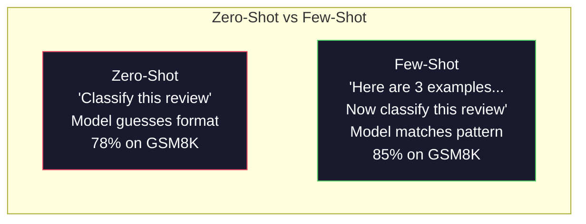
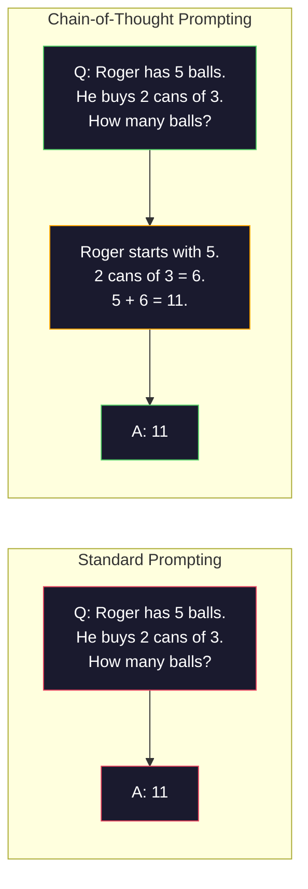
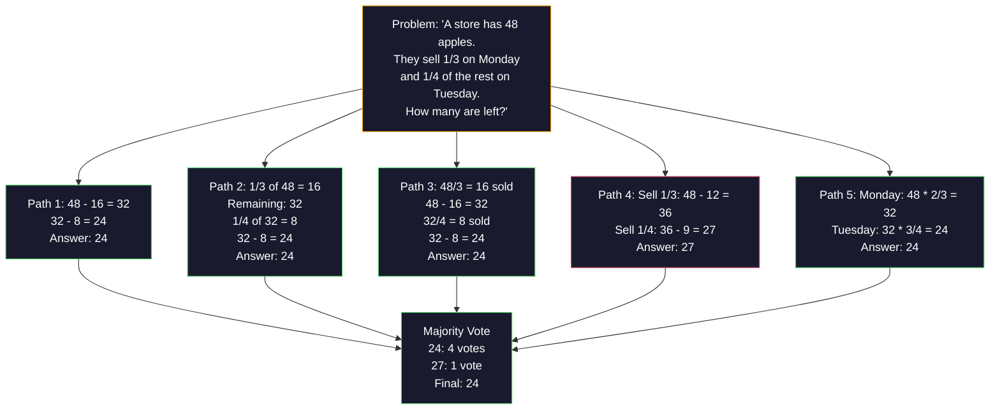
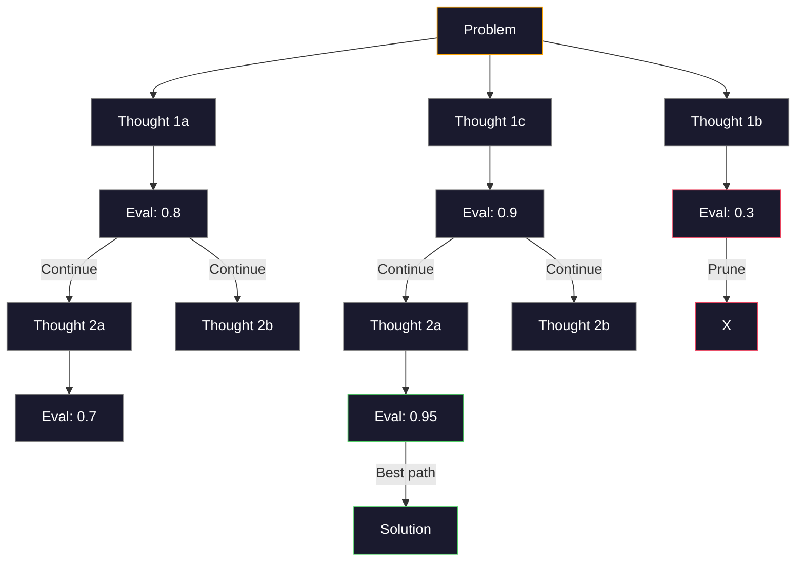

# Một vài cú bắn, một chuỗi suy nghĩ, một cây suy nghĩ

> Nói cho một mô hình những gì phải làm là thúc đẩy. Chứng tỏ nó nghĩ như thế nào là kỹ thuật. Khoảng cách giữa 78% và 91% độ chính xác trên cùng một mô hình, cùng một nhiệm vụ, cùng một dữ liệu không phải là một mô hình tốt hơn. Đó là một chiến lược lý luận tốt hơn.

**Type:** Build
**Languages:** Python
**Prerequisites:** Lesson 11.01 (Prompt Engineering)
**Time:** ~45 minutes

## Mục tiêu học tập

- Thực hiện các yêu cầu chụp ít bằng cách chọn và định dạng các ví dụ minh họa để tối đa hóa độ chính xác nhiệm vụ
- Sử dụng lý luận chuỗi suy nghĩ (CoT) để cải thiện độ chính xác trên các vấn đề đa bước như các vấn đề từ toán học
- Xây dựng một cây tư tưởng nhắc nhở khám phá nhiều con đường suy luận và chọn một tốt nhất
- Đo độ chính xác cải thiện từ 0 shot vs few shot vs CoT trên một tiêu chuẩn chuẩn

## Vấn đề

Bạn xây dựng một ứng dụng dạy toán. lời nhắc của bạn nói: "Hãy giải quyết vấn đề từ này". GPT-5 có được đúng 94% thời gian trên GSM8K, tiêu chuẩn toán học trung học. Bạn nghĩ rằng bạn đã đạt đỉnh. Bạn không  chuỗi suy nghĩ vẫn thêm 3-4 điểm.

Thêm 5 từ -- "Hãy nghĩ từng bước" -- và độ chính xác tăng lên 91%. Thêm một vài ví dụ được làm việc và nó đạt 95%. cùng một mô hình. cùng nhiệt độ. cùng chi phí API. Sự khác biệt duy nhất là bạn đã cho mô hình giấy cọp.

Đây không phải là một hack. Đó là cách lý luận hoạt động. Con người không giải quyết các vấn đề đa bước trong một bước nhảy trí tuệ. Cũng không phải là các biến đổi. Khi bạn buộc một mô hình để tạo ra các token trung gian, các token đó trở thành một phần của bối cảnh cho token tiếp theo. Mỗi bước lý luận nuôi dưỡng tiếp theo. mô hình theo nghĩa đen tính toán đường đến câu trả lời.

Nhưng "think step by step" là khởi đầu, không phải kết thúc. Nếu bạn lấy mẫu 5 con đường suy luận và lấy phiếu bầu đa số thì sao? Nếu bạn để cho mô hình khám phá một cây khả năng, đánh giá và cắt ránh thì sao? Nếu bạn kết hợp suy luận với việc sử dụng công cụ thì sao? Đây không phải là giả thuyết. Chúng là các kỹ thuật được công bố với những cải tiến được đo lường, và bạn sẽ xây dựng tất cả chúng trong bài học này.

## Khái niệm

### Zero Shot vs Few Shot: Khi ví dụ đánh bại hướng dẫn

Việc đưa ra một cú cú cú cú cú cú cú cú cú cú cú cú cú cú cú cú cú cú cú cú cú cú cú cú cú cú cú cú cú cú cú cú cú cú cú cú cú cú cú cú cú cú cú cú cú cú cú cú cú cú cú cú cú cú cú cú cú cú cú cú cú cú cú cú cú cú cú cú cú cú cú cú cú cú cú cú cú cú cú cú cú cú cú cú cú cú cú cú cú cú cú cú cú cú cú cú cú cú cú cú cú cú cú cú cú cú cú cú cú cú cú cú cú cú cú cú cú cú cú cú cú cú cú cú cú cú cú cú cú cú cú cú cú cú cú cú cú cú cú cú cú cú cú cú cú cú cú cú cú cú cú cú cú cú cú cú cú cú cú cú cú cú cú cú cú cú cú cú cú cú cú cú cú cú cú cú cú cú cú cú cú cú cú cú cú cú cú cú cú cú cú cú cú cú cú cú cú cú cú cú cú cú cú cú cú cú cú cú cú cú cú cú cú cú cú cú cú cú cú cú cú cú cú cú cú cú cú cú cú cú cú cú cú cú cú cú cú cú cú cú cú cú cú cú cú cú cú cú cú cú cú cú cú cú cú cú cú cú cú cú cú cú cú cú cú cú cú cú cú cú cú cú cú cú cú cú cú cú cú cú cú cú cú cú cú cú cú cú cú cú cú cú cú cú cú cú cú cú cú cú cú cú cú cú cú cú cú cú cú cú cú cú cú cú cú cú cú cú cú cú cú cú cú cú cú cú cú cú cú cú cú cú cú cú cú cú cú cú cú cú cú cú cú cú cú cú cú cú cú cú cú cú cú cú cú cú cú cú cú cú cú cú cú cú cú cú cú cú cú cú cú cú cú cú cú cú cú cú cú cú cú cú cú cú cú cú cú cú cú cú cú cú cú cú cú cú cú cú cú cú cú cú cú cú cú cú cú cú cú cú cú cú cú cú cú cú cú cú cú cú cú cú cú cú cú cú cú cú cú cú cú cú cú cú cú cú cú cú cú cú cú cú cú cú cú cú cú cú cú cú cú cú cú cú cú cú cú cú cú cú cú cú cú cú cú cú cú cú cú cú cú cú cú cú cú cú cú cú cú cú cú cú cú cú cú cú cú cú cú cú cú cú cú cú cú cú cú cú cú cú cú cú cú cú cú cú

Wei et al. (2022) đo lường điều này qua 8 điểm chuẩn. Đối với các nhiệm vụ đơn giản như phân loại cảm xúc, 0-shot và few-shot được thực hiện trong khoảng 2% của nhau. Đối với các nhiệm vụ phức tạp như toán học đa bước và lý luận biểu tượng, few-shot cải thiện độ chính xác 10-25%.

Nhìn giác: ví dụ là hướng dẫn nén. Thay vì mô tả định dạng đầu ra, bạn cho thấy nó. Thay vì giải thích quá trình lý luận, bạn chứng minh nó. Mô hình mô hình phù hợp với các ví dụ một cách đáng tin cậy hơn nó giải thích hướng dẫn trừu tượng.



**When few-shot wins:**các nhiệm vụ nhạy cảm với định dạng, phân loại, khai thác có cấu trúc, thuật ngữ cụ thể về lĩnh vực, bất kỳ nhiệm vụ nào mà mô hình cần phù hợp với một mẫu cụ thể.

**When zero-shot wins:**những câu hỏi thực tế đơn giản, những nhiệm vụ sáng tạo nơi các ví dụ hạn chế sự sáng tạo, những nhiệm vụ nơi việc tìm thấy những ví dụ tốt khó hơn là viết ra những hướng dẫn tốt.

### Ví dụ: Nhận chọn: Nhập tương tự ngẫu nhiên

Không phải tất cả các ví dụ đều bằng nhau. Chọn ví dụ tương tự như mục tiêu nhập sẽ vượt trội hơn sự lựa chọn ngẫu nhiên 5-15% trong các nhiệm vụ phân loại (Liu et al., 2022). Ba nguyên tắc:

1. **Semantic similarity**: chọn các ví dụ gần nhất với đầu vào trong không gian nhúng
2. **Label diversity**: bao gồm tất cả các loại đầu ra trong các ví dụ của bạn
3. **Difficulty matching**: phù hợp với mức độ phức tạp của vấn đề mục tiêu

Số lượng ví dụ tối ưu cho hầu hết các nhiệm vụ là 3-5. dưới 3, mô hình không có đủ tín hiệu để lấy mẫu. trên 5, bạn nhấn các biểu tượng trở lại giảm và lãng phí cửa sổ ngữ cảnh. Để phân loại với nhiều nhãn, sử dụng một ví dụ cho mỗi nhãn.

### Sợi dây tư tưởng: Đưa ra mô hình giấy cọ

Sự thúc đẩy chuỗi suy nghĩ (CoT) được giới thiệu bởi Wei et al. (2022) tại Google Brain. Ý tưởng đơn giản: thay vì hỏi mô hình chỉ cho câu trả lời, hãy yêu cầu nó chỉ ra các bước lý luận của nó trước.



Tại sao điều này hoạt động cơ khí? Mỗi token mà một biến thể tạo ra trở thành ngữ cảnh cho token tiếp theo. Không có CoT, mô hình phải nén tất cả các lý luận vào trạng thái ẩn của một lần đi trước duy nhất. Với CoT, mô hình ngoại hóa các tính toán trung gian như các token. Mỗi token lý luận mở rộng độ sâu tính toán hiệu quả.

**GSM8K benchmarks (grade-school math, 8.5K problems):**

| Model | Zero-Shot | Zero-Shot CoT | Few-Shot CoT |
|-------|-----------|---------------|--------------|
| GPT-4o | 78% | 91% | 95% |
| GPT-5 | 94% | 97% | 98% |
| o4-mini (reasoning) | 97% | — | — |
| Claude Opus 4.7 | 93% | 97% | 98% |
| Gemini 3 Pro | 92% | 96% | 98% |
| Llama 4 70B | 80% | 89% | 94% |
| DeepSeek-V3.1 | 89% | 94% | 96% |

**Note on reasoning models.**Các mô hình như OpenAI's o-series (o3, o4-mini) và DeepSeek-R1 chạy chuỗi suy nghĩ nội bộ trước khi phát hành câu trả lời của họ.

Hai hương vị của CoT:

**Zero-shot CoT**Không cần ví dụ. Kojima et al. (2022) cho thấy câu đơn này cải thiện độ chính xác trong các nhiệm vụ toán học, hợp lý và lý luận biểu tượng.

**Few-shot CoT**Các mô hình này có thể được xem xét theo các định dạng chính xác mà bạn mong đợi.

**When CoT hurts**: simple factual recall ("What is the capital of France?"), phân loại một bước, các nhiệm vụ mà tốc độ quan trọng hơn chính xác. CoT thêm 50-200 token của lý luận tổng cộng cho mỗi truy vấn. Đối với công việc có hiệu suất cao, độ phức tạp thấp, đó là chi phí lãng phí.

### Sự thống nhất: Kiểm tra nhiều người, bỏ phiếu một lần

Wang et al. (2023) giới thiệu tính nhất quán. Nhìn: một con đường CoT duy nhất có thể chứa các sai lầm lý luận. Nhưng nếu bạn lấy mẫu các con đường lý luận độc lập N (nghiên sử dụng nhiệt độ > 0) và lấy phiếu đa số về câu trả lời cuối cùng, sai lầm sẽ bị hủy bỏ.



Sự nhất quán tự động đã cải thiện độ chính xác GSM8K từ 56,5% (CoT đơn) lên 74,4% với N = 40 trên các thí nghiệm PaLM 540B ban đầu. Trong GPT-5, sự cải thiện là nhỏ (97% đến 98%) vì độ chính xác cơ sở đã bão hòa. Kỹ thuật này sáng nhất trên các mô hình với độ chính xác CoT cơ sở 60-85% - điểm ngọt ngào nơi các lỗi đường đơn thường xuyên nhưng không có hệ thống. Đối với các mô hình lý luận (series o, R1) sự tương thích của bản thân được tính theo mẫu nội bộ tích hợp.

Sự thỏa hiệp: N mẫu có nghĩa là Nx chi phí API và độ trễ. Trong thực tế, N=5 chiếm phần lớn lợi ích. N=3 là tối thiểu cho một phiếu bầu có ý nghĩa. N > 10 có lợi nhuận giảm đối với hầu hết các nhiệm vụ.

### Cây tư tưởng: Tìm hiểu về các chi nhánh

Yao et al. (2023) giới thiệu Tree-of-Thought (ToT). Khi CoT theo một con đường suy luận tuyến tính, ToT khám phá nhiều nhánh và đánh giá những gì hứa hẹn nhất trước khi tiếp tục.



ToT có ba thành phần:

1. **Thought generation**: tạo ra nhiều ứng cử viên bước tiếp theo
2. **State evaluation**: điểm điểm cho mỗi ứng viên (có thể sử dụng chính LLM như một đánh giá)
3. **Search algorithm**: BFS hoặc DFS qua cây, cắt các nhánh có điểm thấp

Trong Game of 24 (combinate 4 số bằng toán học để tạo ra 24), GPT-4 với prompt tiêu chuẩn giải quyết 7,3% các vấn đề. Với CoT, 4,0% (CoT thực sự đau ở đây vì không gian tìm kiếm rộng). Với ToT, 74%.

ToT đắt tiền. Mỗi nút trong cây đòi hỏi một cuộc gọi LLM. Một cây có yếu tố phân nhánh 3 và độ sâu 3 đòi hỏi đến 39 cuộc gọi LLM. Chỉ sử dụng nó cho các vấn đề nơi không gian tìm kiếm lớn nhưng có thể đánh giá - lập kế hoạch, giải quyết câu đố, giải quyết vấn đề sáng tạo với hạn chế.

### Tự phản ứng: suy nghĩ + hành động

Yao et al. (2022) kết hợp các dấu vết lý luận với hành động. Mô hình thay thế giữa suy nghĩ (tạo lý luận) và hành động (hãy gọi các công cụ, tìm kiếm, tính toán).

```mermaid
graph LR
    Q["Question:\nWhat is the\npopulation of the\ncountry where\nthe Eiffel Tower\nis located?"]
    T1["Thought: I need to\nfind which country\nhas the Eiffel Tower"]
    A1["Action: search\n'Eiffel Tower location'"]
    O1["Observation:\nParis, France"]
    T2["Thought: Now I need\nFrance's population"]
    A2["Action: search\n'France population 2024'"]
    O2["Observation:\n68.4 million"]
    T3["Thought: I have\nthe answer"]
    F["Answer:\n68.4 million"]

    Q --> T1 --> A1 --> O1 --> T2 --> A2 --> O2 --> T3 --> F

    style Q fill:#1a1a2e,stroke:#ffa500,color:#fff
    style T1 fill:#1a1a2e,stroke:#51cf66,color:#fff
    style A1 fill:#1a1a2e,stroke:#e94560,color:#fff
    style O1 fill:#1a1a2e,stroke:#808080,color:#fff
    style T2 fill:#1a1a2e,stroke:#51cf66,color:#fff
    style A2 fill:#1a1a2e,stroke:#e94560,color:#fff
    style O2 fill:#1a1a2e,stroke:#808080,color:#fff
    style T3 fill:#1a1a2e,stroke:#51cf66,color:#fff
    style F fill:#1a1a2e,stroke:#51cf66,color:#fff
```



ReAct vượt trội hơn CoT trong các nhiệm vụ chuyên sâu về kiến thức bởi vì nó có thể căn cứ lý luận của nó trên dữ liệu thực. Trên HotpotQA (câu hỏi trả lời nhiều hop), ReAct với GPT-4 đạt được 35,1% phù hợp chính xác so với 29,4% cho chỉ có CoT. Năng lực thực tế là các lỗi lý luận được sửa chữa bằng các quan sát - mô hình có thể cập nhật kế hoạch của mình giữa thực hiện.

ReAct là nền tảng của các đại lý AI hiện đại. Mỗi khung đại lý (LangChain, CrewAI, AutoGen) thực hiện một số biến thể của vòng lặp suy nghĩ-sự hành động-xem xét. Bạn sẽ xây dựng các đại lý đầy đủ trong giai đoạn 14. Bài học này bao gồm mô hình nhắc nhở.

### Structured Prompting: XML Tags, Delimiters, Header

Khi các lệnh trở nên phức tạp, cấu trúc ngăn chặn mô hình khỏi nhầm lẫn các phần. Ba cách tiếp cận:

**XML tags**(được làm tốt nhất với Claude, vững chắc ở khắp mọi nơi):
```
<context>
You are reviewing a pull request.
The codebase uses TypeScript and React.
</context>

<task>
Review the following diff for bugs, security issues, and style violations.
</task>

<diff>
{diff_content}
</diff>

<output_format>
List each issue with: file, line, severity (critical/warning/info), description.
</output_format>
```

**Markdown headers**(tối đa):
```
## Role
Senior security engineer at a fintech company.

## Task
Analyze this API endpoint for vulnerabilities.

## Input
{api_code}

## Rules
- Focus on OWASP Top 10
- Rate each finding: critical, high, medium, low
- Include remediation steps
```

**Delimiters**(tối thiểu nhưng hiệu quả):
```
---INPUT---
{user_text}
---END INPUT---

---INSTRUCTIONS---
Summarize the above in 3 bullet points.
---END INSTRUCTIONS---
```

### Sợi dây nối nhanh: Sự phân hủy theo trình tự

Một số nhiệm vụ quá phức tạp cho một lời nhắc đơn.


Các chuỗi nhịp một lần vì ba lý do:

1. **Each step is simpler**: mô hình xử lý một nhiệm vụ tập trung thay vì làm việc với tất cả mọi thứ
2. **Intermediate outputs are inspectable**: bạn có thể xác nhận và sửa đổi giữa các bước
3. **Different steps can use different models**: sử dụng mô hình rẻ tiền để khai thác, một mô hình đắt tiền để lý luận

### So sánh hiệu suất

| Technique | Best For | GSM8K Accuracy (GPT-5) | API Calls | Token Overhead | Complexity |
|-----------|----------|------------------------|-----------|----------------|------------|
| Zero-Shot | Simple tasks | 94% | 1 | None | Trivial |
| Few-Shot | Format matching | 96% | 1 | 200-500 tokens | Low |
| Zero-Shot CoT | Quick reasoning boost | 97% | 1 | 50-200 tokens | Trivial |
| Few-Shot CoT | Maximum single-call accuracy | 98% | 1 | 300-600 tokens | Low |
| Self-Consistency (N=5) | High-stakes reasoning | 98.5% | 5 | 5x token cost | Medium |
| Reasoning model (o4-mini) | Drop-in CoT replacement | 97% | 1 | hidden (2-10x internal) | Trivial |
| Tree-of-Thought | Search/planning problems | N/A (74% on Game of 24) | 10-40+ | 10-40x token cost | High |
| ReAct | Knowledge-grounded reasoning | N/A (35.1% on HotpotQA) | 3-10+ | Variable | High |
| Prompt Chaining | Complex multi-step tasks | 96% (pipeline) | 2-5 | 2-5x token cost | Medium |

Kỹ thuật phù hợp phụ thuộc vào ba yếu tố: yêu cầu độ chính xác, ngân sách thời gian trễ và dung nạp chi phí. Đối với hầu hết các hệ thống sản xuất, CoT ít chụp với một sự tương thích tự 3 mẫu bao gồm 90% trường hợp sử dụng.

```figure
few-shot-curve
```

## Hãy xây dựng nó

Chúng ta sẽ xây dựng một giải pháp giải quyết vấn đề toán học kết hợp các lời nhắc ít, lý luận chuỗi suy nghĩ, và tự quyết định nhất quán thành một đường ống dẫn. Sau đó chúng ta sẽ thêm cây suy nghĩ cho các vấn đề khó khăn.

Việc thực hiện đầy đủ là trong `code/advanced_prompting.py`Đây là những thành phần chính.

### Bước 1: Ví dụ về cửa hàng ít ảnh

Phần đầu tiên quản lý các ví dụ ít chụp và chọn những ví dụ phù hợp nhất cho một vấn đề nhất định.

```python
GSM8K_EXAMPLES = [
    {
        "question": "Janet's ducks lay 16 eggs per day. She eats three for breakfast every morning and bakes muffins for her friends every day with four. She sells every egg at the farmers' market for $2. How much does she make every day at the farmers' market?",
        "reasoning": "Janet's ducks lay 16 eggs per day. She eats 3 and bakes 4, using 3 + 4 = 7 eggs. So she has 16 - 7 = 9 eggs left. She sells each for $2, so she makes 9 * 2 = $18 per day.",
        "answer": "18"
    },
    ...
]
```

Mỗi ví dụ có ba phần: câu hỏi, chuỗi lý luận và câu trả lời cuối cùng.

### Bước 2: Tạo ra chuỗi suy nghĩ

Người xây dựng prompt tập hợp một thông điệp hệ thống, vài ví dụ chụp với chuỗi lý luận, và câu hỏi mục tiêu thành một prompt duy nhất.

```python
def build_cot_prompt(question, examples, num_examples=3):
    system = (
        "You are a math problem solver. "
        "For each problem, show your step-by-step reasoning, "
        "then give the final numerical answer on the last line "
        "in the format: 'The answer is [number]'."
    )

    example_text = ""
    for ex in examples[:num_examples]:
        example_text += f"Q: {ex['question']}\n"
        example_text += f"A: {ex['reasoning']} The answer is {ex['answer']}.\n\n"

    user = f"{example_text}Q: {question}\nA:"
    return system, user
```

Các hạn chế định dạng ("Phản ứng là [số]") là rất quan trọng. Nếu không có nó, sự nhất quán không thể trích xuất và so sánh các câu trả lời trên các mẫu.

### Bước 3: Đánh phiếu tự nhất quán

Chọn mẫu các con đường lý luận N và lấy câu trả lời đa số.

```python
def self_consistency_solve(question, examples, client, model, n_samples=5):
    system, user = build_cot_prompt(question, examples)

    answers = []
    reasonings = []
    for _ in range(n_samples):
        response = client.chat.completions.create(
            model=model,
            messages=[
                {"role": "system", "content": system},
                {"role": "user", "content": user}
            ],
            temperature=0.7
        )
        text = response.choices[0].message.content
        reasonings.append(text)
        answer = extract_answer(text)
        if answer is not None:
            answers.append(answer)

    vote_counts = Counter(answers)
    best_answer = vote_counts.most_common(1)[0][0] if vote_counts else None
    confidence = vote_counts[best_answer] / len(answers) if best_answer else 0

    return best_answer, confidence, reasonings, vote_counts
```

Nhiệt độ 0,7 là quan trọng. Ở nhiệt độ 0,0, tất cả các mẫu N sẽ giống nhau, đánh bại mục đích. Bạn cần đủ sự ngẫu nhiên cho các con đường suy luận khác nhau nhưng không phải đến mức mô hình tạo ra sự nhầm lẫn.

### Bước 4: Giải quyết suy nghĩ

Đối với các vấn đề mà lý luận tuyến tính thất bại, ToT khám phá nhiều phương pháp tiếp cận và đánh giá hướng nào là hứa hẹn nhất.

```python
def tree_of_thought_solve(question, client, model, breadth=3, depth=3):
    thoughts = generate_initial_thoughts(question, client, model, breadth)
    scored = [(t, evaluate_thought(t, question, client, model)) for t in thoughts]
    scored.sort(key=lambda x: x[1], reverse=True)

    for current_depth in range(1, depth):
        next_thoughts = []
        for thought, score in scored[:2]:
            extensions = extend_thought(thought, question, client, model, breadth)
            for ext in extensions:
                ext_score = evaluate_thought(ext, question, client, model)
                next_thoughts.append((ext, ext_score))
        scored = sorted(next_thoughts, key=lambda x: x[1], reverse=True)

    best_thought = scored[0][0] if scored else ""
    return extract_answer(best_thought), best_thought
```

Người đánh giá chính nó là một cuộc gọi LLM. Bạn hỏi mô hình: "Trong thang điểm từ 0.0 đến 1.0, con đường suy luận này có thể hứa hẹn như thế nào để giải quyết vấn đề?" Đây là cái nhìn sâu sắc chính của ToT - mô hình đánh giá các giải pháp một phần của riêng nó.

### Bước 5: Đường ống đầy đủ

Tuyến đường ống kết hợp tất cả các kỹ thuật với một chiến lược leo thang.

```python
def solve_with_escalation(question, examples, client, model):
    system, user = build_cot_prompt(question, examples)
    single_response = call_llm(client, model, system, user, temperature=0.0)
    single_answer = extract_answer(single_response)

    sc_answer, confidence, _, _ = self_consistency_solve(
        question, examples, client, model, n_samples=5
    )

    if confidence >= 0.8:
        return sc_answer, "self_consistency", confidence

    tot_answer, _ = tree_of_thought_solve(question, client, model)
    return tot_answer, "tree_of_thought", None
```

Lý thuyết leo thang: thử rẻ (single CoT) trước. Nếu sự tự tin nhất quán dưới 0,8 (hơn 4 trong 5 mẫu đồng ý), leo thang đến ToT. Điều này cân bằng chi phí và độ chính xác - hầu hết các vấn đề được giải quyết rẻ, các vấn đề khó khăn có tính toán nhiều hơn.

## Sử dụng nó

### Các lời nhắc ít ảnh được dẫn bởi mẫu

LangChain cung cấp hỗ trợ tích hợp cho các mẫu nhanh và phân tích đầu ra đơn giản hóa các mô hình chụp ít và CoT:

```python
from langchain_core.prompts import FewShotPromptTemplate, PromptTemplate
from langchain_openai import ChatOpenAI

example_prompt = PromptTemplate(
    input_variables=["question", "reasoning", "answer"],
    template="Q: {question}\nA: {reasoning} The answer is {answer}."
)

few_shot_prompt = FewShotPromptTemplate(
    examples=examples,
    example_prompt=example_prompt,
    suffix="Q: {input}\nA: Let's think step by step.",
    input_variables=["input"]
)

llm = ChatOpenAI(model="gpt-4o", temperature=0.7)
chain = few_shot_prompt | llm
result = chain.invoke({"input": "If a train travels 120 km in 2 hours..."})
```

LangChain cũng có `ExampleSelector`Các lớp cho việc chọn lựa sự tương đồng ngữ nghĩa:

```python
from langchain_core.example_selectors import SemanticSimilarityExampleSelector
from langchain_openai import OpenAIEmbeddings

selector = SemanticSimilarityExampleSelector.from_examples(
    examples,
    OpenAIEmbeddings(),
    k=3
)
```

### Các lời nhắc được biên soạn

DSPy xử lý các chiến lược nhắc nhở như là các mô-đun có thể tối ưu hóa. Thay vì làm thủ công các lời nhắc CoT, bạn xác định một chữ ký và để DSPy tối ưu hóa lời nhắc:

```python
import dspy

dspy.configure(lm=dspy.LM("openai/gpt-4o", temperature=0.7))

class MathSolver(dspy.Module):
    def __init__(self):
        self.solve = dspy.ChainOfThought("question -> answer")

    def forward(self, question):
        return self.solve(question=question)

solver = MathSolver()
result = solver(question="Janet's ducks lay 16 eggs per day...")
```

DSPy `ChainOfThought`tự động thêm dấu vết lý luận. `dspy.majority`thực hiện tính nhất quán:

```python
result = dspy.majority(
    [solver(question=q) for _ in range(5)],
    field="answer"
)
```

### So sánh: Từ Xếp nhặt vs Quát hình

| Feature | From-Scratch (this lesson) | LangChain | DSPy |
|---------|--------------------------|-----------|------|
| Control over prompt format | Full | Template-based | Automatic |
| Self-consistency | Manual voting | Manual | Built-in (`dspy.majority`) |
| Example selection | Custom logic | `ExampleSelector` | `dspy.BootstrapFewShot` |
| Tree-of-Thought | Custom tree search | Community chains | Not built-in |
| Prompt optimization | Manual iteration | Manual | Automatic compilation |
| Best for | Learning, custom pipelines | Standard workflows | Research, optimization |

## Chuyển nó

Bài học này tạo ra hai đồ tạo vật.

**1. Reasoning Chain Prompt**(`outputs/prompt-reasoning-chain.md`): một mẫu đơn giản sẵn sàng cho sản xuất cho một số lần chụp CoT với sự nhất quán.

**2. CoT Pattern Selection Skill**(`outputs/skill-cot-patterns.md`): một khung quyết định để lựa chọn kỹ thuật lý luận đúng dựa trên loại công việc, yêu cầu chính xác và hạn chế chi phí.

## Các bài tập

1. **Measure the gap**: lấy 10 vấn đề GSM8K. giải quyết mỗi vấn đề bằng cách sử dụng 0-shot, few-shot, zero-shot CoT, và few-shot CoT. ghi lại độ chính xác cho mỗi vấn đề.

2. **Example selection experiment**Đối với cùng 10 vấn đề, so sánh sự lựa chọn ví dụ ngẫu nhiên so với các ví dụ tương tự được chọn tay. đo sự khác biệt chính xác. Tại thời điểm nào chất lượng ví dụ quan trọng hơn số lượng ví dụ?

3. **Self-consistency cost curve**: chạy tính nhất quán với N=1, 3, 5, 7, 10 trên 20 vấn đề GSM8K. Độ chính xác của bản vẽ so với chi phí (tổng token).

4. **Build a ReAct loop**: mở rộng đường ống với một công cụ máy tính. Khi mô hình tạo ra một biểu thức toán học, thực hiện nó bằng Python `eval()`(trong một hộp cát) và đưa kết quả trở lại. đo lường nếu lý luận dựa trên công cụ vượt qua tinh tế CoT.

5. **ToT for creative tasks**: Chuẩn bị giải pháp Tree-of-Thought cho một nhiệm vụ viết sáng tạo: "Thiết một câu chuyện 6 từ là cả vui và buồn cười. " Sử dụng LLM như một đánh giá.

## Các điều khoản chính

| Term | What people say | What it actually means |
|------|----------------|----------------------|
| Few-shot prompting | "Give it some examples" | Including input-output demonstrations in the prompt to anchor the model's output format and behavior |
| Chain-of-Thought | "Make it think step by step" | Eliciting intermediate reasoning tokens that extend the model's effective computation before producing a final answer |
| Self-Consistency | "Run it multiple times" | Sampling N diverse reasoning paths at temperature > 0 and selecting the most common final answer by majority vote |
| Tree-of-Thought | "Let it explore options" | Structured search over reasoning branches where each partial solution is evaluated and only promising paths are expanded |
| ReAct | "Thinking + tool use" | Interleaving reasoning traces with external actions (search, compute, API calls) in a Thought-Action-Observation loop |
| Prompt chaining | "Break it into steps" | Decomposing a complex task into sequential prompts where each output feeds the next input |
| Zero-shot CoT | "Just add 'think step by step'" | Appending a reasoning trigger phrase to a prompt without any examples, relying on the model's latent reasoning capability |

## Đọc thêm

- [Chain-of-Thought Prompting Elicits Reasoning in Large Language Models](https://arxiv.org/abs/2201.11903)-- Wei et al. 2022. Bài báo CoT ban đầu từ Google Brain. Đọc các phần 2-3 cho kết quả cốt lõi.
- [Self-Consistency Improves Chain of Thought Reasoning in Language Models](https://arxiv.org/abs/2203.11171)- Wang et al. 2023. Bảng 1 có tất cả các con số bạn cần.
- [Tree of Thoughts: Deliberate Problem Solving with Large Language Models](https://arxiv.org/abs/2305.10601)- Yao et al. 2023. bài báo ToT. Kết quả trò chơi 24 trong phần 4 là điểm nổi bật.
- [ReAct: Synergizing Reasoning and Acting in Language Models](https://arxiv.org/abs/2210.03629)Yao et al. 2022. Căn cứ của các nhân viên AI hiện đại. Phần 3 giải thích vòng lặp suy nghĩ-sự hành động-sự quan sát.
- [Large Language Models are Zero-Shot Reasoners](https://arxiv.org/abs/2205.11916)- Kojima et al. 2022. "Hãy nghĩ từng bước" bài báo.
- [DSPy: Compiling Declarative Language Model Calls into Self-Improving Pipelines](https://arxiv.org/abs/2310.03714)- Khattab et al. 2023. giải quyết việc nhắc nhở như một vấn đề biên soạn. Hãy đọc nếu bạn muốn vượt qua kỹ thuật nhắc nhở thủ công.
- [OpenAI — Reasoning models guide](https://platform.openai.com/docs/guides/reasoning)- hướng dẫn nhà cung cấp khi chuỗi suy nghĩ trở thành một chế độ "sự lý luận" nội bộ, giá mỗi token so với một trò lừa cấp nhanh.
- [Lightman et al., "Let's Verify Step by Step" (2023)](https://arxiv.org/abs/2305.20050)-- các mô hình phần thưởng quy trình (PRM) đánh giá từng bước của chuỗi; tín hiệu giám sát lý luận thành công chỉ có kết quả phần thưởng.
- [Snell et al., "Scaling LLM Test-Time Compute Optimally" (2024)](https://arxiv.org/abs/2408.03314)-- nghiên cứu có hệ thống về độ dài CoT, lấy mẫu tự nhất quán và MCTS; nơi "think step by step" đi khi độ chính xác quan trọng hơn là độ trễ.
