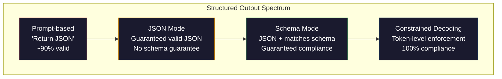
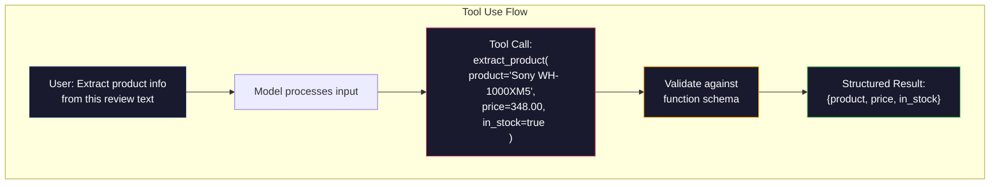

# Các sản phẩm được cấu trúc: JSON, Thiết lập Schema, Khóa mã bị hạn chế

> LLM của bạn trả lại một chuỗi. ứng dụng của bạn cần JSON. Khoảng cách đó đã bị hỏng nhiều hệ thống sản xuất hơn bất kỳ ảo giác mô hình nào. Khả năng kết cấu là cầu nối giữa ngôn ngữ tự nhiên và dữ liệu gõ. Làm đúng và LLM của bạn trở thành một API đáng tin cậy. Làm sai và bạn phân tích văn bản tự do với regex vào 3 giờ sáng.

**Type:** Build
**Languages:** Python
**Prerequisites:** Phase 10, Lessons 01-05 (LLMs from Scratch)
**Time:** ~90 minutes
**Related:**Giai đoạn 5 · 20 (Structured Outputs & Constrained Decoding) bao gồm lý thuyết cấp độ decoder (FSM/CFG logit processors, Outlines, XGrammar).`response_format`, Sử dụng công cụ nhân bản, hướng dẫn viên)  đọc giai đoạn 5 · 20 trước nếu bạn muốn hiểu những gì đang xảy ra bên dưới API.

## Mục tiêu học tập

- Thực hiện các đầu ra theo chế độ JSON và hạn chế theo schema bằng cách sử dụng các tham số OpenAI và API Anthropic
- Xây dựng một lớp xác thực Pydantic từ chối các kết quả LLM sai lầm và thử lại với phản hồi lỗi
- Giải thích cách giải mã hạn chế buộc JSON hợp lệ ở cấp token mà không cần xử lý sau
- Thiết kế các lệnh trích xuất mạnh mẽ để chuyển đổi văn bản không có cấu trúc thành cấu trúc dữ liệu được đánh dấu

## Vấn đề

Bạn hỏi một LLM: "Hãy lấy tên sản phẩm, giá và khả năng có sẵn từ văn bản này".

```
The product is the Sony WH-1000XM5 headphones, which cost $348.00 and are currently in stock.
```

Đó là một câu trả lời hoàn toàn chính xác. Nó cũng hoàn toàn vô dụng cho ứng dụng của bạn.`{"product": "Sony WH-1000XM5", "price": 348.00, "in_stock": true}`Bạn cần một đối tượng JSON với các khóa cụ thể, loại cụ thể và hạn chế giá trị cụ thể. Bạn không cần một câu.

Giải pháp ngây thơ: thêm "Câu trả lời bằng JSON" vào yêu cầu của bạn. Điều này hoạt động 90% thời gian. 10% khác mô hình bọc JSON trong hàng rào mã đánh dấu, hoặc thêm một đoạn tiền đề như "Đây là JSON:", hoặc tạo ra JSON không hợp pháp vì đã đóng một vòng đệm sớm. Bộ phân tích JSON của bạn bị hỏng. Đường ống của anh bị hỏng. Bạn thêm thử / trừ và một vòng lặp thử lại. Thỉnh thoảng, thử lại sẽ tạo ra dữ liệu khác nhau. Bây giờ bạn có một vấn đề nhất quán trên đỉnh của một vấn đề phân tích.

Đây không phải là một vấn đề kỹ thuật nhanh chóng. Đó là một vấn đề giải mã. Mô hình tạo ra token từ trái sang phải. Ở mỗi vị trí, nó chọn token tiếp theo có khả năng nhất từ một từ vựng 100K + tùy chọn. Hầu hết các tùy chọn đó sẽ tạo ra JSON không hợp lệ ở bất kỳ vị trí nào. Nếu mô hình chỉ phát ra `{"price":`, biểu tượng tiếp theo phải là một chữ số, một trích dẫn (để chuỗi),`null`- `true`- `false`Nếu không có những hạn chế, mô hình có thể chọn một từ tiếng Anh hoàn toàn hợp lý mà là thảm họa sai sót về cách diễn văn.

## Khái niệm

### Phân quang sản lượng có cấu trúc

Có bốn cấp độ kiểm soát đầu ra cấu trúc, mỗi cấp độ đáng tin cậy hơn so với mức trước.



**Prompt-based**("Câu trả lời trong JSON hợp lệ"): không thực thi. Mô hình thường tuân thủ nhưng đôi khi không. Đán cậy: ~ 90%.

**JSON mode**: API đảm bảo đầu ra là hợp lệ JSON.`response_format: { type: "json_object" }`cho phép điều này. đầu ra sẽ phân tích mà không có lỗi. Nhưng nó có thể không phù hợp với kế hoạch mong đợi của bạn - thêm phím, loại sai, mất trường.

**Schema mode**: API lấy một JSON Schema và đảm bảo đầu ra phù hợp với nó.`response_format: { type: "json_schema", json_schema: {...} }`(còn như `tool_choice="required"`), sử dụng công cụ của Anthropic với `input_schema`, và Gemini của `response_schema`+ `response_mime_type: "application/json"`. Khả năng xuất có chính xác các khóa, loại và hạn chế mà bạn đã chỉ định.

**Constrained decoding**: tại mỗi vị trí token trong quá trình tạo, decoder che giấu tất cả các token sẽ tạo ra đầu ra không hợp lệ. Nếu sơ đồ yêu cầu một số và mô hình sắp phát ra một chữ cái, token đó được đặt lên xác suất bằng không. mô hình chỉ có thể tạo ra token dẫn đến đầu ra hợp lệ. Đây là những gì chế độ đầu ra có cấu trúc của OpenAI và thư viện như Outlines và Guidance thực hiện dưới nắp.

### JSON Schema: Ngôn ngữ hợp đồng

JSON Schema là cách bạn nói với mô hình (hoặc lớp xác thực) hình dạng đầu ra phải có.

```json
{
  "type": "object",
  "properties": {
    "product": { "type": "string" },
    "price": { "type": "number", "minimum": 0 },
    "in_stock": { "type": "boolean" },
    "categories": {
      "type": "array",
      "items": { "type": "string" }
    }
  },
  "required": ["product", "price", "in_stock"]
}
```

Chế hoạch này nói: đầu ra phải là một đối tượng với một chuỗi `product`, một con số không âm `price`, một boolean `in_stock`, và một chuỗi tùy chọn`categories`Bất kỳ đầu ra nào không phù hợp đều bị từ chối.

Các sơ đồ xử lý các trường hợp khó khăn: các đối tượng tổ, các mảng có các mục được đánh dấu, enums (đặt một chuỗi vào các giá trị cụ thể), kết hợp mô hình (regex trên chuỗi), và các bộ kết hợp (oneOf, anyOf, allOf cho các đầu ra đa hình).

### Mô hình Pydantic

Trong Python, bạn không viết JSON Schema bằng tay. Bạn xác định mô hình Pydantic và nó tạo ra các sơ đồ cho bạn.

```python
from pydantic import BaseModel

class Product(BaseModel):
    product: str
    price: float
    in_stock: bool
    categories: list[str] = []
```

Điều này tạo ra cùng một JSON Schema như trên. Thư viện Instructor (và SDK của OpenAI) chấp nhận mô hình Pydantic trực tiếp: vượt qua lớp mô hình, lấy lại một phiên bản xác minh. Nếu sản xuất LLM không phù hợp, Instructor tự động thử lại.

### Chọi chức năng / Sử dụng công cụ

Một giao diện thay thế cho cùng một vấn đề. Thay vì yêu cầu mô hình tạo ra JSON trực tiếp, bạn xác định "công cụ" (công cụ) với các tham số được gõ. mô hình đưa ra một cuộc gọi hàm với các lập luận có cấu trúc. OpenAI gọi điều này là "công cụ gọi". Anthropic gọi nó là "tận dụng công cụ". Kết quả là tương tự: dữ liệu có cấu trúc.



Sử dụng công cụ được ưu tiên khi mô hình cần phải chọn hàm nào để gọi, chứ không chỉ điền vào các tham số. Nếu bạn có 10 sơ đồ khai thác khác nhau và mô hình phải chọn đúng một dựa trên đầu vào, sử dụng công cụ cung cấp cho bạn cả sự lựa chọn sơ đồ và đầu ra cấu trúc.

### Các phương thức thất bại phổ biến

Ngay cả khi thực thi kế hoạch, các kết quả được cấu trúc có thể thất bại theo những cách tinh tế.

**Hallucinated values**: đầu ra phù hợp với sơ đồ nhưng chứa dữ liệu phát minh.`{"price": 299.99}`khi văn bản nói $348. Sơ đồ xác thực không thể bắt được điều này -- kiểu là đúng, giá trị là sai.

**Enum confusion**: bạn hạn chế một trường để `["in_stock", "out_of_stock", "preorder"]`. . . . . . . . . . . . . . . . . . . . . . . . . . . . . . . . . . . . . . . . . . . . . . . . . . . . . . . . . . . . . . . . . . . . . . . . . . . . . . . . . . . . . . . . . . . . . . . . . . . . . . . . . . . . . . . . . . . . . . . . . . . . . . . . . . . . . . . . . . . . . . . . . . . . . . . . . . . . . . . . . . . . . . . . . . . . . . . . . . . . . . . . . . . . . . . . . . . . . . . . . . . . . . . . . . . . . . . . . . . . . . . . . . . . . . . . . . . . . . . . . . . . . . . . . . . . . . . . . . . . . . . . . . . . . . . . . . . . . . . . . . . . . . . . . . . . . . . . . . . . . . . . . . . . . . . . . . . . . . . . . . . . . . . . . . . . . . . . . . . . . . . . . . . . . . . . . . . . . . . . . . . . . . . . . . . . . . . . . . . . . . . . . . . . . . . . . . . . . . . . . . . . . . . . . . . . . . . . . . . . . . . . . . . . . . . . . . . . . . . . . . . . . . . . . . . . . . . . . . . . . . . . . . . . . . . . . . . . . . . . . . . . . . . . . . . . . . . . . . . . . . . . . . . . . .`"available"`- đúng ngữ nghĩa, nhưng không trong bộ được phép. decoding hạn chế tốt ngăn chặn điều này.

**Nested object depth**Các quy trình sâu (4+ cấp) tạo ra nhiều lỗi hơn.

**Array length**: mô hình có thể sản xuất quá nhiều hoặc quá ít các mục trong một mảng.`minItems`và `maxItems`nhưng không phải tất cả các nhà cung cấp thực thi chúng ở mức giải mã.

**Optional field omission**: mô hình bỏ qua các trường hợp tùy chọn kỹ thuật nhưng quan trọng về ngữ nghĩa cho trường hợp sử dụng của bạn. Đặt chúng theo yêu cầu trong sơ đồ ngay cả khi dữ liệu đôi khi bị thiếu -- buộc mô hình để sản xuất`null`rõ ràng.

```figure
mx-schema-funnel
```

## Hãy xây dựng nó

### Bước 1: JSON Schema Validator

Xây dựng một trình xác thực từ đầu để kiểm tra xem một đối tượng Python có phù hợp với một Schema JSON hay không. Đây là điều chạy trên bên đầu ra để xác minh tuân thủ.

```python
import json

def validate_schema(data, schema):
    errors = []
    _validate(data, schema, "", errors)
    return errors

def _validate(data, schema, path, errors):
    schema_type = schema.get("type")

    if schema_type == "object":
        if not isinstance(data, dict):
            errors.append(f"{path}: expected object, got {type(data).__name__}")
            return
        for key in schema.get("required", []):
            if key not in data:
                errors.append(f"{path}.{key}: required field missing")
        properties = schema.get("properties", {})
        for key, value in data.items():
            if key in properties:
                _validate(value, properties[key], f"{path}.{key}", errors)

    elif schema_type == "array":
        if not isinstance(data, list):
            errors.append(f"{path}: expected array, got {type(data).__name__}")
            return
        min_items = schema.get("minItems", 0)
        max_items = schema.get("maxItems", float("inf"))
        if len(data) < min_items:
            errors.append(f"{path}: array has {len(data)} items, minimum is {min_items}")
        if len(data) > max_items:
            errors.append(f"{path}: array has {len(data)} items, maximum is {max_items}")
        items_schema = schema.get("items", {})
        for i, item in enumerate(data):
            _validate(item, items_schema, f"{path}[{i}]", errors)

    elif schema_type == "string":
        if not isinstance(data, str):
            errors.append(f"{path}: expected string, got {type(data).__name__}")
            return
        enum_values = schema.get("enum")
        if enum_values and data not in enum_values:
            errors.append(f"{path}: '{data}' not in allowed values {enum_values}")

    elif schema_type == "number":
        if not isinstance(data, (int, float)):
            errors.append(f"{path}: expected number, got {type(data).__name__}")
            return
        minimum = schema.get("minimum")
        maximum = schema.get("maximum")
        if minimum is not None and data < minimum:
            errors.append(f"{path}: {data} is less than minimum {minimum}")
        if maximum is not None and data > maximum:
            errors.append(f"{path}: {data} is greater than maximum {maximum}")

    elif schema_type == "boolean":
        if not isinstance(data, bool):
            errors.append(f"{path}: expected boolean, got {type(data).__name__}")

    elif schema_type == "integer":
        if not isinstance(data, int) or isinstance(data, bool):
            errors.append(f"{path}: expected integer, got {type(data).__name__}")
```

### Bước 2: Mô hình theo phong cách Pydantic đến Schema

Xây dựng một trình chuyển đổi lớp thành sơ đồ tối thiểu. Định nghĩa một lớp Python và tạo sơ đồ JSON tự động.

```python
class SchemaField:
    def __init__(self, field_type, required=True, default=None, enum=None, minimum=None, maximum=None):
        self.field_type = field_type
        self.required = required
        self.default = default
        self.enum = enum
        self.minimum = minimum
        self.maximum = maximum

def python_type_to_schema(field):
    type_map = {
        str: "string",
        int: "integer",
        float: "number",
        bool: "boolean",
    }

    schema = {}

    if field.field_type in type_map:
        schema["type"] = type_map[field.field_type]
    elif field.field_type == list:
        schema["type"] = "array"
        schema["items"] = {"type": "string"}
    elif isinstance(field.field_type, dict):
        schema = field.field_type

    if field.enum:
        schema["enum"] = field.enum
    if field.minimum is not None:
        schema["minimum"] = field.minimum
    if field.maximum is not None:
        schema["maximum"] = field.maximum

    return schema

def model_to_schema(name, fields):
    properties = {}
    required = []

    for field_name, field in fields.items():
        properties[field_name] = python_type_to_schema(field)
        if field.required:
            required.append(field_name)

    return {
        "type": "object",
        "properties": properties,
        "required": required,
    }
```

### Bước 3: Trình lọc mã thông báo bị hạn chế

Mô phỏng mã hóa hạn chế. Với một chuỗi JSON một phần và một sơ đồ, xác định các danh mục mã thông báo nào hợp lệ tại vị trí hiện tại.

```python
def next_valid_tokens(partial_json, schema):
    stripped = partial_json.strip()

    if not stripped:
        return ["{"]

    try:
        json.loads(stripped)
        return ["<EOS>"]
    except json.JSONDecodeError:
        pass

    last_char = stripped[-1] if stripped else ""

    if last_char == "{":
        return ['"', "}"]
    elif last_char == '"':
        if stripped.endswith('":'):
            return ['"', "0-9", "true", "false", "null", "[", "{"]
        return ["a-z", '"']
    elif last_char == ":":
        return [" ", '"', "0-9", "true", "false", "null", "[", "{"]
    elif last_char == ",":
        return [" ", '"', "{", "["]
    elif last_char in "0123456789":
        return ["0-9", ".", ",", "}", "]"]
    elif last_char == "}":
        return [",", "}", "]", "<EOS>"]
    elif last_char == "]":
        return [",", "}", "<EOS>"]
    elif last_char == "[":
        return ['"', "0-9", "true", "false", "null", "{", "[", "]"]
    else:
        return ["any"]

def demonstrate_constrained_decoding():
    partial_states = [
        '',
        '{',
        '{"product"',
        '{"product":',
        '{"product": "Sony"',
        '{"product": "Sony",',
        '{"product": "Sony", "price":',
        '{"product": "Sony", "price": 348',
        '{"product": "Sony", "price": 348}',
    ]

    print(f"{'Partial JSON':<45} {'Valid Next Tokens'}")
    print("-" * 80)
    for state in partial_states:
        valid = next_valid_tokens(state, {})
        display = state if state else "(empty)"
        print(f"{display:<45} {valid}")
```

### Bước 4: Đường ống khai thác

Kết hợp mọi thứ vào một đường ống khai thác: xác định một kế hoạch, mô phỏng một LLM sản xuất đầu ra có cấu trúc, xác nhận đầu ra và xử lý các thử nghiệm lại.

```python
def simulate_llm_extraction(text, schema, attempt=0):
    if "headphones" in text.lower() or "sony" in text.lower():
        if attempt == 0:
            return '{"product": "Sony WH-1000XM5", "price": 348.00, "in_stock": true, "categories": ["audio", "headphones"]}'
        return '{"product": "Sony WH-1000XM5", "price": 348.00, "in_stock": true}'

    if "laptop" in text.lower():
        return '{"product": "MacBook Pro 16", "price": 2499.00, "in_stock": false, "categories": ["computers"]}'

    return '{"product": "Unknown", "price": 0, "in_stock": false}'

def extract_with_retry(text, schema, max_retries=3):
    for attempt in range(max_retries):
        raw = simulate_llm_extraction(text, schema, attempt)

        try:
            data = json.loads(raw)
        except json.JSONDecodeError as e:
            print(f"  Attempt {attempt + 1}: JSON parse error -- {e}")
            continue

        errors = validate_schema(data, schema)
        if not errors:
            return data

        print(f"  Attempt {attempt + 1}: Schema validation errors -- {errors}")

    return None

product_schema = {
    "type": "object",
    "properties": {
        "product": {"type": "string"},
        "price": {"type": "number", "minimum": 0},
        "in_stock": {"type": "boolean"},
        "categories": {"type": "array", "items": {"type": "string"}},
    },
    "required": ["product", "price", "in_stock"],
}
```

### Bước 5: Điền toàn bộ đường ống

```python
def run_demo():
    print("=" * 60)
    print("  Structured Output Pipeline Demo")
    print("=" * 60)

    print("\n--- Schema Definition ---")
    product_fields = {
        "product": SchemaField(str),
        "price": SchemaField(float, minimum=0),
        "in_stock": SchemaField(bool),
        "categories": SchemaField(list, required=False),
    }
    generated_schema = model_to_schema("Product", product_fields)
    print(json.dumps(generated_schema, indent=2))

    print("\n--- Schema Validation ---")
    test_cases = [
        ({"product": "Test", "price": 10.0, "in_stock": True}, "Valid object"),
        ({"product": "Test", "price": -5.0, "in_stock": True}, "Negative price"),
        ({"product": "Test", "in_stock": True}, "Missing price"),
        ({"product": "Test", "price": "ten", "in_stock": True}, "String as price"),
        ("not an object", "String instead of object"),
    ]

    for data, label in test_cases:
        errors = validate_schema(data, product_schema)
        status = "PASS" if not errors else f"FAIL: {errors}"
        print(f"  {label}: {status}")

    print("\n--- Constrained Decoding Simulation ---")
    demonstrate_constrained_decoding()

    print("\n--- Extraction Pipeline ---")
    texts = [
        "The Sony WH-1000XM5 headphones are priced at $348 and currently available.",
        "The new MacBook Pro 16-inch laptop costs $2499 but is sold out.",
        "This is a random sentence with no product info.",
    ]

    for text in texts:
        print(f"\n  Input: {text[:60]}...")
        result = extract_with_retry(text, product_schema)
        if result:
            print(f"  Output: {json.dumps(result)}")
        else:
            print(f"  Output: FAILED after retries")
```

## Sử dụng nó

### Các sản phẩm được cấu trúc của OpenAI

```python
# from openai import OpenAI
# from pydantic import BaseModel
#
# client = OpenAI()
#
# class Product(BaseModel):
#     product: str
#     price: float
#     in_stock: bool
#
# response = client.beta.chat.completions.parse(
#     model="gpt-5-mini",
#     messages=[
#         {"role": "system", "content": "Extract product information."},
#         {"role": "user", "content": "Sony WH-1000XM5, $348, in stock"},
#     ],
#     response_format=Product,
# )
#
# product = response.choices[0].message.parsed
# print(product.product, product.price, product.in_stock)
```

Phiên bản phát hành có cấu trúc của OpenAI sử dụng mã hóa hạn chế nội bộ. Mỗi token mô hình tạo được đảm bảo sẽ tạo ra đầu ra phù hợp với sơ đồ Pydantic. Không cần thử lại. Không cần xác thực.

### Sử dụng công cụ nhân loại

```python
# import anthropic
#
# client = anthropic.Anthropic()
#
# response = client.messages.create(
#     model="claude-opus-4-7",
#     max_tokens=1024,
#     tools=[{
#         "name": "extract_product",
#         "description": "Extract product information from text",
#         "input_schema": {
#             "type": "object",
#             "properties": {
#                 "product": {"type": "string"},
#                 "price": {"type": "number"},
#                 "in_stock": {"type": "boolean"},
#             },
#             "required": ["product", "price", "in_stock"],
#         },
#     }],
#     messages=[{"role": "user", "content": "Extract: Sony WH-1000XM5, $348, in stock"}],
# )
```

Anthropic đạt được kết quả cấu trúc thông qua việc sử dụng công cụ. mô hình phát ra một cuộc gọi công cụ với các lập luận cấu trúc phù hợp với input_schema. Kết quả tương tự, bề mặt API khác nhau.

### Thư viện hướng dẫn viên

```python
# pip install instructor
# import instructor
# from openai import OpenAI
# from pydantic import BaseModel
#
# client = instructor.from_openai(OpenAI())
#
# class Product(BaseModel):
#     product: str
#     price: float
#     in_stock: bool
#
# product = client.chat.completions.create(
#     model="gpt-5-mini",
#     response_model=Product,
#     messages=[{"role": "user", "content": "Sony WH-1000XM5, $348, in stock"}],
# )
```

Instructor gói bất kỳ khách hàng LLM nào và thêm các thử nghiệm tự động với xác thực. Nếu nỗ lực đầu tiên thất bại trong xác thực, nó sẽ gửi lỗi trở lại mô hình như ngữ cảnh và yêu cầu nó sửa chữa đầu ra. Điều này hoạt động với bất kỳ nhà cung cấp nào, không chỉ OpenAI.

## Chuyển nó

Bài học này sẽ mang lại kết quả `outputs/prompt-structured-extractor.md`-- một mẫu yêu cầu có thể sử dụng lại thu thập dữ liệu cấu trúc từ bất kỳ văn bản nào với định nghĩa schema. Cho nó một JSON Schema và văn bản không cấu trúc, và nó trả lại JSON xác nhận.

Nó cũng sản xuất `outputs/skill-structured-outputs.md`-- một khung quyết định để lựa chọn đúng chiến lược sản xuất có cấu trúc dựa trên nhà cung cấp của bạn, yêu cầu độ tin cậy, và phức tạp của kế hoạch.

## Các bài tập

1. Chuyển rộng trình xác nhận schema để hỗ trợ `oneOf`(dữ liệu phải phù hợp chính xác với một trong nhiều sơ đồ).`Product`hoặc một `Service`vật có hình dạng khác nhau.

2. Xây dựng một công cụ "chế hoạch khác biệt" so sánh hai kế hoạch và xác định các thay đổi phá vỡ (bỏ các trường yêu cầu, thay đổi loại) so với thay đổi không phá vỡ (chế độ tùy chọn thêm, hạn chế được thư giãn). Điều này là cần thiết để phiên bản các kế hoạch khai thác của bạn trong sản xuất.

3. Thực hiện một mô phỏng mã hóa hạn chế thực tế hơn. Với một Schema JSON và một từ vựng 100 mã thông báo (biểu tượng, chữ số, dấu chấm, từ khóa), đi qua quá trình tạo ra từng bước, che giấu các mã thông báo không hợp lệ tại mỗi vị trí. Đo lường tỷ lệ phần trăm từ vựng nào hợp lệ tại mỗi bước.

4. Xây dựng một bộ đánh giá khai thác. Tạo 50 mô tả sản phẩm với các đầu ra JSON được dán nhãn bằng tay. Đưa ra đường ống khai thác của bạn trên tất cả 50 và đo sự phù hợp chính xác, độ chính xác ở cấp độ trường và tuân thủ kiểu. Xác định các trường khó khăn nhất để khai thác chính xác.

5. Thêm "điểm độ tin cậy" vào đường ống khai thác của bạn. Đối với mỗi trường khai thác, ước tính mô hình có độ tin cậy như thế nào (dựa trên xác suất token, hoặc bằng cách chạy khai thác 3 lần và đo sự nhất quán).

## Các điều khoản chính

| Term | What people say | What it actually means |
|------|----------------|----------------------|
| JSON mode | "Returns JSON" | API flag that guarantees syntactically valid JSON output, but does not enforce any particular schema |
| Structured output | "Typed JSON" | Output that matches a specific JSON Schema with correct keys, types, and constraints |
| Constrained decoding | "Guided generation" | At each token position, mask out tokens that would produce invalid output -- guarantees 100% schema compliance |
| JSON Schema | "A JSON template" | A declarative language for describing the structure, types, and constraints of JSON data (used by OpenAPI, JSON Forms, etc.) |
| Pydantic | "Python dataclasses+" | Python library that defines data models with type validation, used by FastAPI and Instructor to generate JSON Schemas |
| Function calling | "Tool use" | LLM outputs a structured function invocation (name + typed arguments) instead of free text -- OpenAI and Anthropic both support this |
| Instructor | "Pydantic for LLMs" | Python library that wraps LLM clients to return validated Pydantic instances, with automatic retry on validation failure |
| Token masking | "Filtering the vocabulary" | Setting specific token probabilities to zero during generation so the model cannot produce them |
| Schema compliance | "Matches the shape" | The output has every required field, correct types, values within constraints, and no extra disallowed fields |
| Retry loop | "Try again until it works" | Send validation errors back to the model and ask it to fix the output -- Instructor does this automatically, up to a configurable max |

## Đọc thêm

- [OpenAI Structured Outputs Guide](https://platform.openai.com/docs/guides/structured-outputs)-- Tài liệu chính thức cho việc giải mã hạn chế dựa trên JSON Schema trong OpenAI API
- [Willard & Louf, 2023 -- "Efficient Guided Generation for Large Language Models"](https://arxiv.org/abs/2307.09702)-- bài viết Outlines, mô tả cách biên soạn các sơ đồ JSON thành máy trạng thái hữu hạn cho các hạn chế cấp token
- [Instructor documentation](https://python.useinstructor.com/)-- thư viện tiêu chuẩn để có được kết quả cấu trúc từ bất kỳ LLM với xác thực và thử nghiệm lại Pydantic
- [Anthropic Tool Use Guide](https://docs.anthropic.com/en/docs/tool-use)-- cách Claude thực hiện kết quả kết quả được cấu trúc qua công cụ sử dụng với JSON Schema input_schema
- [JSON Schema specification](https://json-schema.org/)-- thông số kỹ thuật đầy đủ cho ngôn ngữ schema được sử dụng bởi mỗi hệ thống đầu ra cấu trúc lớn
- [Outlines library](https://github.com/outlines-dev/outlines)-- nguồn mở hạn chế tạo sử dụng regex và JSON Schema biên soạn để máy trạng thái hữu hạn
- [Dong et al., "XGrammar: Flexible and Efficient Structured Generation Engine for Large Language Models" (MLSys 2025)](https://arxiv.org/abs/2411.15100)-- công cụ ngữ pháp hiện đại nhất; bộ sưu tập tự động đẩy xuống che giấu token ở ~ 100 ns / token.
- [Beurer-Kellner et al., "Prompting Is Programming: A Query Language for Large Language Models" (LMQL)](https://arxiv.org/abs/2212.06094)-- LMQL khung giấy hạn chế giải mã như một ngôn ngữ truy vấn với các hạn chế loại và giá trị.
- [Microsoft Guidance (framework docs)](https://github.com/guidance-ai/guidance)-- tạo ra hạn chế dựa trên mẫu; bổ sung cho nhà cung cấp-những người không biết về đường sơ đồ và XGrammar.
